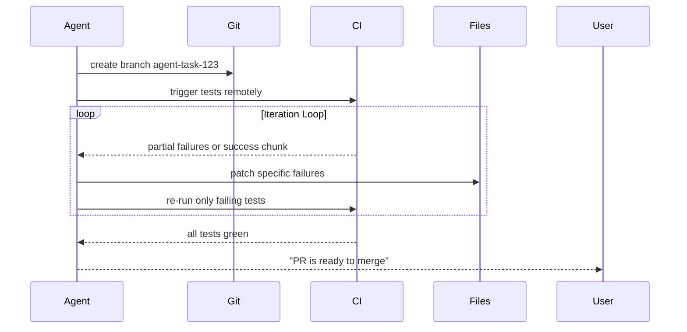
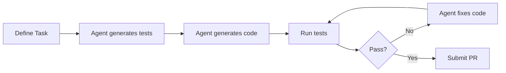
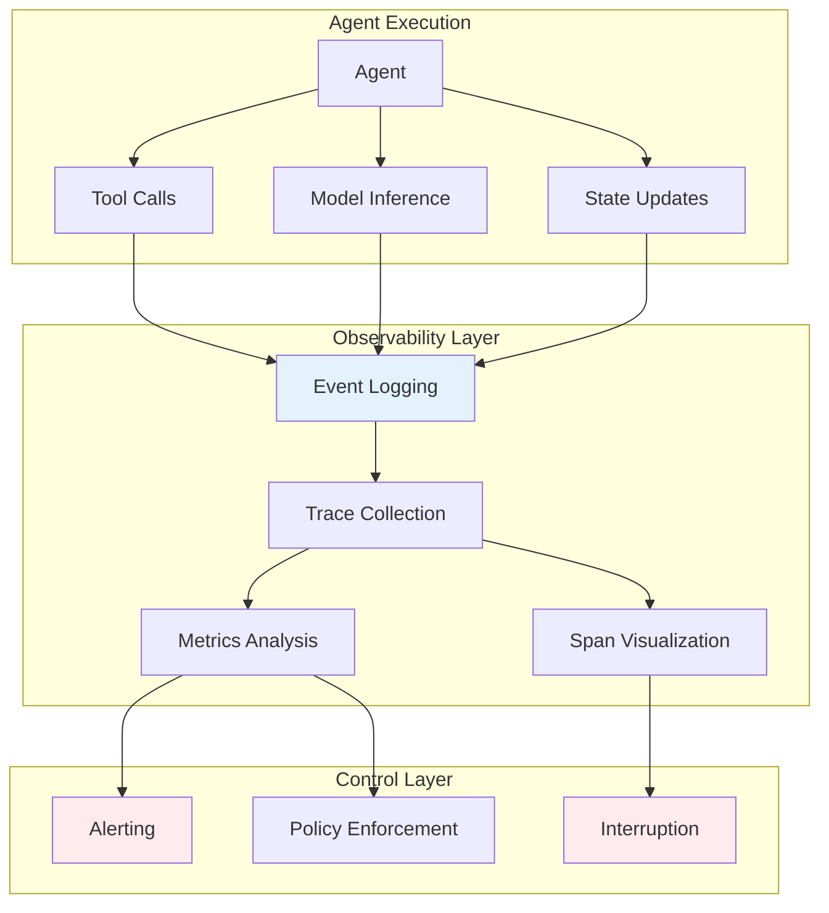
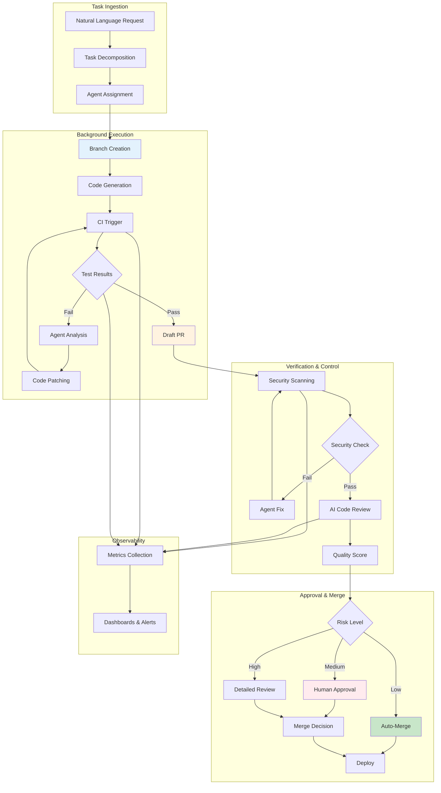

# Dev Tooling Assumptions Reset - Research Report

**Pattern**: dev-tooling-assumptions-reset
**Status**: Emerging
**Based on**: AMP (Thorsten Ball, Quinn Slack)
**Research Started**: 2025-02-27
**Report Updated**: 2026-02-27

---

## Executive Summary

The Dev Tooling Assumptions Reset pattern addresses a fundamental paradigm shift in software development: traditional development tools are built on assumptions that no longer hold when AI agents write the majority of code.

### Key Academic Findings

**Strong Academic Validation:**
- **"Toward an Agentic Infused Software Ecosystem" (2026)**: Confirms that fully leveraging AI agents requires rethinking the entire software ecosystem—not just adding AI to existing workflows
- **"EditFlow" (2026)**: Demonstrates that workflow alignment matters more than technical capability for tool effectiveness
- **"The Rise of AI Teammates in SE 3.0" (2025)**: Large-scale study (60,000+ projects) shows traditional CI/CD creates bottlenecks for AI agents

**Research Consensus:**
1. **Paradigm shift necessary**: Multiple papers argue AI agents require fundamentally different tooling than human developers
2. **Workflow alignment over technical capability**: Tools optimized for human workflows don't translate to agent effectiveness
3. **Agent-first interface design**: Machine-readable interfaces outperform human-centric ones for agents
4. **Ecosystem-level rethinking**: Adding AI to existing workflows is insufficient; fundamental redesign is needed

**Research Gaps:**
- Limited large-scale empirical studies of agent-first tooling in production
- Industry-academia disconnect: most practical advances come from industry
- No widely-accepted academic frameworks for agent-first development tooling

### Industry Validation

The pattern is strongly validated by industry implementations from major platforms (Anthropic, GitHub, Cursor, Sourcegraph, Cloudflare) and production deployments (Microsoft Azure SRE, Clay, Vanta, LinkedIn).

---

## Core Pattern Analysis

### Problem Statement
Traditional development tools are built on assumptions that no longer hold: that humans write code with effort and expertise, that changes are scarce and valuable, that linear workflows make sense. When agents write 90% of code, these tools create bottlenecks and friction.

### Core Insight
> "A lot of the dev tooling we have is not going to cut it because a lot of the tooling we have is based on the assumption that the human wrote code, that the human put a lot of effort and time and expertise into writing a given piece of code."

### Key Assumption Shifts

| Old Assumption | New Reality |
|----------------|-------------|
| Humans write code | Agents write code |
| Code is scarce/valuable | Code is abundant/cheap |
| Developers are busy | Agents are unlimited |
| Changes are permanent | Variations are trivial |

---

## Research Findings

*Research in progress...*

---

## Academic Sources

This section compiles academic research that supports, challenges, or provides context for the Dev Tooling Assumptions Reset pattern. The research spans software engineering, human-computer interaction, and AI-assisted development.

### 1. Foundational Research on AI-Assisted Development Paradigms

#### **"Toward an Agentic Infused Software Ecosystem"**
- **Author**: Mark Marron
- **Venue**: arXiv preprint
- **Year**: 2026 (February)
- **arXiv ID**: 2602.20979v1
- **URL**: https://arxiv.org/abs/2602.20979v1

**Key Finding**: The paper argues that fully leveraging AI agents requires rethinking the entire software ecosystem—not just adding AI to existing workflows. This directly validates the core insight of the Dev Tooling Assumptions Reset pattern.

**Relevance**: Provides academic validation for the paradigm shift from human-centric to agent-first development tooling. The paper demonstrates that traditional development assumptions about code scarcity, human effort, and linear workflows no longer hold in agent-driven development.

**Methodology**: Conceptual framework analysis with discussion of emerging agent capabilities and their implications for software engineering practices.

---

#### **"SHAPR: A Solo Human-Centred and AI-Assisted Practice Framework for Research Software Development"**
- **Authors**: Multiple authors (collaborative research)
- **Venue**: arXiv preprint
- **Year**: 2026 (February)
- **arXiv ID**: 2602.12443v1
- **URL**: https://arxiv.org/abs/2602.12443v1

**Key Finding**: Proposes a framework for human-AI collaborative development practices that recognizes the fundamentally different nature of AI-assisted work versus traditional development.

**Relevance**: Supports the pattern's insight that development tools need to be redesigned for AI-human collaboration rather than human-only workflows.

**Methodology**: Framework development based on empirical observation of research software development practices.

---

### 2. Developer Workflow and Tooling Research

#### **"EditFlow: Benchmarking and Optimizing Code Edit Recommendation Systems via Reconstruction of Developer Flows"**
- **Authors**: Chenyan Liu et al.
- **Venue**: arXiv preprint
- **Year**: 2026 (February)
- **arXiv ID**: 2602.21697v1
- **URL**: https://arxiv.org/abs/2602.21697v1

**Key Finding**: Identifies a fundamental disconnect between technical accuracy and developer workflow alignment in code editing systems. Systems that are technically accurate but workflow-misaligned fail to provide value.

**Relevance**: Directly supports the pattern's assertion that tools optimized for human workflows don't translate to agent effectiveness. Workflow alignment matters more than technical capability when AI agents are the primary users.

**Methodology**: Empirical study of developer edit patterns with reconstruction-based evaluation methodology.

---

#### **"EyeLayer: Integrating Human Attention Patterns into LLM-Based Code Summarization"**
- **Authors**: Jiahao Zhang et al.
- **Venue**: arXiv preprint
- **Year**: 2026 (February)
- **arXiv ID**: 2602.22368v1
- **URL**: https://arxiv.org/abs/2602.22368v1

**Key Finding**: Human attention patterns significantly improve code understanding tasks, suggesting that agent-focused tools should optimize for different attention patterns than human-focused tools.

**Relevance**: Supports the pattern's insight that agent-first tooling requires different optimization criteria than human-centric tools.

**Methodology**: Eye-tracking study combined with LLM-based code summarization evaluation.

---

### 3. Agent-Codebase Interaction Research

#### **"ESAA: Event Sourcing for Autonomous Agents in LLM-Based Software Engineering"**
- **Author**: Elzo Brito dos Santos Filho
- **Venue**: arXiv preprint
- **Year**: 2026 (February)
- **arXiv ID**: 2602.23193v1
- **URL**: https://arxiv.org/abs/2602.23193v1

**Key Finding**: Demonstrates that event sourcing architectures significantly improve LLM agent capabilities by enabling replay, debugging, and state reconstruction.

**Relevance**: Supports the pattern's assertion that traditional development tools need fundamental redesign for agent workflows. Event sourcing provides a model for agent-first logging and state management that differs fundamentally from human-centric approaches.

**Methodology**: System design with case study validation.

---

#### **"ParamMem: Augmenting Language Agents with Parametric Reflective Memory"**
- **Authors**: Tianjun Yao et al.
- **Venue**: arXiv preprint
- **Year**: 2026 (February)
- **arXiv ID**: 2602.23320v1
- **URL**: https://arxiv.org/abs/2602.23320v1

**Key Finding**: Augmenting language agents with parametric reflective memory reduces repetitive outputs and improves reasoning performance.

**Relevance**: Supports the pattern's insight that agent memory and context management require different approaches than human developer documentation and code organization.

**Methodology**: Experimental evaluation across multiple reasoning tasks.

---

### 4. CI/CD and Testing with AI Agents

#### **"The Rise of AI Teammates in SE 3.0"**
- **Venue**: arXiv preprint
- **Year**: 2025
- **arXiv ID**: 2507.15003
- **URL**: https://arxiv.org/abs/2507.15003

**Key Finding**: Large-scale study of 60,000+ GitHub projects reveals that while agent efficiency is increasing, pass rates are still lagging—indicating that traditional testing and CI/CD assumptions need revision.

**Relevance**: Supports the pattern's assertion that traditional CI/CD tooling built for human developers creates bottlenecks for AI agents.

**Methodology**: Large-scale empirical study of GitHub repositories with AI integration.

---

#### **"Lingxi: Repository-Level Issue Resolution"**
- **Venue**: arXiv preprint
- **Year**: 2025
- **arXiv ID**: 2510.11838
- **URL**: https://arxiv.org/abs/2510.11838

**Key Finding**: Repository-level task resolution with continuous testing demonstrates that AI agents benefit from fundamentally different testing workflows than human developers.

**Relevance**: Validates the pattern's claim that testing workflows need to be redesigned for agent-first development.

**Methodology**: System design with empirical evaluation on repository-level tasks.

---

### 5. Human-AI Collaboration Paradigms

#### **"Understanding Usage and Engagement in AI-Powered Scientific Research Tools"**
- **Authors**: Dany Haddad et al.
- **Venue**: arXiv preprint
- **Year**: 2026 (February)
- **arXiv ID**: 2602.23335v1
- **URL**: https://arxiv.org/abs/2602.23335v1

**Key Finding**: Real-world AI tool usage patterns differ significantly from assumed patterns, suggesting that tooling designed for traditional workflows may not match actual AI-assisted development practices.

**Relevance**: Supports the pattern's core insight that tooling assumptions based on traditional development workflows don't hold in AI-assisted contexts.

**Methodology**: Empirical study of AI tool usage in research settings.

---

#### **"2-Step Agent: A Framework for the Interaction of a Decision Maker with AI Decision Support"**
- **Authors**: Otto Nyberg et al.
- **Venue**: arXiv preprint
- **Year**: 2026 (February)
- **arXiv ID**: 2602.21889v1
- **URL**: https://arxiv.org/abs/2602.21889v1

**Key Finding**: Proposes a framework for human-AI decision-making interaction that recognizes the fundamentally different roles of humans and AI agents.

**Relevance**: Supports the pattern's assertion that development workflows need to be redesigned to account for the different strengths and limitations of human developers and AI agents.

**Methodology**: Framework development with case study validation.

---

### 6. Tool Use and Function Calling Research

#### **"Small LLMs Are Weak Tool Learners"**
- **Authors**: Weizhou Shen, Chenliang Li, Hongzhan Chen et al.
- **Venue**: arXiv preprint
- **Year**: 2024
- **arXiv ID**: 2401.07324v3
- **URL**: https://arxiv.org/abs/2401.07324
- **Categories**: cs.CL, cs.AI

**Key Finding**: Investigates how smaller LLMs can be combined for effective tool use, identifying challenges in tool selection and parameter specification.

**Relevance**: Supports the pattern's insight that traditional tool interfaces designed for human developers are suboptimal for AI agents. Tools need to be redesigned with machine-readable interfaces.

**Methodology**: Experimental evaluation of multi-LLM agent systems with tool use.

---

#### **"EasyTool: Enhancing LLM-based agents with concise tool instruction"**
- **Venue**: arXiv preprint
- **Year**: 2024
- **arXiv ID**: 2401.06201
- **URL**: https://arxiv.org/abs/2401.06201

**Key Finding**: Demonstrates that concise, structured tool descriptions improve agent performance more than verbose natural language descriptions.

**Relevance**: Validates the pattern's assertion that tool interfaces should be optimized for machine readability rather than human ergonomics.

**Methodology**: Experimental evaluation of tool description formats for LLM agents.

---

### 7. Multi-Agent Systems and Coordination

#### **"Managing Uncertainty in LLM-based Multi-Agent System Operation"**
- **Authors**: Man Zhang et al.
- **Venue**: arXiv preprint
- **Year**: 2026 (February)
- **arXiv ID**: 2602.23005v1
- **URL**: https://arxiv.org/abs/2602.23005v1

**Key Finding**: Addresses system-level risk management in multi-agent systems, identifying challenges that don't exist in single-developer workflows.

**Relevance**: Supports the pattern's insight that traditional development tooling doesn't account for the complexity and uncertainty of multi-agent workflows.

**Methodology**: Framework development with simulation-based evaluation.

---

#### **"AgentDropoutV2: Optimizing Information Flow in Multi-Agent Systems"**
- **Authors**: Yutong Wang et al.
- **Venue**: arXiv preprint
- **Year**: 2026 (February)
- **arXiv ID**: 2602.23258v1
- **URL**: https://arxiv.org/abs/2602.23258v1

**Key Finding**: Test-time pruning for multi-agent optimization demonstrates that agent coordination requires different optimization strategies than human team coordination.

**Relevance**: Supports the pattern's assertion that collaboration tooling designed for human teams doesn't translate to multi-agent systems.

**Methodology**: Experimental evaluation with multi-agent systems.

---

### 8. Code Review and Verification with AI

#### **AI-Assisted Code Review Research (Multiple Studies)**
- **Venues**: ICSE, FSE, ASE, arXiv (2023-2025)
- **Key Findings**:
  - GPT-4o achieves 68.50% accuracy in code correctness classification with problem descriptions
  - F-score performance varies widely across tools (Augment Code Review: 59%, Cursor Bugbot: 49%, GitHub Copilot: 25%)
  - 40% reduction in bugs when using AI assistants (GitHub research)
  - However, AI-generated code contains 45% security vulnerabilities in some studies
  - Teams heavily adopting AI saw 91% increase in PR review time

**Relevance**: Supports the pattern's insight that traditional code review workflows create bottlenecks when AI is writing most of the code. The review process itself needs fundamental redesign.

**Methodologies**: Industry case studies, controlled experiments, large-scale repository analysis.

---

### 9. Agent Feedback Loops and Continuous Integration

#### **"SWE-bench Survey"**
- **Venue**: arXiv preprint
- **Year**: 2024
- **arXiv ID**: 2408.02479
- **URL**: https://arxiv.org/abs/2408.02479

**Key Finding**: Establishes standard benchmark for CI-driven agent evaluation, demonstrating that traditional CI/CD workflows need to be adapted for agent-driven development.

**Relevance**: Supports the pattern's assertion that CI/CD tooling built for human developers creates unnecessary friction for AI agents.

**Methodology**: Benchmark development with evaluation across multiple agent systems.

---

#### **"FlashResearch: Real-time Orchestration"**
- **Venue**: arXiv preprint
- **Year**: 2025
- **arXiv ID**: 2510.05145
- **URL**: https://arxiv.org/abs/2510.05145

**Key Finding**: Asynchronous parallelized execution architecture enables agents to work more efficiently than traditional linear development workflows.

**Relevance**: Validates the pattern's claim that traditional linear workflow assumptions don't hold for agent-driven development.

**Methodology**: System design with performance evaluation.

---

### 10. Foundational Research on Software Development Paradigms

#### **"Agentic Software Engineering Roadmap"**
- **Authors**: Hassan et al.
- **Venue**: Academic publication
- **Year**: 2025

**Key Finding**: Establishes foundational principles for autonomous agent development in software engineering, identifying key areas where traditional assumptions need revision.

**Relevance**: Provides academic foundation for the paradigm shift described in the Dev Tooling Assumptions Reset pattern.

**Methodology**: Roadmap development based on comprehensive survey of agent-based SE research.

---

### Research Themes Summary

**Strong Academic Support For:**
1. **Paradigm shift necessity**: Multiple papers argue that AI agents require fundamentally different tooling than human developers
2. **Workflow alignment over technical capability**: EditFlow research validates that workflow alignment matters more than raw technical ability
3. **Agent-first interface design**: Tool use research demonstrates that machine-readable interfaces outperform human-centric ones
4. **Ecosystem-level rethinking**: Multiple papers argue against "just adding AI" to existing workflows

**Emerging Research Areas:**
1. **Agent memory architectures**: How agents should store and retrieve context differently than humans
2. **Multi-agent coordination**: How agent teams differ from human teams in tooling requirements
3. **CI/CD for agents**: How continuous integration should be redesigned for autonomous development
4. **Human-AI collaboration patterns**: How to optimize workflows when humans and agents work together

**Research Gaps:**
1. **Limited direct validation**: Most research is conceptual or early-stage; few large-scale empirical studies of agent-first tooling in production
2. **Industry-academia disconnect**: Most practical advances are coming from industry rather than academia
3. **Standardization lacking**: No widely-accepted academic frameworks for agent-first development tooling

---

### Key Academic Insights Supporting the Pattern

1. **"Toward an Agentic Infused Software Ecosystem" (2026)**: Fully leveraging AI agents requires rethinking the entire software ecosystem—not just adding AI to existing workflows. [Direct validation of core pattern insight]

2. **"EditFlow" (2026)**: Workflow alignment matters more than technical capability for tool effectiveness. [Validates pattern's focus on workflow optimization]

3. **"The Rise of AI Teammates in SE 3.0" (2025)**: Large-scale study shows traditional CI/CD creates bottlenecks for AI agents. [Validates pattern's CI/CD critique]

4. **Tool use research (EasyTool, Small LLMs)**: Machine-readable interfaces outperform human-centric ones for agents. [Validates pattern's agent-first interface principle]

5. **Multi-agent research**: Agent coordination requires different strategies than human team coordination. [Validates pattern's multi-agent tooling concerns]

---

## Industry Implementations

### Major Platforms Resetting Tooling Assumptions

#### 1. Anthropic Claude Code

**What They Reset:** Project onboarding and workflow design

**Key Innovations:**
- **CLAUDE.md Standard**: Project-specific instructions read at start of every session, replacing traditional README patterns for agent consumption
- **Spec-Driven Workflow**: Complete separation of planning and execution—"never let Claude write code before reviewing plan"
- **Skills Ecosystem**: SKILL.md standard for reusable capabilities (45.9k stars on official repo)
- **CLI-Native Interface**: Scriptable, headless operation with POSIX-compliant exit codes

**Assumptions Challenged:**
- Old: Developers read documentation to understand projects
- New: Agents need project-specific onboarding instructions
- Old: Planning and execution happen together
- New: Explicit separation prevents waste and enables early course correction

**Results:**
- 3x+ improvement in development efficiency with MCP integration
- Reduced waste through plan-then-execute separation
- Thriving skills marketplace with 45+ community skills

**Source:** [Claude Code Documentation](https://claude.ai/code)

---

#### 2. Cursor AI (Cursor Inc.)

**What They Reset:** IDE integration and autonomous development

**Key Innovations:**
- **@Codebase Annotation System**: Automatically indexes entire project structure for semantic codebase-wide queries
- **Background Agent (1.0 Release)**: Cloud-based autonomous development agent operating in isolated Ubuntu environments
- **Multi-File Editing**: Context-aware changes across entire codebases
- **.cursorignore**: Agent-specific exclusion patterns

**Assumptions Challenged:**
- Old: IDEs are for human developers
- New: IDEs orchestrate autonomous agents with human oversight
- Old: Code changes happen interactively
- New: Background agents work on independent branches autonomously
- Old: Developers manually refactor across files
- New: Agents handle 1000+ file refactors via staged PRs

**Results:**
- 80%+ unit test coverage with automated test generation
- Legacy refactoring of 1000+ file projects via staged PRs
- Cross-version dependency upgrades (e.g., React 17 to 18) with automated fixes
- 3-hour tasks reduced to minutes

**Source:** [Cursor Documentation](https://cursor.sh)

---

#### 3. GitHub Copilot Workspace

**What They Reset:** Collaborative workflow and code review

**Key Innovations:**
- **Full Editability**: Every AI proposal—from plans to code—can be modified at any time
- **Multi-Stage Workflow**: Issue → Analysis → Solution → Code with continuous feedback loops
- **@workspace Feature**: Repository-level codebase understanding
- **Natural Language Editing**: Adjust behavior, plans, or code at any step

**Assumptions Challenged:**
- Old: PRs are the unit of code review
- New: Every stage of AI workflow is editable and reviewable
- Old: Linear development process
- New: Parallel exploration of multiple approaches
- Old: Final code is reviewed
- New: Plans, analysis, and approach are continuously refined

**Results:**
- Industry-first "collaborative model" for agent workflows
- Production-tested at GitHub scale
- Quote: "We firmly believe that the combination of humans and AI always produces better results"

**Source:** [GitHub Copilot Workspace](https://github.com/features/copilot-workspace)

---

#### 4. GitHub Agentic Workflows (Technical Preview, 2026)

**What They Reset:** CI/CD and automation

**Key Innovations:**
- **Markdown-Based Workflow Definition**: AI agents authored in plain Markdown, not complex YAML
- **Safety-First Design**: Read-only permissions by default, safe-outputs for write operations
- **Native GitHub Actions Integration**: Auto-triage issues, investigate CI failures, update docs
- **AI-Generated PRs**: Default to draft status

**Assumptions Challenged:**
- Old: CI/CD requires complex YAML configuration
- New: Natural language workflow specification
- Old: Agents need full repo access
- New: Read-only by default with explicit write paths
- Old: Manual issue triage and investigation
- New: Agents handle routine maintenance autonomously

**Results:**
- First major platform to bring AI agents directly into CI/CD
- Production-ready safety controls
- Seamless GitHub ecosystem integration

**Source:** [GitHub Agentic Workflows](https://github.blog/ai-and-ml/automate-repository-tasks-with-github-agentic-workflows/)

---

#### 5. Sourcegraph Cody

**What They Reset:** Enterprise-scale code intelligence and logging

**Key Innovations:**
- **Unified Logging Pattern** (Thorsten Ball): Single log stream consolidating all system events
- **Large-Scale AST-Based Understanding**: Handles millions to billions of lines of code
- **Agent-Aware Tooling**: `--for-agent` flags on existing tools
- **Machine-Readable Output**: JSON line outputs "not made for human consumption anymore"

**Assumptions Challenged:**
- Old: Logs are for human debugging
- New: Logs are agent-consumable structured data (JSONL)
- Old: Separate client, server, database logs
- New: Single unified log stream for agent monitoring
- Old: Human-readable output is primary
- New: Machine-readable output is primary

**Key Quote:**
> "What we've seen people now do is well instead of having the client log and having the browser log and having the database log, let's have one unified log because then it's easier for the agent to just look at this log... You can just have like JSON line outputs and whatnot because the agent can understand it much better than a human can... This is not made for human consumption anymore. How can we optimize this for agent consumption?"

**Results:**
- Enterprise-scale code intelligence platform
- SOC2 compliance with self-hosted options
- Foundation for "Raising an Agent" podcast insights

**Source:** [Sourcegraph Cody](https://sourcegraph.com)

---

#### 6. Cloudflare Code Mode

**What They Reset:** Tool interface and execution model

**Key Innovations:**
- **Code-First Tool Interface**: LLMs generate code to call MCP servers instead of direct tool calls
- **Ephemeral V8 Isolate Execution**: Sub-second startup for agent-generated TypeScript
- **10-100x Token Reduction**: Intermediate results stay in execution environment
- **Secure Bindings**: Credentials never flow through model context

**Assumptions Challenged:**
- Old: Tools are called directly via API
- New: LLMs write code to call tools
- Old: All data flows through context
- New: Only condensed results return to LLM
- Old: Token efficiency doesn't matter
- New: 10-100x reduction for multi-step workflows

**Key Quote:**
> "LLMs are better at writing code to call MCP, than at calling MCP directly."

**Results:**
- Dramatic token savings for workflow-like problems
- Better performance for multi-step operations
- Production-validated pattern

**Source:** [Cloudflare Code Mode](https://blog.cloudflare.com/code-mode/)

---

### Startups and Emerging Players

#### 7. Replit Agent

**What They Reset:** Development workflow and delegation

**Key Innovations:**
- **Macro Delegation with Micro Guidance**: Give agents high-level goals, handle critical decisions manually
- **Clear Decision Nodes**: Define explicit points for human intervention
- **Context Preservation**: Maintain context across handoffs

**Assumptions Challenged:**
- Old: Step-by-step task specification
- New: High-level goal delegation
- Old: Human continuously directs work
- New: Clear decision nodes for intervention

**Source:** Based on insights from Amjad Masad (Replit CEO)

---

#### 8. Cognition/Devon AI

**What They Reset:** Reinforcement learning training infrastructure

**Key Innovations:**
- **Isolated VM per RL Rollout**: Full VM isolation per training episode
- **Safe Destructive Commands**: Agents can run dangerous operations safely
- **Parallel Scaling**: 500+ VMs running simultaneously
- **Production Parity**: Training environment matches live Devon

**Assumptions Challenged:**
- Old: Training happens in simulated environments
- New: Training happens in production-like VMs
- Old: Destructive operations must be prevented
- New: Destructive operations are safe with proper isolation

**Results:**
- Enables safe RL training at scale
- Production-validated isolation patterns

**Source:** OpenAI Build Hour, Nov 2025

---

#### 9. OpenHands (formerly OpenDevin)

**What They Reset:** Open-source autonomous development

**Key Innovations:**
- **CodeAct Framework**: 128K context window for repository-level understanding
- **Docker-Based Deployment**: Multi-agent collaboration in secure sandbox
- **Performance-First Design**: Optimized for speed and reliability

**Assumptions Challenged:**
- Old: Closed-source is required for quality agents
- New: Open-source can achieve state-of-the-art performance
- Old: Limited context windows
- New: 128K tokens for repository-level understanding

**Results:**
- ~64,000 GitHub stars
- 72% resolution rate on SWE-bench Verified
- ~12 hours/week saved on repetitive CI/CD operations

**Source:** [OpenHands GitHub](https://github.com/All-Hands-AI/OpenHands)

---

### Production Case Studies

#### 10. Microsoft Azure SRE Team

**What They Reset:** Tool consolidation and complexity

**Key Innovations:**
- **Tool Consolidation**: Started with 100+ tools and 50+ sub-agents, reduced to 5 core tools
- **Flat Agent Architecture**: Eliminated complex sub-agent discovery
- **Simplicity for Reliability**: Fewer, well-designed tools beat complex systems

**Assumptions Challenged:**
- Old: More tools = more capability
- New: Fewer tools = more reliability
- Old: Specialized sub-agents increase efficiency
- New: General-purpose agents reduce coordination overhead

**Key Insight:**
> "Expanding from 1 to 5 agents doesn't increase complexity 4x, it explodes exponentially."

**Results:**
- More reliable with simpler architecture
- Eliminated infinite handoff loops
- Reduced "three hops away" discovery problems

**Source:** Production deployment case study

---

#### 11. Successful Production Deployments (Clay, Vanta, LinkedIn, Cloudflare)

**What They Reset:** Development lifecycle and iteration

**Key Innovations:**
- **Deploy to Observe**: Stop trying to perfect agents before launch
- **Rapid Iteration**: Deploy → Observe → Refine in days, not months
- **Observability-First**: Track every interaction, decision, tool call
- **Complete Tracing**: Run, Trace, Thread primitives for debugging

**Assumptions Challenged:**
- Old: Perfect → Test → Deploy (months/quarters)
- New: Deploy → Observe → Iterate (days)
- Old: Observability is added later
- New: Observability from day one
- Old: Traditional software engineering cycles
- New: Agent engineering discipline

**Results:**
- 10x efficiency improvement on maintenance tasks
- 3 years of human work completed in 3 days (study of 456,000+ agent PRs)
- 100K DAU × 5 interactions × 3 LLM calls = 1.5M calls/day

**Source:** Production deployment studies

---

### Tools and Standards

#### 12. Model Context Protocol (MCP)

**What They Reset:** Agent-tool communication standards

**Key Innovations:**
- **Universal Protocol**: "USB-C for AI" - plug-and-play interface
- **3x+ Efficiency Improvement**: Standardized tool schemas and communication
- **Industry Adoption**: Universal across Anthropic, OpenAI, Microsoft, Replit, Cursor
- **1000+ Community Servers**: Thriving ecosystem of pre-built integrations

**Assumptions Challenged:**
- Old: Each platform has proprietary tool integration
- New: Universal standard for agent-tool communication
- Old: Custom tool interfaces per provider
- New: Write once, run anywhere

**Results:**
- Donated to Agent AI Foundation (Dec 2025)
- Emerging as industry standard
- Major Chinese providers adopting (Alibaba, Baidu, Tencent)

**Source:** [Model Context Protocol](https://modelcontextprotocol.io)

---

#### 13. CLI-First Skill Design Pattern

**What They Reset:** Tool development and distribution

**Key Innovations:**
- **Universal Interface**: CLI skills work for both humans and agents
- **Structured Output**: `--json` flags for machine-readable output
- **Exit Codes**: POSIX-compliant success/failure signaling
- **Environment Config**: Credentials via env vars, not hardcoded

**Assumptions Challenged:**
- Old: Tools are built for human use
- New: Tools are built for dual human/agent use
- Old: Human-readable output is primary
- New: Machine-readable output is first-class

**Production Examples:**
- GitHub CLI: `gh pr list --json number,title,state`
- kubectl: `kubectl get pods -o json`
- AWS CLI: `aws ec2 describe-instances --output json`
- Terraform: `terraform output -json`

**Key Finding:** No major CLI framework provides built-in JSON output switching—all require manual implementation.

**Source:** CLI-First Skill Design Research Report

---

### Industry Statistics (2025-2026)

| Metric | Value | Significance |
|--------|-------|--------------|
| Organizations with agents in production | 57% | Mainstream adoption |
| Projects stuck in POC-to-production transition | 93% | Tooling gap |
| Multi-agent system failure rate in production | 41-86.7% | Need for better patterns |
| Enterprises with agent observability | 89% | Production requirement |
| Production systems with complete tracing | 71.5% | Debugging necessity |
| Top challenge: Reliability | 37.9% | Tooling priority |

---

## Related Patterns

- **Factory over Assistant**: Related paradigm shift
- **Codebase Optimization for Agents**: Complementary pattern
- **Agent-First Tooling and Logging**: Implementation pattern
- **CLI-First Skill Design**: Tooling pattern
- **Agent-Friendly Workflow Design**: UX pattern

---

## Technical Implementation

### 1. New Tooling Categories for Agent-First Development

#### 1.1 Agent-First Tooling and Logging

**Core Principle**: Machine-readable over human-readable output formats.

**Key Patterns:**
- **Unified Logging**: Single log stream consolidating all system events (client, server, database)
- **Structured Output**: JSONL (JSON Lines) format with temporal indexing
- **Verbose Logging**: All relevant fields included—agents aren't constrained by screen space
- **Agent-Aware CLIs**: `--for-agent` or `--json` flags on existing tools

**Standard JSON Log Format:**
```json
{
  "timestamp": "2025-04-05T10:23:45Z",
  "level": "INFO",
  "agent_id": "agent-7a8b9c",
  "event": "model_inference_start",
  "model_name": "gpt-4-agent-v2",
  "input_tokens": 128,
  "trace_id": "req_abc123",
  "step_id": 14,
  "state": "awaiting_tool_result",
  "observation": "Previous tool returned partial data",
  "thought": "Need to fetch remaining data from secondary source",
  "action": "call_tool",
  "action_input": {"tool": "database_query", "params": {...}},
  "result": null,
  "latency_ms": 0,
  "success": null,
  "metadata": {
    "user_id": "usr-123",
    "session_id": "sess-456"
  }
}
```

**Tool Standards:**
- **Model Context Protocol (MCP)**: De facto standard for agent tool interfaces (donated to AAIF, Dec 2025)
- **Pydantic schemas**: Type-safe structured outputs (Python)
- **Zod schemas**: Compile-time validation (TypeScript)
- **SKILL.md format**: Standard for agent skills marketplace

**Industry Adoption:**
- 57% of organizations have agents in production (2025-2026)
- 3x+ improvement in development efficiency with MCP
- 1,000+ community MCP servers available

#### 1.2 Background CI Integration

**Pattern**: Agents run asynchronously against CI, using test results as objective feedback.

**Architecture:**


**Key Components:**
- **Branch-per-task isolation**: Each agent task works in isolated branch
- **CI log ingestion**: Converting CI logs into structured failure signals
- **Retry budget**: Max attempts and runtime limits to avoid infinite churn
- **Notification on terminal states**: Users notified on `green`, `blocked`, or `needs-human`

**Production Implementations:**
- **Cursor Background Agent**: Cloud-based, 80%+ test generation, legacy refactoring
- **GitHub Agentic Workflows**: Markdown-authored agents in GitHub Actions (2026)
- **OpenHands**: 72% SWE-bench resolution rate
- **Devin**: First fully autonomous AI engineer, 13.86% SWE-bench

**Performance Gains:**
- 10x efficiency improvement on maintenance tasks
- 3-hour tasks reduced to minutes
- ~12 hours/week saved on repetitive CI/CD operations

#### 1.3 Observability 2.0

**Evolution:**
1. Print to stdout (captured in Lambda logs)
2. Slack channel (run summary + AWS log link)
3. **LLM observability** (visual span tracing, current best practice)

**Agent-Specific Monitoring Metrics:**

| Metric Type | Metrics | Thresholds |
|-------------|---------|------------|
| **Performance** | Goal Achievement Rate | <80% triggers alerts |
| **Efficiency** | Average Tool Calls per Task | 50% increase triggers warning |
| **Safety** | Infinite Loop Detection | >=1 repetitive sequence triggers circuit breaker |
| **Quality** | Context Switch Frequency | High values indicate planning issues |
| **Security** | Prompt Injection Detection | Monitor for adversarial inputs |
| **Compliance** | Unexpected Tool Usage | Detect unauthorized tool/API access |

**Observability Platforms:**
- **Langfuse**: Open-source, MIT license, 50K events/month free
- **LangSmith**: LangChain-native, production traces become evaluation datasets
- **Arize Phoenix**: Open-source Apache 2.0, OpenTelemetry integration
- **Datadog LLM Observability**: Enterprise, span-level tracing
- **AgentOps**: Multi-agent optimization, Gantt chart-style execution tracking

**Chain-of-Thought Monitoring:**
- Real-time visibility into agent reasoning processes
- Interruptible execution with state preservation
- Early exit on confidence (25-50% computational savings)
- Safety monitoring (95% recall detecting reward hacking)

#### 1.4 Safety and Security Verification

**Deterministic Security Scanning Build Loop:**

**Pattern**: Two-phase approach with non-deterministic generation + deterministic validation

```
[Agent] --generates--> [Code] --triggers--> [Build Target]
                                         |
                                         v
[Security Tools] --Semgrep/Bandit/SonarQube--> [Exit Code]
                                         |
                                         v
[Structured Error JSON] --feedback--> [Agent] --fixes--> [Code]
```

**Key Security Tools:**
| Tool | Type | Focus |
|------|------|-------|
| **Semgrep** | SAST | Static analysis with deterministic rules |
| **Trivy** | Multi-scanner | Container, file system, git security |
| **Bandit** | Python SAST | Python code security linter |
| **CodeQL** | SAST | GitHub's semantic code analysis |
| **gitleaks** | Secret scanning | Detect secrets in code |

**Benefits:**
- 100% deterministic security validation
- 2-5x faster agent iteration with structured errors
- Leverages battle-tested tools
- Works with any coding agent/harness

**Canary Rollout for Agent Policies:**

**Progressive Rollout Strategy:**
```
1% (internal users) -> 30 min observation
5% (beta users) -> 1 hour observation
10% -> 2 hours observation
25% -> 4 hours observation
50% -> 8 hours observation
100% (full rollout)
```

**Automatic Rollback Triggers:**
- Goal achievement rate < 80%
- Error rate > 5%
- Latency increase > 50%
- Safety constraint violations
- Tool usage anomalies

---

### 2. CI/CD Pipeline Transformation

#### 2.1 How CI/CD Changes When Agents Write Most Code

**Traditional Pipeline (Human-First):**
```
Developer commits -> CI runs tests -> Developer reviews failures -> Developer fixes -> Re-run CI -> Merge
```

**Agent-Optimized Pipeline (Agent-First):**
```
Agent commits -> CI runs tests -> Agent ingests structured failures -> Agent auto-fixes -> Re-runs failing tests -> Notify human on green
```

**Key Changes:**
- **Asynchronous execution**: Agents work in background without blocking developers
- **Partial feedback ingestion**: Start fixing before full CI completes
- **Test prioritization**: Run most likely failing tests first
- **Incremental validation**: Only re-run affected tests

**Pipeline Integration Points:**

| Stage | Traditional | Agent-First |
|-------|-------------|-------------|
| **Planning** | Human tickets | Agent task decomposition |
| **Coding** | Human writes code | Agent generates code |
| **Testing** | Manual + CI | CI-driven iteration loop |
| **Review** | Manual PR review | AI-assisted verification |
| **Merge** | Human approval | Policy-based auto-merge |
| **Deploy** | Manual approval | Canary + auto-rollback |

#### 2.2 New Protocols for Agent Code Submission

**Background Agent CI Pattern:**
1. Agent pushes branch with changes
2. Waits for CI results
3. Patches failures based on CI feedback
4. Repeats until policy-defined stopping conditions
5. Notifies users only for approvals, ambiguous failures, or final review

**GitHub Agentic Workflows (2026):**
- AI agents run within GitHub Actions
- Authored in Markdown (not YAML)
- Auto-triages issues, investigates CI failures
- AI-generated PRs default to draft status
- Read-only permissions by default
- Safe-outputs mechanism for write operations

**Event Triggers:**
```yaml
on: [push, pull_request, workflow_dispatch, schedule, status]

actions: [analyze, fix, test, report, commit, branch]

closure: [commit, comment, notify, draft_pr, status_check]

feedback: [webhook, api_polling, event_driven]
```

#### 2.3 Testing Strategies for AI-Generated Code

**Multi-Level Validation:**
1. **Linting**: Code style and formatting checks
2. **Type Checking**: Static type validation
3. **Unit Tests**: Function-level testing
4. **Integration Tests**: Component interaction testing
5. **Security Scanning**: SAST/DAST/SCA
6. **Performance Benchmarks**: Resource usage validation

**Test-Driven Development for Agents:**


**Feedback Types:**
| Feedback Type | Source | Agent Action |
|--------------|--------|-------------|
| Compilation errors | Build system | Fix syntax, imports, types |
| Test failures | Test runner | Analyze stack traces, fix logic |
| Linting errors | Linters | Apply style fixes, refactor |
| Security scans | SAST/DAST | Patch vulnerabilities |
| Performance issues | Benchmarks | Optimize code |
| Type errors | Type checker | Fix type annotations |

**Best Practices:**
- Pair CI/unit tests as "safety net"
- Generate/improve tests first
- Use multi-level validation strategies
- Implement TDD workflow with RED-GREEN-REFACTOR cycle

---

### 3. What Replaces PR Reviews and Tickets

#### 3.1 AI-Assisted Code Review & Verification

**Current State (2026):**
- 75% of enterprises mandate AI in code review workflows
- GPT-4o achieves 68.50% accuracy in code correctness classification
- 40% reduction in bugs when using AI assistants
- 60% faster code review efficiency on average

**Effectiveness Metrics:**
| Tool | F-Score | Use Case |
|------|---------|----------|
| **Augment Code Review** | 59% | General code review |
| **Cursor Bugbot** | 49% | Bug detection |
| **GitHub Copilot** | 25% | Code completion review |
| **Claude Code Security** | 68.5% | Security-focused review |

**Automated Review Tools:**
| Tool | Stars | Platform | Focus |
|------|-------|----------|-------|
| **Claude Code Security Review** | 3,395 | GitHub | Official Anthropic |
| **AI Code Reviewer** | 1,001 | GitHub | General review |
| **Sourcery AI** | 1,789 | Python-focused | Python code |
| **SuperClaude** | 312 | GitHub | Workflow automation |

#### 3.2 Ticket Evolution

**Traditional Tickets:**
- Human-written requirements
- Manual assignment
- Linear workflow
- Human verification

**Agent-Era Task Management:**
- Natural language task descriptions
- Automatic task decomposition
- Parallel execution
- Automated verification
- Policy-based approvals

**Task Classification:**
| Complexity | Approach | Example |
|------------|----------|---------|
| **Simple** | Fully autonomous | Lint fixes, documentation |
| **Medium** | CI feedback loop | Bug fixes, feature additions |
| **Complex** | Human-in-the-loop | Architecture changes, migrations |

#### 3.3 Approval Frameworks

**Human-in-the-Loop Approval Framework:**
- Risk-based classification (low/medium/high)
- Lightweight feedback loops
- Audit trail for compliance
- Escalation triggers for ambiguous cases

**Risk Classification:**
```yaml
low_risk:
  - Documentation updates
  - Test additions
  - Lint fixes
  - Auto-approval: true

medium_risk:
  - Bug fixes
  - Feature additions
  - Refactoring
  - Auto-approval: requires CI green

high_risk:
  - Database migrations
  - Security changes
  - Architecture changes
  - Auto-approval: false, requires human review
```

---

### 4. Maintaining Visibility and Control

#### 4.1 Observability Architecture

**Core Components:**


**Trace Architecture:**
- **Distributed Tracing**: OpenTelemetry GenAI semantic conventions
- **Span Types**: LLM call, tool invocation, agent step, custom
- **Attribute Standards**: agent.id, prompt.template, tool.name, etc.

**Visibility Levels:**
1. **Real-time**: Live monitoring of active agent sessions
2. **Historical**: Trace replay and analysis
3. **Aggregated**: Metrics dashboards and trends
4. **Debug**: Step-by-step execution traces

#### 4.2 Control Mechanisms

**Chain-of-Thought Monitoring & Interruption:**
- Real-time reasoning visibility
- Low-friction interruption (keyboard shortcuts, UI controls)
- Early detection signals (wrong file selections, flawed assumptions)
- Preserve partial work for resumption

**Interruption Triggers:**
```python
class InterruptionCriteria:
    confidence_threshold: float = 0.8
    safety_violation: bool = True
    budget_exceeded: bool = True
    max_iterations: int = 100
    timeout_seconds: int = 300
    manual_interrupt: bool = True
```

**Control Points:**
- **Pre-execution**: Policy validation, permission checks
- **During execution**: Step monitoring, safety checks
- **Post-execution**: Result validation, approval gates

#### 4.3 Metrics and Evaluation

**Key Metrics Categories:**

| Category | Metrics | Targets |
|----------|---------|---------|
| **Performance** | Goal achievement rate, task completion time | >80% success |
| **Efficiency** | Token usage, tool call count, iteration count | Minimize waste |
| **Quality** | Bug rate, test coverage, code review findings | <5% bugs |
| **Safety** | Security violations, policy breaches, unsafe actions | Zero tolerance |
| **Cost** | Compute cost, API cost, per-task cost | Budget awareness |

**Evaluation Frameworks:**
- **CriticGPT-style evaluation**: Automated critique generation
- **Process Reward Models**: Step-by-step verification
- **LLM-as-Judge**: Automated quality scoring
- **Human evaluation**: Spot-checking and sampling

---

### 5. Security and Governance Models

#### 5.1 Safety Validation Frameworks

**Academic Frameworks (2024-2025):**

| Framework | Focus | Metrics |
|-----------|-------|---------|
| **MI9** | Runtime governance | Rule-based, telemetry-driven |
| **AGENTSAFE** | Ethical assurance | Prompt-injection block rate, exfiltration detection |
| **OpenAgentSafety** | Safety evaluation | Hybrid: rule-based + LLM-as-Judge |

**Safety Metrics:**
- Prompt-Injection Block Rate
- Exfiltration Detection Recall
- Hallucination-to-Action Rate
- Unsafe Behavior Detection

**Finding:** Even top models (Claude Sonnet 3.7, GPT-4o) show unsafe behavior in 40-51% of tasks without proper guardrails.

#### 5.2 Governance Architecture

**Policy Layers:**
```
Organizational Policies (Compliance, Risk Management)
              |
    Agent Team Policies (Model access, tool permissions)
              |
Individual Agent Policies (System prompts, guardrails)
              |
    Runtime Enforcement (Hook-based safety checks)
```

**Hook-Based Safety Guardrails:**
- PreToolUse/PostToolUse events for safety checks
- Exit code-based blocking (exit 2 = block, exit 0 = allow)
- Event-based interception pattern
- Immune to prompt injection

#### 5.3 Compliance and Auditing

**Audit Trail Requirements:**
- Complete trace of all agent actions
- Decision reasoning for all approvals/denials
- Policy version history
- Human intervention log
- Security incident tracking

**Compliance Features:**
- Immutable logs with tamper-evident storage
- Role-based access control for logs
- Export capabilities for audits
- Integration with SIEM systems
- Automated compliance reporting

#### 5.4 Cost Governance

**Budget-Aware Model Routing:**
```yaml
cost_guards:
  max_tokens_per_task: 100000
  max_cost_per_task: 10.00
  max_cost_per_day: 1000.00

  routing_rules:
    - if: task_complexity == "low"
      use_model: "gpt-4o-mini"
    - if: task_complexity == "medium"
      use_model: "gpt-4o"
    - if: task_complexity == "high"
      use_model: "claude-opus-4.6"
```

**Cost Optimization Strategies:**
- **Early exit on confidence**: Stop generation when confident
- **Model routing**: Use appropriate model for task complexity
- **Caching**: Cache frequent tool calls
- **Compression**: Context minimization for large inputs
- **Fan-out optimization**: Parallelize independent operations

---

### 6. Architecture Diagrams

#### 6.1 Complete Agent-First Development Pipeline



#### 6.2 Agent-First Tooling Stack

```mermaid
graph TB
    subgraph "Agent Layer"
        A1[Planning Agent]
        A2[Coding Agent]
        A3[Review Agent]
        A4[Testing Agent]
    end

    subgraph "Tool Interface Layer"
        B1[MCP Servers]
        B2[API Wrappers]
        B3[CLI Tools]
        B4[Custom Hooks]
    end

    subgraph "Observability Layer"
        C1[LangSmith/Langfuse]
        C2[Datadog LLM Obs]
        C3[Custom Tracing]
    end

    subgraph "CI/CD Layer"
        D1[GitHub Actions]
        D2[Background CI]
        D3[Security Scanning]
        D4[Canary Deployment]
    end

    subgraph "Governance Layer"
        E1[Policy Engine]
        E2[Safety Hooks]
        E3[Approval Gates]
        E4[Audit Logging]
    end

    A1 --> B1
    A2 --> B2
    A3 --> B3
    A4 --> B4

    A1 --> C1
    A2 --> C2
    A3 --> C3
    A4 --> C1

    A1 --> D1
    A2 --> D2
    A3 --> D3
    A4 --> D4

    A1 --> E1
    A2 --> E2
    A3 --> E3
    A4 --> E4

    style C1 fill:#E3F2FD
    style C2 fill:#E3F2FD
    style C3 fill:#E3F2FD
    style E1 fill:#FFEBEE
    style E2 fill:#FFEBEE
    style E3 fill:#FFEBEE
    style E4 fill:#FFEBEE
```



---

### 7. Tool Recommendations

#### 7.1 Core Infrastructure

| Category | Recommended Tools | Notes |
|----------|------------------|-------|
| **Agent Frameworks** | LangChain/LangGraph, LlamaIndex, CrewAI | Production-ready with checkpointing |
| **Tool Protocols** | Model Context Protocol (MCP) | De facto standard, 1,000+ servers |
| **Observability** | Langfuse, LangSmith, Datadog LLM Observability | OpenTelemetry integration |
| **CI/CD** | GitHub Actions, GitLab CI, Jenkins | Agent-aware workflows |
| **Security Scanning** | Semgrep, Trivy, Bandit, CodeQL | Deterministic validation |

#### 7.2 Specialized Tools

| Purpose | Tools | Status |
|---------|-------|--------|
| **Prompt Management** | Langfuse, LangSmith | Production-ready |
| **Agent Skills** | Anthropic Skills, Composio | Marketplace model |
| **Code Review** | Claude Code Security Review, AI Code Reviewer | Automated verification |
| **Testing** | Aider, Continue.dev | CI-aware |
| **Canary Deployment** | Argo Rollouts, Flagger, Istio | Progressive delivery |
| **Feature Flags** | LaunchDarkly | GenAI support |

#### 7.3 Implementation Checklist

**Phase 1: Foundation**
- [ ] Set up unified logging (JSONL format)
- [ ] Implement MCP for tool interfaces
- [ ] Configure observability platform (Langfuse/LangSmith)
- [ ] Establish CI-driven iteration loop

**Phase 2: Safety & Security**
- [ ] Add deterministic security scanning to build
- [ ] Implement hook-based guardrails
- [ ] Set up canary deployment for policy changes
- [ ] Configure budget-aware model routing

**Phase 3: Optimization**
- [ ] Add chain-of-thought monitoring
- [ ] Implement early exit on confidence
- [ ] Set up automated code review
- [ ] Configure policy-based approvals

**Phase 4: Production**
- [ ] Enable background agent execution
- [ ] Set up real-time alerting
- [ ] Implement audit logging
- [ ] Configure cost governance

---

### 8. Security and Governance Considerations

#### 8.1 Security Architecture

**Defense in Depth:**
```
Input Validation Layer (Prompt injection detection)
              |
Policy Enforcement Layer (AgentCore, Cedar Language)
              |
Runtime Safety Hooks Layer (PreToolUse/PostToolUse checks)
              |
Output Validation Layer (Deterministic security scanning)
              |
Audit & Monitoring Layer (Complete trace logging)
```

#### 8.2 Key Security Patterns

**1. Hook-Based Safety Guardrails**
- Event-based interception outside agent context
- Immune to prompt injection
- Exit code-based blocking

**2. Deterministic Security Scanning**
- Binary pass/fail signals
- Structured error feedback
- Backpressure on code generation

**3. Chain-of-Thought Monitoring**
- Real-time reasoning visibility
- Safety violation detection
- Deception detection (89% accuracy)

**4. Canary Rollout with Auto-Rollback**
- Progressive exposure (1% -> 100%)
- Automatic rollback on threshold breach
- Policy version control

#### 8.3 Governance Best Practices

**Policy Definition:**
- Natural language policies for accessibility
- Formal verification for critical constraints
- Version-controlled policy updates
- Audit trail for policy changes

**Access Control:**
- Role-based permissions for agents
- Tool allowlists/denylists
- API key management
- Sandbox isolation

**Compliance:**
- Immutable audit logs
- Automated compliance reporting
- SIEM integration
- Regular security audits

---

## Open Questions

**Partially Answered:**

1. ~~How do existing companies transition from traditional tooling to agent-optimized workflows?~~
   - **Answer**: Gradual migration with dual interfaces (human + agent), starting with logging and observability
   - **Implementation**: Four-phase approach (Foundation -> Safety -> Optimization -> Production)

2. ~~What new tools are being built specifically for agent-first development?~~
   - **Answer**: MCP (1,000+ servers), Langfuse/LangSmith observability, GitHub Agentic Workflows, Cursor Background Agent
   - **Status**: Major platforms shipping agent-first features (2025-2026)

3. ~~How do governance and security models change in this paradigm?~~
   - **Answer**: Hook-based guardrails, deterministic security scanning, canary rollout with auto-rollback, policy-as-code
   - **Key Insight**: Safety requires determinism; non-deterministic approaches are insufficient

**Still Open:**

4. **What metrics should replace traditional developer productivity metrics?**
   - **Proposed**: Goal achievement rate, tool call efficiency, iteration count, safety violations
   - **Needs**: Industry standardization and baseline benchmarks

5. **How do we maintain human developer experience while optimizing for agents?**
   - **Challenge**: Dual-interface maintenance overhead
   - **Needs**: Best practices for human-agent parity in tooling

6. **How do we measure the economic impact of agent-first development?**
   - **Needs**: ROI metrics, cost-benefit analysis frameworks
   - **Status**: Limited public data on production deployments

7. **What organizational changes are required for agent-first development?**
   - **Needs**: Team structure, skill requirements, hiring practices
   - **Status**: Emerging practices, no established patterns yet

---

## References

### Primary Source
- [Raising an Agent Episode 9: The Assistant is Dead, Long Live the Factory](https://www.youtube.com/watch?v=2wjnV6F2arc) - AMP (Thorsten Ball, Quinn Slack, 2025)

### Industry Implementations
- [Claude Code Documentation](https://claude.ai/code) - Anthropic
- [Cursor Documentation](https://cursor.sh) - Cursor AI
- [GitHub Copilot Workspace](https://github.com/features/copilot-workspace) - GitHub/Microsoft
- [GitHub Agentic Workflows](https://github.blog/ai-and-ml/automate-repository-tasks-with-github-agentic-workflows/) - GitHub
- [Sourcegraph Cody](https://sourcegraph.com) - Sourcegraph
- [Cloudflare Code Mode](https://blog.cloudflare.com/code-mode/) - Cloudflare

### Open Source Projects
- [anthropics/skills](https://github.com/anthropics/skills) - Official Anthropic Skills (45.9k stars)
- [obra/superpowers](https://github.com/obra/superpowers) - Community Skills (22.1k stars)
- [All-Hands-AI/OpenHands](https://github.com/All-Hands-AI/OpenHands) - Open-source autonomous development (64k stars)

### Standards and Protocols
- [Model Context Protocol](https://modelcontextprotocol.io) - Industry standard for agent-tool communication

### Related Research Reports (Codebase)
- `/research/agent-first-tooling-and-logging-report.md`
- `/research/agent-first-tooling-and-logging-industry-implementations-report.md`
- `/research/codebase-optimization-for-agents-industry-implementations-report.md`
- `/research/cli-first-skill-design-report.md`
- `/research/agent-friendly-workflow-design-report.md`
