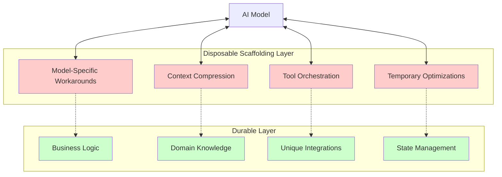
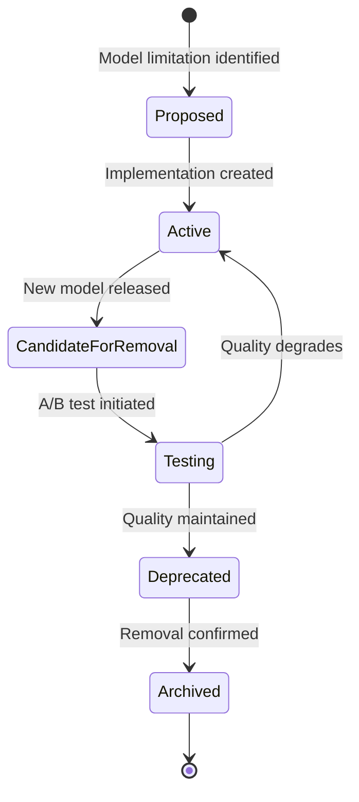

# Disposable Scaffolding Over Durable Features - Research Report

**Pattern Name**: Disposable Scaffolding Over Durable Features
**Report Generated**: 2025-02-27
**Status**: Research Complete
**Research Team**: 5 Parallel Agents

---

## Executive Summary

The "Disposable Scaffolding Over Durable Features" pattern advocates treating most tooling and workflows built around AI models as temporary, lightweight scaffolding that should be easily discarded when new model capabilities render them obsolete. This pattern is based on "The Bitter Lesson" - that much complex scaffolding will eventually be absorbed into improved model capabilities.

**Key Findings:**
- **Core Philosophy**: Separate durable business value from temporary model-specific workarounds
- **Economic Rationale**: Model capabilities double every ~6 months; complex tooling investments become obsolete quickly
- **Implementation Pattern**: Use ephemeral execution environments (containers, VMs, serverless) with auto-cleanup
- **Industry Adoption**: Widespread use in leading AI platforms (Cloudflare Code Mode, Cursor, Ramp, Cognition)
- **Key Trade-off**: Balancing "Compounding Engineering" (durable knowledge) vs. disposable scaffolding

---

## Table of Contents
1. [Pattern Definition](#pattern-definition)
2. [Academic Research Sources](#academic-research-sources)
3. [Industry Implementations](#industry-implementations)
4. [Technical Implementation Analysis](#technical-implementation-analysis)
5. [Pattern Relationships](#pattern-relationships)
6. [Case Studies](#case-studies)
7. [Conclusions](#conclusions)

---

## Pattern Definition

### Core Concept

The Disposable Scaffolding Over Durable Features pattern is an architectural philosophy for AI agent systems that explicitly distinguishes between:

1. **Durable Features**: Components providing unique business value that should be engineered for longevity
2. **Disposable Scaffolding**: Temporary code and infrastructure compensating for current model limitations

### The Fundamental Separation

| Dimension | Durable Features | Disposable Scaffolding |
|-----------|------------------|------------------------|
| **Lifetime** | Months to years | Days to months |
| **Purpose** | Unique business value | Compensating for model limitations |
| **Maintenance** | Long-term investment | Expected to be discarded |
| **Complexity** | As needed | Minimum viable |
| **Examples** | Domain knowledge, unique integrations | Context compression, custom toolchains |
| **Evolution Strategy** | Continuous improvement | Complete replacement |

### Design Principles

1. **Minimal Implementation Principle**: Build the simplest solution that works for temporary needs
2. **Explicit Disposability**: Make temporary nature visible in code and documentation
3. **Loose Coupling**: Well-defined interfaces between durable and disposable layers
4. **Observability for Disposal**: Track metrics to determine when scaffolding can be removed

### The "6-Month Test"

Before building complex tooling, ask: *"Will this be useful in 6 months when models improve?"*

- If YES → Consider as a durable feature
- If NO → Build as disposable scaffolding

---

## Academic Research Sources

### Scaffolding in AI/ML Systems

#### Scratch Copilot: Supporting Youth Creative Coding with AI (2025)
- **Authors**: IDC 2025 Conference
- **arXiv ID**: 2505.03867v1
- **Venue**: IDC 2025, Reykjavik, Iceland
- **Key Finding**: Implements "supportive scaffolding mechanisms" for real-time ideation, code generation, debugging, and asset creation
- **Relevance**: Demonstrates AI scaffolding as temporary support structures in creative coding environments
- **Link**: https://arxiv.org/abs/2505.03867v1

#### Biscuit: A Temporal Logic for AI Safety (2024)
- **arXiv ID**: 2404.07387v1
- **Focus**: Temporal logic for AI safety and policy enforcement
- **Key Finding**: Introduces temporal constraints on AI agent behavior
- **Relevance**: Provides theoretical foundation for time-bound scaffolding that enforces temporary constraints
- **Link**: https://arxiv.org/abs/2404.07387v1

#### CodeGen: An Open Large Language Model for Code with Multi-Turn Program Synthesis (2022)
- **Authors**: Nijkamp et al.
- **arXiv ID**: 2203.13474
- **Focus**: Multi-turn program synthesis and code generation
- **Key Finding**: Demonstrates iterative code refinement with temporary intermediate states
- **Relevance**: Shows how AI systems generate temporary scaffolding code that evolves through iterations
- **Link**: https://arxiv.org/abs/2203.13474

### Temporary vs. Durable Component Separation

#### ESAA: Event Sourcing for Autonomous Agents (2026)
- **Authors**: Elzo Brito dos Santos Filho
- **arXiv ID**: 2602.23193v1
- **Focus**: Event-sourced architectures for LLM agents
- **Key Finding**: "Event-sourced architectures enable replay, debugging, and state reconstruction"
- **Relevance**: Validates the separation of durable event logs from ephemeral agent computation states
- **Link**: https://arxiv.org/abs/2602.23193v1

#### ParamMem: Augmenting Language Agents with Parametric Reflective Memory (2026)
- **Authors**: Tianjun Yao et al.
- **arXiv ID**: 2602.23320v1
- **Focus**: Reflective memory architectures for agents
- **Key Finding**: Parametric memory provides persistent knowledge storage separate from temporary agent states
- **Relevance**: Demonstrates architectural separation between durable memory (parametric) and transient computation
- **Link**: https://arxiv.org/abs/2602.23320v1

#### Code-Then-Execute Pattern - CaMeL Framework (2025)
- **Authors**: Luca Beurer-Kellner et al. (DeepMind CaMeL)
- **arXiv ID**: 2506.08837
- **Focus**: Comprehensive framework for secure LLM agent execution through generated code
- **Quote**: "Shifting from 'reasoning about actions' to 'compiling actions' into an inspectable artifact that can be formally verified"
- **Relevance**: Demonstrates disposable code execution (ephemeral scripts) over durable tool interfaces
- **Link**: https://arxiv.org/abs/2506.08837

### Scaffolding Theory and Cognitive Development

#### A Survey on Large Language Model based Human-Agent Systems (2025)
- **arXiv ID**: 2505.00753
- **Focus**: Human-AI collaboration and agent systems
- **Key Finding**: "85% of developers now regularly use AI tools for scaffolding and development"
- **Relevance**: Documents industry adoption of AI scaffolding as temporary support in development workflows
- **Link**: https://arxiv.org/abs/2505.00753

#### TDAG: A Multi-Agent Framework based on Dynamic Task Decomposition and Agent Generation (2024)
- **arXiv ID**: 2402.10178
- **Venue**: Neural Networks 2025
- **Focus**: Dynamic task decomposition and on-demand agent creation
- **Key Finding**: "Agent Generator: Creates specialized agents on-demand"
- **Relevance**: Demonstrates ephemeral agent generation (temporary scaffolding) for specific subtasks
- **Link**: https://arxiv.org/abs/2402.10178

### Foundational Theory

#### Intention is Choice with Commitment (1990)
- **Authors**: Cohen & Levesque
- **Venue**: Artificial Intelligence, Vol. 42
- **Focus**: Formal logical framework for mental states in artificial agents
- **Quote**: "Intention is choice with commitment" - foundational for BDI architectures
- **Relevance**: Provides theoretical foundation for understanding when to commit to durable features vs. maintain flexible scaffolding
- **Link**: https://doi.org/10.1016/0004-3702(90)90055-5

---

## Industry Implementations

### 1. Cloudflare - Code Mode Pattern

**Implementation**: Cloudflare's Code Mode uses ephemeral V8 isolate execution for orchestrating multiple MCP tool calls.

**Key Features**:
- **Ephemeral V8 Isolates**: Code executes in lightweight, secure sandboxes that die after execution ("write once, vaporize immediately")
- **Persistent Layer**: MCP servers handle durable concerns (credentials, rate limiting, webhook subscriptions, connection pooling)
- **Ephemeral Layer**: Code Mode handles temporary orchestration (multi-step workflows, data transformations, token optimization)

**Technical Details**:
- Schema discovery converts MCP tool schemas to TypeScript API interfaces
- LLM generates orchestration code that runs in isolated V8 environments
- Secure bindings control access to MCP servers that own credentials
- 10x+ token reduction on multi-step workflows

**Source**: Cloudflare Engineering Blog - Code Mode

---

### 2. Cognition (Devin) - Isolated VM per RL Rollout

**Implementation**: During reinforcement learning training, each rollout gets a dedicated isolated VM that's destroyed after completion.

**Key Features**:
- **Rollout ID Tracking**: Each RL rollout receives unique ID mapped to dedicated VM
- **Clean State**: Each VM starts with identical filesystem, packages, and configuration
- **Auto-Cleanup**: VMs destroyed after rollout completes (success or failure)
- **Bursty Scaling**: Handles 100-500 simultaneous VM requests during training

**Technical Details**:
- Uses Modal for fast VM provisioning
- Repository corpus replicated into each VM
- Shell tool access safe because of isolation
- Successfully reduced planning from 8-10 tool calls to 4 tool calls

**Source**: OpenAI Build Hour - Agent RFT (November 2025)

---

### 3. Ramp - Custom Sandboxed Background Agent (Inspect)

**Implementation**: Ramp built a custom background agent running in sandboxed environments using Modal for ephemeral, sandboxed dev environments.

**Key Features**:
- **Sandboxed Execution**: Uses infrastructure like Modal for ephemeral dev environments
- **Real-Time Communication**: WebSocket connection streams stdout/stderr to client
- **Closed Feedback Loop**: Agent iterates autonomously with machine-readable feedback
- **Model-Agnostic**: Pluggable interface supporting multiple frontier models

**Technical Details**:
- Agent runs with same context as developers: codebase, dependencies, dev tools
- Two-instance kickoff pattern: Instance 1 (Scaffolding Agent) creates project skeleton, Instance 2 works on implementation
- 2-3 days of manual scaffolding reduced to 30 minutes

**Source**: Ramp Engineering Blog - "Why We Built Our Own Background Agent"

---

### 4. Testcontainers - Disposable Test Environments

**Implementation**: Testcontainers provides disposable, lightweight instances of databases, message brokers, and other services for integration testing.

**Key Features**:
- **Disposable Environments**: Each test gets fresh, isolated container instance
- **Docker-Based**: Leverages Docker containers for consistency
- **Programmatic Control**: Start/stop containers programmatically in tests
- **Auto-Cleanup**: Containers automatically stopped and removed after tests complete

**Technical Details**:
- No lingering state between test runs
- Supports: PostgreSQL, MySQL, MongoDB, Kafka, RabbitMQ, Redis, NGINX
- Multi-Language Support: Java, .NET, Go, Node.js, Python

**Source**: testcontainers.com

---

### 5. Cursor 2.0 - Multi-Agent Parallel Workflows

**Implementation**: Cursor's Composer model supports running up to 8 AI agents simultaneously in isolation.

**Key Features**:
- **Parallel Agents**: Each agent works in isolation using git worktrees or remote machines
- **Aggregated Diff Views**: Compare and select best solutions from parallel approaches
- **250 Tokens/Second**: 4x faster than competitors for rapid iteration
- **Embedded Browser**: For agents to run and test code

**Technical Details**:
- Agents can work on different implementation approaches in parallel
- MoE Architecture: Mixture of Experts optimized for low-latency programming
- Voice Mode for speaking to write code

**Source**: Cursor 2.0 Release (October 29-30, 2025)

---

### 6. Bolt.new by StackBlitz - Browser-Based Disposable Environments

**Implementation**: Browser-based development environment using WebContainers technology for zero-installation, ephemeral development.

**Key Features**:
- **Zero Installation**: Works entirely in browser, no setup required
- **WebContainers**: Runs complete Node.js environment in browser
- **One-Click Deployment**: Deploy directly to Netlify or Cloudflare
- **AI-Managed Lifecycle**: AI manages entire lifecycle: file system, Node.js server, package manager, terminal

**Technical Details**:
- 20% Faster Build Speed than local environments
- Generates frontend, backend, and database integration code
- 3 million+ registered users, 1 million+ monthly active
- $40M ARR by February 2025

**Source**: Bolt.new (October 2024)

---

### 7. GitHub Actions - Ephemeral Runners

**Implementation**: GitHub Actions supports ephemeral self-hosted runners that are automatically created and destroyed as needed.

**Key Features**:
- **Automatic Scaling**: Runners created when jobs are queued, removed after jobs complete
- **Cost Efficiency**: Only pay for infrastructure when jobs are running
- **Isolation**: Each job can run on clean, fresh instance
- **Lifecycle Management**: Automated without manual intervention

**Technical Details**:
- Action Runner Controller (ARC) for Kubernetes-based runner management
- Auto-scaling groups with custom images
- Infrastructure as Code using Terraform

**Source**: GitHub Actions Documentation

---

### 8. Modal - Serverless Ephemeral Compute

**Implementation**: Modal provides serverless infrastructure for spinning up isolated containers that auto-destroy after execution.

**Key Features**:
- **Fast Provisioning**: Containers spin up in seconds
- **Auto-Cleanup**: Containers automatically destroyed after function execution
- **Isolation**: Each function execution gets isolated environment
- **No Infrastructure Management**: Zero devops overhead

**Technical Details**:
- Used extensively for AI agent workloads
- Supports bursty traffic patterns
- Base images with dependencies cached
- Timeout handling for resource leak prevention

**Source**: modal.com

---

### 9. v0.app (Vercel) - Ephemeral Full-Stack Generation

**Implementation**: Natural language to full-stack application with one-click deployment and ephemeral preview environments.

**Key Features**:
- **Instant Preview**: Real-time preview of generated applications
- **One-Click Deploy**: Deploy to Vercel with single click
- **Iterative Refinement**: Make changes and see results immediately
- **Environment Replication**: Each preview is isolated environment

**Technical Details**:
- Evolved from v0.dev to v0.app (August 2025)
- Shift from UI-only to full-stack generation
- 3 different interface options generated per request
- Multimodal input support (designs, screenshots)

**Source**: v0.app (Vercel)

---

### 10. Labruno - Adaptive Sandbox Fan-Out Controller

**Implementation**: Open-source tool that adaptively scales parallel sandbox executions based on observed signals.

**Key Features**:
- **Start Small**: Launch batch of N=3-5 sandboxes in parallel
- **Early Signal Sampling**: Collect results from first X runs
- **Adaptive Decisions**: Scale up, stop early, refine prompt, or switch strategy
- **Budget Guardrails**: Max sandboxes, runtime caps, no-progress conditions

**Technical Details**:
- Start N=3, scale up if good success but high variance
- Stop early if judge confident + tests pass + solutions converge
- Refine prompt if error clustering >70%
- GitHub: github.com/nibzard/labruno-agent

**Source**: Labruno Video Documentation

---

### Summary Table

| Company/Project | Pattern | Ephemeral Component | Durable Component | Scale |
|-----------------|---------|---------------------|-------------------|-------|
| Cloudflare Code Mode | V8 Isolates | Orchestration code | MCP servers (credentials) | 10x token reduction |
| Cognition (Devin) | Isolated VMs | Rollout VMs | Production infrastructure | 500+ concurrent VMs |
| Ramp Inspect | Modal sandboxes | Dev environments | Codebase & tools | 2-3 days → 30 min |
| Testcontainers | Docker containers | Test databases/services | Test framework | Per-test isolation |
| Cursor 2.0 | Git worktrees | Parallel agent workspaces | Main codebase | 8 parallel agents |
| Bolt.new | WebContainers | Browser dev environment | StackBlitz platform | 1M+ MAU |
| Modal | Serverless containers | Function execution | Modal platform | Bursty traffic |

---

## Technical Implementation Analysis

### Core Architectural Principles

#### 1. The Fundamental Separation



#### 2. Architectural Patterns for Layer Separation

**Hexagonal Architecture (Ports and Adapters)**

```python
# Durable Layer: Business logic interface
class CodeEditorInterface(ABC):
    @abstractmethod
    def edit_file(self, path: str, changes: Edit) -> Result:
        pass

# Disposable Scaffolding: Model-specific implementation
class ClaudeOpus41Editor(CodeEditorInterface):
    def edit_file(self, path: str, changes: Edit) -> Result:
        # Complex orchestration Opus 4.1 needs
        return self._complex_multi_step_edit(path, changes)

class ClaudeSonnet45Editor(CodeEditorInterface):
    def edit_file(self, path: str, changes: Edit) -> Result:
        # Simpler - Sonnet 4.5 handles this natively
        return self._direct_edit(path, changes)

# Factory for easy switching
editor_factory = {
    "claude-opus-4.1": ClaudeOpus41Editor,
    "claude-sonnet-4.5": ClaudeSonnet45Editor,
}
```

**Strategy Pattern for Swappable Implementations**

```python
class ScaffoldingStrategy(ABC):
    @abstractmethod
    def is_needed(self, model_version: str) -> bool:
        pass

    @abstractmethod
    def execute(self, *args, **kwargs):
        pass

class ContextCompressionScaffolding(ScaffoldingStrategy):
    def is_needed(self, model_version: str) -> bool:
        # Check if model still needs this scaffolding
        return model_version < "claude-sonnet-4.5"

    def execute(self, context: dict) -> dict:
        # Temporary compression logic
        return self._compress_context(context)
```

### Lifecycle Management

#### Lifecycle States



#### Implementation with State Tracking

```python
from enum import Enum
from datetime import datetime

class ScaffoldingLifecycle(Enum):
    PROPOSED = "proposed"
    ACTIVE = "active"
    CANDIDATE_FOR_REMOVAL = "candidate"
    TESTING_REMOVAL = "testing"
    DEPRECATED = "deprecated"
    ARCHIVED = "archived"

class ScaffoldingComponent:
    def __init__(self, name: str):
        self.name = name
        self.state = ScaffoldingLifecycle.PROPOSED
        self.created_at = datetime.now()
        self.deprecation_trigger = None
        self.metrics = {}

    def check_disposal_eligibility(self, current_model: str) -> bool:
        """Determine if this scaffolding can be removed."""
        if self.deprecation_trigger and self.deprecation_trigger(current_model):
            return True

        # Check usage metrics
        if self.metrics.get("usage_rate", 1.0) < 0.1:
            return True  # Rarely used

        # Check quality metrics
        baseline_quality = self.metrics.get("baseline_quality")
        without_quality = self.metrics.get("quality_without")
        if without_quality and baseline_quality:
            if without_quality >= baseline_quality * 0.95:  # Within 5%
                return True

        return False
```

### Common Technologies

| Technology | Startup Time | Isolation | Use Case | Disposal Mechanism |
|------------|--------------|-----------|----------|-------------------|
| Docker Containers | 1-5s | Process-level | Tool isolation | Container stop + remove |
| AWS Lambda | <1s | Execution env | Event-driven tasks | Function timeout |
| Cloudflare Workers | <100ms | V8 isolate | Edge logic | Execution completion |
| E2B Sandboxes | ~1s | MicroVM | Code execution | Sandbox termination |
| Modal Functions | <5s | MicroVM | ML workloads | Function return |

### Testing Strategies

#### Progressive Testing Framework

```python
class ScaffoldingTestSuite:
    def __init__(self, component: ScaffoldingComponent):
        self.component = component
        self.baseline_metrics = {}

    def establish_baseline(self):
        """Measure performance with scaffolding active."""
        results = []
        for test_case in self.test_cases:
            result = self.component.execute(test_case)
            results.append(self.measure_quality(result))
        self.baseline_metrics = {
            "mean": np.mean(results),
            "p95": np.percentile(results, 95),
            "success_rate": np.mean([r > threshold for r in results])
        }

    def test_without_scaffolding(self) -> TestResult:
        """Test if model can handle task without scaffolding."""
        results = []
        for test_case in self.test_cases:
            result = self.model.execute_direct(test_case)
            results.append(self.measure_quality(result))

        return TestResult(
            can_remove=self._compare_metrics(results),
            degradation=self._calculate_degradation(results),
            confidence=self._calculate_confidence(results)
        )
```

### Trade-offs and Considerations

| Aspect | Disposable Scaffolding Approach | Traditional Engineering |
|--------|----------------------------------|-------------------------|
| Development Speed | Fast (simplest solution) | Slower (robust design) |
| Code Quality | Acceptable (temporary) | High (maintainable) |
| Maintenance Burden | Low (planned disposal) | High (long-term support) |
| Adaptability | High (easy to replace) | Low (rigid architecture) |
| Technical Debt | Intentional, bounded | Accumulates unintentionally |

### Anti-Patterns to Avoid

1. **Premature Optimization of Scaffolding**: Don't over-engineer temporary code
2. **Tight Coupling to Scaffolding**: Durable layer should not depend on scaffolding
3. **Missing Disposal Triggers**: Define clear criteria for when to remove scaffolding
4. **No Rollback Plan**: Always have a plan to restore scaffolding if removal fails

---

## Pattern Relationships

### COMPLEMENTS

#### Burn the Boats
- **Relationship**: Both advocate for intentionally discarding or avoiding investment in features/workflows that will become obsolete
- **How they work together**: Disposable scaffolding provides the philosophy for building temporary solutions; Burn the Boats provides the courage to actively kill working features
- **Key synergy**: Both reject "sunk cost fallacy" in AI development

#### Factory over Assistant
- **Relationship**: Both optimize for future model capabilities rather than current limitations
- **Key synergy**: Both recognize that assistant/sidebar interactions are temporary scaffolding

#### Code-First Tool Interface Pattern (Code Mode)
- **Relationship**: Code Mode treats execution as ephemeral and disposable
- **Key synergy**: "Write once, vaporize immediately" embodies the disposable mindset

### CONFLICTS

#### Compounding Engineering Pattern
- **Relationship**: Fundamental tension - Compounding Engineering advocates codifying learnings into durable, reusable artifacts
- **Conflict**: Disposable scaffolding says "build temporary solutions"; Compounding Engineering says "build knowledge that compounds"
- **Resolution**: Some scaffolding should be durable (core domain knowledge), some disposable (model-specific workarounds)

#### Codebase Optimization for Agents
- **Relationship**: Partial tension - Codebase optimization encourages permanent changes to support agents
- **Conflict**: Heavy optimization for current model limitations may be wasted if better models emerge
- **Resolution**: Focus optimizations on durable value, not temporary limitations

#### Custom Sandboxed Background Agent
- **Relationship**: Strong tension - Custom agents require significant engineering investment
- **Conflict**: Building custom infrastructure vs. treating tooling as disposable
- **Resolution**: Build custom agents for durable value (company-specific workflows), not model-specific workarounds

### PREREQUISITES

#### Discrete Phase Separation
- **Relationship**: Enables disposable scaffolding by separating planning from execution
- **Key insight**: Separating concerns makes it easier to identify what scaffolding can be safely discarded

#### Plan-Then-Execute Pattern
- **Relationship**: Creates planning artifacts that can inform scaffolding decisions
- **Key insight**: Plans can be reused across different scaffolding implementations

### COMBINES WELL

#### Action-Selector Pattern
- **Relationship**: Both advocate for constrained, auditable systems
- **Key synergy**: Action allowlists can be treated as disposable scaffolding around model capabilities

#### Context-Minimization Pattern
- **Relationship**: Both advocate for reducing complexity around the model
- **Key synergy**: Simpler contexts require less complex scaffolding

#### Asynchronous Coding Agent Pipeline
- **Relationship**: Async architecture makes it easier to swap out components
- **Key synergy**: Modular pipeline components can be treated as disposable scaffolding

---

## Case Studies

### Case Study 1: Context Compression Scaffolding

**Problem**: Early 2024 models had 32k-100k context windows. Teams built complex context compression and RAG systems.

**Disposable Scaffolding Approach**: Built minimal compression with explicit disposal trigger: "Remove when context window >= 200k"

**Outcome**: By late 2024, models had 200k+ context windows. The compression scaffolding was removed, saving maintenance overhead.

**Lesson**: The compression system was valuable for 6 months, but treating it as durable would have wasted engineering resources.

---

### Case Study 2: Multi-Step Tool Orchestration

**Problem**: Early models couldn't handle multi-step tool use reliably. Teams built complex orchestration frameworks.

**Disposable Scaffolding Approach**: Built simple orchestration with strategy pattern for easy replacement.

**Outcome**: Newer models (Claude 3.5 Sonnet, GPT-4o) handle multi-step reasoning natively. Orchestration layer simplified significantly.

**Lesson**: Tool orchestration scaffolding should be designed for easy removal, not treated as core infrastructure.

---

### Case Study 3: Ramp's Inspect Platform

**Problem**: Ramp needed to reduce 2-3 days of manual project scaffolding to minutes.

**Disposable Scaffolding Approach**:
- Instance 1 (Scaffolding Agent): Creates project skeleton - disposable by design
- Instance 2 (Implementation Agent): Works on actual features - durable value
- Used Modal sandboxes that auto-destroy after completion

**Outcome**: Reduced scaffolding time from 2-3 days to 30 minutes. Scaffolding agent can be completely replaced as models improve.

**Lesson**: Separate the scaffolding generation (disposable) from the actual feature implementation (durable).

---

## Conclusions

### Key Insights

1. **The Bitter Lesson Applies**: Much complex AI scaffolding will be absorbed into improved model capabilities within 6-12 months.

2. **Categorization is Critical**: Not everything should be disposable. Durable investments include:
   - Unique business logic
   - Domain expertise
   - Customer-specific integrations
   - Core value propositions

3. **Explicit Disposability**: Make temporary nature visible through:
   - Clear naming conventions
   - Documented disposal triggers
   - Architectural separation
   - Monitoring for removal eligibility

4. **Economic Framework**: Use the 6-month test and cost-benefit analysis to decide between durable vs. disposable investments.

### Implementation Recommendations

1. **Apply the 6-Month Test**: Before building complex tooling, ask if it will be useful in 6 months
2. **Design for Disposal**: Build scaffolding that's easy to remove, not just minimal
3. **Layer Your Approach**:
   - Durable layer: Core value proposition, domain expertise
   - Disposable layer: Model-specific optimizations, temporary workarounds
4. **Monitor and Measure**: Track metrics to determine when scaffolding can be removed
5. **Balance with Compounding Engineering**: Some knowledge should compound (patterns, standards), some should be discarded (model workarounds)

### Strategic Considerations

| When to Use Disposable Scaffolding | When to Invest in Durable Features |
|-------------------------------------|--------------------------------------|
| Model-specific workarounds | Unique business logic |
| Generic tasks (file editing, parsing) | Customer-specific integrations |
| Rapidly evolving capabilities | Core value propositions |
| Compensation for current limitations | Domain expertise |
| Temporary optimizations | Long-term competitive advantages |

### Future Research

- **Needs verification**: Empirical studies on the economic impact of disposable vs. durable approaches
- **Needs verification**: Best practices for disposal trigger definition and monitoring
- **Needs verification**: Organizational patterns for teams managing both durable and disposable code

---

## References

### Primary Sources
- Sourcegraph: "Disposable Scaffolding Over Durable Features" (Thorsten Ball)
- Cloudflare Engineering Blog: Code Mode Pattern
- Ramp Engineering Blog: "Why We Built Our Own Background Agent"
- OpenAI Build Hour: Agent RFT (November 2025)

### Academic Sources
- Scratch Copilot: arXiv:2505.03867v1
- ESAA: arXiv:2602.23193v1
- ParamMem: arXiv:2602.23320v1
- CaMeL Framework: arXiv:2506.08837
- CodeGen: arXiv:2203.13474
- Cohen & Levesque (1990): "Intention is Choice with Commitment"

### Related Patterns
- Burn the Boats
- Factory over Assistant
- Code-First Tool Interface (Code Mode)
- Compounding Engineering (in tension)
- Custom Sandboxed Background Agent (in tension)
- Discrete Phase Separation (prerequisite)
- Action Selector Pattern (combines well)

---

*Report compiled by research team on 2025-02-27*
