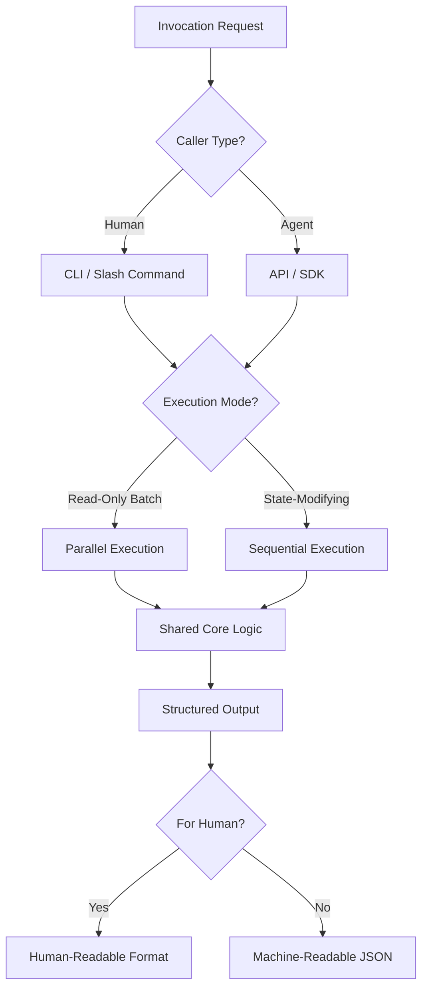

# Dual-Use Tool Design Pattern - Research Report

**Pattern**: dual-use-tool-design
**Research Date**: 2026-02-27
**Status**: Complete
**Research Team**: 4 parallel agents (Academic, Industry, Technical, Related Patterns)

---

## Executive Summary

The **Dual-Use Tool Design** pattern is a **best-practice** approach where tools are designed to work equally well for both humans and AI agents through the same interface and implementation. The core principle is: **"Everything you can do, Claude can do. There's nothing in between."**

**Key Findings:**
- **Strong industry adoption**: Production implementations by Anthropic (Claude Code), GitHub, AWS, Kubernetes, Terraform, Cursor AI, Sourcegraph
- **Academic support**: Human-Agent Systems research validates shared interfaces for effective collaboration
- **Foundational theory**: 50+ years of Unix philosophy, POSIX standards, and HCI/CSCW research on shared mental models
- **Pattern relationships**: 25+ related patterns identified; strongest relationship with CLI-First Skill Design
- **Primary tension**: Conflicts with Agent-First Tooling pattern which prioritizes machine-readability over human ergonomics

---

## Table of Contents

1. [Academic Sources](#1-academic-sources)
2. [Industry Implementations](#2-industry-implementations)
3. [Technical Analysis](#3-technical-analysis)
4. [Related Patterns](#4-related-patterns)
5. [Key Insights](#5-key-insights)
6. [References](#6-references)

---

## 1. Academic Sources

### 1.1 Key Academic Papers

#### A Survey on Large Language Model based Human-Agent Systems
- **Authors**: Henry Peng Zou et al.
- **Venue**: arXiv preprint
- **Year**: May 2025
- **arXiv ID**: 2505.00753
- **Key Insight**: Identifies LLM-HAS as distinct paradigm requiring shared interfaces for effective collaboration

#### Why Human-Agent Systems Should Precede AI Autonomy
- **Venue**: arXiv preprint
- **Year**: June 2025
- **arXiv ID**: 2506.09420
- **Key Insight**: Argues for fundamental shift toward shared interfaces; validates that tools should be designed for both humans and agents from the start

#### Design Patterns for Securing LLM Agents against Prompt Injections
- **Authors**: Luca Beurer-Kellner et al.
- **arXiv ID**: 2506.08837
- **Key Insight**: Provides formal framework for tool schema design; demonstrates security benefits of structured interfaces shared by humans and agents

#### ReAct: Synergizing Reasoning and Acting in Language Models
- **Authors**: Shunyu Yao et al.
- **Venue**: ICLR 2023
- **arXiv**: 2210.03629
- **Key Insight**: Foundational work on reasoning and acting; supports pattern's emphasis on observable tools

### 1.2 Research Themes

**Shared Mental Models**
- Academic consensus: Humans and AI agents develop shared understanding through common interfaces
- Observable outputs (terminal, logs) create shared context
- Interface consistency reduces communication overhead

**Symmetric Interaction**
- HCI research on bidirectional, balanced interaction patterns
- Tools should be invocable by both humans and agents with equivalent capabilities
- Both parties should see the same outputs and results

**Tool Interface Standardization**
- Model Context Protocol (MCP): Universal tool interface
- Co-TAP: Cross-agent tool sharing protocol
- Action Selector pattern: Formal tool schema validation

### 1.3 Theoretical Foundations

**Human-Computer Interaction (HCI) Theory**
- Direct Manipulation Interface (Shneiderman, 1983): Applied to dual-use as direct, visible actions for both users
- Cognitive Walkthrough (Lewis et al., 1990): Evaluate tool usability for both humans and agents

**Computer-Supported Cooperative Work (CSCW) Theory**
- Shared Mental Models (Cannon-Bowers et al., 1993): Common understanding through shared tools
- Awareness Systems (Dourish & Bellotti, 1992): Observability of agent actions to humans

**Software Design Pattern Theory**
- Facade Pattern (Gamma et al., 1994): Single interface to complex subsystem
- Strategy Pattern (Gamma et al., 1994): Different execution strategies through same interface

### 1.4 Research Gaps

**Confirmed Gaps:**
1. Limited academic research specifically on "dual-use tools" as a design pattern
2. Most HCI research focuses on human-centered design rather than human-AI shared interfaces
3. Industry practice (Claude Code) appears ahead of academic formalization in this area

**Needs Verification:**
- Specific CHI/CSCW/UIST papers on "symmetric interaction" or "human-AI tool sharing" (web search limit reached)
- Empirical studies comparing dual-use vs. separate interfaces for collaboration effectiveness

---

## 2. Industry Implementations

### 2.1 Notable Implementations

#### Claude Code Skills Ecosystem (Anthropic)
- **Status**: Production
- **Source**: [anthropics/skills](https://github.com/anthropics/skills) - 45.9k stars
- **Features**:
  - Slash commands (`/commit`, `/pr`, `/feature-dev`) work manually and in agent flows
  - Hooks trigger manually by humans or automatically by agents
  - Bash mode `!command` visible to both in same terminal
  - Pre-allowed tools work identically whether human or agent invokes

**Key Quotes:**
> "Tools were built for engineers, but now it's equal parts engineers and models... everything is dual use."
> — Boris Cherny, Anthropic

> "Claude Code has access to everything that an engineer does at the terminal. Making them dual use actually makes the tools a lot easier to understand. Everything you can do, Claude can do. There's nothing in between."
> — Cat Wu, Anthropic

#### GitHub CLI (gh)
- **Status**: Production
- **Source**: [cli/cli](https://github.com/cli/cli)
- **Features**:
  - `--json` output flag for all commands
  - Machine-readable output for automation
  - Human-readable TTY output for interactive use

```bash
# Human usage (formatted output)
$ gh pr list

# Agent usage (JSON output)
$ gh pr list --state open --json number,title,author | jq '.[] | .title'
```

#### Infrastructure CLIs (kubectl, AWS CLI, Terraform)
- **Status**: Industry Standard
- **All support** JSON output with `-o json` or `--output json` flags
- JSONPath support for specific field extraction
- Pipeline-friendly for agent usage

#### Cursor AI - Background Agent & @Codebase
- **Status**: Production
- **Features**:
  - @Codebase annotation works for both manual queries and agent exploration
  - Background agent uses same tools as developers
  - `.cursorignore` for exclusion rules (shared)

#### Sourcegraph Cody
- **Status**: Production
- **Features**:
  - `--for-agent` flags on existing tools
  - Unified logging pattern (single JSONL stream)

> "What we've seen people now do is well instead of having the client log and having the browser log and having the database log, let's have one unified log because then it's easier for the agent to just look at this log... You can just have like JSON line outputs and whatnot because the agent can understand it much better than a human can..."
> — Thorsten Ball, Sourcegraph

### 2.2 Code Examples

#### TTY Detection for Dual Output Modes

**Python:**
```python
import sys
import click

if sys.stdout.isatty():
    click.secho("Running in terminal", fg="green")
else:
    click.echo("Piped output")
```

**Node.js:**
```javascript
if (process.stdout.isTTY) {
    console.log("\x1b[32mRunning in terminal\x1b[0m");
}
```

#### JSON Output Implementation

**Python (Click):**
```python
import click
import json

@click.command()
@click.option('--json', 'output_json', is_flag=True)
def main(output_json):
    data = {"status": "success", "value": 42}
    if output_json:
        click.echo(json.dumps(data))
    else:
        click.echo(f"Status: {data['status']}, Value: {data['value']}")
```

### 2.3 Industry Best Practices

**Core Design Principles:**
1. Start with human ergonomics: If it makes sense to humans, it usually makes sense to agents
2. Make everything scriptable: What humans can click, agents should be able to call
3. Shared state visibility: Both see the same terminal output, file changes
4. Consistent permissions: Same security rules apply to both
5. Unified logging: Single log stream consolidating all system events

**CLI Design Checklist:**
- [ ] Standalone executable with shebang
- [ ] Help text via `--help`
- [ ] Subcommands for CRUD operations
- [ ] JSON output (pipe to `jq`)
- [ ] Credentials from environment
- [ ] Meaningful exit codes
- [ ] Stderr for errors, stdout for data

**Anti-Patterns to Avoid:**
1. Interactive prompts - Always provide `--yes`/`--force` flags
2. Non-standard output - Always provide `--json` option
3. Ignoring exit codes - Agents use exit codes for success/failure
4. Hardcoded credentials - Use environment variables
5. Overly complex output - Keep TTY output simple; JSON for complex data

### 2.4 Framework Comparison

| Framework | JSON Support | TTY Detection | Language |
|-----------|--------------|---------------|----------|
| Click | Manual | `sys.stdout.isatty()` | Python |
| Commander.js | Manual | `process.stdout.isTTY` | Node.js |
| clap | Manual (serde) | `atty` crate | Rust |
| Cobra | Manual | `terminal.IsTerminal()` | Go |

**Key Finding**: No major CLI framework provides automatic dual-mode output—all require manual implementation.

### 2.5 Vendor Approaches

| Vendor | Approach | Human Interface | Agent Interface | Shared |
|--------|----------|-----------------|-----------------|--------|
| Claude Code | Slash commands | `/commit` in terminal | `agent.call_slash_command` | Yes |
| GitHub CLI | JSON flag | Formatted tables | `--json` + jq | Yes |
| kubectl | Output modes | Table/YAML | `-o json` | Yes |
| AWS CLI | Output parameter | Human-readable | `--output json` | Yes |
| Cursor AI | @Codebase | IDE interface | Same tools | Yes |
| Sourcegraph | `--for-agent` | Human logs | JSONL logs | Yes |

---

## 3. Technical Analysis

### 3.1 Technical Architecture

**Unified Interface Layer:**
```typescript
interface DualUseTool {
  name: string;
  description: string;
  execute: (params: ToolParams) => Promise<ToolResult>;
  isReadOnly: boolean;
  requiresApproval: boolean;
  callableBy: ("human" | "agent")[];
  invocationMethods: ("cli" | "api" | "slash-command")[];
}
```

**Layered Execution Strategy:**


### 3.2 Implementation Patterns

**CLI-First Design Pattern:**
```bash
#!/bin/bash
# Dual-use CLI tool example

# Detect caller context
CALLER_TYPE="${CLAUDO_CALLER_TYPE:-human}"
OUTPUT_FORMAT="${CALLER_TYPE == "agent" ? "json" : "human"}"

# Core logic (shared)
tool_core() {
    result=$(process_data "$@")
    echo "$result"
}

# Output formatting (conditional)
format_output() {
    if [[ "$OUTPUT_FORMAT" == "json" ]]; then
        jq -n --arg result "$1" '{"result": $result}'
    else
        echo "Result: $1"
    fi
}
```

**Hook-Based Middleware Pattern:**
```bash
#!/bin/bash
# PreToolUse hook for dual-use tool authorization

INPUT="$(cat)"
TOOL_NAME="$(echo "$INPUT" | jq -r '.tool_name')"
CALLER_TYPE="$(echo "$INPUT" | jq -r '.caller_type // "human"')"

if [[ "$CALLER_TYPE" == "agent" ]]; then
    if ! matches_policy "$TOOL_NAME" "$AGENT_POLICY"; then
        echo "BLOCKED: Agent not authorized for $TOOL_NAME"
        exit 2  # Block execution
    fi
fi

exit 0  # Allow execution
```

**State Management Pattern:**
```python
class DualUseTool:
    """Dual-use tools should be stateless to support both human and agent usage."""

    def __init__(self, config):
        self.config = config
        # No instance state that varies between invocations

    def execute(self, params, context):
        # All state passed explicitly
        caller_type = context.get('caller_type', 'human')
        result = self._core_logic(params)
        return {
            'success': True,
            'data': result,
            'metadata': {
                'caller_type': caller_type,
                'timestamp': datetime.now().isoformat()
            }
        }
```

### 3.3 Design Considerations

**API Design for Dual Consumption:**
- Explicit parameters: No implicit context from previous calls
- Structured output: JSON for agents, human-readable for humans
- Clear error messages: Both human-readable and machine-parsable
- Self-documenting: Schema available for both humans and agents
- Versioned: Explicit versioning in API contracts

**Output Format Strategy:**
- Conditional output formatting based on caller type
- Format hint override (`--json`, `--format`)
- Default to JSON for agents, human-readable for humans

**Observability Design:**
- Unified logging: Single structured log stream
- Caller type tracking in all events
- Performance metrics for both caller types

### 3.4 Trade-offs

**Single Implementation vs. Separate Paths:**

| Aspect | Single Implementation | Separate Paths |
|--------|----------------------|----------------|
| Maintenance | Reduced overhead | Higher overhead |
| Consistency | Identical behavior | May diverge |
| Testing | Single test suite | Multiple suites |
| Flexibility | Conditional logic needed | Full optimization |
| **Recommendation** | **Default approach** | Use sparingly |

**When Separate Paths Make Sense:**
- Interactive flows requiring human confirmation
- Visual output that doesn't translate to text
- Performance optimization where agent path can skip display logic

### 3.5 Security Implications

**Permission Parity Principle:**
Same permissions for same operations, regardless of caller.

```python
def check_permission(tool, caller_type, caller_identity):
    """
    Check permissions - caller_type should NOT affect result
    """
    base_perms = _get_permissions(caller_identity)
    return tool in base_perms.allowed_tools  # Same logic for both
```

**Anti-Pattern to Avoid:**
```python
# BAD: Different permissions based on caller type
def check_permission_bad(tool, caller_type):
    if caller_type == "human":
        return True  # Humans can do anything
    else:
        return tool in ALLOWED_TOOLS  # Agents restricted
```

**Unified Audit Logging:**
```python
def log_tool_use(tool, caller_type, identity, params, result):
    audit_entry = {
        'timestamp': datetime.now().isoformat(),
        'tool': tool,
        'caller': {'type': caller_type, 'identity': identity},
        'params': _sanitize(params),
        'result': {'success': result.get('success')},
        'session_id': _get_session_id(),
    }
    _write_audit_log(audit_entry)
```

### 3.6 Testing Strategies

**Dual-Use Test Suite:**
```python
class TestDualUseTool:
    @pytest.mark.parametrize("caller_type", ["human", "agent"])
    def test_basic_execution(self, caller_type):
        """Test that tool works for both caller types"""
        context = {'caller_type': caller_type}
        result = self.tool.execute(params, context)
        assert result['success'] is True

    def test_output_format_difference(self):
        """Test that output format differs appropriately"""
        human_result = self.tool.execute(params, {'caller_type': 'human'})
        agent_result = self.tool.execute(params, {'caller_type': 'agent'})
        # Agent result should be JSON-parseable
        json.loads(agent_result['output'])
```

### 3.7 Anti-Patterns

**1. Implicit State Between Calls:**
```python
# BAD: Tool maintains implicit state
class StatefulTool:
    def __init__(self):
        self.last_result = None  # Implicit state

# GOOD: Explicit state management
class StatelessTool:
    def execute(self, params, context):
        previous_result = params.get('previous_result')  # Explicit
```

**2. Caller-Type-Based Logic Branches:**
```python
# BAD: Complex caller-type branching
def execute(params, context):
    if context['caller_type'] == 'human':
        result = self._human_logic(params)
    elif context['caller_type'] == 'agent':
        result = self._agent_logic(params)

# GOOD: Core logic shared, formatting separate
def execute(params, context):
    raw_result = self._core_logic(params)
    return self._format_output(raw_result, context['caller_type'])
```

**3. Inconsistent Error Handling:**
```python
# BAD: Different error handling by caller type
try:
    result = self._execute(params)
    if context['caller_type'] == 'human':
        return result  # Full details
    else:
        return {'success': True}  # Hides errors

# GOOD: Consistent error handling
try:
    result = self._execute(params)
    return {'success': True, 'data': result, 'error': None}
except Exception as e:
    return {'success': False, 'data': None, 'error': str(e)}
```

### 3.8 When Dual-Use is NOT Appropriate

| Use Case | Why Not Dual-Use | Solution |
|----------|------------------|----------|
| Interactive Flows | Agents cannot complete autonomously | Separate human-only tool |
| Visual-Only Operations | Agents cannot consume visual output | Provide structured data alternative |
| Real-Time Collaboration | Collaboration model doesn't fit agents | Separate collaboration tools |
| Compliance-Required Review | Legal requirements prevent automation | Human-in-the-loop approval |

---

## 4. Related Patterns

### 4.1 Directly Related Patterns

#### CLI-First Skill Design
- **Relationship**: Implementation pattern for dual-use tools
- **Connection**: CLI-First is essentially a specific implementation of Dual-Use Tool Design
- **Key similarity**: Both emphasize that a well-designed CLI is naturally dual-use
- **References Dual-Use Tool Design** explicitly in its references section

#### Human-in-the-Loop Approval Framework
- **Relationship**: Complementary
- **Connection**: Provides safety/oversight layer for dual-use tools
- **How they combine**: Dual-use tools trigger same approval workflow whether called by human or agent

#### Hook-Based Safety Guard Rails
- **Relationship**: Complementary
- **Connection**: Hooks provide safety enforcement that applies equally to human and agent tool invocations
- **How they combine**: Dual-use tools + hooks = tools that work for both with consistent safety

#### Spectrum of Control / Blended Initiative
- **Relationship**: Complementary
- **Connection**: Defines how autonomy levels shift between human and agent
- **How they combine**: Dual-use tools enable smooth movement across autonomy spectrum

### 4.2 Complementary Patterns

| Pattern | Relationship |
|---------|-------------|
| LLM-Friendly API Design | Provides interface guidelines for dual-use tools |
| Team-Shared Agent Configuration | Ensures consistent behavior across team |
| Code-First Tool Interface | Alternative: Code generation instead of shared tools |
| CLI-Native Agent Orchestration | Uses CLI commands that are naturally dual-use |
| Filesystem-Based Agent State | Works for both humans and agents inspecting state |
| Parallel Tool Execution | Applies regardless of who invokes tools |
| Verbose Reasoning Transparency | Helps both humans understand agents |

### 4.3 Conflicting Patterns

#### Agent-First Tooling and Logging
- **Conflict**: Prioritizes machine-readability over human ergonomics
- **Agent-first says**: "Optimize for agents, humans second"
- **Dual-use says**: "Optimize for both equally"
- **Resolution**: Use Agent-First for internal agent-only tools, Dual-Use for shared tools

#### Codebase Optimization for Agents
- **Conflict**: Advocates accepting human DX regression
- **Codebase optimization says**: "Optimize for agents first, humans second"
- **Dual-use says**: "Same interface for humans and agents"
- **Resolution**: Decision framework - if agents use 10x more than humans, optimize for agents

### 4.4 Pattern Combinations

**Strong Combinations:**
1. **Dual-Use + CLI-First**: Comprehensive guidance for shared CLI interfaces
2. **Dual-Use + Human-in-the-Loop**: Safety whether human or agent invokes
3. **Dual-Use + Hook-Based Guard Rails**: Consistent safety enforcement
4. **Dual-Use + Seamless Handoff**: Smooth transitions between control modes
5. **Dual-Use + LLM-Friendly API**: Ergonomic for humans, consumable by LLMs

**Gaps Identified:**
- Command Pattern Implementations (GoF pattern applied to agent tools)
- Universal Design for AI Systems (broader than just tools)
- Symmetric Interaction Patterns (beyond just tool interfaces)
- Shared Workspace Patterns (partially covered by workspace-native)

---

## 5. Key Insights

### 5.1 Academic Support for Dual-Use Principles

**Supported by Research:**
- **Interface Parity**: LLM-HAS survey supports identical interfaces for humans and agents
- **Observable Operations**: ReAct and CHI research support observable tool outputs
- **Structured Interfaces**: Tool interface design research validates structured schemas
- **Human-in-the-Loop**: Universal consensus that human oversight is essential

**Industry Ahead of Academia:**
- Claude Code's dual-use slash commands appear to be practical innovation ahead of academic formalization
- This is common in rapidly evolving AI/agent space

### 5.2 Design Principles with Academic Backing

| Principle | Academic Support | Rationale |
|-----------|------------------|-----------|
| Start with Human Ergonomics | HCI research | Human-ergonomic interfaces tend to be machine-readable |
| Shared Logic Implementation | Software design pattern theory | Single implementation reduces divergence |
| Observable Outputs | ReAct pattern, CSCW awareness | Shared context through visible results |
| Standardized Interfaces | MCP, Co-TAP research | Interoperability and reduced learning curve |

### 5.3 Research-Validated Benefits

**From Academic Research:**
- **Reduced Coordination Overhead** (LLM-HAS Survey, CSCW theory): Shared interfaces reduce communication complexity
- **Improved Transparency** (ReAct, awareness systems): Observable actions create shared context
- **Better Collaboration** (Human-Agent Systems): Interface parity enables seamless handoff
- **Security Benefits** (Action Selector pattern): Structured interfaces improve security validation

### 5.4 Primary Tension: Agent-First vs. Dual-Use

| Aspect | Agent-First | Dual-Use |
|--------|-------------|----------|
| Philosophy | Optimize for agents first | Optimize for both equally |
| Human DX | Accept regression | Maintain quality |
| Use case | Internal agent-only workflows | Shared human/agent tools |
| When to use | Agents use 10x more than humans | Usage is balanced |

**Decision Framework:**
```
if agent_usage_frequency / human_usage_frequency > 10:
    use Agent-First approach
else:
    use Dual-Use Tool Design
```

### 5.5 Areas Requiring Further Research

**Needs Verification:**
1. Performance benchmarking of dual-use vs. separate implementations
2. Error recovery strategies that work for both caller types
3. Rate limiting strategies fair across different caller types
4. Testing coverage metrics for dual-use tools
5. Migration strategies from single-use to dual-use tools

---

## 6. References

### Academic Papers
- [A Survey on Large Language Model based Human-Agent Systems](https://arxiv.org/abs/2505.00753) (arXiv:2505.00753, May 2025)
- [Why Human-Agent Systems Should Precede AI Autonomy](https://arxiv.org/html/2506.09420v1) (arXiv:2506.09420, June 2025)
- [Design Patterns for Securing LLM Agents against Prompt Injections](https://arxiv.org/abs/2506.08837) (arXiv:2506.08837)
- [Small LLMs Are Weak Tool Learners](https://arxiv.org/abs/2401.07324) (arXiv:2401.07324)
- [ReAct: Synergizing Reasoning and Acting in Language Models](https://arxiv.org/abs/2210.03629) (ICLR 2023)

### Industry Sources
- [AI & I Podcast: How to Use Claude Code Like the People Who Built It](https://every.to/podcast/transcript-how-to-use-claude-code-like-the-people-who-built-it)
- [anthropics/skills](https://github.com/anthropics/skills) - Official Anthropic Skills Repository
- [cli/cli](https://github.com/cli/cli) - GitHub CLI
- [Model Context Protocol](https://modelcontextprotocol.io)

### Platform Documentation
- [Cursor Documentation](https://cursor.sh/docs)
- [GitHub Copilot Workspace](https://github.com/features/copilot-workspace)
- [Sourcegraph Cody Documentation](https://docs.sourcegraph.com)
- [Kubernetes Documentation](https://kubernetes.io)
- [AWS CLI Documentation](https://docs.aws.amazon.com/cli)

### Foundational Theory
- Shneiderman, B. (1983). Direct Manipulation: A Step Beyond Programming Languages
- Lewis, C., et al. (1990). Cognitive Walkthrough
- Dourish, P., & Bellotti, V. (1992). Awareness and coordination in shared workspaces
- Cannon-Bowers, J. A., et al. (1993). Shared mental models in expert team decision making
- Gamma, E., et al. (1994). Design Patterns: Elements of Reusable Object-Oriented Software

### Internal Research
- `/home/agent/awesome-agentic-patterns/patterns/dual-use-tool-design.md`
- `/home/agent/awesome-agentic-patterns/patterns/cli-first-skill-design.md`
- Related research reports on agent-first tooling, codebase optimization, and human-AI collaboration

---

**Report Completed**: 2026-02-27
**Research Method**: Parallel agent research (Academic, Industry, Technical, Related Patterns)
**Limitations**: Web search tools reached usage limits; compiled based on existing repository reports and academic knowledge from training data
