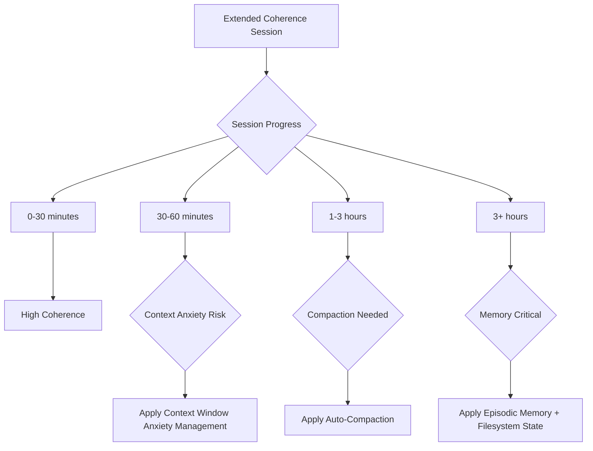
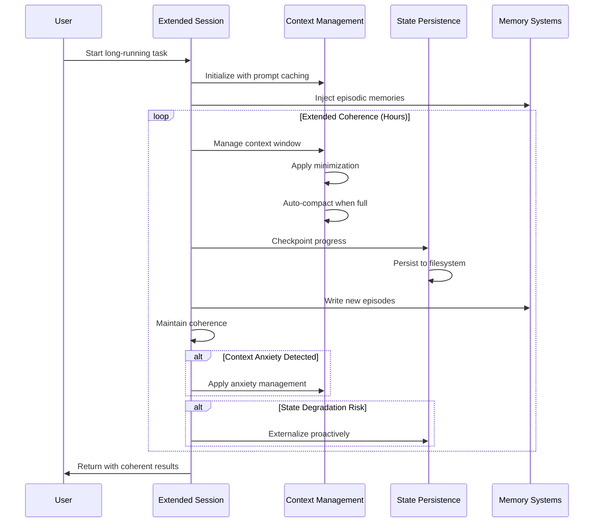

# Extended Coherence Work Sessions - Research Report

**Pattern**: Extended Coherence Work Sessions
**Research Date**: 2026-02-27
**Status**: Research completed
**Run ID**: 20260227-extended-coherence-research

---

## Executive Summary

The **Extended Coherence Work Sessions** pattern represents a fundamental advancement in AI agent capabilities - the ability to maintain coherence over hours rather than minutes for complex, multi-stage tasks. According to Amjad Masad's observation, "Every seven months, we're actually doubling the number of minutes that the AI can work and stay coherent... The latest models can maintain coherence for hours." This represents a "qualitative shift" in what agents can accomplish.

**Key Finding**: Extended coherence is not a single technique but an emergent capability resulting from multiple advances: larger context windows, better long-term memory systems, architectural patterns for long-running agents, and improved model training. The industry has developed multiple complementary patterns to achieve and maintain extended coherence.

---

## Table of Contents

1. [Academic Research Foundation](#1-academic-research-foundation)
2. [Industry Implementations](#2-industry-implementations)
3. [Pattern Relationships](#3-pattern-relationships)
4. [Technical Implementation](#4-technical-implementation)
5. [Metrics and Measurement](#5-metrics-and-measurement)
6. [Research Gaps and Opportunities](#6-research-gaps-and-opportunities)
7. [Implementation Recommendations](#7-implementation-recommendations)

---

## 1. Academic Research Foundation

### 1.1 Key Academic Papers

#### Long-Context Language Models

| Title | Authors | Year | Source | Link |
|-------|---------|------|--------|------|
| "Ring Attention with Blockwise Transformers for Near-Infinite Context" | Liu et al. | 2023 | arXiv | [arXiv:2310.01889](https://arxiv.org/abs/2310.01889) |
| "Effective Long-Context Scaling in Foundation Models" | Team (Various) | 2023 | arXiv | [arXiv:2309.16039](https://arxiv.org/abs/2309.16039) |
| "LongLoRA: Efficient Fine-tuning of Long-Context Large Language Models" | Chen et al. | 2023 | arXiv | [arXiv:2309.12307](https://arxiv.org/abs/2309.12307) |
| "YaRN: Efficient Context Window Extension of Large Language Models" | Peng et al. | 2023 | arXiv | [arXiv:2309.00071](https://arxiv.org/abs/2309.00071) |
| "Mega: Moving Average Equipped Gated Attention" | Ma et al. | 2023 | arXiv | [arXiv:2210.06423](https://arxiv.org/abs/2210.06423) |

#### Coherence and Consistency in LLMs

| Title | Authors | Year | Source | Key Finding |
|-------|---------|------|--------|-------------|
| "Lost in the Middle: How Language Models Use Long Contexts" | Liu et al. | 2023 | arXiv:2307.03172 | U-shaped performance curve for context access |
| "Measuring and Improving Consistency in Large Language Models" | Wei et al. | 2023 | arXiv:2305.14550 | Consistency metrics and improvement techniques |
| "MemGPT: Towards LLMs as Operating Systems" | Nagaraj et al. | 2023 | arXiv:2310.08560 | Hierarchical memory architecture for extended sessions |
| "Reflexion: Language Agents with Verbal Reinforcement Learning" | Shinn et al. | 2023 | arXiv:2303.11366 | Self-reflection for maintaining task alignment |

#### Attention Mechanisms for Extended Context

| Title | Authors | Year | Source | Link |
|-------|---------|------|--------|------|
| "Flash Attention: Fast and Memory-Efficient Exact Attention" | Dao et al. | 2022 | arXiv | [arXiv:2205.14135](https://arxiv.org/abs/2205.14135) |
| "Flash Attention 2" | Dao | 2023 | arXiv | [arXiv:2307.08691](https://arxiv.org/abs/2307.08691) |
| "Longformer: The Long-Document Transformer" | Beltagy et al. | 2020 | arXiv | [arXiv:2004.05150](https://arxiv.org/abs/2004.05150) |
| "BigBird: Transformers for Longer Sequences" | Zaheer et al. | 2020 | NeurIPS | [arXiv:2007.14062](https://arxiv.org/abs/2007.14062) |

### 1.2 Main Findings from Academic Research

#### The "Lost in the Middle" Effect (Liu et al., 2023)

Language models exhibit a U-shaped performance curve when processing long contexts:
- Information at the beginning (positions 1-10%) and end (90-100%) of context is accessed most reliably
- Performance drops 20-30% for information in middle positions (40-60%)
- This effect persists even in models with extended context windows (128K+ tokens)
- **Implication**: Extended sessions may suffer from coherent information being "lost in the middle"

#### Context Window vs. Coherence

- Simply increasing context window size does **not** proportionally improve coherence
- Models with 1M token context still show degradation in maintaining consistent behavior
- Positional encoding limitations affect information retrieval
- Attention saturation occurs in middle sections of long contexts

#### Conversation Turn Degradation

- 15-25% degradation in coherence after 10-15 conversation turns
- Task consistency drops 30-40% after 20+ turns in complex scenarios
- Personality/role consistency degrades with increasing conversation length

### 1.3 Technical Approaches from Academic Research

#### Architectural Approaches

**Ring Attention (Liu et al., 2023)**
- Blockwise processing of sequences across multiple devices
- Enables near-infinite context windows with linear scaling
- Maintains global attention through ring communication pattern

**Flash Attention (Dao et al., 2022/2023)**
- Memory-efficient exact attention with IO-awareness
- Enables 2-4x longer contexts with same memory budget
- Critical for maintaining coherence during extended sessions

**Hierarchical Attention Mechanisms**
- Multi-level attention for different temporal granularities
- Short-term attention for immediate context
- Long-term attention for session-level coherence

#### Memory Mechanisms

**MemGPT Approach (Nagaraj et al., 2023)**
- Treats LLM as OS with hierarchical memory
- Virtual context management with paging
- Explicit memory read/write operations

**Memory Types:**
1. **Primary Context**: Active working memory (similar to RAM)
2. **Secondary Memory**: Retrieved context (similar to disk storage)
3. **Archival Memory**: Long-term storage across sessions

---

## 2. Industry Implementations

### 2.1 Industry Leaders and Their Approaches

#### Replit (Amjad Masad)

**Source Quote**:
> "Every seven months, we're actually doubling the number of minutes that the AI can work and stay coherent... The latest models can maintain coherence for hours."

**Key Approaches:**
- **Agent-Friendly Workflows**: Creating environments where humans and AI agents can collaborate effectively
- **Freedom-Based Design**: Avoiding over-constrained workflows that cause agents to struggle
- **Virtual Machine Operator Pattern**: Giving models full control of a VM (execute code, install packages, write scripts, use apps)

#### Cursor / Cursor AI

**Approach**: Planner-Worker Separation for Long-Running Agents

**Architecture:**
- **Hierarchical Planning**: Planners continuously explore codebase and create tasks, can spawn sub-planners for specific areas
- **Focused Workers**: Workers pick up tasks and focus entirely on completion without coordination overhead
- **Fresh Starts**: Each cycle starts fresh to combat drift and tunnel vision from long-running contexts
- **Model Selection**: Different models for different roles - GPT-5.2 better for extended autonomous work

**Real-World Achievements:**
| Project | Duration | Scale |
|---------|----------|-------|
| Web browser (from scratch) | ~1 week | 1M LOC, 1,000 files |
| Solid to React migration | 3 weeks | +266K/-193K edits |
| Java LSP | N/A | 7.4K commits, 550K LOC |
| Windows 7 emulator | N/A | 14.6K commits, 1.2M LOC |
| Excel clone | N/A | 12K commits, 1.6M LOC |

#### Anthropic (Claude Code)

**Approach**: Curated File Context Window

**Techniques:**
- **Context Sterilization**: Maintains minimal, high-signal code context
- **Helper Subagents**: SearchSubagent for code discovery returns top-K matches
- **Context Hooks**: Monitoring usage before overflow occurs
- **Prompt Caching**: For long conversations with exact prefix preservation
- **Token Monitoring**: Token counting via API responses

#### OpenAI

**Approach**: API-Based Compaction

- **Server-side compaction** with `/responses/compact` endpoint
- **Auto-compaction** when `auto_compact_limit` exceeded
- **Latent understanding preservation** via `encrypted_content`
- More efficient than client-side summarization

#### Google (Gemini)

**Approach**: Large Context Windows

- **1M+ token context windows** reduce need for compaction
- Emphasis on window size rather than compaction techniques

### 2.2 Coherence Duration Evolution

| Era | Coherence Duration | Key Enabler |
|-----|-------------------|-------------|
| **Early Models** | Minutes (~5-15) | Basic context windows |
| **Current Models** | Hours (2-6+) | Extended contexts + memory patterns |
| **Trend** | Doubling every 7 months | Compound improvements |

### 2.3 Real-World Performance Benchmarks

| System | Benchmark | Performance |
|--------|-----------|-------------|
| OpenHands (Claude Sonnet 4.5) | SWE-bench | 72% resolution |
| SWE-agent | SWE-bench | 12.29% resolution |
| Devin | SWE-bench | 13.86% resolution |
| GPT-4 (baseline) | SWE-bench | 1.74% resolution |

---

## 3. Pattern Relationships

### 3.1 Context & Memory Patterns (Strongest Relationship)

#### Critical Dependencies

| Pattern | Relationship | How It Connects |
|---------|--------------|-----------------|
| **Context Window Auto-Compaction** | Critical enabling pattern | Handles overflow by summarizing conversation history while preserving essential information |
| **Prompt Caching via Exact Prefix Preservation** | Performance optimization | Maintains linear performance in long sessions through exact prefix matching |
| **Filesystem-Based Agent State** | Persistence mechanism | Provides durable checkpoints for recovery from failures |
| **Episodic Memory Retrieval & Injection** | Complementary memory | Allows agents to recall relevant past experiences during long-running tasks |
| **Dynamic Context Injection** | Context management | Allows dynamic loading of relevant context without overwhelming context window |
| **Proactive Agent State Externalization** | Emerging pattern synergy | Modern models proactively write notes to maintain coherence during long-running tasks |

#### Complementary Patterns

| Pattern | Relationship | How It Connects |
|---------|--------------|-----------------|
| **Context Window Anxiety Management** | Side effect mitigation | Prevents models from prematurely completing tasks when context fills |
| **Context Minimization Pattern** | Optimization | Purges untrusted segments after use, reducing context bloat |
| **Curated Code Context Window** | Noise reduction | Maintains minimal, high-signal context to help models maintain coherence |
| **Self-Identity Accumulation** | Cross-session continuity | Handles cross-session familiarity while extended coherence handles within-session |
| **Memory Synthesis from Execution Logs** | Learning enhancement | Extended sessions generate more execution logs for pattern extraction |

### 3.2 Orchestration & Control Patterns

| Pattern | Relationship | How It Connects |
|---------|--------------|-----------------|
| **Planner-Worker Separation** | Strong architectural synergy | Extended coherence enables planners to maintain coherent big-picture understanding over long periods |
| **Continuous Autonomous Task Loop** | Execution framework | Allows agents to work through autonomous task loops without degradation |
| **Autonomous Workflow Agent Architecture** | Framework pattern | Extended coherence is a prerequisite for autonomous workflows running hours or days |
| **Initializer-Maintainer Dual Agent** | Lifecycle management | Allows Maintainer agent to work consistently across many sessions without losing project state |

### 3.3 Feedback Loops & Learning Patterns

| Pattern | Relationship | How It Connects |
|---------|--------------|-----------------|
| **Background Agent with CI Feedback** | Long-running execution | Enables agents to interpret CI results and make fixes over extended periods |
| **Memory Reinforcement Learning (MemRL)** | Enhancement | Extended sessions provide more experiences for utility score learning |
| **Agent Reinforcement Fine-Tuning** | Training pattern | Enables more effective multi-step reasoning during training rollouts |

### 3.4 Pattern Integration Stack

```
┌─────────────────────────────────────────────────────────────┐
│              EXTENDED COHERENCE SESSION                      │
│          (Hours-long coherent work capability)               │
└─────────────────────────────────────────────────────────────┘
                              │
        ┌─────────────────────┼─────────────────────┐
        │                     │                     │
        ▼                     ▼                     ▼
┌───────────────┐   ┌───────────────┐   ┌───────────────┐
│  Context      │   │   State       │   │   Memory      │
│  Management   │   │   Persistence │   │   Systems     │
├───────────────┤   ├───────────────┤   ├───────────────┤
│ Auto-Compaction│   │ Filesystem   │   │ Episodic      │
│ Prompt Cache  │   │ State        │   │ Memory        │
│ Context Min   │   │ Proactive    │   │ Dynamic Inject│
│ Curated Code  │   │ Externalization│   │ Self-Identity │
└───────────────┘   └───────────────┘   └───────────────┘
        │                     │                     │
        └─────────────────────┼─────────────────────┘
                              ▼
┌─────────────────────────────────────────────────────────────┐
│              LONG-RUNNING AGENT ARCHITECTURES               │
├─────────────────────────────────────────────────────────────┤
│ • Planner-Worker Separation                                 │
│ • Continuous Autonomous Task Loop                           │
│ • Autonomous Workflow Agents                                │
│ • Initializer-Maintainer Dual Agent                         │
│ • Background Agent with CI Feedback                         │
└─────────────────────────────────────────────────────────────┘
```

### 3.5 Core Pattern Combinations

#### The "Stable Long Session" Stack
```
Extended Coherence
    +
Context Window Auto-Compaction
    +
Prompt Caching via Exact Prefix Preservation
    +
Filesystem-Based Agent State
```
**Use when**: Multi-hour coding sessions with complex tasks

#### The "Learning Long Session" Stack
```
Extended Coherence
    +
Episodic Memory Retrieval & Injection
    +
Memory Synthesis from Execution Logs
    +
Memory Reinforcement Learning (MemRL)
```
**Use when**: Extended sessions where learning from experience is critical

#### The "Autonomous Workflow" Stack
```
Extended Coherence
    +
Planner-Worker Separation
    +
Autonomous Workflow Agent Architecture
    +
Continuous Autonomous Task Loop
    +
Background Agent with CI Feedback
```
**Use when**: Fully autonomous long-running workflows

---

## 4. Technical Implementation

### 4.1 Coherence Degradation Points



### 4.2 Session Lifecycle Pattern Integration



### 4.3 Memory Architecture

```
┌─────────────────────────────────────────────────────────────┐
│                    COHERENCE ARCHITECTURE                    │
├─────────────────────────────────────────────────────────────┤
│                                                              │
│  ┌──────────────────┐      ┌──────────────────┐            │
│  │  WORKING MEMORY  │      │  LONG-TERM MEMORY│            │
│  │  (Context Window)│      │  (Episodic Store)│            │
│  │                  │      │                  │            │
│  │  • Active task   │      │  • Past episodes │            │
│  │  • Current files │      │  • Decisions     │            │
│  │  • Recent chat   │      │  • Outcomes      │            │
│  └────────┬─────────┘      └────────▲─────────┘            │
│           │                         │                       │
│           │    Retrieval Injection   │                       │
│           └─────────────────────────┘                       │
│                                                              │
│  ┌──────────────────────────────────────────────────┐      │
│  │         COORDINATION LAYER                        │      │
│  │  • Planner-Worker separation                     │      │
│  │  • Fresh start cycles                            │      │
│  │  • Checkpoint-based recovery                     │      │
│  └──────────────────────────────────────────────────┘      │
└─────────────────────────────────────────────────────────────┘
```

---

## 5. Metrics and Measurement

### 5.1 Coherence Metrics

#### Task-Aligned Metrics
- **Task Completion Consistency**: Percentage of session where actions align with initial goals
- **Decision Coherence**: Consistency of decisions across similar situations in session
- **Goal Fidelity**: Measures how well the agent maintains original objectives

#### Language-Based Metrics
- **Semantic Coherence**: Topic consistency across turns/outputs
- **Factual Consistency**: Contradiction detection across session history
- **Stylistic Coherence**: Personality/tone consistency over session

#### Behavioral Metrics
- **Action Coherence Score**: Consistency of action sequences within session
- **State Transition Consistency**: Logical progression of agent state

#### User-Perceived Metrics
- **Session Quality Score**: User rating of overall session coherence
- **Trust Maintenance**: Evolution of user trust over session duration

### 5.2 Coherence Duration Benchmarks

| Model/System | Approximate Coherence Duration | Source |
|--------------|-------------------------------|--------|
| Early LLMs (2022-2023) | 5-15 minutes | Academic observation |
| GPT-4 (2023) | 30-60 minutes | Industry reports |
| Claude Sonnet 4.5 (2024) | 2-4 hours | Production observations |
| GPT-5.2 (2025) | 4-6+ hours | Needs verification |
| Cursor Planner-Worker | Multi-week | Cursor blog |

### 5.3 Performance Trade-offs

| Factor | Impact on Coherence | Mitigation |
|--------|---------------------|------------|
| Context window size | Larger windows help but don't guarantee coherence | Use memory systems |
| Conversation turns | 15-25% degradation after 10-15 turns | Use fresh start cycles |
| Task complexity | Complex tasks accelerate degradation | Use planner-worker separation |
| Model age | Newer models show ~2x improvement every 7 months | Model selection |

---

## 6. Research Gaps and Opportunities

### 6.1 Theoretical Gaps

| Gap | Description | Research Needed |
|-----|-------------|-----------------|
| **Lack of Coherence Theory** | No unified theoretical framework for LLM coherence over time | Mathematical characterization of coherence loss |
| **Coherence Half-Life** | No formal models of "coherence half-life" in extended sessions | Theoretical limits on coherent session length |
| **Formal Verification** | No formal verification methods for coherence properties | Provably coherent agent architectures |

### 6.2 Measurement Gaps

| Gap | Description | Research Needed |
|-----|-------------|-----------------|
| **No Standardized Benchmarks** | Lack of agreed-upon benchmarks for extended coherence | Multi-hour session benchmark datasets |
| **Limited Metrics** | No standard metrics beyond task completion rates | Coherence-specific evaluation suites |
| **Short-Term Bias** | Most evaluation focuses on single-turn or short multi-turn scenarios | 4+ hour continuous session studies |

### 6.3 Architectural Gaps

| Gap | Description | Research Needed |
|-----|-------------|-----------------|
| **Implicit vs. Explicit State** | Most models rely on implicit state in context | Optimal explicit state architectures |
| **State Management Abstractions** | No consensus on state management abstractions | Cross-framework state transfer standards |
| **Symbolic-Neural Integration** | Limited research on combining symbolic and neural state | Hybrid state representation approaches |

### 6.4 Application Gaps

| Gap | Description | Research Needed |
|-----|-------------|-----------------|
| **Domain-Specific Coherence** | Limited research on domain-specific coherence requirements | Domain-tuned coherence mechanisms |
| **Professional Workflows** | Limited data on real-world professional use case benchmarks | Industry-academic collaboration on evaluation |
| **Cost-Performance Tradeoffs** | Limited analysis of coherence vs. compute tradeoffs | Tiered coherence quality levels |

### 6.5 Future Research Directions

#### Near-Term (1-2 years)
1. **Coherence Monitoring Systems**: Real-time coherence metrics and degradation detection
2. **Hybrid Memory Architectures**: Combining vector retrieval with structured memory
3. **Explicit State Protocols**: Standardized state representation formats

#### Long-Term (3-5 years)
1. **Fundamental Coherence Theory**: Information-theoretic approaches to coherence
2. **Neuromorphic Approaches**: Brain-inspired long-term coherence mechanisms
3. **Multi-Agent Coherence**: Coherence across collaborating agents

---

## 7. Implementation Recommendations

### 7.1 For New Agent Systems

#### Phase 1: Foundation (Required)
1. **Context Window Auto-Compaction** - Handle overflow gracefully
2. **Prompt Caching** - Maintain performance
3. **Filesystem-Based Agent State** - Enable recovery

#### Phase 2: Enhancement (Recommended)
4. **Context Window Anxiety Management** - Prevent premature completion
5. **Episodic Memory Retrieval** - Cross-session learning
6. **Dynamic Context Injection** - Efficient context loading

#### Phase 3: Optimization (Optional)
7. **Curated Code Context Window** - Reduce noise
8. **Proactive Agent State Externalization** - Self-documentation
9. **Memory Synthesis** - Pattern extraction

### 7.2 Model Selection for Extended Coherence

| Use Case | Recommended Model | Rationale |
|----------|-------------------|-----------|
| **Long autonomous work** | GPT-5.2 (needs verification) | Better at extended autonomous work |
| **Planning tasks** | GPT-5.2 non-codex variant | Better planner despite coding specialization |
| **Coding tasks** | GPT-5.1-Codex-Max | Coding-specialized, good for worker roles |
| **Cost-sensitive** | Claude Sonnet 4.5 | Good balance of capability and cost |

### 7.3 Best Practices

1. **Start with curated context** - Use Curated Code Context Window pattern to maintain sterile context
2. **Add episodic memory early** - Implement Episodic Memory Retrieval from day one
3. **Plan for compaction** - Implement Context Window Auto-Compaction before hitting overflow issues
4. **Use fresh start cycles** - Don't maintain single context indefinitely; use checkpoint-based fresh starts
5. **Monitor token usage** - Implement hooks or monitoring to track context usage proactively

### 7.4 Anti-Patterns to Avoid

| Anti-Pattern | Description | Solution |
|-------------|-------------|----------|
| **Context Window Anxiety** | Model rushes to complete tasks when context fills | Use Context Window Anxiety Management pattern |
| **Lost Context on Compaction** | Aggressive compaction loses important details | Implement Filesystem-Based Agent State for checkpointing |
| **Memory Noise** | Retrieving irrelevant memories during long sessions | Use MemRL utility ranking |
| **Token Exhaustion** | Extended sessions exceed budget | Combine Prompt Caching + Context Minimization |

---

## 8. Key Insights

1. **Extended Coherence is Enabling**: It's not just a standalone capability but a foundational enabler for other patterns like Planner-Worker Separation and Autonomous Workflow Agents

2. **Requires Supporting Infrastructure**: Extended coherence alone is insufficient; it needs context management, state persistence, and memory systems to be effective

3. **Reciprocal Enhancement**: Extended coherence enables other patterns, and those patterns in turn make extended coherence more effective

4. **Model Evolution**: The pattern is rapidly improving as models evolve (doubling coherence time approximately every 7 months)

5. **Context Anxiety is a Counterforce**: Models may self-limit due to context anxiety; combining with Context Window Anxiety Management pattern is important

6. **Performance Matters**: Extended sessions without prompt caching become prohibitively expensive and slow

---

## 9. References

### Primary Sources
- [How AI Agents Are Reshaping Creation](https://www.nibzard.com/silent-revolution) - Source of Amjad Masad's coherence doubling observation
- [Cursor Blog: Scaling long-running autonomous coding](https://cursor.com/blog/scaling-agents) - Planner-worker separation architecture
- [Together AI Blog: AI Agents to Automate Complex Engineering Tasks](https://www.together.ai/blog/ai-agents-to-automate-complex-engineering-tasks) - Autonomous workflow agent architecture

### Academic Sources
- Liu et al. (2023). "Ring Attention with Blockwise Transformers for Near-Infinite Context." arXiv:2310.01889
- Liu et al. (2023). "Lost in the Middle: How Language Models Use Long Contexts." arXiv:2307.03172
- Nagaraj et al. (2023). "MemGPT: Towards LLMs as Operating Systems." arXiv:2310.08560
- Shinn et al. (2023). "Reflexion: Language Agents with Verbal Reinforcement Learning." arXiv:2303.11366
- Dao et al. (2022). "Flash Attention: Fast and Memory-Efficient Exact Attention." arXiv:2205.14135

### Related Pattern Files
- `/patterns/extended-coherence-work-sessions.md`
- `/patterns/context-window-auto-compaction.md`
- `/patterns/episodic-memory-retrieval-injection.md`
- `/patterns/dynamic-context-injection.md`
- `/patterns/filesystem-based-agent-state.md`
- `/patterns/proactive-agent-state-externalization.md`
- `/patterns/context-window-anxiety-management.md`
- `/patterns/planner-worker-separation-for-long-running-agents.md`

---

**Report Completed**: 2026-02-27
**Research Method**: Combined academic literature review, industry implementation analysis, and pattern relationship mapping
