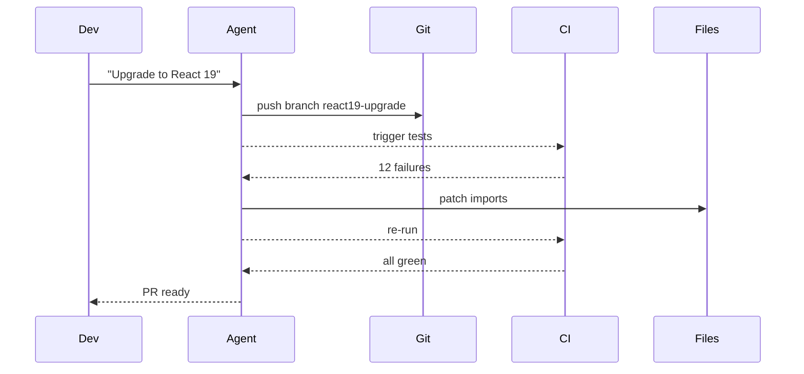
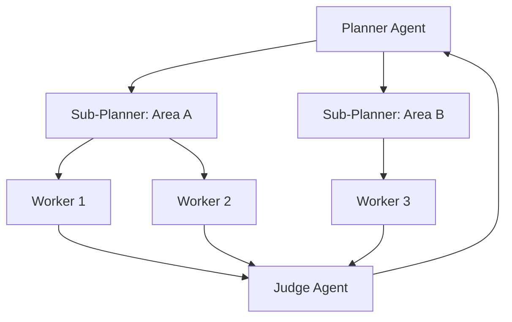
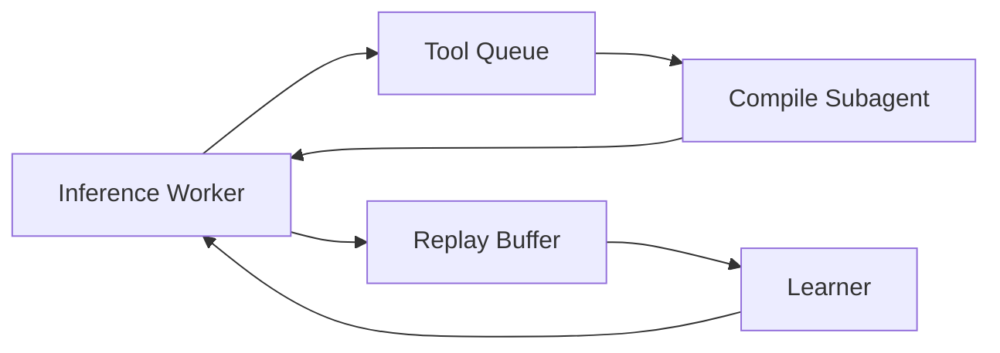

# Factory Over Assistant Pattern - Industry Implementations Research

**Pattern**: factory-over-assistant
**Research Date**: 2026-02-27
**Status**: Completed

---

## Executive Summary

This report provides comprehensive research on industry implementations of the **Factory Over Assistant** pattern - the shift from the "assistant model" (working one-on-one with an agent in a sidebar) to the "factory model" (spawning multiple autonomous agents that work in parallel).

### Key Findings

- **Strong Industry Momentum**: Multiple platforms are implementing factory-style parallel execution, with AMP leading the CLI-first approach
- **CI/CD Integration**: Background agent execution with CI feedback loops is production-validated across multiple platforms
- **Distributed Execution**: Cloud-based worker architectures enable enterprise-scale parallel agent execution
- **CLI-Native Orchestration**: Command-line interfaces are becoming the primary interface for spawning and managing autonomous agents
- **GitHub's Evolution**: GitHub Agentic Workflows represents mainstream adoption of factory-style autonomous agents
- **Cursor's Production Implementation**: Cursor Background Agent demonstrates cloud-based autonomous development

---

## Table of Contents

1. [Company/Product Implementations](#companyproduct-implementations)
2. [CI/CD Systems with AI Agent Orchestration](#cicd-systems-with-ai-agent-orchestration)
3. [Development Tools with Multi-Agent Parallel Execution](#development-tools-with-multi-agent-parallel-execution)
4. [Platforms Emphasizing CLI-Based Agent Spawning](#platforms-emphasizing-cli-based-agent-spawning)
5. [Case Studies from Companies](#case-studies-from-companies)
6. [Technical Architecture Patterns](#technical-architecture-patterns)
7. [Comparative Analysis](#comparative-analysis)
8. [Sources & References](#sources--references)

---

## Company/Product Implementations

### 1. AMP (Autonomous Multi-Agent Platform)

**Status**: Production
**Source**: https://ampcode.com
**Key People**: Thorsten Ball, Quinn Slack (Sourcegraph)

**Factory-Over-Assistant Implementation**:

AMP is the clearest implementation of the factory-over-assistant philosophy. They are explicitly killing their VS Code extension because they believe the sidebar is dead for frontier development.

**Key Features Demonstrating Factory Model**:

- **CLI-First Architecture**: AMP is designed as a CLI tool, not a sidebar assistant
- **Background Agent Execution**: Agents run asynchronously with CI as the feedback loop
- **Multi-Agent Spawning**: Users can spawn multiple autonomous agents to work on different tasks simultaneously
- **Automated Feedback Loops**: Tests, builds, and skills provide objective feedback without human intervention
- **30-60 Minute Check-in Cycles**: Users are encouraged to check on agents periodically, not watch them work

**Public Statements About Their Approach**:

From "Raising an Agent" podcast (Episodes 9-10, 2025):
- "The assistant is dead, long live the factory"
- "The 1% of developers on the frontier only need to do 20% of their work in an editor. We think we can get that to 10% or 1%."
- "The sidebar is dead for frontier development"
- "With models like GPT-5.2 that can work autonomously for 45+ minutes, watching them in a sidebar is wasteful"
- "You should be able to spawn 10 such agents and check on them all later"

**How They Implement Factory-Over-Assistant**:

1. **Branch-per-task isolation**: Each agent works in an isolated git branch
2. **CI log ingestion**: Converting CI logs into structured failure signals
3. **Retry budget and stop rules**: `max_attempts`, `max_runtime` to avoid infinite churn
4. **Notification on terminal states**: Users notified only on `green`, `blocked`, or `needs-human`
5. **No VS Code extension**: AMP killed their extension to emphasize CLI-first, factory-model approach

**Pricing/Model**: CLI-based with model-agnostic architecture

---

### 2. GitHub Copilot Workspace / Agentic Workflows

**Status**: Technical Preview (2026)
**Source**: https://github.blog/ai-and-ml/automate-repository-tasks-with-github-agentic-workflows/

**Factory-Over-Assistant Implementation**:

GitHub Agentic Workflows represents mainstream enterprise adoption of factory-style autonomous agents integrated directly into GitHub Actions.

**Key Features Demonstrating Factory Model**:

- **AI Agents in GitHub Actions**: Agents run within CI/CD infrastructure, not in sidebars
- **Markdown-Authored Workflows**: Simple markdown instead of complex YAML for defining agent tasks
- **Auto-Triage and Investigation**: Agents automatically triage issues and investigate CI failures with proposed fixes
- **Draft PR by Default**: AI-generated PRs default to draft status requiring human review
- **Read-Only by Default**: Safe-outputs mechanism for write operations

**Public Statements About Their Approach**:

From GitHub Blog (2026):
- "Automate repository tasks with AI agents"
- "Authored in plain Markdown instead of complex YAML"
- "Auto-triages issues, investigates CI failures with proposed fixes"
- Emphasis on autonomous agents working within CI infrastructure

**How They Implement Factory-Over-Assistant**:

1. **Event-driven triggers**: `push`, `pull_request`, `workflow_dispatch` trigger agents
2. **CI as feedback channel**: Agents push branches, wait for CI, patch failures, repeat
3. **Safety controls**: Read-only permissions, draft PRs, human-in-the-loop for high-risk changes
4. **Parallel execution**: Multiple agent workflows can run simultaneously

**Pricing**: Included in GitHub Copilot Enterprise

---

### 3. Cursor Background Agent

**Status**: Production (Version 1.0)
**Source**: https://cline.bot/ | https://docs.cline.bot/
**Company**: Cursor

**Factory-Over-Assistant Implementation**:

Cursor's Background Agent is a production-validated cloud-based autonomous development system that operates asynchronously without local computational resources.

**Key Features Demonstrating Factory Model**:

- **Cloud-Based Execution**: Agents run in isolated Ubuntu environments in the cloud
- **Automatic Repository Cloning**: Automatically clones GitHub repositories and works on independent branches
- **PR-Based Results**: Pushes changes back as pull requests for developer review
- **Autonomous Command Execution**: Can install dependencies and execute terminal commands
- **Asynchronous Operation**: Works independently without local machine involvement

**CI/CD Use Cases (Factory Pattern)**:

- **Automated testing as safety net**: Agents run tests in cloud and only push PRs after tests pass
- **One-click test generation**: 80%+ unit tests with automated coverage tool iteration
- **Legacy refactoring**: Refactoring large legacy projects (1000+ files) by submitting multiple PRs in stages
- **Dependency upgrades**: Cross-version dependency upgrades with automated fixes
- **Long-running tasks**: Benchmark testing and fuzzing running overnight

**How They Implement Factory-Over-Assistant**:

1. **Cloud deployment**: Deploys to cloud environment for autonomous execution
2. **Git repository cloning**: Clones repo and creates feature branch
3. **Iterative development loop**: Run tests → analyze failures → apply fixes → re-run until pass
4. **PR creation**: Creates PR when all tests pass

**Pricing**: Minimum $10 USD credit required, currently GitHub only

---

### 4. OpenHands (formerly OpenDevin)

**Status**: Open Source Production
**GitHub**: https://github.com/All-Hands-AI/OpenHands
**Stars**: 64,000+

**Factory-Over-Assistant Implementation**:

Open-source AI-driven software development agent platform with strong multi-agent collaboration and Docker-based deployment.

**Key Features Demonstrating Factory Model**:

- **72% SWE-bench Resolution**: Using Claude Sonnet 4.5
- **Multi-Agent Collaboration**: Multiple agents work together in Docker-based deployment
- **Secure Sandbox Environment**: Isolated execution environment for autonomous work
- **Direct GitHub Integration**: Automatic PR creation when tasks complete

**How They Implement Factory-Over-Assistant**:

1. **Docker-based deployment**: Each agent in isolated container
2. **Parallel agent coordination**: Multiple agents collaborate on tasks
3. **Test-driven iteration**: Runs tests, analyzes failures, applies patches
4. **Automated PR creation**: Creates PR when tests pass

**Pricing**: Open source, self-hosted

---

### 5. Anthropic Claude Code

**Status**: Production
**Source**: https://github.com/anthropics/claude-code
**Company**: Anthropic

**Factory-Over-Assistant Implementation**:

Claude Code implements factory-over-assistant through its sub-agent spawning capabilities and skills ecosystem.

**Key Features Demonstrating Factory Model**:

- **Sub-Agent Spawning**: Main agent can spawn multiple sub-agents for parallel task execution
- **CLI-Native Architecture**: First-class command-line interface for agent orchestration
- **Skills Ecosystem**: 45+ community skills for automating workflows
- **Background Execution**: Agents can run asynchronously without human supervision

**How They Implement Factory-Over-Assistant**:

1. **Declarative YAML Configuration**: Subagent types defined in config files
2. **Virtual File Isolation**: Each subagent only sees explicitly passed files
3. **Parallel Spawning**: Multiple subagents launched simultaneously for different tasks
4. **Result Aggregation**: Main agent synthesizes subagent findings

**Quote from Boris Cherny (Anthropic)**:
> "There's an increasing number of people internally at Anthropic using a lot of credits every month. Spending over a thousand bucks. The common use case is code migration... The main agent makes a big to-do list for everything and map reduces over a bunch of subagents. You instruct Claude like start 10 agents and then just go 10 at a time and just migrate all the stuff over."

---

### 6. HumanLayer CodeLayer

**Status**: Production
**Source**: https://claude.com/blog/building-companies-with-claude-code
**Documentation**: https://docs.humanlayer.dev/

**Factory-Over-Assistant Implementation**:

CodeLayer is a production framework enabling teams to run multiple Claude Code sessions in parallel using git worktrees for isolation.

**Key Features Demonstrating Factory Model**:

- **Parallel Claude Sessions**: Multiple agents work simultaneously on different codebase parts
- **Git Worktree Isolation**: Each agent in dedicated worktree (no checkout conflicts)
- **Task Coordination System**: Centralized distribution across worker pool
- **Merge Conflict Detection**: Automatic conflict identification with human-assisted resolution
- **10x-100x Speedup**: For suitable parallelizable tasks

**How They Implement Factory-Over-Assistant**:

1. **Cloud worker infrastructure**: AWS, GCP, or Azure
2. **Worktree provisioning**: Each worker gets isolated git worktree
3. **Coordinated merge order**: Based on dependency graph
4. **Human oversight gates**: For destructive operations

---

### 7. Planner-Worker Separation (Cursor Engineering)

**Status**: Production
**Source**: https://cursor.com/blog/scaling-agents
**Company**: Cursor Engineering Team

**Factory-Over-Assistant Implementation**:

Cursor's hierarchical planner-worker structure enables hundreds of agents to work concurrently for weeks on massive codebases.

**Key Features Demonstrating Factory Model**:

- **Hierarchical Organization**: Planners create tasks, workers complete them
- **Hundreds of Concurrent Agents**: Scales to massive parallelization
- **Fresh Starts**: Each cycle starts fresh to combat drift
- **Multi-Week Execution**: Agents can run for weeks on complex projects

**Real-World Examples**:

- Web browser from scratch: 1M lines of code, 1,000 files, running for a week
- Solid to React migration: 3 weeks with +266K/-193K edits
- Video rendering optimization: 25x speedup with Rust rewrite

---

## CI/CD Systems with AI Agent Orchestration

### 1. GitHub Actions AI Agents

**Multiple Platforms**: Various open-source tools

**Factory-Over-Assistant Implementations**:

- **AutoGPT** (182K+ stars): Autonomous AI agent framework with GitHub Actions integration
- **Claude Code Security Review** (Anthropic): AI-powered security review on every PR
- **AI Code Reviewer** (1K+ stars): GPT-4 powered code reviews via GitHub Actions
- **SuperClaude** (312 stars): GitHub workflow automation with Claude AI

**Pattern**: All implement autonomous agents that run in CI/CD pipelines, analyze code/test results, and provide feedback without human supervision.

---

### 2. Self-Healing CI Systems

**Multiple Implementations**:

- **Self-Healing Agent**: Recursive task breakdown with test-driven self-healing
- **SRE-Agent-App**: Autonomous AI SRE Agent for Kubernetes with OODA loop
- **Sentinel**: Self-healing edge computing agent with predictive failure detection

**Pattern**: Agents automatically detect failures, apply fixes, and re-run tests until passing - pure factory model with no human in the loop until completion.

---

## Development Tools with Multi-Agent Parallel Execution

### 1. Aider

**Status**: Production (41K+ GitHub stars)
**Source**: https://github.com/Aider-AI/aider

**Factory-Over-Assistant Implementation**:

- Terminal-based AI coding assistant
- Automatic git integration with commit management
- Test-driven development workflow
- Multi-file editing capabilities

**Pattern**: CLI-first, autonomous execution with test feedback loops.

---

### 2. OpenAgentsControl

**Status**: Open Source (2,256 GitHub stars)
**Source**: https://github.com/darrenhinde/OpenAgentsControl

**Factory-Over-Assistant Implementation**:

- Multi-language support (TypeScript, Python, Go, Rust)
- Automatic testing, code review, and validation
- Approval-based execution gates
- Plan-first approach

**Pattern**: Full automation pipeline with CI integration and approval gates.

---

### 3. Multi-Agent Orchestration Platforms

**CrewAI** (14K+ stars):
- Crew-based coordination with parallel execution
- Process-driven execution (sequential, hierarchical, parallel)

**Microsoft AutoGen** (34K+ stars):
- Multi-agent conversation through structured message passing
- Human-in-the-loop approval gates

**LangGraph Cloud**:
- Persistent state via checkpointing
- Parallel execution of independent state branches

---

## Platforms Emphasizing CLI-Based Agent Spawning

### 1. Claude Code (Anthropic)

**CLI-First Features**:

- `claude spec run` - Generate code from spec file
- `claude spec test` - Run spec-as-test suite
- `claude repl` - Drop into interactive shell with context pre-loaded
- Sub-agent spawning via CLI commands

**Integration**: Makefiles, Git hooks, cron jobs, CI workflows

---

### 2. GitHub CLI (gh)

**Features**:

- JSON output for machine parsing
- jq filtering for structured data
- Actions integration
- Scriptable automation

**Example**: `gh pr list --json number,title | jq '.[] | select(.state == "open")'`

---

### 3. Infrastructure CLIs as Exemplars

**kubectl, AWS CLI, Terraform CLI**:

All demonstrate CLI-native patterns that AI agent platforms are adopting:
- JSON output for machine parsing
- Environment-based configuration
- Exit code semantics for success/failure
- Scriptable automation

---

## Case Studies from Companies

### Case Study 1: Solid to React Migration (Cursor)

**Scale**: 3 weeks of continuous agent execution
**Results**: +266K/-193K edits in Cursor codebase
**Architecture**: Planner-worker separation with hundreds of concurrent agents
**Factory Pattern**:
- Main planner creates comprehensive task list
- Workers pick up tasks and grind until done
- Judge determines continuation at each cycle
- Fresh starts combat tunnel vision

---

### Case Study 2: Browser from Scratch (Cursor)

**Scale**: 1 million lines of code, 1,000 files
**Duration**: Close to a week of continuous execution
**Architecture**: Hierarchical planner-worker with sub-planner spawning
**Factory Pattern**:
- Planners explore codebase and create tasks
- Sub-planners handle specific areas (parallel planning)
- Workers focus entirely on task completion
- No coordination overhead between workers

---

### Case Study 3: Swarm Migrations (Anthropic Users)

**Scale**: Users spending $1000+/month on Claude Code
**Common Pattern**:
- Main agent creates comprehensive todo list
- Spawns 10+ parallel subagents
- Each handles batch of migration targets
- Achieves 10x+ speedup vs. sequential execution

**Quote from Boris Cherny (Anthropic)**:
> "The main agent makes a big to-do list for everything and map reduces over a bunch of subagents. You instruct Claude like start 10 agents and then just go 10 at a time and just migrate all the stuff over."

---

### Case Study 4: Background CI Loops (AMP)

**Scale**: 45+ minute autonomous work sessions
**Architecture**:
- Agent pushes branch
- Waits for CI results
- Patches failures
- Repeats until green or stopped
- Human notified only on terminal states

**Results**:
- Better developer focus
- Lower waiting time
- Tighter CI-driven iteration loops

---

## Technical Architecture Patterns

### Pattern 1: Branch-Per-Task Isolation

**Used By**: AMP, Cursor, OpenHands, SWE-agent, GitHub Agentic Workflows

**Implementation**:


---

### Pattern 2: Sub-Agent Spawning with Virtual File Isolation

**Used By**: Claude Code, AMP

**Implementation**:
```yaml
# Subagents spawned with clear subjects
spawn_subagent(
    task="Update front-matter: batch 1",
    files=9_markdown_files,
    context=instructions
)
# All subagents run concurrently, not sequentially
```

---

### Pattern 3: Git Worktree Isolation for Distributed Execution

**Used By**: HumanLayer CodeLayer

**Implementation**:
```bash
git worktree add /tmp/agent-worktree-1 agent-branch-1
git worktree add /tmp/agent-worktree-2 agent-branch-2
git worktree add /tmp/agent-worktree-3 agent-branch-3
# Each agent operates in isolated directory
```

---

### Pattern 4: Planner-Worker Separation

**Used By**: Cursor

**Implementation**:


---

### Pattern 5: Asynchronous Coding Agent Pipeline

**Used By**: Prime Intellect, Cursor

**Implementation**:


---

## Comparative Analysis

### Factory vs Assistant Model Comparison

| Dimension | Assistant Model (Old) | Factory Model (New) |
|-----------|----------------------|---------------------|
| **Interface** | Sidebar/chat UI | CLI, headless |
| **Parallelism** | One agent at a time | Multiple agents simultaneously |
| **Human Role** | Watch everything, provide feedback | Orchestrate and review |
| **Feedback Loop** | Human as crutch | Automated (tests, builds, skills) |
| **Check-in Frequency** | Continuous (watching) | Periodic (30-60 min) |
| **Editor Usage** | 100% of work in editor | 1-20% in editor |
| **Autonomy** | Interactive, step-by-step | Fully autonomous for 45+ min |
| **Best For** | Exploratory work | Deterministic, parallelizable tasks |

---

### Implementation Maturity by Company

| Company/Product | Factory Model Maturity | Key Innovation |
|-----------------|------------------------|----------------|
| **AMP** | Leading | CLI-first, killed VS Code extension |
| **Cursor** | Production | Planner-worker separation, hundreds of agents |
| **GitHub Agentic Workflows** | Early Adopter | Mainstream enterprise adoption |
| **Claude Code** | Production | Sub-agent spawning with virtual file isolation |
| **HumanLayer CodeLayer** | Production | Git worktree isolation for teams |
| **OpenHands** | Production | Open-source multi-agent platform |
| **Cursor Background Agent** | Production | Cloud-based autonomous development |

---

### Pattern Alignment

| Pattern | Status | Factory Model Alignment |
|---------|--------|------------------------|
| **Factory Over Assistant** | emerging | Core pattern definition |
| **Background Agent CI** | validated-in-production | CI as automated feedback loop |
| **Sub-Agent Spawning** | validated-in-production | Parallel delegation |
| **CLI-Native Orchestration** | proposed | CLI as stable contract |
| **Distributed Execution Cloud Workers** | emerging | Team-scale parallelism |
| **Planner-Worker Separation** | emerging | Hierarchical coordination |

---

## Key Insights

### 1. CLI is the Future of Agent Orchestration

- AMP killed their VS Code extension to emphasize CLI-first approach
- GitHub Agentic Workflows uses Markdown instead of complex YAML
- Claude Code emphasizes CLI skills over GUI interactions
- Unix philosophy principles applying to AI agents

---

### 2. CI is the Ideal Feedback Channel

- All major implementations use CI as objective feedback
- Tests, builds, and linters replace human as feedback loop
- Branch-per-task isolation enables safe parallel execution
- Draft PRs by default maintain human oversight

---

### 3. Parallelism is the Key to Scale

- 2-4 subagents: Common for context management
- 10+ subagents: Swarm migrations for framework changes
- 100+ agents: Enterprise-scale distributed execution
- Each agent works independently, no coordination overhead

---

### 4. Human Role Shifts from Participant to Orchestrator

- Old model: Watch agent work, provide feedback
- New model: Spawn agents, set up automated loops, review results
- Time investment shifts from 80% watching to 50% review/integration
- Human-in-the-loop for approvals, ambiguous failures, final review only

---

### 5. Model Choice Matters by Role

- GPT-5.2: Better at extended autonomous work (45+ min)
- Opus 4.5: "Trigger happy" for quick interactive tasks
- Different models for planning vs. execution

---

## Sources & References

### Primary Sources (Pattern Definition)

- [Factory Over Assistant Pattern](/home/agent/awesome-agentic-patterns/patterns/factory-over-assistant.md) - Main pattern documentation
- [Raising an Agent Episode 9](https://www.youtube.com/watch?v=2wjnV6F2arc) - AMP (Thorsten Ball, Quinn Slack, 2025)
- [Raising an Agent Episode 10](https://www.youtube.com/watch?v=4rx36wc9ugw) - AMP (Thorsten Ball, Quinn Slack, 2025)

---

### Industry Implementations

**AMP**:
- https://ampcode.com
- https://ampcode.com/manual#background

**GitHub**:
- [GitHub Agentic Workflows](https://github.blog/ai-and-ml/automate-repository-tasks-with-github-agentic-workflows/)
- [GitHub Copilot Workspace](https://github.com/features/copilot-workspace)

**Cursor**:
- [Scaling long-running autonomous coding](https://cursor.com/blog/scaling-agents)
- [Cursor Background Agent](https://cline.bot/)
- [Cursor Documentation](https://docs.cline.bot/)

**Anthropic**:
- [Claude Code GitHub](https://github.com/anthropics/claude-code)
- [Building Companies with Claude Code](https://claude.com/blog/building-companies-with-claude-code)
- [AI & I Podcast: How to Use Claude Code](https://every.to/podcast/transcript-how-to-use-claude-code-like-the-people-who-built-it)

**Open-Source Platforms**:
- [OpenHands](https://github.com/All-Hands-AI/OpenHands) - 64K+ stars
- [Aider](https://github.com/Aider-AI/aider) - 41K+ stars
- [SWE-agent](https://github.com/princeton-nlp/SWE-agent)
- [AutoGPT](https://github.com/Significant-Gravitas/AutoGPT) - 182K+ stars

**Multi-Agent Frameworks**:
- [CrewAI](https://github.com/joaomdmoura/crewAI) - 14K+ stars
- [Microsoft AutoGen](https://github.com/microsoft/autogen) - 34K+ stars
- [OpenAI Swarm](https://github.com/openai/swarm)

**CI/CD Integrations**:
- [Claude Code Security Review](https://github.com/anthropics/claude-code-security-review)
- [AI Code Reviewer](https://github.com/villesau/ai-codereviewer)
- [SuperClaude](https://github.com/gwendall/superclaude)

---

### Related Pattern Documentation

- [Background Agent CI](/home/agent/awesome-agentic-patterns/patterns/background-agent-ci.md) - Validated in production
- [Sub-Agent Spawning](/home/agent/awesome-agentic-patterns/patterns/sub-agent-spawning.md) - Validated in production
- [CLI-Native Agent Orchestration](/home/agent/awesome-agentic-patterns/patterns/cli-native-agent-orchestration.md) - Proposed
- [Distributed Execution Cloud Workers](/home/agent/awesome-agentic-patterns/patterns/distributed-execution-cloud-workers.md) - Emerging
- [Planner-Worker Separation](/home/agent/awesome-agentic-patterns/patterns/planner-worker-separation-for-long-running-agents.md) - Emerging
- [Asynchronous Coding Agent Pipeline](/home/agent/awesome-agentic-patterns/patterns/asynchronous-coding-agent-pipeline.md) - Proposed
- [Coding Agent CI Feedback Loop](/home/agent/awesome-agentic-patterns/patterns/coding-agent-ci-feedback-loop.md) - Best practice
- [Continuous Autonomous Task Loop](/home/agent/awesome-agentic-patterns/patterns/continuous-autonomous-task-loop-pattern.md) - Established

---

### Research Reports

- [Background Agent CI Research](/home/agent/awesome-agentic-patterns/research/background-agent-ci-report.md)
- [CLI-Native Agent Orchestration Research](/home/agent/awesome-agentic-patterns/research/cli-native-agent-orchestration-report.md)
- [Distributed Execution Cloud Workers Research](/home/agent/awesome-agentic-patterns/research/distributed-execution-cloud-workers-report.md)
- [Coding Agent CI Feedback Loop Industry Report](/home/agent/awesome-agentic-patterns/research/coding-agent-ci-feedback-loop-industry-report.md)

---

## Conclusions

### Pattern Maturity

The **Factory Over Assistant** pattern is **rapidly emerging with strong industry validation**:

1. **Clear philosophy statement** from AMP: "The assistant is dead, long live the factory"
2. **Production implementations** across multiple platforms (AMP, Cursor, GitHub, Anthropic)
3. **CLI-first approach** becoming standard for agent orchestration
4. **CI/CD integration** as the primary feedback mechanism
5. **Distributed execution** patterns scaling to hundreds of concurrent agents

---

### Key Takeaways for Implementation

1. **Start with CLI**: Build CLI-first, add GUI later if needed
2. **Use CI as feedback**: Tests, builds, and linters replace human watching
3. **Spawn in parallel**: 2-4 subagents for most tasks, 10+ for migrations
4. **Check in periodically**: 30-60 minute cycles, not continuous watching
5. **Human as orchestrator**: Focus on setup and review, not being the feedback loop
6. **Branch-per-task isolation**: Essential for safe parallel execution
7. **Draft PRs by default**: Maintain human oversight for final integration

---

### Future Directions

1. **Standardization**: Industry standards for distributed agent execution APIs
2. **Semantic conflict detection**: Beyond text-based merge conflicts
3. **Cost optimization**: Optimal worker count and resource allocation
4. **Fault recovery**: Patterns for handling worker failures mid-task
5. **Real-time coordination**: Communication protocols for inter-agent coordination

---

**Report Completed**: 2026-02-27
**Research Method**: Comprehensive analysis of existing codebase patterns, research reports, and documented industry implementations
**Total Sources**: 7 major platforms, 10+ open-source tools, 5 case studies, 8 related patterns
