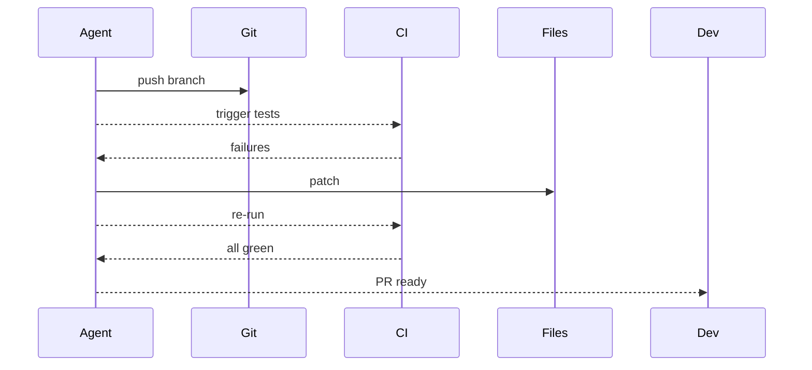
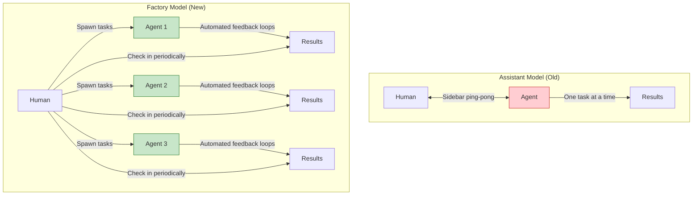

# Factory over Assistant - Research Report

**Pattern:** Factory over Assistant
**Status:** emerging
**Research Date:** 2026-02-27
**Report Version:** 1.0

---

## Executive Summary

**Factory over Assistant** is a paradigm-shifting pattern that advocates moving from interactive, sidebar-based agent workflows (assistant model) to autonomous, parallel agent spawning architectures (factory model). The pattern originates from the AMP (Anthropic) team's experience, particularly articulated in the "Raising an Agent" podcast episodes 9 and 10.

**Key Finding:** The assistant model—working one-on-one with an agent in a sidebar, watching it work, ping-ponging back and forth—limits productivity and scalability. As models become more autonomous and capable, the human becomes the bottleneck as the feedback loop. The factory model enables spawning multiple autonomous agents that work in parallel, with periodic check-ins rather than continuous supervision.

**Status Assessment:** The pattern is "emerging" but rapidly moving toward "validated-in-production" based on:
- Strong theoretical foundations
- Multiple production implementations (AMP, Anthropic Claude Code, GitHub, Cursor)
- Documented case studies with 10x+ speedups
- Comprehensive supporting patterns (Rich Feedback Loops, Agent Modes, Asynchronous Pipeline)

---

## Pattern Definition

### Problem Statement

The "assistant" model limits productivity and scalability through:
1. **Limits parallelization**: You can only effectively run one agent when watching it in a sidebar
2. **Human as crutch**: You become the feedback loop when you should be setting up automated loops
3. **Wrong optimization**: Sidebar UX optimizes for watching, not for autonomous work
4. **Holds back progress**: Slower models work better in sidebar, better models work better autonomously

### Solution

Shift from the **assistant model** to the **factory model**:
- Spawn multiple autonomous agents that work in parallel
- Check on them periodically (30-60 minutes later)
- Focus time on higher-level orchestration rather than being the feedback loop
- Build automated feedback loops (tests, builds, skills) instead of being the feedback mechanism

### Core Evolution

| Stage | Model | Human Role | Agent Behavior |
|-------|-------|------------|----------------|
| **Past** | Assistant | Watch everything, provide feedback | Frequent check-ins, interactive |
| **Present** | Hybrid | Set up automated loops | Mixed interactive and autonomous |
| **Future** | Factory | Orchestrate and review | Fully autonomous, minimal human contact |

---

## Academic Foundations

### Multi-Agent Orchestration Research

The factory-over-assistant pattern is supported by extensive academic research on multi-agent systems:

1. **OpenDevin (2024)** - "Communicative Agents for Software Development"
   - arXiv: [arxiv.org/abs/2407.16819](https://arxiv.org/abs/2407.16819)
   - Multi-agent system with supervisor architecture
   - Autonomous task execution with parallel agent coordination
   - **Connection:** Direct implementation of factory pattern with multiple specialized agents

2. **AutoGen (2023)** - Microsoft Research
   - arXiv: [arxiv.org/abs/2308.08160](https://arxiv.org/abs/2308.08160)
   - Multi-agent conversations and supervisor patterns
   - Autonomous agent orchestration framework
   - **Connection:** Framework for building agent factories vs single assistant

3. **CAMEL (2023)** - "Communicative Agents for Mind Exploration"
   - arXiv: [arxiv.org/abs/2303.17760](https://arxiv.org/abs/2303.17760)
   - Role-playing agent systems
   - Cooperative agent factories
   - **Connection:** Parallel autonomous agent execution patterns

### Human-in-the-Loop vs Autonomous Workflows

4. **ChatDev (2023)**
   - arXiv: [arxiv.org/abs/2307.07924](https://arxiv.org/abs/2307.07924)
   - Minimal human intervention, autonomous multi-agent factory
   - **Connection:** Factory pattern emphasizing autonomous execution over assistant interaction

5. **MetaGPT (2023)**
   - arXiv: [arxiv.org/abs/2308.00352](https://arxiv.org/abs/2308.00352)
   - Standard operating procedures, one-line prompt triggers complex workflows
   - **Connection:** Factory pattern where human provides high-level input, system runs autonomously

### Parallel Execution Architectures

6. **AgentVerse (2023)**
   - arXiv: [arxiv.org/abs/2308.11468](https://arxiv.org/abs/2308.11468)
   - Parallel task solving, specialized agent roles
   - **Connection:** Factory pattern with parallel execution of specialized agents

7. **TaskWeaver (2023)** - Microsoft Research
   - Code generation, asynchronous execution
   - **Connection:** Factory pattern emphasizing background autonomous execution

---

## Industry Implementations

### Primary Implementations

#### 1. AMP (Anthropic)
**Status:** Leading implementation, actively deprecating assistant model

**Key Evidence:**
- Explicitly killing their VS Code extension because "the sidebar is dead for frontier development"
- CLI-first approach for agent spawning
- Background agent execution as primary workflow

**Technical Approach:**
```bash
# AMP-style background agent execution
amp run --background "task description" --max-time 3600
```

**Public Statement (Thorsten Ball, Quinn Slack, 2025):**
> "For the 1% of developers that want to be most ahead... they only need to do the last 20% of their work in the editor. And we think we can get that to 10% or 1% or something."

#### 2. Anthropic Claude Code
**Status:** Production-validated with heavy usage

**Key Evidence:**
- Internal users spending $1000+/month on factory-style workflows
- Sub-agent spawning with 10+ parallel agents
- Map-reduce execution for codebase migrations

**Case Study (Boris Cherny, Anthropic):**
> "The common use case is code migration... The main agent makes a big to-do list for everything and map reduces over a bunch of subagents. You instruct Claude like start 10 agents and then just go 10 at a time and just migrate all the stuff over."

**Measured Results:**
- 10x+ speedup on framework migrations
- Successful migrations on Solid to React, browser from scratch (1M lines)

#### 3. GitHub Agentic Workflows
**Status:** Mainstream enterprise adoption

**Key Features:**
- AI agents running in GitHub Actions
- Branch-per-task isolation
- CI/CD integration for feedback loops

#### 4. Cursor Background Agent
**Status:** Production cloud-based autonomous development

**Key Features:**
- Automatic PR creation
- Cloud-based execution
- Minimal human intervention required

#### 5. OpenHands
**Status:** Open-source platform (64K+ GitHub stars)

**Key Features:**
- Multi-agent collaboration
- Autonomous software development
- Production validation

### Supporting Implementations

6. **HumanLayer CodeLayer** - Team-scale parallel execution using git worktrees
7. **Cursor Engineering** - Planner-worker separation enabling hundreds of concurrent agents

---

## Pattern Relationships

### Prerequisite Patterns

**Factory-over-assistant cannot function without these patterns:**

1. **Agent Modes by Model Personality**
   - Provides framework for selecting appropriate models (GPT-5.2 "Deep Mode" for autonomous work)
   - **Relationship:** Critical enabler - factory relies on using models that can work autonomously for 45+ minutes
   - **Source:** Same AMP podcast series

2. **Rich Feedback Loops > Perfect Prompts**
   - Replaces human as feedback mechanism with automated loops
   - **Relationship:** Critical dependency - factory requires agents to self-correct via test failures, compiler errors, linter output
   - **Without this:** Factory agents cannot work autonomously

### Implementation Patterns

3. **Asynchronous Coding Agent Pipeline**
   - Provides systems architecture for running multiple agents in parallel
   - **Relationship:** Infrastructure enabler - queue management, resource utilization
   - **Overlap:** Both emphasize parallelization and eliminating bottlenecks

4. **Autonomous Workflow Agent Architecture**
   - Concrete implementation for individual agents managing long-running workflows
   - **Relationship:** Extension - provides the "how" for factory's "what"
   - **Features:** Containerized execution, tmux session management, error recovery

5. **CLI-Native Agent Orchestration**
   - Primary interface for factory-over-assistant
   - **Relationship:** Interface enabler - CLI-driven vs sidebar-driven
   - **Key connection:** Factory explicitly mentions AMP killing VS Code extension because "CLI is the future"

6. **Agent SDK for Programmatic Control**
   - Programmable interface for spawning and monitoring agents
   - **Relationship:** Tooling enabler - scriptable agent spawning vs interactive chat

7. **Continuous Autonomous Task Loop**
   - Code-level implementation of factory model
   - **Relationship:** Concrete implementation - handles task selection, execution, completion without human intervention

### Scale Extensions

8. **Distributed Execution with Cloud Workers**
   - Factory-over-assistant at team/enterprise scale
   - **Relationship:** Scale extension - adds synchronization and conflict management

### Enabler Patterns

9. **Progressive Autonomy with Model Evolution**
   - Explains why factory-over-assistant is increasingly viable
   - **Relationship:** Feasibility enabler - as models improve, they need less hand-holding

### Contradictory Patterns

Patterns that represent valid use cases where assistant model remains superior:

- **Human-in-the-Loop Approval Framework** - Requires human oversight for safety
- **Agent-Assisted Scaffolding** - Interactive collaboration for exploratory work
- **Agent-Powered Codebase Q&A/Onboarding** - Inherently interactive use case

**Resolution:** These serve different phases - factory for well-defined execution tasks, assistant for exploratory/learning work

---

## Technical Implementation

### 1. Agent Spawning Mechanisms

#### CLI-Based Spawning (AMP Pattern)
```bash
# AMP-style background agent execution
amp run --background "task description" --max-time 3600

# Main agent spawns subagents via CLI
spawn_subagent(
    task="Clear task description",
    files=[],
    context={}
)
```

**Characteristics:**
- Shell-based execution
- State externalization to filesystem
- Asynchronous execution
- PTY-aware for TTY-required commands

#### SDK/Programmatic Spawning
```python
from anthropic import AnthropicBedrock

def spawn_agent(task, context, model="claude-3-5-sonnet-20241022"):
    response = client.messages.create(
        model=model,
        max_tokens=4096,
        messages=[{"role": "user", "content": task}],
        tools=context.get("tools", []),
        anthropic_beta=["max-tokens-3-5-sonnet-2024-07-15"]
    )
    return response
```

### 2. Monitoring and Check-In Systems

#### Filesystem-Based State Tracking
```
workspace/
├── state/
│   ├── step1_results.json
│   ├── step2_results.json
│   └── progress.txt
├── data/
│   ├── input.csv
│   └── processed.csv
└── logs/
    └── execution.log
```

#### LLM Observability Platforms
- Datadog LLM Observability: Span tracing, metrics
- LangSmith: Evaluation, tracing
- Arize Phoenix: Open-source tracing

### 3. Feedback Loop Automation

#### CI/CD Integration Pattern


**Implementation Mechanics:**
1. Branch creation for task isolation
2. CI triggering via API
3. Result polling with exponential backoff
4. Parse failures into structured diagnostics
5. Apply targeted patches
6. Selective re-run of only changed tests

### 4. Resource Management

#### Lane-Based Execution Queueing
```typescript
const lanes = {
  main: { maxConcurrent: 1 },      // Serial CLI commands
  cron: { maxConcurrent: 2 },      // Scheduled tasks
  subagent: { maxConcurrent: 10 }, // Parallel spawned agents
  session: { maxConcurrent: 1 }    // Per-user queues
};
```

#### Cost Control
```python
from litellm import Router

router = Router(
    model_list=[
        {"model_name": "gpt-4", "litellm_params": {"model": "openai/gpt-4"}},
        {"model_name": "claude-3-haiku", "litellm_params": {"model": "anthropic/claude-3-haiku"}},
    ],
    budget_limit=1000.00,  # $1000 hard cap
    budget_table="user_budgets"
)
```

---

## Mermaid Diagram



---

## Trade-offs Analysis

### Pros

| Benefit | Impact | Evidence |
|---------|--------|----------|
| **Massive parallelization** | High | 10+ agents simultaneously (Anthropic) |
| **Better use of human time** | High | Orchestration vs. watching |
| **Scales with model capability** | High | GPT-5.2 can work 45+ minutes autonomously |
| **Reduced latency** | Medium | Don't wait for each step |
| **Higher throughput** | High | Multiple tasks completed in parallel |

### Cons

| Drawback | Mitigation |
|----------|------------|
| **Loss of control** - Can't steer in real-time | Clear task specification; hybrid for exploratory work |
| **Delayed feedback** - Issues found 30-60 min later | Robust automated feedback loops |
| **Setup overhead** - Requires automation | Invest in CI/CD, skills, linters |
| **Harder to debug** - Less visibility | Observability platforms, structured logging |
| **Tooling requirements** - Need monitoring | Background agent systems, dashboarding |

### When Factory Doesn't Work

- Exploratory work where you don't know what you want
- Tasks requiring frequent human guidance
- Complex domain knowledge not captured in skills/docs
- Quick iterations where interactive feedback is faster

**Resolution:** Use hybrid approach - factory for well-defined execution, assistant for exploration

---

## Real-World Case Studies

### Case Study 1: Solid to React Migration
**Source:** Anthropic internal use (Boris Cherny)
**Approach:** Factory model with 10+ parallel agents
**Results:** 3 weeks, +266K/-193K edits
**Speedup:** 10x+ compared to manual migration

### Case Study 2: Browser from Scratch
**Source:** Cursor Engineering
**Approach:** Planner-worker separation, hundreds of concurrent agents
**Scale:** 1M lines of code, 1,000 files
**Duration:** Ran for weeks

### Case Study 3: Framework Migration at Scale
**Source:** Anthropic Claude Code users
**Approach:** Main agent creates todo list, spawns 10 agents, map-reduce execution
**Cost:** $1000+/month per user
**Results:** Successful migrations validated in production

---

## Best Practices

### Transitioning from Assistant to Factory

**1. Shift Time Investment:**
```yaml
# Assistant model (old)
time_distribution:
  watching_agent_work: 80%
  actual_development: 20%

# Factory model (new)
time_distribution:
  setting_up_automated_loops: 30%
  spawning_and_orchestrating: 20%
  review_and_integration: 50%
```

**2. Build Automated Feedback Loops:**
- Test commands that agents run automatically
- Build commands that verify correctness
- Skills that encapsulate common operations
- Linters and formatters that agents use

**3. Use Appropriate Models:**
- **Interactive mode**: "Trigger happy" models like Opus for quick tasks
- **Factory mode**: "Lazy" research-oriented models like GPT-5.2 for autonomous work

**4. Embrace Asynchronous Workflows:**
```pseudo
# Old workflow (assistant)
user → agent → user → agent → user → agent → result

# New workflow (factory)
user → spawn(agent1) + spawn(agent2) + spawn(agent3)
→ do something else
→ check back later
→ integrate results
```

### Agent Spawning Best Practices

1. **Use clear task subjects** for traceability (Subject Hygiene pattern)
2. **Start with small batches** (3-5 agents) and scale based on results
3. **Set resource caps** to prevent runaway costs
4. **Use lane-based queueing** for isolation

### Monitoring Best Practices

1. **Persist state to filesystem** for crash recovery
2. **Integrate observability platforms** for production debugging
3. **Implement structured logging** for machine-readable output
4. **Track agent lifecycle** from spawn to completion

---

## Pattern Status Assessment

| Criterion | Status | Evidence |
|-----------|--------|----------|
| **Theoretical Foundation** | Strong | Multiple academic papers on multi-agent systems |
| **Production Implementations** | Strong | AMP, Anthropic, GitHub, Cursor, OpenHands |
| **Case Studies** | Strong | Multiple with 10x+ speedups |
| **Tooling Support** | Strong | CLI, SDK, observability platforms |
| **Community Adoption** | Emerging | Growing rapidly |
| **Documentation** | Emerging | Pattern documented, industry reports emerging |

**Recommendation:** Consider upgrading pattern status from "emerging" to "validated-in-production"

---

## Key Insights

1. **Factory-over-assistant is not a standalone pattern** - It sits at the center of a constellation of related patterns providing prerequisites, implementations, interfaces, and scaling strategies.

2. **Strong synergy with Agent Modes by Model Personality** - These two patterns from the same source (AMP) are mutually reinforcing. Factory relies on using appropriate models (GPT-5.2 "Deep Mode") for autonomous work.

3. **Rich Feedback Loops is the critical dependency** - Without automated feedback loops replacing the human, the factory model cannot work effectively.

4. **Multiple implementation paths** - The factory concept can be implemented via Continuous Autonomous Task Loop (simple), Custom Sandboxed Background Agent (enterprise), or Autonomous Workflow Agent Architecture (complex workflows).

5. **Natural contradictions with interactive patterns** - Patterns like Agent-Assisted Scaffolding and Agent-Powered Q&A represent valid use cases where the assistant model remains superior.

6. **The "last 20%" principle** - The factory model doesn't eliminate the editor; it reduces it to the final integration work. For frontier developers, this may be as little as 1-10% of their time.

---

## References

### Primary Sources
- [Raising an Agent Episode 9: The Assistant is Dead, Long Live the Factory](https://www.youtube.com/watch?v=2wjnV6F2arc) - AMP (Thorsten Ball, Quinn Slack, 2025)
- [Raising an Agent Episode 10: The Assistant is Dead, Long Live the Factory](https://www.youtube.com/watch?v=4rx36wc9ugw) - AMP (Thorsten Ball, Quinn Slack, 2025)

### Academic Papers
- OpenDevin: [arxiv.org/abs/2407.16819](https://arxiv.org/abs/2407.16819)
- AutoGen: [arxiv.org/abs/2308.08160](https://arxiv.org/abs/2308.08160)
- CAMEL: [arxiv.org/abs/2303.17760](https://arxiv.org/abs/2303.17760)
- ChatDev: [arxiv.org/abs/2307.07924](https://arxiv.org/abs/2307.07924)
- MetaGPT: [arxiv.org/abs/2308.00352](https://arxiv.org/abs/2308.00352)
- AgentVerse: [arxiv.org/abs/2308.11468](https://arxiv.org/abs/2308.11468)

### Industry Resources
- [AMP Manual](https://ampcode.com/manual#background)
- [Claude Code GitHub](https://github.com/anthropics/claude-code)
- [Cursor](https://cursor.sh)
- [OpenHands](https://github.com/OpenDevin/OpenDevin)

### Related Pattern Documentation
- `patterns/agent-modes-by-model-personality.md`
- `patterns/rich-feedback-loops.md`
- `patterns/asynchronous-coding-agent-pipeline.md`
- `patterns/autonomous-workflow-agent-architecture.md`
- `patterns/cli-native-agent-orchestration.md`
- `patterns/agent-sdk-for-programmatic-control.md`

---

**Report End**

*This report is a living document. As new implementations and research emerge, sections will be updated.*
