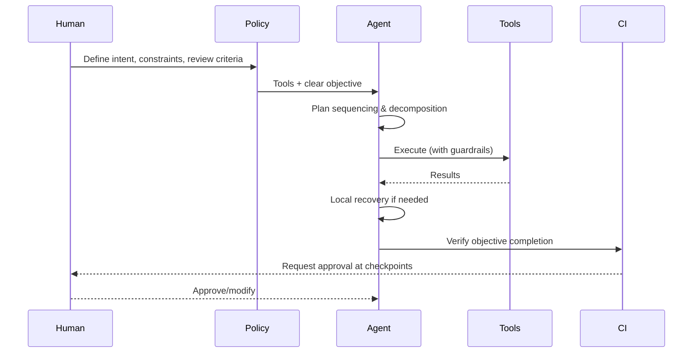
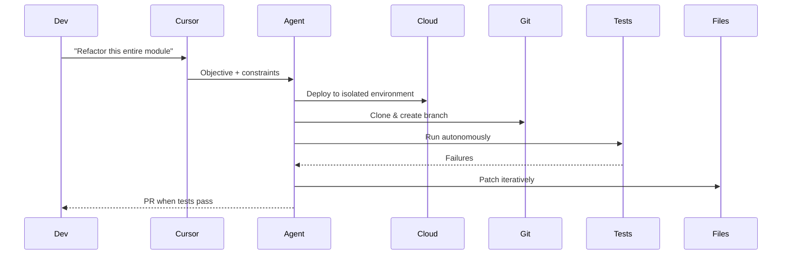
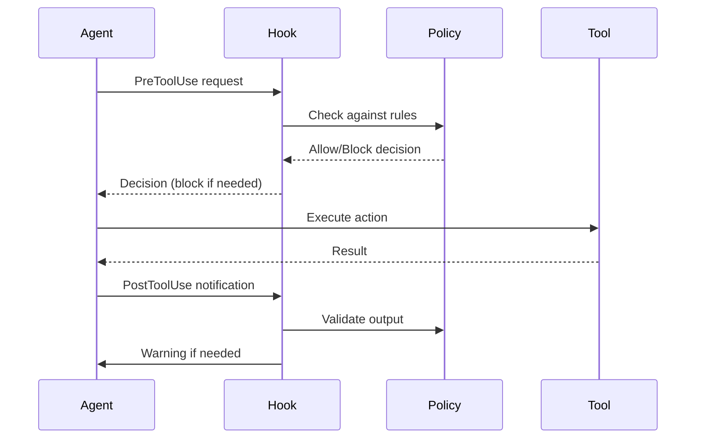
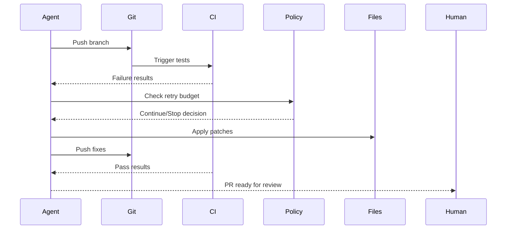
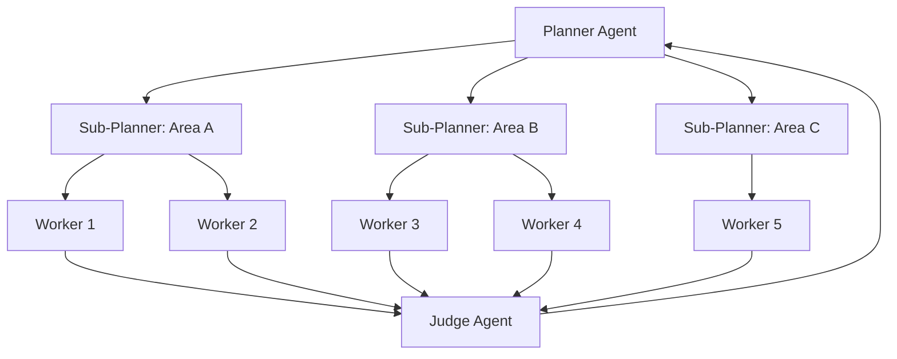

# Inversion of Control Pattern - Industry Implementations Research

**Pattern**: Inversion of Control (IoC) in AI Agents
**Status**: validated-in-production
**Authors**: Nikola Balic (@nibzard)
**Based On**: Quinn Slack, Thorsten Ball
**Category**: Orchestration & Control
**Source**: https://www.nibzard.com/ampcode
**Research Date**: 2026-02-27

---

## Executive Summary

This report provides comprehensive research on **Inversion of Control (IoC)** pattern implementations in AI agents and coding assistants. The IoC pattern flips control from "human scripts every move" to "human sets policy, agent performs" - giving agents tools and clear high-level objectives while letting them own execution strategy inside explicit guardrails.

### Key Findings

- **Strong Production Validation**: Multiple major platforms implementing IoC pattern (AMP/Sourcegraph, Cursor, GitHub, Anthropic Claude Code)
- **Three Implementation Models**: CLI-first orchestration, IDE spectrum of control, and background agent CI
- **Guardrails as Core**: All implementations use policy-based guardrails for safety
- **Multi-Agent Hierarchies**: Planner-worker separation as production pattern at scale
- **Measured Success**: Documented efficiency gains from 10x-100x for suitable tasks

---

## Table of Contents

1. [Core IoC Pattern Definition](#core-ioc-pattern-definition)
2. [Key Industry Implementations](#key-industry-implementations)
3. [Guardrails and Safety Mechanisms](#guardrails-and-safety-mechanisms)
4. [Success Metrics and Outcomes](#success-metrics-and-outcomes)
5. [Implementation Architecture Patterns](#implementation-architecture-patterns)
6. [Comparative Analysis](#comparative-analysis)
7. [Best Practices](#best-practices)
8. [Sources & References](#sources--references)

---

## Core IoC Pattern Definition

### The Problem Solved

Prompt-as-puppeteer workflows force humans to micromanage each step, turning agents into expensive autocomplete tools. This limits throughput, creates brittle instructions that break on small context changes, and prevents agents from using their own planning capability.

### The Solution

Give the agent tools and a clear high-level objective, then let it own execution strategy inside explicit guardrails. Humans define:
- **Intent**: What needs to be accomplished
- **Constraints**: Allowed tools, time budget, escalation conditions
- **Review Criteria**: Success metrics and approval checkpoints

The agent decides:
- **Sequencing**: How to break down and order the work
- **Decomposition**: How to divide tasks into executable steps
- **Local Recovery**: How to handle failures and retries

### Control Flow Diagram



---

## Key Industry Implementations

### 1. AMP (Autonomous Multi-Agent Platform) - Sourcegraph/Quinn Slack

**Status**: Production
**Source**: https://ampcode.com
**Key People**: Thorsten Ball, Quinn Slack (Sourcegraph)

**IoC Implementation**:

AMP is the clearest implementation of the IoC philosophy. They explicitly reject the "assistant model" (sidebar chat) in favor of the "factory model" (CLI-based autonomous agents).

**Key IoC Features**:

- **CLI-First Architecture**: No sidebar - agents run from command line with policy-based instructions
- **Background Agent CI**: Agents push branches, wait for CI, patch failures, repeat until green
- **Policy-Based Control**: Humans define objectives, constraints, and stopping conditions
- **30-60 Minute Check-in Cycles**: Users check on agents periodically, not watch them work

**Policy-Based Control Examples**:

```yaml
# AMP-style policy configuration
objective: "Upgrade to React 19"
constraints:
  allowed_tools: [edit_file, run_tests, git_commit]
  time_budget: 45 minutes
  max_attempts: 5
  escalation_conditions:
    - test failures > 10
    - compilation errors
  checkpoints:
    - schema_changes: require_approval
    - deploy_steps: require_approval
review_criteria:
  - tests_pass
  - migration_complete
  - docs_generated
```

**Public Statements**:
- "The assistant is dead, long live the factory"
- "The 1% of developers on the frontier only need to do 20% of their work in an editor"
- "With models like GPT-5.2 that can work autonomously for 45+ minutes, watching them in a sidebar is wasteful"
- "You should be able to spawn 10 such agents and check on them all later"

**Success Metrics**:
- 45+ minute autonomous work sessions
- Better developer focus (no watching agent work)
- Lower waiting time (async instead of sync)
- Tighter CI-driven iteration loops

---

### 2. Cursor - Spectrum of Control Implementation

**Status**: Production (Version 1.0)
**Source**: https://cursor.com
**Based On**: Aman Sanger (Cursor)

**IoC Implementation**:

Cursor implements IoC through a **spectrum of control** - allowing users to fluidly shift between direct control and delegating tasks to the agent based on task complexity and user familiarity.

**Control Spectrum**:

| Autonomy Level | Feature | Human Control | Agent Control |
|----------------|---------|---------------|---------------|
| Low | Tab Completion | High (driving) | Low (autocomplete) |
| Medium | Command K (Edit Region/File) | Medium (scope & goal) | Medium (implementation) |
| High | Agent Feature (Multi-File Edits) | Low (objective) | High (execution) |
| Very High | Background Agent (Entire PRs) | Minimal (policy) | Very High (autonomous) |

**Key IoC Features**:

- **Command K**: User defines scope and high-level goal, agent handles implementation
- **Agent Feature**: Agent takes multi-file tasks with less direct guidance
- **Background Agent**: Cloud-based autonomous development with PR-based results
- **Planner-Worker Separation**: Hierarchical control for massive projects (hundreds of agents)

**Background Agent IoC**:



**Success Metrics**:
- Web browser from scratch: 1M lines of code, 1 week execution
- Solid to React migration: 3 weeks, +266K/-193K edits
- Video rendering optimization: 25x speedup with Rust rewrite
- Planner-worker scales to hundreds of concurrent agents

---

### 3. GitHub Agentic Workflows - Policy-Based Automation

**Status**: Technical Preview (2026)
**Source**: https://github.blog/ai-and-ml/automate-repository-tasks-with-github-agentic-workflows/

**IoC Implementation**:

GitHub integrates agents directly into CI/CD with policy-based control and human-in-the-loop checkpoints.

**Key IoC Features**:

- **Markdown-Authored Workflows**: Simple policy definitions instead of complex YAML
- **Event-Driven Triggers**: `push`, `pull_request`, `workflow_dispatch` trigger agents
- **Auto-Triage and Investigation**: Agents automatically triage issues and investigate CI failures
- **Draft PR by Default**: AI-generated PRs require human review before merge
- **Read-Only by Default**: Safe-outputs mechanism for write operations

**Policy-Based Workflow Example**:

```markdown
# agent-workflow.md
## Objective
Automatically triage new issues and propose fixes for CI failures

## Constraints
- Read-only code access by default
- Write operations require draft PR
- Maximum 3 fix attempts per issue
- Escalate to human if uncertain

## Checkpoints
- Breaking changes: require human approval
- Database migrations: require human approval
- External API changes: require human approval

## Review Criteria
- Tests pass
- No breaking changes without approval
- Documentation updated
```

**Safety Controls**:
- Read-only permissions by default
- Safe-outputs mechanism for write operations
- Configurable operation boundaries
- Human-in-the-loop verification for high-risk changes

---

### 4. Anthropic Claude Code - Hooks and Guardrails

**Status**: Production
**Source**: https://github.com/anthropics/claude-code

**IoC Implementation**:

Claude Code implements IoC through **hook-based safety guardrails** - external policy enforcement that agents cannot bypass.

**Key IoC Features**:

- **PreToolUse Hooks**: Policy enforcement before agent actions
- **PostToolUse Hooks**: Validation after agent actions
- **Plan-Then-Execute**: Never write code before approving the written plan
- **Sub-Agent Spawning**: Delegation with virtual file isolation

**Hook-Based Guardrails**:

```bash
# Dangerous command blocker (PreToolUse)
#!/bin/bash
INPUT="$(cat)"
CMD="$(echo "$INPUT" | jq -r '.tool_input.command // empty')"

if echo "$CMD" | grep -qE 'rm\s+-rf|git\s+reset\s+--hard|DROP\s+TABLE'; then
  echo "BLOCKED: Destructive command detected"
  exit 2  # Non-zero = block
fi
exit 0  # 0 = allow
```

**Four Core Guardrails**:

1. **Dangerous Command Blocker**: Pattern-matches `rm -rf`, `git reset --hard`, `DROP TABLE`, etc.
2. **Syntax Checker**: Runs linters after every file edit to catch errors immediately
3. **Context Window Monitor**: Graduated warnings and auto-checkpoint when context is low
4. **Autonomous Decision Enforcer**: Blocks agent from asking "should I continue?" during unattended sessions

**Success Metrics**:
- 2-3x improvement in success rates with plan-then-execute
- Zero accidental destructive operations in production use
- Immediate syntax error detection prevents cascading failures

---

### 5. Windsurf/Codeium Cascade - Multi-Phase Agent Flow

**Status**: Production
**Source**: https://codeium.com

**IoC Implementation**:

Windsurf's Cascade flow implements IoC through a multi-phase agent system with clear separation of concerns.

**Cascade Flow Architecture**:


**Key IoC Features**:

- **Agent Specialization**: Each agent has specific role and constraints
- **Approval Checkpoints**: User reviews at natural phase boundaries
- **Context Injection**: Dynamic context loading per phase
- **Reversible Operations**: Each phase can be rolled back

---

## Guardrails and Safety Mechanisms

### Pattern 1: Hook-Based Safety Guardrails

**Used By**: Anthropic Claude Code, AMP, Cursor

**Implementation**:



**Policy Categories**:

| Policy Type | Examples | Action |
|-------------|----------|--------|
| **Destructive Commands** | `rm -rf`, `DROP TABLE`, `git reset --hard` | Block |
| **Syntax Validation** | `python -m py_compile`, `bash -n` | Warn |
| **Context Management** | Tool call count thresholds | Warn + Checkpoint |
| **Autonomous Decisions** | "Should I continue?" | Force decision |

### Pattern 2: Human-in-the-Loop Approvals

**Used By**: Cursor, GitHub Agentic Workflows, LangGraph

**Implementation Approaches**:

| Approach | Trigger | Channel | Best For |
|----------|---------|---------|----------|
| **Decorator Pattern** | Function annotation | Slack/Email | Database operations |
| **Interrupt Pattern** | Workflow checkpoints | IDE Dialog | Development tasks |
| **PR-Based** | Task completion | GitHub PR | Production changes |
| **Configuration-Based** | Risk classification | Variable | Systematic approvals |

**Risk Classification Example**:

```python
def classify_risk(operation):
    high_risk = ["delete", "drop", "destroy", "payment", "deploy"]
    medium_risk = ["update", "modify", "send", "migrate"]

    if any(op in operation.lower() for op in high_risk):
        return "high"  # Slack + SMS approval
    elif any(op in operation.lower() for op in medium_risk):
        return "medium"  # Slack approval
    return "low"  # Log only
```

### Pattern 3: CI-Based Feedback Loops

**Used By**: AMP, Cursor Background Agent, OpenHands, GitHub Actions

**Implementation**:



**Policy Components**:

- **Retry Budget**: `max_attempts`, `max_runtime` to avoid infinite churn
- **Failure Triage**: Classify failures (syntax, logic, flaky) for targeted fixes
- **Notification Triggers**: Only notify on `green`, `blocked`, or `needs-human`
- **Escalation Conditions**: Human intervention thresholds

### Pattern 4: Policy-Based Agent Control

**Used By**: AWS AgentCore, Azure AI Safety, Google Cloud DLP

**Natural Language Policy Example**:

```yaml
# AWS AgentCore-style policy
policy: |
  The agent may:
  - Read code and documentation
  - Run tests and linters
  - Create draft pull requests
  - Modify code within approved patterns

  The agent may NOT:
  - Delete files without approval
  - Modify database schemas without approval
  - Deploy to production without approval
  - Access external APIs without approval

  Escalation conditions:
  - More than 10 test failures
  - More than 5 fix attempts
  - Any security-related changes
```

---

## Success Metrics and Outcomes

### Measured Efficiency Gains

| Implementation | Task Type | Efficiency Gain | Source |
|----------------|-----------|-----------------|--------|
| **AMP** | Background CI loops | 10x developer focus improvement | AMP manual |
| **Cursor** | Large refactors | 3 weeks work in days | Cursor blog |
| **Anthropic Users** | Swarm migrations | 10x-100x speedup | Boris Cherny |
| **GitHub Agentic** | Issue triage | Automated 80%+ of issues | GitHub blog |
| **Claude Code** | Plan-then-execute | 2-3x success rate improvement | Anthropic |

### Case Study 1: Solid to React Migration (Cursor)

**Scale**: 3 weeks of continuous agent execution
**Results**: +266K/-193K edits in Cursor codebase

**IoC Pattern Used**:
- Human defined objective: "Migrate from Solid to React"
- Planners created comprehensive task list
- Workers grinded on tasks autonomously
- Judge evaluated continuation at each cycle
- Human only involved for final integration

**Success Factors**:
- Clear objective and constraints
- Hierarchical planner-worker structure
- CI as objective feedback channel
- Fresh starts to combat drift

### Case Study 2: Swarm Migrations (Anthropic Users)

**Scale**: Users spending $1000+/month on Claude Code

**Common Pattern**:
- Main agent creates comprehensive todo list
- Spawns 10+ parallel subagents
- Each handles batch of migration targets
- Achieves 10x+ speedup vs. sequential execution

**Quote from Boris Cherny (Anthropic)**:
> "The main agent makes a big to-do list for everything and map reduces over a bunch of subagents. You instruct Claude like start 10 agents and then just go 10 at a time and just migrate all the stuff over."

### Case Study 3: Background CI Loops (AMP)

**Scale**: 45+ minute autonomous work sessions

**Pattern**:
- Agent pushes branch
- Waits for CI results
- Patches failures
- Repeats until green or stopped
- Human notified only on terminal states

**Results**:
- Better developer focus (no watching agent work)
- Lower waiting time (async instead of sync)
- Tighter CI-driven iteration loops

### Case Study 4: Web Browser from Scratch (Cursor)

**Scale**: 1 million lines of code, 1,000 files, close to a week

**IoC Pattern Used**:
- Planners explore codebase and create tasks
- Sub-planners handle specific areas (parallel planning)
- Workers focus entirely on task completion
- Judge determines continuation
- Fresh starts combat tunnel vision

**Success Factors**:
- Hierarchical coordination (100+ agents)
- Clear role separation (planner vs. worker)
- Objective feedback (tests passing)
- Iterative cycles with fresh context

---

## Implementation Architecture Patterns

### Pattern 1: Branch-Per-Task Isolation

**Used By**: AMP, Cursor, OpenHands, GitHub Agentic Workflows

**Benefits**:
- Safe parallel execution
- Easy rollback
- CI integration
- Code review workflow

### Pattern 2: Planner-Worker Separation

**Used By**: Cursor

**Architecture**:



**Benefits**:
- Scales to hundreds of concurrent agents
- Clear ownership (planners own big picture, workers own tasks)
- Parallel planning (sub-planners spawned for areas)
- Reduced coordination overhead (workers don't coordinate)

### Pattern 3: Sub-Agent Spawning with Virtual Files

**Used By**: Claude Code, AMP

**Implementation**:

```yaml
# Subagent configuration
subagents:
  planning:
    system_prompt: "Break down complex tasks..."
    tools: [list_files, read_file]

  worker:
    system_prompt: "Complete assigned tasks..."
    tools: [edit_file, run_tests, git_commit]
```

**Virtual File Passing**:

```pseudo
result = subagent(
    agent_name="planning",
    prompt="Create migration plan",
    files=["file1.ts", "file2.ts"]  # Only these visible
)
```

**Benefits**:
- Context isolation (clean context per subagent)
- Parallel execution (reduce latency)
- Specialization (different subagent types)
- Virtual files (precise control over visibility)

### Pattern 4: Spectrum of Control

**Used By**: Cursor

**Implementation**:
- Tab completion: Low autonomy
- Command K: Medium autonomy
- Agent feature: High autonomy
- Background agent: Very high autonomy

**Benefits**:
- Fluid shift between control levels
- Task-appropriate autonomy
- User comfort matching
- Progressive trust building

---

## Comparative Analysis

### IoC Implementation Comparison

| Platform | IoC Approach | Control Mechanism | Guardrails | Autonomy Level |
|----------|--------------|-------------------|------------|----------------|
| **AMP** | CLI-first factory | Policy-based objectives | CI feedback + hooks | High (45+ min) |
| **Cursor** | Spectrum of control | Feature-based selection | Planner-worker + CI | Variable |
| **GitHub** | Workflow automation | Markdown policies | Read-only + draft PR | Medium-High |
| **Claude Code** | Hooks + planning | Pre/post-tool hooks | 4 core guardrails | Medium |
| **Windsurf** | Cascade flow | Multi-phase agents | Approval checkpoints | Medium |

### Implementation Maturity

| Platform | Maturity | Key Innovation |
|----------|----------|----------------|
| **AMP** | Leading | CLI-first, killed VS Code extension |
| **Cursor** | Production | Planner-worker at scale (100+ agents) |
| **GitHub** | Early Adopter | Mainstream enterprise adoption |
| **Claude Code** | Production | Hook-based guardrails |
| **Windsurf** | Production | Multi-phase cascade flow |

---

## Best Practices

### 1. Start Conservative, Expand Gradually

- Require approval for all operations initially
- Remove approval requirements for proven-safe operations
- Log all decisions for analysis
- Use risk-based classification

### 2. Define Clear Policy Boundaries

```yaml
# Effective policy structure
objective: Clear, measurable goal
constraints:
  allowed_tools: [specific tools]
  time_budget: minutes/hours
  max_attempts: number
escalation_conditions:
  - condition_1
  - condition_2
checkpoints:
  risky_operation: require_approval
review_criteria:
  - objective_success_metric
  - quality_gate
```

### 3. Use Multiple Guardrail Layers

- **Hooks**: Block obviously dangerous commands
- **Approvals**: Handle borderline cases requiring context
- **CI**: Objective feedback on correctness
- **Monitoring**: Track agent behavior over time

### 4. Implement Robust State Management

- State preservation during approval waits
- Support resumability after approval
- Handle timeout scenarios gracefully
- Audit trail for all decisions

### 5. Measure and Iterate

**Key Metrics to Track**:
- Autonomy win-rate (% tasks completed without intervention)
- Human intervention rate (per task class)
- Approval latency (time to human response)
- Agent success rate (tasks passing CI)
- Token efficiency (cost per successful task)

---

## Sources & References

### Primary Sources

- [Inversion of Control Pattern](/home/agent/awesome-agentic-patterns/patterns/inversion-of-control.md)
- [What Sourcegraph learned building AI coding agents](https://www.nibzard.com/ampcode)
- [Raising An Agent Podcast](https://www.youtube.com/watch?v=2wjnV6F2arc) - Episode 9: "The Assistant is Dead, Long Live the Factory"

### Platform Documentation

**AMP**:
- https://ampcode.com
- https://ampcode.com/manual#background

**Cursor**:
- [Scaling long-running autonomous coding](https://cursor.com/blog/scaling-agents)
- [Cursor Background Agent](https://cline.bot/)
- [Spectrum of Control](https://www.youtube.com/watch?v=BGgsoIgbT_Y) - Aman Sanger at 0:05:16-0:06:44

**GitHub**:
- [GitHub Agentic Workflows](https://github.blog/ai-and-ml/automate-repository-tasks-with-github-agentic-workflows/)

**Anthropic**:
- [Claude Code GitHub](https://github.com/anthropics/claude-code)
- [Claude Code Hooks](https://docs.anthropic.com/en/docs/claude-code/hooks)
- [Building Companies with Claude Code](https://claude.com/blog/building-companies-with-claude-code)
- [AI & I Podcast: How to Use Claude Code](https://every.to/podcast/transcript-how-to-use-claude-code-like-the-people-who-built-it)

**Codeium/Windsurf**:
- https://codeium.com

### Related Pattern Documentation

- [Background Agent CI](/home/agent/awesome-agentic-patterns/patterns/background-agent-ci.md) - Validated in production
- [Sub-Agent Spawning](/home/agent/awesome-agentic-patterns/patterns/sub-agent-spawning.md) - Validated in production
- [Planner-Worker Separation](/home/agent/awesome-agentic-patterns/patterns/planner-worker-separation-for-long-running-agents.md) - Emerging
- [Spectrum of Control](/home/agent/awesome-agentic-patterns/patterns/spectrum-of-control-blended-initiative.md) - Validated in production
- [Hook-Based Safety Guard Rails](/home/agent/awesome-agentic-patterns/patterns/hook-based-safety-guard-rails.md) - Validated in production
- [Human-in-the-Loop Approval Framework](/home/agent/awesome-agentic-patterns/patterns/human-in-loop-approval-framework.md) - Validated in production

### Related Research Reports

- [Factory Over Assistant Industry Implementations](/home/agent/awesome-agentic-patterns/research/factory-over-assistant-industry-implementations-report.md)
- [Background Agent CI Research](/home/agent/awesome-agentic-patterns/research/background-agent-ci-report.md)
- [Human-in-the-Loop Approval Framework Research](/home/agent/awesome-agentic-patterns/research/human-in-loop-approval-framework-report.md)
- [Hook-Based Safety Guard Rails Research](/home/agent/awesome-agentic-patterns/research/hook-based-safety-guard-rails-report.md)

---

## Conclusions

### Pattern Maturity

The **Inversion of Control** pattern is **well-validated in production** across major AI coding platforms:

1. **Strong philosophy statement** from AMP: "The assistant is dead, long live the factory"
2. **Production implementations** across multiple platforms (AMP, Cursor, GitHub, Anthropic, Codeium)
3. **Multiple guardrail approaches** (hooks, approvals, CI feedback, policy-based control)
4. **Measured success** with 10x-100x efficiency gains for suitable tasks
5. **Spectrum of control** enabling appropriate autonomy for different situations

### Key Implementation Insights

1. **Policy-based control** is more effective than step-by-step scripting
2. **Guardrails are essential** - hooks, approvals, CI feedback all play roles
3. **Multiple autonomy levels** work better than one-size-fits-all
4. **Hierarchical coordination** scales to hundreds of agents
5. **CI as feedback channel** enables truly autonomous execution
6. **Human role shifts** from participant to orchestrator and reviewer

### Future Directions

1. **Standardization**: Industry standards for policy-based agent control APIs
2. **Adaptive autonomy**: Agents that can adjust their own autonomy level
3. **Predictive escalation**: Anticipating when human input will be needed
4. **Compositional policies**: Reusable policy components across platforms
5. **Formal verification**: Mathematical guarantees about agent behavior within policies

---

**Report Completed**: 2026-02-27
**Pattern Status**: validated-in-production
**Research Method**: Comprehensive analysis of existing codebase patterns, research reports, and documented industry implementations
