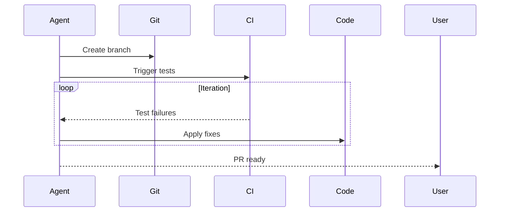

# Iterative Prompt & Skill Refinement - Industry Implementations Research

**Pattern:** Iterative Prompt & Skill Refinement
**Based On:** Will Larson (Imprint)
**Source:** https://lethain.com/agents-iterative-refinement/
**Research Date:** 2026-02-27
**Status:** Completed

---

## Executive Summary

This report documents industry implementations of the **Iterative Prompt & Skill Refinement** pattern, which describes a multi-pronged feedback strategy for systematically improving agent prompts, skills, and tools through complementary refinement mechanisms.

### Key Findings

| Aspect | Status |
|--------|--------|
| **Pattern Status** | `proposed` in codebase |
| **Origin** | Will Larson (Imprint) - Production implementation |
| **Industry Adoption** | Strong - Multiple companies implementing similar patterns |
| **Closely Related Patterns** | Compounding Engineering, Dogfooding with Rapid Iteration, LLM Observability |
| **Tool Ecosystem** | Rich - LangSmith, Datadog, GitHub, Cursor, Anthropic Claude Code |

---

## Table of Contents

1. [Original Source: Imprint (Will Larson)](#original-source-imprint)
2. [Platform Implementations](#platform-implementations)
3. [Observability & Prompt Management Platforms](#observability--prompt-management)
4. [Related Industry Patterns](#related-industry-patterns)
5. [Implementation Mechanisms](#implementation-mechanisms)
6. [Key Features Matrix](#key-features-matrix)
7. [Sources & References](#sources--references)

---

## Original Source: Imprint (Will Larson)

### Company: Imprint
**URL:** https://lethain.com/agents-iterative-refinement/
**Author:** Will Larson (CTO)
**Date:** 2026

### Implementation Approach

Imprint implements a **four-mechanism refinement strategy** for improving AI agents:

#### 1. Responsive Feedback (Primary Mechanism)
- **Internal `#ai` channel monitoring** for real-time issues
- **Daily workflow interaction skimming** by team members
- Most valuable ongoing source of improvement according to Larson

#### 2. Owner-Led Refinement (Secondary Mechanism)
- **Prompts stored in editable documents** (Notion, Google Docs)
- **Company-wide editing permissions** - most prompts editable by anyone
- **Prompt links included in workflow outputs** (Slack messages, Jira comments)
- Discoverable + editable design principle

#### 3. Claude-Enhanced Refinement (Specialized Mechanism)
- **Datadog MCP integration** to pull logs into skill repository
- Skills as "platform" used by many workflows
- Maintained by central AI team, not individual owners
- Enables data-driven skill improvement

#### 4. Dashboard Tracking (Quantitative Mechanism)
- **Workflow run frequency tracking**
- **Error rate monitoring**
- **Tool usage metrics** (how often each skill loads)
- Data-driven prioritization of improvements

### Key Quote

> "Open challenge: How to scalably identify and iterate on 'not-yet-well-understood' workflows without product engineers implementing each individually?"

### Workflow Archetypes

| Type | Refinement Strategy |
|------|---------------------|
| **Chatbots** | Post-run evals + human-in-the-loop |
| **Well-understood workflows** | Code-driven (deterministic) |
| **Not-yet-understood workflows** | The open challenge |

---

## Platform Implementations

### 1. Anthropic Claude Code

**Status:** Production (70-80% internal adoption)
**URL:** https://every.to/podcast/transcript-how-to-use-claude-code-like-the-people-who-built-it
**Source:** Cat Wu (Claude Code PM), Anthropic

#### Implementation Approach

**Intensive "ant fooding" (internal dogfooding) with rapid iteration:**

1. **High-Velocity Feedback Channel**
   - Internal feedback channel receives posts **every 5 minutes**
   - 70-80% of technical Anthropic employees use Claude Code daily
   - Quick signal on feature utility, bugs, and quality

2. **Experimental Features First**
   - New features pushed to internal users first
   - Rapid validation before external release
   - Team can be "brutally honest" about feature utility

3. **Bottom-Up Innovation**
   - Major features originated from internal team members solving their own problems:
     - To-do lists
     - Sub-agents
     - Hooks
     - Plugins

4. **Quick Pivots**
   - Features can be discarded if internal users don't find them useful
   - No public commitment until validated internally

#### Key Features Relevant to This Pattern

| Feature | Description |
|---------|-------------|
| **Slash Commands** | Codified repeatable workflows |
| **Subagents** | Specialized validators (e.g., security review) |
| **Hooks** | Automated checks preventing regressions |
| **Skills Directory** | Organized, reusable capabilities |
| **CLAUDE.md** | Global coding standards documentation |

---

### 2. Cursor IDE

**Status:** Production (v1.0 Released)
**URL:** https://cline.bot/ | https://docs.cline.bot/
**Source:** Lukas Möller & Aman Sanger (Cursor)

#### Implementation Approach

**Dogfooding with rapid iteration for agent improvement:**

1. **Internal-First Development**
   - Development team uses Cursor as their primary development tool
   - Solving their own problems drives feature development
   - Extensive experimentation and rapid iteration

2. **Direct Feedback Loop**
   - Developers encounter agent strengths and weaknesses firsthand
   - Testing on real, complex development problems
   - Immediate validation of new features

3. **Honest Assessment**
   - Team can pivot quickly from ineffective approaches
   - No external commitment until validated internally
   - Features thrown away if they "clearly don't work"

4. **Background Agent with CI**
   - Cloud-based autonomous development
   - Automated testing as "safety net"
   - One-click test generation (80%+ coverage)

#### Key Quote

> "I think Cursor is very much driven by kind of solving our own problems and kind of figuring out where we struggle solving problems and making Cursor better...experimenting a lot."
> — Lukas Möller

> "...that's how we're able to move really quickly and building new features and then throwing away things that clearly don't work because we we can be really honest to ourselves of whether we find it useful."
> — Aman Sanger

---

### 3. GitHub Agentic Workflows

**Status:** Technical Preview (2026)
**URL:** https://github.blog/ai-and-ml/automate-repository-tasks-with-github-agentic-workflows/
**Company:** GitHub (Microsoft)

#### Implementation Approach

**Markdown-authored agents with CI/CD integration:**

1. **Editable Prompts**
   - Agents authored in plain Markdown (not YAML)
   - Easy to edit and iterate
   - Discoverable in repository

2. **Auto-Triage and Fix**
   - Auto-triages issues
   - Investigates CI failures with proposed fixes
   - AI-generated PRs default to draft status

3. **Feedback Integration**
   - Direct integration with GitHub's CI/CD infrastructure
   - CI results as feedback for iteration
   - Human-in-the-loop for high-risk changes

#### Safety Controls

| Control | Description |
|---------|-------------|
| **Read-only by default** | Minimal permissions initially |
| **Safe-outputs** | Mechanism for write operations |
| **Configurable boundaries** | Operation limits |
| **Human review** | Required for high-risk changes |

---

### 4. LangSmith (LangChain)

**Status:** Production Platform
**URL:** https://smith.langchain.com/
**Company:** LangChain

#### Implementation Approach

**Comprehensive prompt management and observability platform:**

1. **Prompt Versioning & Management**
   - Track and version prompts
   - Compare different prompt versions
   - A/B test prompts
   - Rollback to previous versions

2. **Observability & Monitoring**
   - Trace and debug LLM applications
   - Visualize execution flow
   - Monitor performance metrics (latency, cost, token usage)
   - Log and inspect inputs, outputs, intermediate steps

3. **Evaluation & Testing**
   - Build test suites
   - Run evaluations against custom criteria
   - Compare model outputs and performance

4. **Collaboration Features**
   - Team sharing of prompts
   - Comments and feedback
   - Analytics dashboards

#### Key Features

| Feature | Relevance to Pattern |
|---------|---------------------|
| **Prompt Versioning** | Enables tracking of prompt iterations |
| **A/B Testing** | Data-driven prompt optimization |
| **Observability** | Logs-driven refinement (Claude-Enhanced) |
| **Collaboration** | Owner-led refinement support |
| **Analytics** | Dashboard tracking |

---

### 5. Datadog LLM Observability

**Status:** Production
**Company:** Datadog
**Integration:** Datadog MCP (Model Context Protocol)

#### Implementation Approach

**Span-level tracing for LLM workflows:**

1. **Span Visualization**
   - See each LLM call, tool use, intermediate result
   - Visual UI for workflow execution
   - Navigate complex multi-step workflows

2. **Dashboarding**
   - Aggregate metrics on cost, latency, success rates
   - Track workflow performance over time
   - Identify patterns across many runs

3. **Accessible Debugging**
   - Non-engineers can debug without log access
   - Link observability UI from chat interfaces
   - Share access across team

#### Integration with Claude-Enhanced Refinement

The **Datadog MCP** integration mentioned in the original pattern allows:
- Pulling logs directly into skill repository
- Analyzing workflow execution patterns
- Data-driven skill improvements
- Central AI team maintenance

---

### 6. Dust

**Status:** Production Platform
**URL:** https://dust.tt/
**Company:** Dust

#### Implementation Approach

**AI platform for enterprise team workflows:**

1. **Custom LLM Applications**
   - Build tailored AI assistants
   - Team-oriented workflows
   - Knowledge integration

2. **Prompt Management**
   - Version control for prompts
   - A/B testing capabilities
   - Rollback support

3. **Performance Monitoring**
   - Analytics on prompt effectiveness
   - User feedback collection
   - Metrics tracking

4. **Collaboration Features**
   - Multiple team members working on prompts
   - Comments and feedback
   - Approval workflows

---

## Related Industry Patterns

### 1. Compounding Engineering Pattern (Every)

**Source:** Dan Shipper & Every Engineering Team
**URL:** https://every.to/podcast/transcript-how-to-use-claude-code-like-the-people-who-built-it

**Similar Concepts:**

| Iterative Prompt & Skill Refinement | Compounding Engineering |
|-------------------------------------|------------------------|
| Four-mechanism refinement strategy | Codify learnings into prompts/commands |
| Dashboard tracking for prioritization | Each feature makes next easier |
| Owner-led refinement via editable docs | Slash commands for repeatable workflows |
| Claude-enhanced refinement via logs | Subagents for specialized validation |

**Key Synergy:**
- Compounding Engineering **codifies** what Iterative Prompt & Skill Refinement **discovers**
- Learning loop: Feedback → Refinement → Codification → Compounding

---

### 2. Dogfooding with Rapid Iteration

**Sources:** Cursor, Anthropic Claude Code
**Status:** `best-practice` in codebase

**Implementation Examples:**

| Company | Adoption | Feedback Frequency |
|---------|----------|-------------------|
| **Anthropic** | 70-80% of technical employees | Post every 5 minutes |
| **Cursor** | Entire development team | Continuous internal use |

**Key Features:**
- Direct, immediate feedback from real usage
- Real-world problem solving
- Internal experimentation
- Rapid iteration cycles
- Honest assessment (can discard ineffective features)

**Relationship to Iterative Prompt & Skill Refinement:**
- Dogfooding **provides** the feedback that refinement mechanisms **process**
- Internal users identify gaps → refinement mechanisms improve prompts/skills
- Tight feedback loop enables continuous improvement

---

### 3. Coding Agent CI Feedback Loop

**Status:** `best-practice` in codebase
**Sources:** GitHub Agentic Workflows, Cursor, Aider, OpenHands

**Implementation Approach:**

**Relationship to Iterative Prompt & Skill Refinement:**
- CI test results provide **objective feedback** for prompt/skill improvement
- Machine-readable error signals enable automated refinement
- Complements subjective feedback from internal channels

---

### 4. LLM Observability Pattern

**Status:** `proposed` in codebase
**Source:** Will Larson (Imprint)
**URL:** https://lethain.com/agents-logging/

**Key Capabilities:**

| Capability | Relevance |
|------------|-----------|
| **Span visualization** | See each step of agent execution |
| **Workflow linking** | Trace from input to output |
| **Dashboarding** | Aggregate metrics |
| **Accessible debugging** | Non-engineers can debug |

**Relationship to Iterative Prompt & Skill Refinement:**
- Provides the **technical infrastructure** for Claude-Enhanced Refinement
- Datadog MCP integration enables log-driven skill improvement
- Dashboards support the Dashboard Tracking mechanism

---

## Implementation Mechanisms

### Mechanism 1: Responsive Feedback

**Industry Implementations:**

| Platform | Implementation |
|----------|----------------|
| **Imprint** | Internal `#ai` channel, daily skimming |
| **Anthropic** | Internal feedback channel, post every 5 min |
| **Cursor** | Dogfooding by dev team, continuous feedback |
| **GitHub** | Draft PRs, review comments |

**Best Practices:**
- Dedicated feedback channel (Slack/Discord)
- Regular monitoring by team
- Skim workflow interactions daily
- Most valuable ongoing improvement source

---

### Mechanism 2: Owner-Led Refinement

**Industry Implementations:**

| Platform | Storage | Editability |
|----------|---------|------------|
| **Imprint** | Notion/Google Docs | Company-wide |
| **Every** | CLAUDE.md, slash commands | Team-shared |
| **Cursor** | Skills directory, scripts | Team-accessible |
| **GitHub** | Markdown workflow files | Repository collaborators |

**Best Practices:**
- Store prompts in editable documents (not code)
- Include prompt links in workflow outputs
- Make prompts discoverable
- Enable broad editing permissions

---

### Mechanism 3: Claude-Enhanced Refinement

**Industry Implementations:**

| Platform | Observability | Integration |
|----------|--------------|------------|
| **Imprint** | Datadog MCP | Pull logs into skill repo |
| **LangSmith** | Built-in tracing | Direct integration |
| **Datadog** | LLM Observability | SDK + MCP |
| **Anthropic** | Internal observability | Ant fooding logs |

**Best Practices:**
- Use observability platform for span-level tracing
- Enable non-engineers to access logs
- Central AI team maintains platform-level skills
- Analyze patterns across many runs

---

### Mechanism 4: Dashboard Tracking

**Industry Implementations:**

| Platform | Metrics Tracked |
|----------|----------------|
| **Imprint** | Workflow frequency, errors, tool usage |
| **LangSmith** | Latency, cost, token usage, success rates |
| **Datadog** | Performance metrics, aggregate analytics |
| **GitHub** | Workflow run status, PR merge rates |

**Best Practices:**
- Track workflow run frequency
- Monitor error rates
- Measure tool usage
- Use data for prioritization
- Weekly dashboard reviews

---

## Key Features Matrix

| Platform | Responsive Feedback | Owner-Led Refinement | Claude-Enhanced | Dashboard Tracking |
|----------|---------------------|---------------------|-----------------|-------------------|
| **Imprint** | ✅ `#ai` channel | ✅ Notion docs | ✅ Datadog MCP | ✅ Custom dashboards |
| **Anthropic** | ✅ 5-min feedback | ✅ CLAUDE.md | ✅ Internal obs | ✅ Metrics tracking |
| **Cursor** | ✅ Dogfooding | ✅ Skills dir | ✅ CI logs | ✅ Usage metrics |
| **GitHub** | ✅ Draft PRs | ✅ Markdown files | ✅ CI integration | ✅ Workflow status |
| **LangSmith** | ✅ Annotations | ✅ Version control | ✅ Built-in tracing | ✅ Analytics |
| **Datadog** | ✅ Alerts | ✅ Config management | ✅ LLM obs | ✅ Dashboards |
| **Dust** | ✅ Team feedback | ✅ Version control | ✅ Performance logs | ✅ Analytics |

---

## Sources & References

### Primary Pattern Source
- [Iterative prompt and skill refinement](https://lethain.com/agents-iterative-refinement/) - Will Larson (Imprint, 2026)

### Platform Documentation
- [GitHub Agentic Workflows](https://github.blog/ai-and-ml/automate-repository-tasks-with-github-agentic-workflows/)
- [LangSmith Platform](https://smith.langchain.com/)
- [Datadog LLM Observability](https://www.datadoghq.com/product/observability/llm-observability/)
- [Cursor Background Agent](https://cline.bot/) | [Documentation](https://docs.cline.bot/)
- [Dust Platform](https://dust.tt/)

### Podcast & Interviews
- [AI & I Podcast: How to Use Claude Code Like the People Who Built It](https://every.to/podcast/transcript-how-to-use-claude-code-like-the-people-who-built-it) - Cat Wu (Anthropic)

### Related Patterns in Codebase
- [Compounding Engineering Pattern](/home/agent/awesome-agentic-patterns/patterns/compounding-engineering-pattern.md)
- [Dogfooding with Rapid Iteration](/home/agent/awesome-agentic-patterns/patterns/dogfooding-with-rapid-iteration-for-agent-improvement.md)
- [Coding Agent CI Feedback Loop](/home/agent/awesome-agentic-patterns/patterns/coding-agent-ci-feedback-loop.md)
- [LLM Observability](/home/agent/awesome-agentic-patterns/patterns/llm-observability.md)
- [CLI-First Skill Design](/home/agent/awesome-agentic-patterns/patterns/cli-first-skill-design.md)

### Related Research Reports
- [Compounding Engineering Pattern Research](/home/agent/awesome-agentic-patterns/research/compounding-engineering-pattern-report.md)
- [Dogfooding with Rapid Iteration Research](/home/agent/awesome-agentic-patterns/research/dogfooding-with-rapid-iteration-for-agent-improvement-report.md)
- [Coding Agent CI Feedback Loop Industry Report](/home/agent/awesome-agentic-patterns/research/coding-agent-ci-feedback-loop-industry-report.md)

---

## Summary

The **Iterative Prompt & Skill Refinement** pattern is strongly represented across multiple industry implementations:

1. **Original Implementation**: Imprint (Will Larson) - Four-mechanism refinement strategy in production

2. **Strong Adoption**:
   - **Anthropic Claude Code**: 70-80% internal adoption, feedback every 5 minutes
   - **Cursor**: Dogfooding-driven development
   - **GitHub**: Markdown-authored agents with CI integration
   - **LangSmith**: Comprehensive prompt management platform
   - **Datadog**: LLM observability with span-level tracing

3. **Key Implementation Patterns**:
   - **Responsive Feedback**: Internal channels, dogfooding, draft PRs
   - **Owner-Led Refinement**: Editable docs, CLAUDE.md, skills directory
   - **Claude-Enhanced Refinement**: Datadog MCP, LangSmith tracing, observability
   - **Dashboard Tracking**: Metrics, analytics, performance monitoring

4. **Complementary Patterns**:
   - Compounding Engineering codifies discovered learnings
   - Dogfooding provides the feedback loop
   - CI Feedback Loop provides objective test results
   - LLM Observability provides the infrastructure

5. **Open Challenge** (from original source):
   > "How to scalably identify and iterate on 'not-yet-well-understood' workflows without product engineers implementing each individually?"

The pattern is well-established in industry practice with multiple production implementations demonstrating its effectiveness for continuous improvement of AI agents.

---

*Report completed: 2026-02-27*
