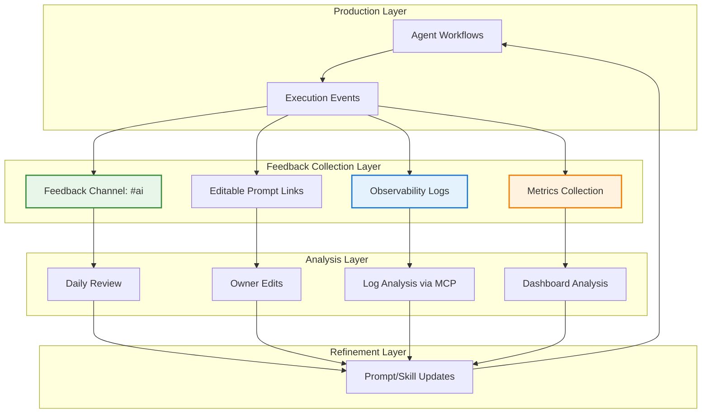
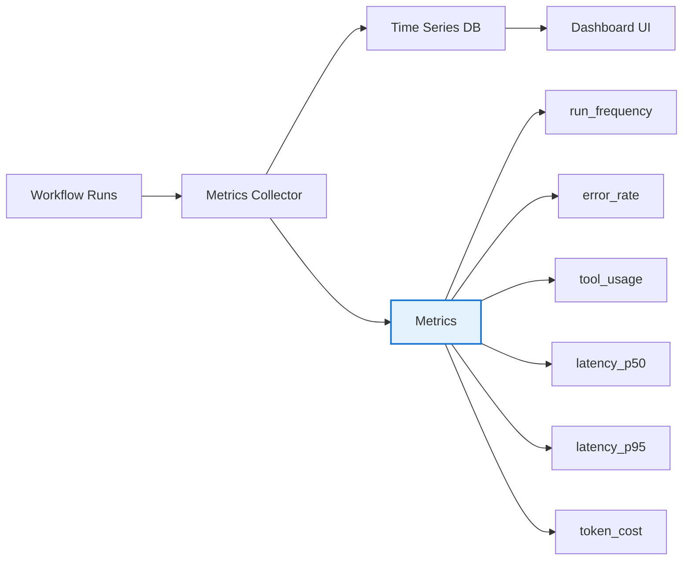
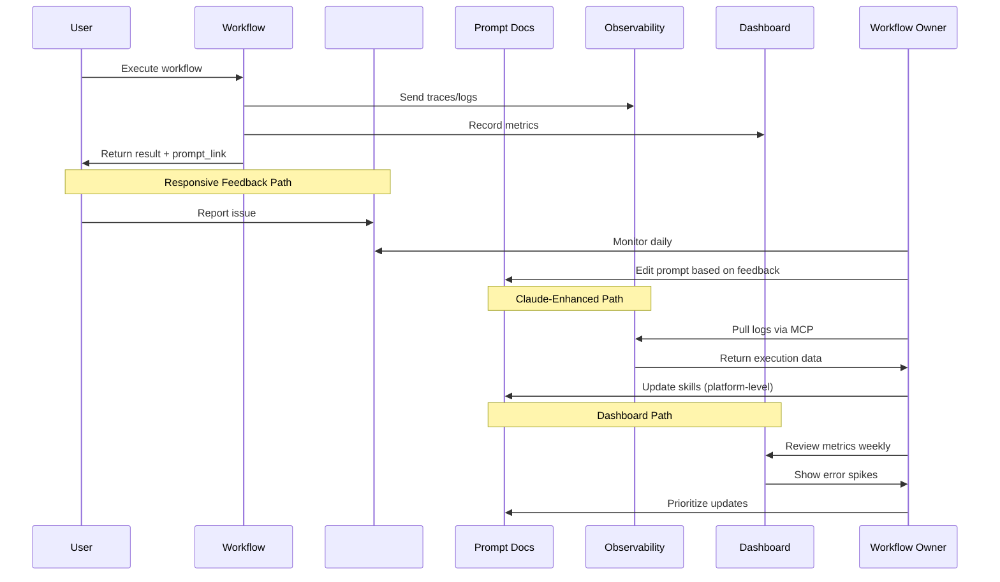
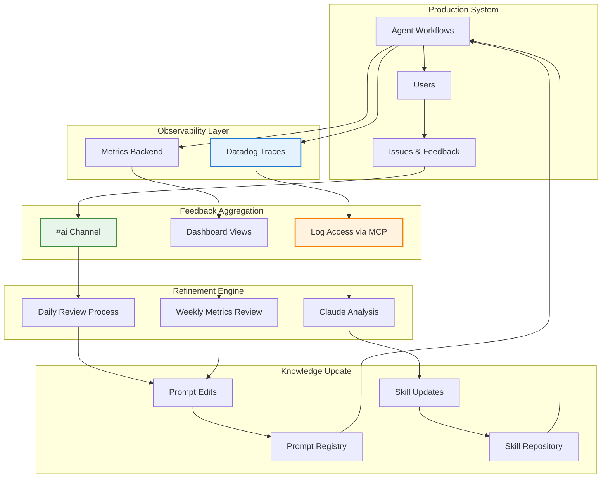

# Iterative Prompt & Skill Refinement - Technical Analysis

**Pattern Name:** Iterative Prompt & Skill Refinement
**Based On:** Will Larson (Imprint)
**Source:** https://lethain.com/agents-iterative-refinement/
**Analysis Date:** 2026-02-27
**Analysis Status:** Needs Verification (web quota limited - analysis from existing codebase documentation)

---

## Executive Summary

This technical analysis examines the Iterative Prompt & Skill Refinement pattern, a multi-mechanism feedback system for systematically improving AI agent prompts, skills, and tools. The pattern relies on four complementary refinement mechanisms working together to capture feedback from different channels and perspectives.

**Key Finding:** The pattern is architecturally sophisticated but relies heavily on manual processes and external tool integrations. Technical implementation requires significant infrastructure investment in observability, documentation systems, and feedback channels.

---

## Technical Architecture

### System Overview

The pattern implements a **four-layer feedback architecture**:



### Component Analysis

#### 1. Responsive Feedback (Primary Mechanism)

**Technical Implementation:**

- **Channel Type:** Internal messaging system (Slack/Discord)
- **Channel Name Pattern:** `#ai` or similar dedicated channel
- **Data Flow:**
  ```
  Workflow Execution → Error/Issue → User Report → #ai Channel
  ```

**Observability Requirements:**
- Real-time message ingestion
- Message threading for issue tracking
- Integration with notification systems

**Technical Considerations:**
- **Needs Verification:** Specific message format/schema for reports
- **Needs Verification:** Automated issue tagging/categorization
- **Needs Verification:** Integration rate limiting and spam prevention

#### 2. Owner-Led Refinement (Secondary Mechanism)

**Technical Implementation:**

**Prompt Storage Systems:**

| Platform | Technical Characteristics | Pros | Cons |
|----------|-------------------------|------|------|
| **Notion** | API-accessible, block-based content, rich metadata | Collaborative editing, searchable, linkable | API rate limits, sync latency |
| **Google Docs** | Document-based, real-time collaboration | Familiar UI, version history | Limited API, poor structured data |
| **Dedicated Systems** (Langfuse, LangSmith) | Purpose-built for prompt management | Versioning, A/B testing, analytics | Additional infrastructure, cost |

**Link Embedding Pattern:**
```python
# Workflow output structure
workflow_result = {
    "output": "...",
    "prompt_link": "https://notion.so/prompt-abc123",
    "metadata": {
        "workflow_id": "workflow_name",
        "version": "v1.2.3",
        "last_updated": "2026-02-27"
    }
}
```

**Technical Requirements:**
- **URL Generation:** Deterministic URL scheme for prompts
- **Permission Model:** Granular access control (edit vs. view)
- **Version Control:** Prompt versioning with rollback capability
- **Discovery:** Search/index of prompt library

**Open Questions:**
- **Needs Verification:** How to handle prompt schema changes?
- **Needs Verification:** Migration strategy between storage systems
- **Needs Verification:** Conflict resolution for concurrent edits

#### 3. Claude-Enhanced Refinement (Specialized Mechanism)

**Technical Architecture:**

```
Datadog LLM Observability → Datadog MCP Server → Claude Agent → Skill Repository
```

**MCP Integration Details:**

**MCP Server Role (Model Context Protocol):**
- **Purpose:** Exposes Datadog log data as structured tools to Claude
- **Authentication:** Datadog API credentials managed by MCP server
- **Data Transformation:** Raw logs → structured spans/metrics
- **Tool Examples:**
  - `fetch_workflow_logs(workflow_id, time_range)`
  - `get_error_distribution(workflow_name)`
  - `trace_execution(trace_id)`

**Technical Stack:**
```
┌─────────────────────────────────────────────────────────────┐
│                     Claude Agent                             │
│  - Analyzes logs via MCP tools                              │
│  - Identifies patterns in failures                          │
│  - Suggests skill improvements                              │
└─────────────────────────────────────────────────────────────┘
                            │
                            ▼
┌─────────────────────────────────────────────────────────────┐
│                  Datadog MCP Server                          │
│  - Credentials: DD_API_KEY, DD_APP_KEY                      │
│  - Tools: Log query, trace fetch, metrics retrieval         │
│  - Rate limiting: Configurable quotas                       │
└─────────────────────────────────────────────────────────────┘
                            │
                            ▼
┌─────────────────────────────────────────────────────────────┐
│                  Datadog LLM Observability                   │
│  - Span-level tracing                                        │
│  - Workflow execution logs                                   │
│  - Error/cost/latency metrics                               │
└─────────────────────────────────────────────────────────────┘
```

**Key Technical Requirements:**
- **MCP Server Hosting:** Needs to run alongside agent infrastructure
- **Credential Management:** Secure storage of Datadog API keys
- **Log Retention:** Sufficient retention policy for pattern analysis
- **Context Window:** Log size must fit within agent context limits

**Open Questions:**
- **Needs Verification:** Is there a public Datadog MCP server implementation?
- **Needs Verification:** Cost implications for Datadog LLM Observability
- **Needs Verification:** Optimal log sampling strategy for analysis

#### 4. Dashboard Tracking (Quantitative Mechanism)

**Metrics Architecture:**



**Required Metrics:**

| Metric | Type | Purpose | Technical Implementation |
|--------|------|---------|-------------------------|
| **Workflow Run Frequency** | Counter | Identify popular workflows | `count(workflow executions)` by workflow_name |
| **Error Rate** | Gauge | Priority signal for fixes | `errors / total_executions` |
| **Tool/Skill Usage** | Histogram | Identify underutilized skills | `count(tool_invocations)` by tool_name |
| **Latency** | Histogram | Performance regression | `duration_ms` percentiles (p50, p95, p99) |
| **Token Cost** | Counter | Cost optimization | `input_tokens + output_tokens` |

**Dashboard Tooling Options:**

| Tool | Integration Complexity | Features | Cost |
|------|----------------------|----------|------|
| **Datadog** | Low (if using for observability) | Unified with logs, alerts | High |
| **Grafana** | Medium | Flexible, open-source | Low/Medium |
| **Custom** | High | Tailored to needs | Variable |

**Technical Requirements:**
- **Metrics Backend:** Time-series database (Prometheus, Datadog, InfluxDB)
- **Retention:** 30-90 days for trend analysis
- **Alerting:** Threshold-based alerts for error spikes
- **Dashboard Discovery:** Link to dashboards from workflow outputs

---

## Implementation Details

### Data Flow Between Mechanisms



### Scalability Considerations

#### Feedback Throughput Analysis

| Mechanism | Frequency | Volume | Scaling Challenge |
|-----------|-----------|--------|-------------------|
| **#ai Channel** | Continuous (5 min intervals) | High (hundreds/day) | Message triage, noise filtering |
| **Prompt Edits** | Ad-hoc, on-demand | Low-Medium | Concurrent edit handling |
| **Log Analysis** | Weekly/batch | High (log volume) | Context window limits, sampling |
| **Dashboard Review** | Weekly | Low (aggregate) | Metric cardinality |

#### Bottlenecks & Mitigations

**1. Feedback Channel Overload**
- **Problem:** High volume creates review burden
- **Mitigation:**
  - Automated issue classification
  - Severity-based routing
  - Digest/summary mode

**2. Log Analysis Context Limits**
- **Problem:** Execution logs exceed agent context
- **Mitigation:**
  - Log sampling strategies
  - Span-level summarization
  - Focused analysis on failures only

**3. Prompt Edit Conflicts**
- **Problem:** Multiple editors modifying same prompt
- **Mitigation:**
  - Edit locking/check-out system
  - Change review/approval workflow
  - A/B testing framework for variants

### Infrastructure Requirements

#### Minimum Viable Infrastructure

```
┌─────────────────────────────────────────────────────────────┐
│                    Required Components                       │
├─────────────────────────────────────────────────────────────┤
│ 1. Agent Runtime with Observability SDK                     │
│    - Datadog LLM Observability agent                        │
│    - Structured logging configuration                       │
├─────────────────────────────────────────────────────────────┤
│ 2. Prompt Storage System                                    │
│    - Notion/Google Docs with API access                    │
│    - OR dedicated prompt management (Langfuse, LangSmith)   │
├─────────────────────────────────────────────────────────────┤
│ 3. Feedback Channel                                         │
│    - Slack/Discord workspace                                │
│    - Webhook/API integration                                │
├─────────────────────────────────────────────────────────────┤
│ 4. Observability Platform                                   │
│    - Datadog LLM Observability (recommended)                │
│    - Alternative: LangSmith, Arize, custom                  │
├─────────────────────────────────────────────────────────────┤
│ 5. Metrics Backend + Dashboard                              │
│    - Datadog (if using for observability)                  │
│    - Grafana + Prometheus                                   │
├─────────────────────────────────────────────────────────────┤
│ 6. MCP Server for Log Access                                │
│    - Datadog MCP (if available)                             │
│    - OR custom MCP server implementation                     │
└─────────────────────────────────────────────────────────────┘
```

#### Cost Considerations

| Component | Estimated Monthly Cost (Small Team) | Notes |
|-----------|-------------------------------------|-------|
| **Datadog LLM Observability** | $500-$2,000 | Based on usage volume |
| **Prompt Storage (Notion)** | $10-$20 | Team plan |
| **Slack** | $8-$15/user/month | Per-seat pricing |
| **Custom Infrastructure** | Variable | Hosting, maintenance |

---

## Technical Insights

### What Makes This Pattern Work

1. **Complementary Coverage:**
   - Human feedback (#ai channel) catches qualitative issues
   - Metrics catch quantitative problems (error spikes)
   - Log analysis identifies systemic patterns
   - Direct edits enable rapid iteration

2. **Low Friction:**
   - Prompt links in outputs make discovery immediate
   - Editable docs lower barrier to contribution
   - Daily review cadence prevents backlog buildup

3. **Data-Driven Prioritization:**
   - Metrics reveal which workflows need attention
   - Error rates guide improvement focus
   - Usage statistics prevent optimizing rarely-used features

### Technical Challenges

1. **Observability Integration Complexity:**
   - Requires SDK integration into all agent code
   - Span naming conventions must be consistent
   - Trace context must propagate across systems

2. **Prompt Storage Trade-offs:**
   - **Notion/Docs:** Easy editing, poor versioning
   - **Code (Git):** Good versioning, poor discoverability
   - **Dedicated systems:** Best of both, additional cost

3. **Feedback Signal-to-Noise:**
   - High-volume channels need filtering
   - False positives from user misunderstanding
   - Subjective feedback hard to quantify

4. **MCP Server Availability:**
   - **Needs Verification:** Is Datadog MCP publicly available?
   - If not, requires custom MCP server development
   - MCP protocol adds integration complexity

### Required Infrastructure

**Production-Ready Stack:**

```yaml
observability:
  provider: datadog
  features:
    - llm_observability
    - span_tracing
    - log_retention: "90d"

prompt_storage:
  type: notion  # or langsmith, custom
  features:
    - versioning
    - permissions
    - search
    - api_access

feedback:
  channel: slack
  webhook_url: "${SLACK_WEBHOOK_URL}"
  channel_name: "#ai"

metrics:
  backend: datadog  # or prometheus
  dashboards:
    - workflow_frequency
    - error_rates
    - tool_usage

mcp_servers:
  - name: datadog
    enabled: true
    credentials:
      api_key: "${DD_API_KEY}"
      app_key: "${DD_APP_KEY}"
```

---

## Open Technical Questions

### Not Specified in Source

| Question | Importance | Impact |
|----------|------------|--------|
| **Datadog MCP Implementation** | High | May require custom MCP server development |
| **Prompt Schema Format** | Medium | Affects migration and tooling choices |
| **Feedback Categorization** | Medium | Manual vs. automated triage |
| **Version Control Strategy** | Medium | Rollback and A/B testing capability |
| **Permission Model** | Low-Medium | Who can edit which prompts |
| **Integration Code Examples** | High | No concrete implementation samples in source |

### What Would Need to Be Built

1. **Datadog MCP Server** (if not available):
   ```python
   # Conceptual structure
   class DatadogMCPServer:
       def __init__(self, api_key, app_key):
           self.client = DatadogClient(api_key, app_key)

       @mcp_tool
       def fetch_workflow_logs(self, workflow_id, time_range):
           """Fetch execution logs for a workflow"""
           return self.client.query_logs(
               query=f"workflow_id:{workflow_id}",
               time_range=time_range
           )

       @mcp_tool
       def get_error_distribution(self, workflow_name):
           """Get error breakdown by type"""
           return self.client.query_metrics(
               query=f"sum:agent.errors{workflow_name}",
               by="error_type"
           )
   ```

2. **Prompt Link Generation System:**
   ```python
   class PromptRegistry:
       def __init__(self, storage_backend):
           self.backend = storage_backend

       def get_prompt_link(self, workflow_name, version="latest"):
           """Generate discoverable link to prompt"""
           prompt_id = self.backend.resolve_id(workflow_name, version)
           return self.backend.generate_url(prompt_id)

       def render_output_with_link(self, result, workflow_name):
           """Append prompt link to workflow output"""
           link = self.get_prompt_link(workflow_name)
           return {
               **result,
               "prompt_link": link
           }
   ```

3. **Metrics Collection Layer:**
   ```python
   class WorkflowMetrics:
       def __init__(self, metrics_backend):
           self.backend = metrics_backend

       def record_execution(self, workflow_name, duration, success, tools_used):
           """Record workflow execution metrics"""
           self.backend.increment("agent.workflow.runs", tags=[f"workflow:{workflow_name}"])
           self.backend.histogram("agent.workflow.duration", duration, tags=[f"workflow:{workflow_name}"])
           if not success:
               self.backend.increment("agent.workflow.errors", tags=[f"workflow:{workflow_name}"])

           for tool in tools_used:
               self.backend.increment("agent.tool.usage", tags=[f"tool:{tool}"])
   ```

### Tool Integrations Required

| Tool | Integration Effort | Availability |
|------|-------------------|--------------|
| **Datadog LLM Observability** | Low (SDK install) | Generally Available |
| **Datadog MCP Server** | Unknown (may need custom) | **Needs Verification** |
| **Notion API** | Medium | Public API available |
| **Slack Webhooks** | Low | Well-documented |
| **Dashboard (Datadog/Grafana)** | Low-Medium | Standard tooling |

---

## Architecture Patterns

### Feedback Loop Architecture



### Data Pipeline for Metrics

```
┌──────────────┐
│ Agent Code   │
│ - ddtrace    │
│ - metrics    │
└──────┬───────┘
       │
       ▼
┌──────────────┐
│ Datadog      │
│ Agent        │
└──────┬───────┘
       │
       ▼
┌──────────────────────────────────────┐
│ Datadog API                         │
│ - LLM Observability endpoint        │
│ - Metrics API                       │
└──────┬───────────────────────────────┘
       │
       ▼
┌──────────────────────────────────────┐
│ MCP Server (Datadog)                │
│ - Exposes logs as tools             │
│ - Transforms queries                │
└──────┬───────────────────────────────┘
       │
       ▼
┌──────────────────────────────────────┐
│ Claude Agent                        │
│ - Analyzes logs                     │
│ - Identifies patterns               │
│ - Suggests improvements             │
└──────────────────────────────────────┘
```

---

## Recommendations for Implementation

### Phase 1: Foundation (Week 1-2)
1. Set up observability (Datadog LLM Observability or equivalent)
2. Create internal feedback channel (#ai)
3. Establish prompt storage system (Notion/Google Docs)
4. Implement prompt link generation in workflow outputs

### Phase 2: Metrics & Dashboards (Week 3-4)
1. Add metrics collection to all workflows
2. Build dashboards for key metrics (run frequency, errors, tool usage)
3. Set up alerts for error spikes
4. Create weekly review process

### Phase 3: Log Analysis (Week 5-6)
1. **Verify Datadog MCP availability or build custom MCP server**
2. Implement log analysis workflows
3. Create skill update process based on log patterns
4. Document platform-level skill maintenance

### Phase 4: Automation & Optimization (Ongoing)
1. Automate issue categorization in feedback channel
2. Implement prompt A/B testing framework
3. Add version control and rollback capabilities
4. Build automated prompt testing (evals)

---

## Related Patterns

This pattern integrates with several related patterns:

1. **LLM Observability** - Provides the logging infrastructure
2. **Skill Library Evolution** - Manages the skill repository
3. **Workflow Evals with Mocked Tools** - Validates prompt changes
4. **Memory Synthesis from Execution Logs** - Complements log analysis
5. **Dogfooding with Rapid Iteration** - Provides internal usage feedback

---

## Sources & References

* [Iterative prompt and skill refinement](https://lethain.com/agents-iterative-refinement/) - Will Larson (Imprint, 2026)
* [Building an internal agent: Logging and debugability](https://lethain.com/agents-logging/) - Will Larson (Imprint, 2025)
* [Building an internal agent: Adding support for Agent Skills](https://lethain.com/agents-skills/) - Will Larson (Imprint, 2025)
* Datadog LLM Observability documentation
* Model Context Protocol (MCP) specification
* Langfuse/LangSmith documentation for prompt management

---

## Appendix: Technical Specifications

### Prompt Metadata Schema

```yaml
# Proposed schema for prompt metadata
prompt_metadata:
  id: "prompt-abc123"
  name: "Workflow: JIRA Ticket Creation"
  version: "1.2.3"
  created_at: "2026-02-01T00:00:00Z"
  updated_at: "2026-02-27T10:30:00Z"
  author: "user@example.com"
  workflow: "jira_ticket_creation"
  tags: [jira, ticket, creation]
  status: "active"
  links:
    view: "https://notion.so/prompt-abc123"
    edit: "https://notion.so/prompt-abc123/edit"
    history: "https://notion.so/prompt-abc123/versions"
  metrics:
    usage_count: 1247
    success_rate: 0.94
    last_used: "2026-02-27T09:15:00Z"
```

### Metric Tagging Strategy

```yaml
# Recommended tags for metrics
metric_tags:
  # Workflow identification
  - workflow_name: "jira_ticket_creation"
  - workflow_version: "v1.2.3"

  # Execution context
  - environment: "production"  # or staging, development
  - user_team: "engineering"

  # Tool usage
  - tool_name: "slack_api"
  - tool_category: "mcp_server"

  # Error classification
  - error_type: "timeout"
  - error_stage: "tool_execution"

  # Performance
  - model: "claude-opus-4-6"
  - tier: "tier1"  # workflow priority
```

---

*Analysis generated on 2026-02-27*
*Status: Needs Verification - web research quota limited, analysis based on existing codebase documentation*
