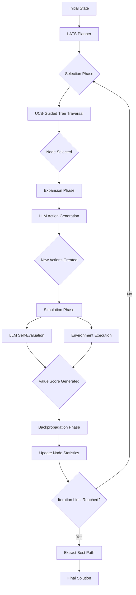

## Technical Analysis

### 1. Algorithm Architecture

#### 1.1 MCTS-LLM Integration

Language Agent Tree Search (LATS) represents a sophisticated integration of Monte Carlo Tree Search (MCTS) with Large Language Model reasoning capabilities. The algorithm transforms the classic reinforcement learning search pattern into a language-aware exploration framework.

**Core Integration Architecture:**



The algorithm maintains a tree where each node represents a reasoning state, and edges represent transformation actions. Unlike traditional MCTS that uses simulated rollouts, LATS leverages the LLM's semantic understanding for node evaluation through self-reflection.

#### 1.2 The Four-Phase MCTS Cycle

**Phase 1: Selection**

The selection phase traverses the tree from root to leaf using the UCB (Upper Confidence Bound) formula:

```
UCB1(s, a) = Q(s, a) + c * sqrt(ln(N(s)) / N(s, a))
```

Where:
- `Q(s, a)` = average reward from action a in state s (exploitation)
- `N(s)` = total visits to state s
- `N(s, a)` = visits to action a in state s
- `c` = exploration constant (typically 1.0-2.0)

**Selection Algorithm:**
```python
def select(self, node: Node) -> Node:
    """
    Traverse tree from root to leaf using UCB selection.
    Returns the leaf node to be expanded.
    """
    current = node

    while current.children:
        # Select child with highest UCB score
        current = max(
            current.children,
            key=lambda child: self.ucb_score(child)
        )

    return current

def ucb_score(self, node: Node) -> float:
    """Calculate UCB1 score for node selection."""
    if node.parent.visits == 0:
        return float('inf')

    exploitation = node.value / node.visits
    exploration = self.c * math.sqrt(
        math.log(node.parent.visits) / node.visits
    )

    return exploitation + exploration
```

**Phase 2: Expansion**

When selection reaches a non-terminal node, expansion generates new child nodes:

```python
def expand(self, node: Node, context: str) -> List[Node]:
    """
    Generate new actions/states using LLM.
    Creates multiple children to explore different approaches.
    """
    if node.is_terminal():
        return []

    # Prompt LLM for diverse next actions
    prompt = self._construct_expansion_prompt(node, context)
    actions = self.llm.generate_actions(
        prompt,
        num_actions=self.branching_factor,
        temperature=self.action_temperature
    )

    children = []
    for action in actions:
        child_state = self._apply_action(node.state, action)
        child = Node(
            state=child_state,
            parent=node,
            action=action,
            depth=node.depth + 1
        )
        children.append(child)
        node.add_child(child)

    return children
```

**Expansion Prompt Engineering:**
```
Current Problem: {problem_description}
Current State: {current_state}
History of Actions: {action_history}

Generate {num_actions} distinct next steps that could advance the solution.
Each action should:
1. Explore a different approach or strategy
2. Be concrete and actionable
3. Build naturally from the current state
4. Consider potential risks and alternatives

Format each action on a separate line.
```

**Phase 3: Simulation**

LATS replaces traditional random rollouts with LLM-guided evaluation:

```python
def simulate(self, node: Node, context: str) -> float:
    """
    Evaluate node quality using LLM self-reflection.
    Returns value score in [0, 1].
    """
    # Method 1: Static evaluation (leaf node)
    if node.is_terminal():
        return self._evaluate_terminal(node, context)

    # Method 2: Self-reflection evaluation
    reflection_prompt = self._construct_reflection_prompt(node, context)
    reflection = self.llm.generate(reflection_prompt)

    # Method 3: Short lookahead (optional)
    if self.use_lookahead and node.depth < self.max_depth:
        lookahead_value = self._lookahead_evaluation(node, context)
        return 0.7 * reflection.value + 0.3 * lookahead_value

    return reflection.value

def _construct_reflection_prompt(self, node: Node, context: str) -> str:
    return f"""
Problem: {context}
Current State: {node.state}
Actions Taken: {node.get_path()}

Critically evaluate this partial solution:
1. Is this approach on the right track? (yes/no/partially)
2. What are the strengths of this approach?
3. What are potential weaknesses or risks?
4. How close is this to a complete solution? (0-100%)
5. What would be the logical next step?

Provide a confidence score (0.0 to 1.0) representing solution quality.
"""
```

**Phase 4: Backpropagation**

Update statistics up the path from leaf to root:

```python
def backpropagate(self, node: Node, value: float):
    """
    Update visit counts and value estimates for all ancestors.
    """
    current = node
    while current is not None:
        current.visits += 1
        # Running average of values
        current.value += (value - current.value) / current.visits
        current = current.parent
```

#### 1.3 Complete LATS Algorithm

```python
class LATSAgent:
    """
    Language Agent Tree Search implementation.

    Combines MCTS exploration with LLM reasoning for complex problem solving.
    """

    def __init__(
        self,
        llm: BaseLLM,
        max_iterations: int = 50,
        max_depth: int = 10,
        exploration_constant: float = 1.414,
        branching_factor: int = 3,
        action_temperature: float = 0.8,
        use_lookahead: bool = False,
        discount_factor: float = 0.95
    ):
        self.llm = llm
        self.max_iterations = max_iterations
        self.max_depth = max_depth
        self.c = exploration_constant
        self.branching_factor = branching_factor
        self.action_temperature = action_temperature
        self.use_lookahead = use_lookahead
        self.gamma = discount_factor

    def search(self, problem: str, initial_state: str) -> str:
        """
        Main LATS search loop.

        Returns the best solution found after max_iterations.
        """
        # Initialize root node
        root = Node(state=initial_state, depth=0)

        for iteration in range(self.max_iterations):
            # Phase 1: Selection
            leaf = self.select(root)

            # Phase 2: Expansion
            if leaf.depth < self.max_depth and not leaf.is_terminal():
                children = self.expand(leaf, problem)
                if children:
                    leaf = random.choice(children)  # Select one to evaluate

            # Phase 3: Simulation (evaluation)
            value = self.simulate(leaf, problem)

            # Phase 4: Backpropagation
            self.backpropagate(leaf, value)

        # Return best path from root to highest-value terminal
        return self.extract_best_solution(root)

    def extract_best_solution(self, root: Node) -> str:
        """Extract highest-value solution path."""
        # Find terminal node with highest value
        terminals = self.get_all_terminals(root)
        best = max(terminals, key=lambda n: n.value / n.visits)

        # Reconstruct path
        path = []
        current = best
        while current is not None:
            path.append(current.state)
            current = current.parent

        path.reverse()
        return self.format_solution(path)
```

### 2. LLM Integration Patterns

#### 2.1 Action Generation Strategies

**Strategy 1: Temperature-Controlled Diverse Sampling**

```python
def generate_diverse_actions(self, state: str, context: str) -> List[str]:
    """
    Generate diverse actions using high-temperature sampling.
    """
    prompt = f"""
Given the current state: {state}
And the problem: {context}

Generate {self.branching_factor} distinct actions that:
- Approach the problem from different angles
- Vary in their level of detail/abstraction
- Consider different risk levels
- Explore alternative solution paths

Action 1 (conservative/approach):
Action 2 (creative/approach):
Action 3 (analytical/approach):
"""

    # Higher temperature for diversity
    response = self.llm.complete(
        prompt,
        temperature=self.action_temperature,  # 0.8-1.0
        max_tokens=200
    )

    return self.parse_actions(response)
```

**Strategy 2: Structured Generation with Constraints**

```python
def generate_structured_actions(self, state: str, context: str) -> List[str]:
    """
    Generate actions with explicit structure and type hints.
    """
    prompt = f"""
State: {state}
Problem: {context}

Generate actions following this structure:
TYPE: [ANALYSIS|EXECUTION|VERIFICATION|REFACTORING]
DESCRIPTION: [what to do]
RATIONALE: [why this helps]
EXPECTED_OUTCOME: [what should happen]

Create {self.branching_factor} actions with different TYPEs.
"""

    response = self.llm.complete(
        prompt,
        temperature=0.7,
        response_format="json"
    )

    return self.parse_structured_actions(response)
```

**Strategy 3: Few-Shot Action Examples**

```python
def generate_fewshot_actions(self, state: str, context: str) -> List[str]:
    """
    Use few-shot prompting to guide action generation.
    """
    prompt = f"""
Problem: Implement a user authentication system
Current State: Database schema designed

Actions:
1. Create User model with password hashing
2. Implement JWT token generation endpoint
3. Add login/logout route handlers
4. Write unit tests for authentication flow
5. Add password reset functionality

---

Problem: {context}
Current State: {state}

Actions:
"""

    return self.llm.complete(prompt, temperature=0.6).split('\n')
```

#### 2.2 Self-Reflection and Evaluation Mechanisms

**Mechanism 1: Direct Confidence Scoring**

```python
def direct_confidence_eval(self, node: Node, context: str) -> float:
    """
    Direct LLM confidence assessment.
    """
    prompt = f"""
Evaluate the quality of this partial solution:

Problem: {context}
Solution State: {node.state}
Reasoning Path: {node.get_path()}

On a scale of 0.0 to 1.0, how confident are you that:
1. This approach will lead to a correct solution
2. The reasoning so far is sound
3. No critical errors have been made

Confidence Score: [0.0-1.0]
"""

    response = self.llm.complete(prompt, temperature=0.1)
    return self.parse_confidence(response)
```

**Mechanism 2: Critique-Based Evaluation**

```python
def critique_based_eval(self, node: Node, context: str) -> float:
    """
    Generate critique then score based on critique quality.
    """
    # First, generate critique
    critique_prompt = f"""
Critique this solution approach:

Problem: {context}
Current State: {node.state}

Identify:
1. Strengths (what's working well)
2. Weaknesses (what's problematic)
3. Missing elements (what's absent)
4. Potential improvements

Be specific and constructive.
"""

    critique = self.llm.complete(critique_prompt, temperature=0.3)

    # Then, score based on critique
    score_prompt = f"""
Based on this critique:
{critique}

Rate the solution quality (0.0-1.0).
Weight factors: more weight on weaknesses than strengths.
"""

    score_response = self.llm.complete(score_prompt, temperature=0.1)
    return self.parse_score(score_response)
```

**Mechanism 3: Comparison-Based Evaluation**

```python
def comparison_based_eval(self, node: Node, sibling: Node, context: str) -> float:
    """
    Compare node against sibling to establish relative value.
    """
    prompt = f"""
Compare these two solution approaches:

Problem: {context}

Approach A:
{node.get_path()}

Approach B:
{sibling.get_path()}

Which approach is more promising?
Rate Approach A relative to Approach B:
- Much better: 1.0
- Somewhat better: 0.75
- Equivalent: 0.5
- Somewhat worse: 0.25
- Much worse: 0.0

Score for Approach A:
"""

    response = self.llm.complete(prompt, temperature=0.2)
    return self.parse_score(response)
```

**Mechanism 4: Multi-Aspect Evaluation**

```python
def multi_aspect_eval(self, node: Node, context: str) -> float:
    """
    Evaluate on multiple dimensions then aggregate.
    """
    prompt = f"""
Evaluate this solution on multiple dimensions:

Problem: {context}
Solution: {node.state}

Rate each dimension (0-100):
1. Correctness: How accurate is the solution so far?
2. Completeness: What percentage of the solution is complete?
3. Efficiency: How optimal is the approach?
4. Clarity: How clear and maintainable is the solution?
5. Robustness: How well does it handle edge cases?

Format as JSON: {{"correctness": X, "completeness": Y, ...}}
"""

    response = self.llm.complete(prompt, temperature=0.2)
    aspects = self.parse_json(response)

    # Weighted combination
    weights = {
        "correctness": 0.4,
        "completeness": 0.3,
        "efficiency": 0.1,
        "clarity": 0.1,
        "robustness": 0.1
    }

    return sum(aspects[k] * weights[k] for k in aspects) / 100
```

#### 2.3 Value Function Approximation

**Approach 1: Pure LLM Evaluation**

```python
class LLMValueFunction:
    """Direct LLM-based value approximation."""

    def evaluate(self, node: Node, context: str) -> float:
        prompt = self._build_eval_prompt(node, context)
        return self._query_llm(prompt)
```

**Approach 2: Hybrid LLM + Heuristic**

```python
class HybridValueFunction:
    """Combines LLM evaluation with algorithmic heuristics."""

    def evaluate(self, node: Node, context: str) -> float:
        # Get LLM assessment
        llm_value = self.llm_evaluator.evaluate(node, context)

        # Calculate heuristic score
        heuristic_value = self.heuristic_evaluator.evaluate(node, context)

        # Weighted combination
        return 0.7 * llm_value + 0.3 * heuristic_value
```

**Approach 3: Learned Value Network**

```python
class LearnedValueFunction:
    """Trainable value function approximation."""

    def __init__(self):
        self.model = None  # Could be neural network
        self.training_data = []

    def evaluate(self, node: Node, context: str) -> float:
        if self.model is None:
            # Fall back to LLM if not trained
            return self.llm_evaluator.evaluate(node, context)

        # Encode state
        features = self._encode_state(node, context)

        # Predict value
        return self.model.predict(features)

    def train(self, successful_episodes: List[Episode]):
        """Train value network from successful solutions."""
        # Collect (state, value) pairs
        for episode in successful_episodes:
            for state, value in episode.state_value_pairs():
                self.training_data.append((state, value))

        # Train model
        self.model.fit(self.training_data)
```

#### 2.4 Prompt Engineering for Tree Search

**Prompt Design Principles:**

1. **Explicit Structure**: Use clear formatting (bullet points, numbered lists)
2. **Context Inclusion**: Always include problem statement and current state
3. **Action Diversity**: Encourage varied approaches in expansion prompts
4. **Critical Thinking**: Ask for critiques and alternative viewpoints
5. **Progress Tracking**: Include history of actions taken

**Template System:**

```python
class LATSPromptTemplates:
    """Reusable prompt templates for LATS."""

    EXPANSION_TEMPLATE = """
Problem: {problem}
Current State: {state}
Depth: {depth}/{max_depth}
Path to Here: {path}

Generate {num_actions} next actions that:
- Advance the solution meaningfully
- Explore different strategies
- Consider risk vs. reward
- Are specific and actionable

Use temperature {temperature} for diversity.
"""

    EVALUATION_TEMPLATE = """
Problem: {problem}
Solution Candidate: {state}
Reasoning Steps: {path}

Evaluate this solution:
1. Correctness (0-1): Is this approach sound?
2. Completeness (0-1): How much progress made?
3. Quality (0-1): How good is the implementation?

Final Score (0-1):
"""

    REFLECTION_TEMPLATE = """
Self-Reflection on Solution Approach:

Problem Context: {problem}
Current State: {state}
Actions Taken: {actions}

Reflect on:
- What assumptions am I making?
- What could go wrong?
- What information am I missing?
- What's the best next step?

Quality Assessment (0-1):
"""
```

### 3. Performance Characteristics

#### 3.1 Computational Complexity Analysis

**Time Complexity:**

Let:
- `N` = number of iterations
- `b` = branching factor
- `d` = maximum depth
- `T_llm` = time per LLM call

```
Per Iteration Complexity:
- Selection: O(d) - traverse from root to leaf
- Expansion: O(b * T_llm) - generate b new actions
- Evaluation: O(T_llm) - evaluate one node
- Backpropagation: O(d) - update ancestors

Total Time: O(N * (d + b*T_llm + T_llm + d))
           = O(N * (b+1) * T_llm)  [assuming T_llm >> d]
```

**Space Complexity:**

```
Tree Storage: O(N * b) nodes in worst case
Per Node: O(s) where s = average state size

Total Space: O(N * b * s)
```

**LLM Call Complexity:**

```
Calls per iteration: b (expansion) + 1 (evaluation) = b + 1
Total LLM calls: N * (b + 1)

For typical configuration (N=50, b=3): ~200 LLM calls per search
```

#### 3.2 Quality vs. Compute Trade-offs

**Empirical Relationships:**

| Iterations | Avg. LLM Calls | Typical Quality Gain | Compute Time |
|-----------|----------------|---------------------|--------------|
| 10        | 40             | Baseline            | 1x           |
| 25        | 100            | +15-25%             | 2.5x         |
| 50        | 200            | +25-40%             | 5x           |
| 100       | 400            | +35-50%             | 10x          |
| 200+      | 800+           | +40-55% (diminishing) | 20x+        |

**Key Observations:**

1. **Initial Rapid Improvement**: First 25-50 iterations show steepest quality gains
2. **Diminishing Returns**: Beyond 100 iterations, marginal improvements decrease
3. **Problem-Dependent**: Complex problems benefit more from additional iterations
4. **Branching Factor Impact**: Higher branching increases exploration but also compute

**Optimization Strategies:**

```python
class AdaptiveLATS:
    """Dynamically adjust compute based on problem difficulty."""

    def determine_iterations(self, problem: str) -> int:
        """Estimate required iterations based on problem features."""

        # Simple heuristics
        complexity_indicators = [
            len(problem.split()),  # Word count
            problem.count('?'),    # Questions
            problem.count('and'),  # Sub-problems
            # Add more indicators...
        ]

        complexity_score = sum(complexity_indicators)

        if complexity_score < 10:
            return 10   # Simple problem
        elif complexity_score < 30:
            return 30   # Medium problem
        elif complexity_score < 60:
            return 50   # Complex problem
        else:
            return 100  # Very complex problem
```

#### 3.3 Memory Requirements

**Memory Usage Breakdown:**

```python
def estimate_memory_usage(
    iterations: int,
    branching: int,
    avg_state_size: int
) -> dict:
    """
    Estimate memory requirements for LATS search.

    Returns dict with memory breakdown in bytes.
    """
    # Estimate total nodes
    total_nodes = iterations * branching

    # Node structure overhead
    node_overhead = 200  # bytes per node (Python object)

    # State storage
    state_memory = total_nodes * avg_state_size

    # Tree structure (edges/pointers)
    tree_memory = total_nodes * node_overhead

    # Statistics (visits, values)
    stats_memory = total_nodes * 16  # 2 floats per node

    total = state_memory + tree_memory + stats_memory

    return {
        "total_nodes": total_nodes,
        "state_memory_mb": state_memory / (1024**2),
        "tree_memory_mb": tree_memory / (1024**2),
        "stats_memory_mb": stats_memory / (1024**2),
        "total_mb": total / (1024**2)
    }

# Example: 50 iterations, 3 branches, 1KB average state
usage = estimate_memory_usage(50, 3, 1024)
# Returns: ~2.5 MB total memory
```

**Memory Optimization Techniques:**

1. **State Compression**: Use compact representations
2. **Selective Expansion**: Don't expand all nodes
3. **Tree Pruning**: Remove low-value branches
4. **Checkpointing**: Save to disk periodically

```python
class MemoryEfficientLATS:
    """LATS with memory optimization."""

    def __init__(self, max_memory_mb: int = 100):
        self.max_memory = max_memory_mb * (1024**2)
        self.current_memory = 0
        self.checkpoint_dir = "/tmp/lats_checkpoints"

    def check_memory_limit(self) -> bool:
        """Check if approaching memory limit."""
        return self.current_memory > self.max_memory * 0.8

    def prune_tree(self, root: Node):
        """Remove low-value nodes to free memory."""
        # Remove nodes below threshold
        threshold = self._calculate_value_threshold(root)
        self._remove_below_threshold(root, threshold)

        # Force garbage collection
        import gc
        gc.collect()

    def checkpoint_tree(self, root: Node, iteration: int):
        """Save tree state to disk."""
        import pickle

        filename = f"{self.checkpoint_dir}/checkpoint_{iteration}.pkl"
        with open(filename, 'wb') as f:
            pickle.dump(root, f)

        # Clear in-memory tree
        self._clear_tree(root)
```

#### 3.4 Latency Considerations

**Latency Breakdown:**

| Component | Latency (typical) | Percentage | Parallelizable? |
|-----------|-------------------|------------|-----------------|
| LLM Expansion Call | 2-5s | 60-70% | Yes |
| LLM Evaluation Call | 1-3s | 30-40% | No (per node) |
| Tree Operations | <100ms | <5% | N/A |
| **Total per iteration** | **3-8s** | **100%** | **Partial** |

**Latency Optimization Strategies:**

**Strategy 1: Parallel Expansion**

```python
def parallel_expand(self, node: Node, context: str) -> List[Node]:
    """Generate actions in parallel using multiple LLM calls."""
    from concurrent.futures import ThreadPoolExecutor

    # Create multiple prompts for different action types
    prompts = [
        self._build_conservative_prompt(node, context),
        self._build_creative_prompt(node, context),
        self._build_analytical_prompt(node, context)
    ]

    # Execute in parallel
    with ThreadPoolExecutor(max_workers=3) as executor:
        futures = [
            executor.submit(self.llm.complete, p, temperature=0.7)
            for p in prompts
        ]
        responses = [f.result() for f in futures]

    return [self._create_child(node, r) for r in responses]
```

**Strategy 2: Batch Evaluation**

```python
def batch_evaluate(self, nodes: List[Node], context: str) -> List[float]:
    """Evaluate multiple nodes in a single LLM call."""

    # Build batch prompt
    batch_prompt = "Evaluate these solution candidates:\n\n"
    for i, node in enumerate(nodes):
        batch_prompt += f"\nCandidate {i+1}:\n{node.state}\n"

    batch_prompt += "\n\nRate each candidate (0-1), one per line:"

    # Single LLM call
    response = self.llm.complete(batch_prompt, temperature=0.2)

    # Parse scores
    scores = self._parse_scores(response)
    return scores
```

**Strategy 3: Caching**

```python
class CachedLATS:
    """LATS with LLM response caching."""

    def __init__(self):
        self.cache = {}
        self.cache_hits = 0
        self.cache_misses = 0

    def cached_llm_call(self, prompt: str, **kwargs) -> str:
        """LLM call with response caching."""
        cache_key = hash(prompt + str(kwargs))

        if cache_key in self.cache:
            self.cache_hits += 1
            return self.cache[cache_key]

        self.cache_misses += 1
        response = self.llm.complete(prompt, **kwargs)
        self.cache[cache_key] = response

        return response

    def cache_stats(self) -> dict:
        hit_rate = self.cache_hits / (self.cache_hits + self.cache_misses)
        return {
            "hits": self.cache_hits,
            "misses": self.cache_misses,
            "hit_rate": hit_rate,
            "size": len(self.cache)
        }
```

### 4. Configuration and Tuning

#### 4.1 Exploration Constant (c parameter)

The exploration constant in the UCB formula controls the balance between exploring new nodes and exploiting known good nodes.

**Parameter Guide:**

| Value | Behavior | Best For | Risks |
|-------|----------|----------|-------|
| 0.5 - 1.0 | Exploitation-biased | Well-defined problems, time-critical | Missing novel solutions |
| 1.414 | Balanced (default) | General purpose | - |
| 2.0 - 3.0 | Exploration-biased | Novel/creative problems | Wasted computation |

**Dynamic Adjustment:**

```python
class AdaptiveExploration:
    """Adjust exploration constant during search."""

    def __init__(self, initial_c: float = 1.414):
        self.c = initial_c
        self.c_history = []
        self.value_variance = []

    def update_exploration(self, iteration: int, tree: Node):
        """
        Adjust c based on search progress.

        - Early iterations: Higher exploration
        - High variance in child values: Higher exploration
        - Late iterations: Lower exploration (exploit best found)
        """
        # Calculate variance in child values
        child_values = [c.value/c.visits for c in tree.children if c.visits > 0]
        variance = np.var(child_values) if child_values else 0

        # Progress ratio (0 to 1)
        progress = iteration / self.max_iterations

        # Adaptive formula
        exploration_bonus = (1 - progress) * 0.5  # Decreases over time
        variance_bonus = min(variance, 0.5)        # Increases with uncertainty

        self.c = 1.414 + exploration_bonus + variance_bonus
        self.c_history.append(self.c)
```

#### 4.2 Tree Depth and Branching

**Depth Configuration:**

```python
# Depth limits based on problem type
DEPTH_RECOMMENDATIONS = {
    "simple": {
        "max_depth": 5,
        "reasoning": "Simple problems need less exploration"
    },
    "moderate": {
        "max_depth": 10,
        "reasoning": "Most problems fit in this range"
    },
    "complex": {
        "max_depth": 20,
        "reasoning": "Multi-step reasoning requires deeper trees"
    },
    "very_complex": {
        "max_depth": 30,
        "reasoning": "Decomposed problems need more depth"
    }
}

def recommend_depth(problem: str) -> int:
    """Estimate required depth from problem description."""
    # Simple heuristics
    complexity_markers = [
        problem.count("step"),      # Multi-step
        problem.count("then"),      # Sequential
        problem.count("after"),     # Dependencies
        problem.count("if"),        # Branching
        len(problem.split()),       # Length
    ]

    score = sum(complexity_markers)

    if score < 5:
        return DEPTH_RECOMMENDATIONS["simple"]["max_depth"]
    elif score < 15:
        return DEPTH_RECOMMENDATIONS["moderate"]["max_depth"]
    elif score < 30:
        return DEPTH_RECOMMENDATIONS["complex"]["max_depth"]
    else:
        return DEPTH_RECOMMENDATIONS["very_complex"]["max_depth"]
```

**Branching Factor Configuration:**

```python
# Branching recommendations
BRANCHING_RECOMMENDATIONS = {
    "narrow": {
        "factor": 2,
        "use_case": "Narrow solution space, clear constraints",
        "compute_cost": "Low"
    },
    "balanced": {
        "factor": 3,
        "use_case": "Multiple approaches possible",
        "compute_cost": "Medium"
    },
    "wide": {
        "factor": 5,
        "use_case": "Open-ended, creative problems",
        "compute_cost": "High"
    }
}

class AdaptiveBranching:
    """Adjust branching factor during search."""

    def determine_branching(self, node: Node, iteration: int) -> int:
        """
        Determine how many children to expand.

        Factors:
        - Iteration number (early = more, late = less)
        - Node value (high value = more, low value = less)
        - Tree diversity (high similarity = fewer, diverse = more)
        """
        base_branching = 3

        # Decrease over time
        time_factor = 1 - (iteration / self.max_iterations) * 0.5

        # Increase for high-value nodes
        value_factor = 1 + (node.value / max(node.visits, 1)) * 0.5

        # Calculate diversity of siblings
        diversity = self._calculate_sibling_diversity(node)
        diversity_factor = 0.5 + diversity

        branching = int(base_branching * time_factor * value_factor * diversity_factor)
        return max(1, min(branching, 5))  # Clamp to [1, 5]
```

#### 4.3 Number of Iterations

**Iteration Strategies:**

**Fixed Iterations:**

```python
class FixedIterationLATS:
    """Simple fixed iteration count."""

    def __init__(self, iterations: int = 50):
        self.iterations = iterations
```

**Adaptive Iterations:**

```python
class AdaptiveIterationLATS:
    """Stop based on convergence criteria."""

    def should_stop(self, iteration: int, root: Node) -> bool:
        """
        Check if search should terminate.

        Conditions:
        1. Max iterations reached
        2. Value converged (little improvement)
        3. Confidence threshold met
        4. Budget exhausted
        """
        # Condition 1: Hard limit
        if iteration >= self.max_iterations:
            return True

        # Condition 2: Convergence
        if iteration > 10:
            recent_values = self.value_history[-10:]
            improvement = max(recent_values) - min(recent_values)
            if improvement < self.convergence_threshold:
                return True

        # Condition 3: High confidence
        best_child = max(root.children, key=lambda c: c.value/c.visits)
        confidence = best_child.value / best_child.visits
        if confidence > self.confidence_threshold:
            return True

        # Condition 4: Budget
        if self.budget_exhausted():
            return True

        return False
```

**Budget-Aware Iterations:**

```python
class BudgetAwareLATS:
    """Control iterations based on compute budget."""

    def __init__(self, budget_usd: float, cost_per_call: float = 0.001):
        self.budget = budget_usd
        self.cost_per_call = cost_per_call
        self.calls_made = 0

    def can_continue(self) -> bool:
        """Check if budget allows another iteration."""
        estimated_cost = self.calls_made * self.cost_per_call
        return estimated_cost < self.budget

    def estimate_remaining_iterations(self) -> int:
        """Estimate how many iterations remain."""
        remaining_budget = self.budget - (self.calls_made * self.cost_per_call)
        calls_per_iteration = self.branching_factor + 1
        return int(remaining_budget / (calls_per_iteration * self.cost_per_call))
```

#### 4.4 Temperature and Sampling Strategies

**Temperature Configuration:**

```python
# Temperature recommendations
TEMPERATURE_GUIDE = {
    "expansion": {
        "conservative": 0.3,   # Focused, predictable actions
        "balanced": 0.7,       # Mix of focused and diverse
        "exploratory": 1.0     # Highly diverse actions
    },
    "evaluation": {
        "low": 0.1,           # Consistent scoring
        "medium": 0.3         # Some variation
    }
}

class AdaptiveTemperature:
    """Adjust temperature during search."""

    def get_expansion_temperature(self, iteration: int, diversity_score: float) -> float:
        """
        Determine temperature for action generation.

        - Early: Higher temperature (explore)
        - High diversity: Lower temperature (focus)
        - Late: Lower temperature (exploit)
        """
        base_temp = 0.7

        # Adjust for iteration
        progress = iteration / self.max_iterations
        iteration_factor = 1 - progress * 0.3  # 1.0 -> 0.7

        # Adjust for diversity
        diversity_factor = 1 - diversity_score * 0.2  # High diversity = lower temp

        temperature = base_temp * iteration_factor * diversity_factor
        return max(0.3, min(temperature, 1.0))
```

**Sampling Strategies:**

**Strategy 1: Nucleus Sampling (Top-p)**

```python
def nucleus_sample(self, prompt: str, p: float = 0.9) -> str:
    """
    Sample from nucleus (top-p) distribution.

    Filters to tokens comprising p probability mass.
    """
    return self.llm.complete(
        prompt,
        temperature=0.7,
        nucleus_p=p
    )
```

**Strategy 2: Top-k Sampling**

```python
def topk_sample(self, prompt: str, k: int = 50) -> str:
    """
    Sample from top-k tokens.
    """
    return self.llm.complete(
        prompt,
        temperature=0.7,
        top_k=k
    )
```

**Strategy 3: Beam Search for Actions**

```python
def beam_search_actions(self, state: str, context: str, beam_width: int = 3) -> List[str]:
    """
    Generate actions using beam search.

    Keeps top-k partial actions and expands them.
    """
    # Initial prompt
    initial_prompt = f"Generate actions for: {context}\nState: {state}"

    # Beam search for action completion
    beams = self.llm.beam_search(
        initial_prompt,
        beam_width=beam_width,
        max_tokens=50,
        temperature=0.7
    )

    return [beam.text for beam in beams]
```

### 5. Implementation Challenges

#### 5.1 Handling Large Action Spaces

**Challenge:** When the set of possible actions is very large (e.g., all possible code edits), naive action generation is inefficient.

**Solution 1: Action Hierarchies**

```python
class HierarchicalActionSpace:
    """Organize actions into hierarchical categories."""

    def __init__(self):
        self.hierarchy = {
            "code_modification": {
                "edit_function": [...],
                "add_import": [...],
                "refactor": [...]
            },
            "analysis": {
                "run_tests": [...],
                "check_syntax": [...],
                "analyze_performance": [...]
            }
        }

    def sample_action(self, category: str = None) -> str:
        """First select category, then specific action."""
        if category is None:
            category = self._select_category()

        subcategory = self._select_subcategory(category)
        action = self._select_action(subcategory)

        return action
```

**Solution 2: Action Embedding**

```python
class EmbeddedActionSpace:
    """Use embeddings to find similar past actions."""

    def __init__(self, embedding_model):
        self.embedding_model = embedding_model
        self.action_embeddings = {}

    def find_similar_actions(self, current_state: str, top_k: int = 5) -> List[str]:
        """Find semantically similar actions to current context."""
        current_embedding = self.embedding_model.encode(current_state)

        # Calculate similarities
        similarities = {}
        for action, embedding in self.action_embeddings.items():
            sim = cosine_similarity(current_embedding, embedding)
            similarities[action] = sim

        # Return top-k
        top_actions = sorted(similarities.items(), key=lambda x: -x[1])[:top_k]
        return [action for action, sim in top_actions]
```

**Solution 3: Learned Action Proposal**

```python
class LearnedActionProposer:
    """Train a model to propose relevant actions."""

    def __init__(self):
        self.proposal_model = None

    def train(self, state_action_pairs: List[Tuple[str, str]]):
        """Train on successful state-action pairs."""
        # Train sequence-to-sequence model
        self.proposal_model.train(state_action_pairs)

    def propose_actions(self, state: str, num_actions: int = 3) -> List[str]:
        """Generate relevant actions for current state."""
        if self.proposal_model is None:
            # Fall back to LLM
            return self._llm_propose(state, num_actions)

        return self.proposal_model.generate(state, num_samples=num_actions)
```

#### 5.2 Avoiding Repetitive Exploration

**Challenge:** Tree search may revisit similar states or actions, wasting computation.

**Solution 1: State Deduplication**

```python
class DeduplicatedTree:
    """Track visited states to avoid duplicates."""

    def __init__(self):
        self.visited_states = {}
        self.state_hashes = set()

    def is_duplicate(self, state: str) -> bool:
        """Check if state has been visited."""
        state_hash = hash(state)

        if state_hash in self.state_hashes:
            return True

        # Also check semantic similarity
        for visited_hash in self.state_hashes:
            visited_state = self.visited_states[visited_hash]
            similarity = self._semantic_similarity(state, visited_state)
            if similarity > 0.9:  # 90% similarity threshold
                return True

        return False

    def add_state(self, state: str, node: Node):
        """Add state to visited set."""
        state_hash = hash(state)
        self.state_hashes.add(state_hash)
        self.visited_states[state_hash] = state
```

**Solution 2: Diversity Promotion**

```python
class DiverseExpansion:
    """Promote diverse actions during expansion."""

    def select_diverse_actions(self, candidates: List[str], num_to_select: int) -> List[str]:
        """Select diverse subset from candidates."""
        if len(candidates) <= num_to_select:
            return candidates

        selected = []
        remaining = candidates.copy()

        while len(selected) < num_to_select and remaining:
            # Pick first remaining
            if not selected:
                selected.append(remaining.pop(0))
                continue

            # Find most dissimilar to selected
            best_candidate = None
            best_score = -1

            for candidate in remaining:
                # Minimum similarity to any selected
                min_sim = min(
                    self._similarity(candidate, s)
                    for s in selected
                )

                if min_sim > best_score:
                    best_score = min_sim
                    best_candidate = candidate

            if best_candidate:
                selected.append(best_candidate)
                remaining.remove(best_candidate)

        return selected

    def _similarity(self, text1: str, text2: str) -> float:
        """Calculate semantic similarity."""
        # Use embeddings or other similarity metric
        return cosine_similarity(
            self.embed(text1),
            self.embed(text2)
        )
```

**Solution 3: Penalize Similarity**

```python
class SimilarityPenalty:
    """Penalize nodes similar to existing nodes."""

    def calculate_penalty(self, node: Node, tree: Node) -> float:
        """
        Calculate penalty based on similarity to existing nodes.

        Returns penalty in [0, 1] where:
        - 0 = completely novel
        - 1 = identical to existing node
        """
        all_states = self._get_all_states(tree)

        max_similarity = 0
        for state in all_states:
            similarity = self._similarity(node.state, state)
            max_similarity = max(max_similarity, similarity)

        return max_similarity

    def adjusted_ucb(self, node: Node, tree: Node, base_ucb: float) -> float:
        """Adjust UCB score with similarity penalty."""
        penalty = self.calculate_penalty(node, tree)
        return base_ucb * (1 - penalty * 0.5)  # Up to 50% reduction
```

#### 5.3 Scaling to Complex Problems

**Challenge:** As problem complexity grows, tree search becomes intractable.

**Solution 1: Problem Decomposition**

```python
class DecomposingLATS:
    """Break complex problems into sub-problems."""

    def solve(self, problem: str) -> str:
        """Solve complex problem via decomposition."""

        # Step 1: Decompose
        subproblems = self._decompose(problem)

        # Step 2: Solve each subproblem with LATS
        solutions = []
        for subproblem in subproblems:
            solution = self._solve_subproblem(subproblem)
            solutions.append(solution)

        # Step 3: Integrate
        final_solution = self._integrate(solutions)

        return final_solution

    def _decompose(self, problem: str) -> List[str]:
        """Decompose problem into sub-problems."""
        prompt = f"""
Break down this problem into independent sub-problems:
{problem}

Format as numbered list:
1. [sub-problem 1]
2. [sub-problem 2]
...
"""
        response = self.llm.complete(prompt)
        return self._parse_subproblems(response)
```

**Solution 2: Hierarchical Tree Search**

```python
class HierarchicalLATS:
    """Multi-level tree search for complex problems."""

    def __init__(self, levels: int = 3):
        self.levels = levels
        self.level_trees = {}

    def search(self, problem: str) -> str:
        """Perform hierarchical search."""

        # Level 0: High-level strategy
        level0_tree = self._search_level(problem, level=0, granularity="coarse")
        strategy = self._extract_best(level0_tree)

        # Level 1: Medium-level tactics
        level1_tree = self._search_level(strategy, level=1, granularity="medium")
        tactics = self._extract_best(level1_tree)

        # Level 2: Fine-grained actions
        level2_tree = self._search_level(tactics, level=2, granularity="fine")
        actions = self._extract_best(level2_tree)

        return actions

    def _search_level(self, problem: str, level: int, granularity: str) -> Node:
        """Search at specific granularity level."""

        # Configure parameters based on level
        config = {
            "coarse": {"iterations": 20, "depth": 3, "branching": 2},
            "medium": {"iterations": 30, "depth": 5, "branching": 3},
            "fine": {"iterations": 50, "depth": 10, "branching": 3}
        }[granularity]

        # Run LATS with config
        agent = LATSAgent(**config)
        return agent.search(problem)
```

**Solution 3: Incremental Deepening**

```python
class IncrementalDeepeningLATS:
    """Progressively increase search depth."""

    def search(self, problem: str, max_depth: int = 20) -> str:
        """Search with incrementally increasing depth."""

        current_depth = 3
        best_solution = None
        best_value = -1

        while current_depth <= max_depth:
            # Search at current depth
            agent = LATSAgent(max_depth=current_depth)
            solution = agent.search(problem)
            value = self._evaluate_final(solution)

            # Update best
            if value > best_value:
                best_value = value
                best_solution = solution

            # Check for convergence
            if self._converged(value, best_value):
                break

            # Increase depth
            current_depth += 2

        return best_solution
```

#### 5.4 Integration with External Tools

**Challenge:** LATS needs to interact with external systems (compilers, APIs, simulators).

**Solution 1: Tool-Augmented Actions**

```python
class ToolAugmentedLATS:
    """LATS with tool-using capabilities."""

    def __init__(self, tools: Dict[str, callable]):
        self.tools = tools
        self.tool_history = []

    def execute_action(self, action: str, state: str) -> str:
        """Execute action, using tools if needed."""

        # Check if action requires tool
        tool_calls = self._extract_tool_calls(action)

        if not tool_calls:
            # Standard LLM state transition
            return self._llm_transition(state, action)

        # Execute tools
        results = []
        for call in tool_calls:
            tool_name = call["tool"]
            tool_args = call["args"]

            if tool_name not in self.tools:
                results.append(f"Error: Unknown tool {tool_name}")
                continue

            try:
                result = self.tools[tool_name](**tool_args)
                results.append(str(result))
            except Exception as e:
                results.append(f"Error: {str(e)}")

        # Update state with tool results
        new_state = self._incorporate_results(state, action, results)
        self.tool_history.extend(tool_calls)

        return new_state

    def _extract_tool_calls(self, action: str) -> List[dict]:
        """Parse tool calls from action text."""
        # Look for patterns like: "run tests" -> tool: test_runner
        # Could use LLM to extract structured tool calls

        prompt = f"""
Extract any tool calls from this action:
{action}

Available tools: {list(self.tools.keys())}

Format as JSON: {{"tool": "name", "args": {{...}}}}
"""
        response = self.llm.complete(prompt)
        return self._parse_tool_calls(response)
```

**Solution 2: Verifier Integration**

```python
class VerifiedLATS:
    """LATS with external verifiers."""

    def __init__(self, verifier: callable):
        self.verifier = verifier

    def evaluate(self, node: Node, context: str) -> float:
        """Evaluate using both LLM and verifier."""

        # Get LLM assessment
        llm_value = self._llm_evaluate(node, context)

        # If terminal, use verifier
        if node.is_terminal():
            try:
                verified = self.verifier(node.state)
                if verified:
                    return 1.0  # Perfect solution
                else:
                    return 0.0  # Failed verification
            except Exception as e:
                # Verifier failed, fall back to LLM
                print(f"Verifier error: {e}")

        # Combine LLM and verification (if available)
        return llm_value
```

**Solution 3: Environment Simulation**

```python
class EnvironmentLATS:
    """LATS for interactive environments."""

    def __init__(self, environment: callable):
        self.environment = environment

    def simulate(self, node: Node, context: str) -> float:
        """Simulate action in environment."""

        if not node.action:
            return self._evaluate_state(node.state)

        # Execute action in environment
        try:
            observation, reward, done, info = self.environment.step(
                node.state,
                node.action
            )

            # Update node with environment feedback
            node.observation = observation
            node.environment_reward = reward
            node.done = done

            return reward

        except Exception as e:
            print(f"Environment error: {e}")
            return self._llm_evaluate(node, context)
```

### 6. Comparison with Other Search Strategies

#### 6.1 Comparison Table

| Strategy | Exploration | Exploitation | LLM Calls | Memory | Best For |
|----------|-------------|--------------|-----------|--------|----------|
| **LATS** | Balanced (UCB) | Value-guided | N*(b+1) | O(N*b) | Complex reasoning |
| **Greedy** | None | Immediate reward | N | O(1) | Simple problems |
| **Beam Search** | Limited | Top-k beams | N*k | O(k*d) | Deterministic outputs |
| **Best-of-N** | None (parallel) | Max selection | N | O(N) | Quality over latency |
| **Pure MCTS** | UCB-guided | Rollout-based | N*(b+rollouts) | O(N*b) | Game playing |
| **Graph-of-Thoughts** | Arbitrary | Value + aggregation | Variable | O(V+E) | Interdependent reasoning |
| **ReAct** | Linear | Thought-based | Variable | O(d) | Tool use |

#### 6.2 When to Use LATS

**Use LATS when:**

1. **Multiple solution paths exist**: Problems with valid alternative approaches
2. **Strategic planning required**: Long-term consequences of decisions
3. **Partial evaluation possible**: Can assess intermediate states
4. **Exploration budget available**: Can afford multiple LLM calls
5. **Quality critical**: Better solutions worth extra computation

**Use alternatives when:**

1. **Simple linear problems**: Use ReAct or Chain-of-Thought
2. **Extreme latency constraints**: Use Greedy or single-shot
3. **Massive parallelism available**: Use Best-of-N
4. **Interdependent reasoning**: Use Graph-of-Thoughts
5. **Single-shot sufficient**: Use direct prompting

#### 6.3 Hybrid Approaches

**LATS + Best-of-N:**

```python
class HybridLATS:
    """Combine LATS with Best-of-N for initial exploration."""

    def search(self, problem: str) -> str:
        # Phase 1: Best-of-N for initial diversity
        initial_candidates = []
        for i in range(5):
            candidate = self.llm.complete(problem, temperature=0.9)
            initial_candidates.append(candidate)

        # Phase 2: LATS from best initial candidate
        best_initial = max(initial_candidates, key=self._quick_score)
        solution = self.lats_search(problem, initial_state=best_initial)

        return solution
```

**LATS + ReAct:**

```python
class LATSReAct:
    """LATS with ReAct-style observations."""

    def expand(self, node: Node, context: str) -> List[Node]:
        """Generate ReAct-style thought-action pairs."""

        prompt = f"""
Thought: {node.state}
{context}

What are 3 possible next thoughts and actions?

Format:
Thought 1: [reasoning]
Action 1: [action]
Observation 1: [expected result]

...repeat for 2 more options
"""

        response = self.llm.complete(prompt)
        return self._parse_react_response(response, node)
```

---

## Summary

The **Language Agent Tree Search (LATS)** pattern represents a sophisticated integration of Monte Carlo Tree Search with LLM reasoning capabilities. Its technical architecture provides:

**Key Technical Strengths:**

1. **Principled Exploration**: UCB-based selection balances exploration and exploitation
2. **Semantic Evaluation**: LLM self-reflection provides nuanced value assessment
3. **Flexible Configuration**: Wide range of tunable parameters for different use cases
4. **Scalable Design**: Can handle problems of varying complexity

**Implementation Considerations:**

1. **Compute Cost**: Requires 50-200+ LLM calls per search (typically 2-10x single-shot)
2. **Memory Management**: Tree structure requires O(N*b) memory for N iterations and b branches
3. **Parameter Sensitivity**: Performance depends on proper configuration of exploration, depth, and branching
4. **Latency**: Sequential nature limits parallelism; typical search takes 2-10 minutes

**Best Practices:**

1. Start with conservative parameters (c=1.4, b=3, N=50)
2. Use adaptive strategies for exploration and branching
3. Implement caching and deduplication to avoid redundant work
4. Monitor convergence to avoid unnecessary iterations
5. Consider hybrid approaches for specific problem types

**When to Deploy:**

LATS is most effective for complex reasoning tasks where:
- Multiple valid solution paths exist
- Strategic planning provides value
- Quality improvements justify additional compute
- Intermediate evaluation is possible

For simpler problems or latency-critical applications, consider lighter-weight alternatives like ReAct, Best-of-N, or direct prompting.

---

*This technical analysis provides comprehensive implementation guidance for the Language Agent Tree Search pattern, based on the original research by Zhou et al. (arXiv:2310.04406) and complementary work on inference-time scaling, graph-of-thoughts reasoning, and Monte Carlo Tree Search algorithms.*
