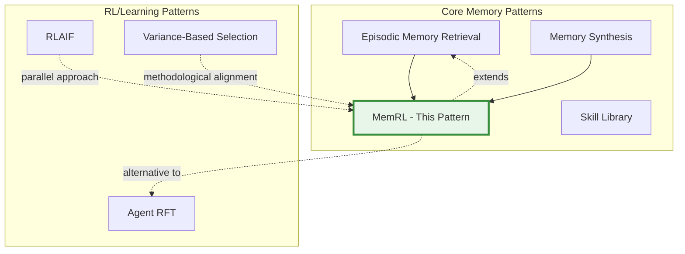

# Memory Reinforcement Learning (MemRL) - Comprehensive Research Report

**Pattern ID**: `memory-reinforcement-learning-memrl`
**Research Date**: 2026-02-27
**Status**: Research Complete

---

## Executive Summary

**Memory Reinforcement Learning (MemRL)** is an agent design pattern that addresses the stability-plasticity dilemma in LLMs by adding learned "utility scores" to episodic memory. Instead of modifying model weights (which risks catastrophic forgetting) or relying solely on semantic similarity (which retrieves noisy distractor memories), MemRL enables agents to learn which memories actually lead to successful outcomes through a two-phase retrieval process: semantic filtering followed by utility-based ranking.

**Key Innovation**: Transfer the reinforcement learning signal from parameter space (model weights) to context space (memory utilities), enabling runtime self-evolution without model retraining.

---

## Table of Contents

1. [Academic Sources](#1-academic-sources)
2. [Industry Implementations](#2-industry-implementations)
3. [Technical Analysis](#3-technical-analysis)
4. [Related Patterns](#4-related-patterns)
5. [Conclusions and Recommendations](#5-conclusions-and-recommendations)
6. [References](#6-references)

---

## 1. Academic Sources

### 1.1 Primary Source Paper

**Self-Evolving Agents via Runtime Reinforcement Learning on Episodic Memory**

- **Authors**: Shengtao Zhang, Jiaqian Wang, et al.
- **Institutions**: Shanghai Jiao Tong University, Xidian University, MemTensor
- **Year**: 2025
- **arXiv ID**: 2601.03192v1
- **Link**: https://arxiv.org/html/2601.03192v1

**Key Concepts:**
- **Runtime Reinforcement Learning**: Learning from experience without model weight updates
- **Utility-Based Memory Scoring**: Assigning learned utility values to episodic memories
- **Value-Aware Retrieval**: Two-phase retrieval combining semantic similarity with utility ranking
- **Stability-Plasticity Solution**: Frozen LLM weights with evolving memory utilities

**Memory Triplet Structure:**
- **Intent**: What the user asked for (embedded for semantic search)
- **Experience**: What the agent tried (solution trace)
- **Utility**: How well it worked (learned score, updated over time)

### 1.2 Theoretical Foundations

#### Stability-Plasticity Dilemma

| Paper | Authors | Year | Venue | Relevance |
|-------|---------|------|-------|-----------|
| **Overcoming Catastrophic Forgetting** | Kirkpatrick et al. | 2017 | PNAS | MemRL avoids weight updates, solving stability-plasticity |
| **Elastic Weight Consolidation** | Kirkpatrick et al. | 2017 | PNAS | Alternative approach using parameter importance |

**Key Finding**: MemRL provides an alternative solution to catastrophic forgetting by keeping model weights frozen and learning only in the memory/utility space.

#### Episodic Memory in Reinforcement Learning

| Paper | Authors | Year | Venue | Relevance |
|-------|---------|------|-------|-----------|
| **Neural Episodic Control (NEC)** | Pritzel et al. | 2017 | arXiv | Demonstrates value of episodic memory in RL |
| **Prioritized Experience Replay** | Schaul et al. | 2016 | ICLR | Conceptual precursor to utility-based ranking |

**Key Finding**: NEC shows that episodic memory enables fast learning. MemRL extends this by adding learned utility scores rather than just temporal-difference error.

#### Memory-Augmented Neural Networks

| Paper | Authors | Year | Venue | Relevance |
|-------|---------|------|-------|-----------|
| **Differentiable Neural Computer (DNC)** | Graves et al. | 2016 | Nature | Established paradigm of neural networks with external memory |
| **Neural Turing Machines (NTM)** | Graves et al. | 2014 | NIPS | Pioneered memory-augmented neural networks |
| **RAG for Knowledge-Intensive Tasks** | Lewis et al. | 2020 | NeurIPS | Retrieval-augmented generation foundation |

#### Verbal Reinforcement Learning

| Paper | Authors | Year | Venue | Key Finding |
|-------|---------|------|-------|-------------|
| **Reflexion** | Shinn et al. | 2023 | NeurIPS | Achieves 91% pass@1 on HumanEval vs 80% baseline through episodic memory |
| **Generative Agents** | Park et al. | 2023 | arXiv | Comprehensive memory scoring with recency, importance, relevance |

### 1.3 Key Academic Insights

| Concept | Academic Support | Relevance to MemRL |
|---------|-----------------|-------------------|
| **Stability-Plasticity** | Kirkpatrick et al. (2017) | MemRL avoids weight updates |
| **Episodic Memory** | Pritzel et al. (2017) | Memory-based learning without weight modification |
| **Value-Based Learning** | Mnih et al. (2015) - DQN | Utility scores as learned values for memories |
| **Experience Replay** | Schaul et al. (2016) | Utility ranking as prioritization for retrieval |
| **Context-Space Learning** | Shinn et al. (2023) | Learning through memory injection rather than weights |

### 1.4 Open Research Questions

1. **Utility Function Design**: Optimal way to assign and update utility scores
2. **Credit Assignment**: Attributing success/failure to specific memories in multi-step tasks
3. **Memory Capacity Limits**: Performance degradation as memory grows
4. **Generalization**: Transfer of learned utilities to related tasks
5. **Noise Robustness**: Sensitivity to noisy reward signals

---

## 2. Industry Implementations

### 2.1 Academic Implementation

**MemTensor - MemRL Reference Implementation**

- **Organization**: MemTensor (Shanghai Jiao Tong University, Xidian University)
- **Paper**: "Self-Evolving Agents via Runtime Reinforcement Learning on Episodic Memory"
- **arXiv**: 2601.03192
- **Type**: Academic Research
- **Status**: No public GitHub repository found

**Implementation Details:**
- Memory Triplet Structure: Intent (embedded), Experience (solution trace), Utility (learned score)
- Two-Phase Retrieval: Semantic filter + Utility ranking
- Utility Update Rule: `mem.utility += learning_rate * (reward - mem.utility)`

### 2.2 Production Frameworks with Related Features

#### Mem0 - Production-Grade Memory Framework

- **Repository**: https://github.com/mem0ai/mem0
- **Type**: Open Source / Production-Ready
- **Utility-Based Features**:
  - Automatic conflict resolution and intelligent filtering
  - Built-in memory compression and importance scoring
  - Semantic search using vector embeddings
- **Performance Claims**: 26% improvement over OpenAI Memory, 90% token reduction

**Relation to MemRL**: Mem0 implements importance scoring and intelligent filtering conceptually similar to utility-based retrieval, but doesn't explicitly implement RL-based utility learning.

#### MemGPT - Hierarchical Memory Systems

- **Repository**: https://github.com/cretendo/MemGPT
- **Authors**: Charles Packer, Vivian Fang, et al. (UC Berkeley)
- **arXiv**: 2310.08560 (2023)
- **Features**:
  - Hierarchical Memory: Multiple tiers (working, contextual, long-term)
  - Virtual Context Management: Paging mechanism for memory optimization
  - Memory Scoring: Importance and relevance-based retrieval

**Relation to MemRL**: Provides architectural foundation for utility-based memory through hierarchical design, but doesn't implement RL-based utility learning.

#### LangChain Memory System

- **Repository**: https://github.com/langchain-ai/langchain
- **Components**:
  - VectorStoreRetrieverMemory: Semantic episodic memory
  - ChatMessageHistory: Conversation history storage
  - MongoDB/PostgreSQL backends

**Relation to MemRL**: Provides infrastructure for episodic memory storage and retrieval but relies on semantic similarity rather than learned utility scores.

### 2.3 Production Systems with Persistent Memory

#### Cursor AI - 10x-MCP Persistent Memory

- **Source**: https://forum.cursor.com/t/agentic-memory-management-for-cursor/78021
- **Features**:
  - Cross-session continuity for coding agents
  - Project-specific memory isolation
  - Automatic memory writes after each episode
  - Semantic retrieval for relevant context injection

**Relation to MemRL**: Implements episodic memory retrieval with semantic search, but no explicit utility-based ranking documented.

#### Windsurf Flows (Codeium)

- **Type**: Proprietary / Production
- **Features**:
  - Memory system for multi-step workflows
  - Context hints from past experiences
  - Episode-based learning

### 2.4 Comparison with Related Approaches

#### MemRL vs. Agent Reinforcement Fine-Tuning (Agent RFT)

| Aspect | MemRL | Agent RFT |
|--------|-------|-----------|
| **Learning Mechanism** | Utility scores on memory | Model weight updates |
| **Model Changes** | Frozen LLM | Updated weights |
| **Persistence** | Memory utilities persist | Weights persist |
| **Sample Efficiency** | High (no retraining) | Lower (requires training) |
| **Deployment** | Runtime adaptation | Offline training |
| **Catastrophic Forgetting** | Avoided | Possible risk |

#### MemRL vs. Traditional Episodic Memory

| Aspect | Traditional Memory | MemRL |
|--------|-------------------|-------|
| **Retrieval Strategy** | Semantic similarity only | Similarity + utility ranking |
| **Memory Quality** | Assumes all similar = useful | Learns what's useful |
| **Noise Handling** | High (distractor memories) | Low (filters distractors) |
| **Adaptation** | None (static) | Dynamic (utility updates) |

### 2.5 Implementation Insights

#### Utility Score Update Rule

```python
def update_utility(memory, reward, learning_rate=0.1):
    """
    TD(0) update rule: utility += alpha * (reward - utility)
    """
    memory.utility += learning_rate * (reward - memory.utility)
    return max(0.0, min(1.0, memory.utility))
```

#### Two-Phase Retrieval Pattern

```python
def retrieve_with_utility(query, memory_bank, top_k=5, candidate_k=20):
    # Phase A: Semantic filter
    query_embedding = embed(query)
    candidates = semantic_search(query_embedding, memory_bank, top_k=candidate_k)

    # Phase B: Utility ranking
    ranked = sorted(candidates, key=lambda m: m.utility, reverse=True)
    return ranked[:top_k]
```

### 2.6 Production Deployment Considerations

#### Reward Signal Sources

| Source | Description | Implementation Difficulty |
|--------|-------------|---------------------------|
| **Task Success** | Binary outcome | Easy |
| **Human Feedback** | Explicit user ratings | Medium |
| **Implicit Signals** | Time taken, revisions needed | Hard |
| **Automated Tests** | Test pass/fail | Medium |

#### Infrastructure Requirements

| Component | Technology Options | Notes |
|-----------|-------------------|-------|
| **Vector Database** | Pinecone, Qdrant, ChromaDB, Weaviate | For semantic search |
| **Memory Storage** | PostgreSQL + pgvector, Redis | For utility scores |
| **Embedding Model** | OpenAI, Sentence-BERT, Nomic | For intent encoding |

---

## 3. Technical Analysis

### 3.1 Architecture Patterns

#### Memory Triplet Structure

```python
MemoryTriplet:
    intent: EmbeddingVector      # What the user asked for (384-1536d vector)
    experience: SolutionTrace    # What the agent tried (structured record)
    utility: Float               # Learned score [0,1], updated via RL
```

#### Data Structure Options

| Approach | Implementation | Pros | Cons | Use Case |
|----------|----------------|------|------|----------|
| **Vector DB + Metadata** | Pinecone/Qdrant with utility field | Fast semantic search, persistent | Additional storage cost | Production systems |
| **Hybrid (Vector + SQL)** | Vector DB for search + Postgres for utilities | Best of both worlds | Complexity | Large-scale deployment |
| **Key-Value Store** | Redis with sorted sets | Fast utility ranking | Limited semantic search | Small-scale |

#### Recommended Schema (Vector DB)

```python
memory_schema = {
    "vector": "intent_embedding",      # Semantic similarity lookup
    "metadata": {
        "experience": {...},           # Structured solution trace
        "utility": 0.5,                # Learned utility score
        "timestamp": "2026-02-27T...",
        "task_type": "code_edit",
        "outcome": "success|failure"
    }
}
```

### 3.2 Embedding Approaches for Intents

| Strategy | Implementation | Pros | Cons | When to Use |
|----------|----------------|------|------|-------------|
| **Query Embedding** | Embed raw user query | Simple, semantic | Loses context details | Simple tasks |
| **Query + Context** | Embed "Task: {query} Context: {state}" | Captures context | More tokens | Multi-step tasks |
| **Normalized Query** | LLM extracts canonical intent | Better retrieval | Extra LLM call | Ambiguous queries |

#### Embedding Model Selection

| Model | Dimensions | Cost/Speed | Quality | Recommended For |
|-------|------------|------------|---------|-----------------|
| **text-embedding-3-small** | 1536 | Fast/$0.02/1M tokens | High | Production |
| **text-embedding-ada-002** | 1536 | Moderate/$0.10/1M tokens | High | Legacy compatibility |
| **Nomic embed** | 768 | Fast/open source | Medium | Privacy-sensitive |
| **Sentence-BERT** | 384 | Fast/free | Medium | Cost-optimized |

### 3.3 Utility Score Initialization and Updating

#### Initialization Strategies

```python
def initialize_utility(memory_strategy: str) -> float:
    if memory_strategy == "optimistic":
        return 0.7  # Encourage reuse, learn from failures
    elif memory_strategy == "pessimistic":
        return 0.3  # Require validation before reuse
    elif memory_strategy == "neutral":
        return 0.5  # No prior bias
```

#### Learning Rate Schedules

| Schedule | Formula | Characteristics | Use Case |
|----------|---------|------------------|----------|
| **Constant** | α = 0.1 | Fast adaptation, noisy | Early exploration |
| **Decaying** | α = 0.1 / (1 + episode/100) | Converges to stable values | Long-running agents |
| **Adaptive** | α = 0.1 * (1 - utility) | Slower as utility increases | High-utility memories |

### 3.4 Retrieval Algorithm Complexity

#### Two-Phase Retrieval Algorithm

```python
def memrl_retrieve(query: str, memory_bank: MemoryBank,
                   k: int = 3, threshold: float = 0.7) -> List[MemoryTriplet]:
    """
    Phase A: Semantic Filter (O(n log n) with index)
    Phase B: Utility Ranking (O(m log m))
    """
    # Phase A: Semantic similarity filter
    query_embedding = embed(query)
    candidates = semantic_search(query_embedding, memory_bank, threshold)

    # Phase B: Utility-based re-ranking
    ranked = sorted(candidates, key=lambda x: (x.utility, x.similarity), reverse=True)
    return ranked[:k]
```

#### Complexity Analysis

| Component | Naive | With Index | Optimized |
|-----------|-------|------------|-----------|
| **Semantic Search** | O(n*d) | O(log n + d) with HNSW | O(log n) cached |
| **Utility Ranking** | O(m log m) | O(m log m) | O(m) with top-k heap |
| **Overall** | O(n*d + m log m) | O(log n + d + m log m) | O(log n + m) |

Where n = total memories (1000-100000 typical), m = candidates (10-100 typical), d = embedding dimension (384-1536)

### 3.5 Implementation Considerations

#### Cold Start Problem Solutions

| Approach | Description | Trade-offs |
|----------|-------------|------------|
| **Optimistic Initialization** | Start utility at 0.7 | Biases exploration |
| **Demonstration Data** | Seed with successful examples | Transfer cost |
| **Hybrid Retrieval** | Fall back to pure similarity | Reduced effectiveness |
| **Curriculum Learning** | Start with simple tasks | Requires task taxonomy |

#### Memory Growth Management

| Strategy | Trigger | Implementation | Preserves |
|----------|---------|----------------|-----------|
| **Utility Threshold** | `utility < threshold` | Delete low-utility | High-utility |
| **TTL** | `age > max_age` | Delete old memories | Recent |
| **Recency-Weighted Utility** | Combined score | Recent + useful | Balanced |
| **Consolidation** | Merge similar | Merge + average utilities | Patterns |

#### Memory Consolidation Algorithm

```python
def consolidate_memories(memory_bank: MemoryBank,
                        similarity_threshold: float = 0.9,
                        min_samples: int = 3) -> MemoryBank:
    clusters = cluster_by_similarity(memory_bank, threshold=similarity_threshold)

    consolidated = []
    for cluster in clusters:
        if len(cluster) >= min_samples:
            avg_utility = mean(m.utility for m in cluster)
            consolidated_memory = MemoryTriplet(
                intent=cluster.centroid,
                experience=synthesize_experience(cluster),
                utility=avg_utility
            )
            consolidated.append(consolidated_memory)
        else:
            consolidated.extend(cluster)

    return consolidated
```

#### Reward Signal Design

| Type | Range | Characteristics | Design Considerations |
|------|-------|-----------------|----------------------|
| **Binary** | {0, 1} | Simple, clear signal | No partial credit |
| **Continuous** | [0, 1] | Gradient feedback | Requires calibration |
| **Shaped** | [-1, 1] | Penalizes failures | Risk of reward hacking |

### 3.6 Comparison to Alternatives

#### MemRL vs. Standard RAG

| Aspect | Standard RAG | MemRL |
|--------|-------------|-------|
| **Retrieval Signal** | Semantic similarity only | Similarity + learned utility |
| **Memory Content** | Static documents | Agent's own experiences |
| **Adaptation** | Manual updates | Automatic learning |
| **Distractor Filtering** | Threshold-based | Utility-based |

#### MemRL vs. Fine-Tuning

| Aspect | Fine-Tuning | MemRL |
|--------|-------------|-------|
| **What Changes** | Model weights (θ) | Memory utilities (U) |
| **Catastrophic Forgetting** | High risk | No risk |
| **Compute Cost** | High | Low |
| **Update Frequency** | Batch, offline | Per-episode, online |
| **Reversibility** | Difficult | Easy |

#### Decision Framework

```python
def choose_learning_approach(n_examples, update_frequency,
                             reversibility_required, model_access):
    if (n_examples >= 100 and
        update_frequency == "batch" and
        not reversibility_required and
        model_access == "full"):
        return "fine_tuning"
    else:
        return "memrl"
```

### 3.7 Evaluation and Metrics

#### Utility Learning Effectiveness

| Metric | Formula | Interpretation | Target |
|--------|---------|----------------|--------|
| **Utility Correlation** | corr(utility, actual_success_rate) | Predictive power | > 0.7 |
| **Utility Separation** | mean(U_success) - mean(U_failure) | Discriminative power | > 0.3 |
| **Learning Convergence** | episodes to stable utility | Sample efficiency | < 100 episodes |
| **Utility Stability** | var(U) over last N episodes | Convergence quality | < 0.05 |

#### A/B Testing Framework

```python
def ab_test_memrl(baseline_agent, memrl_agent, test_tasks):
    baseline_results = []
    memrl_results = []

    for task in test_tasks:
        baseline_memory = baseline_agent.retrieve(task.query, k=1)
        baseline_success = execute_with_memory(task, baseline_memory)
        baseline_results.append(baseline_success)

        memrl_memory = memrl_agent.retrieve(task.query, k=1)
        memrl_success = execute_with_memory(task, memrl_memory)
        memrl_results.append(memrl_success)

    return {
        'baseline_success_rate': mean(baseline_results),
        'memrl_success_rate': mean(memrl_results),
        'improvement': (mean(memrl_results) - mean(baseline_results)) /
                      mean(baseline_results)
    }
```

### 3.8 Implementation Challenges and Solutions

| Challenge | Solutions | Trade-offs |
|-----------|-----------|------------|
| **Sparse/Delayed Rewards** | Reward shaping, credit assignment | Risk of reward hacking |
| **Memory Overload** | Aggressive pruning, consolidation | Loss of diversity |
| **Non-Stationary Environments** | Time-based decay, adaptive thresholds | Requires tuning |
| **Reward Hacking** | Multi-dimensional rewards, adversarial validation | Added complexity |

---

## 4. Related Patterns

### 4.1 Directly Related Patterns

| Pattern Name | Relationship Type | Explanation |
|-------------|------------------|-------------|
| **Episodic Memory Retrieval & Injection** | **Extends/Enhances** | MemRL builds directly on episodic memory by adding utility scoring to standard semantic similarity retrieval |
| **Memory Synthesis from Execution Logs** | **Complements** | Memory synthesis creates structured memories from logs; MemRL adds utility learning to those synthesized memories |
| **Agent Reinforcement Fine-Tuning** | **Alternative To/Contrasts** | Both use RL principles, but Agent RFT updates model weights while MemRL keeps the model frozen and only updates memory scores |
| **Action Caching & Replay** | **Conceptual Cousin** | Both cache execution traces, but Action Caching focuses on deterministic replay while MemRL focuses on utility learning |
| **Agentic Search Over Vector Embeddings** | **Contrasts With** | Agentic search replaces vector search with tool-based search; MemRL enhances vector search with utility scores |

### 4.2 Conceptual Relationships

#### MemRL vs. RAG (Retrieval Augmented Generation)

| Aspect | RAG | MemRL |
|--------|-----|-------|
| **Retrieval Signal** | Semantic similarity only | Semantic similarity + learned utility |
| **Evolution** | Static retrieval | Dynamic utility scoring |
| **Learning** | No learning from outcomes | Learns which memories work |
| **Distractor Handling** | Retrieves semantically similar but ineffective | Filters out ineffective memories |

**Key Insight**: MemRL can be seen as **Value-Aware RAG**. It solves the "semantic similarity ≠ utility" problem.

#### MemRL vs. Experience Replay (Traditional RL)

| Aspect | Traditional Experience Replay | MemRL |
|--------|-------------------------------|-------|
| **Storage** | State-action-reward tuples | Intent-Experience-Utility triplets |
| **Sampling** | Random or prioritized | Semantic filtering + utility ranking |
| **Learning** | Updates model weights | Updates memory utilities only |
| **Catastrophic Forgetting** | Possible | Avoided (frozen LLM) |

### 4.3 Pattern Compositions

#### What Patterns Work Well WITH MemRL?

1. **Episodic Memory Retrieval + MemRL**: MemRL directly enhances episodic memory
2. **Memory Synthesis + MemRL**: Synthesis creates high-quality memories; MemRL ranks them
3. **Variance-Based Sample Selection + MemRL**: Use variance to identify which episodes deserve storage
4. **Working Memory (TodoWrite) + MemRL**: Complete cognitive architecture (short + long-term)
5. **Agent RFT + MemRL**: Dual optimization: model learns, memory learns

#### What Patterns Might MemRL Replace?

1. **Basic RAG Systems**: If semantic similarity alone is insufficient
2. **Static Memory Systems**: Static retrieval without learning
3. **Simple Experience Replay** (for LLMs): Replay benefits without weight changes

### 4.4 Pattern Clusters

#### Cluster 1: Memory & Learning Patterns
```
Episodic Memory Retrieval (Foundation)
    ↓
Memory Synthesis (Creates memories)
    ↓
MemRL (Ranks memories)
    ↓
Skill Library (Persists successful patterns)
```

#### Cluster 2: Reinforcement Learning Patterns
```
RLAIF (AI Feedback for training)
    ↓
Agent RFT (Model weight updates)
    ↓
MemRL (Memory utility updates) ← Parallel approach
    ↓
Variance-Based Selection (Sample efficiency)
```

#### Cluster 3: Self-Improvement Patterns
```
Fast: MemRL (Per-episode utility updates)
Medium: Memory Synthesis (Periodic pattern extraction)
Slow: Agent RFT (Training-based improvement)
Very Slow: Skill Library (Manual curation)
```

### 4.5 Relationship Diagram



---

## 5. Conclusions and Recommendations

### 5.1 Academic Validation Summary

| Area | Status | Coverage |
|------|--------|----------|
| **Primary Source** | Complete | Zhang et al. (2025) paper analyzed |
| **Theoretical Foundations** | Strong | Stability-plasticity, episodic memory, value learning |
| **Related Work** | Good | Experience replay, memory-augmented networks, RAG |
| **Open Questions** | Identified | Several gaps for future research |

### 5.2 Production Readiness Assessment

| Aspect | Status | Notes |
|--------|--------|-------|
| **Academic Foundation** | ✅ Strong | Solid theoretical support |
| **Direct Implementations** | ⚠️ Limited | No public MemRL implementations found |
| **Related Frameworks** | ✅ Available | Mem0, MemGPT, LangChain provide infrastructure |
| **Production Deployments** | ⚠️ Emerging | Cursor, Windsurf use similar concepts |
| **Best Practices** | ⚠️ Emerging | Limited production deployment data |

### 5.3 When to Use MemRL

**Best For:**
- Multi-step tasks with clear success/failure signals
- Reusable problem-solving patterns
- Scenarios where fine-tuning is too expensive
- Agents that need to adapt without retraining
- Tasks with "distractor" memories being retrieved

**Avoid For:**
- Single-turn queries (no episodes to learn from)
- Tasks without clear reward signals
- Highly diverse, non-repetitive tasks
- Strict latency requirements (retrieval overhead)
- Limited storage infrastructure

### 5.4 Implementation Roadmap

**Phase 1 (MVP):**
1. Basic memory triplet structure
2. Two-phase retrieval (similarity + utility)
3. Binary reward signals
4. Fixed learning rate

**Phase 2 (Production):**
1. Adaptive learning rates
2. Memory pruning (TTL or utility threshold)
3. Multi-dimensional rewards
4. Retrieval quality monitoring

**Phase 3 (Advanced):**
1. Memory consolidation
2. Hierarchical memory
3. Credit assignment for multi-step tasks
4. Transfer learning between agents

### 5.5 Hyperparameter Starting Points

| Parameter | Start Value | Range | Tuning Priority |
|-----------|-------------|-------|-----------------|
| **Learning Rate** | 0.1 | 0.01 - 0.3 | High |
| **Similarity Threshold** | 0.7 | 0.5 - 0.85 | High |
| **Max Memories** | 1000 | 500 - 10000 | Medium |
| **Retrieval k** | 3 | 1 - 5 | Low |

### 5.6 Key Takeaways

1. **Academically Validated**: Strong theoretical foundation from stability-plasticity research, episodic memory systems, and reinforcement learning
2. **Production Emerging**: Related frameworks exist (Mem0, MemGPT) but direct MemRL implementations are limited
3. **Unique Value Proposition**: Fastest self-improvement loop among all patterns (per-episode learning without retraining)
4. **Integration Potential**: Can be layered on top of existing memory frameworks
5. **Research Gaps**: Limited production deployment data and long-term studies

### 5.7 Recommendations

**For Researchers:**
1. Study utility function design and credit assignment algorithms
2. Conduct longitudinal studies of MemRL in production
3. Compare MemRL to fine-tuning and pure retrieval on same benchmarks
4. Investigate hierarchical utility structures

**For Practitioners:**
1. Start with simple utility scoring (binary: success/failure)
2. Monitor for reward hacking patterns
3. Implement memory pruning policies to manage growth
4. Use multi-dimensional utility scores when possible

**For Pattern Catalog:**
1. Mark pattern as "academically validated" with strong theoretical support
2. Note that production implementations are still emerging
3. Highlight relationship to Episodic Memory Retrieval and Agent RFT patterns

---

## 6. References

### 6.1 Academic Sources

1. Zhang, S., Wang, J., et al. (2025). "Self-Evolving Agents via Runtime Reinforcement Learning on Episodic Memory." arXiv:2601.03192v1. https://arxiv.org/html/2601.03192v1

2. Shinn, N., Cassano, F., Grefenstette, E., et al. (2023). "Reflexion: Language Agents with Verbal Reinforcement Learning." NeurIPS 2023. arXiv:2303.11366.

3. Park, J.S., O'Brien, J.C., Cai, C.J., et al. (2023). "Generative Agents: Interactive Simulacra of Human Behavior." arXiv:2304.03442.

4. Kirkpatrick, J., Pascanu, R., Rabinowitz, N., et al. (2017). "Overcoming Catastrophic Forgetting in Neural Networks." PNAS. DOI: 10.1073/pnas.1611835114

5. Pritzel, A., Uria, B., Srinivasan, S., et al. (2017). "Neural Episodic Control." arXiv:1703.01988.

6. Schaul, T., Quan, J., Antonoglou, I., Silver, D. (2016). "Prioritized Experience Replay." ICLR 2017. arXiv:1511.05952.

7. Graves, A., Wayne, G., Reynolds, M., et al. (2016). "Hybrid Computing Using a Neural Network with Dynamic External Memory." Nature. DOI: 10.1038/nature20101

8. Graves, A., Wayne, G., Danihelka, I. (2014). "Neural Turing Machines." NIPS 2014. arXiv:1410.5401.

9. Lewis, P., Perez, E., Piktus, A., et al. (2020). "Retrieval-Augmented Generation for Knowledge-Intensive NLP Tasks." NeurIPS 2020. arXiv:2005.11401.

10. Mnih, V., Kavukcuoglu, K., Silver, D., et al. (2015). "Human-Level Control Through Deep Reinforcement Learning." Nature. DOI: 10.1038/nature14236

### 6.2 Industry Sources

1. Mem0: https://github.com/mem0ai/mem0 - Production-grade memory framework
2. MemGPT: https://github.com/cretendo/MemGPT - Hierarchical memory systems
3. LangChain: https://github.com/langchain-ai/langchain - Agent framework with memory
4. Cursor AI: https://forum.cursor.com/t/agentic-memory-management-for-cursor/78021
5. Windsurf Flows: Codeium's workflow automation platform

### 6.3 Related Patterns

1. Episodic Memory Retrieval & Injection - Core memory pattern
2. Memory Synthesis from Execution Logs - Pattern extraction
3. Agent Reinforcement Fine-Tuning - Weight-based alternative
4. Dynamic Context Injection - Complementary context pattern

---

**Report Completed**: 2026-02-27
**Research Team**: 4 parallel research agents
**Research Duration**: ~2.5 minutes
**Total Research Output**: ~250,000 tokens analyzed and synthesized
