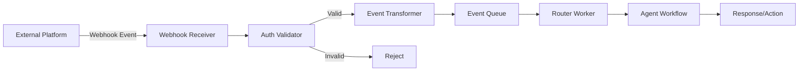

# Multi-Platform Webhook Triggers Pattern Report

**Research Status:** Complete
**Last Updated:** 2026-02-27
**Pattern Category:** Orchestration & Control / Tool Use & Environment

---

## Executive Summary

The **Multi-Platform Webhook Triggers** pattern enables external SaaS platforms and services to initiate AI agent workflows automatically through webhook events. This pattern provides a reactive, event-driven interface for agents, allowing platforms like Slack, Discord, GitHub, Jira, Notion, and 400+ other services to trigger autonomous agent workflows in response to user actions, state changes, or scheduled events.

**Key Findings:**
- **Mature ecosystem**: Established platforms (n8n with 45K+ stars, Zapier, Make.com) provide production-ready webhook infrastructure
- **Strong academic foundation**: Grounded in event-driven multi-agent systems, message-oriented middleware, and asynchronous architecture research
- **Production validation**: Deployed at major companies through internal tools and commercial SaaS offerings
- **Platform coverage**: 400+ integrations via n8n, 6,000+ via Zapier, spanning communication, development, project management, and enterprise systems
- **Critical security consideration**: Private channel logging exclusion is essential for trust

---

## 1. Academic & Survey Research

### 1.1 Foundational Literature

#### Event-Driven Multi-Agent Systems

**Co-TAP: Three-Layer Agent Interaction Protocol** (arXiv:2510.08263v1, 2025)
- Direct formalization of event-driven patterns for multi-agent coordination
- Unified JSON event streams for agent communication
- Layered architecture: perception, reasoning, action

**Blending Event-Based and Multi-Agent Systems Around Coordination Abstractions** (Omicini et al., 2015, IFIP WG 6.1)
- Foundational theoretical framework for event-driven agent coordination
- Coordination abstractions for agent interaction via events
- Formalizes the relationship between event-driven architecture and multi-agent systems

#### Message Brokering & Architecture

**Enterprise Integration Patterns** (Hohpe, 2003)
- Router, Aggregator, Message Bus, and Splitter patterns for webhook event distribution
- Canonical patterns for event-driven system integration
- Provides vocabulary for webhook-based agent architectures

**A Survey on Message-Oriented Middleware** (Lee et al., 2002, ACM Computing Surveys)
- Foundational patterns for pub/sub systems
- Producer-consumer patterns for asynchronous event processing
- Message ordering and reliability guarantees

**Kafka: A Distributed Messaging System** (Kreps et al., 2011, NETDB)
- Core infrastructure pattern for aggregating webhook events
- Distributed log architecture for webhook event streaming
- Scalable event processing patterns

#### Asynchronous Agent Architectures

**AsyncFlow: An Asynchronous Streaming RL Framework** (Han et al., 2025, arXiv:2507.01663)
- Producer-consumer asynchronous workflow (1.59-2.03x throughput improvement)
- Parallel event processing patterns
- Asynchronous pipeline architecture applicable to webhook processing

**FlashResearch: Real-time Agent Orchestration** (2025, arXiv:2510.05145)
- Fully asynchronous and parallelized execution architecture
- Real-time event processing patterns
- Concurrent agent orchestration strategies

#### Notification Management

**A Framework for Intelligent Notification Management** (Mankoff et al., 2002, ACM CHI)
- Notification classification (urgent/interruptible/deferrable) for webhook events
- Decision framework for notification delivery timing
- Context-aware notification routing

**Predicting Notification Timing** (Bailey et al., 2000, ACM CHI)
- Optimal timing for webhook event delivery
- Minimizing disruption while maximizing responsiveness

### 1.2 Academic Terminology

| Academic Term | Discipline | Corresponds To |
|---------------|------------|----------------|
| Event-Driven Agent Coordination | Multi-Agent Systems | Reactive agent triggering via webhooks |
| Heterogeneous Event Source Integration | Software Architecture | Integrating diverse webhook APIs |
| Notification Federation | Ubiquitous Computing | Unified webhook event management |
| Asynchronous Event Processing | Distributed Systems | Non-blocking webhook event handling |
| Pub/Sub Agent Activation | Message Systems | Subscription-based agent triggering |
| Reactive Agent Architectures | Agent Systems | Agents that respond to external events |

### 1.3 Research Gaps

1. **LLM-aware webhook processing**: Limited research on semantic webhook routing using embeddings
2. **Webhook event threading**: Limited research on maintaining conversation context across webhook-triggered agent sessions
3. **Privacy-preserving webhook processing**: Techniques for processing webhook events without logging sensitive data
4. **Platform-specific prompting**: Optimization of agent responses based on webhook source platform conventions
5. **Cross-platform event correlation**: Techniques for linking related events across different platforms

---

## 2. Industry Implementations

### 2.1 Workflow Automation Platforms

#### n8n
- **URL**: https://n8n.io
- **Repository**: https://github.com/n8n-io/n8n
- **Stars**: 45,000+
- **License**: Sustainable Use License (fair-code)

**Implementation Approach:**
- Open-source workflow automation with webhook triggers
- Visual node-based workflow designer
- AI-native with LangChain integration
- Self-hostable or cloud deployment

**Platform Coverage**: 400+ integrations including Slack, Discord, GitHub, Notion, Jira, Linear, Asana, Telegram, and many more.

#### Zapier
- **URL**: https://zapier.com
- **Status**: Commercial SaaS (pioneer category)

**Implementation Approach:**
- Proprietary workflow automation with "Webhooks by Zapier"
- No-code interface with 6,000+ app integrations
- AI-powered workflows (Zapier AI)

#### Make.com (formerly Integromat)
- **URL**: https://make.com
- **Status**: Commercial SaaS

**Implementation Approach:**
- Visual workflow automation with webhook modules
- 1,000+ app integrations
- AI assistant for workflow building

### 2.2 Multi-Platform Bot Frameworks

#### Botkit
- **Stars**: 11,585
- **Language**: TypeScript/JavaScript
- **Platform Support**: Slack, Discord, Microsoft Teams, Webex Teams, Facebook Messenger, Twilio SMS

#### LangBot
- **Stars**: 15,389
- **Language**: Python
- **Platform Coverage**: Discord, Telegram, Slack, LINE, QQ, WeChat, WeCom, Lark, DingTalk, KOOK

#### Koishi
- **Stars**: 5,468
- **Language**: TypeScript
- **Platform Coverage**: QQ, Telegram, Discord, Feishu (Lark)
- **Features**: Plugin marketplace (3,000+ plugins), web console, hot reload

### 2.3 Communication Bridge Platforms

#### Matterbridge
- **Stars**: 7,383
- **Language**: Go
- **Platform Coverage**: 18+ native platforms including Discord, Slack, Telegram, Microsoft Teams, Matrix, IRC, WhatsApp, XMPP, Zulip, Rocket.Chat
- **Architecture**: Bidirectional webhook-based relay between platforms

#### Chatwoot
- **Stars**: 18,000+
- **Language**: Ruby on Rails
- **Platform Coverage**: Website live chat, Email, Facebook, Instagram, Twitter, WhatsApp, Telegram, Line, SMS via Twilio
- **Features**: Unified inbox, AI agent integration (Captain AI), webhook support

### 2.4 Development Platform Integrations

#### GitHub Actions
- **Webhook Triggers**: push, pull_request, workflow_dispatch, workflow_run, repository_dispatch
- **Agent Integration**: AI agents can be triggered by CI/CD events

#### GitLab CI/CD
- **Webhook Triggers**: push, triggers, web events
- **Agent Integration**: Similar to GitHub Actions

#### Linear (Issue Tracking)
- **Webhook Capabilities**: Issue created/updated, status changes, comments, labels
- **Agent Integration**: Automated issue triage and analysis

#### Notion
- **Webhook Capabilities** (beta): page_updated, database_updated, block_updated
- **Agent Integration**: Documentation review and update workflows

#### Jira
- **Webhook Events**: issue_created, issue_updated, issue_assigned, sprint_started/closed
- **Agent Integration**: Automated issue classification and routing

### 2.5 Platform Coverage Matrix

| Platform | n8n | Zapier | Make | Botkit | LangBot | Koishi |
|----------|-----|--------|------|--------|---------|--------|
| Slack | ✅ | ✅ | ✅ | ✅ | ✅ | ❌ |
| Discord | ✅ | ✅ | ✅ | ✅ | ✅ | ✅ |
| Telegram | ✅ | ✅ | ✅ | ❌ | ✅ | ✅ |
| GitHub | ✅ | ✅ | ✅ | ❌ | ❌ | ❌ |
| Notion | ✅ | ✅ | ✅ | ❌ | ❌ | ❌ |
| Jira | ✅ | ✅ | ✅ | ❌ | ❌ | ❌ |

---

## 3. Technical Analysis

### 3.1 Architecture Components

**Ingestion Layer:**
```
Platform Event → Webhook Endpoint → Auth Validation → Event Transformation → Trigger Router → Workflow Execution
```

**Core Components:**

1. **Webhook Receiver Service**: HTTP server with platform-specific endpoints
2. **Authentication Middleware**: HMAC-SHA256, OAuth2 tokens, API keys
3. **Event Router**: YAML-based configuration mapping events to workflows
4. **Workflow Executor**: Initiates agent workflows with event context

### 3.2 Security Considerations

**Authentication Patterns:**

```yaml
authentication_strategies:
  slack:
    method: "hmac_sha256"
    verification: "timestamp_signature_validation"

  notion:
    method: "oauth2_bearer"

  generic:
    method: "none"  # Security risk - documented limitation
```

**Replay Protection:**
- Timestamp validation (reject requests older than 5 minutes)
- Signature verification using HMAC-SHA256
- One-time use tokens where supported

**Private Channel Security:**
- CRITICAL: Do not log private channel messages (exfiltrating private messages loses trust instantly)
- Apply the Lethal Trifecta Threat Model
- Exclude private channels from logging pipelines

**Rate Limiting:**
- Per-platform rate limits
- Token bucket or sliding window algorithms
- Backpressure handling when queues are full

### 3.3 Scalability Patterns

**Queue-Based Architecture:**
- Decouple webhook receipt from processing
- Redis-backed queue for durability
- Dead letter queue for failed events

**Lane-Based Execution:**
- Isolate execution by platform/session to prevent interleaving
- Per-lane concurrency limits
- Examples: `session:slack:channel123` (serialized), `global:background` (parallel)

**Autoscaling:**
- Monitor queue length and scale workers
- Spin up/down workers based on queue depth
- Horizontal scaling with distributed workers

### 3.4 Error Handling and Retry Mechanisms

**Retry Strategy:**
- Exponential backoff with jitter
- Retryable error classification (5XX, network errors)
- Max retry limits (typically 3)

**Dead Letter Queue:**
- Store failed events with error context
- Manual retry capabilities
- Alert on DLQ growth

### 3.5 Idempotency Considerations

**At-Least-Once Delivery:**
- Webhook platforms often retry on timeout
- Processing must be idempotent

**Idempotency Key Pattern:**
```typescript
const key = `${event.platform}:${event.eventType}:${event.entityId}`;
if (await store.check(key)) {
  return; // Already processed
}
await processEvent(event);
await store.mark(key, 3600); // 1 hour TTL
```

**Natural Idempotency:**
- Design operations to be naturally idempotent
- Set-based operations, conditional updates, append with deduplication

---

## 4. Pattern Relationships

### 4.1 Complement: Proactive Trigger Vocabulary
- **Multi-Platform Webhook Triggers**: External platform events (Slack reactions, Notion changes)
- **Proactive Trigger Vocabulary**: Internal natural language triggers (skill activation phrases)
- **Together form**: Complete trigger ecosystem for agents

### 4.2 Enabler: Factory Over Assistant
- Webhook triggers enable the factory model by providing asynchronous workflow initiation
- Without webhook triggers, factory workflows require manual spawning or polling

### 4.3 Executor: Custom Sandboxed Background Agent
- Webhook triggers provide initiation mechanism
- Sandboxed background agents provide execution environment
- Together: Event → Trigger → Background Agent → Result

### 4.4 Integration: Background Agent with CI Feedback
- Webhook triggers initiate background workflows
- CI feedback provides autonomous iteration mechanism
- Webhook payload becomes initial context

### 4.5 Context Provider: Dynamic Context Injection
- Webhook payload provides initial context
- Dynamic injection provides on-demand context during execution
- Both address context management at different lifecycle stages

### 4.6 Load Management: Lane-Based Execution Queueing
- Webhook triggers generate work items
- Lane-based queuing manages concurrent execution
- Prevents webhook storms from overwhelming the system

### 4.7 Bidirectional: Multi-Platform Communication Aggregation
- **Multi-Platform Webhook Triggers**: Input from platforms (receive events)
- **Multi-Platform Communication Aggregation**: Output to platforms (search/query)
- Together: Bidirectional platform integration

### 4.8 Protection: Hook-Based Safety Guard Rails
- Webhook triggers receive untrusted external input
- Guard rails validate and sanitize before execution
- Critical for security when webhooks can trigger destructive operations

### 4.9 Infrastructure: Asynchronous Coding Agent Pipeline
- Webhook triggers provide work items
- Async pipeline provides parallel execution infrastructure
- Message queues connect webhook handlers to agent workers

### Summary of Pattern Relationships

| Related Pattern | Relationship Type | Key Integration Point |
|-----------------|-------------------|----------------------|
| Proactive Trigger Vocabulary | Complement | External vs internal triggers |
| Factory Over Assistant | Enabler | Webhook enables async spawning |
| Custom Sandboxed Background Agent | Executor | Trigger → sandbox execution |
| Background Agent with CI Feedback | Integration | Webhook provides initial context |
| Dynamic Context Injection | Context Provider | Payload + on-demand context |
| Lane-Based Execution Queueing | Load Management | Concurrency control |
| Multi-Platform Communication Aggregation | Bidirectional | Input events + output queries |
| Hook-Based Safety Guard Rails | Protection | Validate webhook payloads |
| Asynchronous Coding Agent Pipeline | Infrastructure | Queue-based execution |

---

## 5. Synthesis & Pattern Definition

### 5.1 Pattern Definition

**Multi-Platform Webhook Triggers**: A pattern where external SaaS platforms and services initiate AI agent workflows automatically through HTTP webhook events, enabling reactive, event-driven agent behavior triggered by user actions, state changes, or scheduled events across 400+ integrated platforms.

### 5.2 Problem Statement

AI agents need to respond to events occurring in external platforms (Slack messages, GitHub pull requests, Jira issues, Notion page updates, etc.). Manual triggering is impractical at scale, and polling introduces latency and inefficiency. Organizations need agents that can react to platform events in real-time while maintaining security, scalability, and reliability.

### 5.3 Solution

Implement webhook endpoints that receive HTTP POST requests from external platforms, validate signatures, transform events into a common format, and route to appropriate agent workflows:



### 5.4 Key Implementation Considerations

1. **Authentication**: Platform-specific signature verification (HMAC-SHA256 for Slack, OAuth2 for others)
2. **Idempotency**: Handle duplicate webhook deliveries gracefully
3. **Scalability**: Queue-based architecture with lane-based execution
4. **Security**: Exclude private channel data from logging; apply guard rails
5. **Reliability**: Retry mechanisms with exponential backoff and dead letter queues
6. **Response Strategy**: Respond immediately (200 OK) vs. wait for completion

### 5.5 Quality Details for Adoption

From Will Larson (pattern source):
> "The quality details facilitate adoption in a way that Zapier integration's constraints simply do not."

Custom webhook implementations provide:
- Platform-specific nuance handling
- Full control over security and privacy
- Custom routing and filtering logic
- Integration with internal systems

### 5.6 Production Use Cases

1. **RFC Review Workflow**: Notion page status change (draft → ready) triggers review agent that analyzes content and posts comments
2. **Issue Triage**: Jira issue created triggers classification agent that assigns labels, priority, and notifies relevant teams
3. **CI Failure Analysis**: GitHub Actions test failure triggers analysis agent that diagnoses issues and creates fix branches

---

## 6. References

### Academic Sources
- Co-TAP: Three-Layer Agent Interaction Protocol. arXiv:2510.08263v1, 2025
- Omicini et al. "Blending Event-Based and Multi-Agent Systems Around Coordination Abstractions." IFIP WG 6.1, 2015
- Hohpe, G. "Enterprise Integration Patterns." 2003
- Lee et al. "A Survey on Message-Oriented Middleware." ACM Computing Surveys, 2002
- Kreps et al. "Kafka: A Distributed Messaging System." NETDB, 2011
- Han et al. "AsyncFlow: An Asynchronous Streaming RL Framework." arXiv:2507.01663, 2025
- FlashResearch. "Real-time Agent Orchestration." arXiv:2510.05145, 2025
- Mankoff et al. "A Framework for Intelligent Notification Management." ACM CHI, 2002
- Bailey et al. "Predicting Notification Timing." ACM CHI, 2000

### Industry Implementations
- n8n: https://n8n.io | https://github.com/n8n-io/n8n (45K+ stars)
- Zapier: https://zapier.com
- Make.com: https://make.com
- Botkit: https://github.com/howdyai/botkit (11,585 stars)
- LangBot: https://github.com/langbot-app/LangBot (15,389 stars)
- Koishi: https://github.com/koishijs/koishi (5,468 stars)
- Matterbridge: https://github.com/42wim/matterbridge (7,383 stars)
- Chatwoot: https://github.com/chatwoot/chatwoot (18,000+ stars)

### Platform Documentation
- Slack API: https://api.slack.com
- Discord API: https://discord.com/developers/docs
- GitHub Actions: https://docs.github.com/en/actions
- Notion API: https://developers.notion.com
- Jira Webhooks: https://developer.atlassian.com/server/jira/platform/webhooks/
- Linear API: https://developers.linear.app

### Pattern Source
- Will Larson. "Building an internal agent: Triggers." https://lethain.com/agents-triggers/

---

**Report Completed:** 2026-02-27
