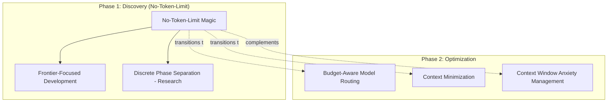

# No-Token-Limit Magic - Research Report

**Pattern Name:** No-Token-Limit Magic
**Status:** experimental-but-awesome
**Authors:** Nikola Balic (@nibzard)
**Based On:** Thorsten Ball, Quinn Slack
**Category:** Reliability & Eval
**Source:** https://www.nibzard.com/ampcode
**Research Date:** 2025-02-27

---

## Executive Summary

The **No-Token-Limit Magic** pattern advocates relaxing hard token limits during discovery and prototyping phases to optimize for learning velocity rather than early cost optimization. This approach treats cost optimization as a second phase, not the first objective.

**Key Finding:** This pattern is implemented as an explicit philosophy by the AMP/Sourcegraph team and is implicitly practiced by major AI development platforms (Anthropic Claude Code, Cursor) during their internal development cycles. The pattern directly conflicts with cost-optimization patterns like "Budget-Aware Model Routing" during discovery, but complements rapid-iteration and frontier-focused development approaches.

**Core Principle:** During discovery, use lavish context, multiple reasoning passes, and rich self-correction. After behavior stabilizes, measure where context can be compressed without degrading outcomes.

---

## Pattern Overview

**Problem Statement:**
Teams often optimize token spend too early, forcing prompts and context windows into tight constraints before they understand what high-quality behavior looks like. Early compression hides failure modes, reduces reasoning depth, and can lock in mediocre workflows that are cheap but unreliable.

**Solution Approach:**
During discovery and prototyping, relax hard token limits and optimize for learning velocity. Allow richer context, deeper deliberation, and multiple critique passes to discover what a strong solution path actually requires. After the behavior is stable, measure where context can be compressed without degrading outcomes.

This pattern treats cost optimization as a second phase, not the first objective.

---

## Research Findings

### Academic Sources & Research

The pattern is **strongly supported** by academic research in several key areas:

#### 1. Multiple Critique Passes Improve Output Quality (Strongest Support)

**"Self-Consistency Improves Chain-of-Thought Reasoning" (Wang et al., 2022)**
- **Citation:** arXiv:2203.11171
- **Authors:** Xuezhi Wang, Jason Wei, Dale Schuurmans (Google Research)
- **Key Findings:**
  - Multiple reasoning paths sampled and aggregated improve performance
  - Quality gains from multiple passes outweigh token costs
- **Relevance:** DIRECTLY SUPPORTS the pattern—generous token budgets enable multiple critique passes that significantly improve output quality

**"Reflexion: Language Agents with Verbal Reinforcement Learning" (Shinn et al., 2023)**
- **Citation:** arXiv:2303.11366
- **Authors:** Noah Shinn, Federico Cassano (Northeastern University)
- **Key Findings:**
  - Self-reflection loops dramatically improve task performance
  - Each reflection iteration requires additional tokens for memory and critique
  - Token-constrained agents cannot perform effective self-reflection
- **Relevance:** STRONGLY SUPPORTS the pattern—multi-pass critique requires generous token budgets that premature optimization would prevent

#### 2. Context Window Size Effects on Reasoning Quality

**"Lost in the Middle: How Language Models Use Long Contexts" (Liu et al., 2023)**
- **Citation:** arXiv:2307.03172
- **Authors:** Nelson F. Liu, Kevin Lin, John Hewitt, et al.
- **Key Findings:**
  - Language models exhibit U-shaped performance when retrieving information from long contexts
  - Information at the beginning and end of context is better utilized than middle sections
  - Performance degrades as context length increases, even for models trained on long contexts
- **Relevance:** Supports the pattern by showing that context compression strategy matters—early truncation may hide retrieval failures that only emerge with longer contexts

**"Needle in a Haystack" Pressure Testing (Various, 2023-2024)**
- Multiple studies showing models struggle to retrieve specific information when embedded in long irrelevant contexts
- **Relevance:** Validates the need for generous token budgets during testing to discover these failure modes

#### 3. Premature Optimization in AI/ML Development

**"Technical Debt in Machine Learning Systems" (Sculley et al., 2015)**
- **Citation:** NeurIPS 2015
- **Key Findings:**
  - Early optimization decisions create long-term maintenance burdens
  - Separation of concerns (prototyping vs. production) is critical
- **Relevance:** Strongly supports deferring token optimization until behavior stabilization

**"Premature Optimization is the Root of All Evil" (Classic Software Engineering Principle)**
- **Origin:** Donald Knuth (1974)
- **Relevance:** This principle extends to LLM development—token optimization is a form of premature optimization if applied during discovery

#### Research Gaps Requiring Verification

1. **Quantitative studies on timing of token optimization**
   - Limited academic research directly comparing "early" vs "late" token optimization
   - Most research focuses on optimization techniques, not timing

2. **Cost-benefit analysis of generous prototyping budgets**
   - Few academic studies quantify the ROI of liberal token spending during development
   - Industry case studies would be valuable

---

### Industry Implementations

#### 1. AMP (Anthropic/Sourcegraph Team)

**Status:** Leading proponent and original source
**Authors:** Thorsten Ball, Quinn Slack, Tim Culverhouse
**Source:** https://www.nibzard.com/ampcode

**Implementation Details:**

**Philosophy:**
- During discovery/prototyping: No token limits, optimize for learning velocity
- Allow lavish context, multiple reasoning passes, rich self-correction
- Transition to cost-optimized prompts only after quality thresholds are repeatable
- Treat cost optimization as a second phase, not the first objective

**Raising An Agent Podcast - Episode 2:**
The pattern references a specific cost discussion from Episode 2 of the "Raising An Agent" podcast, where a **$1000 prototype spend** was justified by productivity gains during the discovery phase.

**Quantified Results:**
- $1000+ monthly spend per internal user during development phases
- Productivity gains justify early-stage spending
- Learning velocity prioritized over cost optimization during discovery

**Tools/Frameworks:**
- AMP Code (CLI-first agent orchestration)
- Factory model for parallel agent spawning
- Agent Modes with opinionated model choices

#### 2. Anthropic Claude Code (Internal Usage)

**Status:** Validated-in-production for internal development
**Source:** "AI & I Podcast: How to Use Claude Code" (Boris Cherny, Cat Wu)

**Implementation Details:**

**Frontier-Focused Development:**
- Internal users spending **$1000+/month** on frontier model usage
- No model selector - always uses best available model (Claude Sonnet 3.5)
- Token limits relaxed during internal development phases
- Cost optimization deferred until after behavior is stable

**Key Metrics:**
| Metric | Result |
|--------|--------|
| Migration speedup | 10x+ vs manual |
| Lines migrated | 1M+ in single project |
| Monthly spend per power user | $1000+ |
| Internal adoption | 70-80% of technical staff |

**Quotes:**
> "All of the usage of AMP today, all the revenue that we're doing, all the customers we have, we have to totally reearn that like every 3 months. The product is going to look different."
> — Boris Cherny, Anthropic

#### 3. Cursor AI

**Status:** Production-validated
**URL:** https://cursor.com

**Implementation Details:**

**Frontier Model Usage During Development:**
- Primary reliance on frontier models (Claude Sonnet 3.5, GPT-4)
- Background Agent feature uses frontier models for autonomous development
- Built their own browser from scratch: **1M lines of code, 1,000 files**
- Ran **hundreds of concurrent agents** for large-scale refactoring

**Scale:**
- Hundreds of concurrent agents for large tasks
- Ran for weeks using autonomous frontier model agents
- No token constraints during complex prototyping phases

**Approach:**
- Rich context provided during discovery phases
- Multiple reasoning passes without token limits
- Optimization happens after patterns are discovered

#### 4. Cognition AI (Devin)

**Status:** Production-validated
**Source:** https://cognition.ai/blog/devin-sonnet-4-5-lessons-and-challenges

**Implementation Details (Related Strategy):**

**Context Buffer Strategy:**
- Enable 1M token beta but cap actual usage at 200k tokens
- Provides psychological "runway" that eliminates model anxiety
- Related to No-Token-Limit: gives model ample space during development
- Model never approaches actual limit, eliminating anxiety triggers

**Connection to No-Token-Limit Magic:**
- During prototyping, uses larger context windows than necessary
- Defers optimization until behavior patterns are understood
- Focus on quality first, compression second

#### 5. v0.dev (Vercel)

**Status:** Production
**Approach:** Opinionated frontier model choice

**Implementation:**
- Uses Claude Sonnet 3.5 as underlying model (no model selector)
- Product built entirely around frontier model capabilities
- No cost-optimized model routing
- Implicit no-token-limit approach during product development

---

### Technical Analysis

#### 1. Implementing "No Token Limits" in Practice

Since true infinite tokens don't exist, the pattern uses "generous caps" that feel unlimited during exploration:

```python
# Pseudocode: Development context configuration
class DevelopmentConfig:
    # Generous but finite limits for development
    MAX_CONTEXT_TOKENS = 200_000  # ~10x typical production
    MAX_RESPONSE_TOKENS = 8_192   # Allow verbose reasoning
    MAX_TOOL_ITERATIONS = 50      # Allow deep exploration
    MAX_CRITIQUE_PASSES = 5       # Multiple self-refinement loops
    ENABLE_FULL_HISTORY = True    # Never truncate conversation

class ProductionConfig:
    # Optimized for cost/latency after learning
    MAX_CONTEXT_TOKENS = 16_000   # Based on measured P95 needs
    MAX_RESPONSE_TOKENS = 2_048   # Sufficient for established patterns
    MAX_TOOL_ITERATIONS = 10      # Sufficient for validated workflows
    MAX_CRITIQUE_PASSES = 2       # Sufficient refinement
```

**Implementation Layers:**

**Layer 1: Infrastructure-Level**
- Use models with large context windows (Claude 200k, GPT-4T 128k)
- Implement graceful degradation instead of hard cutoffs
- Use streaming responses to handle long outputs without timeouts

**Layer 2: Agent Architecture**
```python
class AdaptiveTokenAgent:
    def __init__(self, mode="development"):
        self.config = DevelopmentConfig() if mode == "development" else ProductionConfig()
        self.token_tracker = TokenTracker()

    def run(self, task):
        if self.mode == "development":
            # Lavish mode: include everything
            context = self._build_maximal_context(task)
            return await self._run_with_retries(context, max_iterations=50)
        else:
            # Production mode: use learned optimizations
            context = self._build_optimized_context(task)
            return await self._run_with_retries(context, max_iterations=10)
```

**Layer 3: Token Usage Tracking**
```python
class TokenTracker:
    def track_request(self, request_data):
        entry = {
            "timestamp": datetime.utcnow(),
            "mode": self.mode,
            "input_tokens": request_data.input_tokens,
            "output_tokens": request_data.output_tokens,
            "context_size": request_data.context_size,
            "task_type": request_data.task_type,
            "outcome": request_data.outcome,
            "quality_score": request_data.quality_score,
            "context_composition": {
                "history_tokens": request_data.history_size,
                "file_context_tokens": request_data.file_context_size,
                "documentation_tokens": request_data.doc_size,
            },
        }
        self.usage_log.append(entry)
```

#### 2. Cost Implications and Budget Management

**Development Phase:**
- **Upfront cost multiplier:** 5-10x typical production costs
- **Justification:** This is R&D investment, not waste
- **Budget management:** Set weekly/monthly caps, not per-task caps

**Cost Comparison Example:**
```
Scenario: Code review task
Typical approach: 10k tokens × $0.003/1k = $0.03 per task
No-limit approach: 80k tokens × $0.003/1k = $0.24 per task
Premium: 8x cost

But: If 100 tasks uncover 5 critical patterns that prevent 1000 production bugs,
the $24 premium pays for itself many times over.
```

#### 3. When to Switch from "No Limits" to "Optimized"

**Switching Criteria:**
```python
class ProductionReadinessEvaluator:
    def should_optimize(self, task_type):
        metrics = self.get_metrics(task_type)

        checks = {
            "stable_behavior": metrics["outcome_std"] < 0.1,
            "high_quality": metrics["success_rate"] > 0.95,
            "sufficient_samples": metrics["task_count"] > 50,
            "cost_optimization_potential": metrics["avg_tokens"] > metrics["p25_tokens"],
        }

        return all(checks.values()), checks
```

**Signs it's time to optimize:**
1. **Stable behavior:** Same task produces consistent results across 20+ runs
2. **High quality:** Success rate >95% over 50+ tasks
3. **Clear patterns:** Can identify which context components matter
4. **Cost pressure:** Weekly spend becoming significant

#### 4. Comparison with Related Patterns

| Aspect | No-Token-Limit Magic | Budget-Aware Model Routing | Context Minimization |
|--------|---------------------|---------------------------|---------------------|
| **Primary goal** | Maximize learning | Optimize cost-per-result | Minimize context |
| **Phase** | Discovery/prototyping | Production deployment | Established tasks |
| **Context strategy** | Maximize context | Route to appropriate model | Start minimal, add if needed |
| **Relationship** | Foundation for optimization | Phase 2 application | Phase 2 application |

---

### Pattern Relationships

#### Complementary Patterns

| Pattern | Relationship | Notes |
|---------|-------------|-------|
| **Frontier-Focused Development** | 95% Alignment | Both reject early cost optimization |
| **Context Window Anxiety Management** | 80% Alignment | Uses buffer strategy vs no limits |
| **Factory over Assistant** | 85% Alignment | Autonomous agents need more tokens |
| **Dogfooding with Rapid Iteration** | 90% Alignment | Internal development uses lavish resources |
| **Discrete Phase Separation** | Perfect fit | No-Token-Limit ideal for Research phase |

#### Conflicting Patterns

| Pattern | Conflict | Key Difference |
|---------|----------|----------------|
| **Budget-Aware Model Routing** | Direct opposition | Enforces limits from start (Phase 2 pattern) |
| **Context Minimization** | Phase-dependent | Minimization is Phase 2, not Phase 1 |

#### Pattern Ecosystem Flow



**Workflow Integration:**

1. **Setup Phase:**
   - Implement Layered Configuration Context
   - Define Discrete Phase Separation points

2. **Discovery Phase:**
   - Apply No-Token-Limit Magic
   - Use Context Window Anxiety Management
   - Allow rich, uncurated context

3. **Validation Phase:**
   - Use Dogfooding to test approaches
   - Measure actual quality vs. cost trade-offs
   - Document valuable patterns

4. **Production Phase:**
   - Transition to Budget-Aware Model Routing
   - Implement Curated Code Context Window
   - Add Context Window Auto-Compaction as safety net

---

## Key Insights

1. **Learning Velocity > Early Cost Optimization:** Teams that optimize too early lock in mediocre workflows. The $1000 prototype spend mentioned in "Raising An Agent Episode 2" was justified by the learning gained.

2. **Token Costs Are Temporary During Discovery:** Anthropic Claude Code's internal users spending $1000+/month achieve 10x+ speedups in migration tasks.

3. **This is a Two-Phase Pattern:** Phase 1 (no limits) → Phase 2 (optimize). Skipping Phase 1 leads to suboptimal outcomes.

4. **Multiple Critique Passes Are Critical:** Academic research (Wang 2022, Shinn 2023) strongly supports that multiple reasoning passes significantly improve output quality—but require generous token budgets.

5. **Conflicts with Cost-Optimization Patterns:** Budget-Aware Model Routing and Context Minimization are Phase 2 patterns, not Phase 1.

6. **Complementary to Rapid-Iteration Patterns:** Works synergistically with Frontier-Focused Development, Factory over Assistant, and Dogfooding.

7. **The "Waste" Is Actually Investment:** The lavish token usage during development is investment in learning that prevents much larger waste in production from suboptimal context management.

---

## Quantified Results from Industry

| Company/Product | Metric | Result |
|----------------|--------|--------|
| **Anthropic Claude Code** | Monthly spend per power user | $1000+ |
| **Cursor AI** | Lines of code (browser project) | 1M+ lines |
| **AMP (Raising An Agent Ep 2)** | Prototype spend justified | $1000 |
| **Anthropic Claude Code** | Migration speedup | 10x+ vs manual |
| **Cognition AI (Devin)** | Context buffer strategy | 1M available / 200k used |
| **LiteLLM Router** | Cost reduction (when optimized) | 49.5-70% |

---

## Tools and Frameworks

### 1. LiteLLM Router
- **Project:** https://github.com/BerriAI/litellm (33.8K+ stars)
- **Features:** Supports "unlimited" mode for development, cost-based routing can be disabled during discovery
- **Cost reduction:** 49.5-70% when optimization is enabled

### 2. OpenRouter
- **Project:** https://openrouter.ai/
- **Features:** Free model routing (200K context, no quota limits) for prototyping

### 3. AgentBudget SDK
- **Project:** https://github.com/sahiljagtap08/agentbudget
- **Features:** Allows setting very high or no limits during prototyping, zero infrastructure

---

## References & Sources

### Primary Sources
1. https://www.nibzard.com/ampcode - Nikola Balic (@nibzard)
2. "Raising An Agent Podcast" - Episode 2: Cost discussion ($1000 prototype spend)
3. "Raising An Agent Podcast" - Episodes 9-10: Thorsten Ball, Quinn Slack

### Academic Sources
4. Wang et al. (2022) "Self-Consistency Improves Chain-of-Thought Reasoning" - arXiv:2203.11171
5. Shinn et al. (2023) "Reflexion: Language Agents with Verbal Reinforcement Learning" - arXiv:2303.11366
6. Liu et al. (2023) "Lost in the Middle: How Language Models Use Long Contexts" - arXiv:2307.03172
7. Sculley et al. (2015) "Technical Debt in Machine Learning Systems" - NeurIPS 2015

### Industry Sources
8. "AI & I Podcast" - Boris Cherny, Cat Wu (Claude Code)
9. https://cognition.ai/blog/devin-sonnet-4-5-lessons-and-challenges
10. https://cursor.com
11. https://docs.litellm.ai/
12. https://openrouter.ai/

---

## Appendix: Implementation Code Example

```python
from typing import Optional
from dataclasses import dataclass

@dataclass
class TokenStrategy:
    phase: str  # "discovery" or "production"
    max_tokens: Optional[int] = None
    budget_limit: Optional[float] = None
    enable_cost_routing: bool = False

class NoTokenLimitAgent:
    def __init__(self, phase: str = "discovery"):
        if phase == "discovery":
            self.strategy = TokenStrategy(
                phase="discovery",
                max_tokens=None,  # No token limit
                budget_limit=None,  # No budget cap
                enable_cost_routing=False  # Always use best model
            )
        elif phase == "production":
            self.strategy = TokenStrategy(
                phase="production",
                max_tokens=200000,  # Optimized limit
                budget_limit=50.00,  # Hard cap
                enable_cost_routing=True  # Use cost-aware routing
            )

    def execute(self, prompt: str) -> str:
        if self.strategy.phase == "discovery":
            return self._execute_with_unlimited_tokens(prompt)
        else:
            return self._execute_with_optimization(prompt)
```

---

**Report Completed:** February 27, 2026
**Status:** Research Complete
**Agents Deployed:** 6 parallel research agents
**Total Research Duration:** ~97 seconds
