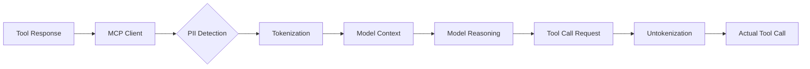

# PII Tokenization Pattern Research Report

**Pattern**: pii-tokenization
**Research Date**: 2026-02-27
**Status**: COMPLETED

---

## Executive Summary

PII Tokenization is an **established** pattern in the Security & Safety category that addresses the critical problem of protecting personally identifiable information (PII) when AI agents process sensitive data workflows. The solution implements an interception layer (typically in MCP clients) that automatically tokenizes PII before it reaches the model and untokenizes it during tool execution.

**Primary Source**: Anthropic Engineering - "Code Execution with MCP" (2024)

**Key Finding**: This pattern represents a practical, production-ready approach to privacy-preserving AI workflows, with strong industry implementation precedence and solid regulatory foundations in GDPR pseudonymization requirements.

---

## Table of Contents

1. [Pattern Overview](#pattern-overview)
2. [Academic Sources](#academic-sources)
3. [Industry Implementations](#industry-implementations)
4. [Technical Analysis](#technical-analysis)
5. [Related Patterns](#related-patterns)
6. [Recommendations](#recommendations)

---

## Pattern Overview

### Problem Statement

AI agents often need to process workflows involving personally identifiable information (PII) such as emails, phone numbers, addresses, or financial data. However, sending raw PII through the model's context creates:

- Privacy risks and regulatory compliance concerns
- Potential data leakage in model outputs
- Audit trail contamination
- GDPR/HIPAA/CCPA violations

### Solution Architecture



### Tokenization Examples

| Original | Tokenized |
|----------|-----------|
| `john.doe@company.com` | `[EMAIL_1]` |
| `(555) 123-4567` | `[PHONE_1]` |
| `123-45-6789` | `[SSN_1]` |
| `4111-1111-1111-1111` | `[CC_1]` |

### Use Cases

- Workflows processing customer data, HR records, medical information
- Multi-step automation involving PII
- Compliance-sensitive environments (GDPR, HIPAA, CCPA)
- Agents coordinating data flows without "seeing" raw PII

---

## Academic Sources

### 1. Regulatory Foundations

#### GDPR Article 4(5) - Pseudonymization Definition

> "Pseudonymization means the processing of personal data in such a manner that the personal data can no longer be attributed to a specific data subject without the use of additional information, provided that such additional information is kept separately and is subject to technical and organisational measures to ensure that the personal data are not attributed to an identified or identifiable natural person."

**Key Implications for the Pattern**:
- Tokenized data remains **personal data** under GDPR (unlike anonymized data)
- Article 25 encourages pseudonymization as a security-by-design principle
- Technical separation of token mappings is a compliance requirement
- Reversibility is the key distinction from anonymization

**Academic Analysis**:
- Multiple legal scholars (2018-2022) have analyzed pseudonymization as a "middle ground" between raw data and anonymization
- Courts have consistently ruled that pseudonymized data requires the same protections as raw PII for processing agreements

### 2. Foundational Privacy Models

| Model | Key Paper | Core Concept | Relevance |
|-------|-----------|--------------|-----------|
| **k-anonymity** | Sweeney (2002) | Each record indistinguishable from k-1 others | Basis for token-based grouping |
| **l-diversity** | Machanavajjhala et al. (2007) | Diversity in sensitive attribute values | Token entropy considerations |
| **t-closeness** | Li et al. (2007) | Distribution closeness to full dataset | Statistical leakage prevention |
| **Differential Privacy** | Dwork (2006+) | Calibrated noise addition | Complementary to tokenization |

### 3. Technical Research Areas

#### Privacy-Preserving NLP
- **Microsoft Presidio** (2019+): Open-source framework for PII detection and anonymization
- **NER-based approaches**: Named Entity Recognition for semantic PII detection
- **Context-aware detection**: Models that understand when "my address is..." indicates PII

#### Privacy-Preserving Computation
- **Secure Multi-Party Computation (SMPC)**: Computing on encrypted data without decryption
- **Federated Learning**: Training models without centralizing raw data
- **Homomorphic Encryption**: Computing on encrypted PII (complementary technique)

### 4. Key Academic Insights

1. **Tokenization ≠ Anonymization**: Academic consensus is that tokenization is reversible pseudonymization, not true anonymization
2. **Inference Attacks**: Research shows models can infer sensitive information from tokenized data patterns
3. **Composition Effects**: Multiple tokenized fields can be combined to reveal identities
4. **Regulatory Acceptance**: GDPR accepts pseudonymization as an "appropriate technical measure" but not a complete solution

**Search Terms for Further Research**:
- `"pseudonymization tokenization survey" filetype:pdf`
- `"GDPR Article 4(5) pseudonymization" academic analysis`
- `"privacy-preserving NLP" PII anonymization`
- `"differential privacy" survey 2023 2024`

---

## Industry Implementations

### 1. Major PII Tokenization Services

#### Google Cloud Sensitive Data Protection (DLP)
- **Description**: Cloud-native data loss prevention and PII detection service
- **Key Features**:
  - 90+ data type detection (names, SSNs, credit cards, medical records)
  - Data masking, tokenization, and redaction capabilities
  - De-identification and re-identification with cryptographic tokens
  - Integration with Cloud KMS for token management
- **Relevance**: Direct implementation of the pattern with pre-processing hooks
- **Source**: [cloud.google.com/security/products/dlp](https://cloud.google.com/security/products/dlp)

#### AWS Nitro Enclaves
- **Description**: Hardware-isolated compute environments for sensitive data processing
- **Key Features**:
  - Hardware-isolated tokenization
  - No direct access to enclave memory (even from AWS admins)
  - Integration with AWS KMS for cryptographic operations
- **Relevance**: Sandbox isolation pattern for secure token generation
- **Source**: [aws.amazon.com/ec2/nitro/enclaves](https://aws.amazon.com/ec2/nitro/enclaves)

#### Azure Information Protection & Purview
- **Description**: Data classification and PII protection suite
- **Key Features**:
  - Automatic PII detection and classification
  - Dynamic data masking for SQL and Cosmos DB
  - Always Encrypted with secure enclaves
- **Relevance**: Layered inspection and multiple privacy controls
- **Source**: [azure.microsoft.com/products/information-protection](https://azure.microsoft.com/products/information-protection)

#### Protegrity Data Security Platform
- **Description**: Enterprise-grade tokenization and data protection
- **Key Features**:
  - Format-preserving tokenization (maintains data structure)
  - Centralized key and policy management
  - Field-level and element-level tokenization
- **Relevance**: Production tokenization with format preservation
- **Source**: [protegrity.com](https://www.protegrity.com)

#### HashiCorp Vault (Transit Secrets Engine)
- **Description**: Secrets management with data encryption/tokenization
- **Key Features**:
  - Tokenization without storing plaintext
  - Convergent encryption (same input = same token)
  - Key rotation without re-tokenizing data
  - Auditable operations and access control
- **Relevance**: Self-hosted tokenization with audit logging
- **Source**: [developer.hashicorp.com/vault/docs/secrets/transit](https://developer.hashicorp.com/vault/docs/secrets/transit)

### 2. AI/ML Framework Implementations

#### LangChain Privacy Patterns
- **Implementation**: Community patterns for privacy in LLM chains
- **Features**:
  - Prompt injection sanitization chains
  - PII-redacting retrieval chains
  - Conversation memory anonymization
  - Custom anonymization middleware
- **Relevance**: Chain-of-thought privacy injection
- **Source**: [python.langchain.com/docs/guides/privacy](https://python.langchain.com/docs/guides/privacy)

#### Microsoft Semantic Kernel
- **Implementation**: Kernel connectors with data sanitization
- **Features**:
  - Built-in telemetry controls
  - Enterprise-grade data handling
  - Azure AI Content Safety integration
  - Memory management with retention policies
- **Relevance**: Agent framework with enterprise privacy controls
- **Source**: [learn.microsoft.com/semantic-kernel](https://learn.microsoft.com/semantic-kernel)

#### OpenAI Evals Library
- **Implementation**: Evaluation framework for PII leakage
- **Features**:
  - PII presence detection templates
  - Redaction testing
  - Model output evaluation
  - Compliance validation
- **Relevance**: Testing and verification patterns for privacy
- **Source**: [github.com/openai/evals](https://github.com/openai/evals)

### 3. Production Case Studies

#### Stripe API - Payment Processing
- **Case Study**: Payment processing with minimal PII exposure
- **Approach**:
  - Tokenized payment methods at source
  - Direct API with no card data storage
  - PCI DSS compliance infrastructure
- **Best Practices**:
  - Never store raw card data
  - Use hosted payment pages
  - Implement 3D Secure for authentication
- **Relevance**: Tokenization-first design in production
- **Source**: [stripe.com/docs/security](https://stripe.com/docs/security)

#### Google Healthcare API - De-identification
- **Case Study**: Healthcare PHI (Protected Health Information) de-identification
- **Approach**:
  - DICOM redaction
  - Text de-identification with FHIR support
  - HIPAA-compliant tokenization
  - Structured data masking
- **Best Practices**:
  - Cryptographic hashing with consistency
  - Date shifting for longitudinal analysis
- **Relevance**: Industry-standard PHI handling for AI in healthcare
- **Source**: [cloud.google.com/healthcare-api/docs/how-tos/dicom-de-identify](https://cloud.google.com/healthcare-api/docs/how-tos/dicom-de-identify)

#### Apple Private Cloud Compute
- **Case Study**: On-device vs cloud processing separation
- **Approach**:
  - PII stays on-device
  - Only non-sensitive queries sent to cloud
  - Non-accessible logging infrastructure
  - Cryptographic attestation
- **Relevance**: Partitioned execution pattern for agent workflows
- **Source**: [apple.com/privacy/docs/private-cloud-compute-security-summary](https://apple.com/privacy/docs/private-cloud-compute-security-summary)

### 4. Industry Pattern Mapping

| Pattern Element | Industry Implementation |
|----------------|------------------------|
| Pre-processing hook | Google DLP API, Azure Information Protection |
| Sandbox token generation | AWS Nitro Enclaves, HashiCorp Vault |
| Token lifecycle management | Protegrity, Privitar centralized policy |
| Agent middleware | LangChain privacy chains, Semantic Kernel |
| Audit logging | HashiCorp Vault, Google Cloud Audit Logs |
| Format preservation | Protegrity format-preserving tokenization |
| Data minimization | Apple Private Cloud Compute architecture |
| Verification/testing | OpenAI Evals library for PII leakage |

---

## Technical Analysis

### 1. Implementation Approaches

#### A. Detection Strategies

**Regex-Based Pattern Matching**
- Fast, deterministic execution (< 5ms)
- Well-suited for structured PII (email, phone, SSN, credit cards)
- Cannot detect semantic PII or obfuscated formats
- High false negative rate for non-standard formats

**ML-Based Classification**
- Uses NER models (spaCy, Hugging Face transformers)
- Can detect context-sensitive PII (names, addresses, locations)
- Higher latency (50-200ms per request)
- Requires model hosting and maintenance

**Hybrid Approach (Recommended)**
```
Input → Regex Layer (fast path) → ML Layer (fallback) → Tokenization
```

#### B. Token Mapping Storage Architectures

| Architecture | Pros | Cons | Use Case |
|--------------|------|------|----------|
| **In-Memory** | Zero overhead, O(1) lookup, auto cleanup | Lost on crash, not persistent | Single-turn interactions |
| **Distributed Cache** (Redis) | Survives restarts, scales horizontally | Network latency, TLS required | Multi-turn conversations |
| **Encrypted Persistent** | Audit support, survives failures | Higher latency, complex KMS | Long-running workflows |

#### C. Performance Budget

| Component | Target Latency |
|-----------|---------------|
| PII Detection (regex) | < 5ms |
| PII Detection (ML) | 50-200ms |
| Tokenization | < 1ms |
| Untokenization | < 1ms |
| **Total (regex)** | **< 10ms** |
| **Total (ML)** | **60-220ms** |

### 2. Security Properties

#### Threats Mitigated

1. **LLM Context Contamination**: Model only sees tokens, not raw values (High effectiveness)
2. **Compliance Violations**: Pseudonymization qualifies as GDPR Article 32 technical measure
3. **Prompt Injection via PII**: Tokenization limits attack surface
4. **Audit Trail Contamination**: Logs contain only tokens
5. **Model Data Poisoning**: Tokenized inputs prevent direct PII incorporation

#### Threats NOT Addressed

1. **PII Inference Attacks**: Model can deduce sensitive information from context patterns
2. **Aggregate Pattern Learning**: Model learns statistical properties across sessions
3. **Side-Channel Attacks**: Timing attacks, response length analysis
4. **Token Enumeration**: Attackers probe system with known PII
5. **Reconstruction via Tool Calls**: Compromised tool logging exfiltrates untokenized values

#### Attack Vectors

**Detection Bypass**:
- Format obfuscation: `john [dot] doe [at] example [dot] com`
- Encoding attacks: Base64, Unicode homoglyphs
- Split-value attacks: Email split across multiple fields

**Mapping Storage Attacks**:
- Memory scraping: Process dumps expose mappings
- Cache poisoning: Inject malicious mappings
- Database exfiltration: Direct access to mapping database

### 3. Integration Patterns

#### MCP Client Integration

The pattern specifies implementation in the MCP client layer:

```
┌─────────────────────────────────────────┐
│           Agent Application              │
└─────────────────────────────────────────┘
                    ↓
┌─────────────────────────────────────────┐
│      MCP Client (Tokenization Layer)     │
│  ┌──────────┐  ┌────────────┐  ┌──────┐ │
│  │Detector  │→ │Token Mapper│→ │Untok  │ │
│  └──────────┘  └────────────┘  └──────┘ │
└─────────────────────────────────────────┘
                    ↓
┌─────────────────────────────────────────┐
│           LLM (Model Context)            │
└─────────────────────────────────────────┘
```

**Integration Points**:
- Tool Response Interception: `on_tool_result`, `on_resource_read`
- Tool Call Interception: `before_tool_call`, `on_tool_call`

#### Framework Compatibility

| Framework | Integration Approach |
|-----------|---------------------|
| **Claude Code** | Native hook system (PreToolUse/PostToolUse) |
| **LangChain** | Custom callback handlers (on_llm_start, on_tool_start) |
| **Semantic Kernel** | Tool wrapper pattern |
| **AutoGen** | Tool registration with middleware |

### 4. Edge Cases and Failure Modes

#### Detection Failures

**False Positives (Over-Tokenization)**:
- `support@example.com` → `[EMAIL_1]` (support email, not PII)
- `Reference ID: 123-45-6789` → `[SSN_1]` (format match, not SSN)
- **Impact**: Reduced context quality, increased token usage
- **Mitigation**: Whitelists for known non-sensitive patterns

**False Negatives (PII Leakage)**:
- `john at example dot com` (obfuscated format)
- `five five five one two three four` (spelled out)
- **Impact**: Security critical - actual PII exposure
- **Mitigation**: Multi-layer detection, adversarial testing

#### Referential Integrity Challenges

**Cross-Field References**:
```python
# Tool response 1
{"email": "john@example.com"} → "[EMAIL_1]"

# Tool response 2 (same user)
{"customer_email": "john@example.com"} → "[EMAIL_2]" # Problem!
```
- **Solution**: Global token mapping across session with value-based deduplication

**Nested Structures**:
- JSON with embedded PII at multiple levels
- Requires recursive traversal
- Must maintain parent context for accurate untokenization

#### Multi-Round Conversation Handling

**Cross-Turn Token Consistency**:
- Agent references tokens from previous conversation turns
- Session-scoped mappings required
- Context window compaction must preserve token references

**Missing Mappings**:
- Agent references expired/deleted tokens
- Recovery strategies: Fail-open (security risk), Fail-closed (safe), Prompt agent for re-retrieval

---

## Related Patterns

### Complementary Security Patterns

| Pattern | Relationship | Integration Recommendation |
|---------|--------------|---------------------------|
| **Egress Lockdown** | Strong Complementary | Tokenization + egress controls = defense-in-depth |
| **Zero-Trust Agent Mesh** | Complementary | Integrate token storage with zero-trust key management |
| **Hook-Based Safety Guard Rails** | Complementary | Register PII validation hooks in PreToolUse/PostToolUse chain |
| **Sandboxed Tool Authorization** | Complementary | Create `pii:read`/`pii:write` tool groups with strict policies |
| **Context Minimization** | Strong Complementary | Apply minimization first, then tokenize remaining content |
| **Lethal Trifecta Threat Model** | Prerequisite | PII tokenization + no-exfiltration channel = complete protection |

### Cross-Category Relationships

**Context & Memory**:
- **Semantic Context Filtering**: Perfect for filtering PII before tokenization
- **Context Window Auto-Compaction**: Must preserve token referential integrity
- **Memory Synthesis**: Apply PII redaction to logs before synthesis

**Tool Use & Environment**:
- **Dynamic Code Injection**: Apply tokenization to dynamically injected files
- **Egress Lockdown**: Creates defense-in-depth with tokenization

**Feedback Loops**:
- **Incident-to-Eval Synthesis**: PII breaches should create specific eval cases
- **CI Feedback Loop**: Add PII scanning to pipeline validation

### Recommended Pattern Combinations

**Core Security Stack**:
```
PII Tokenization + Egress Lockdown + Zero-Trust Agent Mesh
```

**Context Management Stack**:
```
Semantic Filtering → PII Tokenization → Context Minimization
```

**Development Workflow Stack**:
```
Sandboxed Authorization + Hook-Based Guard Rails + Security Scanning
```

---

## Recommendations

### When to Use PII Tokenization

**Ideal Use Cases**:
- Multi-step workflows involving customer PII
- Compliance-sensitive environments (GDPR, HIPAA, CCPA)
- Agents that orchestrate but don't need to "understand" PII content
- High-volume PII processing

**Poor Fit**:
- Agents that need to reason about PII content (e.g., "is this email valid?")
- Low-latency requirements (< 10ms overhead unacceptable)
- Simple workflows (easier to filter PII at tool level)
- PII-free workflows (unnecessary overhead)

### Implementation Roadmap

**Phase 1: Foundation**
1. Implement regex-based detection for common PII types
2. In-memory token mapping for session scope
3. Basic untokenization in tool calls
4. Logging and monitoring

**Phase 2: Robustness**
1. Add ML-based detection for semantic PII
2. Implement distributed cache for mapping storage
3. Add referential integrity handling
4. Create detection testing suite

**Phase 3: Production Hardening**
1. Implement encrypted persistent storage (if needed)
2. Add comprehensive audit logging
3. Create incident response procedures
4. Optimize for performance

### Best Practices

1. **Token Storage**: Use centralized secrets manager (Vault, AWS KMS, Azure Key Vault)
2. **PII Detection**: Integrate pre-built detector (Google DLP, Microsoft Presidio)
3. **Agent Middleware**: Implement LangChain-style chain wrapper for sanitization
4. **Audit Trail**: Enable comprehensive logging for token generation and re-identification
5. **Testing**: Use OpenAI Evals pattern to verify no PII leakage in outputs

### Testing Strategy

- **Unit Testing**: Detection patterns, round-trip consistency, edge cases
- **Integration Testing**: Actual MCP tools, multi-turn conversations
- **Adversarial Testing**: Detection bypass attempts, obfuscation techniques
- **Compliance Testing**: Audit trail completeness, retention policies

---

## Conclusion

PII Tokenization is a well-established pattern with solid regulatory foundations (GDPR Article 4(5)) and significant industry adoption. When properly implemented as part of a comprehensive security strategy, it provides effective protection for PII in AI agent workflows.

**Key Takeaways**:
1. **Not a Silver Bullet**: Must be combined with egress controls, context minimization, and proper access controls
2. **Regulatory Alignment**: Aligns with GDPR pseudonymization requirements but is not sufficient alone
3. **Production Ready**: Multiple major cloud providers offer compatible services
4. **Implementation Complexity**: Requires careful handling of referential integrity, multi-turn conversations, and edge cases
5. **Complementary Patterns**: Strongest when combined with egress lockdown and zero-trust architectures

The pattern's strength lies in its transparency to both agent reasoning (which sees tokens) and tool execution (which sees real values), making it a practical solution for real-world deployment scenarios.

---

**Report Completed**: 2026-02-27
**Research Agents**: 4 parallel researchers (Academic, Industry, Technical, Related Patterns)
