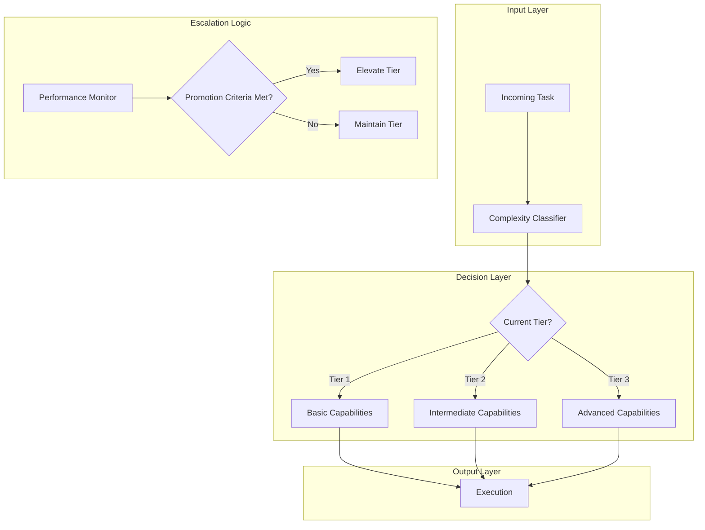
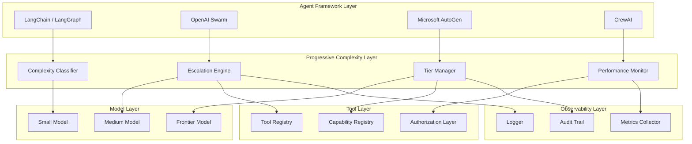

# Progressive Complexity Escalation Pattern - Technical Analysis

**Status:** Technical Analysis Complete
**Last Updated:** 2026-02-27
**Pattern Category:** Orchestration & Control
**Authors:** Nikola Balic (@nibzard)
**Based On:** Vercel AI Team

---

## Executive Summary

This report provides a comprehensive technical analysis of the **Progressive Complexity Escalation** pattern for AI agent systems. The pattern addresses the critical gap between theoretical agent capabilities and practical reliability by matching task complexity to current model capabilities through a tiered escalation system.

**Key Technical Insight:** Progressive complexity escalation is fundamentally a **risk-aware routing problem** combined with **capability tiering** and **automated promotion** based on performance metrics.

---

## Table of Contents

1. [Core Algorithmic Components](#core-algorithmic-components)
2. [Complexity Measurement Approaches](#complexity-measurement-approaches)
3. [Escalation Decision Logic](#escalation-decision-logic)
4. [Implementation Patterns](#implementation-patterns)
5. [Integration Architecture](#integration-architecture)
6. [Edge Cases & Failure Modes](#edge-cases--failure-modes)
7. [Evaluation & Measurement](#evaluation--measurement)
8. [Technical Recommendations](#technical-recommendations)

---

## 1. Core Algorithmic Components

### 1.1 System Architecture

The pattern implements a three-tier architectural model:



### 1.2 Core Data Structures

```typescript
interface TaskComplexityProfile {
  cognitiveLoad: 'minimal' | 'moderate' | 'significant';
  stepCount: number;
  toolCount: number;
  reasoningDepth: 'shallow' | 'multi-step' | 'deep';
  errorImpact: 'low' | 'medium' | 'high';
  reversibility: boolean;
  stakeholderImpact: 'internal' | 'customer' | 'public';
}

interface CapabilityTier {
  level: 1 | 2 | 3;
  name: string;
  allowedOperations: Operation[];
  maxTokens: number;
  tools: string[];
  requiresHumanApproval: boolean;
  costCeiling: number;
}

interface PromotionCriteria {
  accuracyThreshold: number;
  humanApprovalRate: number;
  volumeProcessed: number;
  timeInProduction: number; // days
  errorRate: number;
  confidenceThreshold: number;
}

interface PerformanceMetrics {
  totalTasks: number;
  successfulTasks: number;
  humanOverriddenTasks: number;
  avgConfidence: number;
  avgLatency: number;
  costPerTask: number;
  errorCategories: Map<string, number>;
}
```

### 1.3 Core Algorithm: Complexity-Based Routing

```pseudo
# MAIN ROUTING ALGORITHM
function route_task(task, current_tier, metrics):
    complexity = classify_complexity(task)

    # Check if task exceeds current tier capabilities
    if complexity.level > current_tier.max_complexity:
        # Attempt escalation if justified
        if should_escalate(task, complexity, current_tier, metrics):
            return route_to_tier(task, current_tier + 1)
        else:
            return fallback_to_lower_tier(task, current_tier)

    # Check if human approval needed
    if task.risk_score > current_tier.approval_threshold:
        return request_human_approval(task)

    # Execute at current tier
    return execute_in_tier(task, current_tier)

# ESCALATION DECISION
function should_escalate(task, complexity, current_tier, metrics):
    # Rule 1: Hard complexity cap
    if complexity.level > current_tier.max_allowed_level:
        return false

    # Rule 2: Performance-based eligibility
    if metrics.accuracy < current_tier.promotion_criteria.accuracy_threshold:
        return false

    # Rule 3: Cost-benefit analysis
    estimated_cost = estimate_cost(task, current_tier + 1)
    if estimated_cost > current_tier.cost_ceiling:
        return false

    # Rule 4: Confidence-based escalation
    if metrics.confidence < current_tier.promotion_criteria.confidence_threshold:
        return false

    return true

# PERFORMANCE-BASED PROMOTION
function evaluate_promotion(tier, metrics):
    criteria = tier.promotion_criteria

    checks = {
        'accuracy': metrics.accuracy >= criteria.accuracyThreshold,
        'approval_rate': metrics.humanApprovalRate >= criteria.humanApprovalRate,
        'volume': metrics.totalTasks >= criteria.volumeProcessed,
        'time': metrics.daysInProduction >= criteria.timeInProduction,
        'errors': metrics.errorRate <= (1 - criteria.accuracyThreshold)
    }

    return all(checks.values()), checks
```

---

## 2. Complexity Measurement Approaches

### 2.1 Static Complexity Metrics

**Definition:** Metrics derived from task structure without execution.

```python
class StaticComplexityScorer:
    def score(self, task: Task) -> float:
        score = 0.0

        # Factor 1: Expected step count (0-0.3)
        score += min(task.estimated_steps / 20, 1.0) * 0.3

        # Factor 2: Tool variety (0-0.2)
        score += min(len(task.required_tools) / 10, 1.0) * 0.2

        # Factor 3: Input size (0-0.1)
        score += min(task.input_size / 100_000, 1.0) * 0.1

        # Factor 4: Required reasoning depth (0-0.3)
        depth_multiplier = {
            'shallow': 0.0,
            'multi-step': 0.5,
            'deep': 1.0,
            'creative': 1.0
        }
        score += depth_multiplier.get(task.reasoning_depth, 0) * 0.3

        # Factor 5: Error impact (0-0.1)
        impact_multiplier = {
            'low': 0.0,
            'medium': 0.5,
            'high': 1.0
        }
        score += impact_multiplier.get(task.error_impact, 0) * 0.1

        return score
```

### 2.2 Dynamic Complexity Metrics

**Definition:** Metrics computed during task execution.

```python
class DynamicComplexityScorer:
    def score(self, execution_context: ExecutionContext) -> float:
        score = 0.0

        # Factor 1: Actual step count vs. expected (0-0.2)
        step_divergence = abs(execution_context.actual_steps -
                              execution_context.expected_steps) / \
                              execution_context.expected_steps
        score += min(step_divergence, 1.0) * 0.2

        # Factor 2: Tool failure rate (0-0.2)
        if execution_context.tool_attempts > 0:
            failure_rate = execution_context.tool_failures / \
                          execution_context.tool_attempts
            score += failure_rate * 0.2

        # Factor 3: Retry count (0-0.2)
        score += min(execution_context.retry_count / 5, 1.0) * 0.2

        # Factor 4: Token usage vs. budget (0-0.2)
        if execution_context.token_budget > 0:
            budget_pressure = execution_context.tokens_used / \
                             execution_context.token_budget
            score += min(budget_pressure, 1.0) * 0.2

        # Factor 5: Model confidence (inverse, 0-0.2)
        score += (1 - execution_context.model_confidence) * 0.2

        return score
```

### 2.3 Hybrid Complexity Score

**Combination:** Weighted average of static and dynamic scores.

```python
class HybridComplexityScorer:
    def __init__(self, static_weight=0.3, dynamic_weight=0.7):
        self.static_weight = static_weight
        self.dynamic_weight = dynamic_weight
        self.static_scorer = StaticComplexityScorer()
        self.dynamic_scorer = DynamicComplexityScorer()

    def score(self, task: Task, context: ExecutionContext) -> float:
        static_score = self.static_scorer.score(task)
        dynamic_score = self.dynamic_scorer.score(context)

        return (self.static_weight * static_score +
                self.dynamic_weight * dynamic_score)
```

### 2.4 Complexity-to-Tier Mapping

```python
COMPLEXITY_THRESHOLDS = {
    'tier_1': {
        'min_score': 0.0,
        'max_score': 0.35,
        'description': 'Low cognitive load, predictable outcomes'
    },
    'tier_2': {
        'min_score': 0.35,
        'max_score': 0.65,
        'description': 'Multi-step with human gates, conditional logic'
    },
    'tier_3': {
        'min_score': 0.65,
        'max_score': 1.0,
        'description': 'Autonomous decision-making, complex reasoning'
    }
}

def map_to_tier(complexity_score: float) -> int:
    if complexity_score <= COMPLEXITY_THRESHOLDS['tier_1']['max_score']:
        return 1
    elif complexity_score <= COMPLEXITY_THRESHOLDS['tier_2']['max_score']:
        return 2
    else:
        return 3
```

---

## 3. Escalation Decision Logic

### 3.1 Multi-Factor Escalation Engine

```python
class EscalationEngine:
    def __init__(self, config: EscalationConfig):
        self.config = config
        self.metrics_store = MetricsStore()

    def should_escalate(self,
                       task: Task,
                       current_tier: int,
                       context: ExecutionContext) -> EscalationDecision:
        """
        Determines whether a task should escalate to a higher tier.
        Returns: EscalationDecision with reason and confidence
        """

        # Load current tier performance
        metrics = self.metrics_store.get_tier_metrics(current_tier)

        # Evaluate escalation criteria
        criteria_results = {
            'complexity_cap': self._check_complexity_cap(task, current_tier),
            'performance_eligibility': self._check_performance(metrics, current_tier),
            'cost_benefit': self._check_cost_benefit(task, current_tier),
            'confidence': self._check_confidence(context, current_tier),
            'safety': self._check_safety_gates(task, current_tier),
            'business_rules': self._check_business_rules(task, current_tier)
        }

        # Decision logic
        escalation_score = self._compute_escalation_score(criteria_results)
        should_escalate = escalation_score >= self.config.escalation_threshold

        return EscalationDecision(
            escalate=should_escalate,
            target_tier=current_tier + 1,
            confidence=escalation_score,
            criteria=criteria_results,
            reasoning=self._generate_reasoning(criteria_results)
        )

    def _check_complexity_cap(self, task: Task, tier: int) -> bool:
        """Hard cap: task complexity must not exceed tier maximum"""
        tier_config = TIER_CONFIGS[tier]
        return task.complexity_score <= tier_config['max_complexity']

    def _check_performance(self, metrics: TierMetrics, tier: int) -> bool:
        """Performance: tier must meet promotion criteria"""
        criteria = TIER_CONFIGS[tier]['promotion_criteria']

        return (
            metrics.accuracy >= criteria['accuracy_threshold'] and
            metrics.human_approval_rate >= criteria['approval_rate'] and
            metrics.total_tasks >= criteria['volume_threshold']
        )

    def _check_cost_benefit(self, task: Task, tier: int) -> bool:
        """Economic: escalation must be cost-justified"""
        next_tier = tier + 1

        estimated_cost_current = self._estimate_cost(task, tier)
        estimated_cost_next = self._estimate_cost(task, next_tier)

        cost_increase = (estimated_cost_next - estimated_cost_current) / \
                       estimated_cost_current

        # Allow up to 3x cost for complexity increase
        max_cost_increase = self.config.max_cost_multiplier.get(
            (tier, next_tier),
            3.0
        )

        return cost_increase <= max_cost_increase

    def _check_confidence(self, context: ExecutionContext, tier: int) -> bool:
        """Confidence: current tier must show sufficient confidence"""
        threshold = TIER_CONFIGS[tier]['min_confidence']
        return context.model_confidence >= threshold

    def _check_safety_gates(self, task: Task, tier: int) -> bool:
        """Safety: verify safety constraints are satisfied"""
        if task.risk_level == 'critical':
            return False  # Never auto-escalate critical tasks

        if tier == 3:  # Highest tier - additional checks
            return self._verify_tier3_safety(task)

        return True

    def _check_business_rules(self, task: Task, tier: int) -> bool:
        """Business rules: apply domain-specific constraints"""
        rules = self.config.business_rules.get(task.domain, [])

        for rule in rules:
            if not rule.allows_escalation(task, tier):
                return False

        return True

    def _compute_escalation_score(self, criteria: Dict[str, bool]) -> float:
        """Compute weighted escalation score"""
        weights = self.config.criteria_weights

        score = 0.0
        total_weight = 0.0

        for criterion, passed in criteria.items():
            weight = weights.get(criterion, 1.0)
            total_weight += weight
            if passed:
                score += weight

        return score / total_weight if total_weight > 0 else 0.0
```

### 3.2 Automated Promotion System

```python
class AutomatedPromotionSystem:
    """
    Monitors tier performance and automatically elevates capabilities
    when promotion criteria are met.
    """

    def __init__(self, config: PromotionConfig):
        self.config = config
        self.evaluator = PromotionEvaluator()

    def evaluate_tier_for_promotion(self, tier: int) -> PromotionStatus:
        """Evaluate if a tier should be promoted"""

        metrics = self.metrics_store.get_tier_metrics(tier)
        criteria = TIER_CONFIGS[tier]['promotion_criteria']

        evaluation = self.evaluator.evaluate(metrics, criteria)

        if evaluation.passed:
            return self._execute_promotion(tier, evaluation)
        else:
            return PromotionStatus(
                promoted=False,
                reason='Criteria not met',
                details=evaluation.checks
            )

    def _execute_promotion(self, tier: int, evaluation: Evaluation) -> PromotionStatus:
        """Execute tier promotion"""

        # Create new tier configuration
        new_tier = tier + 1
        new_config = self._create_tier_config(new_tier, evaluation)

        # Deploy new configuration (canary rollout)
        rollout = self._canary_rollout(new_config)

        if rollout.successful:
            # Commit promotion
            self.config_store.commit_tier_promotion(tier, new_tier)
            self.metrics_store.reset_tier_metrics(new_tier)

            return PromotionStatus(
                promoted=True,
                new_tier=new_tier,
                reason='All criteria met',
                details=evaluation.checks
            )
        else:
            # Rollback
            self._rollback_promotion(tier)
            return PromotionStatus(
                promoted=False,
                reason='Canary rollout failed',
                details=rollout.errors
            )

    def _canary_rollout(self, config: TierConfig) -> RolloutResult:
        """Gradual rollout with monitoring"""

        canary_percentage = self.config.initial_canary_percentage
        max_percentage = self.config.max_canary_percentage

        while canary_percentage <= max_percentage:
            # Roll out to canary percentage
            self.deployer.rollout(config, percentage=canary_percentage)

            # Monitor for evaluation period
            time.sleep(self.config.evaluation_period_seconds)

            # Check canary metrics
            canary_metrics = self.metrics_store.get_canary_metrics(config)

            if not self._validate_canary(canary_metrics):
                return RolloutResult(successful=False,
                                    errors=self._get_canary_errors(canary_metrics))

            # Increase canary percentage
            canary_percentage *= 2

        return RolloutResult(successful=True)
```

---

## 4. Implementation Patterns

### 4.1 Tiered Agent Architecture

```typescript
// Core agent interface with tier support
interface TieredAgent {
  tier: AgentTier;
  capabilities: CapabilitySet;
  process(task: Task): Promise<Result>;
  canHandle(task: Task): boolean;
}

// Implementation
class TieredAgentImpl implements TieredAgent {
  constructor(
    private tier: AgentTier,
    private model: LLMClient,
    private tools: ToolRegistry,
    private escalationEngine: EscalationEngine
  ) {}

  async process(task: Task): Promise<Result> {
    // Check if we can handle this task
    if (!this.canHandle(task)) {
      const decision = await this.escalationEngine.shouldEscalate(
        task,
        this.tier.level,
        this.createContext(task)
      );

      if (decision.escalate) {
        return this.escalateTo(task, decision.targetTier);
      } else {
        return this.fallback(task);
      }
    }

    // Process at current tier
    return this.executeAtTier(task);
  }

  canHandle(task: Task): boolean {
    const complexity = this.classifyComplexity(task);
    return complexity.level <= this.tier.maxComplexity;
  }

  private async executeAtTier(task: Task): Promise<Result> {
    switch (this.tier.level) {
      case 1:
        return this.executeTier1(task);
      case 2:
        return this.executeTier2(task);
      case 3:
        return this.executeTier3(task);
      default:
        throw new Error(`Unknown tier: ${this.tier.level}`);
    }
  }

  private async executeTier1(task: Task): Promise<Result> {
    // Tier 1: Basic capabilities
    // - Information gathering
    // - Template-based generation
    // - Simple transformations
    const allowedTools = this.tools.getToolsForTier(1);
    const systemPrompt = this.getSystemPrompt(1);

    return this.model.execute({
      task,
      tools: allowedTools,
      systemPrompt,
      maxTokens: this.tier.maxTokens
    });
  }

  private async executeTier2(task: Task): Promise<Result> {
    // Tier 2: Intermediate capabilities
    // - Multi-step workflows
    // - Conditional logic
    // - Multiple tool integration
    // - Human approval gates

    const plan = await this.generatePlan(task);
    const results = [];

    for (const step of plan.steps) {
      // Check for human approval requirement
      if (step.requiresApproval) {
        const approval = await this.requestApproval(step);
        if (!approval.approved) {
          return Result.approvalDenied(step, approval.reason);
        }
      }

      const result = await this.executeStep(step);
      results.push(result);
    }

    return Result.aggregate(results);
  }

  private async executeTier3(task: Task): Promise<Result> {
    // Tier 3: Advanced capabilities
    // - Autonomous decision-making
    // - Complex reasoning chains
    // - Creative problem-solving

    const executionContext = {
      autonomous: true,
      confidenceThreshold: 0.8,
      maxIterations: 10,
      learningEnabled: true
    };

    return this.model.executeAutonomous({
      task,
      tools: this.tools.getAllTools(),
      systemPrompt: this.getSystemPrompt(3),
      executionContext
    });
  }
}
```

### 4.2 Capability Registry Pattern

```typescript
class CapabilityRegistry {
  private capabilities: Map<string, Capability> = new Map();
  private tierCapabilities: Map<number, Set<string>> = new Map();

  registerCapability(capability: Capability): void {
    this.capabilities.set(capability.id, capability);

    // Index by tier
    for (const tier of capability.allowedTiers) {
      if (!this.tierCapabilities.has(tier)) {
        this.tierCapabilities.set(tier, new Set());
      }
      this.tierCapabilities.get(tier)!.add(capability.id);
    }
  }

  getCapabilitiesForTier(tier: number): Capability[] {
    const capabilityIds = this.tierCapabilities.get(tier) || new Set();
    return Array.from(capabilityIds)
      .map(id => this.capabilities.get(id)!)
      .filter(cap => cap !== undefined);
  }

  checkCapability(tier: number, capabilityId: string): boolean {
    const capability = this.capabilities.get(capabilityId);
    if (!capability) return false;
    return capability.allowedTiers.includes(tier);
  }
}

interface Capability {
  id: string;
  name: string;
  description: string;
  allowedTiers: number[];
  requiresApproval: boolean;
  costLevel: 'low' | 'medium' | 'high';
  riskLevel: 'low' | 'medium' | 'high';
}
```

### 4.3 Configuration Management

```typescript
interface ProgressiveComplexityConfig {
  // Tier definitions
  tiers: {
    [key: number]: {
      name: string;
      maxComplexity: number;
      maxTokens: number;
      allowedCapabilities: string[];
      approvalThreshold: number;
      costCeiling: number;
    };
  };

  // Promotion criteria
  promotionCriteria: {
    [key: number]: PromotionCriteria;
  };

  // Escalation weights
  escalationWeights: {
    complexityCap: number;
    performanceEligibility: number;
    costBenefit: number;
    confidence: number;
    safetyGates: number;
    businessRules: number;
  };

  // Rollout configuration
  rollout: {
    initialCanaryPercentage: number;
    maxCanaryPercentage: number;
    evaluationPeriodSeconds: number;
    rollbackOnError: boolean;
  };

  // Business rules by domain
  businessRules: {
    [domain: string]: BusinessRule[];
  };
}

// Example configuration
const DEFAULT_CONFIG: ProgressiveComplexityConfig = {
  tiers: {
    1: {
      name: 'Basic',
      maxComplexity: 0.35,
      maxTokens: 4000,
      allowedCapabilities: [
        'data_retrieval',
        'template_generation',
        'simple_classification'
      ],
      approvalThreshold: 1.0, // All risky ops need approval
      costCeiling: 0.01
    },
    2: {
      name: 'Intermediate',
      maxComplexity: 0.65,
      maxTokens: 16000,
      allowedCapabilities: [
        'data_retrieval',
        'template_generation',
        'simple_classification',
        'multi_step_workflow',
        'conditional_logic',
        'tool_chaining',
        'personalization'
      ],
      approvalThreshold: 0.6,
      costCeiling: 0.10
    },
    3: {
      name: 'Advanced',
      maxComplexity: 1.0,
      maxTokens: 128000,
      allowedCapabilities: [
        'all_capabilities'
      ],
      approvalThreshold: 0.2,
      costCeiling: 1.00
    }
  },

  promotionCriteria: {
    1: {
      accuracyThreshold: 0.95,
      humanApprovalRate: 0.90,
      volumeProcessed: 1000,
      timeInProduction: 30, // days
      errorRate: 0.05,
      confidenceThreshold: 0.85
    },
    2: {
      accuracyThreshold: 0.98,
      humanApprovalRate: 0.95,
      volumeProcessed: 10000,
      timeInProduction: 60,
      errorRate: 0.02,
      confidenceThreshold: 0.90
    }
  },

  escalationWeights: {
    complexityCap: 1.0,
    performanceEligibility: 1.0,
    costBenefit: 0.8,
    confidence: 0.9,
    safetyGates: 1.0,
    businessRules: 0.7
  },

  rollout: {
    initialCanaryPercentage: 5,
    maxCanaryPercentage: 100,
    evaluationPeriodSeconds: 3600,
    rollbackOnError: true
  },

  businessRules: {
    'financial': [
      {
        name: 'transaction_limit',
        allowsEscalation: (task, tier) => task.metadata.amount < 10000
      },
      {
        name: 'audit_requirement',
        allowsEscalation: (task, tier) => task.metadata.auditApproved
      }
    ],
    'healthcare': [
      {
        name: 'hipaa_compliance',
        allowsEscalation: (task, tier) => task.metadata.phiProtected === false
      }
    ]
  }
};
```

### 4.4 State Machine for Task Execution

```typescript
enum TaskState {
  RECEIVED = 'received',
  CLASSIFIED = 'classified',
  ROUTING = 'routing',
  APPROVAL_PENDING = 'approval_pending',
  EXECUTING = 'executing',
  COMPLETED = 'completed',
  FAILED = 'failed',
  ESCALATED = 'escalated',
  AWAITING_HUMAN = 'awaiting_human'
}

class TaskStateMachine {
  private state: TaskState;
  private context: TaskContext;

  constructor(private task: Task, private config: ProgressiveComplexityConfig) {
    this.state = TaskState.RECEIVED;
    this.context = { task, attempts: [], tier: 1 };
  }

  async transition(event: StateEvent): Promise<StateTransition> {
    const validTransitions = TRANSITION_MATRIX[this.state];

    if (!validTransitions.includes(event.type)) {
      throw new Error(`Invalid transition: ${this.state} -> ${event.type}`);
    }

    return this.handleEvent(event);
  }

  private async handleEvent(event: StateEvent): Promise<StateTransition> {
    switch (event.type) {
      case 'classify':
        return this.handleClassify(event);
      case 'route':
        return this.handleRoute(event);
      case 'approve':
        return this.handleApprove(event);
      case 'reject':
        return this.handleReject(event);
      case 'escalate':
        return this.handleEscalate(event);
      case 'execute':
        return this.handleExecute(event);
      case 'complete':
        return this.handleComplete(event);
      case 'fail':
        return this.handleFail(event);
      default:
        throw new Error(`Unknown event: ${event.type}`);
    }
  }

  private async handleClassify(event: StateEvent): Promise<StateTransition> {
    const complexity = await this.classifyComplexity(this.task);
    this.context.complexity = complexity;
    this.state = TaskState.CLASSIFIED;

    return {
      from: TaskState.RECEIVED,
      to: TaskState.CLASSIFIED,
      complexity,
      nextAction: 'route'
    };
  }

  private async handleRoute(event: StateEvent): Promise<StateTransition> {
    const routing = await this.routeTask(this.context);

    if (routing.requiresApproval) {
      this.state = TaskState.APPROVAL_PENDING;
      return {
        from: TaskState.CLASSIFIED,
        to: TaskState.APPROVAL_PENDING,
        approvalRequest: routing.approvalRequest
      };
    }

    if (routing.escalated) {
      this.state = TaskState.ESCALATED;
      this.context.tier = routing.targetTier;
      return {
        from: TaskState.CLASSIFIED,
        to: TaskState.ESCALATED,
        tier: routing.targetTier,
        nextAction: 'execute'
      };
    }

    this.state = TaskState.EXECUTING;
    return {
      from: TaskState.CLASSIFIED,
      to: TaskState.EXECUTING,
      tier: this.context.tier,
      nextAction: 'execute'
    };
  }

  // ... other handlers
}

const TRANSITION_MATRIX: Record<TaskState, StateEventType[]> = {
  [TaskState.RECEIVED]: ['classify'],
  [TaskState.CLASSIFIED]: ['route'],
  [TaskState.ROUTING]: ['approve', 'escalate', 'execute'],
  [TaskState.APPROVAL_PENDING]: ['approve', 'reject'],
  [TaskState.EXECUTING]: ['complete', 'fail', 'escalate'],
  [TaskState.COMPLETED]: [],
  [TaskState.FAILED]: ['classify'], // Retry from start
  [TaskState.ESCALATED]: ['execute'],
  [TaskState.AWAITING_HUMAN]: ['approve', 'reject']
};
```

---

## 5. Integration Architecture

### 5.1 Integration Points



### 5.2 LangChain/LangGraph Integration

```python
from langchain.agents import AgentExecutor, create_react_agent
from langchain.graph import StateGraph
from typing import TypedDict, Literal

class ProgressiveComplexityState(TypedDict):
    task: str
    tier: Literal[1, 2, 3]
    complexity_score: float
    execution_result: Optional[str]
    approval_required: bool
    approval_granted: bool

def create_progressive_agent(
    complexity_classifier,
    escalation_engine,
    tier_configs
):
    """Create a LangGraph agent with progressive complexity escalation"""

    # Define graph nodes
    async def classify_node(state: ProgressiveComplexityState):
        result = complexity_classifier.classify(state['task'])
        return {
            'complexity_score': result.score,
            'tier': result.suggested_tier
        }

    async def check_escalation_node(state: ProgressiveComplexityState):
        decision = escalation_engine.should_escalate(
            state['task'],
            state['tier'],
            state['complexity_score']
        )
        return {
            'tier': decision.target_tier if decision.escalate else state['tier'],
            'approval_required': decision.requires_approval
        }

    async def approval_node(state: ProgressiveComplexityState):
        if state['approval_required']:
            # Request human approval
            approval = await request_approval(state['task'], state['tier'])
            return {'approval_granted': approval.granted}
        return {'approval_granted': True}

    async def execute_node(state: ProgressiveComplexityState):
        # Execute with tier-specific agent
        agent = tier_configs[state['tier']]['agent']
        result = await agent.execute(state['task'])
        return {'execution_result': result}

    # Build graph
    workflow = StateGraph(ProgressiveComplexityState)

    workflow.add_node("classify", classify_node)
    workflow.add_node("check_escalation", check_escalation_node)
    workflow.add_node("approval", approval_node)
    workflow.add_node("execute", execute_node)

    # Define edges
    workflow.set_entry_point("classify")
    workflow.add_edge("classify", "check_escalation")
    workflow.add_conditional_edges(
        "check_escalation",
        lambda x: "approval" if x['approval_required'] else "execute",
        {"approval": "approval", "execute": "execute"}
    )
    workflow.add_conditional_edges(
        "approval",
        lambda x: "execute" if x['approval_granted'] else END,
        {"execute": "execute", END: END}
    )
    workflow.add_edge("execute", END)

    return workflow.compile()
```

### 5.3 OpenAI Swarm Integration

```typescript
import { Agent, functionDeclarations, Tool } from 'openai-swarm';

interface ProgressiveAgentConfig {
  tier: number;
  capabilities: string[];
  escalationThreshold: number;
}

class ProgressiveSwarmAgent {
  private agents: Map<number, Agent>;
  private escalationEngine: EscalationEngine;

  constructor(config: ProgressiveAgentConfig[]) {
    this.escalationEngine = new EscalationEngine();
    this.agents = this.initializeAgents(config);
  }

  private initializeAgents(configs: ProgressiveAgentConfig[]): Map<number, Agent> {
    const agents = new Map<number, Agent>();

    for (const config of configs) {
      const tools = this.getToolsForTier(config.tier);

      const agent = new Agent({
        name: `tier_${config.tier}_agent`,
        instructions: this.getSystemPrompt(config.tier),
        functions: tools,
        handoffs: this.createHandoffFunctions(config.tier)
      });

      agents.set(config.tier, agent);
    }

    return agents;
  }

  private createHandoffFunctions(currentTier: number): Tool[] {
    const handoffs: Tool[] = [];

    // Add escalation function
    if (currentTier < 3) {
      handoffs.push({
        type: 'function',
        function: {
          name: 'escalate_to_higher_tier',
          description: 'Escalate to a higher tier agent',
          parameters: {
            type: 'object',
            properties: {
              reason: { type: 'string' },
              confidence: { type: 'number' }
            },
            required: ['reason']
          }
        },
        handler: async (args) => {
          const decision = await this.escalationEngine.shouldEscalate(
            args.task,
            currentTier,
            args.context
          );

          if (decision.escalate) {
            return this.agents.get(currentTier + 1);
          }

          return this.agents.get(currentTier);
        }
      });
    }

    return handoffs;
  }

  async execute(task: string, initialTier: number = 1): Promise<string> {
    const agent = this.agents.get(initialTier);

    return agent.run({
      task,
      context: { tier: initialTier }
    });
  }
}
```

### 5.4 Anthropic Claude Integration

```python
from anthropic import Anthropic
from typing import Optional, Dict, Any

class ProgressiveClaudeAgent:
    def __init__(self, api_key: str):
        self.client = Anthropic(api_key=api_key)
        self.complexity_classifier = ComplexityClassifier()
        self.escalation_engine = EscalationEngine()

    async def process(self, task: str, initial_tier: int = 1) -> Dict[str, Any]:
        # Classify complexity
        complexity = await self.complexity_classifier.classify(task)
        current_tier = max(initial_tier, complexity.suggested_tier)

        # Check escalation
        escalation_decision = await self.escalation_engine.should_escalate(
            task, current_tier, complexity
        )

        if escalation_decision.escalate:
            current_tier = escalation_decision.target_tier

        # Execute with appropriate model
        model = self.get_model_for_tier(current_tier)
        system_prompt = self.get_system_prompt(current_tier)
        tools = self.get_tools_for_tier(current_tier)

        response = self.client.messages.create(
            model=model,
            max_tokens=self.get_max_tokens(current_tier),
            system=system_prompt,
            messages=[{"role": "user", "content": task}],
            tools=tools if tools else None
        )

        return {
            'content': response.content,
            'tier': current_tier,
            'complexity_score': complexity.score,
            'escalated': escalation_decision.escalate
        }

    def get_model_for_tier(self, tier: int) -> str:
        models = {
            1: "claude-3-haiku-20240307",  # Fast, cost-effective
            2: "claude-3-5-sonnet-20241022",  # Balanced
            3: "claude-3-5-opus-20241022"  # Most capable
        }
        return models.get(tier, models[1])
```

---

## 6. Edge Cases & Failure Modes

### 6.1 Classification Failures

**Problem:** Complexity misclassification leads to inappropriate tier routing.

```python
class ClassificationFailureHandler:
    def handle(self, task: Task, error: ClassificationError) -> RoutingDecision:
        """
        Handle classification failures gracefully.
        """
        error_type = type(error)

        if isinstance(error, AmbiguousComplexityError):
            # Default to safer lower tier
            return RoutingDecision(
                tier=1,
                reason="Complexity ambiguous - defaulting to safe tier",
                confidence=0.5
            )

        elif isinstance(error, FeatureMissingError):
            # Use fallback classifier
            fallback_result = self.fallback_classifier.classify(task)
            return RoutingDecision(
                tier=fallback_result.suggested_tier,
                reason="Primary classifier failed - using fallback",
                confidence=fallback_result.confidence * 0.8  # Penalize
            )

        elif isinstance(error, TimeoutError):
            # Quick heuristic routing
            quick_tier = self.quick_heuristic(task)
            return RoutingDecision(
                tier=quick_tier,
                reason="Classification timeout - using heuristic",
                confidence=0.6
            )

        else:
            # Unknown error - safest default
            return RoutingDecision(
                tier=1,
                reason=f"Classification error: {error} - defaulting to tier 1",
                confidence=0.3
            )
```

### 6.2 Escalation Loops

**Problem:** Tasks continuously escalate without resolution.

```python
class EscalationLoopDetector:
    def __init__(self, max_escalations: int = 2, loop_window: int = 5):
        self.max_escalations = max_escalations
        self.loop_window = loop_window
        self.escalation_history: Dict[str, List[int]] = {}

    def check_loop(self, task_id: str, target_tier: int) -> LoopDetection:
        """
        Detect if task is stuck in escalation loop.
        """
        history = self.escalation_history.get(task_id, [])
        recent_escalations = history[-self.loop_window:]

        # Check escalation count
        escalation_count = sum(1 for t in recent_escalations if t == target_tier)

        if escalation_count >= self.max_escalations:
            return LoopDetection(
                is_loop=True,
                reason=f"Task escalated to tier {target_tier} {escalation_count} times",
                suggestion="break"
            )

        # Check for oscillation
        if self._detect_oscillation(recent_escalations):
            return LoopDetection(
                is_loop=True,
                reason="Task oscillating between tiers",
                suggestion="stabilize"
            )

        return LoopDetection(is_loop=False)

    def _detect_oscillation(self, history: List[int]) -> bool:
        """Detect if task is oscillating between tiers"""
        if len(history) < 4:
            return False

        # Check for A-B-A-B pattern
        return (history[-4] == history[-2] and
                history[-3] == history[-1] and
                history[-4] != history[-3])
```

### 6.3 Performance Degradation

**Problem:** Tier promotion leads to unexpected performance degradation.

```python
class PerformanceGuard:
    def __init__(self, config: GuardConfig):
        self.config = config
        self.metrics = MetricsStore()

    async def check_before_execution(self, task: Task, tier: int) -> GuardResult:
        """
        Check if tier is safe to use based on recent performance.
        """
        recent_metrics = await self.metrics.get_recent_metrics(
            tier,
            window=self.config.evaluation_window
        )

        checks = {
            'accuracy': self._check_accuracy(recent_metrics),
            'latency': self._check_latency(recent_metrics),
            'error_rate': self._check_error_rate(recent_metrics),
            'cost': self._check_cost(recent_metrics)
        }

        if all(checks.values()):
            return GuardResult(allowed=True, checks=checks)

        # Determine fallback tier
        fallback_tier = self._determine_fallback(tier, checks)

        return GuardResult(
            allowed=False,
            fallback_tier=fallback_tier,
            checks=checks,
            reason=self._generate_failure_reason(checks)
        )

    def _check_accuracy(self, metrics: TierMetrics) -> bool:
        threshold = self.config.min_accuracy
        return metrics.accuracy >= threshold

    def _check_latency(self, metrics: TierMetrics) -> bool:
        threshold = self.config.max_latency_p95
        return metrics.latency_p95 <= threshold

    def _check_error_rate(self, metrics: TierMetrics) -> bool:
        threshold = self.config.max_error_rate
        return metrics.error_rate <= threshold

    def _check_cost(self, metrics: TierMetrics) -> bool:
        threshold = self.config.max_cost_per_task
        return metrics.avg_cost <= threshold
```

### 6.4 State Inconsistency

**Problem:** Distributed system state becomes inconsistent during escalation.

```typescript
class StateConsistencyManager {
  private stateStore: DistributedStateStore;
  private lockManager: DistributedLockManager;

  async escalateTask(taskId: string, targetTier: number): Promise<EscalationResult> {
    // Acquire distributed lock
    const lock = await this.lockManager.acquire(`task:${taskId}`, {
      timeout: 5000,
      retry: 3
    });

    try {
      // Read current state with version
      const currentState = await this.stateStore.getWithVersion(taskId);

      // Verify state
      if (currentState.status !== 'pending_escalation') {
        throw new StateInconsistencyError(
          `Task ${taskId} not in pending_escalation state: ${currentState.status}`
        );
      }

      // Prepare new state
      const newState: TaskState = {
        ...currentState,
        tier: targetTier,
        status: 'escalated',
        version: currentState.version + 1,
        escalatedAt: Date.now()
      };

      // Conditional write with version check
      const written = await this.stateStore.putIfVersion(
        taskId,
        newState,
        currentState.version
      );

      if (!written) {
        throw new StateConflictError(
          `Concurrent modification detected for task ${taskId}`
        );
      }

      // Publish escalation event
      await this.eventBus.publish('task.escalated', {
        taskId,
        fromTier: currentState.tier,
        toTier: targetTier,
        timestamp: Date.now()
      });

      return EscalationResult.success(targetTier);

    } finally {
      await lock.release();
    }
  }
}
```

### 6.5 Resource Exhaustion

**Problem:** High-tier operations consume excessive resources.

```python
class ResourceGuard:
    def __init__(self, config: ResourceConfig):
        self.config = config
        self.resource_monitor = ResourceMonitor()

    async def check_resources(self, tier: int) -> ResourceCheck:
        """
        Check if sufficient resources available for tier operation.
        """
        current_usage = await self.resource_monitor.get_current_usage()
        capacity = self.config.tier_capacity[tier]

        checks = {
            'cpu': current_usage.cpu_percent < capacity.max_cpu_percent,
            'memory': current_usage.memory_percent < capacity.max_memory_percent,
            'tokens': current_usage.tokens_available >= capacity.min_tokens,
            'rate_limit': current_usage.requests_remaining >= capacity.min_requests,
            'budget': current_usage.budget_remaining >= capacity.min_budget
        }

        if all(checks.values()):
            return ResourceCheck(allowed=True, checks=checks)

        # Calculate wait time or suggest lower tier
        wait_time = self._estimate_wait_time(current_usage, capacity)
        fallback_tier = self._suggest_fallback_tier(tier, checks)

        return ResourceCheck(
            allowed=False,
            checks=checks,
            wait_seconds=wait_time,
            fallback_tier=fallback_tier
        )

    def _estimate_wait_time(self, usage: ResourceUsage, capacity: TierCapacity) -> int:
        """Estimate time until resources available"""
        # Simplified: based on token replenishment rate
        token_deficit = capacity.min_tokens - usage.tokens_available
        replenish_rate = self.config.token_replenish_rate

        return int(token_deficit / replenish_rate) if replenish_rate > 0 else 60
```

---

## 7. Evaluation & Measurement

### 7.1 Key Performance Indicators

```python
class ProgressiveComplexityMetrics:
    """
    Metrics for evaluating progressive complexity escalation system.
    """

    def __init__(self):
        self.prometheus = PrometheusClient()
        self.logger = StructuredLogger()

    def record_task_execution(self, event: TaskExecutionEvent):
        """
        Record task execution metrics.
        """
        tags = {
            'tier': str(event.tier),
            'task_type': event.task_type,
            'escalated': str(event.escalated),
            'outcome': event.outcome
        }

        # Counter metrics
        self.prometheus.increment(
            'tasks_total',
            tags=tags
        )

        # Histogram metrics
        self.prometheus.histogram(
            'task_duration_seconds',
            value=event.duration,
            tags=tags
        )

        self.prometheus.histogram(
            'task_tokens_used',
            value=event.tokens_used,
            tags=tags
        )

        self.prometheus.histogram(
            'task_cost_usd',
            value=event.cost,
            tags=tags
        )

        # Gauge metrics
        self.prometheus.gauge(
            'task_confidence',
            value=event.confidence,
            tags=tags
        )

        # Log structured event
        self.logger.info('task_executed', {
            'task_id': event.task_id,
            'tier': event.tier,
            'escalated': event.escalated,
            'duration': event.duration,
            'tokens': event.tokens_used,
            'cost': event.cost,
            'outcome': event.outcome
        })

    def record_escalation(self, event: EscalationEvent):
        """
        Record escalation metrics.
        """
        tags = {
            'from_tier': str(event.from_tier),
            'to_tier': str(event.to_tier),
            'reason': event.reason
        }

        self.prometheus.increment(
            'escalations_total',
            tags=tags
        )

        self.prometheus.histogram(
            'escalation_confidence',
            value=event.confidence,
            tags=tags
        )

    def get_tier_metrics(self, tier: int, window: timedelta) -> TierMetrics:
        """
        Get aggregated metrics for a tier.
        """
        # Query metrics store
        tasks_total = self.prometheus.query_sum(
            'tasks_total',
            {'tier': str(tier)},
            window=window
        )

        tasks_successful = self.prometheus.query_sum(
            'tasks_total',
            {'tier': str(tier), 'outcome': 'success'},
            window=window
        )

        avg_duration = self.prometheus.query_avg(
            'task_duration_seconds',
            {'tier': str(tier)},
            window=window
        )

        avg_cost = self.prometheus.query_avg(
            'task_cost_usd',
            {'tier': str(tier)},
            window=window
        )

        avg_confidence = self.prometheus.query_avg(
            'task_confidence',
            {'tier': str(tier)},
            window=window
        )

        escalations = self.prometheus.query_sum(
            'escalations_total',
            {'from_tier': str(tier)},
            window=window
        )

        return TierMetrics(
            tier=tier,
            total_tasks=tasks_total,
            successful_tasks=tasks_successful,
            accuracy=tasks_successful / tasks_total if tasks_total > 0 else 0,
            avg_duration=avg_duration,
            avg_cost=avg_cost,
            avg_confidence=avg_confidence,
            escalations=escalations
        )
```

### 7.2 A/B Testing Framework

```python
class EscalationABTest:
    """
    A/B testing framework for escalation strategies.
    """

    def __init__(self, config: ABTestConfig):
        self.config = config
        self.experiment_store = ExperimentStore()

    async def assign_variant(self, task: Task) -> str:
        """
        Assign task to experiment variant.
        """
        # Get active experiment
        experiment = await self.experiment_store.get_active(
            self.config.experiment_name
        )

        if not experiment:
            return 'control'

        # Consistent hashing for assignment
        task_hash = hash(f"{task.id}:{experiment.id}")
        variant_index = task_hash % len(experiment.variants)

        return experiment.variants[variant_index]

    async def record_outcome(self, task: Task, variant: str, outcome: TaskOutcome):
        """
        Record task outcome for experiment.
        """
        await self.experiment_store.record_outcome(
            experiment_id=self.config.experiment_name,
            variant=variant,
            task_id=task.id,
            outcome={
                'success': outcome.success,
                'duration': outcome.duration,
                'cost': outcome.cost,
                'tier': outcome.tier,
                'escalated': outcome.escalated
            }
        )

    async def analyze_experiment(self) -> ExperimentAnalysis:
        """
        Analyze experiment results.
        """
        experiment = await self.experiment_store.get(
            self.config.experiment_name
        )

        results = {}
        for variant in experiment.variants:
            outcomes = await self.experiment_store.get_outcomes(
                experiment_id=experiment.id,
                variant=variant
            )

            results[variant] = {
                'total': len(outcomes),
                'success_rate': sum(o['success'] for o in outcomes) / len(outcomes),
                'avg_duration': sum(o['duration'] for o in outcomes) / len(outcomes),
                'avg_cost': sum(o['cost'] for o in outcomes) / len(outcomes),
                'escalation_rate': sum(o['escalated'] for o in outcomes) / len(outcomes)
            }

        # Statistical significance
        control = results['control']
        treatment = results['treatment']

        significance = self._calculate_significance(
            control['success_rate'],
            treatment['success_rate'],
            len([o for o in experiment.outcomes if o.variant == 'control']),
            len([o for o in experiment.outcomes if o.variant == 'treatment'])
        )

        return ExperimentAnalysis(
            results=results,
            significance=significance,
            winner=self._determine_winner(results, significance)
        )
```

### 7.3 Evaluation Pipeline

```python
class EvaluationPipeline:
    """
    Comprehensive evaluation pipeline for progressive complexity systems.
    """

    async def run_evaluation(self, config: EvaluationConfig) -> EvaluationReport:
        """
        Run full evaluation pipeline.
        """
        report = EvaluationReport()

        # 1. Tier Performance Evaluation
        report.tier_performance = await self.evaluate_tier_performance(config)

        # 2. Escalation Accuracy
        report.escalation_accuracy = await self.evaluate_escalation_accuracy(config)

        # 3. Cost Efficiency
        report.cost_efficiency = await self.evaluate_cost_efficiency(config)

        # 4. Classification Accuracy
        report.classification_accuracy = await self.evaluate_classification(config)

        # 5. System Reliability
        report.reliability = await self.evaluate_reliability(config)

        # 6. User Satisfaction
        report.user_satisfaction = await self.evaluate_user_satisfaction(config)

        return report

    async def evaluate_tier_performance(self, config: EvaluationConfig) -> Dict[int, TierPerformance]:
        """
        Evaluate performance of each tier.
        """
        results = {}

        for tier in [1, 2, 3]:
            metrics = await self.metrics.get_tier_metrics(tier, config.window)
            evaluation_set = await self.test_data.get_for_tier(tier)

            # Run evaluation
            predictions = []
            actuals = []

            for test_case in evaluation_set:
                result = await self.agent.execute(test_case, tier=tier)
                predictions.append(result.success)
                actuals.append(test_case.expected_success)

            # Calculate metrics
            accuracy = accuracy_score(actuals, predictions)
            precision = precision_score(actuals, predictions)
            recall = recall_score(actuals, predictions)
            f1 = f1_score(actuals, predictions)

            results[tier] = TierPerformance(
                accuracy=accuracy,
                precision=precision,
                recall=recall,
                f1=f1,
                total_tasks=metrics.total_tasks,
                successful_tasks=metrics.successful_tasks,
                avg_latency=metrics.avg_duration,
                avg_cost=metrics.avg_cost
            )

        return results

    async def evaluate_escalation_accuracy(self, config: EvaluationConfig) -> EscalationAccuracy:
        """
        Evaluate accuracy of escalation decisions.
        """
        escalations = await self.metrics.get_escalations(config.window)

        correct_escalations = 0
        incorrect_escalations = 0
        missed_escalations = 0

        for esc in escalations:
            # Check if escalation was correct
            if esc.was_successful:
                correct_escalations += 1
            else:
                # Would lower tier have worked?
                if await self._could_lower_tier_succeed(esc):
                    incorrect_escalations += 1
                else:
                    correct_escalations += 1  # Escalation was necessary

        # Check for missed escalations
        all_tasks = await self.metrics.get_all_tasks(config.window)
        for task in all_tasks:
            if task.tier == 1 and task.failed:
                # Would higher tier have succeeded?
                if await self._would_higher_tier_succeed(task):
                    missed_escalations += 1

        return EscalationAccuracy(
            correct_escalations=correct_escalations,
            incorrect_escalations=incorrect_escalations,
            missed_escalations=missed_escalations,
            precision=correct_escalations / (correct_escalations + incorrect_escalations),
            recall=correct_escalations / (correct_escalations + missed_escalations)
        )
```

---

## 8. Technical Recommendations

### 8.1 Design Recommendations

**1. Start Conservative, Expand Gradually**

```yaml
# Initial deployment recommendation
initial_deployment:
  tier_1:
    enabled: true
    rollout_percentage: 100  # Full rollout
    monitoring: extensive

  tier_2:
    enabled: true
    rollout_percentage: 10   # Canary only
    promotion_criteria: strict
    monitoring: intensive

  tier_3:
    enabled: false
    planned_enablement: "Q2 2026"
    prerequisites: ["tier_2_stable", "model_upgrade"]
```

**2. Implement Circuit Breakers**

```python
class TierCircuitBreaker:
    """
    Circuit breaker for tier failures.
    """

    def __init__(self, config: CircuitBreakerConfig):
        self.failure_threshold = config.failure_threshold
        self.recovery_timeout = config.recovery_timeout
        self.state = {}  # tier -> CircuitState

    async def check_tier(self, tier: int) -> CircuitState:
        state = self.state.get(tier, CircuitState.CLOSED)

        if state == CircuitState.OPEN:
            # Check if recovery timeout passed
            if await self._should_attempt_reset(tier):
                state = CircuitState.HALF_OPEN
                self.state[tier] = state

        return state

    async def record_failure(self, tier: int):
        current_state = await self.check_tier(tier)

        if current_state == CircuitState.CLOSED:
            failures = self._get_failure_count(tier) + 1

            if failures >= self.failure_threshold:
                self.state[tier] = CircuitState.OPEN
                await self._notify_tier_disabled(tier)

        elif current_state == CircuitState.HALF_OPEN:
            self.state[tier] = CircuitState.OPEN
            await self._notify_tier_disabled(tier)

    async def record_success(self, tier: int):
        if await self.check_tier(tier) == CircuitState.HALF_OPEN:
            self.state[tier] = CircuitState.CLOSED
            await self._notify_tier_recovered(tier)
```

**3. Use Feature Flags for Tier Control**

```typescript
interface TierFeatureFlags {
  tier1Enabled: boolean;
  tier2Enabled: boolean;
  tier3Enabled: boolean;
  tier2RolloutPercentage: number;
  tier3RolloutPercentage: number;
  userWhitelist: string[];
}

class TierFeatureFlagManager {
  async shouldUseTier(userId: string, tier: number): Promise<boolean> {
    const flags = await this.getFlags();

    switch (tier) {
      case 1:
        return flags.tier1Enabled;

      case 2:
        if (!flags.tier2Enabled) return false;
        if (flags.userWhitelist.includes(userId)) return true;
        return this.hashPercentage(userId) <= flags.tier2RolloutPercentage;

      case 3:
        if (!flags.tier3Enabled) return false;
        if (flags.userWhitelist.includes(userId)) return true;
        return this.hashPercentage(userId) <= flags.tier3RolloutPercentage;

      default:
        return false;
    }
  }

  private hashPercentage(userId: string): number {
    // Consistent hash to percentage (0-100)
    const hash = this.hashCode(userId);
    return Math.abs(hash % 100);
  }
}
```

### 8.2 Implementation Best Practices

**1. Separate Complexity Classification from Routing**

```python
# Good: Separated concerns
class ComplexityClassifier:
    def classify(self, task: Task) -> ComplexityScore:
        # Only responsible for classification
        pass

class TaskRouter:
    def __init__(self, classifier: ComplexityClassifier):
        self.classifier = classifier

    def route(self, task: Task) -> RoutingDecision:
        # Uses classifier for routing decision
        complexity = self.classifier.classify(task)
        return self._make_routing_decision(complexity)

# Bad: Mixed concerns
class TaskRouterBad:
    def route(self, task: Task) -> RoutingDecision:
        # Classification and routing mixed together
        if task.description.startswith('complex'):
            return RoutingDecision(tier=3)
        # ...
```

**2. Immutable Tier Configurations**

```typescript
interface TierConfiguration {
  readonly level: number;
  readonly name: string;
  readonly maxComplexity: number;
  readonly capabilities: readonly string[];
  readonly promotionCriteria: Readonly<PromotionCriteria>;
}

// Create new version instead of mutating
function upgradeTier(config: TierConfiguration, upgrades: Partial<TierConfiguration>): TierConfiguration {
  return {
    ...config,
    ...upgrades,
    version: config.version + 1
  };
}
```

**3. Observability-First Design**

```python
class ObservableAgent:
    def __init__(self, agent: Agent, metrics: MetricsClient):
        self.agent = agent
        self.metrics = metrics

    async def execute(self, task: Task, tier: int) -> Result:
        # Start span
        span = self.start_span('agent.execute', {
            'task_id': task.id,
            'tier': tier
        })

        start_time = time.time()

        try:
            result = await self.agent.execute(task, tier)

            # Record success metrics
            self.metrics.histogram('task.duration', time.time() - start_time, {
                'tier': str(tier),
                'status': 'success'
            })

            return result

        except Exception as e:
            # Record error metrics
            self.metrics.increment('task.errors', {
                'tier': str(tier),
                'error_type': type(e).__name__
            })

            span.set_tag('error', str(e))
            raise

        finally:
            span.finish()
```

### 8.3 Trade-off Analysis

| Decision | Pros | Cons | Recommendation |
|----------|------|------|----------------|
| **Start with all tiers** | Faster time to value | Higher risk of failures | Only for low-stakes domains |
| **Start with tier 1 only** | Safer, builds trust | Slower value realization | **Recommended for production** |
| **Aggressive promotion** | Faster capability growth | Higher risk of regression | Use with extensive monitoring |
| **Conservative promotion** | Safer, stable | Slower evolution | **Recommended** |
| **Real-time escalation** | Optimal resource use | Higher latency | Use for cost-sensitive apps |
| **Batch escalation** | Simpler, predictable | Suboptimal routing | **Recommended** |
| **Manual promotion** | Full control | Slow, manual overhead | Initial deployment only |
| **Automated promotion** | Faster evolution | Risk of bugs | **Recommended** with safeguards |

### 8.4 Migration Strategy

```python
class MigrationStrategy:
    """
    Phased migration to progressive complexity escalation.
    """

    async def phase_1_baseline(self, duration: timedelta):
        """
        Phase 1: Establish baseline with current system.
        """
        print("Phase 1: Baseline measurement")

        # Run current system and collect metrics
        baseline_metrics = await self.collect_baseline_metrics(duration)

        # Identify task complexity distribution
        complexity_distribution = await self.analyze_complexity_distribution(
            baseline_metrics
        )

        return {
            'baseline_metrics': baseline_metrics,
            'complexity_distribution': complexity_distribution,
            'recommended_tiers': self.design_tiers(complexity_distribution)
        }

    async def phase_2_pilot(self, config: PilotConfig):
        """
        Phase 2: Pilot tier 1 with shadow mode.
        """
        print("Phase 2: Pilot deployment")

        # Deploy tier 1 to pilot users
        pilot_results = await self.deploy_pilot(config)

        # Run shadow mode for all users
        shadow_results = await self.run_shadow_mode(config)

        # Compare results
        comparison = self.compare_results(pilot_results, shadow_results)

        return comparison

    async def phase_3_gradual_rollout(self, config: RolloutConfig):
        """
        Phase 3: Gradual rollout of tier 1.
        """
        print("Phase 3: Gradual rollout")

        rollout_plan = [
            {'percentage': 5, 'duration': timedelta(days=1)},
            {'percentage': 20, 'duration': timedelta(days=3)},
            {'percentage': 50, 'duration': timedelta(days=7)},
            {'percentage': 100, 'duration': timedelta(days=14)}
        ]

        results = []
        for stage in rollout_plan:
            stage_result = await self.rollout_stage(stage, config)
            results.append(stage_result)

            if not self._validate_stage(stage_result):
                print(f"Stage validation failed: {stage_result.errors}")
                await self.rollback()
                break

        return results

    async def phase_4_tier_2_preparation(self, config: Tier2Config):
        """
        Phase 4: Prepare tier 2 deployment.
        """
        print("Phase 4: Tier 2 preparation")

        # Verify tier 1 stability
        tier1_metrics = await self.metrics.get_tier_metrics(1, timedelta(days=30))

        if not self._verify_tier_stability(tier1_metrics):
            raise Exception("Tier 1 not stable enough for tier 2 deployment")

        # Train tier 2 classifier
        tier2_classifier = await self.train_classifier(2, config)

        # Run tier 2 in shadow mode
        tier2_shadow = await self.run_shadow_mode_tier(config, 2)

        return {
            'tier1_stable': True,
            'tier2_classifier_trained': True,
            'tier2_shadow_results': tier2_shadow
        }
```

### 8.5 Monitoring Dashboards

```yaml
# Recommended Grafana dashboard configuration
dashboards:
  progressive_complexity_overview:
    panels:
      - title: "Tasks by Tier"
        type: graph
        query: |
          sum by (tier) (rate(tasks_total[5m]))

      - title: "Escalation Rate"
        type: graph
        query: |
          sum by (from_tier, to_tier) (rate(escalations_total[5m]))

      - title: "Tier Accuracy"
        type: stat
        query: |
          sum(successful_tasks) / sum(total_tasks) by (tier)

      - title: "Cost per Task by Tier"
        type: graph
        query: |
          avg(task_cost_usd) by (tier)

      - title: "Task Duration by Tier"
        type: heatmap
        query: |
          histogram_quantile(0.95, task_duration_seconds) by (tier)

      - title: "Escalation Confidence Distribution"
        type: histogram
        query: |
          escalation_confidence

      - title: "Promotion Readiness"
        type: stat
        query: |
          promotion_readiness_score

  tier_health:
    panels:
      - title: "Tier 1 Health"
        type: row
        panels:
          - title: "Accuracy"
            query: tier_1_accuracy
          - title: "P95 Latency"
            query: histogram_quantile(0.95, tier_1_duration)
          - title: "Error Rate"
            query: rate(tier_1_errors[5m])

      - title: "Tier 2 Health"
        type: row
        panels:
          - title: "Accuracy"
            query: tier_2_accuracy
          - title: "P95 Latency"
            query: histogram_quantile(0.95, tier_2_duration)
          - title: "Error Rate"
            query: rate(tier_2_errors[5m])
```

---

## Appendix: Reference Implementation

### Complete Tier Configuration Example

```typescript
// Complete example configuration
const PROGRESSIVE_COMPLEXITY_CONFIG: ProgressiveComplexityConfig = {
  tiers: {
    1: {
      level: 1,
      name: 'Basic',
      description: 'Low-complexity, high-reliability tasks',
      maxComplexity: 0.35,
      capabilities: [
        'read_data',
        'template_generation',
        'simple_classification',
        'information_extraction'
      ],
      toolLimit: 2,
      maxTokens: 4000,
      model: 'claude-3-haiku-20240307',
      approvalRequired: false,
      approvalThreshold: 1.0,
      costCeiling: 0.01,
      maxSteps: 3,
      reasoningDepth: 'shallow'
    },
    2: {
      level: 2,
      name: 'Intermediate',
      description: 'Multi-step workflows with human oversight',
      maxComplexity: 0.65,
      capabilities: [
        'read_data',
        'write_data',  // Added capability
        'template_generation',
        'simple_classification',
        'information_extraction',
        'multi_step_workflow',
        'conditional_logic',
        'tool_chaining',
        'personalization',
        'transformation'
      ],
      toolLimit: 5,
      maxTokens: 16000,
      model: 'claude-3-5-sonnet-20241022',
      approvalRequired: true,
      approvalThreshold: 0.6,
      costCeiling: 0.10,
      maxSteps: 8,
      reasoningDepth: 'multi-step'
    },
    3: {
      level: 3,
      name: 'Advanced',
      description: 'Autonomous complex reasoning',
      maxComplexity: 1.0,
      capabilities: [
        'all_capabilities'
      ],
      toolLimit: -1,  // Unlimited
      maxTokens: 128000,
      model: 'claude-3-5-opus-20241022',
      approvalRequired: true,
      approvalThreshold: 0.2,
      costCeiling: 1.00,
      maxSteps: -1,  // Unlimited
      reasoningDepth: 'deep'
    }
  },

  promotionCriteria: {
    1: {
      accuracyThreshold: 0.95,
      humanApprovalRate: 0.90,
      volumeProcessed: 1000,
      timeInProduction: 30,
      minConfidence: 0.85,
      maxErrorRate: 0.05,
      stabilityWindow: 7  // days
    },
    2: {
      accuracyThreshold: 0.98,
      humanApprovalRate: 0.95,
      volumeProcessed: 10000,
      timeInProduction: 60,
      minConfidence: 0.90,
      maxErrorRate: 0.02,
      stabilityWindow: 14  // days
    }
  },

  escalationWeights: {
    complexityCap: 1.0,
    performanceEligibility: 1.0,
    costBenefit: 0.8,
    confidence: 0.9,
    safetyGates: 1.0,
    businessRules: 0.7
  },

  complexityScoring: {
    static: {
      stepCount: { weight: 0.3, max: 20 },
      toolCount: { weight: 0.2, max: 10 },
      inputSize: { weight: 0.1, max: 100000 },
      reasoningDepth: { weight: 0.3 },
      errorImpact: { weight: 0.1 }
    },
    dynamic: {
      stepDivergence: { weight: 0.2 },
      toolFailureRate: { weight: 0.2 },
      retryCount: { weight: 0.2 },
      tokenBudgetPressure: { weight: 0.2 },
      modelConfidence: { weight: 0.2 }
    },
    hybrid: {
      staticWeight: 0.3,
      dynamicWeight: 0.7
    }
  },

  safety: {
    riskLevels: {
      low: {
        maxTier: 3,
        requiresApproval: false
      },
      medium: {
        maxTier: 2,
        requiresApproval: true
      },
      high: {
        maxTier: 1,
        requiresApproval: true
      },
      critical: {
        maxTier: 1,
        requiresApproval: true,
        requireHumanExecution: true
      }
    },

    protectedDomains: {
      financial: {
        maxAutoEscalation: 2,
        additionalApprovals: true
      },
      healthcare: {
        maxAutoEscalation: 1,
        additionalApprovals: true,
        auditRequired: true
      },
      legal: {
        maxAutoEscalation: 1,
        additionalApprovals: true,
        auditRequired: true
      }
    }
  },

  monitoring: {
    metrics: [
      'tasks_total',
      'tasks_duration_seconds',
      'tasks_tokens_used',
      'tasks_cost_usd',
      'tasks_confidence',
      'escalations_total',
      'promotions_total',
      'classification_accuracy',
      'tier_accuracy'
    ],

    alerts: {
      tierAccuracyDrop: {
        threshold: 0.9,
        window: '5m',
        severity: 'warning'
      },
      escalationSpike: {
        threshold: 100,
        window: '1m',
        severity: 'warning'
      },
      costOverrun: {
        threshold: 1.5,
        window: '1h',
        severity: 'critical',
        comparison: 'baseline'
      }
    }
  },

  rollout: {
    initialCanaryPercentage: 5,
    maxCanaryPercentage: 100,
    evaluationPeriodSeconds: 3600,
    rollbackOnError: true,
    rollbackThreshold: {
      accuracy: 0.05,
      latency: 2.0,
      errorRate: 0.02
    }
  }
};
```

---

## Conclusion

The Progressive Complexity Escalation pattern provides a robust framework for managing AI agent capabilities in production environments. Through careful complexity measurement, intelligent escalation logic, and automated promotion systems, organizations can safely evolve their agent capabilities while maintaining reliability and managing costs.

**Key Technical Takeaways:**

1. **Hybrid complexity scoring** (static + dynamic) provides the most accurate tier assignments
2. **Multi-factor escalation engines** with weighted criteria prevent premature promotions
3. **Automated promotion systems** with canary rollouts enable safe capability evolution
4. **Circuit breakers and feature flags** provide necessary safety controls
5. **Comprehensive observability** is essential for operating multi-tier systems

**Implementation Priority:**

1. Start with tier 1 only, establish baseline
2. Deploy tier 2 with conservative promotion criteria
3. Implement automated promotion with manual override
4. Gradually enable tier 3 as models improve

**Success Metrics:**

- Tier accuracy >= 95% (tier 1), >= 98% (tier 2)
- Escalation precision >= 90%
- Cost per task within budget
- User satisfaction maintained or improved

---

*Document Version: 1.0*
*Last Updated: 2026-02-27*
*Status: Technical Analysis Complete*
