# Pattern Relationships: Recursive Best-of-N Delegation

This analysis identifies how the **Recursive Best-of-N Delegation** pattern relates to other agentic AI patterns in terms of similarity, complementarity, extension, and competition.

## Overview

The Recursive Best-of-N Delegation pattern is a **hybrid orchestration pattern** that combines:
1. **Recursive task decomposition** (from hierarchical agent patterns)
2. **Parallel candidate generation** (from best-of-N sampling)
3. **Judge-based selection** (from evaluation patterns)
4. **Adaptive compute allocation** (from inference-time scaling)

This positions it at the intersection of **Orchestration & Control**, **Feedback Loops**, and **Reliability & Eval** categories.

## Relationship Map

```mermaid
graph TB
    subgraph Core_Pattern["Recursive Best-of-N Delegation (Core)"]
        RBON[Recursive Best-of-N]
    end

    subgraph Parent_Patterns["Parent Patterns (Extends)"]
        ToT[Tree-of-Thought]
        LATS[LATS]
        SubAgent[Sub-Agent Spawning]
    end

    subgraph Related_Patterns["Related Patterns (Complements)"]
        PlanExec[Plan-Then-Execute]
        PlannerWorker[Planner-Worker]
        Factory[Factory over Assistant]
        Reflect[Reflection Loop]
        Critique[Self-Critique Evaluator]
    end

    subgraph Competing_Patterns["Competing Alternatives"]
        ParallelTool[Parallel Tool Execution]
        IterativeBrain[Iterative Brainstorming]
        Opponent[Opponent Processor]
    end

    subgraph Supporting_Patterns["Supporting Patterns"]
        Adaptive[Adaptive Sandbox Fan-Out]
        Variance[Variance-Based RL Selection]
        AntiReward[Anti-Reward-Hacking]
        GoT[Graph of Thoughts]
    end

    RBON -.->|extends| ToT
    RBON -.->|extends| LATS
    RBON -.->|specializes| SubAgent

    RBON ===|complements| PlanExec
    RBON ===|complements| PlannerWorker
    RBON ===|complements| Factory
    RBON ===|complements| Reflect
    RBON ===|uses| Critique

    RBON ~~~|alternative to| ParallelTool
    RBON ~~~|alternative to| IterativeBrain
    RBON ~~~|alternative to| Opponent

    RBON --->|requires| Adaptive
    RBON --->|related to| Variance
    RBON --->|benefits from| AntiReward
    RBON --->|generalizes to| GoT

    style RBON fill:#e3f2fd,stroke:#1976d2,stroke-width:3px
    style ToT fill:#fff3e0,stroke:#f57c00
    style LATS fill:#fff3e0,stroke:#f57c00
    style SubAgent fill:#fff3e0,stroke:#f57c00
```

## Parent Patterns (Extends)

### 1. Tree-of-Thought Reasoning

**Relationship**: Recursive Best-of-N is a **specialized implementation** of Tree-of-Thought.

**Key differences**:
- **ToT**: Explores a search tree of intermediate thoughts with branching and pruning
- **RBON**: Adds explicit best-of-N selection at each node and recursive delegation structure

**How it extends**:
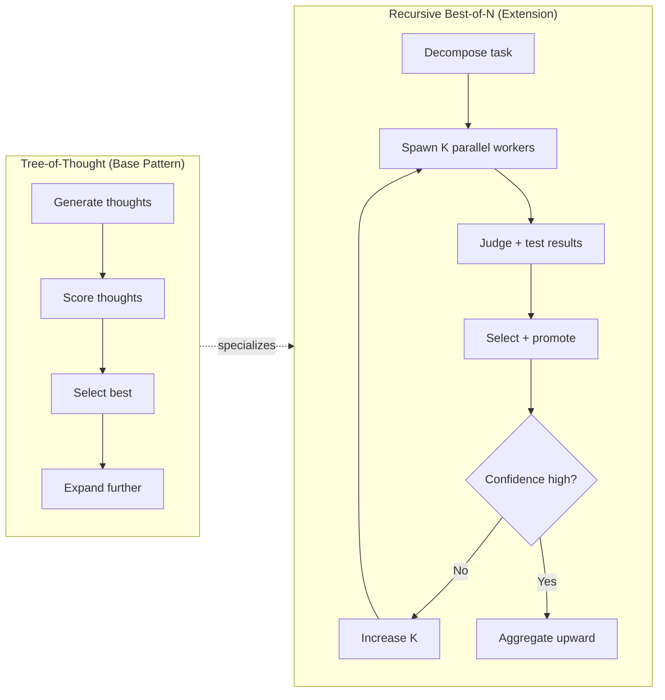

**When to use which**:
- Use **Tree-of-Thought** for reasoning tasks where you want to explore thought paths (puzzles, planning)
- Use **Recursive Best-of-N** for execution tasks where each node produces artifacts that can be objectively scored (code generation, migrations)

### 2. Language Agent Tree Search (LATS)

**Relationship**: Recursive Best-of-N is a **simplified, production-oriented variant** of LATS.

**Key similarities**:
- Both use tree search over candidate solutions
- Both employ evaluation/scoring at nodes
- Both explore promising branches more deeply

**Key differences**:

| Aspect | LATS | Recursive Best-of-N |
|--------|------|---------------------|
| Search strategy | Monte Carlo Tree Search with UCB | Best-of-N selection with adaptive K |
| Evaluation | LLM self-reflection | Automated tests + LLM judge |
| Use case | Complex reasoning tasks | Code execution and task decomposition |
| Overhead | High (full MCTS) | Moderate (targeted parallelism) |

**How it extends**:
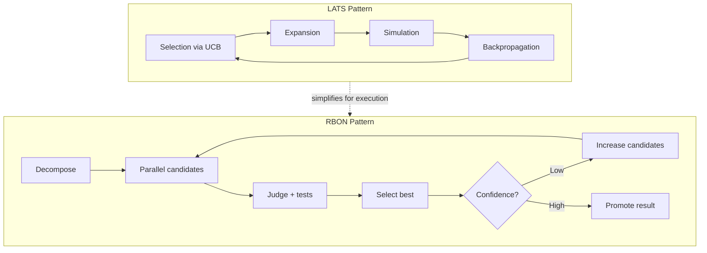

**When to use which**:
- Use **LATS** for mathematical reasoning, puzzles, planning problems requiring systematic exploration
- Use **Recursive Best-of-N** for software tasks with testable outputs (code generation, migrations)

### 3. Sub-Agent Spawning

**Relationship**: Recursive Best-of-N is a **structured application** of sub-agent spawning with built-in redundancy.

**Key differences**:
- **Sub-Agent Spawning**: General pattern for spawning specialized agents with isolated contexts
- **RBON**: Specifically spawns K parallel agents per subtask for redundancy and selection

**How it extends**:
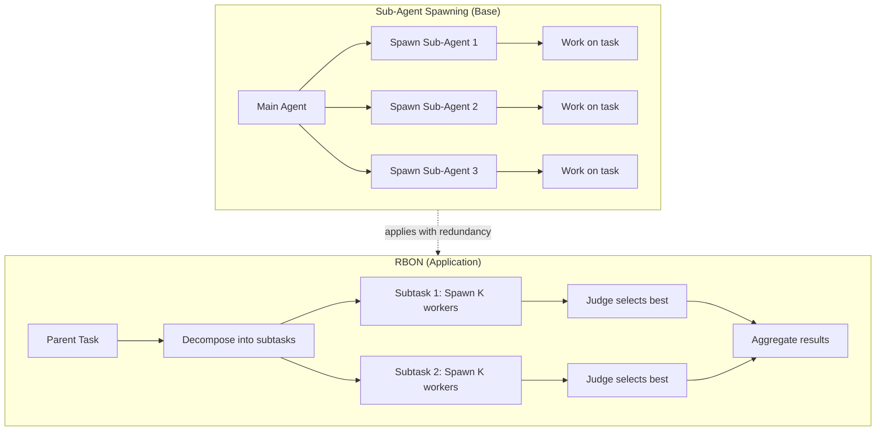

**When to use which**:
- Use **Sub-Agent Spawning** when tasks are naturally independent and don't need candidate comparison
- Use **Recursive Best-of-N** when each subtask is ambiguous and benefits from multiple attempts

## Related Patterns (Complements)

### 1. Plan-Then-Execute Pattern

**Relationship**: **Complementary** - Plan-Then-Execute provides the structure, RBON provides the execution reliability.

**How they work together**:
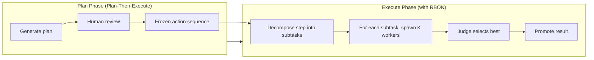

**Pattern combination example**:
```yaml
# Hybrid pattern for complex migrations
workflow:
  planning:
    mode: plan_then_execute
    human_review: true

  execution:
    mode: recursive_best_of_n
    per_subtask:
      parallel_candidates: 3
      judge: automated_tests + llm_review
      adaptive_k: true  # Increase on low confidence
```

### 2. Planner-Worker Separation

**Relationship**: **Complementary** - Planner-Worker provides the hierarchical structure, RBON enhances worker reliability.

**How they work together**:
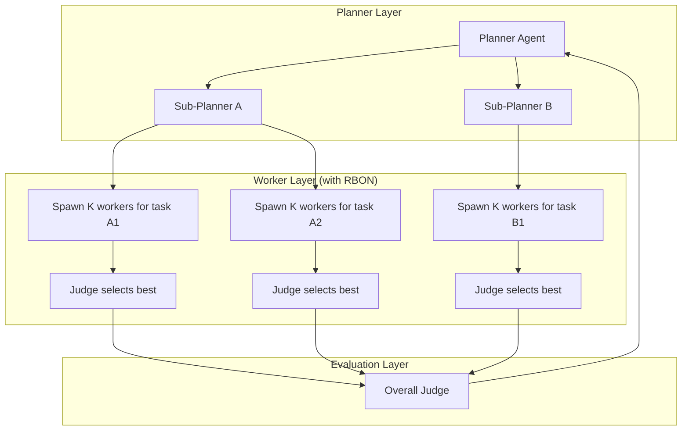

**Pattern combination**: Use Planner-Worker for the overall project structure, then apply RBON at the worker level for individual task execution.

### 3. Factory over Assistant

**Relationship**: **Philosophically aligned** - Both patterns emphasize parallel autonomous execution over sequential interaction.

**Key alignment**:
- **Factory Model**: Spawn multiple agents, check periodically, focus on orchestration
- **RBON**: Natural fit for factory model because it reduces need for human intervention through built-in redundancy

**How they work together**:
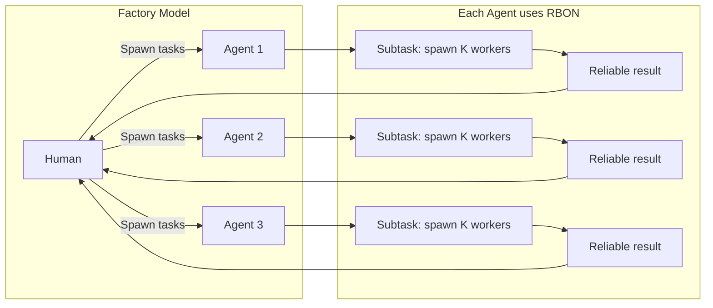

**Pattern combination**: In factory mode, each autonomous agent can internally use RBON for reliable task completion, reducing the need for human debugging.

### 4. Reflection Loop

**Relationship**: **Complementary** - Reflection provides single-candidate improvement, RBON provides multi-candidate selection.

**How they work together**:
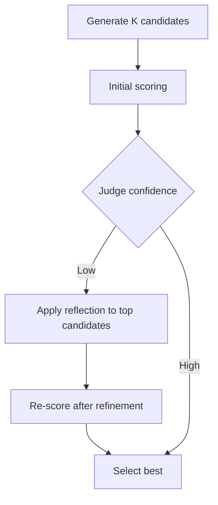

**Pattern combination**: Use RBON for initial generation, then apply reflection loop to top candidates before final selection.

### 5. Self-Critique Evaluator Loop

**Relationship**: **RBON uses Self-Critique as the judge mechanism**.

**Integration pattern**:
```python
# RBON with self-critique evaluator
class RecursiveBestOfNWithCritique:
    def execute_subtask(self, task, k=3):
        candidates = []
        for i in range(k):
            worker = WorkerAgent()
            result = worker.execute(task)
            candidates.append(result)

        # Use self-critique evaluator as judge
        evaluator = SelfCritiqueEvaluator()
        scored_candidates = [
            (c, evaluator.evaluate(task, c))
            for c in candidates
        ]

        return max(scored_candidates, key=lambda x: x[1])[0]
```

## Competing Alternatives

### 1. Parallel Tool Execution

**Relationship**: **Alternative approaches to parallelism**.

**Key differences**:

| Aspect | Parallel Tool Execution | RBON |
|--------|------------------------|------|
| Parallelism level | Tool calls | Full agent executions |
| Use case | Speed up I/O operations | Improve reliability through redundancy |
| Selection mechanism | None (all execute) | Best-of-N selection |
| Isolation | Same agent, different tools | Different agents, different sandboxes |

**When to use which**:
- Use **Parallel Tool Execution** when you need to speed up independent read operations (file reads, searches)
- Use **RBON** when the task itself is ambiguous and multiple approaches should be tried

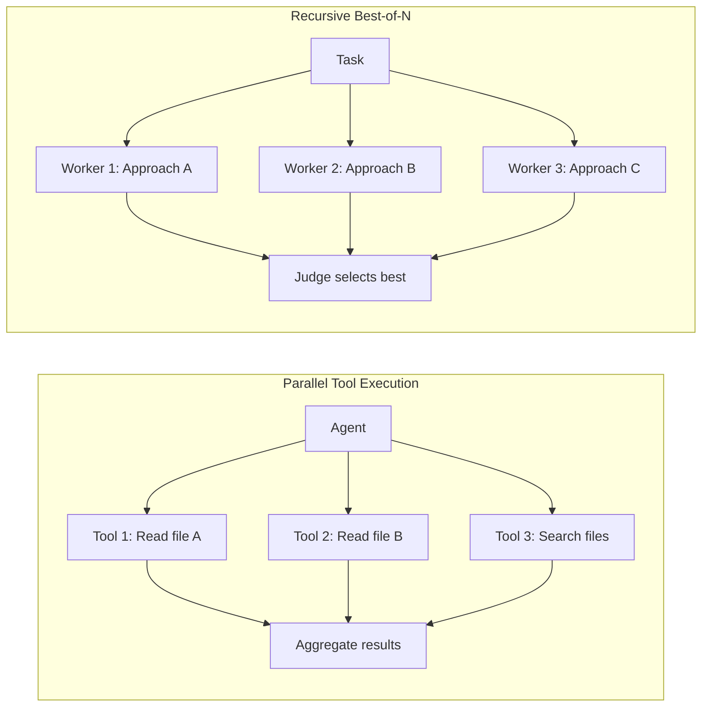

### 2. Iterative Multi-Agent Brainstorming

**Relationship**: **Alternative approaches to parallel ideation**.

**Key differences**:
- **Iterative Brainstorming**: Focus on generating diverse perspectives and synthesizing
- **RBON**: Focus on selecting the single best output through competition

**When to use which**:
- Use **Iterative Brainstorming** for creative tasks, idea generation, exploring solution space
- Use **RBON** for execution tasks where correctness can be objectively verified

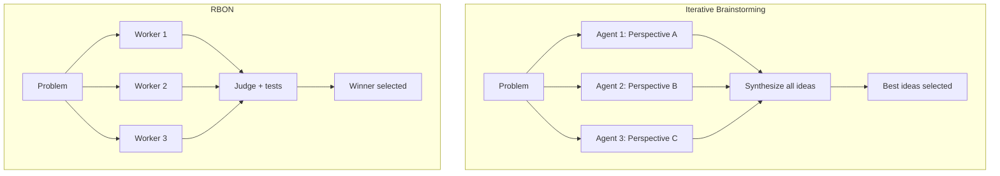

### 3. Opponent Processor / Multi-Agent Debate

**Relationship**: **Alternative approaches to quality through multiple agents**.

**Key differences**:
- **Opponent Processor**: Agents debate with opposing goals, surfaces blind spots through adversarial process
- **RBON**: Agents compete independently, winner selected by objective criteria

**When to use which**:
- Use **Opponent Processor** when you need to reduce bias, surface assumptions, consider trade-offs
- Use **RBON** when there are objective correctness criteria (tests, type checks, specs)

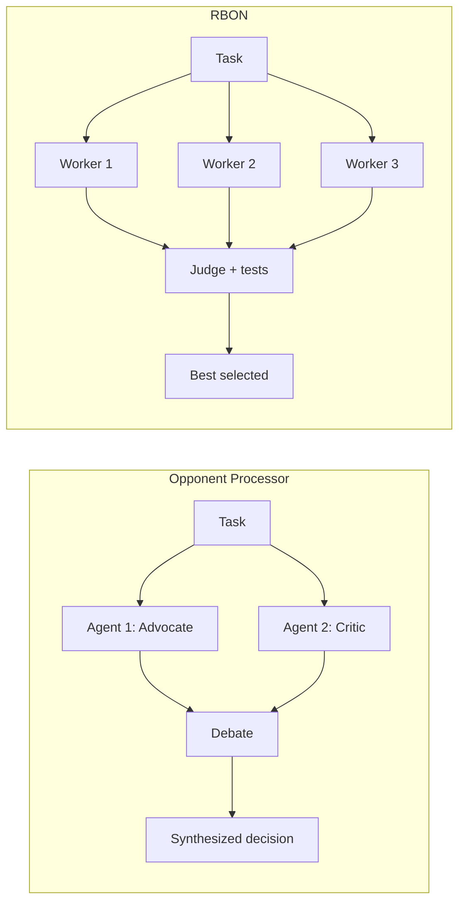

**Pattern hybrid**: Can combine both - have opposing agents each spawn multiple candidates, then debate the best approaches.

## Supporting Patterns

### 1. Adaptive Sandbox Fan-Out Controller

**Relationship**: **RBON requires Adaptive Fan-Out for production viability**.

**Why it's needed**:
- Without adaptive fan-out, RBON could spawn unlimited sandboxes
- Adaptive controller determines optimal K based on early signals
- Prevents compute waste and provides early stopping

**Integration**:
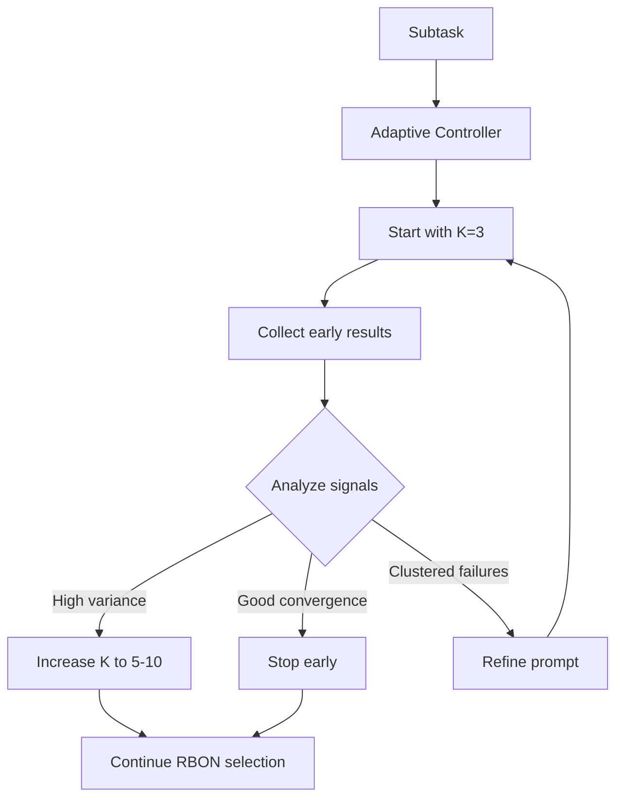

### 2. Variance-Based RL Sample Selection

**Relationship**: **Conceptual alignment on focusing compute where it matters**.

**Key insight**:
- **Variance-Based Selection**: Identify high-variance samples for training (model sometimes succeeds)
- **RBON**: Focus extra candidates on high-uncertainty subtasks

**Shared principle**: Don't waste compute on certain outcomes (always right/wrong), invest compute where uncertainty exists.

### 3. Anti-Reward-Hacking Grader Design

**Relationship**: **RBON's judge benefits from anti-reward-hacking techniques**.

**Why it matters**:
- RBON's judge scores determine winner selection
- If judge can be gamed, workers will exploit it
- Anti-reward-hacking patterns make judge more robust

**Integration**:
```python
class RobustJudge:
    def score_candidate(self, task, result):
        # Multi-criteria scoring (prevents gaming)
        scores = {
            'tests_pass': self.run_tests(result),
            'code_quality': self.lint_check(result),
            'spec_compliance': self.check_spec(result),
            'reasoning_trace': self.validate_trace(result)
        }

        # Check for gaming patterns
        if self.detect_gaming(result):
            return 0.0

        # Weighted aggregation
        return self.weighted_score(scores)
```

### 4. Graph of Thoughts (GoT)

**Relationship**: **RBON is a special case of GoT**.

**Connection**:
- **GoT**: Represents reasoning as a directed graph with arbitrary operations
- **RBON**: Implements a specific graph pattern (tree with selection at each level)

**Evolution path**:


**When to generalize to GoT**:
- When subtasks have interdependencies beyond simple hierarchy
- When results from different branches need to be merged
- When backtracking and refinement across branches is valuable

## Pattern Decision Guide

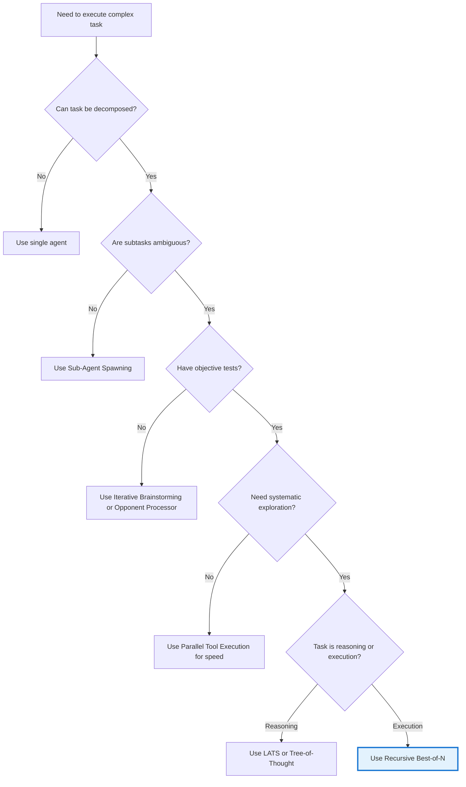

## Pattern Composition Examples

### 1. RBON + Plan-Then-Execute + Factory Model

**Use case**: Large-scale framework migration

```yaml
workflow:
  # Plan phase (human reviewed)
  planning:
    mode: plan_then_execute
    generate_migration_plan: true
    human_review_required: true

  # Factory model for parallelism
  orchestration:
    mode: factory
    concurrent_agents: 10
    check_in_interval: 60min

  # RBON for reliability
  execution:
    mode: recursive_best_of_n
    per_module:
      parallel_candidates: 3
      judge:
        - automated_tests
        - type_check
        - lint_check
        - llm_review
      adaptive_k:
        enabled: true
        variance_threshold: 0.3
        max_k: 5
```

### 2. RBON + Planner-Worker + Adaptive Fan-Out

**Use case**: Multi-week autonomous coding project

```yaml
project:
  # Hierarchical structure
  structure: planner_worker
  planners:
    count: 3
    model: gpt-5.2-planning
  workers:
    max_concurrent: 100
    model: gpt-5.1-codex

  # RBON at worker level
  worker_execution:
    mode: recursive_best_of_n
    default_k: 2

  # Adaptive resource control
  resource_management:
    mode: adaptive_fanout
    start_k: 2
    max_k: 5
    early_stopping:
      confidence_threshold: 0.8
      test_pass_required: true
    budget_caps:
      max_sandboxes: 1000
      max_runtime_per_task: 30min
```

### 3. RBON + Reflection Loop + Self-Critique Evaluator

**Use case**: High-stakes code generation (security, financial)

```yaml
critical_task:
  generation:
    mode: recursive_best_of_n
    parallel_candidates: 5

  # Apply reflection to top candidates
  refinement:
    mode: reflection_loop
    apply_to: top_3_candidates
    max_iterations: 2
    criteria:
      - correctness
      - security_scan
      - performance
      - maintainability

  # Use robust judge
  evaluation:
    mode: self_critique_evaluator
    anti_gaming:
      enabled: true
      violation_patterns:
        - test_evasion
        - circular_reasoning
        - missing_citations
    multi_criteria:
      correctness: 0.5
      reasoning_quality: 0.2
      completeness: 0.15
      citations: 0.10
      formatting: 0.05
```

## Summary Table

| Pattern | Relationship | Key Integration Point |
|---------|-------------|---------------------|
| **Tree-of-Thought** | Extends | RBON adds best-of-N selection to thought tree |
| **LATS** | Simplifies | RBON uses simpler selection vs MCTS |
| **Sub-Agent Spawning** | Specializes | RBON spawns K agents per subtask |
| **Plan-Then-Execute** | Complements | RBON handles reliable execution |
| **Planner-Worker** | Complements | RBON improves worker reliability |
| **Factory over Assistant** | Aligns | RBON reduces need for human intervention |
| **Reflection Loop** | Complements | Refine top candidates before selection |
| **Self-Critique Evaluator** | Uses | Provides judge mechanism |
| **Parallel Tool Execution** | Competes | Different approach to parallelism |
| **Iterative Brainstorming** | Competes | Ideation vs selection focus |
| **Opponent Processor** | Competes | Adversarial vs independent competition |
| **Adaptive Fan-Out** | Requires | Controls compute in RBON |
| **Variance-Based Selection** | Aligns | Focus compute where uncertainty exists |
| **Anti-Reward-Hacking** | Benefits | Makes judge more robust |
| **Graph of Thoughts** | Generalizes to | RBON as specific GoT instance |
