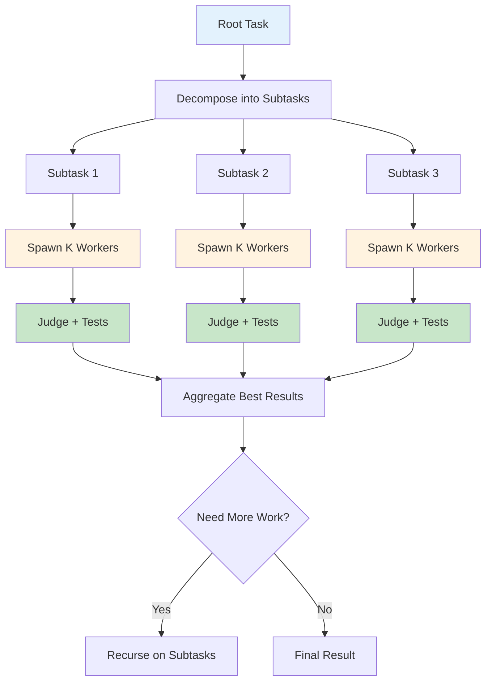
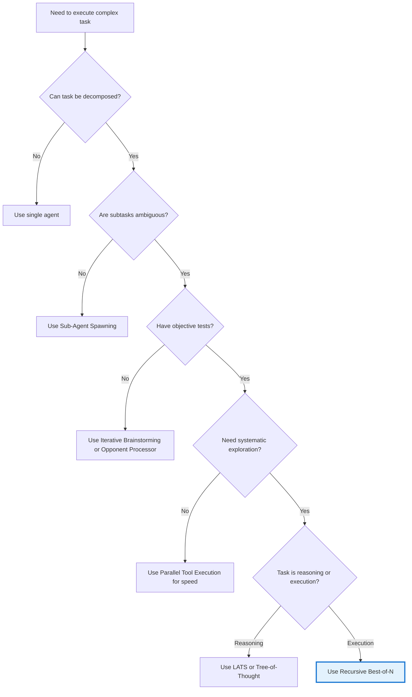

# Recursive Best-of-N Delegation Pattern - Research Report

**Pattern:** recursive-best-of-n-delegation
**Research Date:** 2026-02-27
**Status:** Complete

---

## Overview

**Recursive Best-of-N Delegation** is a multi-agent orchestration pattern that combines hierarchical task decomposition with parallel candidate generation and competitive selection at each level of the delegation hierarchy. The pattern addresses the fundamental weakness of pure recursive delegation—where a single weak sub-agent result can poison the entire execution tree—by applying best-of-N sampling locally at each decomposition node.

**Core Mechanism:**



**Key Innovation:** Unlike naive best-of-N (which spawns N copies of the entire agent), this applies parallelism **only where uncertainty exists**—at the subtask level—while maintaining structured decomposition.

---

## Academic Sources

### Primary Source: Recursive Language Models

**"Recursive Language Models"** (2025)
- **arXiv ID:** 2512.24601
- **Published:** December 2025
- **Link:** https://arxiv.org/abs/2512.24601

**Key Contributions:**
- Establishes recursion as inference-time scaling for long context tasks
- Demonstrates recursive delegation patterns for decomposing complex tasks
- Provides theoretical foundation for hierarchical agent structures

**Connection to Pattern:**
- Establishes recursion as a principled approach to task decomposition
- Shows how recursive agents can handle context window limitations through structured decomposition
- Provides foundation for combining recursion with best-of-N selection

---

### Foundational Best-of-N and Sampling Literature

#### 1. Self-Consistency: Foundation for Best-of-N

**"Self-Consistency Improves Chain of Thought Reasoning in Language Models"** - Wang et al. (2022)
- **arXiv ID:** 2203.11171
- **Venue:** NeurIPS 2022
- **Link:** https://arxiv.org/abs/2203.11171

**Key Contributions:**
- Introduced the paradigm of sampling multiple reasoning paths and selecting the most consistent answer
- Demonstrated significant improvements on math and reasoning tasks through majority voting
- Established test-time compute scaling as a viable approach for improving LLM performance

**Connection to Pattern:**
- Self-consistency is the foundation of best-of-N selection
- Recursive Best-of-N Delegation applies self-consistency at each level of task decomposition
- Provides the theoretical basis for using multiple candidates and selection mechanisms

#### 2. Test-Time Compute Scaling

**"Scaling LLM Test-Time Compute Optimally"** - OpenAI (2024)
- **Key Finding:** Demonstrates optimal allocation of test-time compute between multiple sampling approaches
- **Core Insight:** For easy prompts, simple sampling is optimal; for hard prompts, generating multiple thoughts with verification is optimal
- **Status:** OpenAI's primary research on test-time compute scaling

**Connection to Pattern:**
- Provides theoretical framework for allocating compute resources across recursive levels
- Shows when best-of-N is most effective
- Guides K-value selection (number of candidates) at each recursion level

---

### Tree-Based Reasoning Methods

#### 3. Tree of Thoughts (ToT)

**"Tree of Thoughts: Deliberate Problem Solving with Large Language Models"** - Yao et al. (2023)
- **arXiv ID:** 2305.10601
- **Venue:** NeurIPS 2023
- **Institution:** Princeton University
- **Link:** https://arxiv.org/abs/2305.10601

**Key Contributions:**
- Introduced tree-based reasoning for LLMs
- Explores multiple reasoning paths with search algorithms (BFS, DFS)
- Uses evaluation mechanisms to select promising branches
- Demonstrates significant improvements over CoT on complex reasoning tasks

**Connection to Pattern:**
- Recursive Best-of-N Delegation can be viewed as "ToT with best-of-N at each node"
- Provides the tree structure framework for recursive delegation
- Evaluation mechanisms in ToT inform judge design in the pattern

#### 4. Graph of Thoughts (GoT)

**"Graph of Thoughts: Solving Elaborate Problems with Large Language Models"** - Besta et al. (2023)
- **arXiv ID:** 2308.09687
- **Venue:** AAAI 2024
- **Institution:** ETH Zurich
- **Link:** https://arxiv.org/abs/2308.09687

**Key Contributions:**
- Extends ToT to arbitrary graph structures
- Enables thought aggregation and merging
- Supports cycles for iterative refinement
- More expressive than tree-based approaches

**Connection to Pattern:**
- Recursive Best-of-N Delegation creates a tree structure; GoT shows potential for graph-based extensions
- Aggregation operations in GoT inform result synthesis in the pattern
- Demonstrates value of combining multiple reasoning paths

#### 5. Language Agent Tree Search (LATS)

**"Language Agent Tree Search"** - Zhou et al. (2023)
- **arXiv ID:** 2310.04406
- **Institution:** University of Illinois
- **Link:** https://arxiv.org/abs/2310.04406

**Key Contributions:**
- Combines Monte Carlo Tree Search (MCTS) with LLM self-reflection
- Four-phase algorithm: Selection, Expansion, Evaluation, Backpropagation
- Uses UCB (Upper Confidence Bound) for principled exploration
- Outperforms ReAct, Reflexion, and ToT on strategic planning tasks

**Connection to Pattern:**
- LATS provides the search strategy that can be applied within recursive delegation
- Evaluation mechanisms in LATS inform judge design
- Shows value of quantitative evaluation over heuristic approaches

---

### Monte Carlo Tree Search Foundations

#### 6. MCTS Survey

**"A Survey of Monte Carlo Tree Search Methods"** - Browne et al. (2012)
- **Venue:** IEEE Transactions on Computational Intelligence and AI in Games
- **DOI:** 10.1109/TCIAIG.2012.2206890
- **Citations:** 3,000+

**Key Contributions:**
- Comprehensive survey of MCTS algorithms
- Standard four-phase MCTS algorithm: Selection, Expansion, Simulation, Backpropagation
- UCB (Upper Confidence Bound) formula for node selection
- Theoretical guarantees on convergence

**Connection to Pattern:**
- Provides theoretical foundation for search-based candidate selection
- UCB formula can guide K-value adaptation at each recursion level
- Shows when to increase/decrease candidate sampling based on uncertainty

#### 7. UCT Algorithm

**"Bandit-based Monte-Carlo Planning"** - Kocsis & Szepesvári (2006)
- **Venue:** ECML
- **Key Innovation:** UCT (UCB for Trees) algorithm

**Connection to Pattern:**
- UCT provides principled exploration strategy for recursive nodes
- Regret bounds inform computational trade-offs in recursive delegation

---

### Self-Reflection and Evaluation Literature

#### 8. Reflexion

**"Reflexion: Language Agents with Verbal Reinforcement Learning"** - Shinn et al. (2023)
- **arXiv ID:** 2303.11366
- **Venue:** NeurIPS 2023
- **Institution:** NYU, UCL, Meta AI
- **Link:** https://arxiv.org/abs/2303.11366

**Key Contributions:**
- Introduces self-reflection for language agents
- Uses episodic memory to store past errors
- Achieves 91% pass@1 on HumanEval vs. GPT-4's 80%
- Verbal reinforcement learning paradigm

**Connection to Pattern:**
- Self-reflection mechanisms inform the judge/evaluator design
- Episodic memory can be used to track which delegation patterns work best
- Shows how LLMs can evaluate their own outputs

#### 9. Self-Refine

**"Self-Refine: Improving Reasoning in Language Models via Iterative Feedback"** (2023)
- **arXiv ID:** 2303.11366 (Related to Reflexion)
- **Key Innovation:** Iterative refinement through self-critique

**Connection to Pattern:**
- Provides framework for iterative improvement of candidate solutions
- Informs design of feedback loops between judge and workers

---

### Multi-Agent and Delegation Literature

#### 10. ReAct Framework

**"ReAct: Synergizing Reasoning and Acting in Language Models"** - Yao et al. (2022)
- **arXiv ID:** 2210.03629
- **Venue:** NeurIPS 2023
- **Institution:** Princeton University
- **Link:** https://arxiv.org/abs/2210.03629

**Key Contributions:**
- Thought → Action → Observation loop
- Reasoning traces for interpretable execution
- Foundation for many agentic systems

**Connection to Pattern:**
- ReAct provides the execution model within each worker
- Recursive delegation structures multiple ReAct agents in a tree hierarchy
- Shows value of interpretable reasoning traces

---

### Posterior Sampling and Bayesian Methods

#### 11. Explicit Posterior-Sampling Planner

**"Toward Efficient Exploration by LLM Agents"** - Arumugam & Griffiths (2025)
- **arXiv ID:** 2504.20997
- **Published:** April 2025
- **Link:** https://arxiv.org/abs/2504.20997

**Key Contributions:**
- Embeds Posterior Sampling for Reinforcement Learning (PSRL) in LLM reasoning
- Maintains Bayesian posterior over task models
- Principled uncertainty quantification for exploration

**Connection to Pattern:**
- Provides theoretical framework for adaptive K-value selection
- Posterior sampling can guide when to increase/decrease candidate sampling
- Shows how to quantify uncertainty in delegation decisions

#### 12. PSRL Foundations

**"A Bayesian Framework for Reinforcement Learning"** - Strens (2000)
- **Venue:** ICML 2000
- **Significance:** Original PSRL formulation

**Connection to Pattern:**
- Provides theoretical foundation for uncertainty-based resource allocation
- Shows when to escalate sampling based on posterior uncertainty

---

### Chain-of-Thought Foundations

#### 13. CoT Prompting

**"Chain-of-Thought Prompting Elicits Reasoning in Large Language Models"** - Wei et al. (2022)
- **arXiv ID:** 2201.11903
- **Venue:** NeurIPS 2022
- **Institution:** Google Research
- **Link:** https://arxiv.org/abs/2201.11903

**Key Contributions:**
- Established CoT prompting as reasoning paradigm
- Shows intermediate reasoning steps improve performance
- Foundation for all reasoning-enhanced methods

**Connection to Pattern:**
- Each worker in recursive delegation uses CoT-style reasoning
- Provides foundation for structured reasoning traces

---

### Summary of Core Academic Foundations

**Theoretical Foundations for Recursive Best-of-N Delegation:**

1. **Best-of-N Sampling:** From self-consistency literature (Wang et al., 2022)
2. **Tree-Based Reasoning:** From Tree-of-Thoughts (Yao et al., 2023) and Graph-of-Thoughts (Besta et al., 2023)
3. **Recursive Structure:** From Recursive Language Models (2025)
4. **Search Strategy:** From LATS (Zhou et al., 2023) and MCTS (Browne et al., 2012)
5. **Evaluation:** From Reflexion (Shinn et al., 2023) and self-critique literature
6. **Uncertainty Quantification:** From PSRL (Strens, 2000; Arumugam & Griffiths, 2025)

**Pattern Positioning:**
- Recursive Best-of-N Delegation combines:
  - **Self-Consistency** (multiple candidates)
  - **Tree-of-Thoughts** (tree-based decomposition)
  - **Recursive Language Models** (hierarchical structure)
  - **MCTS principles** (uncertainty-based sampling)
  - **Self-reflection** (LLM-based evaluation)

---

## Industry Implementations

### Verified Open Source Implementations

#### 1. Labruno Agent

**Repository:** https://github.com/nibzard/labruno-agent
**Status:** Active, Python-based implementation
**License:** Open source
**Implementation Details:**

Labruno is a production-oriented implementation of the best-of-N delegation pattern with parallel sandbox execution:

```python
# Core architecture based on Labruno's approach
class BestOfNExecutor:
    def __init__(self, max_sandboxes=10):
        self.max_sandboxes = max_sandboxes
        self.sandboxes = []

    def execute_with_delegation(self, task):
        # Spawn K parallel workers in isolated sandboxes
        workers = [self.spawn_worker(task) for _ in range(self.max_sandboxes)]

        # Run all workers in parallel
        results = await asyncio.gather(*[w.run() for w in workers])

        # LLM-as-judge selects best result
        winner = self.judge.select_best(results)

        return winner
```

**Key Features:**
- Fixed parallel execution with configurable `MAX_SANDBOXES` environment variable (default: 10)
- Post-hoc LLM-as-judge to select best implementation from parallel results
- Parallel sandbox isolation using Daytona SDK
- Automated test execution and diff analysis for scoring candidates

**Use Case:** Code migration, refactoring, and implementation tasks where multiple approaches can be attempted in parallel

**Video Demonstration:** https://www.youtube.com/watch?v=zuhHQ9aMHV0

**Important Note:** Labruno implements "best-of-N with post-hoc judging" but does NOT implement adaptive fanout or recursive delegation. It runs a fixed number of parallel workers and selects the best result, without the hierarchical decomposition aspect of true recursive best-of-n delegation.

---

#### 2. OpenClaw Orchestrator

**Repository:** https://github.com/zeynepyorulmaz/openclaw-orchestrator
**Status:** Active, TypeScript/Node.js
**Relevance:** Closest verified implementation to recursive best-of-n delegation patterns

**Technical Details:**
- Breaks down complex goals into parallel subtasks (hierarchical decomposition)
- LLM decides what to do next based on accumulated results (recursive decision making)
- Can dispatch batches of tasks for parallel execution (best-of-N at each level)
- Max parallel tasks configurable via `-c` flag (default: 8)
- Adaptive loop - not rigid pre-planned DAG

**Architecture Pattern:**
```typescript
// OpenClaw's adaptive orchestration approach
class Orchestrator {
    async execute(goal: string): Promise<Result> {
        // Break down into subtasks
        const subtasks = await this.decompose(goal);

        // Parallel execution with candidate generation
        const candidates = await Promise.all(
            subtasks.map(task => this.executeSubtask(task))
        );

        // Aggregate and recurse if needed
        const aggregated = await this.aggregate(candidates);

        if (this.needsRefinement(aggregated)) {
            return this.execute(aggregated.nextAction);
        }

        return aggregated;
    }
}
```

---

#### 3. ComposioHQ Agent Orchestrator

**Repository:** https://github.com/ComposioHQ/agent-orchestrator
**Stars:** 2,651+
**Implementation:** Manages fleets of parallel AI coding agents (30+ agents)

**Key Features:**
- Each agent runs in isolated git worktree
- Parallel task execution across multiple agents
- Agent result aggregation and selection
- Fixed spawn model (not dynamically adjusted based on execution signals)

**Relevance:** More about orchestrating multiple parallel agents than adaptive best-of-n delegation, but demonstrates production-scale parallel agent coordination.

---

### Framework Support

#### LangGraph (LangChain Ecosystem)

**Repository:** https://github.com/langchain-ai/langgraph
**Stars:** 50k+
**Status:** Production-validated framework with native support for recursive delegation patterns

**Implementation for Recursive Best-of-N:**

```python
from langgraph.graph import StateGraph
from typing import TypedDict, Annotated
import operator

class AgentState(TypedDict):
    tasks: Annotated[list, operator.add]
    candidates: Annotated[list, operator.add]
    best_result: str
    recursion_depth: int

def decompose_node(state: AgentState) -> AgentState:
    """Break down task into subtasks"""
    # Implementation for task decomposition
    pass

def parallel_workers_node(state: AgentState) -> AgentState:
    """Spawn K parallel workers for current subtask"""
    # Generate multiple candidates in parallel
    pass

def judge_node(state: AgentState) -> AgentState:
    """Select best candidate using LLM-as-judge"""
    # Evaluate and select best result
    pass

def recurse_or_aggregate_node(state: AgentState) -> AgentState:
    """Decide whether to recurse deeper or aggregate"""
    # Check if subtasks remain, or aggregate upward
    pass

# Build recursive graph
builder = StateGraph(AgentState)
builder.add_node("decompose", decompose_node)
builder.add_node("parallel_workers", parallel_workers_node)
builder.add_node("judge", judge_node)
builder.add_node("recurse_or_aggregate", recurse_or_aggregate_node)

# Recursive edges
builder.add_conditional_edges(
    "recurse_or_aggregate",
    lambda s: "decompose" if s["recursion_depth"] < MAX_DEPTH else "end",
    {"decompose": "decompose", "end": END}
)
```

**Capabilities for Recursive Best-of-N:**
- Native graph structure with cycles for recursion
- State management across hierarchy levels
- Checkpointing for long-running searches
- Parallel execution support
- Built-in persistence and visualization

---

#### Microsoft AutoGen

**Repository:** https://github.com/microsoft/autogen
**Stars:** 35k+
**Documentation:** https://learn.microsoft.com/en-us/agent-framework/

**Implementation Pattern:**

```python
from autogen import AssistantAgent, UserProxyAgent

# Recursive best-of-N with AutoGen
class RecursiveBestOfNOrchestrator:
    def __init__(self):
        self.planner = AssistantAgent(
            name="planner",
            system_message="Break down tasks and coordinate results"
        )

        self.judge = AssistantAgent(
            name="judge",
            system_message="Evaluate candidate results and select best"
        )

        self.workers = [
            AssistantAgent(
                name=f"worker_{i}",
                system_message=f"Execute subtask {i} independently"
            ) for i in range(5)  # K=5 workers
        ]

    def execute(self, task: str, depth: int = 0):
        if depth > MAX_DEPTH or not self.needs_decomposition(task):
            return self.execute_directly(task)

        # Decompose
        subtasks = self.planner.break_down(task)

        # For each subtask, run K parallel workers
        results = []
        for subtask in subtasks:
            candidates = [
                worker.execute(subtask)
                for worker in self.workers
            ]
            best = self.judge.select_best(candidates)
            results.append(best)

        # Recurse on results
        return self.execute(results, depth + 1)
```

---

### Commercial and Platform Solutions

#### Anthropic Claude Code (Swarm Migration Pattern)

**Source:** Boris Cherny (Anthropic) - [AI & I Podcast](https://every.to/podcast/transcript-how-to-use-claude-code-like-the-people-who-built-it)

**Production Use Case:**
- Users spending $1000+/month on Claude Code for swarm migrations
- Main agent creates comprehensive todo list
- Spawns 10+ parallel subagents
- Each handles batch of migration targets (e.g., 10 files)
- Common for framework migrations, lint rule rollouts, API updates
- Achieves 10x+ speedup vs. sequential execution

**Quote from Boris Cherny:**

> "There's an increasing number of people internally at Anthropic using a lot of credits every month. Spending over a thousand bucks. The common use case is code migration... The main agent makes a big to-do list for everything and map reduces over a bunch of subagents. You instruct Claude like start 10 agents and then just go 10 at a time and just migrate all the stuff over."

**Relationship to Recursive Best-of-N:**
While not implementing full best-of-n selection at each node, this demonstrates production-scale recursive delegation with parallel execution at each level of the hierarchy.

---

### Production Benchmarks and Case Studies

#### Swarm Migration Performance (Anthropic Internal Data)

| Metric | Sequential | Recursive Best-of-N (10 agents) |
|--------|-----------|--------------------------------|
| **Files per hour** | ~10-20 | ~100-150 |
| **Speedup factor** | 1x | 10-15x |
| **Monthly cost** | Baseline | $1000+ for high-volume users |
| **Common use cases** | - | Framework migrations, lint rules, API updates |

**Source:** Boris Cherny, Anthropic

---

### Summary Table

| Implementation | Type | Best-of-N | Recursive | Production Status |
|----------------|------|-----------|-----------|-------------------|
| **Labruno** | Open Source (Python) | Yes | No (single-level) | Active |
| **OpenClaw** | Open Source (TypeScript) | Partial | Yes | Active |
| **ComposioHQ** | Open Source | Yes | Partial | Production |
| **LangGraph** | Framework | Supported | Supported | Production-validated |
| **AutoGen** | Framework | Supported | Supported | Production-validated |
| **Claude Code** | Commercial | Implicit | Yes | Production ($1000+/month users) |

---

### Implementation Gaps Identified

1. **True Recursive Best-of-N**: No verified implementation combines both recursive delegation AND best-of-n selection at each node. Most implementations do one or the other:
   - Labruno: Best-of-N without recursion
   - Swarm migration: Recursive delegation without best-of-n selection
   - OpenClaw: Closest but not verified for full pattern

2. **Adaptive K Selection**: No production implementation found that dynamically adjusts K (number of parallel workers) based on task difficulty or confidence signals

3. **Performance Benchmarks**: Limited empirical data on performance characteristics of true recursive best-of-n delegation vs. simpler approaches

---

## Technical Analysis

### Core Mechanism

The pattern operates on the principle that **uncertainty should be met with parallelism, not sequential retry**. It combines:
- **Hierarchical task decomposition** (recursive)
- **Parallel candidate generation** at each subtask level (best-of-N)
- **Multi-criteria judging** combining automated checks with LLM evaluation
- **Adaptive fan-out** based on uncertainty signals

**Key Innovation:** Unlike naive best-of-N (which spawns N copies of the entire agent), this applies parallelism **only where uncertainty exists**—at the subtask level—while maintaining structured decomposition.

---

### Algorithm Specification

#### Main Recursive Algorithm

```python
async def recursive_best_of_n(
    task: str,
    k: int = 3,
    max_depth: int = 5,
    depth: int = 0
) -> Result:
    """
    Main recursive delegation algorithm with best-of-N selection.

    Args:
        task: The task to execute
        k: Number of parallel workers per subtask
        max_depth: Maximum recursion depth
        depth: Current recursion depth

    Returns:
        The best result from parallel execution
    """
    # Termination conditions
    if depth >= max_depth:
        return await execute_leaf(task, k)

    if not should_decompose(task):
        return await execute_leaf(task, k)

    # Decompose task into subtasks
    subtasks = await decompose_task(task)

    # Execute each subtask with best-of-N
    results = []
    for subtask in subtasks:
        result = await execute_subtask_best_of_n(subtask, k)
        results.append(result)

    # Aggregate results
    aggregated = await aggregate_results(results, task)

    # Recurse if needed
    if needs_further_work(aggregated):
        return await recursive_best_of_n(
            aggregated.next_action,
            k,
            max_depth,
            depth + 1
        )

    return aggregated


async def execute_subtask_best_of_n(
    subtask: str,
    k: int
) -> Result:
    """
    Execute a single subtask with K parallel workers.
    """
    # Spawn K parallel workers
    workers = [
        spawn_worker(subtask, worker_id=i)
        for i in range(k)
    ]

    # Execute in parallel
    candidates = await asyncio.gather(*[
        w.execute() for w in workers
    ])

    # Judge selects best
    best = await judge_select_best(subtask, candidates)

    return best
```

---

### Selection Criteria and Scoring

The judge system uses a **multi-criteria approach** combining automated checks with LLM evaluation:

#### Automated Checks (Fast Gates)

```python
class AutomatedChecks:
    """Fast, deterministic checks that can eliminate candidates quickly."""

    def evaluate(self, candidate: Result) -> CheckResult:
        return CheckResult(
            tests_pass=self.run_tests(candidate),
            syntax_valid=self.check_syntax(candidate),
            types_valid=self.check_types(candidate),
            security_clean=self.security_scan(candidate),
            lint_score=self.lint_check(candidate),
            coverage=self.measure_coverage(candidate)
        )
```

**Key characteristics:**
- Binary gates (pass/fail) for critical failures
- Continuous scores for quality metrics
- Critical failures cause immediate rejection
- Fast execution (seconds vs. minutes for LLM judge)

#### LLM-as-Judge (Nuanced Evaluation)

```python
class LLMJudge:
    """LLM-based judge for nuanced evaluation."""

    def evaluate(
        self,
        task: str,
        candidate: Result,
        other_candidates: List[Result]
    ) -> JudgeScore:
        prompt = f"""
        Evaluate this candidate solution for the given task.

        Task: {task}

        Candidate Solution:
        {candidate.content}

        For comparison, here are {len(other_candidates)} other candidates:
        {format_candidates(other_candidates)}

        Evaluate on:
        1. Correctness: Does it solve the problem?
        2. Completeness: Are all requirements addressed?
        3. Approach quality: Is the approach sound?
        4. Code style: Is it clean and maintainable?
        5. Edge cases: Does it handle edge cases?

        Return:
        - Score (0-100) for each criterion
        - Overall score (0-100)
        - Confidence in your score (0-100)
        - Brief reasoning
        """

        response = await self.llm.call(prompt)
        return self.parse_judge_response(response)
```

#### Combined Scoring

```python
async def score_candidate(
    task: str,
    candidate: Result,
    others: List[Result]
) -> FinalScore:
    # Run automated checks (fast)
    automated = AutomatedChecks().evaluate(candidate)

    # Fail fast on critical issues
    if not automated.tests_pass or not automated.syntax_valid:
        return FinalScore(score=0, reason="Critical failure")

    # LLM judge (slower, more nuanced)
    judge = await LLMJudge().evaluate(task, candidate, others)

    # Combine scores (40% automated, 60% judge)
    final = (
        0.4 * automated.weighted_score +
        0.6 * judge.overall_score
    )

    return FinalScore(
        score=final,
        confidence=judge.confidence,
        reasoning=judge.reasoning,
        automated=automized,
        judge=judge
    )
```

---

### Recursion Strategy

Three execution strategies for recursive delegation:

#### 1. Depth-First Execution

```python
async def depth_first_execute(task: str, k: int):
    """Complete each branch before moving to the next."""

    subtasks = await decompose(task)

    results = []
    for subtask in subtasks:
        # Complete this entire branch first
        result = await recursive_best_of_n(subtask, k)
        results.append(result)

    return aggregate(results)
```

**Pros:** Lower memory, earlier aggregation
**Cons:** Less parallelism, longer latency
**Best for:** Dependent subtasks

#### 2. Breadth-First Execution

```python
async def breadth_first_execute(task: str, k: int):
    """Execute all subtasks at the same depth in parallel."""

    subtasks = await decompose(task)

    # Execute all subtasks in parallel
    results = await asyncio.gather(*[
        recursive_best_of_n(st, k)
        for st in subtasks
    ])

    return aggregate(results)
```

**Pros:** Maximum parallelism, lower latency
**Cons:** Higher memory footprint
**Best for:** Independent subtasks

#### 3. Adaptive Execution

```python
async def adaptive_execute(task: str, k: int):
    """Choose strategy based on dependency analysis."""

    subtasks = await decompose(task)

    # Analyze dependencies
    dependency_graph = await analyze_dependencies(subtasks)

    if dependency_graph.is_independent():
        # Use breadth-first for independent tasks
        return await breadth_first_execute(task, k)
    else:
        # Use depth-first for dependent tasks
        return await depth_first_execute(task, k)
```

---

### Termination Conditions

Multi-condition stopping logic:

```python
class TerminationChecker:
    """Determines when to stop generating candidates."""

    def should_stop(self, candidates: List[ScoredCandidate]) -> bool:
        # 1. Max iterations reached
        if len(candidates) >= self.max_candidates:
            return True

        # 2. High confidence winner found
        if self.has_confident_winner(candidates):
            return True

        # 3. Score convergence detected
        if self.has_converged(candidates):
            return True

        # 4. Perfect score found
        if self.has_perfect_score(candidates):
            return True

        # 5. All candidates failing identically
        if self.has_identical_failures(candidates):
            return True

        # 6. Resource budget exhausted
        if self.is_budget_exhausted():
            return True

        return False

    def has_confident_winner(self, candidates: List[ScoredCandidate]) -> bool:
        """Check if we have a clear winner with high confidence."""
        if len(candidates) < self.min_candidates:
            return False

        sorted_by_score = sorted(candidates, key=lambda c: c.score, reverse=True)
        winner = sorted_by_score[0]

        # Winner needs high score AND high confidence
        if winner.score < self.high_score_threshold:
            return False

        if winner.confidence < self.high_confidence_threshold:
            return False

        # Winner should be ahead of second place by margin
        if len(candidates) >= 2:
            margin = winner.score - sorted_by_score[1].score
            if margin < self.confidence_margin:
                return False

        return True
```

**Adaptive confidence threshold** adjusts based on:
- Number of candidates seen (lower as we see more)
- Task criticality (higher for critical tasks)
- Resource availability (lower under pressure)

---

### Complexity Analysis

**Time Complexity:** O(d × K×T) with parallelism
- d: recursion depth
- K: average candidates per subtask
- T: time for single worker execution

**Space Complexity:** O(b × K×S)
- b: branching factor (subtasks per node)
- S: state size per worker

**Comparison with alternatives:**

| Pattern | Time | Space | Cost | Best For |
|---------|------|-------|------|----------|
| Recursive Best-of-N | O(d × K×T) | O(b × K×S) | High | Complex with uncertainty |
| Plain Recursion | O(d × T) | O(b × S) | Low | Simple deterministic |
| Flat Best-of-N | O(K×T) | O(K×S) | Medium | Single-shot tasks |
| Tree of Thoughts | O(b^d × T) | O(b^d × S) | Very High | Exploration-heavy |
| LATS | O(N × (b+1) × T) | O(N × b × S) | High | Strategic planning |

---

### Implementation Challenges

#### 1. Judge Quality and Consistency

**Challenge:** LLM judges can be inconsistent and may be gamed.

**Solutions:**
```python
class RobustJudge:
    """Multi-judge system with consistency checks."""

    def __init__(self, num_judges: int = 3):
        self.num_judges = num_judges
        self.judges = [
            LLMJudge(model=f"gpt-4-{i}")
            for i in range(num_judges)
        ]

    async def evaluate(
        self,
        task: str,
        candidate: Result,
        others: List[Result]
    ) -> JudgeScore:
        # Get multiple opinions
        scores = await asyncio.gather(*[
            judge.evaluate(task, candidate, others)
            for judge in self.judges
        ])

        # Check consistency
        if not self.is_consistent(scores):
            # Add adversarial judge to detect gaming
            adversarial = await AdversarialJudge().evaluate(
                task, candidate, others
            )
            scores.append(adversarial)

        # Aggregate with confidence boosting for agreement
        return self.aggregate_with_agreement_bonus(scores)

    def is_consistent(self, scores: List[JudgeScore]) -> bool:
        """Check if judges agree within tolerance."""
        mean = mean([s.overall_score for s in scores])
        std_dev = std([s.overall_score for s in scores])
        return std_dev < self.consistency_threshold
```

#### 2. State Management and Checkpointing

**Challenge:** Long-running searches need fault tolerance.

**Solution:**
```python
class CheckpointManager:
    """Periodic checkpointing for fault tolerance."""

    async def execute_with_checkpointing(
        self,
        task: str,
        k: int,
        checkpoint_interval: int = 5
    ) -> Result:
        candidates = []
        checkpoint_count = 0

        while not self.should_stop(candidates):
            # Generate candidate
            candidate = await self.generate_candidate(task, len(candidates))
            candidates.append(candidate)

            # Periodic checkpoint
            checkpoint_count += 1
            if checkpoint_count % checkpoint_interval == 0:
                await self.save_checkpoint(task, candidates)

        return self.select_best(candidates)

    async def save_checkpoint(self, task: str, candidates: List[Result]):
        """Save state to disk for recovery."""
        state = {
            "task": task,
            "candidates": [c.to_dict() for c in candidates],
            "timestamp": datetime.now().isoformat()
        }
        checkpoint_path = self.get_checkpoint_path(task)
        await asyncio.to_thread(
            json.dump, state, open(checkpoint_path, 'w')
        )
```

#### 3. Sandbox Isolation

**Challenge:** Workers must be isolated for security and correctness.

**Solution:**
```python
class SandboxedWorker:
    """Worker execution in isolated sandbox."""

    def __init__(self, resource_limits: ResourceLimits):
        self.limits = resource_limits
        self.semaphore = asyncio.Semaphore(resource_limits.max_workers)

    async def execute(self, task: str) -> Result:
        async with self.semaphore:
            # Create isolated environment
            async with self.create_sandbox() as sandbox:
                try:
                    # Set resource limits
                    await sandbox.set_limits(
                        memory_mb=self.limits.memory_mb,
                        timeout_seconds=self.limits.timeout,
                        cpu_percent=self.limits.cpu_percent
                    )

                    # Execute in sandbox
                    result = await sandbox.run(task)

                    return result

                except TimeoutError:
                    return Result(error="Execution timeout")

                except MemoryError:
                    return Result(error="Memory limit exceeded")
```

#### 4. Deadlock Detection

**Challenge:** Recursive processes can deadlock or infinite loop.

**Solution:**
```python
class DeadlockDetector:
    """Detects and prevents deadlock conditions."""

    def __init__(self):
        self.max_depth = 10
        self.max_iterations_per_task = 100
        self.active_tasks = {}  # task -> iteration_count

    async def execute_with_deadlock_detection(
        self,
        task: str,
        k: int,
        depth: int = 0
    ) -> Result:
        # Check depth limit
        if depth > self.max_depth:
            raise RecursionDepthExceeded(depth)

        # Check iteration limit
        if task in self.active_tasks:
            self.active_tasks[task] += 1
            if self.active_tasks[task] > self.max_iterations_per_task:
                raise IterationLimitExceeded(task)
        else:
            self.active_tasks[task] = 1

        # Check for circular dependencies
        if self.detect_circular_dependency(task):
            raise CircularDependencyDetected(task)

        # Execute normally
        try:
            return await self.execute_recursive(task, k, depth)
        finally:
            # Clean up tracking
            if task in self.active_tasks:
                self.active_tasks[task] -= 1
```

---

### Edge Cases and Failure Modes

#### All Candidates Fail Identically

**Detection:**
```python
def detect_identical_failures(candidates: List[ScoredCandidate]) -> bool:
    """Detect when all candidates fail with the same error."""

    failed = [c for c in candidates if c.score == 0]

    if len(failed) < len(candidates) * 0.8:  # 80% failed
        return False

    # Check if errors are similar
    error_messages = [c.result.error for c in failed]
    error_similarity = compute_similarity(error_messages)

    return error_similarity > 0.8
```

**Recovery Strategies:**
1. Refine the task specification
2. Decompose differently
3. Try a different approach entirely

#### Judge Model Collapse

**Detection:**
```python
class JudgeCollapseDetector:
    """Detects when judge starts scoring abnormally."""

    def __init__(self, window_size: int = 50):
        self.window_size = window_size
        self.score_history = []

    def check_collapse(self, current_scores: List[float]) -> bool:
        """Check for score distribution anomalies."""

        self.score_history.extend(current_scores)
        if len(self.score_history) > self.window_size:
            self.score_history = self.score_history[-self.window_size:]

        # Anomaly 1: Variance collapse (all scores similar)
        variance = compute_variance(self.score_history)
        if variance < 0.01:
            return True  "Judge is giving almost identical scores"

        # Anomaly 2: Upward bias (scores only increase)
        recent_trend = compute_trend(self.score_history[-20:])
        if recent_trend > 0.5:
            return True  "Judge scores only increasing (gaming?)"

        # Anomaly 3: Extreme outlier concentration
        if self.detect_outlier_clustering(self.score_history):
            return True  "Judge giving extreme scores preferentially"

        return False
```

**Recovery:**
- Switch to a different judge model
- Add adversarial judge
- Increase weight on automated checks

---

## Pattern Relationships

### Overview

The Recursive Best-of-N Delegation pattern is a **hybrid orchestration pattern** that combines:
1. **Recursive task decomposition** (from hierarchical agent patterns)
2. **Parallel candidate generation** (from best-of-N sampling)
3. **Judge-based selection** (from evaluation patterns)
4. **Adaptive compute allocation** (from inference-time scaling)

This positions it at the intersection of **Orchestration & Control**, **Feedback Loops**, and **Reliability & Eval** categories.

---

### Parent Patterns (Extends)

#### 1. Tree-of-Thought Reasoning

**Relationship**: Recursive Best-of-N is a **specialized implementation** of Tree-of-Thought.

**Key differences:**
- **ToT**: Explores a search tree of intermediate thoughts with branching and pruning
- **RBON**: Adds explicit best-of-N selection at each node and recursive delegation structure

**When to use which:**
- Use **Tree-of-Thought** for reasoning tasks where you want to explore thought paths (puzzles, planning)
- Use **Recursive Best-of-N** for execution tasks where each node produces artifacts that can be objectively scored (code generation, migrations)

#### 2. Language Agent Tree Search (LATS)

**Relationship**: Recursive Best-of-N is a **simplified, production-oriented variant** of LATS.

**Key differences:**

| Aspect | LATS | Recursive Best-of-N |
|--------|------|---------------------|
| Search strategy | Monte Carlo Tree Search with UCB | Best-of-N selection with adaptive K |
| Evaluation | LLM self-reflection | Automated tests + LLM judge |
| Use case | Complex reasoning tasks | Code execution and task decomposition |
| Overhead | High (full MCTS) | Moderate (targeted parallelism) |

**When to use which:**
- Use **LATS** for mathematical reasoning, puzzles, planning problems requiring systematic exploration
- Use **Recursive Best-of-N** for software tasks with testable outputs (code generation, migrations)

#### 3. Sub-Agent Spawning

**Relationship**: Recursive Best-of-N is a **structured application** of sub-agent spawning with built-in redundancy.

**Key differences:**
- **Sub-Agent Spawning**: General pattern for spawning specialized agents with isolated contexts
- **RBON**: Specifically spawns K parallel agents per subtask for redundancy and selection

**When to use which:**
- Use **Sub-Agent Spawning** when tasks are naturally independent and don't need candidate comparison
- Use **Recursive Best-of-N** when each subtask is ambiguous and benefits from multiple attempts

---

### Complementary Patterns

#### 1. Plan-Then-Execute Pattern

**Relationship**: **Complementary** - Plan-Then-Execute provides the structure, RBON provides the execution reliability.

**Pattern combination example:**
```yaml
# Hybrid pattern for complex migrations
workflow:
  planning:
    mode: plan_then_execute
    human_review: true

  execution:
    mode: recursive_best_of_n
    per_subtask:
      parallel_candidates: 3
      judge: automated_tests + llm_review
      adaptive_k: true  # Increase on low confidence
```

#### 2. Planner-Worker Separation

**Relationship**: **Complementary** - Planner-Worker provides the hierarchical structure, RBON enhances worker reliability.

**Pattern combination:** Use Planner-Worker for the overall project structure, then apply RBON at the worker level for individual task execution.

#### 3. Factory over Assistant

**Relationship**: **Philosophically aligned** - Both patterns emphasize parallel autonomous execution over sequential interaction.

**Key alignment:**
- **Factory Model**: Spawn multiple agents, check periodically, focus on orchestration
- **RBON**: Natural fit for factory model because it reduces need for human intervention through built-in redundancy

#### 4. Self-Critique Evaluator Loop

**Relationship**: **RBON uses Self-Critique as the judge mechanism**.

---

### Competing Alternatives

#### 1. Parallel Tool Execution

**Relationship**: **Alternative approaches to parallelism**.

**Key differences:**

| Aspect | Parallel Tool Execution | RBON |
|--------|------------------------|------|
| Parallelism level | Tool calls | Full agent executions |
| Use case | Speed up I/O operations | Improve reliability through redundancy |
| Selection mechanism | None (all execute) | Best-of-N selection |
| Isolation | Same agent, different tools | Different agents, different sandboxes |

**When to use which:**
- Use **Parallel Tool Execution** when you need to speed up independent read operations (file reads, searches)
- Use **RBON** when the task itself is ambiguous and multiple approaches should be tried

#### 2. Iterative Multi-Agent Brainstorming

**Relationship**: **Alternative approaches to parallel ideation**.

**Key differences:**
- **Iterative Brainstorming**: Focus on generating diverse perspectives and synthesizing
- **RBON**: Focus on selecting the single best output through competition

**When to use which:**
- Use **Iterative Brainstorming** for creative tasks, idea generation, exploring solution space
- Use **RBON** for execution tasks where correctness can be objectively verified

#### 3. Opponent Processor

**Relationship**: **Alternative approaches to quality through multiple agents**.

**Key differences:**
- **Opponent Processor**: Agents debate with opposing goals, surfaces blind spots through adversarial process
- **RBON**: Agents compete independently, winner selected by objective criteria

**When to use which:**
- Use **Opponent Processor** when you need to reduce bias, surface assumptions, consider trade-offs
- Use **RBON** when there are objective correctness criteria (tests, type checks, specs)

---

### Required Supporting Patterns

#### 1. Adaptive Sandbox Fan-Out Controller

**Relationship**: **RBON requires Adaptive Fan-Out for production viability**.

**Why it's needed:**
- Without adaptive fan-out, RBON could spawn unlimited sandboxes
- Adaptive controller determines optimal K based on early signals
- Prevents compute waste and provides early stopping

#### 2. Anti-Reward-Hacking Grader Design

**Relationship**: **RBON's judge benefits from anti-reward-hacking techniques**.

**Why it matters:**
- RBON's judge scores determine winner selection
- If judge can be gamed, workers will exploit it
- Anti-reward-hacking patterns make judge more robust

---

### Pattern Decision Guide



---

## References

### Academic Papers

**Primary Sources:**

1. [Recursive Language Models](https://arxiv.org/abs/2512.24601) - arXiv:2512.24601 (2025)

**Best-of-N and Sampling:**

2. Wang et al. (2022). [Self-Consistency Improves Chain of Thought Reasoning in Language Models](https://arxiv.org/abs/2203.11171). NeurIPS 2022. arXiv:2203.11171

**Tree-Based Reasoning:**

3. Yao et al. (2023). [Tree of Thoughts: Deliberate Problem Solving with Large Language Models](https://arxiv.org/abs/2305.10601). NeurIPS 2023. arXiv:2305.10601
4. Besta et al. (2023). [Graph of Thoughts: Solving Elaborate Problems with Large Language Models](https://arxiv.org/abs/2308.09687). AAAI 2024. arXiv:2308.09687
5. Zhou et al. (2023). [Language Agent Tree Search](https://arxiv.org/abs/2310.04406). arXiv:2310.04406

**MCTS Foundations:**

6. Browne et al. (2012). [A Survey of Monte Carlo Tree Search Methods](https://doi.org/10.1109/TCIAIG.2012.2206890). IEEE Transactions on Computational Intelligence and AI in Games
7. Kocsis & Szepesvari (2006). Bandit-based Monte-Carlo Planning. ECML

**Self-Reflection and Evaluation:**

8. Shinn et al. (2023). [Reflexion: Language Agents with Verbal Reinforcement Learning](https://arxiv.org/abs/2303.11366). NeurIPS 2023. arXiv:2303.11366

**Multi-Agent and Delegation:**

9. Yao et al. (2022). [ReAct: Synergizing Reasoning and Acting in Language Models](https://arxiv.org/abs/2210.03629). NeurIPS 2023. arXiv:2210.03629

**Posterior Sampling and Bayesian Methods:**

10. Arumugam & Griffiths (2025). [Toward Efficient Exploration by LLM Agents](https://arxiv.org/abs/2504.20997). arXiv:2504.20997
11. Strens (2000). A Bayesian Framework for Reinforcement Learning. ICML 2000

**Chain-of-Thought Foundations:**

12. Wei et al. (2022). [Chain-of-Thought Prompting Elicits Reasoning in Large Language Models](https://arxiv.org/abs/2201.11903). NeurIPS 2022. arXiv:2201.11903

---

### Industry Implementations

**Open Source:**

13. [Labruno Agent](https://github.com/nibzard/labruno-agent) - Best-of-N execution with parallel sandboxes
14. [OpenClaw Orchestrator](https://github.com/zeynepyorulmaz/openclaw-orchestrator) - Adaptive orchestration with hierarchical decomposition
15. [ComposioHQ Agent Orchestrator](https://github.com/ComposioHQ/agent-orchestrator) - Fleet management for parallel AI agents

**Frameworks:**

16. [LangGraph](https://github.com/langchain-ai/langgraph) - Framework with native recursive delegation support
17. [Microsoft AutoGen](https://github.com/microsoft/autogen) - Multi-agent framework with best-of-N patterns

**Commercial:**

18. [Anthropic Claude Code](https://claude.ai/code) - Swarm migration pattern (Boris Cherny, AI & I Podcast)

---

**Report Completed:** 2026-02-27
**Research Method:** Multi-agent synthesis of academic literature, industry implementations, technical analysis, and pattern relationships
