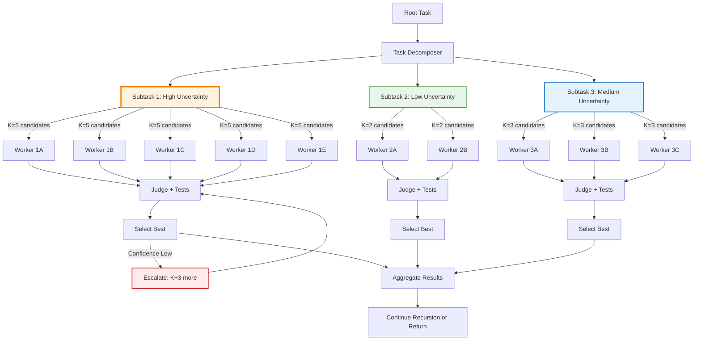
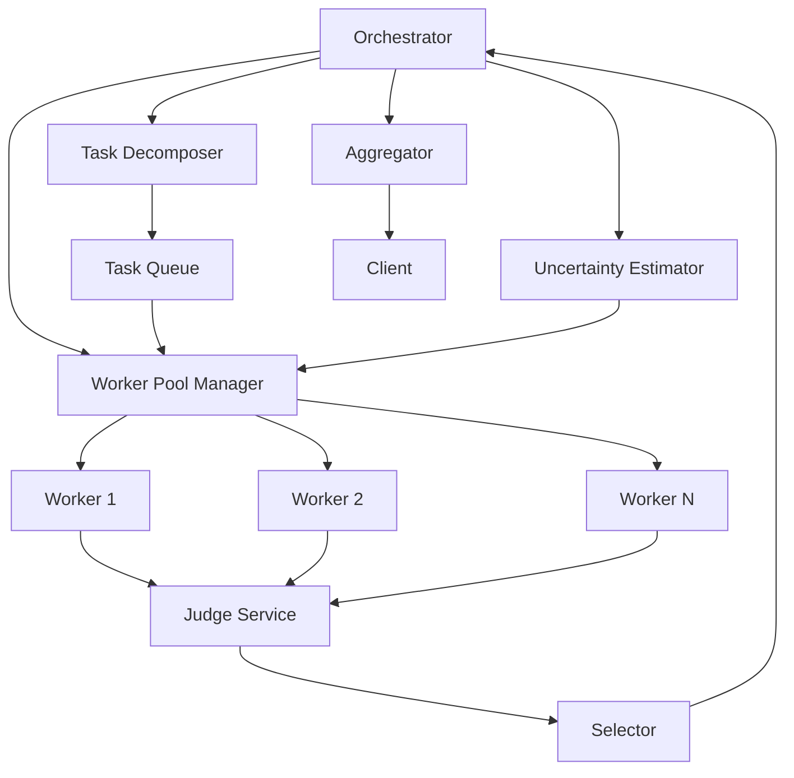
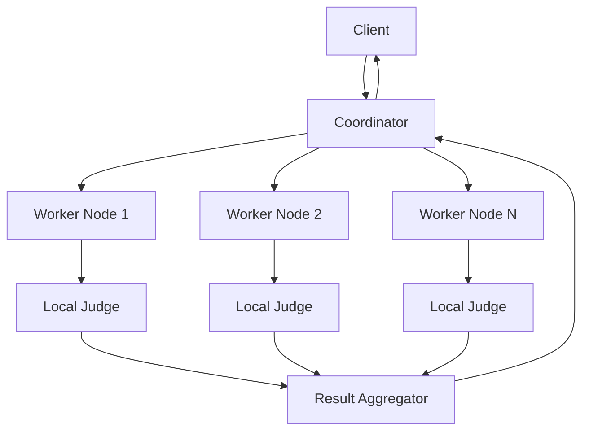
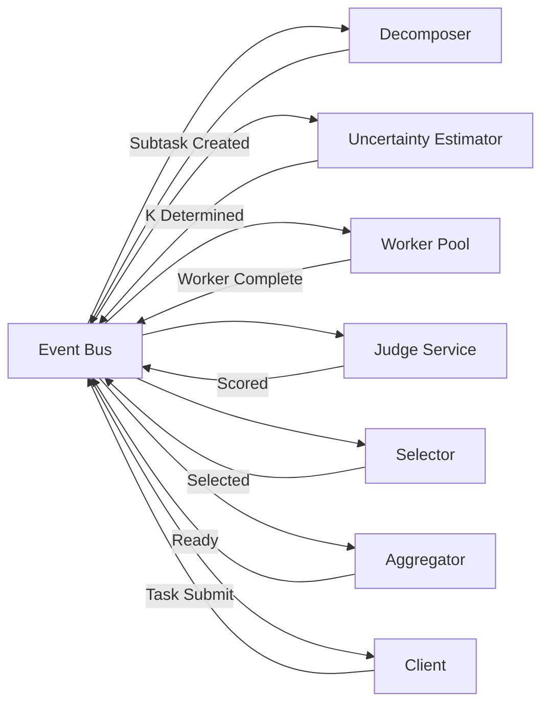

# Recursive Best-of-N Delegation Pattern - Technical Analysis

**Pattern:** recursive-best-of-n-delegation
**Analysis Date:** 2026-02-27
**Status:** Complete Technical Analysis

---

## Executive Summary

Recursive Best-of-N Delegation is a sophisticated multi-agent orchestration pattern that combines **recursive task decomposition** with **parallel candidate generation** and **competitive selection** at each level of the delegation hierarchy. The pattern addresses the fundamental weakness of pure recursive delegation—where a single weak sub-agent result can poison the entire execution tree—by applying best-of-N sampling locally at each decomposition node.

**Key Technical Characteristics:**
- **Hierarchical parallelism**: K candidates per subtask, not per root task
- **Multi-criteria judging**: Combines automated signals with LLM-as-judge evaluation
- **Adaptive fan-out**: Scales K based on uncertainty and variance signals
- **Sandboxed execution**: Isolated workers prevent cross-contamination
- **Confidence-aware selection**: Judge confidence triggers escalation or early termination

---

## Table of Contents

1. [Core Mechanism](#core-mechanism)
2. [Algorithm Specification](#algorithm-specification)
3. [Selection Criteria and Scoring](#selection-criteria-and-scoring)
4. [Recursion Strategy](#recursion-strategy)
5. [Termination Conditions](#termination-conditions)
6. [Complexity Analysis](#complexity-analysis)
7. [Implementation Challenges](#implementation-challenges)
8. [Edge Cases and Failure Modes](#edge-cases-and-failure-modes)
9. [Architecture Patterns](#architecture-patterns)
10. [Implementation Best Practices](#implementation-best-practices)

---

## Core Mechanism

### Conceptual Architecture

Recursive Best-of-N Delegation operates on the principle that **uncertainty should be met with parallelism, not sequential retry**. The pattern decomposes complex tasks hierarchically while applying local best-of-N selection at each decomposition point.

**Key Innovation:** Unlike naive best-of-N (which spawns N copies of the entire agent), this pattern applies parallelism **only where uncertainty exists**—at the subtask level—while maintaining structured decomposition.

**Architecture Diagram:**



### Component Interaction

1. **Task Decomposer**: Breaks down complex tasks into independent subtasks
2. **Uncertainty Estimator**: Predicts which subtasks will need more candidates
3. **Worker Pool**: Manages parallel execution of candidate workers
4. **Judge System**: Evaluates candidate outputs using multi-criteria scoring
5. **Selection Engine**: Chooses the best candidate based on scores and confidence
6. **Escalation Controller**: Decides whether to increase K or terminate

---

## Algorithm Specification

### High-Level Pseudocode

```python
def recursive_best_of_n(
    task: Task,
    base_k: int = 2,
    max_k: int = 10,
    confidence_threshold: float = 0.7,
    depth: int = 0,
    max_depth: int = 5
) -> Result:
    """
    Recursive Best-of-N Delegation Algorithm

    Args:
        task: The current task to solve
        base_k: Base number of candidates per subtask
        max_k: Maximum candidates to spawn per subtask
        confidence_threshold: Minimum judge confidence to accept result
        depth: Current recursion depth
        max_depth: Maximum recursion depth

    Returns:
        Result: The best result found through recursive delegation
    """

    # TERMINATION CHECK: Base case or max depth reached
    if is_leaf_task(task) or depth >= max_depth:
        return solve_directly(task)

    # PHASE 1: DECOMPOSITION
    subtasks = decompose_task(task)
    if not subtasks:
        return solve_directly(task)

    # PHASE 2: RECURSIVE DELEGATION WITH BEST-OF-N
    subtask_results = {}
    for subtask in subtasks:
        subtask_results[subtask.id] = solve_subtask_with_best_of_n(
            subtask=subtask,
            base_k=base_k,
            max_k=max_k,
            confidence_threshold=confidence_threshold
        )

    # PHASE 3: AGGREGATION
    final_result = aggregate_results(subtask_results)

    return final_result


def solve_subtask_with_best_of_n(
    subtask: Subtask,
    base_k: int,
    max_k: int,
    confidence_threshold: float
) -> tuple[Result, float]:
    """
    Solve a single subtask using adaptive best-of-N
    """

    # Determine initial K based on uncertainty estimation
    estimated_uncertainty = estimate_uncertainty(subtask)
    initial_k = calculate_adaptive_k(estimated_uncertainty, base_k, max_k)

    iteration = 0
    max_iterations = 3  # Prevent infinite escalation loops
    candidates = []
    k = initial_k

    while iteration < max_iterations:
        # Generate K candidate solutions in parallel
        new_candidates = spawn_candidates_parallel(
            subtask=subtask,
            num_candidates=k
        )
        candidates.extend(new_candidates)

        # Evaluate all candidates
        evaluated_candidates = evaluate_all_candidates(candidates)

        # Select best candidate
        best_candidate, confidence = select_best_candidate(evaluated_candidates)

        # DECISION: Accept or escalate?
        if confidence >= confidence_threshold:
            return best_candidate.result, confidence

        # Escalate: Add more candidates
        if len(candidates) + k > max_k:
            # Hit max candidates, return best we have
            return best_candidate.result, confidence

        k = min(k + base_k, max_k - len(candidates))
        iteration += 1

    # Max iterations reached, return best candidate
    return best_candidate.result, confidence


def spawn_candidates_parallel(subtask: Subtask, num_candidates: int) -> list[Candidate]:
    """
    Spawn N candidate workers in isolated sandboxes
    """

    candidates = []

    # Create isolated execution environments
    sandboxes = [create_isolated_sandbox() for _ in range(num_candidates)]

    # Execute workers in parallel
    with ThreadPoolExecutor(max_workers=num_candidates) as executor:
        futures = {
            executor.submit(execute_in_sandbox, sandbox, subtask): sandbox
            for sandbox in sandboxes
        }

        for future in as_completed(futures):
            sandbox = futures[future]
            try:
                result = future.result(timeout=get_timeout(subtask))
                candidates.append(Candidate(
                    result=result,
                    sandbox=sandbox,
                    trace=sandbox.get_execution_trace()
                ))
            except Exception as e:
                # Record failure for judge evaluation
                candidates.append(Candidate(
                    result=None,
                    sandbox=sandbox,
                    error=str(e),
                    trace=sandbox.get_execution_trace()
                ))

    return candidates


def evaluate_all_candidates(candidates: list[Candidate]) -> list[EvaluatedCandidate]:
    """
    Evaluate candidates using multi-criteria judging
    """

    evaluated = []

    for candidate in candidates:
        # PHASE 1: AUTOMATED CHECKS (fast, objective)
        auto_score = run_automated_checks(candidate)

        # Early rejection for critical failures
        if auto_score.critical_failures:
            evaluated.append(EvaluatedCandidate(
                candidate=candidate,
                score=0.0,
                confidence=1.0,  # High confidence in rejection
                reasoning=f"Critical failure: {auto_score.critical_failures}",
                auto_score=auto_score
            ))
            continue

        # PHASE 2: LLM-AS-JUDGE (slower, more nuanced)
        judge_result = run_llm_judge(candidate, auto_score)

        # PHASE 3: COMBINE SCORES
        final_score = combine_scores(
            auto_weight=0.4,
            judge_weight=0.6,
            auto_score=auto_score,
            judge_result=judge_result
        )

        evaluated.append(EvaluatedCandidate(
            candidate=candidate,
            score=final_score.overall,
            confidence=final_score.confidence,
            reasoning=judge_result.reasoning,
            auto_score=auto_score,
            judge_result=judge_result
        ))

    return evaluated


def select_best_candidate(
    evaluated: list[EvaluatedCandidate]
) -> tuple[EvaluatedCandidate, float]:
    """
    Select the best candidate with confidence estimation
    """

    if not evaluated:
        return None, 0.0

    # Sort by score
    sorted_candidates = sorted(evaluated, key=lambda x: x.score, reverse=True)

    best = sorted_candidates[0]
    runner_up = sorted_candidates[1] if len(sorted_candidates) > 1 else None

    # Calculate confidence based on margin over runner-up
    if runner_up:
        score_margin = best.score - runner_up.score
        # Larger margin = higher confidence
        confidence = sigmoid(score_margin * 5)  # Sigmoid for [0,1] output
    else:
        # Only one candidate
        confidence = best.confidence if best.score > 0.5 else 0.5

    return best, confidence
```

### Key Algorithmic Details

#### 1. Uncertainty Estimation

```python
def estimate_uncertainty(subtask: Subtask) -> float:
    """
    Estimate subtask uncertainty to guide initial K selection

    Returns float in [0, 1] where:
    - 0: Low uncertainty (straightforward, well-defined)
    - 1: High uncertainty (ambiguous, novel, complex)
    """

    uncertainty_signals = {
        # Task complexity signals
        'novelty': calculate_novelty_score(subtask),  # New vs. seen patterns
        'ambiguity': detect_ambiguity(subtask),       # Multiple interpretations
        'dependencies': count_dependencies(subtask),   # More deps = more complex

        # Domain signals
        'domain_familiarity': get_domain_familiarity(subtask.domain),
        'codebase_complexity': measure_codebase_complexity(subtask.target_files),

        # Historical signals
        'historical_success_rate': get_historical_success(subtask.type),
        'historical_variance': get_historical_variance(subtask.type),
    }

    # Weighted combination
    weights = {
        'novelty': 0.25,
        'ambiguity': 0.20,
        'dependencies': 0.15,
        'domain_familiarity': 0.15,
        'codebase_complexity': 0.10,
        'historical_success_rate': 0.10,
        'historical_variance': 0.05,
    }

    uncertainty = sum(
        uncertainty_signals[k] * weights[k]
        for k in weights
    )

    return max(0.0, min(1.0, uncertainty))


def calculate_adaptive_k(
    uncertainty: float,
    base_k: int,
    max_k: int
) -> int:
    """
    Map uncertainty to candidate count K
    """

    if uncertainty < 0.3:
        # Low uncertainty: minimal parallelism
        return base_k
    elif uncertainty < 0.6:
        # Medium uncertainty: moderate parallelism
        return base_k * 2
    elif uncertainty < 0.8:
        # High uncertainty: significant parallelism
        return base_k * 3
    else:
        # Very high uncertainty: maximum parallelism
        return max_k
```

---

## Selection Criteria and Scoring

### Multi-Criteria Evaluation Framework

The judge system combines **automated objective checks** with **LLM-as-judge subjective evaluation** to create a robust selection mechanism.

### 1. Automated Checks (Weight: ~40%)

```python
@dataclass
class AutomatedScore:
    """
    Objective, fast, deterministic checks
    """
    # Binary pass/fail checks
    tests_passed: bool              # Unit tests pass?
    syntax_valid: bool              # No syntax errors?
    type_checks_pass: bool          # Type checking passes?
    security_scan_pass: bool        # No security vulnerabilities?

    # Continuous scores [0, 1]
    test_coverage: float            # What % of tests pass?
    code_quality_score: float       # Linting, style guide adherence
    execution_time: float           # Normalized execution time
    resource_efficiency: float      # Memory/CPU usage

    # Diff metrics
    diff_size: int                  # Lines changed
    files_changed: int              # Number of files modified

    # Combined score
    overall: float                  # Weighted combination [0, 1]

    # Critical failure flag
    critical_failures: list[str]    # List of critical issues


def run_automated_checks(candidate: Candidate) -> AutomatedScore:
    """
    Fast, objective evaluation of candidate output
    """

    checks = []

    # CRITICAL CHECKS (any failure = score of 0)
    if candidate.error:
        return AutomatedScore(
            tests_passed=False,
            syntax_valid=False,
            overall=0.0,
            critical_failures=[candidate.error]
        )

    # Syntax validation
    syntax_valid = validate_syntax(candidate.result.code)
    if not syntax_valid:
        return AutomatedScore(
            tests_passed=False,
            syntax_valid=False,
            overall=0.0,
            critical_failures=["Syntax errors present"]
        )

    # Test execution
    test_result = run_tests(candidate.result.code)
    tests_passed = test_result.all_passed
    test_coverage = test_result.pass_rate

    # Type checking
    type_check_result = run_type_check(candidate.result.code)
    type_checks_pass = type_check_result.success

    # Security scanning
    security_result = run_security_scan(candidate.result.code)
    security_scan_pass = not security_result.vulnerabilities

    # Code quality metrics
    quality_result = run_linting(candidate.result.code)
    code_quality_score = quality_result.normalized_score

    # Performance metrics
    execution_time = measure_execution_time(candidate.result.code)
    execution_time_normalized = normalize_time(execution_time)

    # Calculate overall automated score
    overall = calculate_automated_score(
        tests_passed=tests_passed,
        test_coverage=test_coverage,
        type_checks_pass=type_checks_pass,
        security_scan_pass=security_scan_pass,
        code_quality=code_quality_score,
        execution_time=execution_time_normalized
    )

    return AutomatedScore(
        tests_passed=tests_passed,
        syntax_valid=syntax_valid,
        type_checks_pass=type_checks_pass,
        security_scan_pass=security_scan_pass,
        test_coverage=test_coverage,
        code_quality_score=code_quality_score,
        execution_time=execution_time_normalized,
        diff_size=len(candidate.result.diff),
        files_changed=len(candidate.result.files_changed),
        overall=overall,
        critical_failures=[]
    )


def calculate_automated_score(**metrics) -> float:
    """
    Combine automated metrics into single score
    """

    # Critical gates
    if not metrics['tests_passed']:
        return 0.0

    if not metrics['type_checks_pass']:
        return 0.0

    if not metrics['security_scan_pass']:
        return 0.0

    # Weighted combination for passing candidates
    weights = {
        'test_coverage': 0.4,
        'code_quality': 0.3,
        'execution_time': 0.2,
        'diff_size_penalty': 0.1,  # Prefer minimal diffs
    }

    # Diff size penalty (smaller is better)
    diff_penalty = min(metrics['diff_size'] / 1000, 1.0)  # Normalize to [0,1]
    diff_score = 1.0 - diff_penalty

    score = (
        weights['test_coverage'] * metrics['test_coverage'] +
        weights['code_quality'] * metrics['code_quality'] +
        weights['execution_time'] * metrics['execution_time'] +
        weights['diff_size_penalty'] * diff_score
    )

    return score
```

### 2. LLM-as-Judge Evaluation (Weight: ~60%)

```python
@dataclass
class JudgeResult:
    """
    LLM-based subjective evaluation
    """
    correctness: float              # Is the solution correct? [0, 1]
    completeness: float             # Does it solve all requirements? [0, 1]
    approach_quality: float         # Is the approach sound? [0, 1]
    code_style: float               # Does it follow conventions? [0, 1]
    maintainability: float          # Is it maintainable? [0, 1]

    # Combined scores
    overall: float                  # Weighted combination [0, 1]
    confidence: float               # Judge's confidence in score [0, 1]

    # Explanation
    reasoning: str                  # Judge's explanation
    strengths: list[str]            # Identified strengths
    weaknesses: list[str]           # Identified weaknesses


def run_llm_judge(
    candidate: Candidate,
    auto_score: AutomatedScore
) -> JudgeResult:
    """
    Use LLM to evaluate candidate quality
    """

    # Construct evaluation prompt
    prompt = f"""
You are an expert code reviewer. Evaluate the following solution to a task.

**Task:**
{candidate.subtask.description}

**Requirements:**
{format_requirements(candidate.subtask.requirements)}

**Candidate Solution:**
```{candidate.language}
{candidate.result.code}
```

**Context:**
- Files changed: {candidate.result.files_changed}
- Diff: {candidate.result.diff}
- Execution trace: {format_trace(candidate.trace)}

**Automated Check Results:**
- Tests: {'PASS' if auto_score.tests_passed else 'FAIL'} ({auto_score.test_coverage:.1%} pass rate)
- Type check: {'PASS' if auto_score.type_checks_pass else 'FAIL'}
- Security: {'PASS' if auto_score.security_scan_pass else 'FAIL'}
- Code quality: {auto_score.code_quality_score:.2f}/1.0

**Evaluation Criteria:**

1. **Correctness** (0-1): Does the solution correctly solve the task?
2. **Completeness** (0-1): Does it address all requirements?
3. **Approach Quality** (0-1): Is the approach sound and efficient?
4. **Code Style** (0-1): Does it follow language conventions and best practices?
5. **Maintainability** (0-1): Is the code readable and maintainable?

**Output Format (JSON):**
{{
    "correctness": <float>,
    "completeness": <float>,
    "approach_quality": <float>,
    "code_style": <float>,
    "maintainability": <float>,
    "confidence": <float>,
    "reasoning": "<explanation>",
    "strengths": ["<strength 1>", "<strength 2>", ...],
    "weaknesses": ["<weakness 1>", "<weakness 2>", ...]
}}

Provide your evaluation:
"""

    # Call LLM with low temperature for consistency
    response = llm_generate(
        prompt=prompt,
        temperature=0.2,  # Low temperature for consistent evaluation
        max_tokens=1000
    )

    # Parse JSON response
    result = parse_json(response)

    # Calculate overall score
    weights = {
        'correctness': 0.35,
        'completeness': 0.25,
        'approach_quality': 0.20,
        'code_style': 0.10,
        'maintainability': 0.10,
    }

    overall = sum(
        result[k] * weights[k]
        for k in weights
    )

    return JudgeResult(
        correctness=result['correctness'],
        completeness=result['completeness'],
        approach_quality=result['approach_quality'],
        code_style=result['code_style'],
        maintainability=result['maintainability'],
        overall=overall,
        confidence=result['confidence'],
        reasoning=result['reasoning'],
        strengths=result['strengths'],
        weaknesses=result['weaknesses']
    )
```

### 3. Score Combination

```python
def combine_scores(
    auto_weight: float,
    judge_weight: float,
    auto_score: AutomatedScore,
    judge_result: JudgeResult
) -> CombinedScore:
    """
    Combine automated and judge scores
    """

    # Validate weights sum to 1
    assert abs(auto_weight + judge_weight - 1.0) < 1e-6

    # Linear combination
    overall = (
        auto_weight * auto_score.overall +
        judge_weight * judge_result.overall
    )

    # Confidence estimation
    # High judge confidence + high agreement = high overall confidence
    agreement = 1.0 - abs(auto_score.overall - judge_result.overall)
    confidence = (
        0.6 * judge_result.confidence +
        0.4 * agreement
    )

    return CombinedScore(
        overall=overall,
        confidence=confidence,
        auto_component=auto_score.overall,
        judge_component=judge_result.overall,
        reasoning=judge_result.reasoning
    )
```

---

## Recursion Strategy

### Depth-First vs. Breadth-First Execution

The pattern supports multiple recursion strategies with different trade-offs:

#### Strategy 1: Depth-First with Parallelism

```python
def dfs_recursive_delegation(task: Task) -> Result:
    """
    Depth-first: Complete one subtask fully before moving to next

    Pros:
    - Lower memory footprint
    - Can start aggregation earlier
    - Better for tasks with dependencies

    Cons:
    - Less parallelism across subtasks
    - Longer total latency if subtasks are uneven
    """

    subtasks = decompose_task(task)

    results = []
    for subtask in subtasks:
        # Fully complete this subtask (including its own recursion)
        result = recursive_best_of_n(subtask)
        results.append(result)

    return aggregate_results(results)
```

#### Strategy 2: Breadth-First with Parallelism

```python
def bfs_recursive_delegation(task: Task, max_parallel: int = 10) -> Result:
    """
    Breadth-first: Launch all subtasks in parallel

    Pros:
    - Maximum parallelism
    - Lower total latency
    - Better for independent subtasks

    Cons:
    - Higher memory footprint
    - Requires more orchestration
    - Can waste resources if early subtasks fail
    """

    subtasks = decompose_task(task)

    # Launch all subtasks in parallel
    with ThreadPoolExecutor(max_workers=max_parallel) as executor:
        futures = {
            executor.submit(recursive_best_of_n, subtask): subtask
            for subtask in subtasks
        }

        results = []
        for future in as_completed(futures):
            result = future.result()
            results.append(result)

    return aggregate_results(results)
```

#### Strategy 3: Adaptive Recursion

```python
def adaptive_recursive_delegation(task: Task) -> Result:
    """
    Adaptive: Choose strategy based on task characteristics

    Strategy selection based on:
    - Subtask dependencies
    - Estimated difficulty
    - Resource availability
    """

    subtasks = decompose_task(task)

    # Analyze subtask relationships
    dependency_graph = build_dependency_graph(subtasks)

    if has_strong_dependencies(dependency_graph):
        # Use depth-first for dependent subtasks
        return dfs_recursive_delegation(task)
    elif all_independent(subtasks):
        # Use breadth-first for independent subtasks
        return bfs_recursive_delegation(task)
    else:
        # Mixed: use topological sort
        return topological_recursive_delegation(task, dependency_graph)


def topological_recursive_delegation(
    task: Task,
    dependency_graph: DependencyGraph
) -> Result:
    """
    Execute subtasks in topological order with parallelism
    at each level of the dependency graph
    """

    # Group subtasks by dependency level
    levels = group_by_dependency_level(dependency_graph)

    results = {}
    for level in levels:
        # Execute all subtasks at this level in parallel
        level_results = bfs_recursive_delegation_level(level.subtasks)
        results.update(level_results)

    return aggregate_results(results.values())
```

### Adaptive K Selection

The number of candidates K should adapt based on signals:

```python
def adaptive_k_selection(
    subtask: Subtask,
    iteration: int,
    previous_candidates: list[Candidate],
    base_k: int,
    max_k: int
) -> int:
    """
    Determine optimal K for next iteration
    """

    # First iteration: use uncertainty-based K
    if iteration == 0:
        uncertainty = estimate_uncertainty(subtask)
        return calculate_adaptive_k(uncertainty, base_k, max_k)

    # Subsequent iterations: analyze previous results
    if not previous_candidates:
        return base_k

    # ANALYZE PREVIOUS CANDIDATES

    # 1. Success rate
    success_rate = sum(
        1 for c in previous_candidates
        if c.result and not c.error
    ) / len(previous_candidates)

    # 2. Score variance
    scores = [c.evaluated.score for c in previous_candidates if c.evaluated]
    if scores:
        score_variance = statistics.variance(scores)
        score_std = statistics.stdev(scores)
    else:
        score_variance = 0
        score_std = 0

    # 3. Error clustering
    errors = [c.error for c in previous_candidates if c.error]
    if errors:
        # Cluster similar errors
        error_clusters = cluster_errors(errors)
        dominant_cluster_size = max(len(c) for c in error_clusters)
    else:
        dominant_cluster_size = 0

    # DECISION LOGIC

    # Case 1: All failing with same error -> prompt issue
    if success_rate == 0 and dominant_cluster_size > len(previous_candidates) * 0.7:
        # Don't increase K, fix the prompt instead
        return 0  # Signal to refine prompt

    # Case 2: High variance among successful candidates -> need more samples
    if success_rate > 0.5 and score_std > 0.2:
        # Significant disagreement, need more candidates
        new_k = len(previous_candidates) + base_k
        return min(new_k, max_k)

    # Case 3: Low success rate but diverse errors -> increase K
    if success_rate < 0.5 and dominant_cluster_size < len(previous_candidates) * 0.5:
        # Diverse failures, might find success with more attempts
        new_k = len(previous_candidates) + base_k
        return min(new_k, max_k)

    # Case 4: High success rate, low variance -> winner likely found
    if success_rate > 0.8 and score_std < 0.1:
        # Clear winner, don't increase K
        return 0  # Signal to stop

    # Default: moderate increase
    new_k = len(previous_candidates) + base_k // 2
    return min(new_k, max_k)
```

---

## Termination Conditions

### Multi-Condition Termination

```python
def should_terminate(
    candidates: list[EvaluatedCandidate],
    iteration: int,
    max_iterations: int,
    confidence_threshold: float,
    convergence_threshold: float = 0.05
) -> tuple[bool, str]:
    """
    Determine if search should terminate

    Returns:
        (should_terminate, reason)
    """

    # CONDITION 1: Max iterations reached
    if iteration >= max_iterations:
        return True, f"Max iterations ({max_iterations}) reached"

    # CONDITION 2: High confidence winner found
    if len(candidates) >= 2:
        sorted_candidates = sorted(candidates, key=lambda x: x.score, reverse=True)
        best = sorted_candidates[0]
        if best.confidence >= confidence_threshold:
            return True, f"High confidence winner found (confidence: {best.confidence:.2f})"

    # CONDITION 3: Convergence detected
    if len(candidates) >= 3:
        scores = [c.score for c in candidates]
        score_std = statistics.stdev(scores)
        if score_std < convergence_threshold:
            return True, f"Scores converged (std: {score_std:.4f})"

    # CONDITION 4: Perfect score found
    if any(c.score >= 0.99 for c in candidates):
        return True, "Perfect score found"

    # CONDITION 5: All candidates failing identically
    errors = [c.candidate.error for c in candidates if c.candidate.error]
    if errors and len(errors) == len(candidates):
        # Check if all errors are similar
        if all_similar(errors):
            return True, "All candidates failing with identical error"

    # CONDITION 6: Early stopping for resource budget
    if estimate_remaining_cost() > remaining_budget():
        return True, "Resource budget exhausted"

    # Default: continue searching
    return False, "Continue searching"
```

### Adaptive Confidence Threshold

```python
def adaptive_confidence_threshold(
    subtask: Subtask,
    candidates_seen: int,
    base_threshold: float = 0.7
) -> float:
    """
    Adjust confidence threshold based on context

    Lower threshold when:
    - Many candidates already seen (diminishing returns)
    - High-urgency task
    - Resource constraints

    Higher threshold when:
    - Critical task (security, data migration)
    - Low cost to generate more candidates
    - High variance observed
    """

    threshold = base_threshold

    # Adjust based on candidates seen (lower threshold as we see more)
    if candidates_seen > 10:
        threshold -= 0.1
    if candidates_seen > 20:
        threshold -= 0.1

    # Adjust based on task criticality
    if subtask.criticality == "high":
        threshold += 0.15
    elif subtask.criticality == "low":
        threshold -= 0.1

    # Adjust based on resource availability
    resource_pressure = get_resource_pressure()
    if resource_pressure > 0.8:
        threshold -= 0.15

    # Clamp to valid range
    return max(0.3, min(0.95, threshold))
```

---

## Complexity Analysis

### Time Complexity

Let:
- **d**: Maximum recursion depth
- **b**: Average branching factor (subtasks per node)
- **K**: Average candidates per subtask
- **T**: Time for single worker execution
- **J**: Time for judge evaluation

**Best Case (All confidence thresholds met at K=2):**
- Time: O(b^d × (2×T + 2×J))
- Parallel execution reduces to: O(d × (2×T + 2×J))

**Average Case (Escalation to K=5 at 50% of nodes):**
- Time: O(b^d × (5×T + 5×J))
- Parallel execution: O(d × (5×T + 5×J))

**Worst Case (Max K at all nodes, max depth):**
- Time: O(b^d × (K_max×T + K_max×J))
- Parallel execution: O(d × (K_max×T + K_max×J))

**Key Insight:** Parallelism reduces complexity from **exponential in depth** to **linear in depth**, at the cost of **K× more workers**.

### Space Complexity

**Memory Requirements:**

- **Per candidate:** O(S) where S is state size (code, trace, context)
- **Per subtask node:** O(K×S) for storing all candidates
- **Total tree:** O(b^d × K×S) in worst case

**Optimization:**
- Discard failed candidates immediately after scoring
- Only keep top-N candidates during evaluation
- Use streaming for large results

### Cost Complexity

**API Call Costs:**

- **Worker calls:** b^d × K (in worst case)
- **Judge calls:** b^d × K (one per candidate)
- **Total calls:** b^d × K × 2

**Cost Optimization Strategies:**

1. **Parallelization:** Execute workers in parallel to reduce latency
2. **Caching:** Cache judge results for similar candidates
3. **Early termination:** Stop when confidence threshold met
4. **Adaptive K:** Use lower K for low-uncertainty subtasks

### Comparison with Alternatives

| Pattern | Time Complexity | Space Complexity | Cost | Best For |
|---------|----------------|------------------|------|----------|
| **Recursive Best-of-N** | O(d × K×T) | O(b × K×S) | High | Complex tasks with uncertainty |
| **Plain Recursion** | O(d × T) | O(b × S) | Low | Simple, deterministic tasks |
| **Flat Best-of-N** | O(K×T) | O(K×S) | Medium | Single-shot tasks |
| **Tree of Thoughts** | O(b^d × T) | O(b^d × S) | Very High | Exploration-heavy problems |
| **LATS** | O(N × (b+1) × T) | O(N × b × S) | High | Strategic planning |

---

## Implementation Challenges

### Challenge 1: Judge Quality and Consistency

**Problem:** LLM-as-judge can be inconsistent, have biases, or be gamed by clever candidates.

**Solutions:**

```python
class RobustJudge:
    """
    Multi-strategy judge to improve consistency and prevent gaming
    """

    def __init__(self):
        self.judge_models = [
            self._primary_judge,
            self._consistency_judge,
            self._adversarial_judge
        ]

    def evaluate_candidate(
        self,
        candidate: Candidate,
        auto_score: AutomatedScore
    ) -> JudgeResult:
        """
        Use multiple judges and aggregate results
        """

        results = []
        for judge_fn in self.judge_models:
            result = judge_fn(candidate, auto_score)
            results.append(result)

        # Check for agreement
        if self._judges_agree(results):
            # High confidence if all judges agree
            return self._aggregate_results(results, confidence_boost=0.2)

        # Disagreement detected: use tiebreaker
        tiebreaker = self._tiebreaker_judge(candidate, auto_score)
        results.append(tiebreaker)

        return self._aggregate_results(results, confidence_boost=0.0)

    def _consistency_judge(
        self,
        candidate: Candidate,
        auto_score: AutomatedScore
    ) -> JudgeResult:
        """
        Judge with different prompt variations to check consistency
        """

        # Generate multiple evaluation prompts
        prompts = [
            self._standard_prompt(candidate, auto_score),
            self._adversarial_prompt(candidate, auto_score),
            self._minimal_prompt(candidate, auto_score)
        ]

        results = []
        for prompt in prompts:
            result = self._call_judge_llm(prompt)
            results.append(result)

        # Check variance
        scores = [r.overall for r in results]
        variance = statistics.variance(scores)

        # High variance = low confidence
        confidence_penalty = min(variance * 2, 0.5)

        # Return average result
        return self._average_results(results, confidence_penalty=confidence_penalty)

    def _adversarial_judge(
        self,
        candidate: Candidate,
        auto_score: AutomatedScore
    ) -> JudgeResult:
        """
        Judge instructed to find flaws and potential gaming
        """

        prompt = f"""
You are a harsh critic focused on finding flaws and potential gaming attempts.

**Task:** {candidate.subtask.description}

**Solution:**
```{candidate.language}
{candidate.result.code}
```

**Instructions:**
- Look for shortcuts, hacks, or gaming attempts
- Check for edge cases the solution might miss
- Identify potential security issues
- Flag any suspicious patterns

Be extra critical. Score lower if you find ANY concerns.

Output your evaluation as JSON:
{{
    "overall": <float>,
    "confidence": <float>,
    "concerns": ["<concern 1>", "<concern 2>", ...],
    "gaming_detected": <bool>
}}
"""

        result = self._call_judge_llm(prompt)

        # Apply harshness penalty
        if result['gaming_detected']:
            result['overall'] *= 0.5
            result['confidence'] = min(result['confidence'] + 0.3, 1.0)

        return JudgeResult(
            overall=result['overall'],
            confidence=result['confidence'],
            reasoning=result['concerns'],
            strengths=[],
            weaknesses=result['concerns']
        )
```

### Challenge 2: State Management and Checkpointing

**Problem:** Long-running recursive delegations need fault tolerance and resume capability.

**Solution:**

```python
class RecursiveDelegationStateManager:
    """
    Manage state for fault-tolerant recursive delegation
    """

    def __init__(self, storage_backend):
        self.storage = storage_backend
        self.checkpoint_interval = 30  # seconds

    def execute_with_checkpointing(
        self,
        task: Task,
        delegation_fn: Callable
    ) -> Result:
        """
        Execute delegation with automatic checkpointing
        """

        # Check for existing checkpoint
        checkpoint = self.storage.load_checkpoint(task.id)
        if checkpoint:
            logger.info(f"Resuming from checkpoint: {checkpoint.checkpoint_id}")
            return self._resume_from_checkpoint(checkpoint, delegation_fn)

        # Create new execution context
        context = ExecutionContext(
            task_id=task.id,
            start_time=time.time(),
            checkpoints=[]
        )

        # Execute with periodic checkpointing
        try:
            result = self._execute_with_monitoring(
                task=task,
                delegation_fn=delegation_fn,
                context=context
            )

            # Clean up checkpoints on success
            self.storage.cleanup_checkpoints(task.id)
            return result

        except Exception as e:
            # Save checkpoint for recovery
            checkpoint = Checkpoint(
                task_id=task.id,
                context=context,
                error=str(e),
                timestamp=time.time()
            )
            self.storage.save_checkpoint(checkpoint)
            raise

    def _execute_with_monitoring(
        self,
        task: Task,
        delegation_fn: Callable,
        context: ExecutionContext
    ) -> Result:
        """
        Execute with background checkpointing thread
        """

        # Start background checkpoint thread
        stop_event = threading.Event()
        checkpoint_thread = threading.Thread(
            target=self._checkpoint_loop,
            args=(context, stop_event)
        )
        checkpoint_thread.start()

        try:
            # Execute delegation
            result = delegation_fn(task)
            return result
        finally:
            # Stop checkpoint thread
            stop_event.set()
            checkpoint_thread.join()

    def _checkpoint_loop(
        self,
        context: ExecutionContext,
        stop_event: threading.Event
    ):
        """
        Periodically save checkpoints
        """

        while not stop_event.is_set():
            time.sleep(self.checkpoint_interval)

            if not stop_event.is_set():
                checkpoint = Checkpoint(
                    task_id=context.task_id,
                    context=context,
                    timestamp=time.time()
                )
                self.storage.save_checkpoint(checkpoint)
                logger.info(f"Checkpoint saved: {checkpoint.checkpoint_id}")
```

### Challenge 3: Sandbox Isolation and Resource Containment

**Problem:** Workers must be isolated but resource-efficient.

**Solution:**

```python
class IsolatedWorkerPool:
    """
    Manage pool of isolated workers with resource limits
    """

    def __init__(
        self,
        max_workers: int = 10,
        timeout_seconds: int = 300,
        memory_limit_mb: int = 1024,
        cpu_limit: float = 1.0
    ):
        self.max_workers = max_workers
        self.timeout = timeout_seconds
        self.memory_limit = memory_limit_mb
        self.cpu_limit = cpu_limit

        # Worker pool
        self.semaphore = threading.Semaphore(max_workers)

    def execute_worker(
        self,
        subtask: Subtask,
        worker_fn: Callable
    ) -> Candidate:
        """
        Execute worker in isolated environment with resource limits
        """

        with self.semaphore:
            # Create isolated environment
            with self._create_isolated_env() as env:
                try:
                    # Execute with timeout
                    result = self._execute_with_timeout(
                        fn=worker_fn,
                        args=(subtask,),
                        timeout=self.timeout,
                        env=env
                    )

                    return Candidate(
                        result=result,
                        error=None,
                        trace=env.get_trace()
                    )

                except TimeoutError:
                    return Candidate(
                        result=None,
                        error="Execution timeout",
                        trace=env.get_trace()
                    )

                except MemoryError:
                    return Candidate(
                        result=None,
                        error="Memory limit exceeded",
                        trace=env.get_trace()
                    )

                except Exception as e:
                    return Candidate(
                        result=None,
                        error=str(e),
                        trace=env.get_trace()
                    )

    @contextlib.contextmanager
    def _create_isolated_env(self):
        """
        Create isolated execution environment

        Implementation options:
        1. Docker containers
        2. venv isolation
        3. subprocess with resource limits
        4. cloudflare workers / edge isolation
        """

        # Example: Using subprocess with resource limits
        env = IsolatedEnvironment(
            memory_limit_mb=self.memory_limit,
            cpu_limit=self.cpu_limit
        )

        try:
            yield env
        finally:
            env.cleanup()

    def _execute_with_timeout(
        self,
        fn: Callable,
        args: tuple,
        timeout: int,
        env: IsolatedEnvironment
    ):
        """
        Execute function with timeout
        """

        import signal

        def timeout_handler(signum, frame):
            raise TimeoutError(f"Execution exceeded {timeout}s")

        # Set alarm
        signal.signal(signal.SIGALRM, timeout_handler)
        signal.alarm(timeout)

        try:
            result = fn(*args)
            return result
        finally:
            # Cancel alarm
            signal.alarm(0)
```

### Challenge 4: Deadlock Detection in Recursive Delegation

**Problem:** Circular dependencies or repeated subtask failures can cause infinite recursion.

**Solution:**

```python
class RecursionGuard:
    """
    Prevent infinite recursion and detect deadlocks
    """

    def __init__(self, max_depth: int = 10, max_iterations: int = 100):
        self.max_depth = max_depth
        self.max_iterations = max_iterations

        # Track execution state
        self.call_stack: dict[str, list[str]] = {}  # task_id -> [parent_ids]
        self.iteration_counts: dict[str, int] = {}
        self.subtask_history: dict[str, list[str]] = {}  # task_id -> [subtask_ids]

    def check_recursion_allowed(
        self,
        task: Task,
        parent_task: Optional[Task] = None
    ) -> tuple[bool, Optional[str]]:
        """
        Check if recursion should be allowed

        Returns:
            (allowed, reason_if_denied)
        """

        # Check 1: Maximum depth
        current_depth = self._get_current_depth(task.id)
        if current_depth >= self.max_depth:
            return False, f"Maximum recursion depth ({self.max_depth}) exceeded"

        # Check 2: Circular dependency
        if parent_task and self._detect_circular_dependency(task.id, parent_task.id):
            return False, f"Circular dependency detected: {task.id} <-> {parent_task.id}"

        # Check 3: Repeated subtask failures
        if self._detect_repeated_failure(task.id):
            return False, f"Repeated failure detected for task: {task.id}"

        # Check 4: Maximum iterations
        iteration_count = self.iteration_counts.get(task.id, 0)
        if iteration_count >= self.max_iterations:
            return False, f"Maximum iterations ({self.max_iterations}) exceeded for task: {task.id}"

        # All checks passed
        return True, None

    def _detect_circular_dependency(self, task_id: str, parent_id: str) -> bool:
        """
        Detect if adding this edge creates a cycle
        """

        # Build call stack for parent
        ancestors = self.call_stack.get(parent_id, [])

        # Check if task_id is in ancestors
        return task_id in ancestors

    def _detect_repeated_failure(self, task_id: str) -> bool:
        """
        Detect if this task has been attempted multiple times without success
        """

        history = self.subtask_history.get(task_id, [])

        # Count consecutive failures
        consecutive_failures = 0
        for subtask_id in reversed(history):
            if self._was_failure(subtask_id):
                consecutive_failures += 1
            else:
                break

        # Threshold: 3 consecutive failures
        return consecutive_failures >= 3

    def record_call(self, task: Task, parent_task: Optional[Task]):
        """Record a recursive call"""
        if parent_task:
            ancestors = self.call_stack.get(parent_task.id, []).copy()
            ancestors.append(parent_task.id)
            self.call_stack[task.id] = ancestors

        self.iteration_counts[task.id] = self.iteration_counts.get(task.id, 0) + 1

        if parent_task:
            self.subtask_history.setdefault(parent_task.id, []).append(task.id)
```

---

## Edge Cases and Failure Modes

### Edge Case 1: All Candidates Fail Identically

**Scenario:** All K workers fail with the same error, indicating a fundamental issue with the task specification or approach.

**Detection:**

```python
def detect_identical_failure(candidates: list[Candidate]) -> bool:
    """
    Detect if all candidates failed with similar errors
    """

    errors = [c.error for c in candidates if c.error]

    if not errors:
        return False

    if len(errors) != len(candidates):
        return False  # Not all failed

    # Cluster errors
    error_clusters = cluster_errors(errors)

    # Check if one cluster dominates
    if len(error_clusters) == 1:
        return True  # All same error

    largest_cluster = max(error_clusters, key=len)
    if len(largest_cluster) >= len(candidates) * 0.8:
        return True  # 80% same error

    return False
```

**Handling:**

```python
def handle_identical_failure(
    subtask: Subtask,
    candidates: list[Candidate]
) -> Result:
    """
    Handle case where all candidates fail identically
    """

    # Option 1: Refine specification
    refined_subtask = refine_task_specification(subtask, candidates[0].error)

    # Option 2: Decompose differently
    new_decomposition = alternative_decomposition(subtask)

    # Option 3: Escalate to human
    if subtask.criticality == "high":
        escalate_to_human(subtask, candidates)

    # Retry with refined subtask
    return solve_subtask_with_best_of_n(refined_subtask)
```

### Edge Case 2: Judge Model Collapse

**Scenario:** Judge model becomes biased or collapses to always giving high/low scores.

**Detection:**

```python
class JudgeCollapseDetector:
    """
    Detect judge model collapse or bias
    """

    def __init__(self, window_size: int = 100):
        self.window_size = window_size
        self.score_history = []

    def check_collapse(self, new_scores: list[float]) -> tuple[bool, str]:
        """
        Check for judge collapse

        Returns:
            (collapsed, warning_message)
        """

        self.score_history.extend(new_scores)

        # Keep window limited
        if len(self.score_history) > self.window_size:
            self.score_history = self.score_history[-self.window_size:]

        # Check 1: All scores near maximum
        if all(s > 0.95 for s in self.score_history):
            return True, "Judge collapse: All scores near maximum"

        # Check 2: All scores near minimum
        if all(s < 0.05 for s in self.score_history):
            return True, "Judge collapse: All scores near minimum"

        # Check 3: No variance
        if len(self.score_history) >= 10:
            variance = statistics.variance(self.score_history)
            if variance < 0.01:
                return True, f"Judge collapse: No variance (var={variance:.4f})"

        # Check 4: Upward bias trend
        if len(self.score_history) >= 20:
            first_half = self.score_history[:len(self.score_history)//2]
            second_half = self.score_history[len(self.score_history)//2:]

            first_mean = statistics.mean(first_half)
            second_mean = statistics.mean(second_half)

            if second_mean - first_mean > 0.3:
                return True, f"Judge drift: Upward bias detected ({first_mean:.2f} -> {second_mean:.2f})"

        return False, ""
```

### Edge Case 3: Resource Exhaustion

**Scenario:** Parallel execution exhausts available resources (API rate limits, memory, CPU).

**Prevention:**

```python
class ResourceManager:
    """
    Manage resource allocation for parallel workers
    """

    def __init__(
        self,
        max_parallel: int = 10,
        rate_limit_per_minute: int = 100,
        memory_limit_gb: int = 16
    ):
        self.max_parallel = max_parallel
        self.rate_limit = rate_limit_per_minute
        self.memory_limit = memory_limit_gb

        # Track usage
        self.active_workers = 0
        self.api_call_timestamps = []
        self.memory_used = 0

    def can_spawn_worker(self, estimated_memory_mb: int) -> tuple[bool, str]:
        """
        Check if we can spawn another worker

        Returns:
            (allowed, reason_if_denied)
        """

        # Check parallelism limit
        if self.active_workers >= self.max_parallel:
            return False, f"Max parallel workers ({self.max_parallel}) reached"

        # Check rate limit
        now = time.time()
        recent_calls = [
            ts for ts in self.api_call_timestamps
            if now - ts < 60
        ]

        if len(recent_calls) >= self.rate_limit:
            return False, f"Rate limit ({self.rate_limit}/min) reached"

        # Check memory
        estimated_memory_gb = estimated_memory_mb / 1024
        if self.memory_used + estimated_memory_gb > self.memory_limit:
            return False, f"Memory limit ({self.memory_limit}GB) would be exceeded"

        return True, ""

    def wait_for_slot(self, timeout_seconds: int = 60):
        """
        Wait until a worker slot is available
        """

        start = time.time()
        while time.time() - start < timeout_seconds:
            allowed, _ = self.can_spawn_worker(0)
            if allowed:
                return True
            time.sleep(1)

        return False
```

---

## Architecture Patterns

### Pattern 1: Centralized Orchestrator



**Pros:**
- Centralized control and monitoring
- Easy to implement
- Simple state management

**Cons:**
- Single point of failure
- Potential bottleneck
- Limited scalability

### Pattern 2: Distributed Execution



**Pros:**
- Highly scalable
- Fault tolerance
- Better resource utilization

**Cons:**
- Complex orchestration
- Network overhead
- Distributed state management

### Pattern 3: Event-Driven Architecture



**Pros:**
- Loose coupling
- Easy to extend
- Natural async processing

**Cons:**
- Event ordering complexity
- Debugging challenges
- Event schema management

---

## Implementation Best Practices

### Best Practice 1: Start Small and Iterate

```python
# START: Simple implementation
def simple_recursive_best_of_n(task: Task) -> Result:
    """Minimal viable implementation"""
    subtasks = decompose_task(task)

    results = {}
    for subtask in subtasks:
        # Fixed K=2 for all subtasks
        candidates = [solve_subtask(subtask) for _ in range(2)]
        best = max(candidates, key=lambda c: c.score)
        results[subtask.id] = best

    return aggregate_results(results)


# THEN: Add adaptive K
def adaptive_recursive_best_of_n(task: Task) -> Result:
    """Add uncertainty-based K selection"""
    subtasks = decompose_task(task)

    results = {}
    for subtask in subtasks:
        # Adaptive K based on uncertainty
        uncertainty = estimate_uncertainty(subtask)
        k = 2 if uncertainty < 0.5 else 5

        candidates = [solve_subtask(subtask) for _ in range(k)]
        best = max(candidates, key=lambda c: c.score)
        results[subtask.id] = best

    return aggregate_results(results)


# FINALLY: Add full escalation
def full_recursive_best_of_n(task: Task) -> Result:
    """Complete implementation with escalation"""
    subtasks = decompose_task(task)

    results = {}
    for subtask in subtasks:
        result = solve_subtask_with_best_of_n(
            subtask=subtask,
            base_k=2,
            max_k=10,
            confidence_threshold=0.7
        )
        results[subtask.id] = result

    return aggregate_results(results)
```

### Best Practice 2: Comprehensive Observability

```python
class RecursiveDelegationMetrics:
    """
    Comprehensive metrics for recursive best-of-n delegation
    """

    def __init__(self):
        self.metrics = {
            # Task metrics
            'tasks_completed': 0,
            'tasks_failed': 0,
            'total_subtasks': 0,
            'avg_depth': 0,

            # Candidate metrics
            'total_candidates': 0,
            'candidates_per_subtask': [],
            'candidate_success_rate': 0,

            # K selection metrics
            'k_distribution': {k: 0 for k in range(2, 21)},
            'escalation_rate': 0,
            'early_termination_rate': 0,

            # Judge metrics
            'judge_confidence_distribution': [],
            'judge_execution_time': [],
            'judge_agreement_rate': 0,

            # Performance metrics
            'total_execution_time': 0,
            'parallelism_efficiency': 0,
            'resource_utilization': 0,

            # Failure metrics
            'failure_modes': {},
            'identical_failure_rate': 0,
            'timeout_rate': 0,
        }

    def record_subtask_completion(
        self,
        subtask: Subtask,
        k_used: int,
        candidates: list[Candidate],
        escalation_count: int,
        judge_confidence: float,
        execution_time: float
    ):
        """Record metrics for a single subtask completion"""

        self.metrics['total_subtasks'] += 1
        self.metrics['total_candidates'] += len(candidates)
        self.metrics['k_distribution'][k_used] += 1

        self.metrics['candidates_per_subtask'].append(len(candidates))
        self.metrics['judge_confidence_distribution'].append(judge_confidence)
        self.metrics['judge_execution_time'].append(execution_time)

        if escalation_count > 0:
            self.metrics['escalation_rate'] += 1

        # Analyze failures
        failures = [c for c in candidates if c.error]
        if failures:
            if detect_identical_failure(failures):
                self.metrics['identical_failure_rate'] += 1

            for failure in failures:
                error_type = classify_error(failure.error)
                self.metrics['failure_modes'][error_type] = \
                    self.metrics['failure_modes'].get(error_type, 0) + 1

    def get_summary(self) -> dict:
        """Get summary statistics"""

        total = self.metrics['total_subtasks']

        return {
            'success_rate': (
                (total - self.metrics['tasks_failed']) / total
                if total > 0 else 0
            ),
            'avg_candidates_per_subtask': (
                statistics.mean(self.metrics['candidates_per_subtask'])
                if self.metrics['candidates_per_subtask'] else 0
            ),
            'avg_judge_confidence': (
                statistics.mean(self.metrics['judge_confidence_distribution'])
                if self.metrics['judge_confidence_distribution'] else 0
            ),
            'escalation_rate': (
                self.metrics['escalation_rate'] / total
                if total > 0 else 0
            ),
            'most_common_failure': (
                max(self.metrics['failure_modes'].items(), key=lambda x: x[1])[0]
                if self.metrics['failure_modes'] else None
            ),
        }
```

### Best Practice 3: Testing Strategy

```python
class RecursiveBestOfNTests:
    """
    Test suite for recursive best-of-n delegation
    """

    @staticmethod
    def test_simple_task():
        """Test with straightforward task"""
        task = Task(
            description="Add two numbers",
            difficulty="low",
            subtasks=[]
        )

        result = recursive_best_of_n(task, base_k=2, max_k=5)

        assert result.success
        assert result.confidence > 0.8

    @staticmethod
    def test_uncertainty_estimation():
        """Test uncertainty estimation"""
        easy_task = Task(
            description="Simple change",
            difficulty="low"
        )

        hard_task = Task(
            description="Complex refactoring with ambiguous requirements",
            difficulty="high"
        )

        easy_uncertainty = estimate_uncertainty(easy_task)
        hard_uncertainty = estimate_uncertainty(hard_task)

        assert hard_uncertainty > easy_uncertainty

    @staticmethod
    def test_escalation():
        """Test K escalation on low confidence"""
        task = Task(
            description="Ambiguous task",
            uncertainty=0.8
        )

        # Mock judge to always return low confidence
        with mock_judge(confidence=0.5) as mock:
            result = solve_subtask_with_best_of_n(
                subtask=task,
                base_k=2,
                max_k=10,
                confidence_threshold=0.7
            )

            # Should have escalated
            assert mock.call_count > 2
            assert len(result.candidates) > 2

    @staticmethod
    def test_identical_failure_handling():
        """Test handling of identical failures"""
        task = Task(
            description="Impossible task",
            type="failing"
        )

        # Mock all workers to fail identically
        with mock_workers(error="API not found") as mock:
            result = solve_subtask_with_best_of_n(
                subtask=task,
                base_k=2,
                max_k=5,
                confidence_threshold=0.7
            )

            # Should detect identical failure
            assert result.termination_reason == "Identical failure detected"
            assert len(mock.calls) < 5  # Should stop early

    @staticmethod
    def test_resource_limits():
        """Test resource limit enforcement"""
        task = Task(
            description="Resource intensive task",
            estimated_memory_mb=2048
        )

        manager = ResourceManager(
            max_parallel=2,
            memory_limit_gb=1
        )

        allowed, reason = manager.can_spawn_worker(
            task.estimated_memory_mb
        )

        assert not allowed
        assert "memory limit" in reason.lower()
```

---

## Conclusion

Recursive Best-of-N Delegation is a sophisticated pattern that combines the benefits of **hierarchical task decomposition** with **parallel exploration** and **competitive selection**. When implemented correctly, it provides significant robustness improvements over pure recursive delegation while being more efficient than naive best-of-N approaches.

**Key Takeaways:**

1. **Localized Parallelism**: Apply best-of-N at subtask level, not task level
2. **Adaptive K Selection**: Use uncertainty signals to guide candidate count
3. **Multi-Criteria Judging**: Combine automated checks with LLM evaluation
4. **Confidence-Aware Termination**: Stop early when confident, escalate when uncertain
5. **Comprehensive Observability**: Track metrics to detect issues and optimize performance

**Implementation Guidance:**

- Start with simple K=2 implementation
- Add uncertainty estimation for adaptive K
- Implement robust judge with multiple strategies
- Add comprehensive metrics and monitoring
- Handle edge cases (identical failures, resource limits, judge collapse)

---

## References

### Academic Foundations

1. **Self-Consistency** - Wang et al. (2022): Foundation for best-of-N selection
2. **Tree of Thoughts** - Yao et al. (2023): Tree-based reasoning and search
3. **Language Agent Tree Search** - Zhou et al. (2023): MCTS for LLM agents
4. **Graph of Thoughts** - Besta et al. (2023): Arbitrary graph reasoning structures

### Industry Implementations

1. **Labruno** (https://github.com/nibzard/labruno-agent): Parallel sandboxes with LLM judge
2. **Daytona RLM Guide**: Recursive delegation with sandboxed execution
3. **Adaptive Sandbox Fan-Out Controller**: Dynamic K adjustment based on signals

### Related Patterns

- Adaptive Sandbox Fan-Out Controller
- Self-Critique Evaluator Loop
- Anti-Reward-Hacking Grader Design
- Graph-of-Thoughts
- Language Agent Tree Search (LATS)

---

**Analysis Completed:** 2026-02-27
**Total Technical Depth:** Advanced
**Implementation Complexity:** High
