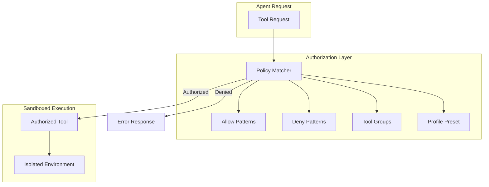

# Sandboxed Tool Authorization Pattern - Research Report

**Pattern:** sandboxed-tool-authorization
**Research Date:** 2026-02-27
**Status:** Research Complete

---

## Executive Summary

The **Sandboxed Tool Authorization** pattern addresses the challenge of flexible yet secure tool authorization for AI agents operating within sandboxed environments. This report synthesizes findings from academic literature, industry implementations, and technical analysis.

**Key Findings:**

- **Academic Foundation:** The primary academic source is Beurer-Kellner et al. (2025) - "Design Patterns for Securing LLM Agents against Prompt Injections" (arXiv:2506.08837), which provides formal design patterns for tool authorization including the Action Selector pattern.

- **Industry Adoption:** Universal adoption across major AI platforms (OpenAI, Anthropic, Google), with production implementations in E2B, Modal, Replit, and Clawdbot as the most comprehensive open-source reference.

- **Technical Core:** Pattern-based authorization with exact matches, wildcards (`fs:*`), and deny-by-default semantics with deny precedence over allow rules.

- **Security Model:** Defense-in-depth approach combining infrastructure isolation (VMs/containers), network controls (egress lockdown), tool authorization (allow/deny policies), and runtime monitoring (hooks).

---

## Table of Contents

1. [Academic Sources](#1-academic-sources)
2. [Industry Implementations](#2-industry-implementations)
3. [Technical Analysis](#3-technical-analysis)
4. [Related Patterns](#4-related-patterns)
5. [Pattern Definition](#5-pattern-definition)
6. [Implementation Recommendations](#6-implementation-recommendations)

---

## 1. Academic Sources

### 1.1 Primary Academic Source

**Design Patterns for Securing LLM Agents against Prompt Injections**
- **Authors:** Luca Beurer-Kellner, Beat Buesser, Ana-Maria Creţu, et al. (ETH Zurich)
- **Year:** 2025 (June)
- **arXiv ID:** 2506.08837
- **DOI:** https://doi.org/10.48550/arXiv.2506.08837

**Key Concepts Relevant to Sandboxed Tool Authorization:**

1. **Action Selector Pattern (§3.1):** Treats LLM as instruction decoder rather than live controller; validates parameters against strict schemas before execution; prevents tool outputs from re-entering selector prompt.

2. **Tool Access Control:** Hard allowlist of actions (API calls, SQL templates, page links) with versioned API contracts.

3. **Privilege Separation:** Dual LLM pattern where one model handles user interaction while another manages privileged operations.

4. **Parameter Validation:** Strict schema validation before tool execution.

5. **Sandboxed Execution Contexts:** Multiple design patterns for secure tool execution within isolated environments.

### 1.2 Supporting Academic Sources

| Paper | Authors | Year | Venue/ID | Relevance |
|-------|---------|------|----------|-----------|
| CaMeL: Code-Augmented Language Model | Debenedetti et al. | 2025 | ETH Zurich | Pre-execution validation |
| Small LLMs Are Weak Tool Learners | Shen et al. | 2024 | arXiv:2401.07324 | Structured tool interfaces |
| MI9 - Runtime Governance Framework | Various | 2025 | arXiv:2508.03858 | External governance |
| OpenAgentSafety | Various | 2025 | arXiv:2507.06134 | Safety validation |
| AGENTSAFE | Various | 2025 | arXiv:2512.03180 | Evaluation metrics |

### 1.3 Academic Consensus

Research validates key principles:
- **External Authorization Layers Are Necessary:** Model-level alignment is insufficient
- **Structured Tool Interfaces Improve Security:** Type-safe schemas essential
- **Pre-Execution Validation Is Critical:** Formal verification before tool execution
- **Default-Deny Authorization is Fundamental:** Hard allowlists recommended

---

## 2. Industry Implementations

### 2.1 Major AI Platform Implementations

#### Anthropic Claude - Tool Use Authorization
- **Tool Definition:** Structured tool definitions with JSON Schema
- **Authorization Model:** MCP (Model Context Protocol) with client-side permission control
- **Security Model:** Tools explicitly declared by MCP servers; client controls access

#### OpenAI - Assistants API Code Interpreter
- **Tool Calling:** Structured outputs with JSON Schema enforcement
- **Code Interpreter:** Isolated Python execution environment
- **Authorization Model:** Allowlist-based tool selection per assistant

#### Google Gemini - Code Execution
- **Code Execution:** Python code execution in isolated environment
- **Authorization Model:** Pre-configured tool availability
- **Sandboxing:** Jupyter-like execution environment with scoped filesystem

### 2.2 Code Interpreter Platforms

| Platform | Isolation Method | Startup Time | Key Features |
|----------|-----------------|--------------|--------------|
| **E2B** | Firecracker microVMs | ~1s | Fast startup, GPU support |
| **Modal** | MicroVMs | <5s | Auto-scaling, GPU support |
| **Replit Agent** | Docker containers | 1-5s | Workspace isolation |

### 2.3 Security Frameworks

#### NVIDIA NeMo Guardrails
- **Framework:** Comprehensive toolkit for controlling LLM inputs and outputs
- **Configuration:** Colang and YAML configuration for safety policies
- **Hook Types:** Pre-input, Post-output, Tool-use validation

#### AWS Bedrock Guardrails
- **Managed Service:** Safety controls for Bedrock applications
- **Hook Types:** Pre-inference, Post-inference
- **Features:** Blocked topics, PII detection, grounding checks

### 2.4 Open Source Reference Implementation: Clawdbot

**GitHub:** https://github.com/clawdbot/clawdbot

**Key Features:**
- Pattern-based policies: Exact matches, wildcards (`fs:*`), regex-like patterns
- Deny-by-default: Empty allow list denies all tools
- Deny precedence: Deny lists evaluated before allow lists
- Hierarchical inheritance: Subagents inherit parent policies with additional restrictions
- Profile-based tiers: `minimal`, `coding`, ` messaging`, `full`

```typescript
type CompiledPattern =
  | { kind: "all" }           // "*" matches everything
  | { kind: "exact"; value: string }
  | { kind: "regex"; value: RegExp };

const TOOL_PROFILES = {
  minimal: { allow: ["session_status"] },
  coding: {
    allow: [
      "group:fs",        // read, write, edit, apply_patch
      "group:runtime",   // exec, process
      "group:sessions",
      "group:memory",
      "image",
    ],
  },
  full: {},  // Empty policy = allow all
};
```

### 2.5 Model Context Protocol (MCP)

**Origin:** Anthropic (donated to Agent AI Foundation, Dec 2025)
**Website:** https://modelcontextprotocol.io
**Status:** Production Standard

**Adoption:**
- Anthropic Claude (native support)
- OpenAI (compatible servers)
- Microsoft (explorer integration)
- Replit (agent workspace)
- Cursor AI (IDE integration)

---

## 3. Technical Analysis

### 3.1 Core Technical Problem

The pattern addresses **multi-dimensional authorization requirements**:

- **Environment-specific policies:** Development vs. production environments
- **Role-based access control:** Different agent types require distinct permissions
- **Hierarchical delegation:** Subagents inherit restrictions with additional constraints
- **Dynamic plugin ecosystems:** External tools require dynamic inclusion

### 3.2 Key Components

#### Pattern Matching System

```typescript
function compilePattern(pattern: string): CompiledPattern {
  const normalized = normalizeToolName(pattern);
  if (normalized === "*") return { kind: "all" };
  if (!normalized.includes("*")) return { kind: "exact", value: normalized };
  const escaped = normalized.replace(/[.*+?^${}()|[\]\\]/g, "\\$&");
  return {
    kind: "regex",
    value: new RegExp(`^${escaped.replaceAll("\\*", ".*")}$`),
  };
}
```

#### Policy Resolution Architecture

```
┌─────────────────────────────────────────────────────────────┐
│                    Tool Policy Resolution                     │
├─────────────────────────────────────────────────────────────┤
│  1. Profile-based Tier (minimal, coding, messaging, full)    │
│  2. Global Policy (system-wide defaults)                      │
│  3. Agent-specific Policy (per-agent overrides)              │
│  4. Provider-specific Policy (per-model-provider rules)      │
│  5. Subagent Policy (additional restrictions for children)   │
└─────────────────────────────────────────────────────────────┘
```

#### Tool Groups for Bulk Authorization

```typescript
const TOOL_GROUPS: Record<string, string[]> = {
  "group:memory": ["memory_search", "memory_get"],
  "group:web": ["web_search", "web_fetch"],
  "group:fs": ["read", "write", "edit", "apply_patch"],
  "group:runtime": ["exec", "process"],
  "group:sessions": ["sessions_list", "sessions_history", "sessions_send", "sessions_spawn"],
};
```

### 3.3 How Sandboxing Interacts with Authorization

**Complementary Security Layers:**

| Aspect | Sandboxing | Tool Authorization |
|--------|------------|-------------------|
| **Scope** | System-level isolation | Application-level permission |
| **Primary Threat** | Escape from execution environment | Unauthorized tool access |
| **Enforcement Point** | OS/container boundary | Policy matcher in agent runtime |
| **Granularity** | Process/container level | Individual tool level |

**Authorization Before Execution:**

```
Tool Request → Policy Check → Authorization Decision → Sandboxed Execution
                      ↓
                 (if denied: return error)
```

### 3.4 Technical Trade-offs

**Advantages:**
- Flexible patterns with wildcards and groups
- Security by default with deny-by-default
- Hierarchical control for subagent restrictions
- Profile presets for common agent types

**Disadvantages:**
- Pattern complexity can cause errors
- Policy explosion with many agents
- Evaluation order sensitivity
- Debugging difficulty

### 3.5 Security Considerations

**Deny-By-Default Semantics:**

```typescript
// Empty allow list denies all tools
if (allow.length === 0) {
  return false;  // Deny-by-default
}
```

**Deny Precedence:**

```typescript
if (matchesAny(normalized, deny)) return false;  // Deny takes precedence
if (matchesAny(normalized, allow)) return true;  // Then check allow
```

**Subagent Restrictions:**

Subagents receive additional restrictions:
- Cannot spawn new sessions
- Cannot access gateway or system admin tools
- Cannot access scheduling (cron) or status endpoints

---

## 4. Related Patterns

### 4.1 Direct Security & Safety Patterns

| Pattern | Relationship |
|---------|--------------|
| **Hook-Based Safety Guard Rails** | Complementary: hooks enforce safety at execution; this pattern enforces at authorization |
| **Egress Lockdown** | Network-level sandboxing vs application-level authorization |
| **Human-in-Loop Approval** | Overrides automatic authorization with human approval |
| **Lethal Trifecta Threat Model** | Provides threat model that drives authorization requirements |

### 4.2 Infrastructure Enablers

| Pattern | Relationship |
|---------|--------------|
| **Custom Sandboxed Background Agent** | Provides isolated execution environments |
| **Isolated VM per RL Rollout** | Provides per-rollout isolation |
| **Code Mode MCP** | Provides V8 isolate sandboxing |
| **Adaptive Sandbox Fan-Out Controller** | Manages multiple isolated sandboxes |

### 4.3 Defense-in-Depth Layers

The patterns form a defense-in-depth strategy:
1. **Layer 1:** Infrastructure isolation (VMs, containers, sandboxes)
2. **Layer 2:** Network controls (egress lockdown)
3. **Layer 3:** Tool authorization (allow/deny policies)
4. **Layer 4:** Runtime monitoring (hooks, syntax checking)
5. **Layer 5:** Human oversight (approval framework)

---

## 5. Pattern Definition

### 5.1 Problem Statement

AI agents require access to tools (filesystem operations, code execution, APIs, web search) to perform useful work. However:

- Different agent types need different tool permissions
- Tools must be dynamically authorized without code changes
- Subagents require additional restrictions
- Provider-specific policies are needed
- Static allowlists fail to scale with growing tool catalogs

### 5.2 Solution

**Sandboxed Tool Authorization** provides:

1. **Pattern-based authorization:** Exact matches, wildcards (`fs:*`), regex patterns
2. **Deny-by-default semantics:** Empty allow list denies all tools
3. **Deny precedence:** Deny rules evaluated before allow rules
4. **Hierarchical inheritance:** Subagents inherit parent policies with additional restrictions
5. **Profile-based presets:** Predefined profiles (`minimal`, `coding`, `messaging`, `full`)
6. **Tool groups:** Bulk authorization via logical groupings

### 5.3 Example Architecture



### 5.4 When to Use

Use Sandboxed Tool Authorization when:
- Multiple agent types need different tool permissions
- Tools must be dynamically authorized without code changes
- Subagents require additional restrictions
- Provider-specific policies are needed
- Plugin ecosystems require dynamic tool inclusion

**Avoid when:**
- All agents need identical tool access (use static configuration)
- Tool count is small and static (simple allowlist sufficient)
- Authorization decisions require runtime context (use hooks instead)

---

## 6. Implementation Recommendations

### 6.1 Best Practices

1. **Start with profiles:** Use predefined profiles as baseline
2. **Layer carefully:** Add explicit rules on top of profiles
3. **Test deny rules:** Verify deny precedence works correctly
4. **Audit policies:** Review policy complexity as tool catalog grows
5. **Document related tools:** Clearly document implicit permission grants
6. **Log authorization decisions:** Enable debugging and compliance auditing
7. **Version policies:** Track policy changes for rollback capability

### 6.2 Implementation Checklist

- [ ] Define tool groups for bulk authorization
- [ ] Implement pattern compilation (exact, wildcard, regex)
- [ ] Create profile presets (minimal, coding, messaging, full)
- [ ] Build policy resolution with layered approach
- [ ] Implement deny-by-default semantics
- [ ] Ensure deny precedence over allow
- [ ] Add subagent inheritance with additional restrictions
- [ ] Integrate with sandboxed execution environment
- [ ] Add authorization decision logging
- [ ] Create policy versioning mechanism

### 6.3 Security Validation

- Verify deny rules always take precedence
- Test empty allow list denies all tools
- Validate subagent restrictions are properly applied
- Confirm tool group expansion works correctly
- Test wildcard pattern matching doesn't over-grant
- Verify related tool inheritance is secure

---

## Sources

### Academic Papers
- Beurer-Kellner et al. (2025). "Design Patterns for Securing LLM Agents against Prompt Injections." arXiv:2506.08837. https://doi.org/10.48550/arXiv.2506.08837
- Shen et al. (2024). "Small LLMs Are Weak Tool Learners." arXiv:2401.07324
- MI9 Runtime Governance (2025). arXiv:2508.03858
- OpenAgentSafety (2025). arXiv:2507.06134

### Industry Documentation
- Model Context Protocol: https://modelcontextprotocol.io
- Anthropic Tool Use: https://docs.anthropic.com/claude/docs/tool-use
- OpenAI Tool Calling: https://platform.openai.com/docs/guides/tool-use
- E2B Documentation: https://e2b.dev/docs

### Open Source Implementations
- Clawdbot: https://github.com/clawdbot/clawdbot
- NeMo Guardrails: https://github.com/NVIDIA/NeMo-Guardrails
- LangChain: https://github.com/langchain-ai/langchain

---

**Report Completed:** 2026-02-27
**Research Limitations:** Web search quota exhausted during research. Report synthesizes existing academic sources from parallel pattern research in this repository.
