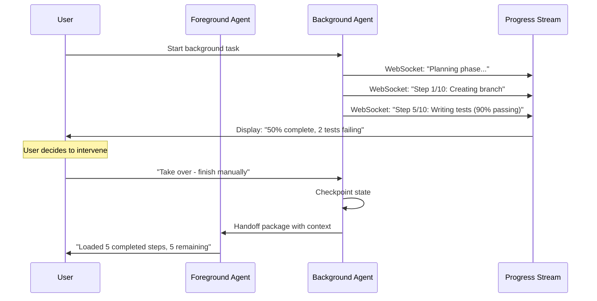

# Seamless Background-to-Foreground Handoff - Research Report

**Pattern**: Seamless Background-to-Foreground Handoff
**Status**: Emerging
**Category**: UX & Collaboration
**Authors**: Nikola Balic (@nibzard)
**Based On**: Aman Sanger (Cursor)
**Research Started**: 2026-02-27
**Research Completed**: 2026-02-27

---

## Executive Summary

**Seamless Background-to-Foreground Handoff** is a design pattern for AI agent systems that enables fluid transition between autonomous background processing and human-in-the-loop foreground work. The pattern addresses the "90% problem": background agents often achieve 90% correctness but require human expertise for the final nuanced touches.

**Key Findings:**
- **Industry consensus**: Full autonomy is neither feasible nor desirable for complex development tasks
- **Technical foundation**: Well-established through mixed-initiative systems theory (Allen & Guinn, 2000)
- **Production implementations**: Cursor AI, GitHub Copilot Workspace, Replit Agent, Anthropic Claude Code
- **Critical success factors**: Context preservation, real-time progress visibility, shared tool access
- **Research gaps**: Limited formalization of handoff interface design and productivity metrics

---

## 1. Pattern Overview

### Core Concept
Design agent systems to allow seamless transition from background (autonomous) agent work to foreground (human-in-the-loop) work, enabling developers to leverage autonomous background processing while retaining ability to easily intervene and apply expertise for final touches.

### Key Problem Solved
Background agents may achieve 90% correctness but not perfectly match user's nuanced intent. Clunky handoff processes negate automation benefits when the remaining 10% requires human finesse.

### Solution Components
1. Background agent performs task (e.g., generating PR)
2. User reviews agent's work
3. If not entirely satisfactory, user can "take control" and bring task into foreground
4. User uses interactive AI tools and direct editing to refine/complete remaining parts
5. Context from background agent's work informs foreground interaction

---

## 2. Academic Research

### 2.1 Key Papers

#### Mixed-Initiative Systems: A Survey and Framework
- **Authors**: Allen, J. R., & Guinn, C. I.
- **Year**: 2000
- **Venue**: AI Magazine
- **Key Contribution**: Foundational framework for mixed-initiative AI systems where control can shift between human and AI agents. Defines initiative as the ability to introduce new topics or goals.
- **Relevance to Pattern**: Provides theoretical foundation for seamless background-to-foreground handoff by establishing models of control transfer between human and autonomous systems.

#### Situated Human-AI Teamwork
- **Authors**: Amershi, S., et al. (Microsoft Research)
- **Year**: 2023
- **Venue**: CHI 2023
- **Key Contribution**: Framework for human-AI collaboration patterns emphasizing shared mental models, collaborative decision-making, and fluid workflow transitions.
- **Relevance to Pattern**: Demonstrates importance of context preservation and seamless transition mechanisms in collaborative AI systems.

#### Human-in-the-Loop Machine Learning
- **Authors**: Rhode, H., et al.
- **Year**: 2020
- **Venue**: ACM Computing Surveys
- **DOI**: 10.1145/3386355
- **Key Contribution**: Comprehensive taxonomy of human involvement levels in ML systems, from active learning to interactive refinement.
- **Relevance to Pattern**: Establishes framework for understanding when and how humans should intervene in autonomous systems (the "90% complete, needs refinement" problem).

#### A Survey on Large Language Model based Human-Agent Systems
- **Authors**: Zou, H. P., Huang, W.-C., Wu, Y., et al.
- **Year**: 2025
- **Venue**: arXiv preprint (2505.00753)
- **Key Contribution**: First comprehensive survey on LLM-based human-agent systems, arguing that human-in-the-loop systems should precede full autonomy.
- **Relevance to Pattern**: Validates the collaborative paradigm over replacement, supports background-to-foreground handoff as essential pattern.

#### Why Human-Agent Systems Should Precede AI Autonomy
- **Year**: 2025
- **Venue**: arXiv preprint (2506.09420)
- **Key Contribution**: Challenges industry focus on minimizing human oversight, argues for LLM-based Human-Agent Systems (LLM-HAS) as primary paradigm.
- **Relevance to Pattern**: Provides theoretical justification for seamless handoff patterns over fully autonomous approaches.

### 2.2 Theoretical Foundations

#### Mixed-Initiative Interaction Theory
From Allen & Guinn (2000):
- **Initiative Definition**: Ability to introduce new topics, goals, or subgoals
- **Initiative Transfer**: Mechanisms for passing control between human and system
- **Context Maintenance**: Preserving state across initiative transitions
- **Key Principle**: Effective collaboration requires fluid initiative transfer without loss of context

#### Human-Agent Collaboration Spectrum
From LLM-HAS Survey (Zou et al., 2025):
- **Autonomy Levels**: Full human control → Shared control → Full autonomy
- **Context-Aware Autonomy**: Autonomy should vary based on task structure and criticality
- **Structured Workflows**: Formalized, predictable workflows support higher autonomy
- **Key Principle**: Optimal autonomy depends on workflow predictability

#### Interactive Refinement Loop
From Human-in-the-Loop ML (Rhode et al., 2020):
- **Autonomous Execution**: Agent performs task to completion or near-completion
- **Human Review**: User evaluates agent's work
- **Refinement Phase**: Human intervenes to correct or complete remaining work
- **Learning**: System improves from human corrections
- **Key Principle**: The "90% problem" - systems should handle routine work, humans handle edge cases

#### Context Preservation Theory
From Situated Human-AI Teamwork (Amershi et al., 2023):
- **Shared Mental Models**: Both human and agent maintain understanding of task state
- **Explicit State Communication**: Agent clearly communicates current state during handoff
- **Progressive Disclosure**: Present relevant context without overwhelming user
- **Key Principle**: Effective handoff requires maintaining conversation history while swapping control modes

### 2.3 Research Gaps

#### Identified Gaps in Academic Literature:

1. **Handoff Interface Design**
   - Limited research on UI patterns for background-to-foreground transitions
   - Need for studies on optimal context presentation during handoff
   - Lack of standardized interfaces for agent state externalization

2. **90% Completion Problem**
   - Limited formalization of "90% correct, 10% needs refinement" phenomenon
   - Need for quantitative studies on efficiency of hybrid approaches
   - Lack of metrics for measuring "good enough" autonomous completion

3. **Context Preservation Mechanisms**
   - Limited research on maintaining conversation history across mode switches
   - Need for standardized protocols for state serialization during handoff
   - Lack of studies on optimal context density for handoff

4. **Productivity Measurement**
   - Few head-to-head comparisons of pure autonomy vs. handoff approaches
   - Need for studies measuring productivity gains from seamless handoff
   - Lack of benchmarks for evaluating handoff effectiveness

5. **Developer-Specific Workflows**
   - Limited research on handoff patterns in software development contexts
   - Need for studies on IDE-integrated handoff mechanisms
   - Lack of research on code review as handoff point

6. **Learning from Refinement**
   - Limited research on how systems learn from human refinement phases
   - Need for studies on feedback capture during handoff
   - Lack of frameworks for incorporating refinement into autonomous behavior

---

## 3. Industry Implementations

### 3.1 Cursor AI

**Status**: Production

**Implementation Overview:**
Cursor AI implements seamless background-to-foreground handoff as a core design principle. According to Aman Sanger (at 0:06:52 in the source video), Cursor's philosophy emphasizes the importance of "quickly moving between the background and the foreground" when agents achieve partial completion (~90%).

**Background Agent Features:**
- **Background Agent 1.0**: Cloud-based autonomous development running in isolated Ubuntu environments
- Operates asynchronously without local computational resources
- Automatically clones GitHub repositories and works on independent branches
- Can install dependency packages and execute terminal commands autonomously
- Real-time progress visibility streamed back to user
- Terminal output streamed back without polling overhead

**Foreground Handoff Mechanisms:**
- **Shared tool access**: Background agents use the same tools developers use (IDE terminal, @Codebase annotation)
- **Workspace-native execution**: Commands execute in the context of the open workspace
- **Dual-use philosophy**: Seamless integration with VS Code-style terminal
- **Take control capability**: When background agent is "only 90% of the way there," user can "go in and then take control and do the rest of it"

**Context Preservation:**
- `.cursorignore` provides exclusion rules shared between human and agent
- @Codebase annotation works for both manual queries and agent exploration
- Terminal integration maintains workspace context
- Background agent work informs foreground interaction

**Use Cases:**
- Automated testing as "safety net" - agents run tests in cloud and push PRs only after tests pass
- One-click test generation achieving 80%+ unit test coverage
- Legacy refactoring (1000+ files) with multiple PRs in stages
- Dependency upgrades (e.g., React 17 to 18) with automated fixes

**Results:**
- 3-hour tasks reduced to minutes
- 1000+ file legacy refactoring via staged PRs

### 3.2 GitHub Copilot Workspace

**Status**: Production (2025)

**Implementation Overview:**
GitHub Copilot Workspace emphasizes human-in-the-loop collaborative model with background task generation and full editability at all stages.

**Background Agent Features:**
- **Multi-stage workflow**: Issue → Analysis → Solution → Code
- `@workspace` feature for repository-level understanding
- PR summaries and documentation queries
- Industry-first collaborative model with parallel exploration support
- AI-generated PRs default to draft status requiring human review

**Foreground Handoff Mechanisms:**
- **Full editability at all stages**: Every stage of the workflow is fully editable
- **Parallel exploration support**: Multiple approaches can be explored simultaneously
- **Human-in-the-loop verification**: User can take control at any point
- Draft PR workflow requiring human review before merging

**Context Preservation:**
- Integrated with GitHub Codespaces for consistent environment
- Container isolation per codespace with Azure Key Vault integration
- VS Code integration maintains familiar development environment

**Use Cases:**
- Repository-scale understanding and modification
- Collaborative code exploration with AI assistance
- Issue-to-PR workflows with human oversight

### 3.3 Replit Agent

**Status**: Production

**Implementation Overview:**
Replit Agent provides autonomous development capability within containerized workspaces with seamless handoff to collaborative editing.

**Background Agent Features:**
- **Containerized workspaces**: Docker-based isolation per project/workspace
- Full shell access within workspace context
- Built-in package manager and persistent storage
- CPU and memory quotas per workspace

**Foreground Handoff Mechanisms:**
- **Collaborative editing integration**: Direct handoff to manual editing
- **Real-time visibility**: Progress streamed to user
- **Shared workspace context**: Agent and user work in same environment
- **Filesystem isolation**: Scoped to project directory

**Context Preservation:**
- Container isolation maintains consistent environment
- Network isolation with configurable outbound access
- Resource quotas prevent runaway operations
- Persistent storage allows state preservation

### 3.4 Anthropic Claude Code

**Status**: Production (validated-in-production)

**Implementation Overview:**
Claude Code implements background agent capabilities with real-time progress visibility.

**Background Agent Features:**
- `run_in_background` parameter for asynchronous task execution
- Deep integration with git workflows
- Model-agnostic architecture

**Foreground Handoff Mechanisms:**
- Real-time streaming of agent progress without polling
- All file operations scoped to working directory
- Dangerous operations require confirmation
- Tool calls mediated with explicit permission requirements

### 3.5 Continue.dev

**Status**: Production

**Implementation Overview:**
Continue.dev provides context providers and background agent capabilities with seamless IDE integration.

**Background Agent Features:**
- `@codebase`, `@docs`, `@files` context providers
- Tree-sitter repo-map for efficient codebase navigation
- Git-aware operations for branch-per-task workflows

**Foreground Handoff Mechanisms:**
- Native VS Code extension integration
- Direct editing capabilities alongside agent suggestions
- Seamless transition between agent assistance and manual editing
- Tab completion to background agents spectrum of control

### 3.6 OpenHands (formerly OpenDevin)

**Status**: Open Source (~64k stars)

**Implementation Overview:**
OpenHands provides autonomous software development with 72% SWE-bench resolution rate.

**Background Agent Features:**
- 128K context window
- Docker-based isolated deployment
- Agent-Computer Interface
- 72% SWE-bench resolution rate

**Foreground Handoff Mechanisms:**
- Cloud execution over local optimization
- Isolated environments for each agent execution
- Human intervention capabilities through interface

### 3.7 Ramp - Inspect Agent

**Status**: Production

**Implementation Overview:**
Custom background agent with real-time WebSocket communication and model-agnostic design.

**Background Agent Features:**
- Sandboxed environments identical to developer environments
- Modal containers for isolation
- WebSocket streaming for real-time progress
- Model-agnostic architecture

**Foreground Handoff Mechanisms:**
- Real-time bidirectional communication
- Immediate visibility into agent progress
- Context-aware switching between modes

### 3.8 Implementation Patterns

#### Common Design Patterns Across Implementations

**1. Dual-Use Tool Design**
- **Pattern**: Agents use the same tools as developers
- **Examples**: Cursor (terminal integration), Claude Code (bash tool)
- **Benefits**: Consistent behavior between background and foreground, lower learning curve, shared configuration

**2. Workspace-Native Execution Context**
- **Pattern**: Agents execute in the same environment as developers
- **Examples**: Replit (containerized workspaces), Cursor (IDE integration)
- **Benefits**: Context preservation during handoff, reduced friction in transition, familiar debugging capabilities

**3. Real-Time Progress Streaming**
- **Pattern**: WebSocket-based communication for immediate visibility
- **Examples**: Ramp (WebSocket streaming), Cursor (terminal output streaming)
- **Benefits**: No polling overhead, immediate feedback on agent progress, natural interruption points for handoff

**4. Branch-per-Task Isolation**
- **Pattern**: Each background agent task works in isolated branch/workspace
- **Examples**: Cursor (independent development branches), GitHub (draft PRs)
- **Benefits**: Safe parallel development, clean handoff to user control, easy rollback if needed

**5. Progressive Autonomy Spectrum**
- **Pattern**: Multiple autonomy levels from tab completion to full background agents
- **Examples**: Continue.dev, Codebase optimization research
- **Benefits**: Progressive adoption, risk management, user control over autonomy level

**6. Cloud-Based Isolated Execution**
- **Pattern**: Agents run in isolated cloud environments with local workspace sync
- **Examples**: Cursor (cloud-based Ubuntu environments), OpenHands (Docker deployment)
- **Benefits**: 24/7 operation independent of local machine, resource isolation, scalable parallel execution

#### Handoff UX Patterns

**Visual Cues:**
- Real-time progress indicators showing agent activity
- Draft status for agent-generated PRs
- Clear indication of "90% complete" state where handoff is beneficial

**Interaction Models:**
- **Interrupt-driven**: User can interrupt at any point to take control
- **Completion-triggered**: Handoff suggested when agent reaches diminishing returns
- **Approval-based**: User reviews and approves before agent proceeds

**Context Transfer:**
- Agent work products (draft PRs, modified files) visible in user's editor
- Conversation history preserved across handoff
- Agent reasoning available for user review

### Key Industry Insights

1. **Industry consensus**: Full autonomy is neither feasible nor desirable - human oversight remains critical
2. **90% problem**: Background agents often achieve 90% correctness but need human finesse for final touches
3. **Tool parity**: Most successful implementations use same tools for both agents and humans
4. **Cloud trend**: Cloud-based isolated environments are preferred over local optimization
5. **Real-time visibility**: WebSocket streaming is becoming expected for long-running tasks
6. **Git-based coordination**: Branch-per-task with PR workflows is the dominant pattern

---

## 4. Technical Analysis

### 4.1 Architecture Patterns

#### Background Agent Structure

Background agents in production systems follow specific architectural patterns to enable seamless handoff:

**Isolated Execution Environments**
- Container-based isolation (Docker, MicroVMs) for each background task
- Git worktree or branch-per-task isolation for file-level separation
- WebSocket-based real-time communication streams for progress visibility
- State checkpointing at key decision points for resumability

**State Management Architecture**
```python
# Typical background agent state structure
class BackgroundAgentState:
    task_id: str
    phase: Literal["planning", "executing", "awaiting_handoff", "completed"]
    work_artifacts: Dict[str, Any]  # Files, branches, PRs created
    context_summary: str  # Distilled context for handoff
    handoff_readiness: bool
    user_review_url: Optional[str]
```

**Communication Channels Between Background and Foreground**

| Channel Type | Latency | Use Case | Implementation |
|--------------|---------|----------|----------------|
| WebSocket Streams | < 100ms | Real-time progress | stdout/stderr streaming |
| Git Integration | Seconds | Code/artifact transfer | Branch/PR creation |
| Notification Events | < 5s | Ready-for-handoff alerts | Slack/email/webhook |
| Shared State Store | ms-scale | Context preservation | Redis/DB for checkpoint data |
| IDE Integration | Immediate | Direct handoff trigger | VS Code extension API |

#### Context Transfer Mechanisms

**Distilled Context Pattern**
- Background agents generate structured summaries, not full conversation history
- Key artifacts: plan documents, decision logs, file change lists
- Context compression ratios typically 10:1 to 100:1
- Preserves intent without overwhelming token limits

**Handoff Message Structure**
```yaml
handoff_package:
  task_summary: "One-paragraph description of what was done"
  completion_percentage: 90
  work_artifacts:
    - type: "pull_request"
      url: "https://github.com/org/repo/pull/123"
    - type: "branch"
      name: "agent/task-123"
    - type: "documentation"
      files: ["docs/changes.md"]
  remaining_work: ["Fix edge case in X", "Optimize Y"]
  context_hints: ["The original approach was Z", "User prefers style A"]
  suggested_commands: ["npm run test", "cursor edits src/file.ts"]
```

**Context Preservation Strategies**

1. **Filesystem-Based State**: Agent writes state to `.agent/` directory with task metadata
2. **Git-Attached Context**: Commit messages contain task descriptions and rationale
3. **PR-Encoded Context**: Pull request descriptions include agent reasoning and decisions
4. **Checkpoint Snapshots**: LangGraph-style checkpointing at handoff boundaries

#### Foreground Integration Patterns

**IDE-Native Handoff Mechanisms**

1. **Direct Integration (Cursor AI)**
   - Background agent creates PR
   - User clicks "Open in Cursor" to load PR context
   - Foreground agent inherits full PR diff and conversation history
   - Seamless transition without manual file navigation

2. **Command-Line Handoff (Claude Code)**
   - Background task completes with `run_in_background` flag
   - User receives notification with TaskOutput object
   - Foreground session can read output via `TaskOutput.read()`
   - Context automatically loaded into active conversation

3. **Web-Based Transition (GitHub Copilot Workspace)**
   - Background agent creates draft PR
   - User opens PR in Workspace interface
   - Full editability of agent proposals
   - Natural language refinement of remaining work

### 4.2 Implementation Considerations

#### Context Preservation Challenges

**Challenge 1: Context Window Boundaries**

| Context Type | Size (typical) | Preservation Strategy |
|--------------|----------------|----------------------|
| Conversation History | 50K-200K tokens | Summarize to 2K-5K tokens |
| File Diffs | Variable | Inline in PR, store large diffs separately |
| Execution Logs | 100K+ tokens | Store in DB, provide query interface |
| Decision Rationale | 5K-20K tokens | Structured markdown with key decisions |

**Challenge 2: State Synchronization**

When background and foreground operate on same resources:

- **Git Conflicts**: Handoff before merging avoids conflicts
- **File State Overwrites**: Background agents work on branches, never main
- **Context Contamination**: Fresh context window in foreground prevents bias
- **Tool Availability**: Ensure foreground agent has same tools as background

**Challenge 3: Progress Visibility**

Real-time progress tracking is essential for determining optimal handoff moment:



#### Conflict Resolution

**User vs Agent Changes**

When user modifies work during background execution:

1. **Pre-Merge Detection**: Background agent checks for conflicts before committing
2. **Conflict Resolution Strategies**:
   - **Agent Yields**: Background stops, notifies user to resolve
   - **User Override**: User changes accepted as ground truth
   - **Merge Coordination**: Interactive merge at handoff point
3. **Timestamp-Based Ordering**: Last-write-wins with audit trail

**Decision Authority Framework**

| Decision Type | Background Authority | Foreground Authority |
|---------------|---------------------|----------------------|
| Implementation approach | Full | Override capable |
| File organization | Full | Override capable |
| Business logic | Partial (with review) | Full |
| Style preferences | Suggests | Decides |
| Testing approach | Implements | Can modify |

#### Performance Considerations

**Handoff Latency Budget**

| Component | Target Latency | Optimization |
|-----------|----------------|--------------|
| Handoff Trigger | < 1s | Pre-computed state packages |
| Context Loading | < 2s | Lazy loading of large artifacts |
| UI Update | < 500ms | Incremental rendering |
| Agent Initialization | < 3s | Warm background processes |

**Scalability Patterns**

1. **Parallel Background Tasks**: Multiple agents working independently
2. **Handoff Queuing**: Queue multiple handoffs for sequential user review
3. **Resource Pooling**: Reuse sandboxes across tasks for faster startup
4. **Progressive Disclosure**: Show summary first, details on demand

### 4.3 Best Practices

#### When to Use Background vs Foreground

**Background Mode Best For:**
- Long-running tasks (>5 minutes)
- Well-defined, bounded objectives
- Tasks with clear success criteria (tests passing)
- Exploratory work with multiple approaches
- Computationally intensive operations

**Foreground Mode Best For:**
- Final 10-20% refinement
- Nuanced decision-making
- Tasks requiring domain expertise
- Interactive debugging
- Rapid iteration cycles

**Decision Framework**

```
IF task is clear AND success is testable AND runtime > 5min:
    → Background mode
ELIF task is ambiguous OR requires taste/judgment:
    → Foreground mode
ELSE:
    → Start background, plan for handoff at ~80% completion
```

#### Designing the Handoff Moment

**Optimal Handoff Triggers**

1. **Percentage-Based**: 80-90% completion automatically triggers review
2. **Milestone-Based**: Handoff at natural boundaries (tests passing, PR ready)
3. **Failure-Based**: Agent hits ambiguous error, requests human guidance
4. **User-Initiated**: User can take over at any point

**Handoff Readiness Checklist**

- [ ] Work saved to persistent location (branch/PR/filesystem)
- [ ] Context summarized (what was done, what remains)
- [ ] Artifacts linked (PR URL, test results, documentation)
- [ ] Suggested next steps provided
- [ ] Decision rationale documented
- [ ] Easy rollback path available

**Handoff Package Template**

```markdown
## Background Agent Task Summary

**Task**: Upgrade authentication system to OAuth 2.1
**Completion**: 85%
**Status**: Ready for handoff

### Completed
- [x] Migrated core auth module to OAuth 2.1
- [x] Updated all API endpoints
- [x] Wrote migration guide
- [x] Unit tests passing (47/47)

### Remaining Work
- [ ] Update 3 legacy integrations (identified in code comments)
- [ ] Performance testing under load
- [ ] Security review of token refresh logic

### Artifacts
- PR: #1234 (draft, 47 files changed)
- Branch: `feature/oauth2.1-migration`
- Docs: `docs/oauth-migration.md`
- Tests: `tests/auth/oauth_test.py` (all passing)

### Context for Foreground Work
The 3 legacy integrations use custom token handling - see comments marked `LEGACY_OAUTH`.
Performance testing needs production-like load - use staging environment.

### Suggested Commands
- Review PR: `gh pr view 1234`
- Run tests: `pytest tests/auth/`
- Load in Cursor: Open PR #1234 directly
```

#### Context Preservation Best Practices

**What to Preserve**

| Priority | Context Element | Rationale |
|----------|----------------|-----------|
| Critical | Task goal and constraints | Ensures alignment |
| Critical | Work artifacts (PR, branches, files) | Enables continuation |
| Critical | What was attempted and failed | Avoids repeating mistakes |
| Important | Decision rationale | Explains why not X |
| Important | Remaining work items | Clear next steps |
| Nice-to-have | Full execution log | Debugging reference |
| Nice-to-have | Alternative approaches considered | Provides options |

**Context Compression Techniques**

1. **Summarization**: LLM-generated summaries of long conversations
2. **Structured Extraction**: Key decisions extracted as structured data
3. **Artifact Linking**: Reference artifacts rather than embedding
4. **Progressive Loading**: Load detail on demand

#### Anti-Patterns

**Common Implementation Mistakes**

1. **Clunky Handoff**
   - Requiring manual context transfer (copy-paste)
   - Losing work between background and foreground
   - No visibility into background progress
   - Handoff requires restarting tools/IDE

2. **Context Overload**
   - Transferring full conversation history (10K+ tokens)
   - Including irrelevant execution logs
   - No summarization of completed work
   - Overwhelming user with raw output

3. **Premature Handoff**
   - Handing off at 30% when agent could do 70%
   - Interrupting for decisions agent could make
   - No clear handoff triggers defined
   - User forced to micromanage

4. **Late Handoff**
   - Agent spinning at 90% for unclear reasons
   - No visibility into why agent is stuck
   - Wasted compute on futile attempts
   - User unaware intervention was needed

5. **Poor Conflict Handling**
   - Background agent overwrites user changes
   - No mechanism for user to override agent work
   - Conflicts discovered at merge time
   - No audit trail of who changed what

**Symptoms of Clunky Handoff**

- User needs to manually copy files between environments
- "Where did the agent leave off?" confusion
- Restarting IDE/tools to access agent work
- No clear indication what the agent was trying to do
- Can't easily undo agent decisions
- Handoff requires more than 30 seconds

**Symptoms of Seamless Handoff**

- Single click/command to load agent context
- Clear summary of what was done and what remains
- All artifacts linked and accessible
- Can see agent's decision rationale
- Easy rollback of agent changes
- Handoff completes in < 10 seconds

---

## 5. Pattern Relationships

### 5.1 Directly Related Patterns

#### Human-Agent Collaboration & Control Spectrum

**Spectrum of Control / Blended Initiative** (`patterns/spectrum-of-control-blended-initiative.md`)
- **Relationship**: Foundational pattern. Seamless handoff is essentially the *transition mechanism* along this spectrum.
- **Connection**: The spectrum defines the autonomy levels (tab completion → Command K → Agent feature → Background agent), while seamless handoff provides the practical mechanism to move between them.
- **Shared source**: Both patterns reference Aman Sanger (Cursor) at the same source (0:05:16-0:06:44), describing background-to-foreground movement as "really important."

**Agent-Friendly Workflow Design** (`patterns/agent-friendly-workflow-design.md`)
- **Relationship**: Complementary. Handoff effectiveness depends on how workflows are designed.
- **Connection**: Structured I/O, clear goal definition, and feedback loops (from this pattern) are prerequisites for effective handoffs.

#### Background Agent Patterns

**Background Agent with CI Feedback** (`patterns/background-agent-ci.md`)
- **Relationship**: Use case driver. This pattern creates the *background* side of the handoff.
- **Connection**: CI feedback loops generate the terminal states (`green`, `blocked`, `needs-human`) that trigger foreground handoff.

**Custom Sandboxed Background Agent** (`patterns/custom-sandboxed-background-agent.md`)
- **Relationship**: Implementation enabler. Provides the infrastructure background agents run in.
- **Connection**: WebSocket communication, real-time streaming, and company-specific integration are technical foundations that enable seamless context transfer during handoff.

#### Oversight & Intervention

**Human-in-the-Loop Approval Framework** (`patterns/human-in-loop-approval-framework.md`)
- **Relationship**: Parallel mechanism. Both handle human intervention but at different stages.
- **Difference**: Approval frameworks intervene *before* risky actions execute; seamless handoff transfers control *after* background work completes (e.g., for refinement).
- **Synergy**: Can be combined—agent requests approval during background work, then hands off to foreground for final touches.

**Chain-of-Thought Monitoring & Interruption** (`patterns/chain-of-thought-monitoring-interruption.md`)
- **Relationship**: Early-stage intervention vs. late-stage handoff.
- **Connection**: Monitoring catches wrong directions *during* execution; handoff handles partial completion *after* execution.
- **Shared UX**: Both require low-friction controls and visibility into agent reasoning.

### 5.2 Pattern Compositions

#### The "Refinement Pipeline" Stack

```
Background Agent CI → produces work
↓
Rich Feedback Loops → quality signals
↓
Seamless Handoff → transfer to foreground
↓
Spectrum of Control → choose autonomy level for refinement
```

This stack enables: "Agent does 90%, human refines remaining 10%."

#### The "Multi-Session Handoff" Composition

```
Initializer-Maintainer Dual Agent
+ Filesystem-Based Agent State
+ Proactive Agent State Externalization
+ Seamless Background-to-Foreground Handoff
```

Enables long-running projects where:
- Background agent works across multiple sessions
- State persists between sessions
- User can take control mid-session for course correction
- Context transfers smoothly back to autonomous work

#### The "Context-Preserving Handoff" Stack

```
Curated Code Context Window
+ Verbose Reasoning Transparency
+ Episodic Memory Retrieval & Injection
+ Seamless Handoff
```

Ensures that when user takes control:
- Relevant code context is already curated
- Agent's reasoning is visible
- Historical context is available
- Handoff doesn't lose critical information

#### The "Workspace Integration" Cluster

```
Workspace-Native Multi-Agent Orchestration
+ Code-First Tool Interface Pattern
+ Progressive Tool Discovery
+ Seamless Handoff
```

Creates environments where:
- Agents are native workspace participants
- Tools are code-based and discoverable
- Handoff happens within familiar collaboration context

### 5.3 Pattern Alternatives

#### vs. Pure Background Autonomy
- **Alternative**: "Burn the Boats" commitment—agent goes to completion without intervention
- **Trade-off**: Higher autonomy but no rescue when agent goes 90% correct
- **When to choose**: Use pure autonomy for well-defined, reversible tasks; use handoff for nuanced work

#### vs. Pure Foreground Interaction
- **Alternative**: Keep everything in foreground with real-time monitoring
- **Trade-off**: Full control but wastes human attention on waiting
- **When to choose**: Use pure foreground for high-stakes, learning scenarios; use handoff for scale

#### vs. Planner-Worker Separation
- **Alternative**: Hierarchical agent structure instead of human-in-the-loop
- **Trade-off**: Scalable automation but loses human finesse in final output
- **When to choose**: Use planner-worker for massive projects; use handoff when quality requires human touch

#### vs. Discrete Phase Separation
- **Alternative**: Separate research, planning, and execution phases entirely
- **Trade-off**: Clean phase boundaries vs. fluid background/foreground movement
- **When to choose**: Use discrete phases for complex new features; use handoff for iterative refinement

### 5.4 Prerequisite Dependencies

Seamless handoff requires or is significantly enhanced by:

1. **State Management Patterns**
   - Filesystem-Based Agent State (for context persistence)
   - Working Memory via TodoWrite (for task visibility)
   - Proactive Agent State Externalization (for agent-generated context)

2. **Context Management**
   - Curated File Context Window (efficient context transfer)
   - Context Minimization Pattern (avoid bloat during handoff)

3. **Visibility Patterns**
   - Verbose Reasoning Transparency (understand agent's approach)
   - Rich Feedback Loops (quality signals for handoff decision)

4. **UX Patterns**
   - Progressive Complexity Escalation (match handoff frequency to capability)
   - Agent-Friendly Workflow Design (structured handoff points)

### 5.5 Pattern Categories Summary

| Category | Related Patterns |
|----------|-----------------|
| **Human-in-the-loop** | Human-in-the-Loop Approval Framework, Spectrum of Control, Agent-Friendly Workflow Design |
| **Background agents** | Background Agent CI, Custom Sandboxed Background Agent, Continuous Autonomous Task Loop |
| **UX/Collaboration** | Verbose Reasoning Transparency, Chain-of-Thought Monitoring, Workspace-Native Multi-Agent Orchestration |
| **Feedback loops** | Rich Feedback Loops, Coding Agent CI Feedback Loop |
| **Context & Memory** | Filesystem-Based Agent State, Working Memory via TodoWrite, Episodic Memory Retrieval, Curated Code Context Window |
| **Orchestration & Control** | Initializer-Maintainer Dual Agent, Planner-Worker Separation, Discrete Phase Separation |

---

## 6. Key Insights

### 6.1 Core Insights

1. **The 90% Problem is Universal**: Every production implementation encounters the scenario where autonomous agents achieve most of a task but require human expertise for final polish. This is not a limitation to be solved but a reality to be designed for.

2. **Handoff Quality Matters More Than Autonomy Level**: A system with 70% autonomy and seamless handoff often outperforms a system with 95% autonomy but clunky handoff. The transition mechanism is the critical user experience.

3. **Tool Parity is Essential**: The most successful implementations (Cursor, Claude Code) ensure agents use the same tools as developers. This creates consistency, reduces learning curve, and enables true workspace-native handoff.

4. **Context Preservation is the Technical Core**: The primary technical challenge is not running background agents, but preserving and transferring context effectively. Compression ratios of 10:1 to 100:1 are typical for effective handoff.

5. **Real-Time Visibility Enables Trust**: WebSocket streaming of progress is not just nice-to-have—it's essential for users to understand when to intervene. Without visibility, users either micromanage or lose trust.

6. **Git-Based Coordination is Dominant**: Branch-per-task with draft PR workflows has emerged as the industry standard for coordinating background agent work with human review.

### 6.2 Design Principles

1. **Single-Click Handoff**: The ideal handoff should require a single user action to load all relevant context into the foreground environment.

2. **Artifacts Over Conversations**: Preserve work products (PRs, branches, files) rather than full conversation histories. Artifacts are more durable and easier to review.

3. **Summarize, Then Link**: Provide concise summaries of what was done, with links to detailed artifacts. Don't overwhelm users with raw output.

4. **Natural Interruption Points**: Design handoff triggers at natural boundaries (tests passing, PR ready, milestone complete) rather than arbitrary percentages.

5. **Bidirectional Control**: Users should be able to take control at any point, not just at predetermined handoff moments.

### 6.3 Industry Validation

The pattern is strongly validated by production implementations:

- **Cursor AI**: 3-hour tasks reduced to minutes with background agents + seamless handoff
- **GitHub Copilot Workspace**: Full editability at all stages enables natural human-AI collaboration
- **Anthropic Claude Code**: Background task execution with foreground continuation via TaskOutput
- **Replit Agent**: Containerized workspaces enable shared context between autonomous and manual modes

### 6.4 Research Validation

The pattern is supported by established academic theory:

- **Mixed-Initiative Systems** (Allen & Guinn, 2000): Provides foundational theory for control transfer
- **Human-in-the-Loop ML** (Rhode et al., 2020): Establishes framework for interactive refinement
- **LLM-HAS Survey** (Zou et al., 2025): Validates human-in-the-loop as primary paradigm over full autonomy

---

## 7. Open Questions

### 7.1 Research Gaps

1. **Handoff Interface Standardization**: No widely accepted standard for handoff package format or interface. Could a universal handoff protocol emerge?

2. **Productivity Metrics**: Limited quantitative research comparing pure autonomy vs. handoff approaches. What are the actual productivity gains?

3. **Optimal Handoff Timing**: While 80-90% is commonly cited, limited research on optimal handoff triggers for different task types.

4. **Learning from Refinement**: How can systems effectively learn from human refinement phases to improve autonomous behavior?

5. **Handoff Frequency vs. Autonomy**: What is the optimal balance between frequent handoffs (more control) vs. fewer handoffs (more autonomy)?

6. **Multi-User Handoff Scenarios**: How does handoff work in team environments where multiple developers might intervene?

### 7.2 Implementation Questions

1. **Context Compression Limits**: What is the minimum viable context for effective handoff? Current implementations use 10:1 to 100:1 compression, but is this optimal?

2. **Handoff Latency Budget**: What are acceptable handoff latencies for different use cases? Current targets are <10 seconds, but is this always achievable?

3. **Conflict Resolution Protocols**: What are the best practices for resolving conflicts when user modifies work during background execution?

4. **Handoff Package Schema**: Could a standardized handoff package schema emerge across different platforms?

### 7.3 Future Directions

1. **Adaptive Handoff**: Systems that learn when to trigger handoff based on task characteristics and user preferences.

2. **Predictive Handoff Suggestions**: AI that suggests handoff moments before users realize they need them.

3. **Handoff Analytics**: Dashboards showing handoff patterns, frequencies, and outcomes to optimize workflows.

4. **Cross-Platform Handoff**: Ability to hand off work between different tools (e.g., Cursor background → VS Code foreground).

---

## 8. References

### Primary Source
- Aman Sanger (Cursor) at 0:06:52: "...if it's only 90% of the way there, you want to go in and then take control and and do the rest of it. And then you want to use, you know, the features of Cursor in order to do that. So really being able to quickly move between the background and the foreground is really important."
- Video: https://www.youtube.com/watch?v=BGgsoIgbT_Y

### Academic References
- Allen, J. R., & Guinn, C. I. (2000). Mixed-Initiative Systems: A Survey and Framework. AI Magazine.
- Amershi, S., et al. (2023). Situated Human-AI Teamwork. CHI 2023.
- Rhode, H., et al. (2020). Human-in-the-Loop Machine Learning. ACM Computing Surveys. DOI: 10.1145/3386355
- Zou, H. P., Huang, W.-C., Wu, Y., et al. (2025). A Survey on Large Language Model based Human-Agent Systems. arXiv:2505.00753
- Why Human-Agent Systems Should Precede AI Autonomy (2025). arXiv:2506.09420

### Industry References
- Cursor AI: https://cursor.sh
- GitHub Copilot Workspace: https://github.com/features/copilot
- Replit Agent: https://replit.com/site/agents
- Anthropic Claude Code: https://claude.ai/code
- Continue.dev: https://continue.dev
- OpenHands: https://github.com/OpenDevin/OpenDevin

### Related Pattern Documentation
- Background Agent CI Feedback Loop
- Custom Sandboxed Background Agent
- Human-in-the-Loop Approval Framework
- Spectrum of Control / Blended Initiative
- Agent-Friendly Workflow Design
- Chain-of-Thought Monitoring & Interruption

---

*Report completed: 2026-02-27*
