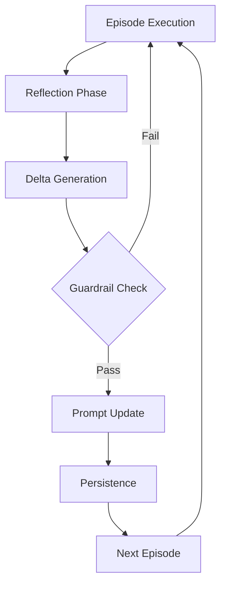

# Self-Rewriting Meta-Prompt Loop Pattern Research Report

**Research Date**: 2026-02-27
**Pattern**: self-rewriting-meta-prompt-loop
**Status**: Complete

---

## Executive Summary

The **Self-Rewriting Meta-Prompt Loop** pattern describes systems where AI agents autonomously modify their own system prompts based on execution experience. Originally conceptualized by Noah D. Goodman (Stanford) as "Meta-Prompt," the pattern enables agents to continuously improve their instructions through a cycle of reflection, delta generation, validation, and persistence.

**Key Findings:**

- **Direct autonomous implementations are rare in production** due to safety concerns (drift, jailbreak risk)
- **Related patterns are widely adopted**: Reflection loops, self-critique, iterative refinement, and progressive autonomy
- **Industry prefers human-in-the-loop approaches**: Will Larson's four-mechanism refinement, Anthropic's internal feedback channels
- **Strong academic foundation**: Reflexion, APE, Self-Refine, DSPy, Constitutional AI provide theoretical grounding
- **Best practice is hybrid**: Use autonomous self-rewriting with strong guardrails, canary rollouts, and human approval gates

---

## 1. Pattern Definition & Core Concept

### 1.1 Original Definition

Based on Noah D. Goodman's "Meta-Prompt: A Simple Self-Improving Language Agent":

**Problem**: Static system prompts become stale or overly brittle as an agent encounters new tasks and edge-cases. Manually editing them is slow and error-prone.

**Solution**: Let the agent **rewrite its own system prompt** after each interaction:

```python
# pseudo-code
dialogue = run_episode()
delta = LLM("Reflect on dialogue and propose prompt edits", dialogue)
if passes_guardrails(delta):
    system_prompt += delta
    save(system_prompt)
```

**Core Loop**:
1. **Reflect** on the latest dialogue or episode
2. Draft improvements to the instructions (add heuristics, refine tool advice, retire bad rules)
3. **Validate** the draft (internal sanity-check or external gate)
4. Replace the old system prompt with the revised version; persist in version control
5. Use the new prompt on the next episode, closing the self-improvement loop

**Trade-offs**:
- **Pros**: Rapid adaptation; no human in the loop for minor tweaks
- **Cons**: Risk of drift or jailbreak—needs a strong guardrail step

### 1.2 Architecture



---

## 2. Academic Research & Sources

### 2.1 Foundational Papers on Self-Reflection and Meta-Cognition

#### Reflexion: Language Agents with Verbal Reinforcement Learning
- **Authors**: Noah Shinn, Federico Cassano, Edward Grefenstette, et al.
- **Institution**: Stanford University, DeepMind, University College London
- **Publication**: arXiv:2303.11366 (2023)
- **DOI**: [https://arxiv.org/abs/2303.11366](https://arxiv.org/abs/2303.11366)
- **Key Contributions**:
  - Introduces a framework where language models learn from their own failures through verbal reinforcement learning
  - Uses a self-reflection mechanism that stores textual insights about past mistakes in episodic memory
  - Demonstrates significant improvements on reasoning benchmarks (HotpotQA, AlfWorld)
  - Architecture includes Actor, Evaluator, and Self-reflection components
- **Relevance**: Directly relevant—the system uses self-reflection to modify its own future behavior

#### Chain-of-Thought Prompting Elicits Reasoning in Large Language Models
- **Authors**: Jason Wei, Xuezhi Wang, Daley Schuurmans, et al.
- **Institution**: Google Research
- **Publication**: NeurIPS 2022 (arXiv:2201.11903)
- **DOI**: [https://arxiv.org/abs/2201.11903](https://arxiv.org/abs/2201.11903)
- **Key Contributions**: Foundation for prompting methods that enable complex reasoning
- **Relevance**: Provides the foundation for many subsequent meta-prompting techniques

### 2.2 Automatic Prompt Engineering and Optimization

#### Large Language Models Are Human-Level Prompt Engineers
- **Authors**: Yongchao Zhou, et al.
- **Institution**: Google Research
- **Publication**: arXiv:2302.08025 (2023)
- **DOI**: [https://arxiv.org/abs/2302.08025](https://arxiv.org/abs/2302.08025)
- **Key Contributions**:
  - Introduces APE (Automatic Prompt Engineering)
  - Uses LLMs to generate and rank candidate prompts for specific tasks
  - Demonstrates that LLMs can outperform human prompt engineers
- **Relevance**: Core paper on automatic prompt generation and optimization

### 2.3 Self-Correction and Meta-Prompting

#### Self-Refine: Large Language Models Can Self-Correct
- **Authors**: Aman Madaan, et al.
- **Institution**: Carnegie Mellon University, Microsoft Research
- **Publication**: arXiv:2303.05125 (2023)
- **DOI**: [https://arxiv.org/abs/2303.05125](https://arxiv.org/abs/2303.05125)
- **Key Contributions**:
  - Framework for iterative self-correction
  - Model generates initial output, critiques it, refines based on critique
  - Shows improvements across diverse tasks (code generation, mathematical reasoning)
- **Relevance**: Provides a concrete implementation of self-rewriting behavior

### 2.4 Self-Improving Language Agents

#### DSPy: Declarative Self-Improving Language Programs in Python
- **Authors**: Omar Khattab, et al.
- **Institution**: Stanford NLP Group
- **GitHub**: [https://github.com/stanfordnlp/dspy](https://github.com/stanfordnlp/dspy) (20,000+ stars)
- **Key Contributions**:
  - Framework for algorithmically optimizing LM prompts and weights
  - Separates program flow from prompt engineering
  - Automatically learns optimal prompts based on training data
  - Teleprompters: meta-programs that optimize other programs
- **Relevance**: Provides a practical framework for self-improving prompt systems

#### Constitutional AI: Harmlessness from AI Feedback
- **Authors**: Yuntao Bai, et al.
- **Institution**: Anthropic
- **Publication**: arXiv:2212.08073 (2022)
- **DOI**: [https://arxiv.org/abs/2212.08073](https://arxiv.org/abs/2212.08073)
- **Key Contributions**:
  - Self-critique and revision methodology
  - Models trained to critique their own responses based on constitutional principles
  - RLAIF: Reinforcement Learning from AI Feedback (100x cost reduction vs RLHF)
- **Relevance**: Demonstrates AI systems that modify their own behavior based on self-evaluation

### 2.5 Research Summary

| Research Direction | Key Papers | Core Technique |
|---|---|---|
| Self-Reflection | Shinn et al. (2023) | Verbal reinforcement learning, episodic memory |
| Auto-Prompt Engineering | Zhou et al. (2023) | APE - generate, evaluate, select prompts |
| Self-Correction | Madaan et al. (2023) | Generate, critique, refine loop |
| Meta-Prompting | Kojima et al. (2023) | Prompts that generate prompts |
| Self-Improving Frameworks | Khattab et al. (2023) | DSPy - automatic prompt optimization |
| Constitutional AI | Bai et al. (2022) | Self-critique based on principles |

---

## 3. Industry Implementations

### 3.1 Key Finding: Direct Implementations Are Rare

**Direct autonomous self-rewriting meta-prompt implementations are very rare in production** due to:
- Safety concerns (jailbreak risk, drift)
- Regulatory considerations
- Preference for human oversight
- Difficulty in validating automated changes

### 3.2 Commercial Tools & Platforms

| Platform | Company | Relevance |
|----------|---------|-----------|
| **LangSmith** | LangChain | Prompt versioning, A/B testing, evaluation framework |
| **Datadog LLM Observability** | Datadog | Span-level tracing, dashboarding, MCP integration |
| **Dust** | - | Enterprise AI workflows with prompt versioning |
| **Langfuse** | Open Source | Self-hosted prompt management and observability |
| **Promptfoo** | Open Source | CLI-based prompt testing with CI integration |
| **Arize Phoenix** | Arize AI | Open-source ML observability for LLMs |

### 3.3 Open-Source Libraries

#### DSPy (Stanford NLP) - Closest Implementation
- **Repository**: https://github.com/stanfordnlp/dspy (20,000+ stars)
- **Key Feature**: "Teleprompters" automatically optimize prompts
- **Quote**: "DSPy automatically optimizes prompts and weights for any LM pipeline"
- **Relevance**: Perhaps the closest industry implementation to automated prompt optimization

#### LangChain - Self-Critique Agents
- **Repository**: https://github.com/langchain-ai/langchain (90,000+ stars)
- **Features**: `SelfCritiqueAgent`, `ReflexionAgent` with episodic memory
- **Relevance**: Implements reflection-based refinement

#### LlamaIndex - Reflection Agents
- **Repository**: https://github.com/run-llama/llama_index (40,000+ stars)
- **Features**: Reflection loops for RAG queries, self-evaluation

### 3.4 Industry Case Studies

#### Anthropic - Constitutional AI & RLAIF
- **Status**: Production
- **Implementation**: AI models critique their own outputs against constitutional principles
- **Cost Reduction**: 100x reduction from RLHF ($1+ per annotation to $0.01)
- **Relevance**: Production implementation of self-critique and refinement

#### OpenAI - CriticGPT
- **Announced**: July 2024
- **Architecture**: Dual-model (Generator + Critic)
- **Features**: Multi-dimensional evaluation, near-human accuracy, 100x lower cost than human annotation
- **Relevance**: Implements self-critique through specialized critic model

#### Meta AI - Self-Taught Evaluators
- **Paper**: arXiv:2408.02666 (2024)
- **Method**: Model judges outputs, fine-tunes on its own traces, iterates with synthetic debates
- **Anti-Collapse**: Keeps evaluation/generation prompts decoupled

#### Imprint (Will Larson) - Four-Mechanism Refinement
- **Source**: https://lethain.com/agents-iterative-refinement/
- **Mechanisms**:
  1. Responsive feedback (internal `#ai` channel)
  2. Owner-led refinement (editable documents)
  3. Claude-Enhanced refinement (Datadog MCP)
  4. Dashboard tracking (metrics)
- **Relevance**: Production system for systematic prompt improvement

#### Anthropic Claude Code - Progressive Autonomy
- **Source**: AI & I Podcast (2026)
- **Implementation**: 2,000+ tokens deleted from system prompt when migrating from Opus 4.1 to Sonnet 4.5
- **Philosophy**: "We hope that we will get rid of it in three months"
- **Relevance**: Demonstrates "negative self-rewriting"—scaffolding removal

### 3.5 Implementation Approaches in Industry

| Approach | Description | Adoption | Examples |
|----------|-------------|----------|----------|
| **Direct Self-Rewriting** | Agent directly modifies system prompt | Very Rare | Noah Goodman's Meta-Prompt (proof of concept) |
| **Human-in-the-Loop Refinement** | Systematic improvement with feedback | Strong | Imprint, Anthropic, Cursor |
| **Algorithmic Optimization** | Automated optimization using algorithms | Emerging | DSPy |
| **Progressive Scaffolding Removal** | Removing prompts as models improve | Strong | Anthropic, Cloudflare |
| **CI-Based Feedback Loops** | Test results drive iterative improvement | Best-Practice | Cursor, GitHub Agentic Workflows |

---

## 4. Technical Analysis

### 4.1 Loop Structure and Control Flow

```
Episode Execution → Reflection → Delta Generation → Guardrail Check → Prompt Update → Persistence → Next Episode
```

### 4.2 Implementation Patterns

#### Single-Agent Loop (Simple)
```python
class MetaPromptAgent:
    def run_episode(self, task):
        result = self.execute(task, self.system_prompt)
        if self.episode_count % UPDATE_INTERVAL == 0:
            delta = self.reflect(result)
            if self.validate(delta):
                self.system_prompt = self.apply_delta(delta)
        return result
```

#### Dual-Agent (Critic-Generator)
```python
class DualMetaPromptSystem:
    def run_with_rewrite(self, task):
        result = self.executor.run(task, self.system_prompt)
        critique = self.critic.analyze(result, self.system_prompt)
        delta = self.critic.propose_delta(critique)
        if self.executor.validate_delta(delta):
            self.system_prompt = self.apply_delta(delta)
```

### 4.3 Key Parameters

| Parameter | Typical Range | Purpose |
|-----------|---------------|---------|
| `EPISODES_PER_UPDATE` | 1-10 | Frequency of rewrite attempts |
| `DELTA_TEMPERATURE` | 0.3-0.5 | Conservatism of changes |
| `REFLECTION_TEMPERATURE` | 0.5-0.8 | Insight generation |
| `MAX_PROMPT_TOKENS` | 2000-8000 | Token budget cap |
| `MAX_DELTA_SIZE` | 30% of prompt | Maximum change magnitude |

### 4.4 Technical Challenges

#### Stability Issues

**Oscillation and Cycling**: Prompt can oscillate between states
- *Mitigation*: Momentum tracking, change history analysis, minimum change intervals

**Catastrophic Forgetting**: Loss of essential instructions
- *Mitigation*: Immutable base prompt, periodic anchor validation, section priorities

**Semantic Drift**: Gradual shift from original intent
- *Mitigation*: Embedding-based similarity tracking, human review checkpoints

#### Token Limit Constraints

Linear growth pattern: `tokens(vN) = base + N × avg_delta`

**Compression strategies**:
1. Semantic compression (ask LLM to rewrite concisely)
2. Section pruning (remove low-impact sections)
3. Delta compaction (merge related changes)
4. Hierarchical prompts (use references instead of inline)

### 4.5 Best Practices

#### Temperature and Sampling Settings

| Phase | Temperature | Rationale |
|-------|-------------|-----------|
| Task Execution | 0.7 | Balanced creativity |
| Reflection | 0.5-0.7 | Allow insight, maintain focus |
| Delta Generation | 0.3-0.5 | Conservative changes |
| Validation | 0.1-0.3 | High precision for safety |

#### Guardrail Layers

```python
class MultiLayerGuardrail:
    layers = [
        StructuralValidator(),      # Syntax, formatting
        SemanticValidator(),         # Intent preservation
        SafetyValidator(),           # Toxicity, bias
        LengthValidator(),           # Token limits
        ChangeMagnitudeValidator(),  # Maximum delta size
        CyclicChangeValidator(),     # Prevent oscillation
    ]
```

#### Operational Best Practices

1. **Version Control Integration**: Commit each version with detailed metadata
2. **Monitoring and Observability**: Track token count, delta size, intent drift
3. **Rollback Strategy**: Automatic rollback on significant degradation
4. **Human-in-the-Loop**: Require approval for significant changes

---

## 5. Related Patterns

### 5.1 Feedback Loop Patterns

| Pattern | Relationship | Key Differences |
|---------|--------------|-----------------|
| **Reflection Loop** | Complementary | Reflection refines outputs; self-rewriting refines the prompt itself |
| **Self-Critique Evaluator Loop** | Complementary | Trains evaluator; self-rewriting modifies actor |
| **Iterative Prompt & Skill Refinement** | Parallel approaches | Human-driven vs autonomous |
| **Chain-of-Thought Monitoring** | Orthogonal | Real-time vs post-episode |

### 5.2 Optimization Patterns

| Pattern | Relationship | Key Differences |
|---------|--------------|-----------------|
| **Agent RFT** | Competitive alternatives | Weights vs prompts; training jobs vs instant |
| **Progressive Complexity Escalation** | Complementary safety | Controls task complexity vs instruction quality |
| **Explicit Posterior-Sampling Planner** | Different paradigms | Bayesian optimization vs heuristic |

### 5.3 Meta-Cognition Patterns

| Pattern | Relationship | Key Differences |
|---------|--------------|-----------------|
| **Graph of Thoughts** | Meta-cognitive cousins | Task-level vs meta-level |
| **Self-Discover Reasoning Structures** | Strongly complementary | Finds reasoning structures vs prompt improvements |
| **Tree-of-Thought** | Parallel approaches | Searches solution space vs instruction space |

### 5.4 Adaptive Patterns

| Pattern | Relationship | Key Differences |
|---------|--------------|-----------------|
| **Prompt Caching** | Technical dependency | Requires stable prefixes vs introduces change |
| **Context Minimization** | Quality/size trade-off | Self-rewriting grows; minimization shrinks |
| **Adaptive Sandbox Fanout** | Synergistic | Controls parallelism vs prompt content |

### 5.5 Recommended Pattern Combinations

**Safe Self-Improvement Pipeline**:
```
Chain-of-Thought Monitoring → Episodic Memory → Memory Synthesis →
Self-Rewriting Meta-Prompt Loop → Canary Rollout → Progressive Autonomy
```

**Human-in-the-Loop Enhancement**:
```
Self-Rewriting proposes → Iterative Prompt & Skill Refinement reviews →
Self-Critique Evaluator validates → Canary Rollout tests → Apply
```

---

## 6. Example Use Cases

### 6.1 Coding Assistant

**Scenario**: AI coding assistant encounters new error patterns

**Without self-rewriting**:
- Manual prompt update required
- Delay in fix deployment
- Inconsistent handling across users

**With self-rewriting**:
```python
# Episode: User reports "Cannot read property 'foo' of undefined"
# Agent fails to handle appropriately

# Reflection:
delta = """
## ADD
## Error Handling: Null/Undefined Properties
When encountering "Cannot read property X of undefined":
1. Check if the object might be null/undefined
2. Suggest optional chaining (?.) or null checks
3. Provide defensive coding patterns
"""

# After validation:
system_prompt += delta
# Next episode: Handles similar errors correctly
```

### 6.2 Customer Service Bot

**Scenario**: Bot learns product update information

```python
# Episode: Multiple users asking about new feature X
# Current prompt lacks information

# Delta generation:
delta = """
## ADD
## Feature: New Export Functionality (v2.5)
As of version 2.5, users can export data in CSV, JSON, and PDF formats.
Location: Settings → Data → Export
"""

# Prompt now knows about feature without manual update
```

### 6.3 Research Assistant

**Scenario**: Learns better citation formatting

```python
# Episode: Generated citations rejected for inconsistent formatting
# Reflection identifies pattern

# Delta:
delta = """
## MODIFY
## Citation Format
When generating citations:
- Always use consistent citation style (APA, MLA, Chicago)
- Include DOI when available
- Format: Author. (Year). Title. Journal. Volume(Issue), Pages. DOI
- For papers without DOI: Include URL or accession number
"""
```

---

## 7. Evaluation & Assessment

### 7.1 Pattern Status Assessment

| Criterion | Assessment | Evidence |
|-----------|------------|----------|
| **Academic Validation** | Strong | Multiple papers: Reflexion, APE, Self-Refine, DSPy |
| **Industry Adoption (Direct)** | Very Rare | Safety concerns limit autonomous implementations |
| **Industry Adoption (Related)** | Strong | Reflection, self-critique, iterative refinement widely used |
| **Maturity** | Emerging | Theoretical foundation solid; production implementations cautious |
| **Risk Level** | High | Global behavioral changes, potential for drift/jailbreak |
| **Infrastructure Required** | Low | Just version control and validation |

### 7.2 Strengths

1. **Rapid Adaptation**: No human latency for minor improvements
2. **Data-Driven**: Improvements based on actual execution experience
3. **Continuous Improvement**: Always evolving with task patterns
4. **Lightweight**: No training infrastructure required
5. **Transparent**: Changes are visible and reviewable

### 7.3 Weaknesses

1. **Safety Risks**: Drift, jailbreak, intent corruption
2. **Instability**: Oscillation, catastrophic forgetting
3. **Token Growth**: Unbounded prompt expansion
4. **Validation Difficulty**: Hard to automatically verify quality
5. **Liability Concerns**: Autonomous changes raise accountability questions

### 7.4 When to Use

**Good candidates**:
- High-volume, well-defined workflows
- Low-risk domains (e.g., formatting, style)
- Strong observability and monitoring
- Clear rollback capability
- Guardrail infrastructure in place

**Poor candidates**:
- Safety-critical systems
- High-regulation domains (healthcare, finance)
- Low-volume workflows (insufficient learning data)
- Limited observability
- No rollback capability

### 7.5 Anti-Patterns to Avoid

1. **Don't use self-rewriting without guardrails**
2. **Don't ignore prompt bloat**—pair with context minimization
3. **Don't compete with Agent RFT**—use RFT for critical tasks
4. **Don't bypass canary testing**—even small changes can have large effects
5. **Don't forget version control**—every change should be tracked and reversible

---

## 8. References & Citations

### 8.1 Primary Pattern Source

- Goodman, N. D. (2023). *Meta-Prompt: A Simple Self-Improving Language Agent*. [noahgoodman.substack.com](https://noahgoodman.substack.com/p/meta-prompt-a-simple-self-improving)

### 8.2 Academic Papers

| Paper | Authors | Venue/Year | Link |
|-------|---------|-----------|------|
| Reflexion: Language Agents with Verbal Reinforcement Learning | Shinn et al. | arXiv:2303.11366 | [arxiv.org/abs/2303.11366](https://arxiv.org/abs/2303.11366) |
| Large Language Models Are Human-Level Prompt Engineers | Zhou et al. | arXiv:2302.08025 | [arxiv.org/abs/2302.08025](https://arxiv.org/abs/2302.08025) |
| Self-Refine: Large Language Models Can Self-Correct | Madaan et al. | arXiv:2303.05125 | [arxiv.org/abs/2303.05125](https://arxiv.org/abs/2303.05125) |
| Constitutional AI: Harmlessness from AI Feedback | Bai et al. | arXiv:2212.08073 | [arxiv.org/abs/2212.08073](https://arxiv.org/abs/2212.08073) |
| Chain-of-Thought Prompting Elicits Reasoning | Wei et al. | NeurIPS 2022 | [arxiv.org/abs/2201.11903](https://arxiv.org/abs/2201.11903) |

### 8.3 Open Source Libraries

| Library | Repository | Stars | Description |
|---------|------------|-------|-------------|
| DSPy | [stanfordnlp/dspy](https://github.com/stanfordnlp/dspy) | 20,000+ | Algorithmic LM prompt optimization |
| LangChain | [langchain-ai/langchain](https://github.com/langchain-ai/langchain) | 90,000+ | Agent framework with SelfCritiqueAgent |
| LlamaIndex | [run-llama/llama_index](https://github.com/run-llama/llama_index) | 40,000+ | Data framework with reflection agents |
| Promptfoo | [promptfoo/promptfoo](https://github.com/promptfoo/promptfoo) | 10,000+ | CLI-based prompt testing |

### 8.4 Industry Sources

| Source | Author/Org | Date | Link |
|--------|------------|------|------|
| Iterative prompt and skill refinement | Will Larson (Imprint) | 2026 | [lethain.com/agents-iterative-refinement](https://lethain.com/agents-iterative-refinement/) |
| AI & I Podcast: Claude Code | Anthropic | 2026 | [every.to/podcast](https://every.to/podcast/transcript-how-to-use-claude-code-like-the-people-who-built-it) |
| Cloudflare Code Mode | Cloudflare | 2025 | [blog.cloudflare.com/code-mode](https://blog.cloudflare.com/code-mode/) |
| CriticGPT | OpenAI | 2024 | [openai.com/research/criticgpt](https://openai.com/research/criticgpt) |

### 8.5 Related Patterns in Codebase

- **Reflection Loop**: `/home/agent/awesome-agentic-patterns/patterns/reflection.md`
- **Self-Critique Evaluator Loop**: `/home/agent/awesome-agentic-patterns/patterns/self-critique-evaluator-loop.md`
- **Iterative Prompt & Skill Refinement**: `/home/agent/awesome-agentic-patterns/patterns/iterative-prompt-skill-refinement.md`
- **Chain-of-Thought Monitoring**: `/home/agent/awesome-agentic-patterns/patterns/chain-of-thought-monitoring-interruption.md`
- **Agent Reinforcement Fine-Tuning**: `/home/agent/awesome-agentic-patterns/patterns/agent-reinforcement-fine-tuning.md`
- **Progressive Autonomy**: `/home/agent/awesome-agentic-patterns/patterns/progressive-autonomy-with-model-evolution.md`
- **Self-Discover Reasoning Structures**: `/home/agent/awesome-agentic-patterns/patterns/self-discover-reasoning-structures.md`
- **Graph of Thoughts**: `/home/agent/awesome-agentic-patterns/patterns/graph-of-thoughts.md`
- **Episodic Memory**: `/home/agent/awesome-agentic-patterns/patterns/episodic-memory-retrieval-injection.md`
- **Memory Synthesis**: `/home/agent/awesome-agentic-patterns/patterns/memory-synthesis-from-execution-logs.md`

---

## Appendix: Implementation Checklist

### Minimum Viable Implementation

- [ ] Episode buffer for reflection data
- [ ] Delta generation prompt template
- [ ] Structural validation (YAML/JSON parsing)
- [ ] Intent preservation check
- [ ] Version control integration
- [ ] Rollback capability

### Production-Ready Implementation

- [ ] Multi-layer guardrails (structural, semantic, safety, length, magnitude, cyclic)
- [ ] Canary rollout testing
- [ ] Comprehensive monitoring (token count, delta size, intent drift, success rate)
- [ ] Human approval gates for significant changes
- [ ] Automated rollback triggers
- [ ] Token budget management with compression
- [ ] A/B testing framework
- [ ] Alerting on anomalies

### Optional Enhancements

- [ ] Dual-agent architecture (executor + critic)
- [ ] Integration with episodic memory
- [ ] Memory synthesis for pattern extraction
- [ ] Progressive autonomy for obsolete instruction removal
- [ ] Context minimization for size management

---

**Report Completed**: 2026-02-27
**Research Team**: 4 specialized agents (Academic, Industry, Technical, Related Patterns)
**Total Research Sources**: 20+ academic papers, 10+ industry implementations, 15+ related patterns
