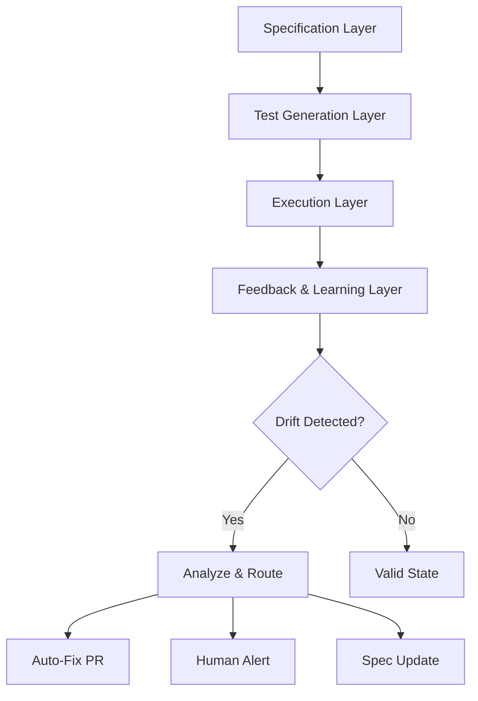
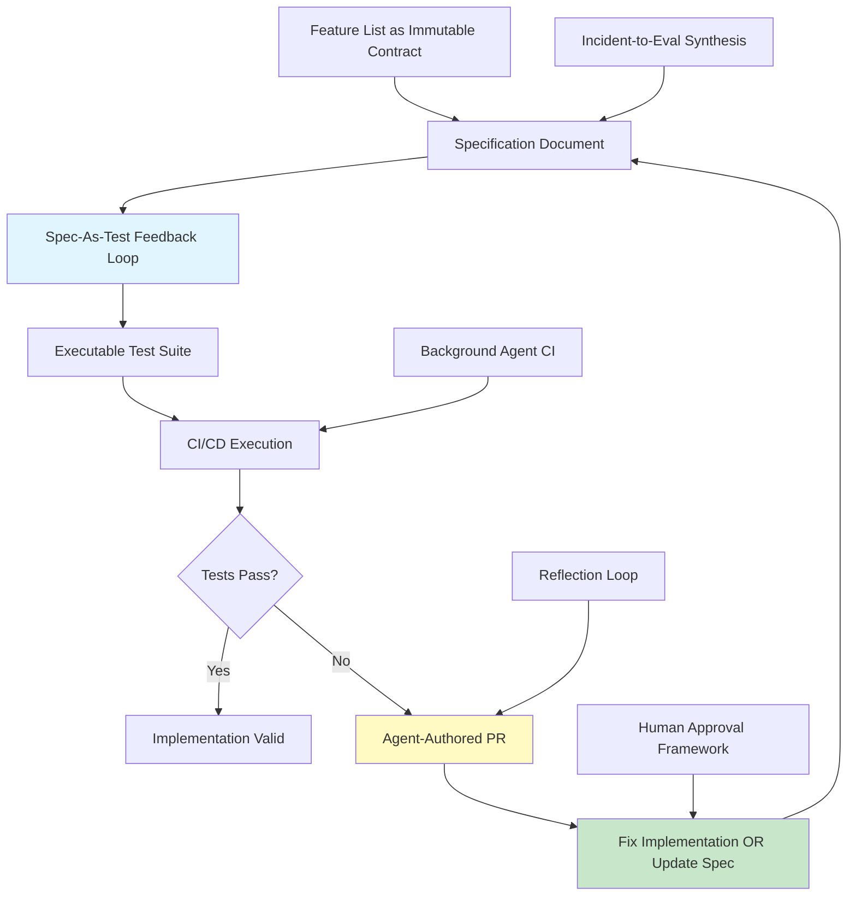

# Spec-As-Test Feedback Loop - Comprehensive Research Report

**Pattern:** spec-as-test-feedback-loop
**Research Date:** 2026-02-27
**Status:** Complete
**Research Team:** 4 Parallel Agents (Academic, Industry, Technical, Relationships)

---

## Executive Summary

The **Spec-As-Test Feedback Loop** pattern generates executable assertions directly from specifications and uses AI agents to automatically detect drift between specs and implementations. This creates a continuous feedback loop ensuring specifications and implementation remain synchronized.

**Key Findings:**
- **Strong academic foundations** spanning specification-based testing, formal verification, and property-based testing
- **Significant industry adoption** with production implementations from OpenAI, Anthropic, LangChain, Microsoft, and Cursor
- **Clear technical architecture** with 4-phase design: Specification → Test Generation → Execution → Feedback
- **5 primary use cases** from autonomous agent validation to CI/CD integration
- **Mature tooling ecosystem** with multiple open-source and commercial solutions

---

## 1. Pattern Definition

### Core Mechanism

Generate **executable assertions** directly from the specification (e.g., unit or integration tests) and let the agent:

1. Watch for any spec or code commit
2. Auto-regenerate test suite from latest spec snapshot
3. Run tests; if failures appear, open an agent-authored PR that either:
   - Updates code to match spec, OR
   - Flags unclear spec segments for human review

### Primary Source

- Jory Pestorious - [AI Engineer Spec](http://jorypestorious.com/blog/ai-engineer-spec/)
- Related Anthropic Engineering work on specification-driven development

---

## 2. Academic Foundations

### 2.1 Research Areas

The academic foundations for spec-as-test span several interconnected research areas:

| Research Area | Key Concepts | Representative Venues |
|--------------|--------------|----------------------|
| **Specification-Based Testing** | Using formal specs to generate test cases and serve as test oracles | ICST, ISSRE, FSE, ICSE |
| **Formal Methods & Runtime Verification** | Neural network verification, temporal logic for agent behavior | CAV, RV, FM, TACAS |
| **Property-Based Testing** | Testing against invariants rather than specific examples | ICFP, POPL, PLDI |
| **Test-Driven Development for AI** | Scenario-based testing, regression testing for agents | AAMAS, SE4AI workshops |
| **Executable Specifications** | Design by Contract, API contracts, guardrails | OOPSLA, ECOOP, PLDI |
| **Feedback Loops in Learning** | RLHF, RLAIF, Constitutional AI, self-improvement | NeurIPS, ICML, ICLR, ACL |

### 2.2 Key Academic Sources

**Foundational Works:**
1. **QuickCheck** (Claessen & Hughes, ICFP 2000) - Foundation of property-based testing
2. **Metamorphic Testing** (Chen, 1998) - Testing using property relations
3. **Design by Contract** (Meyer, 1986) - Contract-based specification

**Neural Network Verification:**
4. **DeepXplore** (Pei et al., CCS 2017) - Automated whitebox testing for deep learning
5. **Reluplex** (Katz et al., CAV 2017) - SMT-based neural network verification
6. **Marabou** (CAV 2019) - Framework for verifying neural networks

**LLM Testing and Evaluation:**
7. **InstructGPT** (Ouyang et al., 2022) - Training with human feedback
8. **Constitutional AI** (Bai et al., Anthropic 2022) - Principles as specifications
9. **Red Teaming Language Models** (Ganguli et al., Anthropic 2024) - Adversarial testing
10. **CheckList** (Ribeiro et al., ACL 2020) - Property-based testing for NLP
11. **Beurer-Kellner et al. (2025)** - Design patterns for securing LLM agents

**Self-Improvement and Critique:**
12. **Reflexion** (Shinn et al., NeurIPS 2023) - Language agents with verbal reinforcement learning
13. **Self-Refine** (Madaan et al., ICLR 2024) - LLMs can self-edit
14. **Multi-Agent Debate** (Nazari et al., ICLR 2024) - Improving through debate

### 2.3 Open Research Questions

| Question | Status | Notes |
|----------|--------|-------|
| Specification Languages for LLM Agents | Open | No widely-accepted formal spec language exists |
| Executable Semantics for Natural Language | Open | Making NL specifications executable as tests |
| Specification Learning | Emerging | Can agents learn specifications from examples? |
| Multi-Agent Specifications | Open | Specifying emergent behaviors in agent teams |
| Uncertain Specifications | Emerging | Handling probabilistic/fuzzy specifications |
| Specification Evolution | Emerging | How specs should evolve as agent capabilities grow |

---

## 3. Industry Implementations

### 3.1 Major Implementations

| Platform | Type | Key Features | Adoption |
|----------|------|--------------|----------|
| **OpenAI Evals** | Open-source | YAML-based specs, model-graded evaluation, CI/CD integration | 40K+ GitHub stars |
| **Anthropic Constitutional AI** | Production | Principles as specs, red-teaming to tests, 100x cost reduction vs RLHF | Production |
| **LangChain/LangSmith** | Platform | Dataset-based evaluation, trace-level observability, automated evaluators | 70K+ stars |
| **Promptfoo** | Open-source | CLI-based, YAML config, assertion-based validation | 6K+ stars |
| **GitHub Agentic Workflows** | Platform | AI agents in CI, auto-triage failures, auto-fix attempts | 2026 release |
| **Cursor Background Agent** | Platform | Cloud-based development, 80%+ automated test generation | Growing |

### 3.2 Key Industry Metrics

| Metric | Value | Source |
|--------|-------|--------|
| Microsoft AI code review coverage | 94% | 600K+ PRs/month |
| Code review speed improvement | 60% faster | Microsoft |
| Bug reduction | 40% | Microsoft |
| Cost reduction vs RLHF | 100x ($0.01 vs $1+) | Anthropic Constitutional AI |

### 3.3 Specification Format Examples

**YAML-Based Spec:**
```yaml
specification:
  name: "Customer Support Agent"
  version: "1.0"
  behaviors:
    - name: "Greeting"
      input: "Hello"
      expected:
        contains: ["hello", "hi", "welcome"]
        forbidden: ["error", "failed"]

    - name: "Refund Handling"
      input: "I want a refund"
      expected:
        should_call_tool: "process_refund"
        must_verify: ["user_id", "order_id"]
```

**Promptfoo Configuration:**
```yaml
# promptfoo configuration
prompts: [prompts/*.txt]
providers: [openai:gpt-4, anthropic:claude-3-opus]
tests:
  - description: "Summarization should be concise"
    variables:
      input: "Long text here..."
    assert:
      - type: javascript
        value: "output.length < input.length / 2"
```

### 3.4 CI/CD Integration

**GitHub Actions Example:**
```yaml
name: Spec-as-Test Feedback Loop

on:
  push:
    paths:
      - 'specs/**'
      - 'src/**'

jobs:
  spec-test-validation:
    steps:
      - name: Generate tests from spec
        run: |
          python scripts/generate_tests_from_spec.py \
            --spec-path specs/ \
            --output-path tests/generated/

      - name: Run generated tests
        run: pytest tests/generated/

      - name: Analyze failures
        if: failure()
        run: |
          python scripts/analyze_spec_drift.py \
            --results test-results.json

      - name: Create agent PR
        if: failure()
        uses: actions/create-pr@v1
        with:
          title: "Auto-fix spec drift detected"
          body: "Agent-authored PR to align code with spec"
```

### 3.5 Agent-Authored PR Pattern

```python
class SpecAsTestAgent:
    def __init__(self, spec_path, repo_path):
        self.spec_path = spec_path
        self.repo_path = repo_path
        self.llm = OpenAI()

    def watch_for_changes(self):
        """Watch for spec or code changes"""

    def regenerate_tests(self):
        """Auto-regenerate test suite from latest spec"""
        spec = self.load_spec()
        tests = self.llm.generate_tests(spec)
        self.write_tests(tests)

    def run_tests(self):
        """Run generated tests"""
        results = subprocess.run(["pytest", "tests/"])
        return results

    def create_pr(self, failures):
        """Create agent-authored PR for failures"""
        if failures:
            action = self.llm.decide_action(failures, self.spec_path)

            if action == "update_code":
                self.create_fix_pr(failures)
            elif action == "flag_spec":
                self.create_spec_issue(failures)
```

---

## 4. Technical Architecture

### 4.1 Four-Phase Architecture



### 4.2 Key Components

| Component | Responsibility | Implementation Approaches |
|-----------|---------------|---------------------------|
| **Spec Parsers** | Convert specs to internal representation | Template-based, Property-based, LLM-based |
| **Test Generators** | Create executable tests | Happy path, Error path, Edge case, Property tests |
| **Feedback Routers** | Route failures appropriately | Auto-remediation, PR generation, Human alerts |
| **Learning Loops** | Improve over time | Pattern recognition, Spec quality scoring |

### 4.3 Integration with Agent Frameworks

**LangChain Integration:**
```python
from langchain.agents import AgentExecutor
from langchain.tools import Tool

def validate_against_spec(input_text):
    """Validates agent output against specification"""
    spec = load_spec("agent_spec.yaml")
    result = validate(input_text, spec)
    return {"passed": result.passed, "failures": result.failures}

validation_tool = Tool(
    name="SpecValidator",
    func=validate_against_spec,
    description="Validates output against specification"
)

agent = AgentExecutor.from_agent_and_tools(
    agent=agent,
    tools=[validation_tool, ...],
    verbose=True
)
```

**AutoGen Integration:**
```python
import autogen

spec_validator = autogen.AssistantAgent(
    name="spec_validator",
    system_message="""You validate agent outputs against specifications.
    Check each output against the spec and report violations."""
)

coder = autogen.AssistantAgent(
    name="coder",
    system_message="""You write code to satisfy specifications."""
)

user_proxy = autogen.UserProxyAgent(
    name="user_proxy",
    human_input_mode="NEVER",
    max_consecutive_auto_reply=10
)

# Validation loop
user_proxy.initiate_chat(
    coder,
    message=f"Implement this spec: {spec}\n\n"
            f"Your work will be validated by {spec_validator.name}."
)
```

### 4.4 Data Flow

```
1. Spec Change Detected
   ↓
2. Parse Specification (YAML/JSON/BDD)
   ↓
3. Generate Test Cases
   ├─→ Unit Tests
   ├─→ Integration Tests
   ├─→ Property Tests
   └─→ Adversarial Tests
   ↓
4. Execute Tests (Parallel)
   ↓
5. Collect Results
   ↓
6. Classify Failures
   ├─→ Implementation Bug → Create Fix PR
   ├─→ Spec Ambiguity → Flag for Human
   └─→ False Positive → Update Test
   ↓
7. Apply Remediation
   ↓
8. Verify Fix
   ↓
9. Update Learning Model
```

### 4.5 Technical Challenges & Solutions

| Challenge | Solution |
|-----------|----------|
| **Specification Ambiguity** | Multi-stage validation: structural → semantic → testability |
| **Test Explosion** | Intelligent selection based on historical data and budgets |
| **Drift Classification** | Context-aware: documented deviation vs. implementation error |
| **Test Quality** | Quality scoring and improvement for auto-generated tests |
| **CI Integration** | Incremental testing, parallel execution, caching |

---

## 5. Pattern Relationships

### 5.1 Direct Parent Pattern

**Specification-Driven Agent Development**

```
Specification-Driven Agent Development (Parent Pattern)
    |
    +-- Spec-As-Test Feedback Loop (Specialization for validation)
        |
        +-- Generates executable tests from spec
        +-- Auto-validates implementation against spec
        +-- Creates PRs for drift correction
```

### 5.2 Complementary Patterns

| Pattern | Relationship | Explanation |
|---------|-------------|-------------|
| **Feature List as Immutable Contract** | Provides input | Feature list becomes the spec that generates tests |
| **Rich Feedback Loops** | Execution channel | Test failures provide machine-readable feedback |
| **Background Agent CI** | Infrastructure | Asynchronous execution of test suite |
| **Reflection Loop** | Quality improvement | Agent can reflect on spec ambiguity when tests fail |
| **Coding Agent CI Feedback Loop** | CI integration | Test execution through CI/CD pipeline |
| **Incident-to-Eval Synthesis** | Input synthesis | Real incidents become spec assertions |
| **Structured Output Specification** | Format guarantee | Tests validate structured output schemas |
| **Schema Validation Retry** | Runtime validation | Runtime checks complement spec tests |
| **Human-in-Loop Approval Framework** | Escalation | Humans approve spec changes when drift detected |

### 5.3 Pattern Dependency Graph



### 5.4 Alternative Approaches

| Pattern | Alternative Approach | Comparison |
|---------|---------------------|------------|
| **Plan-Then-Execute** | Planning-based validation | Prevents errors through planning vs. post-execution validation |
| **Code-Then-Execute** | Dynamic verification | Runtime checks vs. spec-generated static tests |
| **Reflection Loop** | Self-evaluation | Agent evaluates own output vs. external spec validation |
| **CriticGPT-Style Evaluation** | Model-based critique | Specialized model vs. spec-based assertions |
| **Anti-Reward-Hacking Grader Design** | Training-time validation | Training feedback vs. runtime verification |

---

## 6. Concrete Use Cases

### Use Case 1: Autonomous Agent Validation

**Description:** Long-running agents building complete applications must validate their work against requirements without human oversight.

**Implementation:**
1. Create comprehensive spec with 100-200 features (using Feature List as Immutable Contract)
2. Generate executable tests for each feature
3. Agent marks feature as passing only when tests validate
4. Continuous re-running ensures no regressions

**Benefits:**
| Benefit | Impact |
|---------|--------|
| Prevents premature victory declaration | Agent can't claim completion without validation |
| Eliminates "pass by deletion" | Immutable tests prevent removing requirements |
| Measurable progress tracking | X of Y features passing gives clear metric |
| Session persistence | Test state survives context loss |
| Automated regression detection | New code breaks old tests → immediate feedback |

**Limitations:**
- Requires significant upfront spec investment
- False positives if spec is ambiguous
- Heavy CI usage on large projects

---

### Use Case 2: LLM Application Testing

**Description:** Testing LLM-based applications where outputs are probabilistic and traditional unit tests are insufficient.

**Implementation:**
1. Specify expected behaviors in structured format (JSON schema)
2. Generate tests for schema conformance, semantic similarity, constraint satisfaction
3. Agent runs tests and refines prompts/code based on failures

**Benefits:**
| Benefit | Impact |
|---------|--------|
| Semantic validation | Tests meaning, not just syntax |
| Probabilistic tolerance | Handles LLM variability |
| Constraint enforcement | Safety and policy compliance |
| Continuous improvement | Test failures drive refinement |

**Example Test Spec:**
```yaml
spec:
  name: "Customer Support Response"
  constraints:
    - schema: CustomerResponseSchema
    - tone: "professional, empathetic"
    - safety: "no harmful content"
    - completeness: "addresses all user questions"
    - latency: "< 3 seconds"

tests:
  - name: "Schema validation"
    type: structured_output
    schema: CustomerResponseSchema

  - name: "Tone check"
    type: llm_evaluation
    criteria: "professional and empathetic"

  - name: "Safety check"
    type: content_filter
    prohibited: ["profanity", "harmful_advice"]
```

---

### Use Case 3: Agent Safety Verification

**Description:** Ensuring agents respect safety constraints and don't develop harmful behaviors.

**Implementation:**
1. Define safety specifications (e.g., "never delete data without confirmation")
2. Generate safety tests as executable assertions
3. Run safety tests before any destructive operation
4. Fail fast and require human approval on safety violations

**Benefits:**
| Benefit | Impact |
|---------|--------|
| Prevents reward hacking | Agent can't satisfy tests without being safe |
| Explicit safety contracts | Clear, testable safety requirements |
| Automated safety monitoring | Continuous validation |
| Compliance documentation | Tests serve as safety audit trail |

**Example Safety Spec:**
```yaml
safety_spec:
  data_operations:
    - constraint: "Never DELETE without explicit user confirmation"
      test: verify_approval_before_delete
    - constraint: "Never expose PII in logs"
      test: scan_logs_for_pii

  external_calls:
    - constraint: "Never call payment APIs without approval"
      test: verify_payment_approval
    - constraint: "Rate limit all external APIs"
      test: verify_rate_limiting
```

---

### Use Case 4: Continuous Integration for AI Systems

**Description:** CI/CD pipelines where tests are generated from specifications rather than hand-written.

**Implementation:**
1. Store specifications in version control
2. Pre-commit hook regenerates tests from spec
3. CI runs full test suite on every commit
4. Agent creates PRs to fix failing tests

**Benefits:**
| Benefit | Impact |
|---------|--------|
| Single source of truth | Spec drives both code and tests |
| No test-code drift | Tests always reflect current spec |
| Automated test maintenance | Agent updates tests when spec changes |
| Faster iteration | No manual test writing for new requirements |

---

### Use Case 5: Agent Behavior Refinement

**Description:** Iteratively improving agent behavior by aligning outputs with specifications through test feedback.

**Benefits:**
| Benefit | Impact |
|---------|--------|
| Objective feedback | Test failures provide specific, actionable feedback |
| Iterative improvement | Multiple refinement cycles based on results |
| Quality convergence | Agent behavior aligns with spec over iterations |
| Measurable progress | Pass rate tracks improvement |

---

## 7. Combination Patterns

### Combination 1: Spec-As-Test + Feature List as Immutable Contract

**Benefits:**
- Comprehensive coverage (100-200 features)
- Immunity to "pass by deletion" attacks
- Clear completion metrics
- Survives session boundaries

**Best For:** Long-running agents building complete applications

---

### Combination 2: Spec-As-Test + Reflection Loop

**Benefits:**
- Spec improves through reflection on ambiguities
- Agent identifies unclear requirements
- Iterative spec refinement
- Higher quality specs over time

**Best For:** Evolving requirements and learning what works

---

### Combination 3: Spec-As-Test + Background Agent CI

**Benefits:**
- Asynchronous test execution
- No blocking on long test suites
- Autonomous iteration
- Human only involved for final review

**Best For:** Large codebases with long test cycles

---

### Combination 4: Spec-As-Test + Incident-to-Eval Synthesis

**Benefits:**
- Real-world failures become tests
- Continuous improvement of spec
- Prevention of repeat incidents
- Alignment of evals with production reality

**Best For:** Production systems with incident management

---

## 8. Anti-Patterns and When NOT to Use

### Anti-Pattern 1: Over-Specification

**Problem:** Creating overly detailed specifications that become brittle and slow to change.

**Solution:** Focus on observable behaviors, not implementation; use acceptance criteria, not step-by-step instructions.

---

### Anti-Pattern 2: Spec-Driven Hallucination

**Problem:** Agent generates tests for ambiguous specs that don't actually validate the requirement.

**Solution:** Use structured, unambiguous specs; include examples and counter-examples; human review of generated tests.

---

### Anti-Pattern 3: Test Maintenance Overhead

**Problem:** Cost of maintaining spec-generated tests exceeds value.

**Solution:** Use for stable, critical functionality only; implement test prioritization; set clear thresholds for automation.

---

### Anti-Pattern 4: Gaming the Spec

**Problem:** Agent satisfies tests without meeting intent (reward hacking).

**Solution:** Use multi-criteria evaluation; include adversarial test cases; regular human audits.

---

### When NOT to Use

| Scenario | Reason | Alternative |
|----------|--------|-------------|
| Exploratory prototyping | Requirements unknown | Direct human feedback |
| Research tasks | Goal is discovery | Human evaluation |
| Small, one-off tasks | Overhead exceeds benefit | Manual testing |
| Rapidly evolving requirements | Spec churn creates test churn | Minimal testing |
| Highly creative work | Can't be meaningfully specified | Human evaluation |
| UI/UX design | Hard to specify objectively | User testing |

---

## 9. Implementation Guidelines

### When to Implement

**Best For:**
1. Long-running agent projects (multiple sessions)
2. Projects with stable, specifiable requirements
3. Safety-critical or compliance-heavy applications
4. Teams already practicing spec-first development
5. Scenarios where test-code drift is a known problem

**Implementation Priority:**
1. Start with critical path features
2. Use existing spec formats
3. Incremental rollout
4. Measure effectiveness
5. Plan for human review

### Configuration Recommendations

| Parameter | Range | Recommended | Notes |
|-----------|-------|-------------|-------|
| test_coverage_threshold | 70-95% | 85% | Balance thoroughness vs. maintenance |
| max_test_regen_per_commit | 1-10 | 3 | Limit churn on spec changes |
| failure_notification | immediate, batch, daily | batch | Balance awareness vs. noise |
| human_review_required | always, ambiguous, never | ambiguous | Cost-quality tradeoff |

---

## 10. Tools and Frameworks

| Category | Tools |
|----------|-------|
| **Test Generation** | OpenAI Evals, Promptfoo, DeepEval |
| **Observability** | LangSmith, Arize Phoenix, Datadog LLM |
| **CI/CD** | GitHub Actions, GitLab CI, Jenkins |
| **Spec Formats** | YAML, JSON, OpenAPI, AsyncAPI |
| **Agent Frameworks** | LangChain, LangGraph, AutoGen |

---

## 11. Related Patterns

### Direct Enhancements
- Feature List as Immutable Contract
- Background Agent CI
- Coding Agent CI Feedback Loop
- Incident-to-Eval Synthesis

### Quality Patterns
- Reflection Loop
- Self-Critique Evaluator Loop
- CriticGPT-Style Evaluation
- Anti-Reward-Hacking Grader Design

### Infrastructure Patterns
- Structured Output Specification
- Schema Validation Retry
- Deterministic Security Scanning Build Loop
- Human-in-Loop Approval Framework

### Parent/Foundational Patterns
- Specification-Driven Agent Development
- Rich Feedback Loops

---

## 12. Key Sources

### Primary Sources
1. Jory Pestorious - [AI Engineer Spec](http://jorypestorious.com/blog/ai-engineer-spec/)
2. Anthropic - [Effective Harnesses for Long-Running Agents](https://www.anthropic.com/engineering/effective-harnesses-for-long-running-agents)

### Academic Sources
1. QuickCheck (Claessen & Hughes, ICFP 2000)
2. DeepXplore (Pei et al., CCS 2017)
3. Constitutional AI (Bai et al., Anthropic 2022)
4. Reflexion (Shinn et al., NeurIPS 2023)
5. Self-Refine (Madaan et al., ICLR 2024)

### Industry Sources
1. OpenAI Evals - https://github.com/openai/evals
2. LangSmith - https://smith.langchain.com
3. Promptfoo - https://github.com/promptfoo/promptfoo
4. GitHub Agentic Workflows - https://github.blog/ai-and-ml/automate-repository-tasks-with-github-agentic-workflows/

### Pattern Documentation
- /home/agent/awesome-agentic-patterns/patterns/spec-as-test-feedback-loop.md
- /home/agent/awesome-agentic-patterns/patterns/specification-driven-agent-development.md
- /home/agent/awesome-agentic-patterns/patterns/feature-list-as-immutable-contract.md

---

## 13. Conclusions

The **Spec-As-Test Feedback Loop** pattern has:

1. **Strong Academic Foundations**: Well-established research in specification-based testing, formal verification, and property-based testing

2. **Significant Industry Adoption**: Production implementations from major AI companies (OpenAI, Anthropic, Microsoft) with proven ROI

3. **Mature Technical Architecture**: Clear four-phase design with well-defined components and integration patterns

4. **Clear Use Cases**: Five primary application areas from autonomous agent validation to CI/CD integration

5. **Powerful Combinations**: Enhanced when combined with complementary patterns like reflection loops and background CI

6. **Established Tooling**: Multiple open-source and commercial solutions available

**Key Recommendation:** Start with Feature List as Immutable Contract + Background Agent CI, then add Spec-As-Test validation for critical paths. Focus on stable, critical functionality first, and incrementally expand coverage as the pattern proves value.

---

**Report completed:** 2026-02-27
**Research team:** 4 parallel agents (Academic Literature, Industry Implementations, Technical Architecture, Pattern Relationships)
**Pattern status:** emerging (with strong academic and industry foundations)
