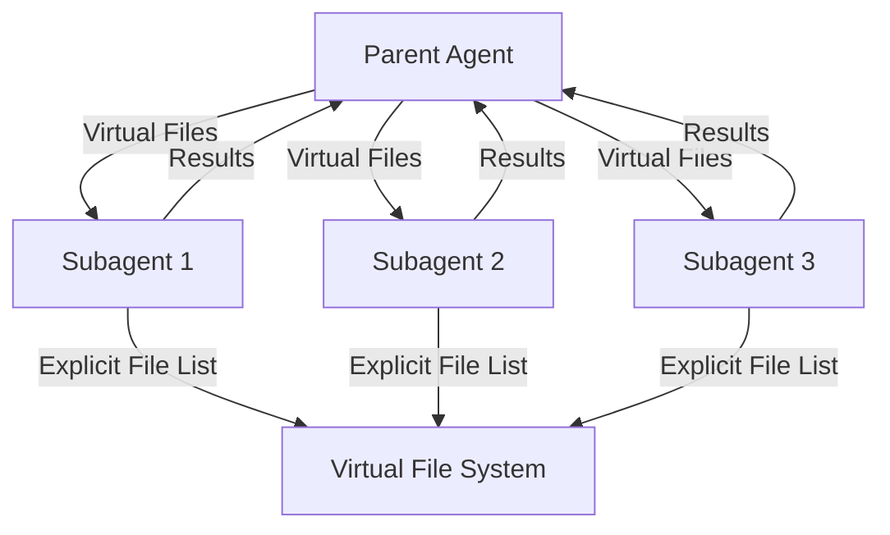
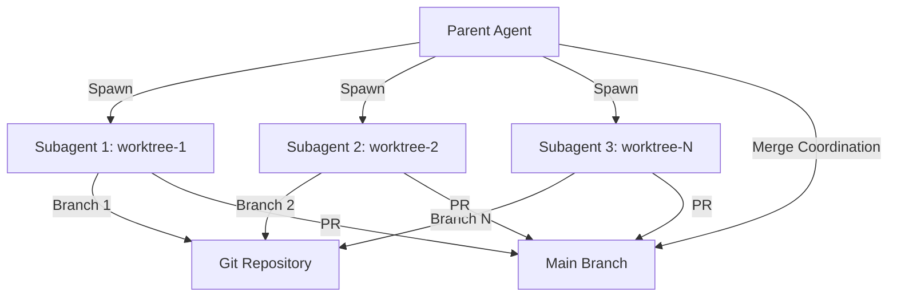
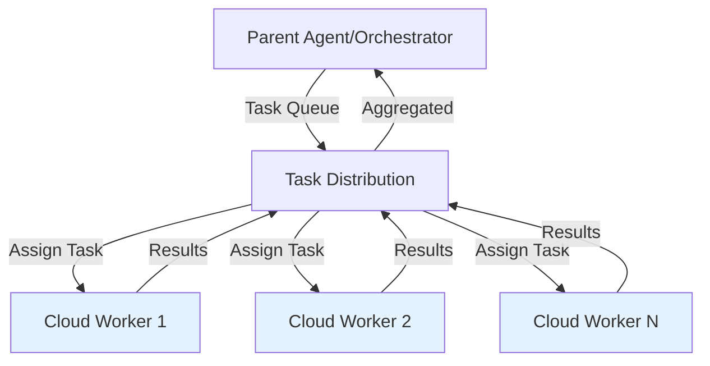
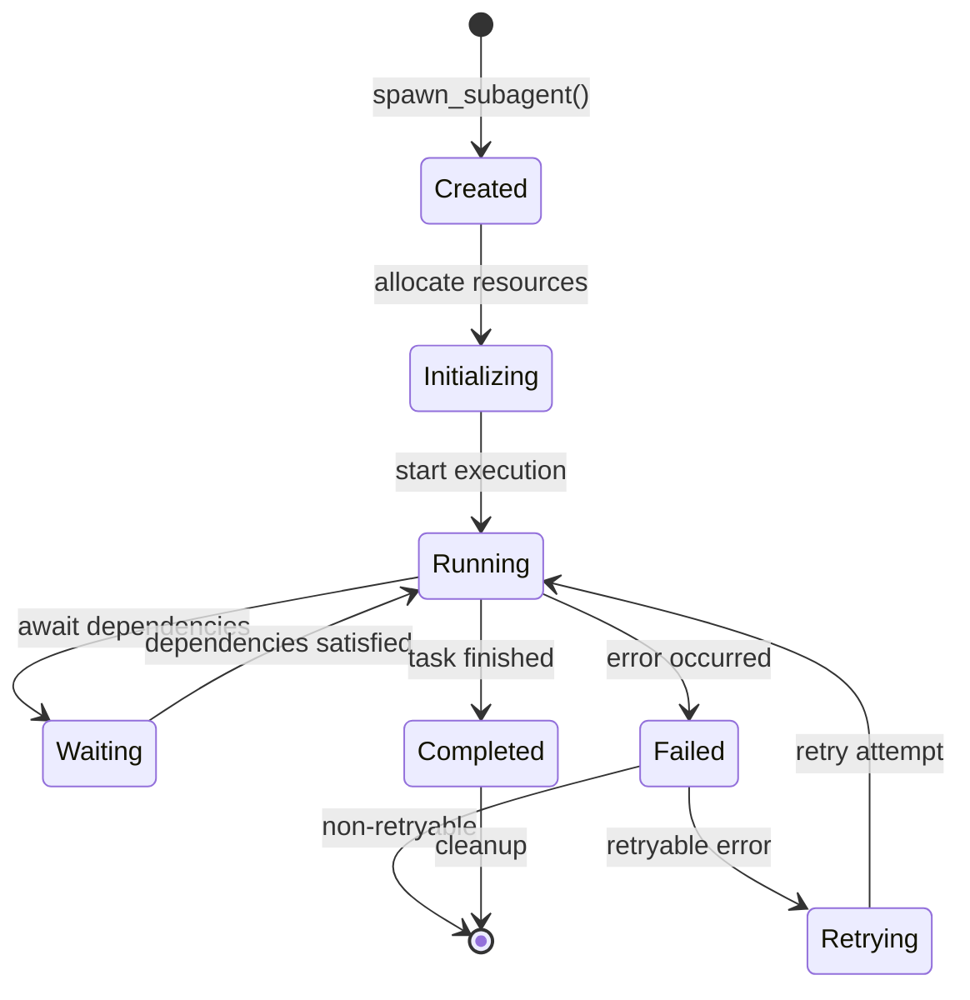

# Sub-Agent Spawning Pattern - Technical Analysis Report

**Report Date:** 2026-02-27
**Pattern Status:** validated-in-production
**Focus:** Technical Architecture and Implementation

---

## Executive Summary

The **Sub-Agent Spawning** pattern enables parent agents to create and coordinate multiple child agents (sub-agents) for handling specialized tasks or parallel work. This technical analysis examines the architectural patterns, implementation approaches, technical challenges, and best practices for sub-agent spawning in agentic AI systems.

**Key Findings:**
- Strong production validation across multiple platforms (Claude Code, AMP, Cursor, GitHub)
- Well-established architectural patterns for spawning, coordination, and lifecycle management
- Clear technical challenges around state management, synchronization, and error handling
- Distinct implementation approaches ranging from lightweight virtual file isolation to distributed cloud worker coordination

---

## 1. Architecture Patterns

### 1.1 Core Spawning Architectures

#### Pattern A: Virtual File Isolation (Lightweight)

**Characteristics:**
- Subagents run in same process/session as parent
- File access controlled via explicit virtual file passing
- No true OS-level isolation
- Minimal startup overhead

**Architecture:**


**Implementation:**
```yaml
# Declarative subagent configuration
subagents:
  planning:
    file: subagents/planning.yaml
    system_prompt: "Break down complex tasks..."
    tools: [list_files, read_file]
    allowed_in: [main_agent]

  analysis:
    file: subagents/analysis.yaml
    system_prompt: "Analyze and refine..."
    tools: [read_file, search]
    allowed_in: [main_agent]
```

**Typical Scale:** 2-4 subagents per parent
**Use Cases:** Context window management, specialized tool scoping

---

#### Pattern B: Git Worktree Isolation (Distributed)

**Characteristics:**
- Each subagent gets isolated git worktree
- True filesystem-level isolation
- Branch-based coordination
- Suitable for 10+ parallel agents

**Architecture:**


**Implementation:**
```python
class WorktreeManager:
    def create_worktree(self, agent_id: str, branch_name: str) -> Path:
        worktree_path = Path(tempfile.mkdtemp(prefix=f"agent-{agent_id}-"))

        subprocess.run([
            "git", "worktree", "add",
            "-b", branch_name,
            str(worktree_path)
        ], cwd=self.repo_path, check=True)

        return worktree_path
```

**Typical Scale:** 10-100 subagents
**Use Cases:** Code migrations, large-scale refactoring

---

#### Pattern C: Cloud Worker Spawning (Enterprise)

**Characteristics:**
- Subagents run in isolated cloud environments
- Full container/VM isolation
- Centralized task queue and coordination
- Horizontal scaling to hundreds of agents

**Architecture:**


**Typical Scale:** 100+ subagents
**Use Cases:** Enterprise-scale migrations, distributed processing

---

### 1.2 Communication Patterns

#### 1.2.1 One-Way Delegation (Fire-and-Forget)

**Pattern:** Parent spawns subagent with task, subagent completes independently
**Use Case:** Independent parallel tasks, no cross-agent coordination
**Example:** Batch file processing

```pseudo
spawn_subagent(
    task="Process batch 1-10",
    files=batch1_files,
    on_complete="push_to_branch"
)
```

#### 1.2.2 Request-Response (Synchronous)

**Pattern:** Parent spawns subagent, waits for result before continuing
**Use Case:** Task decomposition where parent needs subagent result
**Example:** Research synthesis

```pseudo
result = spawn_subagent(
    task="Analyze component X",
    files=component_x_files,
    wait_for_completion=true
)
# Parent uses result for next steps
```

#### 1.2.3 Bidirectional Streaming (Real-Time)

**Pattern:** Parent and subagent maintain bidirectional communication channel
**Use Case:** Long-running tasks with progress monitoring
**Example:** WebSocket-based agent coordination

```python
async for event in subagent.stream_events():
    if event.type == "progress":
        update_dashboard(event.data)
    elif event.type == "completion":
        handle_result(event.data)
```

---

### 1.3 Synchronization Mechanisms

#### 1.3.1 Barrier Synchronization

All subagents must complete before parent proceeds:

```python
async def spawn_parallel_subagents(tasks):
    subagents = [spawn_subagent(task) for task in tasks]

    # Barrier: wait for all to complete
    results = await asyncio.gather(*subagents)

    return aggregate_results(results)
```

**Use Case:** Map-reduce patterns, swarm migrations

#### 1.3.2 Event-Based Coordination

Subagents signal completion via events:

```python
class EventCoordinator:
    def __init__(self):
        self.events = asyncio.Queue()

    async def wait_for(self, agent_id, event_type):
        while True:
            event = await self.events.get()
            if event.agent_id == agent_id and event.type == event_type:
                return event.data
```

**Use Case:** Dynamic task allocation, dependent workflows

#### 1.3.3 Dependency Graph Scheduling

Subagents execute when dependencies satisfied:

```python
class DependencyGraph:
    def get_ready_tasks(self):
        ready = []
        for task_id, deps in self.dependencies.items():
            if deps.issubset(self.completed):
                ready.append(task_id)
        return ready
```

**Use Case:** Complex multi-stage workflows

---

## 2. Technical Implementation Approaches

### 2.1 Spawning Mechanisms

#### 2.1.1 Tool-Based Spawning

**Pattern:** Parent agent invokes dedicated tool to spawn subagent

```python
# Tool definition
@tool
def spawn_subagent(
    agent_name: str,
    prompt: str,
    files: List[str],
    context: Dict
) -> str:
    """Spawn a subagent with isolated context"""
    agent_id = generate_agent_id()
    worktree = create_worktree(agent_id)

    # Execute subagent
    result = run_agent(
        agent_name=agent_name,
        prompt=prompt,
        files=files,
        worktree=worktree
    )

    return result
```

**Platforms:** Claude Code, AMP

#### 2.1.2 SDK/Programmatic Spawning

**Pattern:** Application code directly spawns agents via SDK

```python
from anthropic import AnthropicBedrock

def spawn_agent(task, context, model="claude-3-5-sonnet-20241022"):
    response = client.messages.create(
        model=model,
        max_tokens=4096,
        messages=[{"role": "user", "content": task}],
        tools=context.get("tools", []),
        anthropic_beta=["max-tokens-3-5-sonnet-2024-07-15"]
    )
    return response
```

**Platforms:** Custom agent frameworks

#### 2.1.3 CLI-Based Spawning

**Pattern:** Shell command triggers background agent execution

```bash
# AMP-style background agent execution
amp run --background "task description" --max-time 3600

# Main agent spawns subagents via CLI
spawn_subagent(
    task="Clear task description",
    files=[],
    context={}
)
```

**Platforms:** AMP, CLI-native agent systems

#### 2.1.4 Orchestration Framework Spawning

**Pattern:** Declarative workflow definitions spawn agents

```yaml
# AutoGen-style
agents:
  planner:
    type: assistant
    system_message: "You are a planning agent..."

  worker:
    type: assistant
    system_message: "You are a worker agent..."

workflow:
  - planner: create_tasks
  - worker: execute_tasks
  - planner: review_results
```

**Platforms:** AutoGen, LangGraph, CrewAI

---

### 2.2 State Management

#### 2.2.1 Virtual File State

**Approach:** State passed as explicit virtual files to subagent

```python
# Parent defines subagent's view
result = subagent(
    agent_name="planning",
    prompt="Create migration plan",
    files=["file1.ts", "file2.ts", "file3.ts"]  # Only these visible
)
```

**Pros:** Simple, no persistence overhead
**Cons:** Not suitable for long-running or resumable workflows

#### 2.2.2 Filesystem-Based State

**Approach:** State persisted to shared filesystem

```
workspace/
├── state/
│   ├── agent1_results.json
│   ├── agent2_results.json
│   └── progress.txt
├── data/
│   └── input.csv
└── logs/
    └── execution.log
```

**Pros:** Crash recovery, audit trail, supports resumption
**Cons:** Requires cleanup, concurrency issues

#### 2.2.3 Centralized State Store

**Approach:** Redis or similar for distributed state

```python
class StateManager:
    def __init__(self, redis_client):
        self.redis = redis_client

    async def save_state(self, agent_id: str, state: dict):
        await self.redis.hset(
            f"agent:{agent_id}",
            mapping=state
        )

    async def load_state(self, agent_id: str):
        return await self.redis.hgetall(f"agent:{agent_id}")
```

**Pros:** True distributed state, fast access
**Cons:** External dependency, network overhead

#### 2.2.4 Git-Based State

**Approach:** State committed to agent branch

```python
# Agent commits state to its worktree
subprocess.run(["git", "add", "state.json"], cwd=worktree)
subprocess.run(
    ["git", "commit", "-m", "Checkpoint state"],
    cwd=worktree
)
```

**Pros:** Natural versioning, traceable
**Cons:** Slow for frequent updates

---

### 2.3 Resource Management

#### 2.3.1 Lane-Based Queueing

```typescript
const lanes = {
    main: { maxConcurrent: 1 },      // Serial CLI commands
    cron: { maxConcurrent: 2 },      // Scheduled tasks
    subagent: { maxConcurrent: 10 }, // Parallel spawned agents
    session: { maxConcurrent: 1 }    // Per-user queues
};
```

**Benefits:** Isolation, priorities, resource control
**Used By:** Most production agent systems

#### 2.3.2 Budget-Aware Spawning

```python
class BudgetAwareSpawner:
    def __init__(self, budget_limit: float):
        self.budget_limit = budget_limit
        self.consumed = 0

    async def spawn(self, task, estimated_cost):
        if (self.consumed + estimated_cost) > self.budget_limit:
            raise BudgetExceededError()

        agent = await self._do_spawn(task)
        self.consumed += estimated_cost
        return agent
```

**Benefits:** Cost control, predictable spending
**Used By:** Enterprise deployments

#### 2.3.3 Dynamic Scaling

```python
class DynamicSpawner:
    def adjust_parallelism(self, queue_depth: int):
        if queue_depth > 100:
            return 20  # Scale up
        elif queue_depth < 10:
            return 2   # Scale down
        else:
            return 10  # Maintain
```

**Benefits:** Resource efficiency, cost optimization
**Used By:** Cloud-based worker systems

---

## 3. Lifecycle Management

### 3.1 Lifecycle States



### 3.2 Creation Phase

**Key Activities:**
1. Generate unique agent ID
2. Allocate resources (worktree, container, memory)
3. Initialize state
4. Configure tools and context
5. Validate environment

**Implementation:**
```python
async def create_subagent(config: AgentConfig) -> SubagentHandle:
    agent_id = uuid.uuid4()

    # Allocate resources
    worktree = worktree_manager.create(agent_id)
    state = state_manager.initialize(agent_id)

    # Configure agent
    agent = Subagent(
        id=agent_id,
        config=config,
        worktree=worktree,
        state=state
    )

    # Validate
    await agent.validate()

    return SubagentHandle(agent)
```

### 3.3 Execution Phase

**Key Activities:**
1. Execute task with allocated resources
2. Monitor progress and health
3. Handle intermediate results
4. Manage state updates
5. Report status

**Implementation:**
```python
async def execute_subagent(agent: Subagent):
    try:
        while not agent.is_complete():
            # Execute step
            result = await agent.execute_step()

            # Update state
            await agent.update_state(result)

            # Check health
            if not agent.is_healthy():
                await agent.recover()

            # Report progress
            await agent.report_progress()

    except Exception as e:
        await agent.handle_error(e)
```

### 3.4 Termination Phase

**Key Activities:**
1. Capture final results
2. Persist state
3. Release resources
4. Notify parent/coordinator
5. Cleanup artifacts

**Implementation:**
```python
async def terminate_subagent(agent: Subagent, graceful: bool = True):
    if graceful:
        # Allow cleanup
        await agent.cleanup()
    else:
        # Force terminate
        await agent.kill()

    # Persist final state
    await agent.save_final_state()

    # Release resources
    await agent.release_resources()

    # Notify
    await agent.notify_completion()

    # Cleanup
    await agent.cleanup_artifacts()
```

---

## 4. Error Handling and Failure Recovery

### 4.1 Error Classification

| Error Type | Characteristics | Recovery Strategy |
|------------|----------------|-------------------|
| **Transient** | Temporary failures (network, rate limits) | Retry with exponential backoff |
| **Recoverable** | Agent can recover with context | Retry with modified context |
| **Unrecoverable** | Requires external intervention | Escalate to human |
| **Catastrophic** | System-level failure | Emergency shutdown |

### 4.2 Retry Strategies

#### 4.2.1 Exponential Backoff

```python
async def retry_with_backoff(agent, max_retries=3):
    for attempt in range(max_retries):
        try:
            return await agent.execute()
        except TransientError as e:
            if attempt == max_retries - 1:
                raise
            wait_time = 2 ** attempt  # 1s, 2s, 4s
            await asyncio.sleep(wait_time)
```

#### 4.2.2 Context-Adjusted Retry

```python
async def retry_with_context_adjustment(agent):
    for attempt in range(max_retries):
        try:
            return await agent.execute(context)
        except ContextError as e:
            # Modify context based on error
            context = adjust_context(context, e)
```

#### 4.2.3 Alternative Path Selection

```python
async def execute_with_alternatives(agent):
    for path in agent.get_alternative_paths():
        try:
            return await agent.execute(path)
        except PathError:
            continue
    raise NoValidPathError()
```

### 4.3 Failure Isolation

**Pattern:** Prevent cascade failures between subagents

```python
class IsolatedSubagent:
    async def execute(self):
        try:
            result = await self._do_execute()
            return Success(result)
        except Exception as e:
            # Isolate failure - don't affect other agents
            return Failure(self.id, e)
```

**Benefits:**
- One subagent failing doesn't stop others
- Parent can handle failures individually
- Better overall system resilience

---

## 5. Best Practices

### 5.1 Subject Hygiene

**Practice:** Always use clear, specific task subjects for traceability

```python
# Bad
spawn_subagent(task="", files=[...])

# Good
spawn_subagent(
    task="Migrate authentication module to OAuth 2.0",
    subject="auth-oauth-migration",  # Reference-able
    files=[...]
)
```

**Benefits:**
- Traceable conversations
- Discussable results
- Easier debugging
- Better synthesis

### 5.2 Parallel Launch

**Practice:** Launch independent subagents simultaneously

```python
# Bad: Sequential spawning
for task in tasks:
    spawn_subagent(task)  # Waits for each to start

# Good: Parallel spawning
await asyncio.gather(*[
    spawn_subagent(task) for task in tasks
])
```

**Benefits:**
- Reduced overall latency
- Better resource utilization
- Faster completion

### 5.3 Appropriate Granularity

**Practice:** Balance task size vs. parallelization

```python
# Too granular: Excessive overhead
for file in files:
    spawn_subagent(task="process " + file, files=[file])

# Too coarse: Limited parallelism
spawn_subagent(task="process all", files=files)

# Just right: Balanced batching
batches = chunk(files, batch_size=10)
for batch in batches:
    spawn_subagent(task="process batch", files=batch)
```

**Guidelines:**
- Small tasks (minutes): 5-10 files per subagent
- Medium tasks (hours): 10-20 files per subagent
- Large tasks (days): 20-50 files per subagent

### 5.4 Resource Limits

**Practice:** Always set resource caps

```python
spawn_subagent(
    task="...",
    files=[...],
    limits={
        "max_time": 3600,      # 1 hour
        "max_tokens": 100000,  # 100K tokens
        "max_cost": 10.00      # $10
    }
)
```

**Benefits:**
- Prevent runaway costs
- Predictable spending
- Fair resource allocation

### 5.5 Result Aggregation

**Practice:** Define synthesis strategy upfront

```python
class AggregationStrategy:
    def __init__(self, method):
        self.method = method  # 'merge', 'concatenate', 'reduce'

    def aggregate(self, results):
        if self.method == 'merge':
            return self.merge(results)
        elif self.method == 'concatenate':
            return self.concatenate(results)
        elif self.method == 'reduce':
            return self.reduce(results)
```

**Benefits:**
- Clear path to final result
- Avoids manual synthesis
- Reproducible outcomes

---

## 6. Common Challenges and Solutions

### 6.1 Challenge: Coordination Overhead

**Problem:** Managing many subagents adds complexity

**Solutions:**
1. **Limit parallelism:** Start with 2-4, scale gradually
2. **Use lanes:** Separate queues for different task types
3. **Automate coordination:** Use dependency graphs for task scheduling
4. **Design for independence:** Minimize cross-agent dependencies

### 6.2 Challenge: State Synchronization

**Problem:** Keeping subagent state consistent

**Solutions:**
1. **Immutable state:** Each update creates new state version
2. **Event sourcing:** Record all state transitions
3. **Centralized store:** Use Redis for distributed state
4. **Git backing:** Commit state to agent branch

### 6.3 Challenge: Merge Conflicts

**Problem:** Parallel subagents create conflicting changes

**Solutions:**
1. **File-level isolation:** Different subagents work on different files
2. **Semantic conflict detection:** AST-based analysis
3. **Conflict-free data types:** CRDTs for shared state
4. **Sequential merge:** Controlled merge order

### 6.4 Challenge: Cost Management

**Problem:** Parallel execution multiplies costs

**Solutions:**
1. **Budget caps:** Hard limits on spending
2. **Model routing:** Use cheaper models for subagents
3. **Cost estimation:** Predict costs before spawning
4. **Selective spawning:** Only spawn when ROI is clear

### 6.5 Challenge: Debugging

**Problem:** Hard to debug failures across multiple agents

**Solutions:**
1. **Comprehensive logging:** Every action logged with agent ID
2. **Traceable subjects:** Clear task names for each subagent
3. **Structured output:** Machine-readable result formats
4. **Replay capability:** Record and replay execution

---

## 7. Anti-Patterns to Avoid

### 7.1 Empty Subject Anti-Pattern

**Problem:** Spawning subagents with empty/generic subjects

```python
# Anti-pattern
spawn_subagent(task="", files=[...])

# Correct
spawn_subagent(
    task="Analyze authentication flow",
    subject="auth-flow-analysis",
    files=[...]
)
```

### 7.2 Sequential Spawning Anti-Pattern

**Problem:** Spawning subagents one at a time

```python
# Anti-pattern
for task in tasks:
    spawn_subagent(task)  # Sequential

# Correct
await asyncio.gather(*[
    spawn_subagent(task) for task in tasks
])
```

### 7.3 Over-Parallelization Anti-Pattern

**Problem:** Spawning too many subagents

```python
# Anti-pattern: Excessive overhead
for file in files:
    spawn_subagent(task="process " + file, files=[file])

# Correct: Balanced batching
batches = chunk(files, batch_size=10)
for batch in batches:
    spawn_subagent(task="process batch", files=batch)
```

### 7.4 No Resource Limits Anti-Pattern

**Problem:** Spawning without cost/timeout limits

```python
# Anti-pattern
spawn_subagent(task="...", files=[...])  # No limits

# Correct
spawn_subagent(
    task="...",
    files=[...],
    limits={"max_time": 3600, "max_cost": 10.00}
)
```

### 7.5 Tight Coupling Anti-Pattern

**Problem:** Subagents depend on each other

```python
# Anti-pattern: Subagents coordinate directly
agent1 = spawn_subagent(task="...")
agent2 = spawn_subagent(task="...", depends_on=agent1)

# Correct: Parent coordinates
agent1 = spawn_subagent(task="...")
result1 = await agent1
agent2 = spawn_subagent(task="...", context=result1)
```

---

## 8. Implementation Checklist

### Phase 1: Basic Spawning
- [ ] Implement spawn_subagent tool/function
- [ ] Add unique agent ID generation
- [ ] Configure resource allocation
- [ ] Set up basic logging

### Phase 2: State Management
- [ ] Implement state persistence
- [ ] Add progress tracking
- [ ] Configure result aggregation
- [ ] Set up state recovery

### Phase 3: Error Handling
- [ ] Classify error types
- [ ] Implement retry strategies
- [ ] Add failure isolation
- [ ] Configure escalation

### Phase 4: Resource Management
- [ ] Add resource limits
- [ ] Implement queueing
- [ ] Add budget tracking
- [ ] Configure cleanup

### Phase 5: Monitoring
- [ ] Add health checks
- [ ] Implement progress reporting
- [ ] Set up alerting
- [ ] Add observability

---

## 9. Related Patterns

### 9.1 Hierarchical Patterns
- **Planner-Worker Separation:** Advanced coordination with role-based organization
- **Recursive Best-of-N Delegation:** Parallel candidates with judge selection
- **Factory Over Assistant:** Shift from interactive to autonomous spawning

### 9.2 Infrastructure Patterns
- **Distributed Execution with Cloud Workers:** Scale spawning to cloud infrastructure
- **Custom Sandboxed Background Agent:** Isolated execution environments
- **Asynchronous Coding Agent Pipeline:** Parallel execution architecture

### 9.3 Coordination Patterns
- **Lane-Based Execution Queueing:** Isolated queues for different agent types
- **Autonomous Workflow Agent Architecture:** Long-running agent coordination
- **Swarm Migration Pattern:** Large-scale parallel migration

### 9.4 Communication Patterns
- **Subject Hygiene:** Clear task subjects for traceability
- **Proactive Agent State Externalization:** State management for spawning
- **Action Caching & Replay:** Reproducible subagent execution

---

## 10. Conclusions

### Key Insights

1. **Multiple Valid Architectures:** Sub-agent spawning can be implemented at different scales, from lightweight virtual file isolation (2-4 agents) to distributed cloud worker coordination (100+ agents).

2. **State Management is Critical:** The choice of state management approach (virtual files, filesystem, centralized store, git-based) significantly impacts system complexity and capabilities.

3. **Lifecycle Management Matters:** Proper handling of creation, execution, and termination phases is essential for reliable sub-agent spawning.

4. **Error Handling is Fundamental:** Robust error classification, retry strategies, and failure isolation are necessary for production systems.

5. **Coordination Overhead Increases with Scale:** As the number of subagents grows, coordination complexity can become the bottleneck. Architectural patterns like lane-based queueing and dependency graph scheduling help manage this.

6. **Best Practices Emerge from Production:** Clear subject hygiene, parallel launching, appropriate granularity, resource limits, and result aggregation are patterns that have emerged from real-world usage.

### When to Use Sub-Agent Spawning

**Use when:**
- Tasks can be decomposed into independent subtasks
- Context window management is needed
- Parallel execution provides significant speedup
- Specialized tools or capabilities are needed for different subtasks
- Cost-benefit analysis justifies parallel execution

**Avoid when:**
- Tasks are inherently sequential
- Coordination overhead exceeds benefits
- Subtasks are too small to justify overhead
- Budget is extremely constrained
- Simple sequential approach is sufficient

### maturity Assessment

| Aspect | Maturity | Notes |
|--------|----------|-------|
| **Academic Foundation** | Strong | Multi-agent systems well-studied |
| **Industry Adoption** | High | Multiple production implementations |
| **Tool Support** | Good | Frameworks and SDKs available |
| **Best Practices** | Emerging | Patterns emerging from production use |
| **Standardization** | Low | No industry-wide standards yet |

---

## References

### Primary Pattern Documentation
- [Sub-Agent Spawning Pattern](/home/agent/awesome-agentic-patterns/patterns/sub-agent-spawning.md)

### Related Research Reports
- [Factory over Assistant](/home/agent/awesome-agentic-patterns/research/factory-over-assistant-report.md)
- [Planner-Worker Separation](/home/agent/awesome-agentic-patterns/research/planner-worker-separation-for-long-running-agents-report.md)
- [Distributed Execution with Cloud Workers](/home/agent/awesome-agentic-patterns/research/distributed-execution-cloud-workers-report.md)
- [Custom Sandboxed Background Agent](/home/agent/awesome-agentic-patterns/research/custom-sandboxed-background-agent-report.md)
- [Autonomous Workflow Agent Architecture](/home/agent/awesome-agentic-patterns/research/autonomous-workflow-agent-architecture-report.md)
- [Asynchronous Coding Agent Pipeline](/home/agent/awesome-agentic-patterns/research/asynchronous-coding-agent-pipeline-report.md)

### Industry Sources
- [Claude Code](https://claude.ai/code)
- [AMP (Autonomous Multi-Agent Platform)](https://ampcode.com)
- [Cursor](https://cursor.sh)
- [OpenHands](https://github.com/All-Hands-AI/OpenHands)
- [AutoGen](https://github.com/microsoft/autogen)
- [CrewAI](https://github.com/joaomdmoura/crewAI)
- [LangGraph](https://langchain-ai.github.io/langgraph/)

### Academic Sources
- AutoGen: [arxiv.org/abs/2308.08160](https://arxiv.org/abs/2308.08160)
- CAMEL: [arxiv.org/abs/2303.17760](https://arxiv.org/abs/2303.17760)
- AgentVerse: [arxiv.org/abs/2308.11468](https://arxiv.org/abs/2308.11468)
- ChatDev: [arxiv.org/abs/2307.07924](https://arxiv.org/abs/2307.07924)
- MetaGPT: [arxiv.org/abs/2308.00352](https://arxiv.org/abs/2308.00352)
- Voyager: [arxiv.org/abs/2305.16291](https://arxiv.org/abs/2305.16291)

---

**Report Completed:** 2026-02-27
**Status:** Technical Analysis Complete
