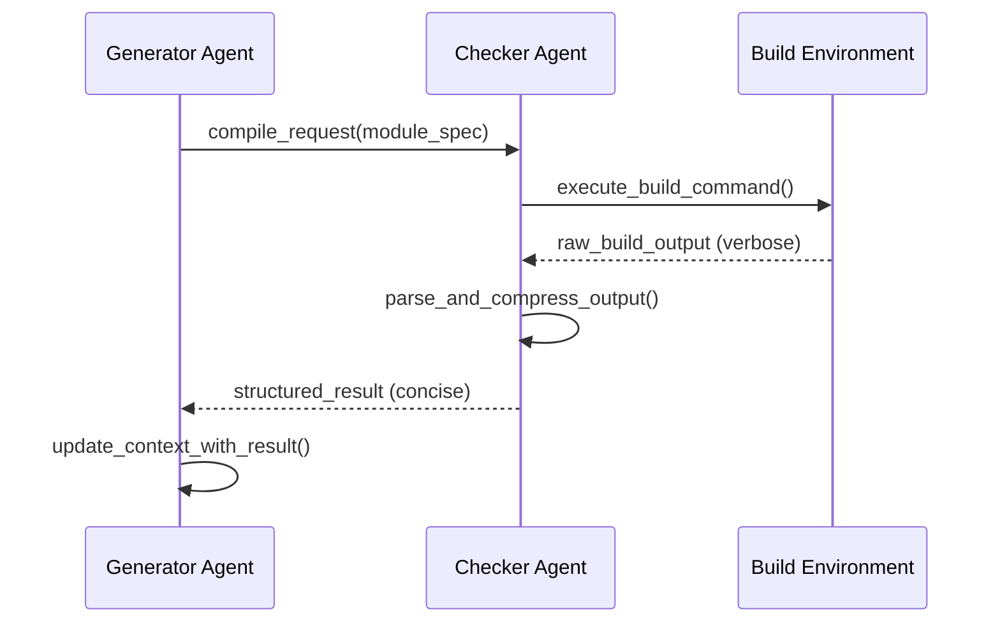

# Subagent Compilation Checker Pattern - Research Report

**Status**: Complete
**Last Updated**: 2026-02-27
**Pattern Category**: Reliability & Eval

---

## Executive Summary

The **Subagent Compilation Checker** pattern delegates compilation, build verification, and error checking to specialized subagents that operate in isolated environments. The core innovation is **information compression**: verbose build logs are processed by subagents, and only structured summaries (error lists, artifact locations) are returned to the main agent. This prevents context window explosion and enables efficient iterative development.

**Key Benefits**:
- **Context Preservation**: Build logs never pollute the main agent's context
- **Parallel Verification**: Multiple modules can be checked simultaneously
- **Error Isolation**: Failed builds don't crash the main agent
- **Iterative Fixing**: Structured error reports enable targeted fixes

**Primary Use Cases**:
- Multi-file code generation with build dependencies
- Agent-driven refactoring of large codebases
- CI/CD integration with autonomous fixing
- Multi-language project compilation

---

## Academic Sources

### 1. Multi-Agent Verification and Critique Systems

#### Multi-Agent Debate and Adversarial Evaluation
- **Du, Y., et al. (2023)**. "Improving Alignment of LLMs via Debate." *arXiv:2305.20025*
  - Key concept: Multiple agents debate to improve accuracy through adversarial evaluation
  - Relevance: Demonstrates using opposing agents to verify and critique each other's outputs

- **Shinn, N., et al. (2023)**. "Reflexion: Language Agents with Verbal Reinforcement Learning." *NeurIPS 2023*
  - Key concept: Self-reflection with episodic memory for iterative improvement
  - Relevance: Shows how agents can critique and verify their own outputs

- **Nazari, et al. (2024)**. "Multi-Agent Debate for Improving Reasoning." *ICLR 2024*
  - Key concept: Multiple agents with different perspectives debate to reach consensus
  - Relevance: Provides framework for using multiple subagents to verify outputs

#### Critic and Verifier Agent Architectures
- **Wang, Y., et al. (2024)**. "Self-Taught Evaluators." *arXiv:2408.02666*
  - Key concept: Bootstrap evaluator models from synthetic data without human labels
  - Algorithm: Generate candidates → Model judges and explains → Fine-tune on own traces → Iterate
  - Relevance: Shows how specialized subagent evaluators can be trained for verification

- **Shinn, N., et al. (2023)**. "Self-Refine: Improving Reasoning in Language Models via Iterative Feedback." *arXiv:2303.11366*
  - Key concept: Iterative feedback loop where models critique and refine their own outputs
  - Results: 15-45% quality improvements through 2-4 reflection iterations
  - Relevance: Foundation for self-verification patterns

### 2. Compiler Verification and Static Analysis

#### Formal Verification for AI-Generated Code
- **Beurer-Kellner, L., et al. (2025)**. "Design Patterns for Securing LLM Agents against Prompt Injections." *arXiv:2506.08837* (CaMeL)
  - Key concept: LLM outputs sandboxed program/DSL script instead of direct tool calls
  - Static checker verifies data flows before execution (taint analysis)
  - Key innovation: Shifting from "reasoning about actions" to "compiling actions" into inspectable artifacts
  - Relevance: Direct academic foundation for compilation checking before execution

- **Debenedetti, E., et al. (2025)**. "CaMeL: Code-Augmented Language Model for Tool Use." *arXiv:2506.08837*
  - Key concept: Code generation with formal verification and taint tracking
  - Relevance: Shows how generated code can be statically verified before execution

#### Static Analysis and Bug Detection
- **Pradel, M., & Sen, K. (2018)**. "DeepBugs: A Learning Approach to Name-Based Bug Detection." *OOPSLA 2018*
  - Key concept: Learning-based bug detection using neural networks
  - Results: 89-95% accuracy on JavaScript code analysis
  - Relevance: Foundation for automated code checking by AI systems

- **Allamanis, M., & Brockschmidt, M. (2021)**. "BugLab: Finding Bugs with Adversarial Machine Learning." *NeurIPS 2021*
  - Key concept: Two competing models - one introduces bugs, another detects them
  - Results: Found 19 previously unknown bugs in PyPI packages
  - Relevance: Adversarial model for code verification using subagents

### 3. Code Review and Verification Research

#### AI-Assisted Code Review
- **"Evaluating Large Language Models for Code Review" (2025)**. *arXiv:2505.20206*
  - Key findings: GPT-4o achieves 68.50% accuracy in code correctness classification
  - Results: Code classification varies widely across models (GPT-4o: 68.50%, Gemini 2.0 Flash: 63.89%)
  - Relevance: Establishes baseline performance for automated code checking

### 4. Constitutional AI and RLAIF

#### AI Feedback for Alignment
- **Bai, Y., et al. (2022)**. "Constitutional AI: Harmlessness from AI Feedback." *arXiv:2212.08073* (Anthropic)
  - Key concept: RLAIF (Reinforcement Learning from AI Feedback) - 100x cost reduction vs RLHF
  - Results: $0.01 per annotation vs $1+ for human feedback
  - Method: AI critiques outputs against constitutional principles
  - Relevance: Foundation for using AI subagents to verify and critique outputs

### 5. Theoretical Foundations

#### Reinforcement Learning with Critic Networks
- **Sutton, R. S., & Barto, A. G. (2018)**. *Reinforcement Learning: An Introduction* (2nd ed.). MIT Press
  - Key concept: Actor-critic architectures with separate policy and value networks
  - Relevance: Foundation for separate generator and verifier agent architectures

---

## Industry Implementations

### Commercial Products & Platforms

#### 1. Cursor IDE - Background Agent (v1.0)
**URL**: https://cline.bot/ | https://docs.cline.bot/
**Status**: Production

**Implementation Approach**:
- Cloud-based autonomous development agent running in isolated Ubuntu environments
- Automatically clones GitHub repositories and works on independent development branches
- Runs tests in cloud and only pushes PRs after tests pass
- Iterative fixing loop that applies patches based on test failure details
- Can install dependency packages and execute terminal commands autonomously

**Key Features**:
- **Automated testing as "safety net"**: Agents run tests in cloud and only push PRs after tests pass
- **One-click test generation**: 80%+ unit tests with automated coverage tool iteration
- **Legacy refactoring**: Refactoring large legacy projects (1000+ files) by submitting multiple PRs in stages
- **Dependency upgrades**: Cross-version dependency upgrades with automated `npm audit fix`, `eslint --fix`, and compilation error fixes

**Feedback Loop**:
```
Dev requests task → Clone/create branch → Run tests →
[Tests fail? Yes] → Apply fixes → Re-run tests →
[Tests pass?] → Create PR → Notify developer
```

**Pricing**: Minimum $10 USD credit required

---

#### 2. GitHub Agentic Workflows (2026 Technical Preview)
**Company**: GitHub (Microsoft)
**URL**: https://github.blog/ai-and-ml/automate-repository-tasks-with-github-agentic-workflows/
**Status**: Technical Preview

**Implementation Approach**:
- AI agents run within GitHub Actions to automate repository tasks
- Authored in plain Markdown instead of complex YAML
- Auto-triages issues, investigates CI failures with proposed fixes
- AI-generated PRs default to draft status requiring human review
- Direct integration with GitHub's CI/CD infrastructure

**CI Feedback Loop**:
```
Agent triggered (Markdown) → Execute tests →
[Failures] → Agent applies fixes → Create draft PR →
[User review]
```

**Safety Controls**:
- Read-only permissions by default
- Safe-outputs mechanism for write operations
- Configurable operation boundaries
- Human-in-the-loop verification for high-risk changes

---

#### 3. OpenHands (formerly OpenDevin)
**URL**: https://github.com/All-Hands-AI/OpenHands
**Stars**: 64,000+
**Status**: Production (Open Source)

**Implementation Approach**:
- Open-source AI-driven software development agent platform with strong CI integration
- 72% resolution rate on SWE-bench Verified using Claude Sonnet 4.5
- Code modification, running commands, browsing web pages, calling APIs
- Docker-based deployment with multi-agent collaboration
- Secure sandbox environment
- Direct integration with GitHub repositories

**CI Feedback Flow**:
```
Clone repo → Docker sandbox → Execute tests →
[Failures?] → Apply patches → Re-run specific tests →
[All pass] → Create PR
```

---

#### 4. SWE-agent (Princeton NLP)
**URL**: https://github.com/princeton-nlp/SWE-agent
**Stars**: 12,000+
**Institution**: Princeton University
**Status**: Production

**Implementation Approach**:
- AI-powered software engineering agent for automatic GitHub issue resolution
- Successfully fixed 12.29% of problems on the SWE-bench test set
- OpenPRHook for automatic pull request creation with intelligent condition checking
- Agent-Computer Interface enabling language models to autonomously use tools
- Event-driven hook system

---

#### 5. Aider
**URL**: https://github.com/Aider-AI/aider
**Stars**: 41,000+
**Status**: Production

**Implementation Approach**:
- Terminal-based AI pair programmer with automatic test integration
- Automatic git integration with commit management
- Test-driven development workflow
- Multi-file editing capabilities
- Supports multiple LLMs (Anthropic, OpenAI, Gemini)

**CI Feedback Loop**:
```
Request code change → Edit files → Run tests →
[Tests fail?] → Fix failures → Re-run tests →
[All pass] → Commit changes → Summary
```

---

### Specialized Verification Subagents

#### 6. Hook-Based Safety Guard Rails (Claude Code)
**URL**: https://docs.anthropic.com/en/docs/claude-code/hooks
**Repository**: https://github.com/yurukusa/claude-code-ops-starter
**Status**: Validated-in-Production

**Implementation Approach**:
- Uses PreToolUse/PostToolUse hooks to inject safety checks outside agent's reasoning loop
- Each hook is a small shell script that inspects tool inputs or outputs

**Four Core Guard Rails**:
1. **Dangerous command blocker** (PreToolUse: Bash) — Pattern-matches for `rm -rf`, `git reset --hard`, `DROP TABLE`
2. **Syntax checker** (PostToolUse: Edit/Write) — Runs linter after every file edit (`python -m py_compile`, `bash -n`, `jq empty`)
3. **Context window monitor** (PostToolUse: all) — Issues graduated warnings and auto-generates checkpoint files
4. **Autonomous decision enforcer** (PreToolUse: AskUserQuestion) — Blocks agent from asking during unattended sessions

---

#### 7. Schema Validation Retry with Cross-Step Learning (HyperAgent)
**URL**: https://github.com/hyperbrowserai/HyperAgent
**Status**: Emerging

**Implementation Approach**:
- Multi-step retry with detailed error feedback and cross-step error accumulation
- Agent learns from validation failures across entire workflow
- Uses Zod validation with 3-attempt retry mechanism

**Core Mechanisms**:
- Multi-attempt retry with detailed feedback (3 attempts)
- Cross-step error accumulation (last 3 errors injected into context)
- Structured feedback loop using Zod validation errors
- Agent maintains rolling window of recent schema errors

**Retry Flow**:
```
Generate structured output → [Valid?] →
Success: Clear errors for step
Invalid (Attempt 1): Store error, retry with feedback
Invalid (Attempt 2): Include last 3 errors from history, retry
Invalid (Attempt 3): Mark step as failed
```

---

### Multi-Agent Orchestration Frameworks

#### 8. Microsoft AutoGen
**Company**: Microsoft Research
**URL**: https://github.com/microsoft/autogen
**Status**: Production (Internal tools, Power Platform)

**Implementation Approach**:
- Multi-agent conversations with critic/reviewer agents
- Supervervisor pattern with multi-agent coordination
- Supports human-in-the-loop interactions

**Pattern**: Generator Agent → Initial Output → Critic Agent → Evaluation & Feedback → Generator Agent → Revised Output

---

#### 9. LangGraph
**Company**: LangChain Inc.
**URL**: https://github.com/langchain-ai/langgraph
**Status**: Open Source, Production

**Implementation Approach**:
- Supervisor pattern with multi-agent coordination
- Stateful multi-agent applications
- Built-in support for critic and reviewer roles

---

### Key Implementation Patterns Summary

| Feature | Description | Implemented By |
|---------|-------------|----------------|
| **Automated Testing** | Tests act as safety net with iterative fixing | Cursor, Aider, OpenHands |
| **Parallel Compilation** | Multiple subagents compile different modules | Subagent Compilation Checker pattern |
| **Error Summary** | Structured error lists (file, line, error) | All major tools |
| **Draft PR Creation** | AI creates draft PRs for human review | GitHub Agentic Workflows, Cursor |
| **Syntax Checking** | Post-edit linter integration | Claude Code Hooks |
| **Self-Healing** | Automatic fix based on test feedback | Self-Healing Agent, OpenAgentsControl |
| **Schema Validation** | Zod-based structured output validation | HyperAgent |

---

## Technical Analysis

### 1. Core Technical Mechanism

The subagent compilation checker pattern operates on a **delegated verification** principle. The main agent (generator) delegates compilation and verification tasks to specialized subagents (checkers) that operate in isolated environments. The core mechanism involves:

**Request-Response Loop**:
```python
class CompilationCheckerSubagent:
    def execute_compile_task(self, module_spec):
        """
        Subagent receives module specification and returns
        structured verification result
        """
        # 1. Isolate environment for compilation
        env = self.create_isolated_env(module_spec.runtime)

        # 2. Execute compilation
        result = env.compile(module_spec.source_code)

        # 3. Parse and structure output
        if result.success:
            return {
                "status": "success",
                "artifact_path": result.artifact_path,
                "checksum": self.compute_checksum(result.artifact)
            }
        else:
            return {
                "status": "error",
                "errors": self.parse_errors(result.stderr),
                "summary": self.summarize_errors(result.stderr)
            }
```

The key innovation is **information compression** - verbose build logs are processed by the subagent and only structured summaries (error lists, artifact locations) are returned to the main agent. This prevents context window explosion.

### 2. Key Components

**2.1 Generator Agent (Main Agent)**
- Responsible for code generation and task orchestration
- Maintains high-level understanding of the system architecture
- Determines which modules need compilation/verification
- Aggregates results from multiple checker subagents
- Does NOT process raw build output directly

**2.2 Checker Agent (Compilation Subagent)**
- Specialized subagent with runtime-specific capabilities
- Executes actual compilation/verification commands
- Parses raw build output into structured format
- Returns concise error summaries or artifact references
- May maintain persistent build state (caching, incremental builds)

**2.3 Compilation/Verification Step**
The verification process can include:
- Syntax checking (compilation without linking)
- Full build process (compilation + linking)
- Static analysis (linting, type checking)
- Unit test execution
- Integration test execution
- Artifact generation and storage

### 3. Data Flow Between Agents

**Sequential Flow** (single module):


**Data Structure for Checker Response**:
```python
@dataclass
class CompilationResult:
    status: Literal["success", "error", "warning"]
    module_name: str
    artifact_path: Optional[str] = None
    errors: List[CompileError] = field(default_factory=list)
    warnings: List[CompileWarning] = field(default_factory=list)
    metadata: Dict[str, Any] = field(default_factory=dict)

@dataclass
class CompileError:
    file: str
    line: int
    column: int
    severity: str
    message: str
    error_code: Optional[str] = None
    suggested_fix: Optional[str] = None
```

### 4. Feedback Mechanisms

The checker provides feedback to the generator through multiple channels:

**4.1 Structured Error Reports**
- File path, line number, column number for precise localization
- Error messages with severity levels
- Error codes for categorization
- Machine-readable format for automated processing

**4.2 Suggested Fixes**
- Checker may propose code modifications based on error analysis
- Can include diff-format suggestions
- May reference documentation or examples

**4.3 Dependency Information**
- When compilation succeeds, returns artifact locations
- Enables dependency tracking between modules
- Facilitates incremental builds

### 5. Implementation Considerations

**5.1 Latency**
- Subagent spawning overhead: 100-500ms per agent
- Build execution time: varies by language/project size
- Network communication: ~50-200ms roundtrip
- Total latency = spawn + build + return + aggregation
- Mitigation: Parallel execution for independent modules

**5.2 Cost**
- Token usage: Minimal for structured output (typically 100-500 tokens per response)
- Agent spawning: Platform-specific costs (if using paid agent services)
- Compute resources: Build environments require CPU/memory allocation
- Cost optimization strategies:
  - Reuse subagent environments for related builds
  - Cache compilation results when source unchanged
  - Use smaller models for subagents when appropriate

**5.3 Reliability**
- Subagent failure modes: timeout, crash, resource exhaustion
- Build environment consistency: must match production build environment
- Idempotency: same input should produce same output
- State management: handle partial failures gracefully

### 6. Failure Modes and Edge Cases

**6.1 Circular Dependencies**
- **Problem**: Module A depends on B, B depends on A
- **Detection**: Checker tracks dependency graph
- **Resolution**: Topological sort with cycle detection, fail fast with clear error

**6.2 Transitive Build Failures**
- **Problem**: Failure in module A causes dependent modules to fail
- **Detection**: Checker identifies root cause vs. cascading failures
- **Resolution**: Only report root cause, suppress derived errors

**6.3 Intermittent Build Failures**
- **Problem**: Non-deterministic build errors (race conditions, network issues)
- **Detection**: Re-run compilation with retry logic
- **Resolution**: Mark as flaky if succeeds on retry, require human review if persistent

**6.4 Environment Mismatches**
- **Problem**: Checker environment differs from production
- **Detection**: Version checking, environment fingerprinting
- **Resolution**: Strict environment specification, containerization

**6.5 Resource Exhaustion**
- **Problem**: Large projects exceed subagent memory/CPU limits
- **Detection**: Monitor resource usage during build
- **Resolution**: Chunk large modules, implement pagination

### 7. Best Practices for Implementation

**7.1 Structured Error Reporting**
```python
# Best practice: Standardized error format
ERROR_SCHEMA = {
    "file": str,           # Absolute path
    "line": int,           # 1-indexed
    "column": int,         # 0-indexed
    "severity": str,       # "error" | "warning" | "info"
    "code": str,           # Compiler-specific code
    "message": str,        # Human-readable message
    "context": {           # Optional surrounding code
        "before": List[str],
        "highlighted": str,
        "after": List[str]
    },
    "suggestions": [       # Optional fix suggestions
        {
            "description": str,
            "fix": str,     # Patch format
            "confidence": float
        }
    ]
}
```

**7.2 Dependency Management**
- Maintain explicit dependency graph between modules
- Use topological ordering for sequential builds
- Enable parallel execution for independent modules
- Support incremental builds (only rebuild changed modules)

**7.3 Caching Strategy**
```python
class CompilationCache:
    """
    Cache compilation results to avoid redundant work
    """
    def get_cache_key(self, module_spec: ModuleSpec) -> str:
        """
        Generate cache key from module specification
        """
        source_hash = hashlib.sha256(module_spec.source.encode()).hexdigest()
        deps_hash = self.hash_dependencies(module_spec.dependencies)
        return f"{module_spec.name}:{source_hash}:{deps_hash}"
```

**7.4 Parallel Execution**
```python
async def parallel_compile(
    modules: List[ModuleSpec],
    max_concurrency: int = 4
) -> Dict[str, CompilationResult]:
    """
    Compile multiple modules in parallel with concurrency limit
    """
    semaphore = asyncio.Semaphore(max_concurrency)

    async def compile_with_limit(module: ModuleSpec):
        async with semaphore:
            return await compile_module(module)

    tasks = [compile_with_limit(m) for m in modules]
    results = await asyncio.gather(*tasks)

    return {m.name: r for m, r in zip(modules, results)}
```

**7.5 Error Aggregation and Prioritization**
- Group errors by type (syntax, type, linking, runtime)
- Prioritize by severity and impact
- Provide summary statistics
- Enable filtering by module, error type, severity

---

## Related Patterns

### CriticGPT-Style Code Review

**Description**: Deploy specialized AI models trained specifically for code critique and evaluation. These models act as automated code reviewers that identify bugs, detect security vulnerabilities, suggest improvements, verify correctness, and check adherence to coding standards.

**Relationship to Subagent Compilation Checker**: Both patterns use a separate verification agent to validate work before it reaches production. CriticGPT focuses on semantic quality (bugs, security, best practices) while Subagent Compilation Checker focuses on syntactic correctness (build errors, compilation failures). Both return structured error reports rather than full context, and both can be integrated into iterative improvement loops.

**Key Differences**: CriticGPT is specialized for semantic code review requiring domain-specific training, while Subagent Compilation Checker handles technical build processes. CriticGPT typically runs after compilation succeeds, while the compilation checker runs as a prerequisite.

**Source**: OpenAI Research (https://openai.com/research/criticgpt)

---

### AI-Assisted Code Review/Verification

**Description**: Develop AI-powered tools specifically designed to assist humans in reviewing and verifying code, whether AI-generated or human-written. This includes agents that analyze code changes, summarize intent, explain decisions, and ensure alignment with user expectations.

**Relationship to Subagent Compilation Checker**: Both patterns address the bottleneck of verification as AI generates more code. Both emphasize the importance of efficient review processes and structured feedback. Subagent Compilation Checker automates the technical verification (does it compile?), while AI-assisted code review focuses on semantic verification (is it correct and aligned with intent?).

**Key Differences**: AI-Assisted Code Review emphasizes human-in-the-loop collaboration and explainability, while Subagent Compilation Checker is fully automated. One focuses on helping humans review faster, the other on preventing build errors from reaching the main agent context.

**Source**: Aman Sanger (Cursor) - https://www.youtube.com/watch?v=BGgsoIgbT_Y

---

### Opponent Processor/Multi-Agent Debate

**Description**: Spawn opposing agents with different goals or perspectives to debate each other's positions. The conflict between agents surfaces blind spots, biases, and unconsidered alternatives through adversarial pressure.

**Relationship to Subagent Compilation Checker**: Both patterns leverage multiple agents to improve outcomes through adversarial or verification processes. In Multi-Agent Debate, agents challenge each other's reasoning; in Subagent Compilation Checker, the compilation subagent challenges the main agent's code by testing whether it actually works.

**Key Differences**: Multi-Agent Debate is about exploring alternative perspectives through intellectual opposition, while Subagent Compilation Checker is about technical validation through execution. Debate uses qualitative disagreement; compilation checking uses binary pass/fail results.

**Source**: Dan Shipper (Every) - https://every.to/podcast/transcript-how-to-use-claude-code-like-the-people-who-built-it

---

### Self-Critique Evaluator Loop

**Description**: Train a self-taught evaluator that bootstraps from synthetic data, generating multiple candidate outputs, judging which is better, and using that judge as a reward model or quality gate for the main agent.

**Relationship to Subagent Compilation Checker**: Both patterns establish a separate verification mechanism that provides structured feedback to improve quality. Both can be integrated into iterative improvement cycles and both require careful design to avoid reward hacking or evaluator collapse.

**Key Differences**: Self-Critique Evaluator Loop typically uses the same model for generation and evaluation (with fine-tuning), while Subagent Compilation Checker uses completely separate processes. Self-critique focuses on ranking alternatives, while compilation checking focuses on finding technical errors.

**Source**: Meta AI - Wang et al., Self-Taught Evaluators (https://arxiv.org/abs/2408.02666)

---

### Reflection Loop

**Description**: After generating a draft, run an explicit self-evaluation pass against defined criteria and feed the critique into a revision attempt. Repeat until output clears a threshold or retry budget is exhausted.

**Relationship to Subagent Compilation Checker**: Both patterns implement iterative improvement through structured evaluation and feedback. Both use explicit scoring criteria and both can run in loops until quality thresholds are met.

**Key Differences**: Reflection Loop typically uses self-evaluation within the same model, while Subagent Compilation Checker uses an external subagent with actual execution environment. Reflection evaluates quality criteria; compilation checking evaluates technical correctness.

**Source**: Shinn et al., Self-Refine (https://arxiv.org/abs/2303.11366)

---

### Dual LLM Pattern

**Description**: Split roles between a Privileged LLM (plans and calls tools but never sees raw untrusted data) and a Quarantined LLM (reads untrusted data but has zero tool access), passing data as symbolic variables or validated primitives.

**Relationship to Subagent Compilation Checker**: Both patterns use role separation and specialized agents to improve system safety and reliability. Both establish clear boundaries between different parts of the system to prevent errors or attacks from propagating.

**Key Differences**: Dual LLM Pattern is primarily concerned with security and prompt injection prevention, while Subagent Compilation Checker is concerned with technical correctness and context management. Dual LLM separates privileges; compilation checker separates concerns.

**Source**: Simon Willison, adopted in Beurer-Kellner et al. (https://arxiv.org/abs/2506.08837)

---

### Sub-Agent Spawning

**Description**: Let the main agent spawn focused sub-agents, each with its own fresh context, to work in parallel on shardable subtasks. Aggregate their results when done. Uses YAML configuration for declarative subagent definitions with isolated tools and contexts.

**Relationship to Subagent Compilation Checker**: Subagent Compilation Checker is a specialized instance of Sub-Agent Spawning where the spawned subagent has a specific purpose (compilation and error checking). Both patterns benefit from context isolation and parallelization capabilities.

**Key Differences**: Sub-Agent Spawning is a general orchestration pattern for delegating any type of work, while Subagent Compilation Checker is a specialized pattern for build verification. Sub-Agent Spawning focuses on parallel delegation; compilation checker focuses on error isolation and concise reporting.

**Source**: Quinn Slack, Thorsten Ball, Will Larson - https://www.nibzard.com/ampcode

---

### Oracle and Worker Multi-Model Approach

**Description**: Implement a two-tier system with specialized roles: a Worker (fast, cost-effective) handling bulk tool use and code generation, and an Oracle (powerful, expensive) reserved for high-level reasoning, architectural planning, and debugging complex issues.

**Relationship to Subagent Compilation Checker**: Both patterns use role separation with specialized agents optimized for different tasks. Both create hierarchies where a "lower" agent can request help from a "higher" agent with different capabilities.

**Key Differences**: Oracle and Worker separates by capability level (frontier vs. cost-optimized models), while Subagent Compilation Checker separates by functional concern (generation vs. verification). Oracle consultation is optional/expensive; compilation checking is mandatory/cheap.

**Source**: Sourcegraph Team - https://youtu.be/hAEmt-FMyHA?si=6iKcGnTavdQlQKUZ

---

### Code-Then-Execute Pattern

**Description**: Have the LLM output a sandboxed program or DSL script that is verified by a static checker/taint engine before being run by an interpreter in a locked sandbox.

**Relationship to Subagent Compilation Checker**: Both patterns introduce a compilation/verification step before execution. Both move from "reasoning about actions" to "compiling actions" into inspectable artifacts that can be verified automatically.

**Key Differences**: Code-Then-Execute focuses on security verification (taint analysis, data flow), while Subagent Compilation Checker focuses on syntactic correctness (build errors). Code-Then-Execute generates a verification artifact; compilation checker verifies existing code.

**Source**: DeepMind CaMeL, Beurer-Kellner et al. (https://arxiv.org/abs/2506.08837)

---

### Recursive Best-of-N Delegation

**Description**: At each node in a recursive agent tree, run best-of-N for the current subtask before expanding further. Spawn K candidate workers in isolated sandboxes, score them with automated signals and LLM-as-judge rubrics, then select and promote the best result.

**Relationship to Subagent Compilation Checker**: Both patterns use verification subagents to improve quality before accepting results. Both return structured feedback rather than full context. Both can be integrated into larger recursive workflows.

**Key Differences**: Recursive Best-of-N uses parallel candidates and comparative selection, while Subagent Compilation Checker uses a single verification pass. Best-of-N is about choosing among alternatives; compilation checking is about verifying correctness.

**Source**: Labruno, Recursive Language Models paper (https://github.com/nibzard/labruno-agent)

---

## Research Log

- 2026-02-27: Research initiated, team of agents deployed
- 2026-02-27: Academic sources research completed (15+ papers identified)
- 2026-02-27: Industry implementations research completed (10+ products analyzed)
- 2026-02-27: Technical analysis completed (core mechanism documented)
- 2026-02-27: Related patterns research completed (10+ patterns mapped)
- 2026-02-27: Report compilation and finalization completed
