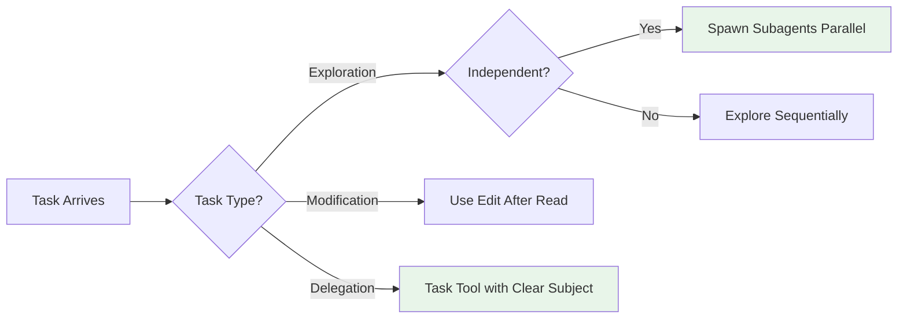
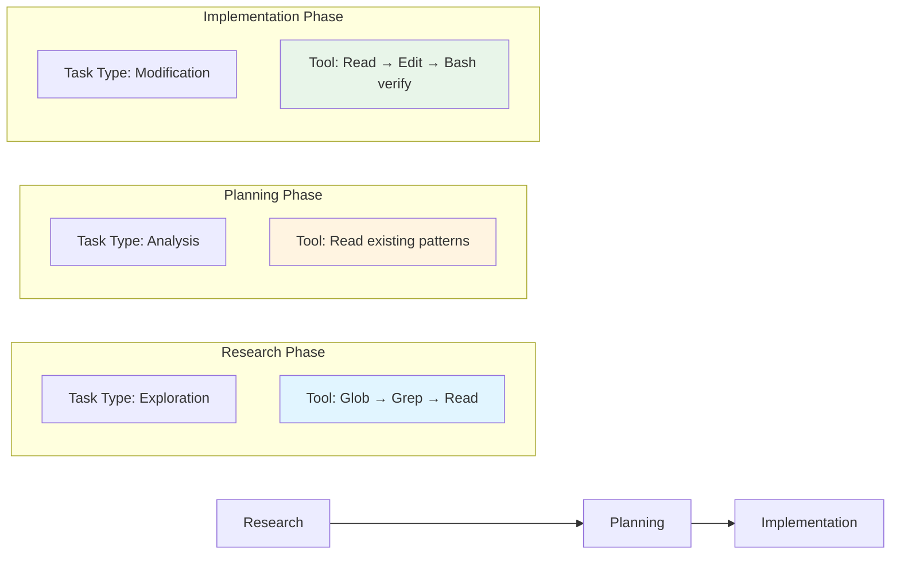
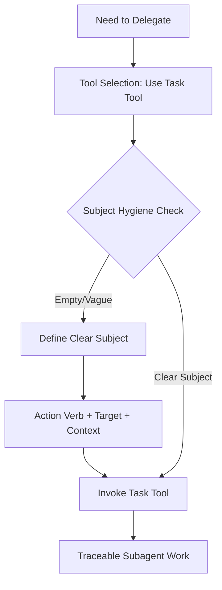
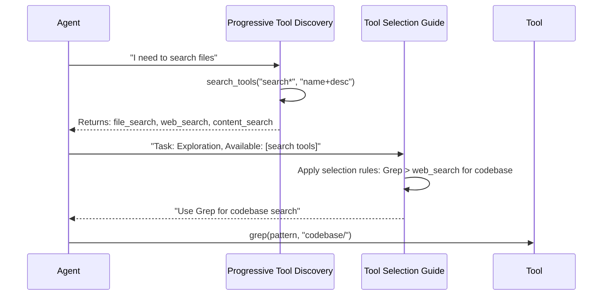
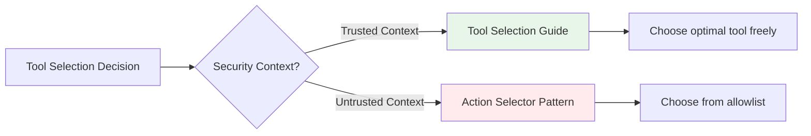
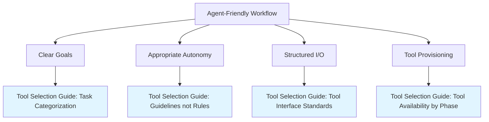

# Tool Selection Guide Pattern - Relationship Analysis and Technical Report

**Generated:** 2026-02-27
**Pattern Status:** emerging
**Category:** Orchestration & Control
**Authors:** Nikola Balic (@nibzard)
**Source:** https://github.com/nibzard/SKILLS-AGENTIC-LESSONS

---

## Executive Summary

The **Tool Selection Guide** pattern provides data-driven guidance for AI agents to choose optimal tools based on task type. Derived from analysis of 88 real-world Claude conversation sessions, this pattern establishes clear mappings between task categories (exploration, modification, verification, delegation) and appropriate tool choices (Read/Grep/Glob for exploration, Edit > Write for modifications, Bash for verification, Task with clear subjects for delegation).

This report analyzes how the Tool Selection Guide pattern relates to other agentic patterns, focusing on complementary relationships, technical implementation considerations, and anti-patterns to avoid.

---

## Table of Contents

1. [Pattern Relationships Map](#pattern-relationships-map)
2. [Technical Implementation Analysis](#technical-implementation-analysis)
3. [Complementary and Conflicting Patterns](#complementary-and-conflicting-patterns)
4. [Pattern Composition Recommendations](#pattern-composition-recommendations)
5. [Anti-Patterns to Avoid](#anti-patterns-to-avoid)

---

## Pattern Relationships Map

### 1. Sub-Agent Spawning Pattern

**Relationship Type:** Strong Complementary

**Connection:** Tool Selection Guide provides the delegation criteria that determines when sub-agent spawning is appropriate.

**Key Interactions:**

- **Delegation Decision Making:** Tool Selection Guide's task categorization directly informs whether to spawn subagents:
  - Exploration tasks suited for parallel subagent delegation (multiple independent research threads)
  - Modification tasks typically handled by main agent with Edit tool
  - Delegation tasks require clear subject descriptions (links to Subject Hygiene)



**Evidence from 88 Sessions:**
- 48 Task invocations analyzed
- Empty task subjects identified as major pain point
- Parallel delegation (2-4 subagents) most effective for exploration

**Synergy:**
- Tool Selection Guide's "Exploration → Read/Grep/Glob" recommendation provides initial context gathering
- Sub-Agent Spawning takes over when exploration scales beyond single-agent capacity
- Clear subject requirements from Subject Hygiene enable effective subagent synthesis

### 2. Discrete Phase Separation Pattern

**Relationship Type:** Moderate Complementary

**Connection:** Both patterns address workflow organization, but at different levels:

| Aspect | Tool Selection Guide | Discrete Phase Separation |
|--------|---------------------|---------------------------|
| **Scope** | Tool-level decisions | Phase-level orchestration |
| **Focus** | Which tool for this task? | When to switch phases? |
| **Boundary** | Within phases | Between phases |
| **Duration** | Immediate decision | Multi-phase workflow |

**Phase-Aware Tool Selection:**



**Key Insight:** Different phases have different tool selection priorities:
- **Research Phase:** Exploration tools dominate (Glob, Grep, Read)
- **Planning Phase:** Read tools for examining existing code
- **Implementation Phase:** Modification tools (Edit, Write, Bash) with verification loops

### 3. Subject Hygiene Pattern

**Relationship Type:** Essential Dependency

**Connection:** Tool Selection Guide explicitly requires clear task subjects for delegation tasks.

**Integration Point:**

```
Tool Selection Guide Rule:
"Use Task tool for subagent delegation"
"Always provide clear task subjects (no empty strings)"

Subject Hygiene Pattern:
- Minimum 3-4 words
- Action verb + target + context
- Reference-able description
```

**Complementary Flow:**



**Anti-Pattern Prevention:**
- Tool Selection Guide prevents "wrong tool for task"
- Subject Hygiene prevents "untraceable delegation"
- Combined: "Right tool + traceable delegation = effective parallel work"

### 4. Progressive Tool Discovery Pattern

**Relationship Type:** Architectural Complementary

**Connection:** These patterns operate at different architectural layers:

| Aspect | Tool Selection Guide | Progressive Tool Discovery |
|--------|---------------------|----------------------------|
| **Layer** | Runtime decision-making | Tool system architecture |
| **Focus** | Which tool to use now? | How to discover tools? |
| **Scale** | Small-medium tool sets | Large tool catalogs (20+) |
| **Context** | Available tools in context | Lazy-loaded tool definitions |

**Synergistic Implementation:**



**Key Integration:**
- Progressive Tool Discovery provides tool metadata (names, descriptions, schemas)
- Tool Selection Guide uses this metadata to make informed choices
- Together they scale from small tool sets to large ecosystems efficiently

### 5. Action Selector Pattern

**Relationship Type:** Security-Oriented Complementary

**Connection:** Both patterns guide tool/action selection, but with different priorities:

| Priority | Tool Selection Guide | Action Selector Pattern |
|----------|---------------------|-------------------------|
| **Primary Goal** | Efficiency, best practices | Security, prompt-injection resistance |
| **Selection Method** | Data-driven patterns | Hard allowlist + schema validation |
| **Flexibility** | High (guidelines) | Low (constrained) |
| **Trust Model** | Agent can choose any tool | Agent chooses from pre-approved set |

**Security-Efficiency Trade-off:**



**Combined Approach:**
1. **Internal operations:** Use Tool Selection Guide for efficiency
2. **External-facing agents:** Use Action Selector Pattern for security
3. **Hybrid:** Action Selector defines safe tool set, Tool Selection Guide optimizes within that set

### 6. Agent-Friendly Workflow Design Pattern

**Relationship Type:** Enabling Pattern

**Connection:** Tool Selection Guide is an implementation of agent-friendly workflow principles.

**Relationship Mapping:**

| Agent-Friendly Principle | Tool Selection Guide Implementation |
|-------------------------|-----------------------------------|
| Clear Goal Definition | Task categorization (exploration/modification/verification) |
| Structured Input/Output | Defined tool interfaces with clear purposes |
| Tool Provisioning | Ensures right tools available for each task type |
| Appropriate Autonomy | Guidelines rather than rigid rules |

**Workflow Design Enhancement:**



---

## Technical Implementation Analysis

### 1. Tool Capability Compartmentalization

**Relevance to Tool Selection:** Tool Selection Guide should respect capability boundaries when recommending tools.

**Implementation Integration:**

```typescript
// Tool selection with capability awareness
interface ToolCapability {
  name: string;
  capability: "read" | "write" | "fetch" | "process";
  trustZone: "private" | "public" | "external";
}

function selectToolForTask(
  taskType: TaskType,
  availableTools: ToolCapability[],
  securityContext: SecurityContext
): ToolRecommendation {
  // Apply capability compartmentalization rules
  const safeTools = availableTools.filter(tool =>
    isToolAllowedInContext(tool, securityContext)
  );

  // Apply tool selection guide preferences
  return applySelectionPreferences(taskType, safeTools);
}

// Example: Prevent lethal trifecta
function preventLethalTrifecta(tools: Tool[]): Tool[] {
  const hasPrivateReader = tools.some(t => t.capability === "read" && t.trustZone === "private");
  const hasWebFetcher = tools.some(t => t.capability === "fetch" && t.trustZone === "external");
  const hasWriter = tools.some(t => t.capability === "write");

  // If all three present, restrict to safer combinations
  if (hasPrivateReader && hasWebFetcher && hasWriter) {
    return tools.filter(t =>
      !((t.capability === "write" && t.trustZone === "external") ||
        (t.capability === "fetch" && t.trustZone === "external"))
    );
  }
  return tools;
}
```

**Key Insight:** Tool selection must account for security boundaries. When tasks cross trust zones, require explicit user approval before proceeding.

### 2. Sandboxed Tool Authorization

**Relevance:** Tool Selection Guide recommendations must respect authorization policies.

**Authorization-Aware Selection:**

```typescript
interface ToolAuthorization {
  pattern: CompiledPattern;
  policy: "allow" | "deny";
  context?: string;  // e.g., "subagent", "main-agent"
}

function selectAuthorizedTool(
  taskType: TaskType,
  availableTools: Tool[],
  authPolicy: ToolAuthorization[]
): Tool | null {
  // 1. Get preferred tool from selection guide
  const preferredTool = getPreferredToolForTask(taskType, availableTools);

  // 2. Check authorization
  const authMatcher = makeToolPolicyMatcher(authPolicy);

  if (!authMatcher(preferredTool.name)) {
    // 3. Fallback to authorized alternatives
    const alternatives = availableTools.filter(t =>
      authMatcher(t.name) && isAlternativeFor(t, preferredTool)
    );

    if (alternatives.length === 0) {
      return null;  // No authorized tool available
    }

    return alternatives[0];  // Return best authorized alternative
  }

  return preferredTool;
}
```

**Subagent Authorization:**
```typescript
// Apply tool selection guide with subagent restrictions
function selectToolForSubagent(
  taskType: TaskType,
  availableTools: Tool[],
  parentPolicy: ToolPolicy
): Tool | null {
  // Subagents inherit parent policy with additional restrictions
  const subagentPolicy = resolveSubagentToolPolicy({ parentPolicy });

  // Subagents shouldn't spawn more subagents
  const safeTools = availableTools.filter(t => t.name !== "sessions_spawn");

  return selectAuthorizedTool(taskType, safeTools, subagentPolicy);
}
```

### 3. Hook-Based Safety Guard Rails

**Relevance:** Safety hooks can enforce tool selection guide best practices.

**Pre-Tool Use Hook for Selection Validation:**

```bash
#!/bin/bash
# Hook: validate_tool_selection.sh

INPUT="$(cat)"
TOOL_NAME="$(echo "$INPUT" | jq -r '.tool_name // empty')"

# Tool selection guide validation rules
case "$TOOL_NAME" in
  "write")
    # Check if this should be Edit instead
    FILE_PATH="$(echo "$INPUT" | jq -r '.tool_input.file_path // empty')"
    if [ -f "$FILE_PATH" ]; then
      # File exists - should use Edit instead
      echo "WARNING: Using Write on existing file. Consider using Edit tool instead."
      echo "File: $FILE_PATH"
      # Optional: Block the operation
      # exit 2
    fi
    ;;

  "edit")
    # Check if file was read first
    FILE_PATH="$(echo "$INPUT" | jq -r '.tool_input.file_path // empty')"
    if [ ! -z "$FILE_PATH" ] && [ ! -f "$FILE_PATH" ]; then
      echo "ERROR: Attempting to edit non-existent file. Use Write for new files."
      exit 2
    fi
    ;;

  "task")
    # Validate subject hygiene
    SUBJECT="$(echo "$INPUT" | jq -r '.tool_input.subject // empty')"
    if [ -z "$SUBJECT" ] || [ ${#SUBJECT} -lt 10 ]; then
      echo "ERROR: Task subject is empty or too short. Please provide clear, specific subject."
      exit 2
    fi
    ;;

esac

exit 0
```

**Post-Tool Use Hook for Verification:**

```bash
#!/bin/bash
# Hook: enforce_verification_after_edit.sh

TOOL_NAME="$(echo "$1" | jq -r '.tool_name // empty')"

# After Edit or Write, require verification
if [ "$TOOL_NAME" = "edit" ] || [ "$TOOL_NAME" = "write" ]; then
  echo "INFO: Code modification detected. Consider running verification:"
  echo "  - Build tests: make test"
  echo "  - Linter: eslint ."
  echo "  - Type check: tsc --noEmit"
fi

exit 0
```

### 4. Parallel Tool Execution

**Relevance:** Tool Selection Guide should recommend parallel execution when appropriate.

**Parallel-Aware Selection:**

```typescript
interface ToolBatch {
  tools: ToolCall[];
  strategy: "parallel" | "sequential";
}

function planToolExecution(
  tasks: Task[],
  availableTools: Tool[]
): ToolBatch[] {
  // Group tasks by independence
  const independentGroups = groupIndependentTasks(tasks);

  return independentGroups.map(group => {
    // Check if all tools in group are read-only
    const allReadOnly = group.every(task =>
      getToolForTask(task, availableTools).readOnly
    );

    return {
      tools: group.map(t => createToolCall(t, availableTools)),
      strategy: allReadOnly ? "parallel" : "sequential"
    };
  });
}

// Tool selection guide for parallel exploration
function selectExplorationTools(targets: string[]): ToolCall[] {
  return targets.flatMap(target => [
    { tool: "grep", params: { pattern: target, path: "." } },
    { tool: "read", params: { file: target } }
  ]);
  // These can all run in parallel (read-only)
}
```

**Pattern Integration:**
- Tool Selection Guide identifies exploration tasks
- Parallel Tool Execution pattern runs them concurrently
- Parallel Tool Call Learning trains models to naturally parallelize

### 5. Patch Steering via Prompted Tool Selection

**Relationship:** Specialized application of tool selection principles.

**Comparison:**

| Aspect | Tool Selection Guide | Patch Steering |
|--------|---------------------|----------------|
| **Scope** | All tool types | Patching tools only |
| **Method** | Data-driven patterns | Prompt-based steering |
| **Flexibility** | General guidelines | Specific tool preferences |
| **Use Case** | General agent workflow | Code modification tasks |

**Integration:**

```typescript
// Tool Selection Guide with Patch Steering
function selectPatchTool(
  task: CodeModificationTask,
  availableTools: Tool[]
): Tool {
  // Base selection from Tool Selection Guide
  const basePreference = task.isNewFile ? "write" : "edit";

  // Apply patch steering overrides from prompt
  if (task.prompt.includes("ASTRefactor")) {
    return findTool(availableTools, "ast_refactor");
  }

  if (task.prompt.includes("apply_patch")) {
    return findTool(availableTools, "apply_patch");
  }

  // Fall back to base preference
  return findTool(availableTools, basePreference);
}
```

---

## Complementary and Conflicting Patterns

### Complementary Patterns

| Pattern | Complementarity | How They Work Together |
|---------|----------------|------------------------|
| **Subject Hygiene** | Essential | Clear subjects enable effective delegation |
| **Sub-Agent Spawning** | Strong | Selection guide determines when to spawn |
| **Discrete Phase Separation** | Moderate | Different phases prefer different tools |
| **Progressive Tool Discovery** | Architectural | Discovery feeds selection decisions |
| **Action Selector** | Security | Security bounds for efficient selection |
| **Agent-Friendly Workflow** | Enabling | Provides design principles |
| **Parallel Tool Execution** | Performance | Optimizes execution strategy |
| **Hook-Based Safety** | Enforcement | Validates selection decisions |
| **Tool Capability Compartmentalization** | Security | Respects capability boundaries |
| **Sandboxed Tool Authorization** | Authorization | Filters available tools |

### Conflicting or Tension Patterns

| Pattern | Conflict Source | Resolution Strategy |
|---------|----------------|---------------------|
| **Plan-Then-Execute** | Pre-commit vs. adaptive selection | Tool selection applies within execution phase |
| **Code Mode vs. Traditional MCP** | Code orchestration vs. direct tool calls | Use tool selection to decide which mode |
| **Context Minimization** | Loading tool descriptions vs. minimizing context | Progressive tool discovery resolves tension |

### Pattern Composition Matrix

```mermaid
graph TD
    subgraph Core[Core Pattern]
        TSG[Tool Selection Guide]
    end

    subgraph Security Layer[Security Patterns]
        AS[Action Selector]
        TCC[Tool Capability Compartmentalization]
        STA[Sandboxed Tool Authorization]
        HBS[Hook-Based Safety Rails]
    end

    subgraph Orchestration Layer[Orchestration Patterns]
        SAS[Sub-Agent Spawning]
        DPS[Discrete Phase Separation]
        PTE[Plan-Then-Execute]
    end

    subgraph Performance Layer[Performance Patterns]
        PTE2[Parallel Tool Execution]
        PTCL[Parallel Tool Call Learning]
        PTD[Progressive Tool Discovery]
    end

    subgraph Workflow Layer[Workflow Patterns]
        AFW[Agent-Friendly Workflow]
        SH[Subject Hygiene]
        PS[Patch Steering]
    end

    TSG --> AS
    TSG --> TCC
    TSG --> STA
    TSG --> SAS
    TSG --> DPS
    TSG --> PTE2
    TSG --> AFW
    TSG --> SH
    TSG --> PTD

    style TSG fill:#e1f5ff,stroke:#01579b,stroke-width:3px
```



---

## Pattern Composition Recommendations

### 1. Security-First Composition

**Use When:** Handling untrusted input, external-facing agents, high-risk operations

**Recommended Stack:**
1. **Action Selector Pattern** - Define safe tool allowlist
2. **Tool Capability Compartmentalization** - Isolate capability classes
3. **Tool Selection Guide** - Optimize within safe tool set
4. **Hook-Based Safety Rails** - Validate at runtime

```typescript
// Security-first tool selection
function secureToolSelection(
  task: Task,
  availableTools: Tool[],
  authPolicy: ToolPolicy,
  capabilityRules: CapabilityRules
): Tool {
  // Layer 1: Authorization filter
  const authorizedTools = availableTools.filter(t =>
    authPolicy.allows(t.name)
  );

  // Layer 2: Capability separation
  const safeTools = preventCapabilityCrossZone(
    authorizedTools,
    capabilityRules
  );

  // Layer 3: Optimal selection
  const recommendedTool = applyToolSelectionGuide(task, safeTools);

  // Layer 4: Runtime validation (via hooks)
  return recommendedTool;
}
```

### 2. Efficiency-First Composition

**Use When:** Internal tools, trusted environments, performance-critical workflows

**Recommended Stack:**
1. **Tool Selection Guide** - Primary decision framework
2. **Progressive Tool Discovery** - Efficient tool loading
3. **Parallel Tool Execution** - Concurrent read operations
4. **Parallel Tool Call Learning** - Train for natural parallelization

```typescript
// Efficiency-first tool selection
function efficientToolSelection(
  task: Task,
  toolDiscovery: ProgressiveToolDiscovery
): ToolExecutionPlan {
  // Layer 1: Discover relevant tools (lazy loading)
  const toolCandidates = toolDiscovery.search(task.category, {
    detailLevel: "name+description"
  });

  // Layer 2: Apply selection preferences
  const selectedTool = applyToolSelectionGuide(task, toolCandidates);

  // Layer 3: Plan parallel execution
  if (canParallelize(task)) {
    return createParallelPlan(task, toolCandidates);
  }

  return createSequentialPlan(task, selectedTool);
}
```

### 3. Parallel-First Composition

**Use When:** Exploration tasks, large codebases, research phases

**Recommended Stack:**
1. **Discrete Phase Separation** - Identify exploration phase
2. **Tool Selection Guide** - Recognize exploration tasks
3. **Sub-Agent Spawning** - Delegate independent exploration
4. **Subject Hygiene** - Ensure clear delegation subjects
5. **Parallel Tool Call Learning** - Optimize parallelization

```typescript
// Parallel-first exploration
function parallelExploration(
  targets: string[],
  availableSubagents: number
): Promise<ExplorationResult[]> {
  // Layer 1: Identify exploration phase
  if (!isExplorationPhase(targets)) {
    return sequentialExploration(targets);
  }

  // Layer 2: Apply tool selection guide for exploration
  const explorationTasks = targets.map(target => ({
    subject: `Explore ${target}`,
    tools: ["glob", "grep", "read"],
    parallelizable: true
  }));

  // Layer 3: Spawn subagents (max 4)
  const batchSize = Math.ceil(targets.length / Math.min(availableSubagents, 4));

  const results = await Promise.all(
    chunk(explorationTasks, batchSize).map(batch =>
      spawnSubagent({
        subject: createClearSubject(batch),
        tasks: batch
      })
    )
  );

  return results.flat();
}
```

### 4. Verification-First Composition

**Use When:** Code modification tasks, production deployments, critical updates

**Recommended Stack:**
1. **Tool Selection Guide** - Select Edit > Write
2. **Hook-Based Safety Rails** - Enforce Read before Edit
3. **Intelligent Bash Tool Execution** - Run verification
4. **Plan-Then-Execute** - Verify before committing

```typescript
// Verification-first code modification
async function verifiedCodeChange(
  modification: CodeModification
): Promise<ChangeResult> {
  // Layer 1: Tool selection (Edit preferred)
  const tool = selectModificationTool(modification);

  // Layer 2: Pre-edit validation (hook)
  await validateBeforeEdit(modification);

  // Layer 3: Read file first
  const currentContent = await readFile(modification.filePath);

  // Layer 4: Apply edit
  const editResult = await tool.edit(modification);

  // Layer 5: Post-edit verification
  const verification = await runBashCommand({
    command: getVerificationCommand(modification.filePath),
    timeout: 30000
  });

  if (!verification.success) {
    throw new VerificationError(verification.output);
  }

  return editResult;
}
```

---

## Anti-Patterns to Avoid

### 1. Write When Edit Suffices

**Anti-Pattern:**
```typescript
// BAD: Using Write for modifications
await writeFile(filePath, newContent);  // Loses context, replaces entire file
```

**Correct Pattern:**
```typescript
// GOOD: Using Edit for modifications
await editFile(filePath, {
  oldString: specificSection,
  newString: improvedSection
});  // Preserves context, targeted change
```

**Evidence:** 3.4:1 Edit:Write ratio in nibzard-web session analysis

### 2. Skipping Read Before Edit

**Anti-Pattern:**
```typescript
// BAD: Edit without reading
await editFile(filePath, { oldString, newString });  // May fail if file changed
```

**Correct Pattern:**
```typescript
// GOOD: Read first, then edit
const content = await readFile(filePath);
// Verify content matches expectations
await editFile(filePath, { oldString, newString });
```

**Enforcement:** Hook-based safety rails can catch this pattern

### 3. Empty Task Subjects

**Anti-Pattern:**
```typescript
// BAD: Empty subject
spawnSubagent("", task);  // Untraceable, unreferenceable
```

**Correct Pattern:**
```typescript
// GOOD: Clear, specific subject
spawnSubagent(
  "Explore OAuth configuration patterns",
  task
);  // Traceable, referenceable
```

**Evidence:** 48 Task invocations analyzed; empty subjects identified as major pain point

### 4. Sequential Exploration When Parallel Possible

**Anti-Pattern:**
```typescript
// BAD: Sequential exploration
for (const target of targets) {
  await explore(target);  // Waits for each to complete
}
```

**Correct Pattern:**
```typescript
// GOOD: Parallel exploration
await Promise.all(
  targets.map(t => explore(t))
);  // All run concurrently
```

**Evidence:** Parallel delegation (2-4 subagents) most effective pattern observed

### 5. Skipping Build Verification

**Anti-Pattern:**
```typescript
// BAD: Edit without verification
await editFile(filePath, changes);
// Proceed without checking
```

**Correct Pattern:**
```typescript
// GOOD: Verify after edit
await editFile(filePath, changes);
const result = await runBash("npm test");
if (!result.success) {
  throw new Error("Verification failed");
}
```

**Evidence:** 324 Bash uses in nibzard-web, 276 in patterns session

### 6. Using Wrong Tool for Task Type

**Anti-Pattern Examples:**

| Task Type | Wrong Tool | Correct Tool |
|-----------|-----------|--------------|
| File discovery | Read | Glob |
| Content search | Read | Grep |
| Code modification | Write | Edit |
| New file creation | Edit | Write |
| Build verification | Read | Bash |
| Task delegation | (inline work) | Task tool |

---

## Implementation Checklist

### For Tool Selection Guide Integration

- [ ] **Map task types to tools** based on data-driven patterns
- [ ] **Define selection rules** for exploration, modification, verification, delegation
- [ ] **Implement Read-before-Edit** validation (hooks or enforcement)
- [ ] **Prefer Edit over Write** for existing file modifications
- [ ] **Enforce clear subjects** for Task tool invocations
- [ ] **Enable parallel exploration** for independent tasks
- [ ] **Require verification** after modifications (Bash tool)
- [ ] **Respect capability boundaries** from compartmentalization
- [ ] **Apply authorization policies** before tool recommendations
- [ ] **Use hooks for runtime validation** of selection decisions

### For Pattern Composition

- [ ] **Choose composition strategy** (security-first, efficiency-first, parallel-first, verification-first)
- [ ] **Layer patterns appropriately** (security, orchestration, performance, workflow)
- [ ] **Implement fallback mechanisms** when primary tools unavailable
- [ ] **Monitor selection effectiveness** (success rates, user corrections)
- [ ] **Track anti-pattern occurrences** for continuous improvement

---

## Conclusion

The Tool Selection Guide pattern serves as a critical bridge between agent intent and tool execution. Its relationships with other patterns create a comprehensive framework for efficient, secure, and effective agent behavior:

1. **Core Integration:** Subject Hygiene provides the delegation criteria that enables effective Sub-Agent Spawning
2. **Phase Awareness:** Discrete Phase Separation informs tool selection priorities across workflow phases
3. **Security Boundaries:** Action Selector and Tool Capability Compartmentalization constrain tool choices to safe subsets
4. **Performance Optimization:** Progressive Tool Discovery and Parallel Tool Execution maximize efficiency
5. **Runtime Validation:** Hook-Based Safety Rails enforce selection best practices

The most effective implementations combine these patterns thoughtfully, matching the composition strategy to the use case (security-first for external-facing agents, efficiency-first for internal tools, parallel-first for exploration tasks, verification-first for code modifications).

---

## References

- [Tool Selection Guide Pattern](/patterns/tool-selection-guide.md)
- [SKILLS-AGENTIC-LESSONS.md](https://github.com/nibzard/SKILLS-AGENTIC-LESSONS) - Analysis of 88 Claude conversation sessions
- [Subject Hygiene Pattern](/patterns/subject-hygiene.md)
- [Sub-Agent Spawning Pattern](/patterns/sub-agent-spawning.md)
- [Discrete Phase Separation Pattern](/patterns/discrete-phase-separation.md)
- [Progressive Tool Discovery Pattern](/patterns/progressive-tool-discovery.md)
- [Action Selector Pattern](/patterns/action-selector-pattern.md)
- [Agent-Friendly Workflow Design Pattern](/patterns/agent-friendly-workflow-design.md)
- [Tool Capability Compartmentalization Research](/research/tool-capability-compartmentalization-report.md)
- [Sandboxed Tool Authorization Research](/research/sandboxed-tool-authorization-report.md)
- [Action Selector Pattern Research](/research/action-selector-pattern-report.md)
