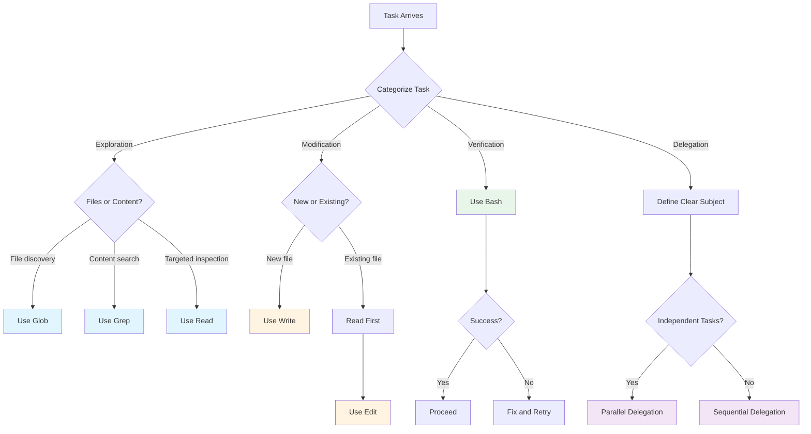
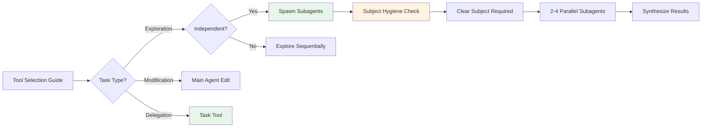
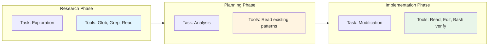
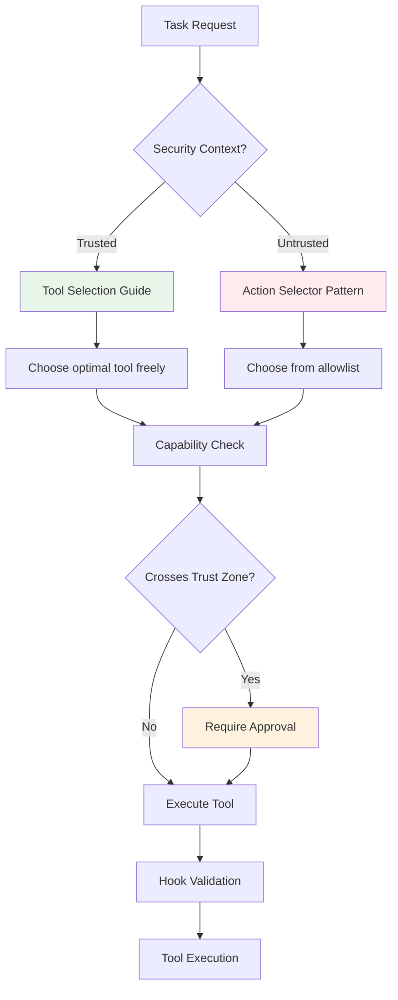
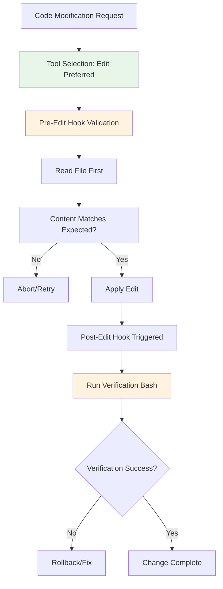
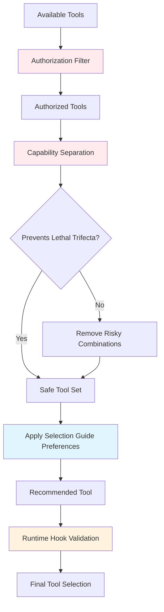

# Tool Selection Guide Pattern - Relationship Diagrams

This document contains Mermaid diagrams visualizing the relationships between the Tool Selection Guide pattern and related agentic patterns.

## 1. Core Pattern Relationship Map

```mermaid
graph TB
    subgraph Core[Core Pattern]
        TSG[Tool Selection Guide]
    end

    subgraph Security[Security Layer]
        AS[Action Selector]
        TCC[Tool Capability Compartmentalization]
        STA[Sandboxed Tool Authorization]
        HBS[Hook-Based Safety Rails]
    end

    subgraph Orchestration[Orchestration Layer]
        SAS[Sub-Agent Spawning]
        DPS[Discrete Phase Separation]
        PTE[Plan-Then-Execute]
    end

    subgraph Performance[Performance Layer]
        PTE2[Parallel Tool Execution]
        PTCL[Parallel Tool Call Learning]
        PTD[Progressive Tool Discovery]
    end

    subgraph Workflow[Workflow Layer]
        AFW[Agent-Friendly Workflow]
        SH[Subject Hygiene]
        PS[Patch Steering]
    end

    TSG -->|Provides selection criteria| SAS
    TSG -->|Respects capability boundaries| TCC
    TSG -->|Filters by authorization| STA
    TSG -->|Validated at runtime| HBS
    TSG -->|Varies by phase| DPS
    TSG -->|Applies within execution phase| PTE
    TSG -->|Optimizes execution strategy| PTE2
    TSG -->|Learns parallel patterns| PTCL
    TSG -->|Uses discovered tools| PTD
    TSG -->|Implements principles| AFW
    TSG -->|Requires clear subjects| SH
    TSG -->|Specialized for patching| PS

    AS -->|Constrains available tools| TSG

    style TSG fill:#e1f5ff,stroke:#01579b,stroke-width:3px
    style AS fill:#ffebee
    style TCC fill:#ffebee
    style STA fill:#ffebee
    style HBS fill:#ffebee
    style SH fill:#fff3e0
```



## 2. Tool Selection Decision Tree



## 3. Sub-Agent Spawning Integration



## 4. Discrete Phase Separation Integration



## 5. Security-First Tool Selection



## 6. Anti-Pattern Prevention Flow

```mermaid
flowchart TD
    A[Tool Selection Request] --> B{Check Anti-Patterns}

    B --> C{Using Write on existing file?}
    C -->|Yes| D[Use Edit Instead]
    C -->|No| E

    E --> {Skipping Read before Edit?}
    E -->|Yes| F[Read File First]
    E -->|No| G

    F --> G
    G --> {Empty task subject?}
    G -->|Yes| H[Define Clear Subject]
    G -->|No| I

    H --> I
    I --> {Can parallelize?}
    I -->|Yes| J[Use Parallel Execution]
    I -->|No| K[Use Sequential]

    J --> L[Proceed with Tool]
    K --> L

    style D fill:#c8e6c9
    style F fill:#c8e6c9
    style H fill:#c8e6c9
    style J fill:#c8e6c9
```

## 7. Progressive Tool Discovery Integration

```mermaid
sequenceDiagram
    participant Agent
    participant ToolDiscovery as Progressive Tool Discovery
    participant ToolSelection as Tool Selection Guide
    participant Tool

    Agent->>ToolDiscovery: "I need to search files"
    ToolDiscovery->>ToolDiscovery: search_tools("search*", "name+desc")
    ToolDiscovery-->>Agent: Returns: file_search, web_search, content_search

    Agent->>ToolSelection: "Task: Exploration, Available: [search tools]"
    ToolSelection->>ToolSelection: Apply selection rules
    Note over ToolSelection: Grep > web_search for codebase
    ToolSelection-->>Agent: "Use Grep for codebase search"

    Agent->>Tool: grep(pattern, "codebase/")
    Tool-->>Agent: Search results

    style ToolSelection fill:#e1f5ff
```

## 8. Verification-First Code Modification



## 9. Pattern Composition Matrix

```mermaid
graph TD
    subgraph Strategy1[Security-First Composition]
        AS1[Action Selector] --> TCC1[Capability Compartmentalization]
        TCC1 --> TSG1[Tool Selection Guide]
        TSG1 --> HBS1[Hook-Based Safety]
    end

    subgraph Strategy2[Efficiency-First Composition]
        TSG2[Tool Selection Guide] --> PTD[Progressive Tool Discovery]
        PTD --> PTE[Parallel Tool Execution]
        PTE --> PTCL[Parallel Tool Call Learning]
    end

    subgraph Strategy3[Parallel-First Composition]
        DPS[Discrete Phase Separation] --> TSG3[Tool Selection Guide]
        TSG3 --> SAS[Sub-Agent Spawning]
        SAS --> SH[Subject Hygiene]
        SH --> PTCL2[Parallel Tool Call Learning]
    end

    subgraph Strategy4[Verification-First Composition]
        TSG4[Tool Selection Guide] --> HBS2[Hook-Based Safety]
        HBS2 --> IBTE[Intelligent Bash Execution]
        IBTE --> PTE2[Plan-Then-Execute]
    end

    style TSG1 fill:#e1f5ff
    style TSG2 fill:#e1f5ff
    style TSG3 fill:#e1f5ff
    style TSG4 fill:#e1f5ff
```



## 10. Tool Selection with Security Boundaries


