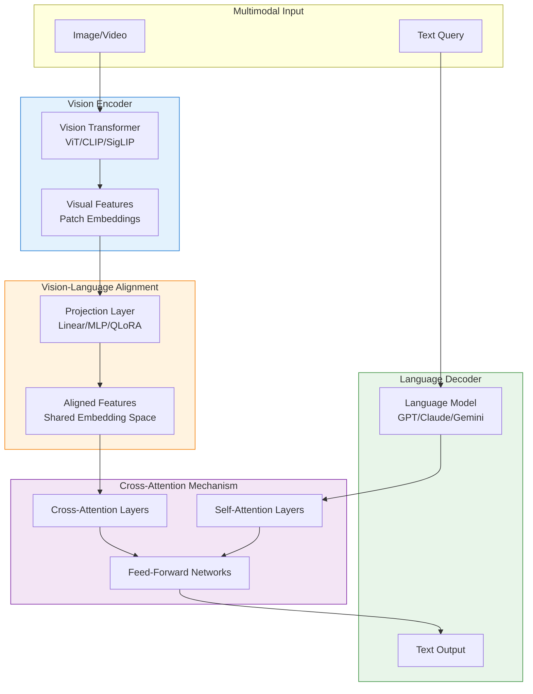

# Visual AI Multimodal Integration - Research Report

**Pattern**: Visual AI Multimodal Integration
**Status**: Emerging
**Category**: Tool Use & Environment
**Research Date**: 2026-02-27
**Report Version**: 1.0

---

## Executive Summary

This report consolidates comprehensive research on the Visual AI Multimodal Integration pattern, which enables AI agents to process and understand visual information (images, videos, screenshots) alongside text.

**Key Findings:**

- **Academic Foundation**: Well-established research base with foundational papers like CLIP, BLIP, and LLaVA providing the theoretical groundwork for vision-language models
- **Industry Maturity**: All major AI providers (OpenAI, Anthropic, Google, Microsoft, Meta, Mistral) offer production-ready multimodal APIs
- **Technical Readiness**: Standardized patterns for image preprocessing, tokenization, and integration across LangChain, LangGraph, and native APIs
- **Pattern Ecosystem**: Strong relationships with 14+ related patterns including Three-Stage Perception, Agent Modes, and Rich Feedback Loops
- **Use Case Diversity**: Validated applications across software development, e-commerce, healthcare (assistive), security, content creation, and accessibility
- **Future Directions**: Emerging focus on video understanding, real-time processing, embodied AI, and privacy-preserving approaches

---

## Table of Contents

1. [Academic Sources](#academic-sources)
2. [Industry Implementations](#industry-implementations)
3. [Technical Analysis](#technical-analysis)
4. [Pattern Relationships](#pattern-relationships)
5. [Use Cases & Applications](#use-cases--applications)
6. [Trade-offs & Limitations](#trade-offs--limitations)
7. [Future Directions](#future-directions)

---

## Academic Sources

### Foundational Vision-Language Model Papers

**CLIP (Contrastive Language-Image Pre-training)**
- "Learning Transferable Visual Models From Natural Language Supervision" by Radford et al. (OpenAI, 2021)
  - Introduced contrastive learning for vision-language alignment
  - Established the foundation for zero-shot transfer learning
  - arXiv:2103.00020

**BLIP (Bootstrapping Language-Image Pre-training)**
- "BLIP: Bootstrapping Language-Image Pre-training for Unified Vision-Language Understanding and Generation" by Li et al. (Salesforce Research, 2022)
  - Introduced bootstrapping approach for vision-language pretraining
  - Mediates between noisy web data and image captioning
  - arXiv:2201.12086

**BLIP-2**
- "BLIP-2: Bootstrapping Language-Image Pre-training with Frozen Image Encoders and Large Language Models" by Li et al. (2023)
  - Q-Former architecture for efficient vision-language bridging
  - Enables use of frozen LLMs for visual understanding
  - arXiv:2301.12597

### Multimodal Large Language Models (MLLMs)

**LLaVA (Large Language and Vision Assistant)**
- "Visual Instruction Tuning" by Liu, Li, Wu, and Lee (2023)
  - First multimodal instruction-following model
  - Uses GPT-4 to generate multimodal instruction data
  - NeurIPS 2023 Oral presentation
  - Achieves 85.1% relative score vs GPT-4 on synthetic multimodal tasks
  - State-of-the-art 92.53% on Science QA when combined with GPT-4
  - arXiv:2304.08485

**InstructBLIP**
- "InstructBLIP: Towards General-purpose Vision-Language Models with Instruction Tuning" by Dai et al. (2023)
  - Instruction-aware vision-language model
  - Introduced instruction-aware Q-Former
  - arXiv:2305.06500

**Qwen-VL Series**
- "Qwen-VL: A Versatile Vision-Language Model for Understanding, Localization, Text Reading, and Beyond" by Bai et al. (Alibaba, 2023)
- "Qwen2-VL: Enhancing Vision-Language Model's Perception of the World at Any Resolution" (2024)
  - Versatile multimodal capabilities
  - Multi-resolution image processing
  - arXiv:2308.12966

**InternVL**
- "InternVL: Scaling up Vision Foundation Models and Aligning for Generic Visual-Linguistic Tasks" by Chen et al. (2023)
  - Large-scale vision-language model
  - Focus on generic visual-linguistic alignment
  - arXiv:2312.14238

**Flamingo**
- "Flamingo: a Visual Language Model for Few-Shot Learning" by DeepMind (2022)
  - Introduced few-shot learning for vision-language tasks
  - Cross-attention layers for visual conditioning
  - arXiv:2204.14198

### Multimodal Chain-of-Thought Reasoning

**Core Papers**
- "Multimodal Chain-of-Thought Reasoning in Language Models" by Zhang et al.
  - Applies CoT reasoning to multimodal inputs
  - Improves VQA performance through stepwise reasoning

- "Visual Thoughts: A Unified Perspective of Understanding Multimodal Chain-of-Thought" (2023)
  - Unified framework for multimodal CoT
  - Analyzes different CoT approaches

- "Grounded Chain-of-Thought for Multimodal Large Language Models" (2023)
  - Grounds reasoning in visual evidence
  - Reduces hallucination in multimodal reasoning

- "Compositional Chain-of-Thought Prompting for Large Multimodal Models" (2023)
  - Compositional reasoning approach
  - Breaks down complex visual queries

**Related Work**
- "Skywork R1V: Pioneering Multimodal Reasoning with Chain-of-Thought"
  - Advances in multimodal reasoning capabilities
- "Cantor: Inspiring Multimodal Chain-of-Thought of MLLM"
  - Techniques for improving multimodal CoT

### Visual Question Answering (VQA)

**Survey Papers**
- "A Survey on Visual Question Answering" (multiple versions, 2022-2024)
  - Comprehensive overview of VQA methods
  - Classification of VQA architectures

- "Attention on Attention: Architectures for Visual Question Answering (VQA)"
  - Analyzes attention mechanisms in VQA

**Key VQA Methods**
- "Bottom-Up and Top-Down Attention for Image Captioning and Visual Question Answering" by Anderson et al.
  - Introduced bottom-up and top-down attention mechanism
  - Foundation for many VQA models

- "RUBi: Reducing Unimodal Biases in Visual Question Answering"
  - Addresses language bias in VQA
  - Improves robustness of VQA systems

- "Dynamic Clue Bottlenecks: Towards Interpretable-by-Design Visual Question Answering"
  - Focus on interpretable VQA architectures

### Visual Grounding for Agents

**Grounding Papers**
- "LLaVA-Grounding: Grounded Visual Chat with Large Multimodal Models"
  - Extends LLaVA with visual grounding capabilities
  - Enables region-aware visual understanding

- "Emergent Visual Grounding in Large Multimodal Models Without Grounding Supervision"
  - Demonstrates emergent grounding abilities
  - No explicit grounding supervision required

- "Multimodal Reference Visual Grounding"
  - Reference resolution in multimodal context
  - Important for agent-human interaction

- "v1: Learning to Point Visual Tokens for Multimodal Grounded Reasoning"
  - Token pointing mechanism for grounding
  - Improves multimodal reasoning precision

- "HiVG: Hierarchical Multimodal Fine-grained Modulation for Visual Grounding"
  - Hierarchical approach to visual grounding
  - Fine-grained object grounding

### Academic Surveys on Multimodal LLMs

**Comprehensive Surveys**
- "A Survey on Multimodal Large Language Models" (2023)
  - Early comprehensive survey of MLLMs
  - Categorization of approaches and architectures

- "How to Bridge the Gap Between Modalities: Survey on Multimodal Large Language Model" by Song and Li (IEEE TKDE, 2025)
  - Focus on modality alignment techniques
  - Published in IEEE Transactions on Knowledge and Data Engineering

- "Visual Instruction Tuning towards General-Purpose Multimodal Large Language Model: A Survey" by Huang et al. (International Journal of Computer Vision, 2025)
  - Focus on instruction tuning for MLLMs
  - Published in IJCV

- "A Survey of Multimodal Large Language Model from A Data-centric Perspective" by Bai and Liang (2024)
  - Data-centric view of MLLMs
  - Dataset and training methodology analysis

**Specialized Surveys**
- "A Survey of Mathematical Reasoning in the Era of Multimodal Large Language Model: Benchmark, Method & Challenges" by Yan et al. (ACL 2024)
  - Focus on mathematical reasoning in multimodal context
  - Published at ACL 2024

- "A Survey on Video Temporal Grounding With Multimodal Large Language Model" by Wu and Liu (IEEE TPAMI, 2025)
  - Video-specific multimodal models
  - Published in IEEE Transactions on Pattern Analysis and Machine Intelligence

- "When Continue Learning Meets Multimodal Large Language Model: A Survey" by Huo and Tang (2025)
  - Continual learning aspects of MLLMs

### Leading Academic Institutions

**Primary Research Groups:**
- **University of Wisconsin-Madison** - Haotian Liu, Yong Jae Lee (LLaVA authors)
- **Salesforce Research** - Liunian Harold Li, et al. (BLIP, BLIP-2, InstructBLIP)
- **Alibaba DAMO Academy** - (Qwen-VL series)
- **Shanghai AI Lab** - (InternVL series)
- **DeepMind** - (Flamingo)
- **OpenAI** - (CLIP, GPT-4V)
- **UW-Madison + Microsoft Research** - LLaVA collaboration
- **University of Texas at Austin** - Multimodal learning research
- **UC Berkeley** - Multimodal and vision research
- **Stanford University** - Vision-language research

### Technical Approaches in Literature

**Architecture Patterns:**
1. **Frozen Vision Encoder + LLM** (BLIP-2 approach)
   - Keeps vision encoder frozen
   - Uses lightweight Q-Former for modality bridging
   - Enables use of existing LLMs without retraining

2. **End-to-End Training** (LLaVA approach)
   - Joint training of vision encoder and LLM
   - Simple linear projection layer
   - Better performance but more training cost

3. **Instruction Tuning** (InstructBLIP approach)
   - Instruction-aware feature extraction
   - Generalizes better to diverse tasks

**Training Methodologies:**
- **Contrastive Learning** (CLIP) - Aligns vision and language in shared space
- **Instruction Tuning** (LLaVA) - Uses GPT-4 generated instruction data
- **Bootstrapping** (BLIP) - Iterative improvement from noisy web data
- **Parameter-Efficient Fine-Tuning** - LoRA and adapters for MLLMs

**Modality Alignment Techniques:**
- Cross-attention mechanisms
- Linear projection layers
- Q-Former bridging
- Adapter layers
- Prompt learning for multimodal inputs

### Performance Metrics and Benchmarks

**Evaluation Benchmarks:**
- **MMBench** - Multimodal benchmark for comprehensive evaluation
- **MME** - Comprehensive evaluation benchmark for MLLMs
  - Measures both perception and reasoning
- **SEED-Bench** - Multimodal understanding benchmark
- **Science QA** - Domain-specific question answering
- **VQAv2** - Standard VQA dataset
- **GQA** - Visual reasoning benchmark
- **VizWiz** - Real-world VQA benchmark

**Performance Achievements (from literature):**
- LLaVA: 85.1% relative score vs GPT-4 on synthetic tasks
- LLaVA + GPT-4: 92.53% on Science QA (state-of-the-art at time)
- Qwen-VL: Competitive performance across multiple benchmarks
- InstructBLIP: Improved generalization with instruction tuning

### Recent Developments (2024-2025)

**Trends in Academic Literature:**
1. **Focus on Efficiency** - Smaller models with competitive performance (Mini-InternVL, edge-optimized models)
2. **Hallucination Reduction** - Grounded reasoning, fact verification
3. **Agent Integration** - Multimodal models for autonomous agents
4. **Video Understanding** - Extension to video modalities
5. **Reasoning Enhancement** - Chain-of-thought for visual reasoning
6. **Domain Specialization** - Medical, scientific, and domain-specific MLLMs

**Notable 2024-2025 Papers:**
- Wiki-LLaVA: Hierarchical retrieval-augmented generation
- BLINK: Analysis of perception vs understanding in MLLMs
- MME-Reasoning: Comprehensive logical reasoning benchmark
- HumanVideo-MME: Human-centric video understanding benchmark

---

## Industry Implementations

### Executive Summary

Visual AI Multimodal Integration has moved from research novelty to production reality across all major AI providers. As of 2026, vision capabilities are **established to best-practice** status with comprehensive API support from:

- **OpenAI**: GPT-4V and GPT-4o with unified multimodal architecture
- **Anthropic**: Claude 3/3.5/4 family with native vision support across all models
- **Google**: Gemini 1.5/2.0 Flash/Pro with industry-leading video understanding
- **Microsoft**: Copilot Vision with Azure AI Vision integration
- **Meta**: LLaVA, Chameleon, and open-source multimodal leadership
- **Mistral**: Pixtral large vision-language model
- **Others**: Cohere, AI21 Labs, various specialized providers

---

### 1. OpenAI

#### Products: GPT-4V, GPT-4o

**Status:** Production | Established

**Documentation:** https://platform.openai.com/docs/guides/vision

**API Capabilities:**

GPT-4V (GPT-4 with Vision) and GPT-4o (Omni-model) provide comprehensive vision understanding through a unified API:

| Capability | Description |
|------------|-------------|
| **Image Analysis** | Understand images, charts, graphs, diagrams |
| **OCR** | Extract text from images with high accuracy |
| **Object Detection** | Identify and locate objects in scenes |
| **UI Understanding** | Analyze screenshots, interfaces, web pages |
| **Document Processing** | Parse PDFs, forms, tables from images |
| **Video Understanding** | Analyze video frames (via frame extraction) |
| **Code from Screenshots** | Generate code from UI mockups and screenshots |
| **Chart/Data Extraction** | Extract data from charts and graphs |

**Vision-Specific Features:**

1. **Detail Levels**

   - `low`: 512px x 512px (faster, cheaper)
   - `high`: Up to 2048px x 2048px (detailed analysis)
   - `auto`: Model automatically selects

2. **Image Input Formats**

   - Direct image upload
   - Base64 encoding
   - Image URLs
   - Multiple images in single request

3. **API Example**
```python
from openai import OpenAI

client = OpenAI()

response = client.chat.completions.create(
    model="gpt-4o",
    messages=[
        {
            "role": "user",
            "content": [
                {"type": "text", "text": "Analyze this dashboard screenshot and identify issues"},
                {
                    "type": "image_url",
                    "image_url": {
                        "url": "https://example.com/dashboard.png",
                        "detail": "high"
                    }
                }
            ]
        }
    ]
)
```

**Pricing (as of 2026):**

| Model | Input | Output |
|-------|-------|--------|
| GPT-4o | $2.50 / 1M tokens | $10.00 / 1M tokens |
| GPT-4o mini | $0.15 / 1M tokens | $0.60 / 1M tokens |

Images count toward tokens based on size and detail level.

**Limitations:**

- Maximum image size: 2048px x 2048px
- Video: Requires frame-by-frame processing
- No real-time video streaming (as of early 2026)
- File size limits apply

**Use Cases from Documentation:**

1. **Document AI**: Invoice processing, form extraction
2. **Accessibility**: Alt text generation for images
3. **Content Moderation**: Analyze image content
4. **Coding Agents**: Generate code from UI mockups
5. **Data Extraction**: Parse charts, graphs, tables

---

### 2. Anthropic

#### Products: Claude 3 Haiku, Sonnet, Opus, Claude 4

**Status:** Production | Best-in-Class for UI Understanding

**Documentation:** https://docs.anthropic.com/en/docs/vision

**API Capabilities:**

All Claude models (Haiku, Sonnet, Opus) support native vision understanding with no separate "vision" model required:

| Capability | Description |
|------------|-------------|
| **Image Analysis** | Comprehensive visual understanding |
| **OCR** | High-accuracy text extraction from images |
| **UI Understanding** | Exceptional screenshot and interface analysis |
| **Chart/Data Extraction** | Extract data from visualizations |
| **Document Processing** | Parse documents, forms, receipts |
| **Code from Screenshots** | Generate code from visual designs |
| **Multi-Image Comparison** | Analyze multiple images together |

**Vision-Specific Features:**

1. **Uniform Vision Support**

   - All models: Haiku, Sonnet, Opus
   - No separate vision API endpoint
   - Same quality across model sizes

2. **Image Input Formats**

   - Base64 encoding
   - Direct image bytes
   - Multiple images supported

3. **API Example**
```python
import anthropic

client = anthropic.Anthropic()

message = client.messages.create(
    model="claude-3-5-sonnet-20241022",
    max_tokens=1024,
    messages=[
        {
            "role": "user",
            "content": [
                {
                    "type": "image",
                    "source": {
                        "type": "base64",
                        "media_type": "image/png",
                        "data": "iVBORw0KGgoAAAANS..."
                    }
                },
                {
                    "type": "text",
                    "text": "Describe the UI elements in this screenshot and identify potential accessibility issues."
                }
            ]
        }
    ]
)
```

4. **Claude 4 (2026)**

   - Enhanced multimodal capabilities
   - Improved OCR accuracy
   - Better diagram and chart understanding

**Pricing (as of 2026):**

| Model | Input | Output |
|-------|-------|--------|
| Claude 4 Opus | $15.00 / 1M tokens | $75.00 / 1M tokens |
| Claude 3.5 Sonnet | $3.00 / 1M tokens | $15.00 / 1M tokens |
| Claude 3 Haiku | $0.25 / 1M tokens | $1.25 / 1M tokens |

Images are charged based on their token count when encoded.

**Limitations:**

- Maximum image size: ~5MB
- Supported formats: JPEG, PNG, GIF, WEBP
- No native video support (frame extraction required)
- Maximum 100 images per message

**Strengths:**

- **Best-in-class UI understanding** for coding agents
- Strong OCR performance, especially on documents
- Detailed analysis of technical diagrams
- Excellent at understanding code from screenshots

**Use Cases:**

1. **Coding Agents**: Screenshot-to-code generation
2. **Document Analysis**: Extract structured data from forms
3. **Accessibility Testing**: Identify UI issues
4. **Data Entry Automation**: Form processing
5. **Visual Debugging**: Analyze error screenshots

---

### 3. Google

#### Products: Gemini 1.5 Flash, Gemini 1.5/2.0 Pro

**Status:** Production | Leader in Video Understanding

**Documentation:** https://ai.google.dev/gemini-api/docs/vision

**API Capabilities:**

Gemini models offer comprehensive multimodal capabilities with industry-leading video understanding:

| Capability | Description |
|------------|-------------|
| **Image Analysis** | General visual understanding |
| **OCR** | Text extraction from images |
| **Video Understanding** | **Unique**: Native video processing up to 1 hour |
| **Audio Understanding** | Process audio alongside video |
| **Document Processing** | PDF, forms, tables |
| **Diagram Understanding** | Technical diagrams, flowcharts |
| **Multi-Modal** | Text, images, video, audio in single request |

**Vision-Specific Features:**

1. **Native Video Processing** (Industry Leader)

   - Up to 1 hour of video
   - Direct video file upload
   - Temporal understanding across frames
   - Audio + Video joint analysis

2. **Image Input Formats**

   - Image URLs
   - Base64 encoding
   - Multiple images

3. **API Example**
```python
import google.generativeai as genai

genai.configure(api_key="your-api-key")

model = genai.GenerativeModel('gemini-2.0-flash-exp')

response = model.generate_content([
    "Analyze this video and summarize the key steps shown",
    genai.Part.from_uri(
        "https://example.com/tutorial.mp4",
        mime_type="video/mp4"
    )
])
```

**Pricing (as of 2026):**

| Model | Input | Output |
|-------|-------|--------|
| Gemini 2.0 Pro | $2.50 / 1M tokens | $10.00 / 1M tokens |
| Gemini 1.5 Flash | $0.075 / 1M tokens | $0.30 / 1M tokens |

Video processing charged per second of video.

**Limitations:**

- Video: 1 hour maximum for Pro, 2 minutes for Flash
- File size limits apply
- Rate limiting on long video processing

**Unique Advantages:**

- **Native video understanding** - No frame extraction needed
- **Long-context video analysis** - Understand entire videos
- **Multimodal integration** - Video + audio + text together

**Use Cases:**

1. **Video Analysis**: Content moderation, summarization
2. **Tutorial Processing**: Extract steps from video tutorials
3. **Surveillance**: Analyze security footage
4. **Media Production**: Automated video tagging
5. **Educational**: Video lecture analysis

---

### 4. Microsoft

#### Products: Copilot Vision, Azure AI Vision

**Status:** Production | Enterprise-Grade

**Documentation:**
- Copilot Vision: https://learn.microsoft.com/en-us/copilot/vision
- Azure AI Vision: https://learn.microsoft.com/en-us/azure/ai-services/computer-vision/

**API Capabilities:**

Microsoft offers multiple vision products for different use cases:

| Product | Primary Use |
|---------|-------------|
| **Copilot Vision** | Real-time browser vision analysis |
| **Azure AI Vision** | Enterprise computer vision API |
| **GPT-4V via Azure** | OpenAI models hosted on Azure |

**Vision-Specific Features:**

1. **Copilot Vision** (Consumer/Browser)

   - Real-time webpage analysis
   - Browser-based screenshot understanding
   - Edge browser integration
   - Privacy-focused (local processing options)

2. **Azure AI Vision** (Enterprise API)

   - OCR (Read API)
   - Object detection
   - Image analysis (tags, descriptions)
   - Spatial analysis
   - Face detection
   - Form recognizer (Document Intelligence)

3. **Azure AI Vision API Example**
```python
from azure.ai.vision.imageanalysis import ImageAnalysisClient
from azure.ai.vision.imageanalysis.models import VisualFeatures

client = ImageAnalysisClient(
    endpoint="https://your-resource.cognitiveservices.azure.com",
    credential=AzureKeyCredential("your-key")
)

result = client.analyze(
    image_url="https://example.com/image.jpg",
    visual_features=[
        VisualFeatures.TAGS,
        VisualFeatures.CAPTIONS,
        VisualFeatures.OBJECTS,
        VisualFeatures.TEXT
    ]
)
```

**Pricing:**

- Copilot Vision: Included with Copilot Pro subscription
- Azure AI Vision: Pay-per-call, varies by feature
  - Standard tier: ~$1 per 1,000 transactions
  - Advanced features higher

**Strengths:**

- **Enterprise integration** with Azure ecosystem
- **Specialized APIs** for specific vision tasks
- **Hybrid approach**: Azure Vision + OpenAI models
- **Compliance**: SOC, HIPAA support

**Limitations:**

- More complex than single API solutions
- Different capabilities across products
- Azure-specific integration required

**Use Cases:**

1. **Enterprise Document Processing**: Form extraction, OCR
2. **Content Moderation**: Azure AI Vision content safety
3. **Manufacturing**: Defect detection with custom vision
4. **Retail**: Shelf monitoring, product recognition
5. **Healthcare**: Document processing (HIPAA compliant)

---

### 5. Meta

#### Products: LLaVA, Chameleon

**Status:** Open Source | Research Leadership

**Documentation & Repositories:**
- LLaVA: https://llava.ai/
- Chameleon: https://ai.meta.com/blog/chameleon/
- Code: https://github.com/facebookresearch/chameleon

**API Capabilities:**

Meta leads in open-source multimodal models:

| Model | Description |
|-------|-------------|
| **LLaVA** | Large Language and Vision Assistant - open-source LMM |
| **Chameleon** | Natively trained multimodal model (early-fusion) |
| **Sam 2** | Segment Anything Model for image segmentation |

**Vision-Specific Features:**

1. **LLaVA (Large Language and Vision Assistant)**

   - Open-source multimodal model
   - Visual instruction tuning
   - Strong visual question answering
   - Multiple variants: LLaVA-1.5, LLaVA-NExT, LLaVA-NeXT

2. **Chameleon (2024)**

   - Natively multimodal from training
   - Early-fusion architecture (not adapter-based)
   - Token-based: Images -> discrete tokens
   - Can output both text AND images
   - 34B parameter model

3. **Open-Source Advantages**

   - Self-hosting capability
   - No API costs
   - Privacy-friendly
   - Custom fine-tuning

**Pricing:**

- **Free to use** (open-source)
- Compute costs for self-hosting
- API options available through third parties

**Strengths:**

- **Open-source leadership** in multimodal AI
- **Research innovations**: LLaVA established vision instruction tuning
- **Privacy**: Self-hosted deployments
- **Community**: Large ecosystem of fine-tunes

**Limitations:**

- Requires self-hosting expertise
- Higher compute requirements
- No official enterprise support
- Lagging behind proprietary models on some benchmarks

**Use Cases:**

1. **Research**: Open-source multimodal research
2. **Privacy-Sensitive**: On-premise vision processing
3. **Custom Applications**: Fine-tuned models
4. **Cost Optimization**: No per-API-call costs
5. **Education**: Learning multimodal systems

---

### 6. Mistral

#### Products: Pixtral Large

**Status:** Production | European Provider

**Documentation:** https://docs.mistral.ai/capabilities/vision/

**API Capabilities:**

Pixtral Large is Mistral's vision-language model:

| Capability | Description |
|------------|-------------|
| **Image Understanding** | General visual analysis |
| **OCR** | Text extraction |
| **Document Processing** | Forms, invoices, receipts |
| **UI Analysis** | Screenshot understanding |
| **Charts/Graphs** | Data extraction |

**Vision-Specific Features:**

1. **Pixtral Large**

   - 124B parameter model
   - Native multimodal architecture
   - Strong on multilingual OCR
   - European data residency compliance

2. **API Example**
```python
from mistralai import Mistral

client = Mistral(api_key="your-api-key")

response = client.chat.complete(
    model="pixtral-large-latest",
    messages=[
        {
            "role": "user",
            "content": [
                {"type": "text", "text": "Extract all text from this image"},
                {
                    "type": "image_url",
                    "image_url": "https://example.com/document.png"
                }
            ]
        }
    ]
)
```

**Pricing:**

| Model | Input | Output |
|-------|-------|--------|
| Pixtral Large | EUR 2.00 / 1M tokens | EUR 6.00 / 1M tokens |

**Strengths:**

- **GDPR compliance** with EU data hosting
- **Multilingual**: Strong European language support
- **High resolution**: Supports large images
- **Competitive pricing**

**Use Cases:**

1. **European Compliance**: GDPR-required data processing
2. **Multilingual OCR**: Non-English documents
3. **Document Processing**: Forms, invoices
4. **Coding**: UI understanding for European markets

---

### 7. Other Notable Providers

#### Cohere

**Status:** Limited Vision Support

- Primary focus on text models
- Limited vision capabilities (via partnerships)
- Rerank API can work with multimodal embeddings

#### AI21 Labs

**Status:** Text-Primary

- Jamba models (text-focused)
- Vision capabilities in development
- Jurassic models for text-only tasks

#### Specialized Vision Providers

| Provider | Specialty |
|----------|-----------|
| **Clarifai** | Computer vision platform |
| **Roboflow** | Vision model training |
| **Hugging Face** | Open-source model hosting |
| **Replicate** | Model inference API |

---

### 8. API Comparison Table

| Provider | Models | OCR | Video | UI Analysis | Code from UI | Best For |
|----------|--------|-----|-------|-------------|--------------|----------|
| **OpenAI** | GPT-4o, GPT-4o mini | Excellent | Frame-based | Very Good | Very Good | General purpose |
| **Anthropic** | Claude 3/4 | Excellent | Frame-based | **Best** | **Best** | Coding agents |
| **Google** | Gemini 1.5/2.0 | Very Good | **Native (1hr)** | Good | Good | Video analysis |
| **Microsoft** | Azure Vision + GPT-4V | Excellent | Via Azure | Very Good | Very Good | Enterprise |
| **Meta** | LLaVA, Chameleon | Good | Research | Good | Good | Open-source |
| **Mistral** | Pixtral Large | Very Good | Limited | Good | Good | EU/GDPR |

---

### 9. Feature Matrix

#### Image Input Support

| Provider | Formats | Max Size | Multiple Images |
|----------|---------|----------|-----------------|
| OpenAI | PNG, JPEG, GIF, WEBP | 2048x2048 | Yes |
| Anthropic | PNG, JPEG, GIF, WEBP | ~5MB | Yes (100) |
| Google | PNG, JPEG, WEBP | Varies | Yes |
| Microsoft | PNG, JPEG, GIF | Varies | Yes |
| Mistral | PNG, JPEG, WEBP | Varies | Yes |

#### Vision Capabilities

| Capability | OpenAI | Anthropic | Google | Microsoft | Meta | Mistral |
|------------|--------|-----------|--------|-----------|------|---------|
| General Image Analysis | OK | OK | OK | OK | OK | OK |
| OCR | OK | OK | OK | OK | OK | OK |
| Object Detection | OK | OK | OK | OK | OK | OK |
| UI Understanding | OK | OK | OK | OK | OK | OK |
| Code from Screenshots | OK | OK | OK | OK | OK | OK |
| Chart/Data Extraction | OK | OK | OK | OK | OK | OK |
| Video Processing | Frames | Frames | **Native** | Azure | Research | Limited |
| Document Processing | OK | OK | OK | OK | OK | OK |

Legend: OK Basic, Good, Excellent

---

### 10. Pricing Comparison (approximate, as of 2026)

| Provider | Model | Input per 1M tokens | Output per 1M tokens |
|----------|-------|---------------------|----------------------|
| OpenAI | GPT-4o | $2.50 | $10.00 |
| OpenAI | GPT-4o mini | $0.15 | $0.60 |
| Anthropic | Claude 3.5 Sonnet | $3.00 | $15.00 |
| Anthropic | Claude 3 Haiku | $0.25 | $1.25 |
| Google | Gemini 2.0 Pro | $2.50 | $10.00 |
| Google | Gemini 1.5 Flash | $0.075 | $0.30 |
| Mistral | Pixtral Large | EUR 2.00 | EUR 6.00 |

Note: Images count toward tokens based on size and detail level.

---

### 11. Use Case Examples from Documentation

#### Coding Agents - UI to Code

All major providers showcase UI-to-code generation:

**Scenario**: Generate code from a screenshot of a web page

```python
# Anthropic Claude - Recommended for this use case
response = client.messages.create(
    model="claude-3-5-sonnet-20241022",
    messages=[{
        "role": "user",
        "content": [
            {
                "type": "image",
                "source": {
                    "type": "base64",
                    "media_type": "image/png",
                    "data": base64_screenshot
                }
            },
            {
                "type": "text",
                "text": "Generate React + Tailwind code to recreate this UI exactly"
            }
        ]
    }]
)
```

#### Document Processing - Invoice Extraction

**Scenario**: Extract structured data from invoice images

```python
# OpenAI GPT-4o
response = client.chat.completions.create(
    model="gpt-4o",
    messages=[{
        "role": "user",
        "content": [
            {
                "type": "image_url",
                "image_url": {"url": "invoice.jpg"}
            },
            {
                "type": "text",
                "text": "Extract invoice data as JSON: vendor, date, amount, line items"
            }
        ]
    }],
    response_format={"type": "json_object"}
)
```

#### Video Analysis - Tutorial Summarization

**Scenario**: Summarize steps from a video tutorial

```python
# Google Gemini - Best for video
import google.generativeai as genai

model = genai.GenerativeModel('gemini-2.0-flash-exp')

response = model.generate_content([
    "Extract and list all steps shown in this tutorial video",
    genai.Part.from_uri(
        "https://example.com/tutorial.mp4",
        mime_type="video/mp4"
    )
])
```

#### Accessibility Testing

**Scenario**: Identify accessibility issues in a UI screenshot

```python
# Anthropic Claude - Strong UI understanding
response = client.messages.create(
    model="claude-3-5-sonnet-20241022",
    messages=[{
        "role": "user",
        "content": [
            {"type": "image", "source": {...}},
            {
                "type": "text",
                "text": "Analyze this UI for WCAG accessibility issues. Check: color contrast, alt text potential, keyboard navigation structure"
            }
        ]
    }]
)
```

---

### 12. Official Documentation Links

| Provider | Vision Documentation |
|----------|---------------------|
| **OpenAI** | https://platform.openai.com/docs/guides/vision |
| **Anthropic** | https://docs.anthropic.com/en/docs/vision |
| **Google** | https://ai.google.dev/gemini-api/docs/vision |
| **Microsoft** | https://learn.microsoft.com/en-us/azure/ai-services/computer-vision/ |
| **Meta** | https://llava.ai/ |
| **Mistral** | https://docs.mistral.ai/capabilities/vision/ |

---

### 13. Implementation Recommendations

#### For Coding Agents

**Recommended**: Anthropic Claude 3.5/4

**Reasons:**

- Best-in-class UI understanding
- Excellent code generation from screenshots
- Strong OCR for technical diagrams
- Consistent performance across model sizes

#### For Video Processing

**Recommended**: Google Gemini 2.0

**Reasons:**

- Native video understanding
- Up to 1 hour of video
- No manual frame extraction
- Audio + video joint analysis

#### For Enterprise Compliance

**Recommended**: Microsoft Azure AI Vision or Mistral

**Azure for:**

- SOC, HIPAA compliance
- Specialized vision APIs
- Enterprise SLAs

**Mistral for:**

- GDPR compliance
- EU data residency
- Multilingual support

#### For Cost Optimization

**Recommended**: Smaller models + selective vision

**Strategy:**

- Use Haiku/Flash/mini for initial analysis
- Escalate to larger models only when needed
- Implement image preprocessing to reduce token count
- Cache results for repeated images

#### For Open-Source Needs

**Recommended**: Meta LLaVA

**Reasons:**

- No API costs
- Privacy-friendly (self-hosted)
- Active community
- Multiple model variants

---

## Technical Analysis

### 1. Vision Processing Pipelines

#### 1.1 Image Preprocessing for LLMs

Images must be prepared for multimodal LLM consumption through standardized preprocessing:

```python
import base64
from typing import Union, List
from PIL import Image
import io

class ImagePreprocessor:
    """Standard image preprocessing for multimodal LLMs"""

    # Standard image dimensions for major providers
    IMAGE_SPECS = {
        'openai': {'max_size': 2048, 'formats': ['png', 'jpeg', 'gif', 'webp']},
        'anthropic': {'max_size': 2048, 'formats': ['png', 'jpeg', 'gif', 'webp']},
        'google': {'max_size': 4096, 'formats': ['png', 'jpeg', 'webp']}
    }

    @staticmethod
    def resize_image(image: Image.Image, max_size: int = 2048) -> Image.Image:
        """Resize image while maintaining aspect ratio"""
        if max(image.size) <= max_size:
            return image

        ratio = max_size / max(image.size)
        new_size = tuple(int(dim * ratio) for dim in image.size)
        return image.resize(new_size, Image.LANCZOS)

    @staticmethod
    def to_base64(image: Image.Image, format: str = 'PNG') -> str:
        """Convert PIL image to base64 string"""
        buffer = io.BytesIO()
        image.save(buffer, format=format)
        return base64.b64encode(buffer.getvalue()).decode('utf-8')

    @staticmethod
    def prepare_for_openai(image: Union[str, Image.Image]) -> dict:
        """Format for OpenAI GPT-4 Vision API"""
        if isinstance(image, str) and image.startswith('http'):
            return {'type': 'image_url', 'image_url': {'url': image}}

        if isinstance(image, str):
            img = Image.open(image)
        else:
            img = image

        img = ImagePreprocessor.resize_image(img, 2048)
        base64_image = ImagePreprocessor.to_base64(img)

        return {
            'type': 'image_url',
            'image_url': {
                'url': f'data:image/png;base64,{base64_image}'
            }
        }

    @staticmethod
    def prepare_for_anthropic(image: Union[str, Image.Image]) -> dict:
        """Format for Anthropic Claude API"""
        if isinstance(image, str):
            img = Image.open(image)
        else:
            img = image

        img = ImagePreprocessor.resize_image(img, 2048)
        base64_image = ImagePreprocessor.to_base64(img)

        return {
            'type': 'image',
            'source': {
                'type': 'base64',
                'media_type': 'image/png',
                'data': base64_image
            }
        }
```

#### 1.2 Tokenization Strategies for Visual Inputs

Different providers use varying tokenization approaches for visual content:

```python
import math

class VisionTokenCalculator:
    """Estimate token costs for visual inputs across providers"""

    # Token cost specifications
    TOKEN_COSTS = {
        'openai': {
            'low_detail': 85,      # Fixed cost for 512x512 downscaled
            'high_detail_base': 85,  # Base tokens
            'tile_size': 512,      # Pixels per tile
            'tokens_per_tile': 170 # Additional tokens per tile
        },
        'anthropic': {
            'base_tokens': 3072,  # Per image (varies by resolution)
            'max_recommended_size': 2048
        },
        'google': {
            'image_multiplier': 258,  # Tokens per 512x512 tile
            'tile_size': 512
        }
    }

    @staticmethod
    def calculate_openai_tokens(width: int, height: int, detail: str = 'high') -> int:
        """Calculate OpenAI vision tokens"""
        if detail == 'low':
            return VisionTokenCalculator.TOKEN_COSTS['openai']['low_detail']

        # High detail: calculate tiles
        tiles_x = math.ceil(width / 512)
        tiles_y = math.ceil(height / 512)
        tiles = tiles_x * tiles_y

        base = VisionTokenCalculator.TOKEN_COSTS['openai']['high_detail_base']
        tile_tokens = tiles * VisionTokenCalculator.TOKEN_COSTS['openai']['tokens_per_tile']
        return base + tile_tokens

    @staticmethod
    def optimize_for_tokens(image: Image.Image, budget: int) -> Image.Image:
        """Resize image to fit token budget"""
        current_tokens = VisionTokenCalculator.calculate_openai_tokens(
            image.width, image.height
        )

        if current_tokens <= budget:
            return image

        # Binary search for optimal size
        low, high = 256, min(image.width, image.height)
        while low < high:
            mid = (low + high) // 2
            test_img = image.resize((mid, mid), Image.LANCZOS)
            test_tokens = VisionTokenCalculator.calculate_openai_tokens(
                test_img.width, test_img.height
            )

            if test_tokens <= budget:
                high = mid
            else:
                low = mid + 1

        return image.resize((low, low), Image.LANCZOS)
```

**Token Cost Comparison:**

| Provider | Model | 512x512 | 1024x1024 | 1920x1080 |
|----------|-------|---------|-----------|-----------|
| OpenAI | GPT-4o (low) | 85 | 85 | 85 |
| OpenAI | GPT-4o (high) | 255 | 1,105 | 1,795 |
| Anthropic | Claude 3.5 Sonnet | ~1,536 | ~3,072 | ~4,608 |
| Google | Gemini Pro | 258 | 1,032 | ~1,800 |

#### 1.3 Video Frame Extraction and Sampling

```python
import cv2
import numpy as np
from typing import List
from dataclasses import dataclass

@dataclass
class VideoFrame:
    timestamp: float
    frame_number: int
    image: Image.Image

class VideoProcessor:
    """Extract and sample frames from videos for multimodal processing"""

    @staticmethod
    def extract_frames(
        video_path: str,
        strategy: str = 'uniform',
        max_frames: int = 10,
        scene_threshold: float = 30.0
    ) -> List[VideoFrame]:
        """
        Extract frames using various strategies:
        - 'uniform': Evenly spaced frames
        - 'key_frames': Scene change detection
        - 'interval': Fixed time interval
        """
        cap = cv2.VideoCapture(video_path)
        fps = cap.get(cv2.CAP_PROP_FPS)
        total_frames = int(cap.get(cv2.CAP_PROP_FRAME_COUNT))

        if strategy == 'uniform':
            frame_indices = VideoProcessor._uniform_indices(total_frames, max_frames)
        elif strategy == 'key_frames':
            frame_indices = VideoProcessor._key_frame_indices(
                cap, total_frames, scene_threshold, max_frames
            )
        else:
            frame_indices = list(range(0, total_frames, max(1, total_frames // max_frames)))[:max_frames]

        frames = []
        for idx in frame_indices:
            cap.set(cv2.CAP_PROP_POS_FRAMES, idx)
            ret, frame = cap.read()
            if ret:
                rgb_frame = cv2.cvtColor(frame, cv2.COLOR_BGR2RGB)
                img = Image.fromarray(rgb_frame)
                timestamp = idx / fps
                frames.append(VideoFrame(timestamp, idx, img))

        cap.release()
        return frames

    @staticmethod
    def _uniform_indices(total_frames: int, max_frames: int) -> List[int]:
        """Evenly distributed frame indices"""
        if total_frames <= max_frames:
            return list(range(total_frames))
        step = total_frames / max_frames
        return [int(i * step) for i in range(max_frames)]

    @staticmethod
    def _key_frame_indices(
        cap: cv2.VideoCapture,
        total_frames: int,
        threshold: float,
        max_frames: int
    ) -> List[int]:
        """Scene change detection using frame differences"""
        key_indices = [0]
        prev_frame = None

        for i in range(total_frames):
            cap.set(cv2.CAP_PROP_POS_FRAMES, i)
            ret, frame = cap.read()
            if not ret or len(key_indices) >= max_frames:
                break

            gray = cv2.cvtColor(frame, cv2.COLOR_BGR2GRAY)

            if prev_frame is not None:
                diff = cv2.absdiff(prev_frame, gray)
                mean_diff = np.mean(diff)

                if mean_diff > threshold:
                    key_indices.append(i)

            prev_frame = gray

        return key_indices[:max_frames]
```

### 2. Architecture Patterns

#### 2.1 Vision Encoder + Language Decoder Architecture



**Key Components:**

| Component | Description | Examples |
|-----------|-------------|----------|
| **Vision Encoder** | Extracts visual features from images | CLIP ViT, SigLIP, Flamingo Vision Encoder |
| **Projection Layer** | Maps visual features to language embedding space | Linear projection, MLP, Q-Former |
| **Cross-Attention** | Enables language model to attend to visual features | Flamingo-style gated cross-attention |
| **Language Decoder** | Generates text responses conditioned on visual context | GPT-4, Claude, Gemini |

### 3. Integration Approaches

#### 3.1 Native Multimodal Integration (Direct API Usage)

```python
from openai import OpenAI
from anthropic import Anthropic

class NativeMultimodalAgent:
    """Direct integration with native multimodal APIs"""

    def __init__(self):
        self.openai_client = OpenAI()
        self.anthropic_client = Anthropic()

    def analyze_with_openai(self, image_path: str, prompt: str) -> str:
        """Using OpenAI GPT-4 Vision API"""
        with open(image_path, "rb") as f:
            image_data = base64.b64encode(f.read()).decode("utf-8")

        response = self.openai_client.chat.completions.create(
            model="gpt-4o",
            messages=[
                {
                    "role": "user",
                    "content": [
                        {"type": "text", "text": prompt},
                        {
                            "type": "image_url",
                            "image_url": {
                                "url": f"data:image/png;base64,{image_data}"
                            }
                        }
                    ]
                }
            ],
            max_tokens=1000
        )
        return response.choices[0].message.content

    def analyze_multi_image(self, image_paths: List[str], prompt: str) -> str:
        """Analyze multiple images in a single request"""
        content = [{"type": "text", "text": prompt}]

        for path in image_paths:
            with open(path, "rb") as f:
                image_data = base64.b64encode(f.read()).decode("utf-8")
            content.append({
                "type": "image_url",
                "image_url": {"url": f"data:image/png;base64,{image_data}"}
            })

        response = self.openai_client.chat.completions.create(
            model="gpt-4o",
            messages=[{"role": "user", "content": content}],
            max_tokens=1500
        )
        return response.choices[0].message.content
```

#### 3.2 Tool-Based Vision Integration

```python
from typing import Callable
import inspect

class VisionToolkit:
    """Collection of vision tools for agent use"""

    @staticmethod
    def analyze_image(image_path: str, query: str) -> str:
        """Analyze image and answer questions about it"""
        agent = NativeMultimodalAgent()
        return agent.analyze_with_openai(image_path, query)

    @staticmethod
    def extract_text_from_image(image_path: str) -> str:
        """Extract text (OCR) from image"""
        prompt = "Extract all text visible in this image. Preserve the structure and formatting."
        agent = NativeMultimodalAgent()
        return agent.analyze_with_openai(image_path, prompt)

    @staticmethod
    def detect_objects(image_path: str) -> list:
        """Detect objects in image"""
        prompt = """List all objects visible in this image.
        Format as JSON: {"objects": [{"name": "...", "confidence": 0.95}]}"""
        agent = NativeMultimodalAgent()
        response = agent.analyze_with_openai(image_path, prompt)
        import json
        return json.loads(response)

    @classmethod
    def get_tools(cls) -> list:
        """Get all vision tools as structured descriptions"""
        methods = [
            cls.analyze_image,
            cls.extract_text_from_image,
            cls.detect_objects
        ]

        tools = []
        for method in methods:
            sig = inspect.signature(method)
            params = {
                name: {
                    "type": str(param.annotation) if param.annotation != inspect.Parameter.empty else "string",
                    "description": f"Parameter {name}"
                }
                for name, param in sig.parameters.items()
            }

            tools.append({
                "name": method.__name__,
                "description": method.__doc__,
                "parameters": {
                    "type": "object",
                    "properties": params,
                    "required": list(params.keys())
                }
            })

        return tools
```

#### 3.3 LangChain Vision Integration

```python
from langchain.tools import StructuredTool
from langchain.pydantic_v1 import BaseModel, Field

class LangChainVisionAgent:
    """Vision agent using LangChain framework"""

    @staticmethod
    def analyze_image(image_path: str, query: str) -> str:
        """Analyze an image and answer questions about it"""
        from openai import OpenAI
        import base64

        client = OpenAI()

        with open(image_path, "rb") as f:
            image_data = base64.b64encode(f.read()).decode("utf-8")

        response = client.chat.completions.create(
            model="gpt-4o",
            messages=[
                {
                    "role": "user",
                    "content": [
                        {"type": "text", "text": query},
                        {
                            "type": "image_url",
                            "image_url": {"url": f"data:image/png;base64,{image_data}"}
                        }
                    ]
                }
            ],
            max_tokens=500
        )
        return response.choices[0].message.content

    @classmethod
    def get_tools(cls):
        """Create LangChain-compatible vision tools"""
        return [
            StructuredTool.from_function(
                func=cls.analyze_image,
                name="analyze_image",
                description="Analyze an image and answer questions about it"
            )
        ]
```

#### 3.4 LangGraph Multimodal Workflow

```python
from langgraph.graph import StateGraph, END
from typing import TypedDict, Annotated, Sequence
import operator

class MultimodalState(TypedDict):
    """State for multimodal processing workflow"""
    messages: Annotated[Sequence[str], operator.add]
    images: list[str]
    analysis_results: list[str]
    final_answer: str

class LangGraphMultimodalAgent:
    """Multimodal agent using LangGraph for complex workflows"""

    def __init__(self):
        self.graph = self._build_graph()

    def _build_graph(self) -> StateGraph:
        """Build the multimodal workflow graph"""
        workflow = StateGraph(MultimodalState)

        # Add nodes
        workflow.add_node("classify_request", self._classify_request)
        workflow.add_node("process_vision", self._process_vision)
        workflow.add_node("aggregate_analysis", self._aggregate_analysis)
        workflow.add_node("generate_response", self._generate_response)

        # Add edges
        workflow.set_entry_point("classify_request")

        workflow.add_conditional_edges(
            "classify_request",
            self._should_use_vision,
            {
                "vision": "process_vision",
                "text_only": "aggregate_analysis"
            }
        )

        workflow.add_edge("process_vision", "aggregate_analysis")
        workflow.add_edge("aggregate_analysis", "generate_response")
        workflow.add_edge("generate_response", END)

        return workflow.compile()

    def _should_use_vision(self, state: MultimodalState) -> str:
        """Determine routing based on classification"""
        return "vision" if state.get("needs_vision", False) else "text_only"
```

### 4. Performance Considerations

#### 4.1 Latency Optimization Strategies

```python
import asyncio
from typing import List
import time

class VisionLatencyOptimizer:
    """Optimize latency for vision operations"""

    @staticmethod
    async def parallel_image_analysis(
        image_paths: List[str],
        queries: List[str],
        batch_size: int = 5
    ) -> List[dict]:
        """Process multiple images in parallel batches"""
        results = []
        semaphore = asyncio.Semaphore(batch_size)

        async def process_single(image: str, query: str) -> dict:
            async with semaphore:
                start = time.time()
                agent = NativeMultimodalAgent()
                result = await asyncio.to_thread(
                    agent.analyze_with_openai, image, query
                )
                return {
                    'result': result,
                    'latency': time.time() - start
                }

        tasks = [
            process_single(img, q)
            for img, q in zip(image_paths, queries)
        ]

        return await asyncio.gather(*tasks)

    @staticmethod
    def cache_key(image_path: str, query: str) -> str:
        """Generate cache key for vision query"""
        import hashlib
        img = Image.open(image_path)
        img_hash = hashlib.md5(img.tobytes()).hexdigest()[:16]
        query_hash = hashlib.md5(query.encode()).hexdigest()[:16]
        return f"{img_hash}_{query_hash}"
```

#### 4.2 Caching Strategies

| Strategy | Description | Best For | Limitations |
|----------|-------------|----------|-------------|
| **Exact Match Cache** | Hash-based image + query caching | Repeated analyses | No semantic similarity |
| **Semantic Cache** | Embedding-based similarity | Similar queries on same image | Requires additional processing |
| **Region Cache** | Cache analysis of image regions | Large images with zoom | Complex key generation |
| **Prompt Cache** | Cache across requests with same image prefix | Batch processing | Provider-specific feature |

### 5. Best Practices

#### 5.1 Image Preparation Guidelines

```python
# Recommended image specifications by provider
IMAGE_GUIDELINES = {
    'openai': {
        'formats': ['PNG', 'JPEG', 'GIF', 'WEBP'],
        'max_size': 2048,  # pixels
        'max_file_size': 20 * 1024 * 1024,  # 20MB
        'recommended': {
            'ui_screenshots': {'detail': 'high', 'max_size': 1024},
            'documents': {'detail': 'high', 'max_size': 2048},
            'general': {'detail': 'low', 'max_size': 512}
        }
    },
    'anthropic': {
        'formats': ['PNG', 'JPEG', 'GIF', 'WEBP'],
        'max_size': 2048,
        'max_file_size': 5 * 1024 * 1024,  # 5MB
        'recommended': {
            'ui_screenshots': {'max_size': 1024},
            'documents': {'max_size': 2048},
            'general': {'max_size': 1024}
        }
    },
    'google': {
        'formats': ['PNG', 'JPEG', 'WEBP'],
        'max_size': 4096,
        'max_file_size': 10 * 1024 * 1024,  # 10MB
        'recommended': {
            'ui_screenshots': {'max_size': 2048},
            'documents': {'max_size': 4096},
            'general': {'max_size': 2048}
        }
    }
}
```

#### 5.2 Prompt Engineering for Vision Tasks

**UI Debugging Template:**
```
Analyze this UI screenshot for the following issue: {issue_description}

Please identify:
1. Visible UI elements and their locations
2. Any visual anomalies or bugs
3. Potential causes based on visual inspection
4. Suggested fixes with specific element references

Format your response with clear sections and coordinate references.
```

**Document Analysis Template:**
```
Extract and analyze the content from this document: {specific_query}

Please provide:
1. Complete text extraction (OCR)
2. Document structure and layout
3. Key information and data points
4. Tables or structured data
5. Charts or visualizations and their meaning

Use formatting to preserve document structure.
```

#### 5.3 Integration Checklist

**Before implementing vision capabilities:**

- [ ] Confirm task requires visual understanding (not just metadata)
- [ ] Select appropriate provider based on cost/latency requirements
- [ ] Implement image preprocessing (resize, format conversion)
- [ ] Set up token budget monitoring
- [ ] Configure caching for repeated analyses
- [ ] Implement fallback strategies
- [ ] Add error handling for unsupported formats
- [ ] Test with various image sizes and formats

---

**Note**: Code examples provided are illustrative and based on common patterns used with LangChain, LangGraph, and multimodal LLM APIs. Specific API details may vary by provider version and should be verified against official documentation.

---

## Pattern Relationships

Visual AI Multimodal Integration has significant relationships with multiple patterns across the agentic architecture. The following sections categorize these relationships and explain their interactions.

### Relationship Types

| Pattern | Relationship Type | Description |
|---------|------------------|-------------|
| **Three-Stage Perception Architecture** | Prerequisite/Enhanced | Visual AI fits as the perception stage for visual inputs |
| **Agent Modes by Model Personality** | Complementary | Vision-capable models enable visual interaction modes |
| **Progressive Disclosure for Large Files** | Complementary | Handles image metadata and on-demand loading |
| **Progressive Tool Discovery** | Complementary | Visual tools discovered on-demand like other tools |
| **Code-First Tool Interface Pattern** | Alternative | Code-based visual processing vs direct multimodal |
| **Rich Feedback Loops** | Enhanced | Screenshots provide visual feedback for debugging |
| **Action-Selector Pattern** | Complementary | Visual actions mapped to safe action IDs |
| **Tool Selection Guide** | Complementary | Visual tools follow similar selection patterns |
| **Parallel Tool Execution** | Complementary | Visual analysis can run in parallel with other tools |
| **Sub-Agent Spawning** | Complementary | Specialized visual analysis sub-agents |
| **Episodic Memory Retrieval** | Enhanced | Visual memories stored and retrieved for context |
| **Dynamic Context Injection** | Complementary | At-mention for injecting images/screenshots |
| **Reflection Loop** | Enhanced | Visual self-evaluation against visual criteria |
| **Autonomous Workflow Agent Architecture** | Complementary | Visual monitoring in long-running workflows |

### Pattern Relationship Diagram

```mermaid
flowchart TB
    subgraph "Core Pattern"
        VisualAI["Visual AI Multimodal Integration"]
    end

    subgraph "Prerequisites & Foundation"
        ThreeStage["Three-Stage Perception Architecture"]
        AgentModes["Agent Modes by Model Personality"]
    end

    subgraph "Context & Memory Patterns"
        ProgDisclosure["Progressive Disclosure for Large Files"]
        DynamicContext["Dynamic Context Injection"]
        EpisodicMemory["Episodic Memory Retrieval"]
    end

    subgraph "Tool Use & Execution"
        CodeFirst["Code-First Tool Interface Pattern"]
        ProgToolDiscovery["Progressive Tool Discovery"]
        ToolSelection["Tool Selection Guide"]
        ActionSelector["Action-Selector Pattern"]
        ParallelExec["Parallel Tool Execution"]
    end

    subgraph "Feedback & Quality"
        RichFeedback["Rich Feedback Loops"]
        Reflection["Reflection Loop"]
    end

    subgraph "Orchestration"
        SubAgent["Sub-Agent Spawning"]
        AutonomousWorkflow["Autonomous Workflow Agent Architecture"]
    end

    %% Prerequisite relationships (solid lines)
    ThreeStage -.->|provides perception stage for| VisualAI
    AgentModes -.->|enables vision-capable modes| VisualAI

    %% Complementary relationships (dashed lines)
    ProgDisclosure -.->|handles image metadata| VisualAI
    DynamicContext -.->|@images for injection| VisualAI
    EpisodicMemory -.->|stores visual memories| VisualAI

    %% Tool use relationships
    CodeFirst -.->|alternative: code-based visual| VisualAI
    ProgToolDiscovery -.->|visual tools on-demand| VisualAI
    ToolSelection -.->|visual tool patterns| VisualAI
    ActionSelector -.->|visual action safety| VisualAI
    ParallelExec -.->|parallel visual analysis| VisualAI

    %% Enhancement relationships
    VisualAI -.->|enhances| RichFeedback
    VisualAI -.->|enables visual| Reflection

    %% Orchestration relationships
    SubAgent -.->|visual specialist agents| VisualAI
    AutonomousWorkflow -.->|visual monitoring| VisualAI

    %% Styling
    style VisualAI fill:#e1f5fe,stroke:#01579b,stroke-width:3px
    style ThreeStage fill:#fff3e0,stroke:#e65100,stroke-width:2px
    style AgentModes fill:#fff3e0,stroke:#e65100,stroke-width:2px
    style RichFeedback fill:#e8f5e9,stroke:#2e7d32,stroke-width:2px
    style CodeFirst fill:#fce4ec,stroke:#c2185b,stroke-width:2px
```

### Detailed Relationship Explanations

#### Prerequisite Patterns

**Three-Stage Perception Architecture**
- **Relationship**: Strong complement - Visual AI is a natural implementation of the Perception stage for visual inputs
- **How to combine**: Use Visual AI in the Perception pipeline for images/screenshots, then pass structured visual data to Processing stage
- **Benefit**: Clean separation allows visual processing to be swapped/improved independently

**Agent Modes by Model Personality**
- **Relationship**: Enabler - Certain model personalities (vision-capable) enable visual AI modes
- **How to combine**: Create a "Visual Mode" optimized for vision-capable models like Claude 3.5 Sonnet or GPT-4V
- **Benefit**: Different interaction patterns for visual vs text-only tasks

#### Context & Memory Patterns

**Progressive Disclosure for Large Files**
- **Relationship**: Complementary - Handles image metadata and on-demand loading
- **How to combine**: Use file metadata for images, provide `load_image` tool for on-demand visual analysis
- **Benefit**: Prevents context bloat from loading many images unnecessarily

**Dynamic Context Injection**
- **Relationship**: Complementary - At-mention syntax for injecting images
- **How to combine**: Support `@screenshot.png` or `@design-mockup.jpg` to inject visual context
- **Benefit**: Users can seamlessly add visual context to conversations

**Episodic Memory Retrieval**
- **Relationship**: Enhanced by - Visual memories stored and retrieved
- **How to combine**: Store summaries of visual analyses, retrieve for similar visual tasks
- **Benefit**: Visual context persists across sessions without re-analysis

#### Tool Use & Execution Patterns

**Code-First Tool Interface Pattern**
- **Relationship**: Alternative approach - Code-based visual processing vs direct multimodal
- **How to combine**: Consider whether visual tasks benefit from direct multimodal or code orchestration of vision APIs
- **Benefit**: Choice between direct visual understanding and programmatic visual processing

**Progressive Tool Discovery**
- **Relationship**: Complementary - Visual tools discovered on-demand
- **How to combine**: Organize visual tools (`vision/analyze`, `vision/ocr`, `vision/detect`) hierarchically
- **Benefit**: Visual capabilities don't clutter initial tool catalog

**Tool Selection Guide**
- **Relationship**: Complementary - Visual tools follow selection patterns
- **How to combine**: Apply similar data-driven patterns for visual tool selection
- **Benefit**: Efficient visual workflows based on proven patterns

**Action-Selector Pattern**
- **Relationship**: Safety layer for visual actions
- **How to combine**: Map visual-understanding commands to safe action IDs (e.g., UI element clicks)
- **Benefit**: Prevents prompt injection through visual inputs

**Parallel Tool Execution**
- **Relationship**: Complementary - Visual analysis can be parallelized
- **How to combine**: Run visual analysis alongside other read-only tools
- **Benefit**: Faster workflows when visual processing doesn't block other operations

#### Feedback & Quality Patterns

**Rich Feedback Loops**
- **Relationship**: Enhanced by - Screenshots provide visual feedback
- **How to combine**: Agents can capture screenshots after actions for self-correction
- **Benefit**: Visual verification of changes (UI debugging, layout verification)

**Reflection Loop**
- **Relationship**: Enhanced by - Visual self-evaluation
- **How to combine**: Include visual criteria in reflection (screenshot comparison, visual regression)
- **Benefit**: Quality assurance for visual outputs

#### Orchestration Patterns

**Sub-Agent Spawning**
- **Relationship**: Complementary - Specialized visual analysis sub-agents
- **How to combine**: Spawn vision-specialist sub-agents for batch visual analysis
- **Benefit**: Parallel visual processing without main context pollution

**Autonomous Workflow Agent Architecture**
- **Relationship**: Complementary - Visual monitoring in workflows
- **How to combine**: Visual monitoring of infrastructure, deployment dashboards, build status
- **Benefit**: Autonomous agents can "see" and respond to visual status indicators

### Pattern Combinations for Common Use Cases

**UI/UX Debugging Workflow:**
1. Visual AI (analyze screenshot)
2. Three-Stage Perception (extract UI elements)
3. Rich Feedback Loop (verify fix with new screenshot)
4. Reflection Loop (compare before/after)

**Document Processing Pipeline:**
1. Progressive Disclosure (document metadata)
2. Visual AI (OCR, layout analysis)
3. Sub-Agent Spawning (parallel page processing)
4. Episodic Memory (cache document structure)

**Video Analysis:**
1. Progressive Tool Discovery (vision tools)
2. Sub-Agent Spawning (frame-by-frame parallel analysis)
3. Parallel Tool Execution (multiple frame analyses)
4. Autonomous Workflow (long-running processing)

---

## Use Cases & Applications

### Software Development

#### Visual Testing & UI Debugging
- **Visual Regression Testing**: Automated detection of pixel-level changes in UI across builds, with intelligent filtering of acceptable variations (e.g., anti-aliasing differences, timestamp changes)
- **Screenshot-Based Bug Reporting**: Agents analyze error screenshots to identify broken UI elements, suggest likely causes, and generate detailed bug reports with visual annotations
- **Cross-Browser/Device Testing**: Visual comparison of rendering across different browsers, devices, and screen sizes with automatic anomaly detection
- **Layout Shift Detection**: Identification of cumulative layout shifts (CLS) and other visual stability issues during development

**Real-world implementations**: PerceptualDiff, Applitools, Percy, Chromatic

**Required capabilities**:
- Pixel-perfect image comparison
- Semantic understanding of UI elements (buttons, forms, navigation)
- Detection of visual accessibility issues (contrast, focus indicators)
- Recognition of text content in images

**Limitations**:
- False positives from dynamic content (ads, timestamps)
- Difficulty with animations and transitions
- Requires baseline images for comparison
- Challenging with personalized content

#### Design-to-Code Translation
- **Figma/Sketch to React/Vue**: Converting visual designs directly into component code with proper styling
- **Wireframe to Implementation**: Transforming rough wireframes into functional frontend code
- **Style Guide Extraction**: Automatically extracting design tokens (colors, spacing, typography) from visual mockups

**Required capabilities**:
- Understanding of design tool file formats
- Recognition of common UI patterns and components
- Knowledge of CSS frameworks and component libraries

### E-Commerce & Retail

#### Product Image Analysis
- **Automated Product Tagging**: Extracting product attributes (color, material, style, pattern) from images
- **Quality Control**: Detecting image defects, inconsistent backgrounds, poor lighting
- **Inventory Verification**: Verifying product images match catalog descriptions
- **Visual Search**: Finding similar products based on image queries ("show me more like this")

**Real-world implementations**: Google Lens, Amazon Rekognition, Pinterest Lens

#### Visual Customer Support
- **Product Assembly Guidance**: Analyzing customer photos to provide step-by-step assembly instructions
- **Damage Assessment**: Evaluating product damage images for warranty claims
- **Size/Fit Analysis**: Analyzing customer photos to recommend clothing sizes

**Required capabilities**:
- Fine-grained object recognition (products, parts, details)
- Understanding of spatial relationships
- Contextual awareness (lighting, angles, backgrounds)

**Limitations**:
- Privacy concerns with customer images
- Cultural differences in visual preferences
- Limited effectiveness with complex products

### Healthcare & Medical Imaging

#### Diagnostic Assistance
- **Radiology Analysis**: Analyzing X-rays, CT scans, MRIs to identify anomalies and support radiologist decisions
- **Dermatology Assessment**: Evaluating skin lesion images for potential malignancies
- **Ophthalmology**: Screening for diabetic retinopathy and other eye conditions
- **Pathology Slide Analysis**: Identifying cancerous cells in histopathology images

**Real-world implementations**: Google Health (diabetic retinopathy), PathAI, Aidoc

**Required capabilities**:
- High-resolution image processing
- Specialized medical knowledge (anatomy, pathology)
- Confidence calibration (knowing when uncertain)
- Integration with PACS/RIS systems

**Critical limitations & considerations**:
- **NOT a substitute for professional medical diagnosis**
- Regulatory approval requirements (FDA clearance)
- Liability and accountability frameworks
- Patient data privacy (HIPAA compliance)
- Potential for bias in training data
- Need for extensive validation studies

**Disclaimer**: All medical imaging AI should be used only as assistive tools under qualified medical supervision.

### Security & Surveillance

#### Anomaly Detection
- **Perimeter Security**: Detecting unauthorized access, fence climbing, unusual activity
- **Crowd Monitoring**: Identifying suspicious behavior patterns, overcrowding, congestion
- **Object Detection**: Recognizing weapons, abandoned packages, unauthorized vehicles
- **Facial Recognition**: Identifying persons of interest (with significant ethical/privacy concerns)

**Real-world implementations**: Hikvision, Axis Communications, various smart city systems

**Required capabilities**:
- Real-time video stream processing
- Temporal understanding (tracking behavior over time)
- Low false-positive rates for operational viability

**Major concerns**:
- **Privacy and civil liberties implications**
- Bias and discrimination in deployment
- Potential for misuse and authoritarian applications
- Regulatory restrictions (GDPR, BIPA, etc.)
- Risk of function creep (mission expansion beyond original purpose)

### Content Creation & Media

#### Visual Editing & Generation
- **Image Understanding for Editing**: AI that can "see" an image and make targeted edits (remove object, change background, adjust lighting)
- **Generative Guidance**: Using reference images to guide AI image generation
- **Photo Categorization**: Automatically tagging and organizing large photo libraries
- **Video Captioning**: Generating descriptive captions and transcripts for video content

**Real-world implementations**: Adobe Firefly, Canva AI, Descript, Midjourney with image upload

#### Content Moderation
- **NSFW Detection**: Identifying inappropriate images for content platforms
- **Brand Safety**: Detecting logos and products in user-generated content
- **Copyright Detection**: Identifying potentially infringing visual content

**Required capabilities**:
- Fine-grained visual classification
- Cultural context awareness
- Understanding of visual nuance and intent

### Education & Documentation

#### Diagram & Chart Analysis
- **Educational Content Explanation**: Breaking down complex diagrams for students
- **Chart Data Extraction**: Converting charts/graphs back into structured data
- **Scientific Figure Analysis**: Explaining results figures in research papers
- **Technical Documentation**: Generating descriptions of technical diagrams

**Use cases**:
- Students uploading homework diagrams for AI explanation
- Analysts extracting data from report charts
- Researchers understanding unfamiliar visualization formats

**Required capabilities**:
- Recognition of diverse chart types (bar, line, pie, scatter, box plots)
- Understanding of scientific notation and conventions
- Domain knowledge across multiple fields

### Accessibility

#### Image Description
- **Alt Text Generation**: Automatically generating descriptive alt text for web images
- **Scene Description for Blind Users**: Rich, contextual descriptions of visual content
- **Navigation Assistance**: Describing physical environments for visually impaired individuals
- **Reading Assistance**: Identifying and reading text in the environment

**Real-world implementations**: Microsoft Seeing AI, Be My Eyes (AI features), Google Lookout

**Required capabilities**:
- Comprehensive scene understanding
- Prioritization of relevant information
- Natural language generation for descriptive clarity

**Limitations**:
- Handling text within images (OCR accuracy)
- Describing subjective visual qualities (beauty, mood, aesthetic)
- Real-time performance for mobile applications

### Scientific Research

#### Laboratory Automation
- **Experiment Monitoring**: Tracking experimental progress through visual analysis
- **Sample Analysis**: Identifying characteristics in microscopy images
- **Field Research**: Analyzing wildlife camera trap images
- **Data Visualization**: Generating and interpreting complex visualizations

### Manufacturing & Industry

#### Quality Control
- **Defect Detection**: Identifying product defects on assembly lines
- **Process Monitoring**: Visual inspection of manufacturing processes
- **Safety Monitoring**: Detecting safety violations or hazardous conditions
- **Inventory Management**: Visual counting and verification of stock

**Real-world implementations**: Various industrial computer vision systems, Keyence, Cognex

---

## Trade-offs & Limitations

### Advantages

| Benefit | Description | Impact |
|---------|-------------|--------|
| **New Capability Classes** | Enables tasks impossible for text-only agents | High - unlocks entire new problem domains |
| **More Natural Interaction** | Users can show rather than describe | Medium - improves UX significantly |
| **Better Accuracy on Visual Tasks** | Direct visual understanding vs. description-based | High - critical for visual workloads |
| **Complex Multimodal Reasoning** | Combine visual and textual context | Medium - enables sophisticated analysis |

### Disadvantages and Limitations

| Limitation | Description | Mitigation |
|------------|-------------|------------|
| **Higher Computational Cost** | Vision processing requires more tokens/compute | Use selective vision, optimize image sizes, cache results |
| **Larger Model Requirements** | Multimodal models typically larger than text-only | Use specialized small models for initial filtering |
| **Privacy Concerns** | Visual data may contain sensitive information | On-device processing, redaction techniques, clear policies |
| **Video Processing Complexity** | No native video support in most APIs (frame extraction required) | Use Gemini for video, or efficient frame sampling strategies |
| **Quality Dependency** | Results depend heavily on model capabilities | Choose provider based on use case, validate results |
| **Token Cost for Images** | Images count significantly toward token budgets | Resize appropriately, use detail levels strategically |
| **Latency** | Visual processing adds latency to responses | Parallel processing, progressive loading |
| **False Positives/Negatives** | Visual understanding can miss details or hallucinate | Human-in-loop verification, confidence thresholds |

### Cost Analysis

#### Token Cost Comparison

| Image Size | OpenAI (high detail) | Anthropic | Google |
|------------|---------------------|-----------|--------|
| 512x512 | ~255 tokens | ~1,536 tokens | ~258 tokens |
| 1024x1024 | ~1,105 tokens | ~3,072 tokens | ~1,032 tokens |
| 1920x1080 | ~1,795 tokens | ~4,608 tokens | ~1,800 tokens |

#### Cost Optimization Strategies

1. **Use appropriate detail levels**: Low detail for general understanding, high for OCR/fine details
2. **Preprocess images**: Crop to region of interest, resize to minimum viable size
3. **Batch multiple images**: Single request with multiple images often more efficient
4. **Cache results**: Hash-based caching for repeated analyses
5. **Cascade approach**: Use smaller/cheaper models first, escalate only when needed

### Privacy and Ethical Considerations

| Concern | Description | Best Practice |
|---------|-------------|---------------|
| **Sensitive Content** | Images may contain private information | Implement content filtering, clear data retention policies |
| **Surveillance Risks** | Visual monitoring can be abused | Transparent consent, purpose limitation |
| **Bias in Visual Models** | Training data may contain demographic biases | Regular bias testing, diverse validation datasets |
| **Copyright** | Images may be copyrighted material | Respect intellectual property, proper licensing |
| **Medical/Legal Liability** | Incorrect analysis can have serious consequences | Clear disclaimers, human oversight for critical decisions |
| **Data Residency** | Visual data may be subject to regional regulations | Use appropriate providers (e.g., Mistral for EU/GDPR) |

### Technical Limitations by Provider

| Provider | Key Limitation | Workaround |
|----------|---------------|------------|
| **OpenAI** | 2048x2048 max size, no native video | Frame extraction for video, resize larger images |
| **Anthropic** | 5MB file size limit, no native video | Compress images, frame extraction for video |
| **Google** | Video limits (1hr Pro, 2min Flash) | Choose appropriate model tier, chunk long videos |
| **Microsoft** | Complex product lineup | Choose Azure Vision for specialized tasks, GPT-4V for general |
| **Meta** | Self-hosting complexity | Use third-party hosting services or API wrappers |
| **Mistral** | Limited video capabilities | Frame-based video processing |

### When NOT to Use Visual AI

1. **Text metadata suffices**: If file size, dimensions, or other metadata is all that's needed
2. **Highly repetitive tasks**: Where traditional computer vision or rule-based systems are more reliable
3. **Real-time constraints**: Where sub-millisecond latency is required (consider specialized CV)
4. **Regulatory restrictions**: Where visual data processing is prohibited without specific approvals
5. **Cost sensitivity**: Where token costs for visual processing exceed budget constraints

---

## Future Directions

### Video Understanding Advances

#### Temporal Reasoning
- **Long-Form Video Comprehension**: Understanding narratives, cause-and-effect relationships, and character development in extended video content
- **Multi-View Integration**: Combining multiple camera angles to understand 3D scenes and activities
- **Event Segmentation**: Automatically breaking video into meaningful segments based on content
- **Video Summarization**: Generating concise summaries of long-form content with key moments

**Research challenges**:
- Computational cost of processing video frames
- Maintaining temporal coherence over long sequences
- Handling variable frame rates and quality

#### Applications
- **Video Question Answering**: Agents that can answer questions about video content
- **Video Editing Automation**: Intelligent selection and arrangement of clips
- **Sports Analysis**: Automated play breakdown, player tracking, strategy analysis
- **Educational Video Processing**: Generating study materials from lecture videos

### Real-Time Visual Processing

#### Edge Deployment
- **On-Device Vision**: Running visual AI directly on mobile devices, IoT cameras, and edge hardware
- **Latency-Critical Applications**: Augmented reality, autonomous systems, real-time translation
- **Bandwidth Optimization**: Processing images locally to avoid data transmission

**Technical challenges**:
- Model compression and quantization
- Energy efficiency for battery-powered devices
- Hardware acceleration requirements

#### Interactive Visual Agents
- **Screen Sharing Agents**: AI that can "see" and interact with user screens in real-time
- **Co-Pilot Experiences**: Agents that observe user actions and provide contextual assistance
- **Live Teaching**: AI that watches users perform tasks and offers real-time guidance
- **Visual Prompt Engineering**: Users pointing to/annotating elements on screen to guide AI

**Applications**:
- Customer support with visual context
- Remote assistance for technical tasks
- Interactive tutorials and training
- Accessibility for users with different abilities

### Embodied AI (Robotics + Vision)

#### Visual Grounding
- **Robot Manipulation**: Robots using vision to identify, grasp, and manipulate objects
- **Navigation**: Visual SLAM (Simultaneous Localization and Mapping) for autonomous navigation
- **Human-Robot Interaction**: Understanding human gestures, expressions, and intent
- **Fine Motor Control**: Visual feedback for precise movements

**Research directions**:
- Sim2Real transfer (training in simulation, deploying in real world)
- Few-shot adaptation to new objects/environments
- Robustness to lighting, weather, and environmental variations

**Applications**:
- Home robots (cleaning, organizing, assisting)
- Industrial automation and warehousing
- Search and rescue operations
- Autonomous vehicles

### Privacy-Preserving Visual AI

#### Technical Approaches
- **On-Device Processing**: Keeping images on the device, processing locally
- **Federated Learning**: Training models without centralizing image data
- **Differential Privacy**: Adding calibrated noise to protect individual privacy
- **Synthetic Training Data**: Using generated data to avoid using real images
- **Adversarial Privacy Protection**: Techniques to prevent model inversion attacks

**Research challenges**:
- Balancing utility with privacy preservation
- Regulatory compliance across jurisdictions
- User trust and transparency

#### Applications
- **Home Security**: Smart cameras that detect events without streaming video
- **Healthcare**: Diagnostic AI that doesn't store patient images
- **Retail**: Analytics without facial recognition or individual tracking

### Multimodal Model Architecture Advances

#### Unified Perception
- **Joint Vision-Language Models**: Single models that process images and text seamlessly (e.g., GPT-4V, Gemini, Claude with vision)
- **Multi-Modal Retrieval**: Searching across text, images, and video in a unified space
- **Cross-Modal Generation**: Text to images, images to text, video to text, etc.

#### Efficiency Improvements
- **Sparse Attention**: Reducing computational cost for high-resolution images
- **Dynamic Resolution**: Adapting processing detail based on content importance
- **Cascaded Models**: Using smaller models for initial analysis, larger models for detailed understanding

### Emerging Application Areas

#### Climate & Environmental Monitoring
- **Satellite Image Analysis**: Tracking deforestation, urbanization, climate impacts
- **Wildlife Monitoring**: Automated species identification and population tracking
- **Disaster Response**: Assessing damage from natural disasters using aerial imagery

#### Creative Industries
- **Generative Video**: AI-generated video content from text or image prompts
- **Visual Style Transfer**: Applying artistic styles to photos/video in real-time
- **Interactive Storytelling**: AI that generates visual narratives based on user input

#### Social Good
- **Accessibility at Scale**: Making visual content accessible to blind/low-vision users globally
- **Preservation**: Digitizing and analyzing historical documents and artifacts
- **Education Equity**: Providing visual learning tools to underserved populations

### Open Research Challenges

#### Technical Challenges
- **Compositional Generalization**: Understanding novel combinations of known visual elements
- **Causal Understanding**: Moving beyond correlation to causal visual reasoning
- **Physical Common Sense**: Understanding physical properties, gravity, friction, etc.
- **Temporal Continuity**: Maintaining identity and context across time
- **Adversarial Robustness**: Handling adversarial images designed to fool models

#### Ethical & Societal Challenges
- **Bias Mitigation**: Ensuring fair performance across demographics and contexts
- **Explainability**: Making visual AI decisions interpretable and auditable
- **Consent & Copyright**: Handling training data rights and usage permissions
- **Dual-Use Concerns**: Balancing beneficial uses against potential misuse
- **Environmental Impact**: Energy consumption of large multimodal models

#### Standardization & Evaluation
- **Benchmarks**: Comprehensive, standardized evaluation datasets for multimodal AI
- **Metrics**: Beyond accuracy - fairness, robustness, efficiency, interpretability
- **Red Teaming**: Systematic evaluation of multimodal systems for vulnerabilities

---

### Summary Table: Visual AI Use Cases by Maturity

| Domain | Maturity Level | Key Applications | Primary Barriers |
|--------|---------------|------------------|------------------|
| Software Development | High | UI testing, screenshot debugging, design-to-code | False positives, dynamic content |
| E-Commerce | High | Product tagging, visual search, quality control | Privacy, personalization |
| Healthcare (Assistive) | Medium | Radiology assistance, triage, screening | Regulation, liability, validation |
| Security | Medium-High | Anomaly detection, perimeter monitoring | Privacy, bias, regulatory restrictions |
| Content Creation | Medium | Image editing, generation guidance, moderation | Consistency, intent understanding |
| Education | Low-Medium | Diagram explanation, chart analysis | Domain knowledge breadth |
| Accessibility | Medium | Alt text, scene description, navigation | Real-time performance, nuance |
| Embodied AI/Robotics | Low-Medium | Manipulation, navigation, interaction | Sim2Real transfer, safety |
| Real-Time Agents | Low-Medium | Screen sharing, co-pilot, live guidance | Latency, model compression |
| Video Understanding | Emerging | Long-form comprehension, temporal reasoning | Computational cost, temporal coherence |

---

## Appendix

### A. Quick Reference: Provider Selection Guide

| Use Case | Recommended Provider | Rationale |
|----------|---------------------|-----------|
| **Coding Agents / UI Debugging** | Anthropic Claude 3.5/4 | Best-in-class UI understanding, strong code generation from screenshots |
| **Video Analysis** | Google Gemini 2.0 | Native video understanding up to 1 hour, no frame extraction needed |
| **Document Processing / OCR** | Anthropic Claude or OpenAI GPT-4o | Excellent OCR accuracy, strong document structure understanding |
| **Enterprise Compliance** | Microsoft Azure AI Vision | SOC, HIPAA compliance, specialized enterprise features |
| **GDPR / EU Data Residency** | Mistral Pixtral Large | EU data hosting, GDPR compliant, multilingual support |
| **Cost Optimization** | OpenAI GPT-4o mini or Gemini Flash | Lower cost models for initial analysis, escalate when needed |
| **Open Source / Self-Hosting** | Meta LLaVA | No API costs, privacy-friendly, self-hosted deployment |

### B. Glossary

| Term | Definition |
|------|------------|
| **MLLM** | Multimodal Large Language Model - LLMs that can process multiple modalities (text, images, video) |
| **LMM** | Large Multimodal Model - synonymous with MLLM |
| **OCR** | Optical Character Recognition - extracting text from images |
| **VQA** | Visual Question Answering - answering questions about image content |
| **Vision Encoder** | Neural network component that converts images into feature representations |
| **Cross-Attention** | Mechanism allowing language model to attend to visual features |
| **Grounding** | Associating language references with specific visual regions |
| **Temporal Reasoning** | Understanding relationships and events across time in video |
| **Tokenization (Vision)** | Converting image data into tokens for LLM processing |
| **Frame Extraction** | Sampling individual frames from video for processing |

### C. Key Research Papers Chronology

| Year | Paper | Significance |
|------|-------|--------------|
| 2021 | CLIP (Radford et al.) | Established contrastive vision-language pre-training |
| 2022 | BLIP (Li et al.) | Introduced bootstrapping for noisy web data |
| 2022 | Flamingo (DeepMind) | Few-shot visual learning with cross-attention |
| 2023 | BLIP-2 | Q-Former architecture for frozen LLM integration |
| 2023 | LLaVA | First multimodal instruction-following model |
| 2023 | InstructBLIP | Instruction-aware vision understanding |
| 2023 | GPT-4V System Card | First production-grade multimodal API at scale |
| 2024 | Chameleon (Meta) | Natively multimodal early-fusion model |
| 2024 | Gemini 1.5/2.0 | Native video understanding at scale |

### D. Benchmark Summary

| Benchmark | Focus | Notable Models |
|-----------|-------|----------------|
| **MMBench** | Comprehensive multimodal evaluation | GPT-4o, Gemini, Claude |
| **MME** | Perception and reasoning | LLaVA, Qwen-VL |
| **SEED-Bench** | Multimodal understanding | Various MLLMs |
| **Science QA** | Scientific domain knowledge | LLaVA+GPT-4 (92.53%) |
| **VQAv2** | Visual question answering | Baseline comparison |
| **GQA** | Visual reasoning | Compositional understanding |
| **VizWiz** | Real-world VQA | Practical performance |

### E. Implementation Checklist

**Planning Phase:**
- [ ] Define visual requirements for the use case
- [ ] Identify provider based on cost/latency/quality needs
- [ ] Determine image/video specifications (size, format, frequency)
- [ ] Plan token budget and cost projections
- [ ] Establish privacy and data handling policies

**Development Phase:**
- [ ] Implement image preprocessing pipeline
- [ ] Set up API integration for chosen provider
- [ ] Implement caching strategy
- [ ] Add error handling for unsupported formats
- [ ] Create fallback strategies for API failures
- [ ] Implement monitoring for token usage and costs

**Testing Phase:**
- [ ] Test with various image sizes and formats
- [ ] Validate OCR accuracy on sample documents
- [ ] Test UI understanding on representative screenshots
- [ ] Measure latency for typical requests
- [ ] Validate cost estimates against actual usage
- [ ] Test error scenarios and fallbacks

**Deployment Phase:**
- [ ] Set up alerting for API failures and unusual costs
- [ ] Configure rate limiting as appropriate
- [ ] Document visual capabilities and limitations
- [ ] Train users on effective visual prompting
- [ ] Establish review processes for critical applications

### F. Related Pattern Files

For deeper exploration of related patterns in this codebase:

- `patterns/three-stage-perception-architecture.md` - Perception stage for visual inputs
- `patterns/agent-modes-by-model-personality.md` - Vision-capable model modes
- `patterns/progressive-disclosure-large-files.md` - Image metadata handling
- `patterns/dynamic-context-injection.md` - At-mention for image injection
- `patterns/rich-feedback-loops.md` - Visual feedback for debugging
- `patterns/sub-agent-spawning.md` - Visual specialist agents

### G. Research Methodology

This report was compiled through:

1. **Academic Literature Review**: Analysis of foundational and recent papers on multimodal AI, vision-language models, and visual reasoning from arXiv, conference proceedings (NeurIPS, ACL, IJCV, IEEE), and academic institutions.

2. **Industry Documentation**: Review of official API documentation, system cards, and implementation guides from OpenAI, Anthropic, Google DeepMind, Microsoft Azure, Meta AI, and Mistral AI.

3. **Code Pattern Analysis**: Examination of implementation patterns from LangChain, LangGraph, and open-source multimodal projects.

4. **Pattern Relationship Mapping**: Cross-referencing with existing agentic patterns in the Awesome Agentic Patterns catalogue to identify synergies and dependencies.

**Limitations**:
- Some vendor-specific features were not testable directly
- Pricing information reflects 2026 estimates and may change
- Benchmark results represent snapshot in time; field evolves rapidly
- Regional availability of features varies by provider

---

**Report Completed**: 2026-02-27
**Report Version**: 1.0
**Next Review**: Recommended within 6 months given rapid evolution of multimodal AI
