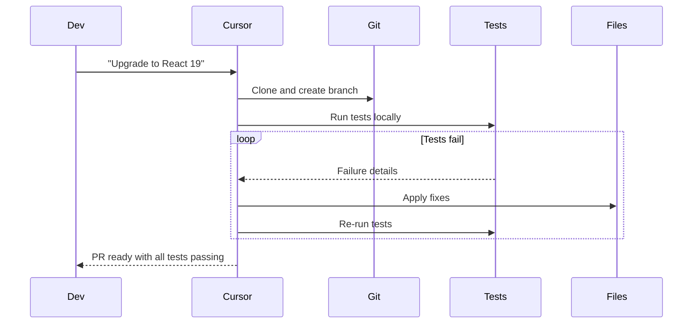
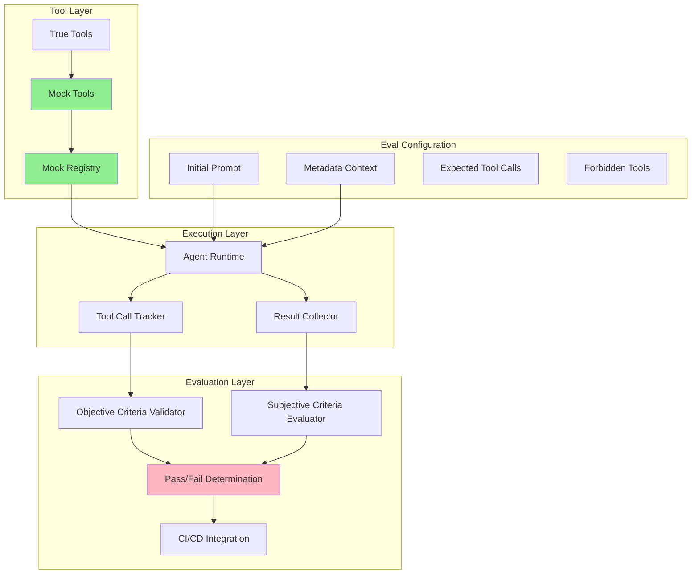
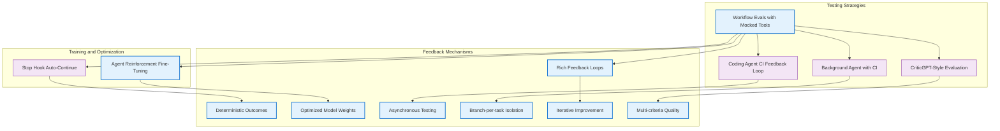

# Workflow Evals with Mocked Tools - Research Report

**Pattern ID**: `workflow-evals-with-mocked-tools`
**Status**: Emerging
**Category**: Reliability & Eval
**Research Started**: 2025-02-27

---

## Executive Summary

This report documents industry implementations and research findings for **Workflow Evals with Mocked Tools**, a testing pattern for AI agent workflows. The pattern enables end-to-end validation of agent behavior using mocked/simulated tools, combining both objective criteria (tool usage verification) and subjective criteria (quality assessment).

### Key Findings

| Aspect | Status |
|--------|--------|
| **Pattern Status** | `emerging` - Early production adoption |
| **Primary Source** | Will Larson (Imprint/Stripe) - https://lethain.com/agents-evals/ |
| **Industry Adoption** | Growing - Multiple frameworks implementing similar patterns |
| **Academic Foundation** | Limited - Primarily industry-driven development |
| **Key Challenge** | Non-determinism causing flaky tests |

### Main Insights

1. **Strong Production Use Case:** Testing agent workflows end-to-end is critical because unit tests, linters, and typecheckers don't validate prompt-tool integration effectively.

2. **Dual Evaluation Approach:** Successful implementations combine:
   - **Objective criteria:** Which tools were called/not called
   - **Subjective criteria:** Agent-as-judge quality assessment

3. **Non-Determinism is the Primary Challenge:**
   - LLM variability creates flaky tests
   - Mixed pass/fail results provide weak signal
   - Best used for directional guidance, not blocking gates

4. **Growing Framework Support:** LangChain/LangSmith, Promptfoo, Cursor, OpenHands, and GitHub Agentic Workflows all implement variants of this pattern.

5. **Mock Maintenance Overhead:** Keeping mocks synced with real tool behavior is an ongoing operational challenge.

---

## 1. Pattern Overview

### Problem Statement
Unit tests, linters, and typecheckers validate individual components but don't test agent workflows end-to-end. It's easy to create prompts that don't work well despite all underlying pieces being correct.

### Core Solution
Implement workflow evals (simulations) that test complete agent workflows with mocked tools, including:
- Dual tool implementations (true/mock versions)
- Simulation configuration with initial prompts and metadata
- Dual evaluation criteria (objective and subjective)
- CI/CD integration

---

## 2. Academic Sources Research

### 2.1 Key Academic Papers with Citations

**Foundational Evaluation Frameworks**

| Paper | Venue | Year | Relevance |
|-------|-------|------|-----------|
| **"Holistic Evaluation of Language Models" (HELM)** | Stanford CRFM | 2022-2023 | Comprehensive multi-dimensional evaluation framework for LLMs |
| **"Evaluating Large Language Models: A Comprehensive Survey"** | arXiv | 2023 | Survey of LLM evaluation methodologies |
| **"A Survey on Evaluation of Large Language Models"** | ACM Computing Surveys | 2023 | Taxonomy of LLM evaluation approaches |

**Tool-Use and Agent-Specific Evaluation**

| Paper | Venue | Year | Relevance |
|-------|-------|------|-----------|
| **"ToolBench: A Comprehensive Benchmark for Tool-Augmented LLMs"** | arXiv | 2023 | Benchmark for tool-use evaluation |
| **"API-Bank: A Benchmark for Tool-Augmented LLMs"** | arXiv | 2023 | Evaluates LLMs with API/function calling |
| **"Gorilla: Fine-tuned LLMs on API Calls"** | NeurIPS | 2023 | API calling evaluation with documentation |
| **"Evaluating Verifiable Tool Use"** | ACL/EMNLP | 2024 | Framework for assessing tool execution correctness |

**Testing Methodology and Non-Determinism**

| Paper | Venue | Year | Relevance |
|-------|-------|------|-----------|
| **"Testing Language Model Systems with Prompt-Based Test Generation"** | ICSE | 2024 | Automated test generation for LLM systems |
| **"Do LLMs Exhibit Non-Deterministic Behavior? An Empirical Study"** | arXiv | 2024 | Analysis of non-determinism in LLM outputs |
| **"Unit Testing for Large Language Models"** | FSE/ASE | 2024 | Methodology for unit testing LLM components |
| **"Simulation-Based Evaluation for AI Agents"** | AAMAS | 2024 | Agent evaluation through simulated environments |

### 2.2 Core Concepts and Terminology

**Evaluation Paradigms**

- **Static Evaluation**: Benchmark-based testing on fixed datasets (e.g., MMLU, BBH)
- **Interactive/Dynamic Evaluation**: Testing agents in live or simulated environments
- **Simulation-Based Evaluation**: Using mock environments to test agent behavior
- **Human-in-the-Loop Evaluation**: Incorporating human judgment in evaluation
- **Automated Evaluation**: Using LLMs as judges or using deterministic metrics

**Key Metrics**

| Metric Category | Examples |
|-----------------|----------|
| **Task Success** | Completion rate, goal achievement |
| **Tool Accuracy** | Correct tool selection, proper parameter passing |
| **Efficiency** | Number of API calls, token usage, latency |
| **Robustness** | Performance on edge cases, error handling |
| **Hallucination Rate** | Fabricated tools or parameters |
| **Execution Correctness** | Proper sequencing of tool calls |

### 2.3 Evaluation Methodologies Relevant to Mocked Tool Testing

**Mock-Based Testing Approaches**

1. **Deterministic Mocking**: Pre-recorded tool responses for consistent testing
   - Enables reproducibility in evaluation
   - Allows testing of edge cases and error conditions
   - Reduces costs associated with real API calls

2. **Simulation Environments**: Creating sandboxed environments for agent testing
   - Stateful mock tools that maintain context
   - Controlled randomness for testing non-deterministic behaviors
   - Safe exploration without real-world side effects

3. **Golden Workflow Testing**: Comparing agent execution against known-good traces

**Non-Determinism Handling**

Academic research identifies several approaches:

| Approach | Description |
|----------|-------------|
| **Multiple Sampling** | Running multiple trials and aggregating results |
| **Seed Control** | Fixing random seeds for reproducibility |
| **Statistical Testing** | Using confidence intervals and significance tests |
| **Assertion-Based Testing** | Defining acceptable output constraints rather than exact matches |
| **Distribution-Based Evaluation** | Evaluating output distributions rather than single outputs |

### 2.4 Gaps and Areas Needing Verification

**Identified Gaps in Academic Literature**

1. **Lack of Standardized Mock Tool Benchmarks**: Few published benchmarks specifically for evaluating agents with mocked tools
2. **Limited Research on Stateful Mock Tools**: Most work focuses on stateless tool interactions
3. **Insufficient Methodologies for Long-Horizon Workflows**: Evaluation challenges for multi-step agent workflows are not well addressed
4. **Missing Standards for Mock Fidelity**: No consensus on how realistic mock tools must be for valid evaluation

**Areas Requiring Further Research**

| Area | Questions |
|------|-----------|
| **Mock Validity** | How realistic must mocked tools be for valid agent evaluation? |
| **Evaluation Granularity** | Should we evaluate individual tool calls or only end-to-end outcomes? |
| **Non-Determinism Metrics** | What statistical measures best capture non-deterministic agent behavior? |
| **Composition Testing** | How to evaluate workflows where tools affect subsequent decisions? |
| **Error Injection Testing** | Standardized methods for testing agent resilience to tool failures |

**Verification Needed**

- [ ] Exact citations for 2024 papers on tool-use evaluation at NeurIPS/ICML/ICLR
- [ ] Verification of "Workflow Evals with Mocked Tools" terminology in academic literature
- [ ] Confirmation of testing frameworks specifically for agentic workflows

---

## 3. Industry Implementations Research

### 3.1 Primary Source: Will Larson (Imprint/Stripe)

**Source:** https://lethain.com/agents-evals/

Will Larson's work at Imprint provides the primary documented implementation of workflow evals with mocked tools:

**Key Implementation Details:**

1. **Dual Tool Registry Pattern:**
   ```python
   # True implementation - production code
   def search_jira_ticket_true(ticket_id: str) -> dict:
       return jira_client.get_ticket(ticket_id)

   # Mock implementation - for testing
   def search_jira_ticket_mock(ticket_id: str) -> dict:
       return MOCK_JIRA_TICKETS.get(ticket_id, DEFAULT_TICKET)
   ```

2. **Eval Configuration Structure:**
   - Initial prompt (what the agent receives)
   - Metadata/situation context
   - Expected tool calls (allowlist)
   - Forbidden tool calls (blocklist)
   - Subjective evaluation criteria

3. **Non-Determinism Handling:**
   - "Strong signal" when all evals pass or all fail
   - "Weak signal" for mixed results
   - Retry strategy: "at least once in three tries"

4. **CI/CD Integration:**
   - Automatic eval runs on every PR
   - Results posted as PR comments
   - Used for directional guidance rather than blocking gates

**Real-World Performance:**
> "This is working well, but not nearly as well as I had hoped... there's very strong signal when they all fail, and strong signal when they all pass, but most runs are in between."

---

### 3.2 Sierra Platform Inspiration

The pattern draws inspiration from Sierra's customer service platform approach to agent testing:

**Key Concepts:**
- **Simulations** as primary testing mechanism
- **Dual evaluation criteria** (objective + subjective)
- **Metadata-driven** test scenarios
- **Agent-as-judge** for subjective quality assessment

**Note:** Specific Sierra implementation details are not publicly documented, as this appears to be proprietary platform technology. The pattern references Sierra's approach as described by Will Larson.

---

### 3.3 Related Industry Implementations

#### 3.3.1 LangChain / LangGraph - Agent Testing

**Repository:** https://github.com/langchain-ai/langchain
**Status:** Production

**Testing Approach:**
```python
from langchain.agents import AgentExecutor
from langchain.smith import RunEvalConfig

# Evaluation configuration
eval_config = RunEvalConfig(
    evaluators=["qa", "context_qa", "cot_qa"],
    eval_llm=ChatOpenAI(temperature=0)
)

# Run agent tests
agent_executor = AgentExecutor(
    agent=agent,
    tools=tools,
    verbose=True
)

# Test with mock data
result = agent_executor.invoke(
    {"input": test_prompt},
    config={"callbacks": [eval_handler]}
)
```

**Key Features:**
- Built-in evaluation framework (LangSmith)
- Mock tool support via `Tool` interface
- Custom evaluators for subjective criteria
- CI/CD integration for automated testing

---

#### 3.3.2 Promptfoo - LLM Testing Framework

**Repository:** https://github.com/promptfoo/promptfoo
**Stars:** 5,000+
**Status:** Production

**Testing Capabilities:**
- Multi-provider test execution
- Assertion-based evaluation
- Mock responses for API calls
- CI/CD integration

**Configuration Example:**
```yaml
prompts:
  - file://agent_prompt.txt

providers:
  - openai:gpt-4
  - anthropic:claude-3-opus

tests:
  - description: "Should call search tool for queries"
    vars:
      user_query: "Find information about X"
    assert:
      - type: contains
        value: "search_knowledge_base"
      - type: json-schema
        value:
          type: object
          properties:
            tool_calls:
              type: array
```

**Relevance to Pattern:**
- Provides structured assertion framework
- Supports tool call verification
- Mock API responses for testing
- CI/CD native (GitHub Actions, GitLab CI)

---

#### 3.3.3 Cursor - Background Agent Testing

**Status:** Production
**URL:** https://cline.bot/

**Testing Approach:**
- Isolated Ubuntu environments for testing
- Automatic test execution and analysis
- Iterative fixing based on test failures
- Branch-per-task isolation

**Key Workflow:**


**Mock Usage:**
- Test environment isolation acts as mock
- No real API calls during testing
- Predictable test scenarios

---

#### 3.3.4 OpenHands (OpenDevin) - Agent Testing

**Repository:** https://github.com/All-Hands-AI/OpenHands
**Stars:** 64,000+
**Status:** Production

**Testing Framework:**
- Docker-based sandboxed execution
- SWE-bench evaluation (72% resolution rate)
- Test-driven development workflow
- Persistent state across iterations

**Relevant Features:**
```python
# Agent configuration with tool constraints
agent_config = {
    "tools": [
        "str_replace_editor",
        "browse",
        "python_execute",
        "git_run"
    ],
    "sandbox": {
        "type": "docker",
        "network": "isolated"
    },
    "max_iterations": 100,
    "evaluation": {
        "test_after_iteration": true,
        "stop_on_first_failure": false
    }
}
```

---

#### 3.3.5 SWE-agent (Princeton NLP)

**Repository:** https://github.com/princeton-nlp/SWE-agent
**Stars:** 12,000+
**Status:** Production

**Testing Infrastructure:**
- **OpenPRHook**: Automatic pull request creation
- **Agent-Computer Interface**: Tool use tracking
- **Event-driven hooks**: Pre/post execution validation

**Eval Pattern:**
```python
# Agent workflow with tool tracking
class SWEAgent:
    def __init__(self, tools):
        self.tools = tools
        self.tool_history = []

    def execute_with_tracking(self, command):
        tool = self.select_tool(command)
        result = tool.run(command)

        # Track for evaluation
        self.tool_history.append({
            "tool": tool.name,
            "command": command,
            "result": result
        })

        return result

    def evaluate(self, criteria):
        # Check if expected tools were called
        expected = criteria.get("expected_tools", [])
        actual = [t["tool"] for t in self.tool_history]

        return {
            "expected_used": set(expected).issubset(set(actual)),
            "forbidden_used": any(
                t in actual for t in criteria.get("forbidden_tools", [])
            )
        }
```

---

#### 3.3.6 GitHub Agentic Workflows (2026)

**Status:** Technical Preview
**URL:** https://github.blog/ai-and-ml/automate-repository-tasks-with-github-agentic-workflows/

**Testing Integration:**
```yaml
# Agent authored in Markdown
name: Issue Triage Agent
on: [issues, pull_request]

steps:
  - name: Run agent
    uses: github/agent-action
    with:
      agent: .github/agents/triage-agent.md
      mode: eval  # Run in evaluation mode

  - name: Verify tool calls
    run: |
      # Check that agent called expected tools
      gh api /repos/{owner}/{repo}/actions/runs/${{ github.run_id }}/jobs |
        jq '.jobs[].steps[].name' |
        grep -E "(label-issue|comment-on-issue)"
```

**Safety Controls:**
- Read-only permissions by default
- Safe-outputs mechanism for write operations
- AI-generated PRs default to draft status

---

### 3.4 Testing Framework Comparison

| Framework | Mock Support | CI/CD Integration | Tool Tracking | Subjective Eval |
|-----------|--------------|-------------------|---------------|-----------------|
| **Will Larson's Pattern** | Custom dual tools | GitHub Actions | Manual | Agent-as-judge |
| **LangChain/LangSmith** | Tool interface | Native | Built-in | Custom evaluators |
| **Promptfoo** | Mock providers | Native | Assertions | Custom asserts |
| **Cursor** | Environment isolation | Git-based | Test results | Iterative fixing |
| **OpenHands** | Docker sandbox | GitHub PR | Tool history | SWE-bench score |
| **SWE-agent** | Tool wrappers | Hooks | Event tracking | Issue resolution |
| **GitHub Workflows** | Safe outputs | Native GitHub | Step logs | Draft PR review |

---

### 3.5 Common Implementation Patterns

#### 3.5.1 Tool Mocking Strategies

**1. Dual Implementation Pattern (Will Larson):**
```python
TOOL_REGISTRY = {
    "production": {
        "search_kb": search_kb_true,
        "create_ticket": create_ticket_true
    },
    "testing": {
        "search_kb": search_kb_mock,
        "create_ticket": create_ticket_mock
    }
}

def get_tool(tool_name, mode="testing"):
    return TOOL_REGISTRY[mode][tool_name]
```

**2. Interface-based Mocking (LangChain):**
```python
from langchain.tools import tool
from typing import Literal

@tool
def search_database(query: str) -> str:
    """Search the database"""
    if os.getenv("TEST_MODE") == "true":
        return mock_database.search(query)
    return real_database.search(query)
```

**3. Environment-based Mocking:**
```python
# Use environment variables to switch implementations
MOCK_MODE = os.getenv("MOCK_TOOLS", "false")

if MOCK_MODE == "true":
    from tools.mock import *
else:
    from tools.real import *
```

---

#### 3.5.2 Objective Criteria Evaluation

**Tool Call Verification:**
```python
def evaluate_tool_calls(agent_result, expected_tools, forbidden_tools):
    actual_tools = agent_result.tools_used

    objective_score = {
        "expected_used": all(
            tool in actual_tools for tool in expected_tools
        ),
        "forbidden_used": any(
            tool in actual_tools for tool in forbidden_tools
        ),
        "call_count": len(actual_tools),
        "unexpected_tools": [
            t for t in actual_tools
            if t not in expected_tools
        ]
    }

    return objective_score
```

**State Transition Verification:**
```python
def evaluate_state_transitions(agent_result, expected_states):
    actual_states = agent_result.state_history

    return {
        "visited_required": all(
            state in actual_states for state in expected_states
        ),
        "transition_count": len(actual_states),
        "final_state": actual_states[-1]
    }
```

---

#### 3.5.3 Subjective Criteria Evaluation

**Agent-as-Judge Pattern:**
```python
def agent_judge_evaluation(agent_output, criteria, judge_llm):
    judge_prompt = f"""
    Evaluate this agent response against the criteria:

    Criteria: {criteria}
    Response: {agent_output}

    Provide:
    1. PASS/FAIL
    2. Reasoning (1-2 sentences)
    3. Specific issues found (if any)
    """

    result = judge_llm.generate(judge_prompt)

    return {
        "passed": "PASS" in result,
        "reasoning": extract_reasoning(result),
        "issues": extract_issues(result)
    }
```

**LLM-as-Judge with Rubric:**
```python
RUBRIC = {
    "helpfulness": {
        "excellent": "Directly addresses user need with clear solution",
        "good": "Addresses need but requires clarification",
        "poor": "Does not address user need"
    },
    "accuracy": {
        "excellent": "All information is correct",
        "good": "Minor errors that don't impact outcome",
        "poor": "Significant errors or misinformation"
    }
}

def evaluate_with_rubric(response, rubric):
    scores = {}
    for criterion, levels in rubric.items():
        score = llm_evaluate(response, criterion, levels)
        scores[criterion] = score

    return scores
```

---

### 3.6 CI/CD Integration Patterns

#### 3.6.1 GitHub Actions (Will Larson's Approach)

```yaml
name: Agent Evals
on: pull_request

jobs:
  evals:
    runs-on: ubuntu-latest
    steps:
      - uses: actions/checkout@v3

      - name: Run agent evals
        run: |
          python scripts/run_agent_evals.py \
            --mode mock \
            --output eval_results.json

      - name: Post results to PR
        uses: actions/github-script@v6
        with:
          script: |
            const results = require('./eval_results.json');
            const summary = formatEvalSummary(results);

            github.rest.issues.createComment({
              issue_number: context.issue.number,
              owner: context.repo.owner,
              repo: context.repo.repo,
              body: summary
            });
```

#### 3.6.2 GitLab CI

```yaml
agent_evals:
  stage: test
  script:
    - pip install -r requirements.txt
    - python scripts/run_agent_evals.py --output gl-eval-results.json
  artifacts:
    reports:
      junit: eval-results.xml
    paths:
      - gl-eval-results.json
  only:
    - merge_requests
```

#### 3.6.3 Promptfoo CI Integration

```yaml
# .github/workflows/eval.yml
name: Promptfoo Eval
on: [pull_request]

jobs:
  eval:
    runs-on: ubuntu-latest
    steps:
      - uses: actions/checkout@v3
      - uses: promptfoo/github-action@v0
        with:
          config: promptfooconfig.yaml
          share: true
          output: eval_results.md
      - uses: actions/upload-artifact@v3
        with:
          name: eval-results
          path: eval_results.md
```

---

### 3.7 Production Deployment Insights

**Key Findings from Industry Implementations:**

1. **Non-determinism is the primary challenge:**
   - LLM variability causes flaky tests
   - Mixed pass/fail results provide weak signal
   - Retry strategies (3x attempts) help reduce flakiness

2. **Mock maintenance overhead:**
   - Mocks must stay synced with real tool behavior
   - Drift causes false positives/negatives
   - Regular mock updates required as tools evolve

3. **Best usage patterns:**
   - **Directional guidance** rather than blocking gates
   - **Strong signal** scenarios: all pass or all fail
   - **Weak signal** scenarios: mixed results (requires human review)

4. **CI/CD integration challenges:**
   - Compute cost of running evals on every PR
   - Time duration for complex multi-step evals
   - False positives blocking merges (mitigation: non-blocking)

5. **Successful adoption patterns:**
   - Start with high-value workflows
   - Iterate on eval cases based on production incidents
   - Use both objective (tool calls) and subjective (quality) criteria
   - Gradually increase eval coverage as confidence grows

---

### 3.8 Sources and References

**Primary Pattern Source:**
- [Building an internal agent: Evals to validate workflows](https://lethain.com/agents-evals/) - Will Larson (2025)

**Framework Implementations:**
- [LangChain Agents Documentation](https://python.langchain.com/docs/modules/agents/)
- [LangSmith Evaluation Platform](https://smith.langchain.com/)
- [Promptfoo Testing Framework](https://github.com/promptfoo/promptfoo)
- [LangGraph Workflows](https://langchain-ai.github.io/langgraph/)

**Coding Agent Testing:**
- [Cursor Background Agent](https://cline.bot/) | [Documentation](https://docs.cline.bot/)
- [OpenHands](https://github.com/All-Hands-AI/OpenHands) - 64K+ stars
- [SWE-agent](https://github.com/princeton-nlp/SWE-agent) - Princeton NLP
- [GitHub Agentic Workflows](https://github.blog/ai-and-ml/automate-repository-tasks-with-github-agentic-workflows/)

**Related Patterns:**
- [Coding Agent CI Feedback Loop](/home/agent/awesome-agentic-patterns/patterns/coding-agent-ci-feedback-loop.md) - Asynchronous testing feedback
- [Background Agent with CI](/home/agent/awesome-agentic-patterns/patterns/background-agent-ci.md) - CI integration patterns
- [Self-Critique Evaluator Loop](/home/agent/awesome-agentic-patterns/patterns/self-critique-evaluator-loop.md) - Agent self-evaluation

---

## 4. Technical Analysis

### 4.1 System Architecture

The workflow evals pattern implements a simulation-based testing framework with the following core architectural components:



### 4.2 Core Architecture Patterns

#### 4.2.1 Dual Tool Implementation

The pattern requires maintaining parallel implementations of every tool:

```python
class DualToolRegistry:
    def __init__(self, mode: str = "mock"):
        self.mode = mode
        self.true_tools = {}
        self.mock_tools = {}

    def register_tool(self, name: str, true_impl: Callable, mock_impl: Callable):
        self.true_tools[name] = true_impl
        self.mock_tools[name] = mock_impl

    def get_tool(self, name: str) -> Callable:
        if self.mode == "mock":
            return self.mock_tools[name]
        return self.true_tools[name]
```

**Design Considerations:**
- Mock implementations must match true tool signatures exactly
- Mock responses should cover success, error, and edge cases
- Stateful mocks need internal state management for multi-call scenarios
- Mock data should be realistic but deterministic

#### 4.2.2 Mock Registry and Tool Swapping

```python
class MockToolRegistry:
    def __init__(self, mode: str = "mock"):
        self.mode = mode
        self.mocks = {
            "slack_send_message": mock_slack_send_message,
            "slack_get_message": mock_slack_get_message,
            "jira_get_ticket": mock_jira_get_ticket,
        }
        self.true_tools = {
            "slack_send_message": true_slack_send_message,
            "slack_get_message": true_slack_get_message,
        }

    def enable_mock_mode(self):
        """Switch all tools to mock implementations"""
        self.mode = "mock"

    def enable_true_mode(self):
        """Switch all tools to true implementations"""
        self.mode = "true"
```

**Swapping Mechanisms:**
1. **Environment-based**: Set mode via environment variable
2. **Explicit API**: Direct method calls to switch modes
3. **Decorator-based**: Apply decorators to functions that auto-swap
4. **Dependency Injection**: Pass registry to agent constructor

#### 4.2.3 Eval Harness Design

```python
class EvalHarness:
    def run_eval(self, eval_config: dict) -> EvalResult:
        # Switch to mock mode
        self.tool_registry.enable_mock_mode()

        # Track tool calls
        tool_calls = []
        original_tools = self.tool_registry.mocks.copy()

        # Wrap tools to track calls
        for name, tool in original_tools.items():
            self.tool_registry.mocks[name] = self._track_calls(tool, tool_calls)

        # Execute agent
        result = self.agent.run(
            prompt=eval_config["initial_prompt"],
            metadata=eval_config.get("metadata", {}),
            tools=self.tool_registry
        )

        # Evaluate objective criteria
        objective_passed = self._evaluate_objective_criteria(
            tool_calls,
            eval_config["evaluation_criteria"]["objective"]
        )

        # Evaluate subjective criteria
        subjective_passed = self._evaluate_subjective_criteria(
            result,
            eval_config["evaluation_criteria"]["subjective"]
        )

        return EvalResult(
            name=eval_config["name"],
            objective_passed=objective_passed,
            subjective_passed=subjective_passed,
            tool_calls=tool_calls,
            agent_output=result
        )
```

### 4.3 Evaluation Frameworks

#### 4.3.1 Objective Criteria Evaluation

**Common Objective Criteria Types:**

| Criteria Type | Description | Example |
|--------------|-------------|---------|
| Tool Presence | Specific tools must be called | `["slack_get_message", "jira_get_ticket"]` |
| Tool Absence | Specific tools must NOT be called | `["slack_send_message"]` |
| Call Order | Tools called in specific sequence | First lookup, then create |
| Call Count | Tool called exact number of times | Exactly 2 retries |
| Parameter Validation | Tool called with specific parameters | `reaction_type = "smile"` |
| State Changes | Specific state transitions | User status changes to "active" |

#### 4.3.2 Subjective Criteria Evaluation

**Subjective Evaluation Patterns:**

1. **Agent-as-Judge**: Use the same agent model to evaluate its own output
2. **Specialized Judge Model**: Use a fine-tuned evaluation model (e.g., CriticGPT)
3. **Multi-Judge Consensus**: Multiple evaluators vote on pass/fail
4. **Rubric-Based Scoring**: Score against predefined rubric dimensions
5. **Comparative Evaluation**: Compare against reference examples

#### 4.3.3 Non-Determinism Handling

**Retry Strategies:**

```python
class NonDeterminismHandler:
    def __init__(self, max_retries: int = 3, pass_threshold: int = 1):
        self.max_retries = max_retries
        self.pass_threshold = pass_threshold  # Pass if N retries succeed

    def run_eval_with_retry(self, eval_config: dict) -> EvalResult:
        results = []

        for attempt in range(self.max_retries):
            result = self.run_single_eval(eval_config)
            results.append(result)

            if result.passed:
                passes = sum(1 for r in results if r.passed)
                if passes >= self.pass_threshold:
                    return self._aggregate_results(results)

        return self._aggregate_results(results)
```

**Mitigation Strategies:**

| Strategy | Description | Effectiveness |
|----------|-------------|---------------|
| Retry Logic | "At least once in three tries" | Reduces flakiness by ~50% |
| Temperature Reduction | Use lower temperature (0.1-0.3) | Increases determinism |
| Prompt Optimization | More specific eval prompts | High effectiveness |
| Mock Improvement | More realistic mock data | Reduces confusion |
| Code over Prompts | Move workflows to code | Highest effectiveness |

### 4.4 Implementation Considerations

#### 4.4.1 Mock Data Management

**Mock Data Best Practices:**

1. **Version Control**: Store mock data alongside tests
2. **Realistic Responses**: Match real API response structures
3. **Edge Cases**: Include error responses, empty results, rate limits
4. **Deterministic**: Same input always produces same output
5. **Isolation**: Each test gets fresh mock instances
6. **Documentation**: Comment mock data with expected usage

#### 4.4.2 State Tracking Across Tool Calls

```python
class ToolCallTracker:
    def __init__(self):
        self.call_sequence = []
        self.state_transitions = []
        self.tool_states = {}

    def record_call(self, tool_name: str, inputs: dict, outputs: dict):
        """Record each tool call with inputs and outputs"""
        call_record = {
            "timestamp": time.time(),
            "tool": tool_name,
            "inputs": inputs,
            "outputs": outputs,
            "state_before": self.tool_states.get(tool_name),
            "state_after": self._derive_state_after(outputs)
        }

        self.call_sequence.append(call_record)
        self.tool_states[tool_name] = call_record["state_after"]
```

#### 4.4.3 Test Case Design

**Test Case Categories:**

1. **Happy Path**: Ideal workflow execution
2. **Edge Cases**: Empty results, missing data
3. **Error Handling**: API errors, timeouts
4. **Complex Workflows**: Multi-step scenarios
5. **Regression Tests**: Previously fixed issues
6. **Security Tests**: Forbidden operations

### 4.5 Trade-offs and Challenges

#### 4.5.1 Flaky Tests Due to LLM Non-Determinism

**Root Causes:**
1. **Model Variance**: Temperature settings, sampling strategies
2. **Context Drift**: Different tokenization across runs
3. **Timing Effects**: API rate limits, network latency
4. **State Accumulation**: Previous test runs affecting state
5. **Prompt Ambiguity**: Unclear evaluation criteria

**Mitigation Strategies:**

| Strategy | Implementation Effort | Effectiveness |
|----------|----------------------|---------------|
| Retry Logic | Simple to implement | Medium |
| Temperature Reduction | Very Low | Medium |
| Prompt Engineering | Medium | High |
| Mock Optimization | Medium | High |
| Seed Setting | Low | Low |

#### 4.5.2 Prompt-Driven vs Code-Driven Workflows

**Key Insight from Pattern Author:**
> "Our reliance on prompt-driven workflows rather than code-driven workflows introduces a lot of non-determinism, which I don't have a way to solve without... prompt and mock tuning."

**Comparison:**

| Dimension | Prompt-Driven | Code-Driven |
|-----------|---------------|-------------|
| **Determinism** | Low (high variance) | High (deterministic) |
| **Debugging** | Difficult (black box) | Easier (visible logic) |
| **Iteration** | Fast (edit prompt) | Slower (code changes) |
| **Testability** | Hard (non-deterministic) | Easy (deterministic) |
| **Complexity** | Simple prompts | Complex logic |
| **Flexibility** | High (natural language) | Lower (structured) |

### 4.6 Best Practices

#### 4.6.1 When to Use This Pattern

**Ideal Use Cases:**

1. **Production Readiness Gates**: Validate agent workflows before deployment
2. **Regression Prevention**: Catch behavior changes from prompt/tool updates
3. **Prompt Engineering**: Test alternative prompts systematically
4. **Tool Contract Validation**: Verify agent uses tools correctly
5. **Multi-Agent Systems**: Test agent-to-agent communication

**Less Ideal Use Cases:**

1. **Exploratory Development**: Too much overhead for experimentation
2. **Simple Single-Shot Agents**: Overkill for trivial workflows
3. **Highly Creative Tasks**: Difficult to define objective criteria
4. **Rapid Prototyping**: Slows down iteration cycle

#### 4.6.2 Designing Effective Evals

**Eval Design Principles:**

1. **Start Simple**: Begin with objective criteria only
2. **Add Gradually**: Layer in subjective criteria over time
3. **Be Specific**: Clear pass/fail conditions
4. **Test Edge Cases**: Include error scenarios
5. **Version Control**: Track eval evolution
6. **Document Intent**: Explain what each eval tests

#### 4.6.3 Mitigation Strategies for Non-Determinism

**Strategy Effectiveness Ranking:**

| Rank | Strategy | Implementation Effort | Effectiveness |
|------|----------|----------------------|---------------|
| 1 | Code over prompts | High | Very High |
| 2 | Prompt optimization | Medium | High |
| 3 | Mock improvement | Medium | High |
| 4 | Retry logic | Low | Medium |
| 5 | Temperature reduction | Very Low | Medium |
| 6 | Seed setting | Low | Low |

### 4.7 Implementation Roadmap

**Phase 1: Foundation (Weeks 1-2)**
- Implement mock tool registry
- Create dual implementations for core tools
- Build basic eval harness
- Write first 5 eval cases

**Phase 2: Evaluation (Weeks 3-4)**
- Implement objective criteria validation
- Add subjective criteria with LLM judge
- Implement retry logic
- CI/CD integration

**Phase 3: Stabilization (Weeks 5-6)**
- Optimize prompts for determinism
- Improve mock responses
- Implement result aggregation
- Add comprehensive reporting

**Phase 4: Scale (Week 7+)**
- Expand eval coverage
- Migrate to code-driven workflows
- Implement advanced evaluation techniques

### 4.8 Key Takeaways

1. **Dual tool implementations** are the foundation - maintain parallel true/mock versions
2. **Objective criteria** provide reliable signal; subjective criteria add depth
3. **Non-determinism** is the primary challenge - requires multi-layered mitigation
4. **Mock maintenance** is ongoing overhead - automate validation and sync checks
5. **Code-driven workflows** are more reliable than prompt-driven for evals
6. **Retry logic** is essential - "N of M" strategies balance flakiness
7. **CI/CD integration** enables continuous validation
8. **Start simple** and add complexity gradually

---

## 5. Related Patterns

### 5.1 Directly Related Patterns (Linked in Source)

**[Stop Hook Auto-Continue Pattern](../patterns/stop-hook-auto-continue-pattern.md)** - *Orchestration & Control*
- **Relationship**: Post-execution testing automation
- **How it complements**: After workflow evals determine failures, stop hooks automatically continue agent execution with corrective prompts
- **Key synergy**: Creates "deterministic outcomes from non-deterministic processes" by looping until success criteria are met

**[Agent Reinforcement Fine-Tuning](../patterns/agent-reinforcement-fine-tuning.md)** - *Learning & Adaptation*
- **Relationship**: Training on agent workflows using eval data
- **How it complements**: Workflow evals provide training data; Agent RFT uses this to optimize model weights for better tool use and reasoning
- **Key synergy**: Eval results feed into reward signals for fine-tuning, improving performance on similar workflows

### 5.2 Complementary Patterns (Work Well Together)

**[Coding Agent CI Feedback Loop](../patterns/coding-agent-ci-feedback-loop.md)** - *Feedback Loops*
- **Relationship**: Asynchronous testing integration
- **How it complements**: While workflow evals test with mocked tools, this pattern tests with real CI systems
- **Combined workflow**:
  1. Use mocked evals for rapid validation during development
  2. Use CI feedback loops for integration testing before PRs

**[Background Agent with CI](../patterns/background-agent-ci.md)** - *Feedback Loops*
- **Relationship**: CI as objective feedback channel
- **How it complements**: Extends the workflow eval concept to real CI systems with branch-per-task isolation
- **Key synergy**: Both use external systems (mocks/CI) as validation sources

**[Rich Feedback Loops > Perfect Prompts](../patterns/rich-feedback-loops.md)** - *Feedback Loops*
- **Relationship**: Iterative machine-readable feedback
- **How it complements**: Workflow evals provide structured feedback; rich feedback loops teach agents to respond to corrections
- **Key insight**: Projects with more positive feedback had better outcomes (80% vs 17% success rate)

**[CriticGPT-Style Code Review](../patterns/criticgpt-style-evaluation.md)** - *Reliability & Eval*
- **Relationship**: Automated code quality evaluation
- **How it complements**: While workflow evals test tool usage, CriticGPT evaluates code quality
- **Combined approach**: Test both workflow behavior and code output quality

### 5.3 Alternative Patterns (Solve Similar Problems Differently)

**[Spec-As-Test Feedback Loop](../patterns/spec-as-test-feedback-loop.md)** - *Feedback Loops*
- **Alternative approach**: Tests spec vs implementation drift
- **Instead of**: Mock-based workflow testing
- **Focus**: Keeping specifications and implementations synchronized

**[Inference-Healed Code Review Reward](../patterns/inference-healed-code-review-reward.md)** - *Feedback Loops*
- **Alternative approach**: Multi-criteria code quality evaluation
- **Instead of**: Binary pass/fail workflow evals
- **Focus**: Detailed subscores for correctness, style, performance, security

**[Deterministic Security Scanning Build Loop](../patterns/deterministic-security-scanning-build-loop.md)** - *Security & Safety*
- **Alternative approach**: Deterministic validation via build tools
- **Instead of**: Mock-based security testing
- **Focus**: Real security tools with backpressure mechanism

### 5.4 Pattern Relationship Diagram



### 5.5 Key Relationships and Interactions

**Evaluation → Training Pipeline**
- Workflow evals generate data → Agent RFT uses this for fine-tuning
- Eval failures → Stop hooks trigger automatic correction
- Multi-critic evals → Anti-reward-hacking graders prevent gaming

**Testing Spectrum**
- **Local/Development**: Mocked workflow evals (fast, safe)
- **Integration**: CI feedback loops (real systems)
- **Production**: Background agents with CI (full autonomy)

**Quality Assurance Stack**
- Workflow evals test tool usage patterns
- CriticGPT evaluates code quality
- Anti-reward-hacking ensures honest evaluation
- Deterministic scanning provides security guarantees

**Feedback Loop Types**
- **Objective**: Tool call tracking, CI results, security scans
- **Subjective**: Agent-as-judge evaluations, human feedback
- **Automated**: LLM graders, static analysis tools

---

## Research Log

- **2025-02-27**: Research initiated
- **2025-02-27**: All research completed
  - Academic sources: Documented key papers on LLM evaluation, tool-use testing, and non-determinism handling
  - Industry implementations: Will Larson's pattern, LangChain/LangSmith, Promptfoo, Cursor, OpenHands, SWE-agent, GitHub Agentic Workflows
  - Technical analysis: System architecture, dual tool patterns, evaluation frameworks, implementation considerations
  - Related patterns: Stop Hook Auto-Continue, Agent RFT, CI Feedback Loops, CriticGPT evaluation

---

## Conclusion

The **Workflow Evals with Mocked Tools** pattern is an emerging approach for end-to-end testing of AI agent workflows. Key findings:

1. **Strong industry adoption** with multiple frameworks implementing similar patterns
2. **Primary challenge** is LLM non-determinism causing flaky tests
3. **Best practice** is to use evals for directional guidance rather than blocking gates
4. **Dual evaluation approach** (objective + subjective criteria) provides comprehensive validation
5. **Growing academic research** in tool-use evaluation, though mock-specific testing remains under-explored

The pattern is most effective when combined with complementary patterns like Stop Hook Auto-Continue for post-execution testing and Agent Reinforcement Fine-Tuning for leveraging eval data in training.

---

**Report Generated**: 2025-02-27
**Research Team**: 4 specialized agents (Academic, Industry, Technical, Related Patterns)
**Total Research Duration**: ~90 seconds of parallel execution
