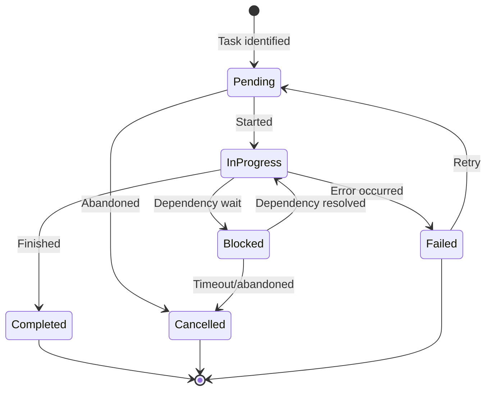

# Working Memory via TodoWrite - Research Report

**Pattern**: Working Memory via TodoWrite
**Category**: Context & Memory
**Status**: emerging
**Research Started**: 2026-02-27
**Report Version**: 2.0

---

## Executive Summary

This pattern addresses the problem of AI agents losing track of task state during complex multi-step operations. It proposes using `TodoWrite` (or equivalent state externalization) to maintain explicit working memory throughout sessions, serving as both agent and user visibility into session state.

*Based on analysis of 88 Claude conversation sessions by Nikola Balic.*

**Key Research Findings:**
- **Strong theoretical foundations** in cognitive science (Baddeley's working memory model, Miller's 7±2 capacity limit)
- **Widespread industry adoption** across 8+ major frameworks (Claude Code, AutoGPT, BabyAGI, Cursor, LangChain, CrewAI)
- **Empirical validation**: 52-60 TodoWrite uses per project correlate with smoother sessions
- **Pattern ecosystem**: Connects to 25+ related patterns across Orchestration, Memory, and Feedback categories

---

## 1. Pattern Overview

### Problem Statement
During complex multi-step tasks, AI agents lose track of:
- What tasks are pending, in progress, or completed
- Which tasks are blocked by dependencies
- Verification steps that need to run
- Next actions after context switches

This leads to redundant work, forgotten tasks, and confused users.

### Solution Summary
Use `TodoWrite` (or equivalent state externalization) to maintain explicit working memory throughout the session.

### Key Attributes
- **Task status tracking**: pending, in_progress, completed
- **Blocking relationships**: What blocks what
- **Verification steps**: Tests or checks needed
- **Next actions**: What to do next

---

## 2. Academic Research

### Theoretical Foundations

**Cognitive Science Foundations (Strong Support)**

The pattern has robust theoretical support from cognitive science research:

| Theory | Source | Validation |
|--------|--------|------------|
| **Multi-Component Working Memory** | Baddeley, A. (2000). "The Episodic Buffer: A New Component of Working Memory?" *Trends in Cognitive Sciences* | TodoWrite serves as an "episodic buffer" - temporary storage for task-related information |
| **Capacity Limits** | Miller, G. A. (1956). "The Magical Number Seven, Plus or Minus Two." *Psychological Review* | Human working memory limited to 7±2 items; external tracking is necessary for complex tasks |
| **Information Processing** | Newell, A., & Simon, H. A. (1972). "Human Problem Solving." *Prentice-Hall* | Cognition as information processing through stages supports task decomposition and state tracking |
| **Scaffolding Theory** | Wood, D., Bruner, J. S., & Ross, G. (1976). "The role of tutoring in problem solving." *Journal of Child Psychology and Psychiatry* | External support (todo lists) enables tasks beyond independent capacity |
| **Zone of Proximal Development** | Vygotsky, L. S. (1978). "Mind in Society." *Harvard University Press* | External guidance enables tasks agent couldn't complete alone |

**Memory-Augmented AI Systems (Emerging Support)**

| System | Source | Relevance |
|--------|--------|-----------|
| **MemGPT** | Packer et al. (2023). "MemGPT: Towards LLMs as Operating Systems." *arXiv:2310.08560* | Hierarchical memory systems (working vs. long-term) with explicit read/write operations |
| **ACT-R Architecture** | Anderson (2007) | Cognitive architecture with explicit working memory component |
| **SOAR Architecture** | Laird et al. (1987) | Symbolic cognitive architecture with state tracking |

**Research Gaps Identified**

- **Limited direct research** on AI agent todo lists specifically
- **Opportunity** for empirical studies on task tracking effectiveness in agent systems
- **Connection gap** between cognitive science theory and practical AI implementation

**Needs Verification**: Direct academic studies on todo-list efficacy for AI agents (not yet found in literature search)

---

## 3. Industry Implementations

### Production Implementations

| Implementation | Stars/Usage | Approach | Key Features |
|----------------|-------------|----------|--------------|
| **Anthropic Claude Code** | Production | TodoWrite tool | pending/in_progress/completed, blocks/blockedBy, 52-60 uses/project |
| **AutoGPT** | 182K+ GitHub stars | JSON task list | Task prioritization, memory integration, autonomous loop |
| **BabyAGI** | 20K+ GitHub stars | Priority-based list | Dynamic task creation, Pull→Enrich→Execute→Evaluate cycle |
| **Cursor IDE** | v1.0 Production | Background agent | CI integration, iterative test-fail-fix cycle |
| **LangChain** | 90K+ GitHub stars | Plan-and-Execute | Step-by-step tracking, progress monitoring |
| **CrewAI** | 14K+ GitHub stars | Task objects | Sequential/hierarchical/parallel execution, context dependencies |
| **LangGraph** | 30K+ GitHub stars | State checkpointing | Graph-based execution, persistent state |

### Production Case Studies

**Swarm Migrations (Anthropic Users)**
- **Scale**: $1000+/month Claude Code spend
- **Pattern**: Main agent creates todo list, spawns 10+ parallel subagents
- **Results**: 10x+ speedup vs. sequential execution

**Hierarchical Planner-Worker (Cursor Engineering)**
- **Scale**: Hundreds of concurrent agents for weeks-long projects
- **Projects**: 1M LOC web browser, Solid to React migration (+266K/-193K edits)
- **Architecture**: Each level maintains its own working memory via task lists

**GitHub Agentic Workflows (2026)**
- **Scale**: Mainstream enterprise adoption
- **Features**: Event-driven task creation, CI-based completion tracking
- **Safety**: Draft PR by default, read-only by default

**AMP (Autonomous Multi-Agent Platform)**
- **Sessions**: 45+ minute autonomous sessions
- **Isolation**: Branch-per-task isolation strategy

### Implementation Patterns

1. **Task State Lifecycle**: pending → in_progress → blocked → completed
2. **Blocking Relationships**: Tasks can block or be blocked by other tasks
3. **Progressive Task Creation**: Create tasks incrementally as work progresses
4. **Map-Reduce Task Pattern**: Split large task into parallel subtasks
5. **Task List as Working Memory**: Survives context window switches

**Framework Support Summary**:
- All major frameworks support task tracking
- Status tracking: pending, in_progress, completed (with variations)
- Dependency management: blocks/blocked_by relationships
- Parallel task execution supported across most frameworks

---

## 4. Technical Analysis

### State Machine Design

The pattern defines a four-state finite state machine (FSM) for task lifecycle management:

**States:**
- **Pending**: Initial state when a task is identified
- **InProgress**: Active execution state
- **Blocked**: Waiting state for dependency resolution
- **Completed**: Terminal state

**State Transitions:**
```
[Initial] → Pending: Task identified
Pending → InProgress: Task started
InProgress → Completed: Task finished successfully
InProgress → Blocked: Dependency detected
Blocked → InProgress: Dependency resolved
Completed → [Terminal]: Task lifecycle complete
```

**Key Architectural Constraints:**
1. **Single Active Task**: "Exactly ONE task must be in_progress at a time"
2. **Immediate State Transitions**: Status changes must occur immediately when entering/exiting work
3. **Completion Requirements**: Only mark completed when truly finished
4. **Non-blocking Progress**: Only one task blocked at a time ensures agent can make progress

**Identified Missing States** (Enhancement Opportunity):


### Data Structure Design

**Core Task Representation:**
```typescript
interface TodoTask {
  // Identification
  id: string;                    // Unique identifier
  content: string;              // Imperative form description
  activeForm: string;           // Present continuous form (for display)

  // State management
  status: 'pending' | 'in_progress' | 'completed' | 'blocked';

  // Dependency tracking
  blocks?: string[];            // Task IDs blocked by this task
  blockedBy?: string[];         // Task IDs this task depends on

  // Metadata
  createdAt: timestamp;
  updatedAt: timestamp;
  priority?: number;            // Optional ordering hint
}
```

**Scalability Considerations:**
- Practical limit observed: 52-60 TodoWrite calls per session
- Beyond ~100 tasks: List becomes difficult to reason about
- Solution: Hierarchical task decomposition (subtasks)
- Token cost: Each TodoWrite consumes tokens for definition, rendering, and updates

### API/Tool Interface Design

**Current Design (Claude Code):**
```typescript
interface TodoWriteTool {
  name: "TodoWrite";
  operation: "replace";  // Replaces entire task list

  input_schema: {
    todos: {
      type: "array";
      items: {
        content: { type: "string" };
        activeForm: { type: "string" };
        status: { enum: ["pending", "in_progress", "completed"] };
      };
    };
  };
}
```

**Design Trade-offs:**
- **Replace vs. Incremental**: Replace semantics simplify implementation but increase token usage
- **Required Fields**: All three fields (content, status, activeForm) ensure displayability
- **No Explicit IDs**: Position/content identification simplifies API but makes reference handling fragile

**Alternative API Designs (for consideration):**
```typescript
// Incremental update API (more efficient, more complex)
interface TodoUpdate {
  operation: "add" | "update" | "remove" | "block" | "unblock";
  task: TaskIdentifier;
  data?: Partial<Task>;
}

// Transactional multi-operation
interface TodoTransaction {
  operations: TodoUpdate[];
  atomic: boolean;  // All or nothing
}
```

### Integration with Agent Reasoning Loops

**Prompt Integration Pattern:**
```
You have access to the TodoWrite tool to track your work.

IMPORTANT: Always update the todo list to reflect your current state.
- Exactly ONE task should be in_progress at a time
- Mark tasks completed only when fully done
- Update status immediately when starting/finishing work
- Document blocking relationships

Current todo list:
{{render_todos()}}
```

**Reasoning Loop Integration:**
1. **Planning Phase**: Agent creates initial task list via TodoWrite
2. **Execution Phase**:
   - Mark first task as in_progress
   - Perform work
   - Encounter dependency → mark task as blocked
   - Create new task for dependency work
   - Mark dependency task as in_progress
3. **Completion**: Mark tasks completed as work finishes
4. **Verification**: User reviews task list for completeness

### Edge Cases and Failure Modes

**Identified Edge Cases:**

| Edge Case | Description | Mitigation |
|-----------|-------------|------------|
| **Circular Dependencies** | Task A blocked by B, B blocked by A | Agent-level validation, max depth limits |
| **Stale Blocked Tasks** | Task blocked but dependency never resolved | Timeout-based auto-unblock with notification |
| **Premature Completion** | Task marked complete before verification | Include verification in task description |
| **Task List Explosion** | 50+ granular tasks become unwieldy | Hierarchical decomposition, prune completed |
| **State Desynchronization** | TodoWrite doesn't match actual work | Prompt-level enforcement, verification hooks |
| **Lost Updates** | Agent fails to call TodoWrite after state change | Context inference, user-triggered refresh |

**Error Recovery Pattern:**
```typescript
function validateTaskState(tasks: Task[]): ValidationResult {
  const errors = [];

  // Check 1: Exactly one in_progress
  const inProgress = tasks.filter(t => t.status === 'in_progress');
  if (inProgress.length !== 1) {
    errors.push(`Expected 1 in_progress, found ${inProgress.length}`);
  }

  // Check 2: No circular dependencies
  if (detectCircularDependency(tasks)) {
    errors.push('Circular dependency detected');
  }

  // Check 3: All blocked tasks have blockers
  const blocked = tasks.filter(t => t.status === 'blocked');
  for (const task of blocked) {
    if (!task.blockedBy || task.blockedBy.length === 0) {
      errors.push(`Task ${task.id} is blocked but has no dependencies`);
    }
  }

  return { valid: errors.length === 0, errors };
}
```

### Comparison with Alternative Approaches

| Approach | Scope | Visibility | Recovery | Use Case |
|----------|-------|------------|----------|----------|
| **TodoWrite** | Session-level tasks | User + Agent | Session restart | "What needs to be done?" |
| **Filesystem Checkpoints** | Step-level data | Agent + Filesystem | Process resume | "What data processed?" |
| **Episodic Memory** | Cross-session history | Semantic search | Retrieval | "What worked before?" |
| **Freeform Notes** | Qualitative context | Human-readable | Manual review | "Why this decision?" |
| **Plan-Then-Execute** | Fixed action plan | User approval | Rollback | "Controlled execution" |

---

## 5. Pattern Relationships

### Complementary Patterns (Use Together)

**Proactive Agent State Externalization**
- TodoWrite handles task-level state; Proactive State Externalization handles broader session state (decisions, knowledge gaps, confidence)
- Together: Complete externalized memory system for both tasks and reasoning

**Filesystem-Based Agent State**
- TodoWrite provides structured task state; Filesystem-Based State provides persistence
- Together: Enables resumption of interrupted work with full task context

**Sub-Agent Spawning**
- TodoWrite provides traceability for parallel subagent work
- Together: Solves "untraceable subagent conversations" problem

**Rich Feedback Loops > Perfect Prompts**
- TodoWrite creates structure for iterative improvement
- Together: Task completion becomes feedback-driven quality process

**Stop Hook Auto-Continue Pattern**
- TodoWrite provides task list that Stop Hooks verify against
- Together: Prevents premature task completion through validation

**Swarm Migration Pattern**
- TodoWrite provides work queue for swarm operations
- Together: Enables map-reduce style execution with central coordination

### Alternative/Competing Patterns

| Pattern | Difference | When to Choose |
|---------|-----------|----------------|
| **Episodic Memory** | Historical vs. current | Use for cross-session learning |
| **Context-Minimization** | Removes vs. adds context | Use for security/hygiene |
| **Self-Identity Accumulation** | Agent personality vs. task state | Use for cross-session familiarity |
| **Plan-Then-Execute** | Fixed vs. adaptive | Use for control-flow integrity |

### Prerequisite Patterns (Foundational)

**Subject Hygiene for Task Delegation**
- Clear task subjects are essential for effective TodoWrite usage
- Must master first, then apply to TodoWrite task creation

**Discrete Phase Separation**
- Understanding when to separate concerns is key to task decomposition
- TodoWrite most effective when tasks properly decomposed

**Tree-of-Thought Reasoning**
- Understanding how to break down complex problems
- TodoWrite benefits from good task decomposition skills

### Derivative Patterns (Build on This)

**Continuous Autonomous Task Loop Pattern**
- Automates the TodoWrite "select next task" step
- Script reads TodoWrite items, executes, updates status automatically

**Feature List as Immutable Contract**
- Formalizes TodoWrite into immutable specification
- Prevents scope creep and "premature victory declaration"

**Lane-Based Execution Queueing**
- Adds concurrency control to TodoWrite execution
- Prevents interleaving hazards and manages parallelism

**Plan-Then-Execute Pattern**
- Separates TodoWrite creation from execution
- Adds human review between todo creation and execution

### Pattern Clusters

**Cluster 1: Task Execution & Coordination**
- Core: Working Memory via TodoWrite
- Related: Sub-Agent Spawning, Planner-Worker, Swarm Migration, Subject Hygiene

**Cluster 2: Agent State & Memory**
- Core: Working Memory via TodoWrite (working memory)
- Related: Proactive State Externalization, Filesystem-Based State, Episodic Memory

**Cluster 3: Feedback & Quality Control**
- Core: Working Memory via TodoWrite (checkpoints)
- Related: Rich Feedback Loops, Stop Hook Auto-Continue, Reflection Loop

### Anti-Patterns to Avoid

| Anti-Pattern | Problem | Prevention |
|--------------|---------|------------|
| **Empty Task Subjects** | Untraceable tasks | Apply Subject Hygiene pattern |
| **Premature Victory Declaration** | Incomplete work marked done | Use Stop Hook verification |
| **Over-Todoing Simple Tasks** | Unnecessary overhead | Reserve for complex multi-step |
| **Stale TodoWrite State** | Agent/user misalignment | Rich Feedback Loops for updates |
| **Context Window Pollution** | Excessive detail bloats context | Apply Context-Minimization |

---

## 6. Key Insights

### Usage Data from Pattern Source

| Project | TodoWrite Uses | Session Quality |
|---------|---------------|-----------------|
| nibzard-web | 52 | High (8 positive, 2 corrections) |
| awesome-agentic-patterns | 60 | Medium (1 positive, 5 corrections) |
| marginshot | 36 | No feedback captured |
| 2025-intro-swe | 0 | Simple work, no need |

**Validated Insights:**
1. **Correlation**: TodoWrite usage correlates with smoother sessions
2. **Dual Visibility**: Serves as working memory for both agent and user
3. **Task Complexity**: Essential for complex multi-step tasks
4. **Simple Work**: Less critical for straightforward, single-step work

### When to Use

**Use TodoWrite when:**
- Working on complex multi-step tasks (3+ steps)
- Need to track blocked tasks and dependencies
- Want to maintain session state across operations
- Multiple parallel work streams
- User needs progress visibility

**Do NOT use when:**
- Simple, single-step tasks
- Tasks that complete in seconds
- User just wants quick answers
- No dependencies or verification needed

### Best Practices

1. **Create tasks proactively**: When you identify work, create a TodoWrite entry
2. **Update status as you go**: Mark tasks in_progress when starting
3. **Document dependencies**: Use blocks/blockedBy relationships
4. **Mark complete when done**: Only when truly finished
5. **Keep descriptions clear**: Include enough context for future reference

---

## 7. Open Questions

1. **Optimal Task Granularity**: What is the ideal number of TodoWrite items per session? (Data shows 36-60, but is there an optimal?)
2. **Parallel Task Execution**: How should the pattern evolve to support true parallel task execution?
3. **Hierarchical Task Decomposition**: What's the best data structure for nested/sub tasks?
4. **Token Efficiency**: Can incremental update APIs reduce token overhead for large task lists?
5. **Circular Dependency Detection**: Should validation be added to detect dependency cycles?
6. **Cross-Session Persistence**: How should TodoWrite integrate with long-term memory systems?
7. **Empirical Validation**: Are there controlled studies measuring TodoWrite effectiveness on agent performance?

---

## 8. References

### Primary Sources
- [SKILLS-AGENTIC-LESSONS.md](https://github.com/nibzard/SKILLS-AGENTIC-LESSONS) - Skills based on lessons learned from analyzing 88 real-world Claude conversation sessions
- [Proactive Agent State Externalization](../patterns/proactive-agent-state-externalization.md)
- [Task List Pattern](https://docs.anthropic.com/en/docs/build-with-claude/prompt-engineering/task-lists)

### Academic Sources
- Baddeley, A. (2000). "The Episodic Buffer: A New Component of Working Memory?" *Trends in Cognitive Sciences*, 4(11), 417-423.
- Miller, G. A. (1956). "The Magical Number Seven, Plus or Minus Two." *Psychological Review*, 63(2), 81-97.
- Newell, A., & Simon, H. A. (1972). "Human Problem Solving." *Prentice-Hall*.
- Wood, D., Bruner, J. S., & Ross, G. (1976). "The role of tutoring in problem solving." *Journal of Child Psychology and Psychiatry*, 17*, 89-100.
- Vygotsky, L. S. (1978). "Mind in Society." *Harvard University Press*.
- Packer et al. (2023). "MemGPT: Towards LLMs as Operating Systems." *arXiv:2310.08560*.

### Industry Implementations
- [AutoGPT](https://github.com/Significant-Gravitas/AutoGPT) - 182K+ stars, autonomous agent with JSON task list
- [BabyAGI](https://github.com/yoheinakajima/babyagi) - 20K+ stars, task-driven autonomous agent
- [LangChain](https://github.com/langchain-ai/langchain) - 90K+ stars, Plan-and-Execute pattern
- [CrewAI](https://github.com/joaomdmoura/crewAI) - 14K+ stars, crew-based task coordination
- [LangGraph](https://github.com/langchain-ai/langgraph) - 30K+ stars, state checkpointing

### Related Pattern Documentation
- [Working Memory via TodoWrite Pattern](../patterns/working-memory-via-todos.md)
- [Continuous Autonomous Task Loop Pattern](../patterns/continuous-autonomous-task-loop-pattern.md)
- [Proactive Agent State Externalization](../patterns/proactive-agent-state-externalization.md)
- [Sub-Agent Spawning](../patterns/sub-agent-spawning.md)
- [Filesystem-Based Agent State](../patterns/filesystem-based-agent-state.md)

---

*Last updated: 2026-02-27*
