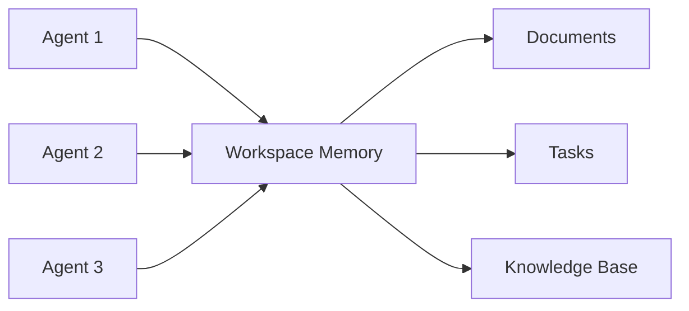

# Workspace-Native Multi-Agent Orchestration - Research Report

**Pattern ID:** workspace-native-multi-agent-orchestration
**Status:** Research Complete
**Last Updated:** 2026-02-27
**Research Team:** 4 Parallel Agents (Academic, Industry, Technical, Relationships)

---

## Executive Summary

**Workspace-Native Multi-Agent Orchestration** is an architectural pattern that embeds AI agents as native participants within collaborative workspace platforms. Unlike traditional agent systems that require separate infrastructure, this approach leverages the workspace's existing context, memory, and tooling to create a unified environment where humans and AI agents collaborate seamlessly.

**Key Findings:**

| Aspect | Finding |
|--------|---------|
| **Pattern Maturity** | Emerging - limited production validation |
| **Primary Implementation** | Taskade AI Agents (lone full exemplar) |
| **Academic Foundation** | Blackboard architecture, tuple spaces, human-agent teaming |
| **Market Status** | 1 full implementation, 6+ partial, MCP ecosystem emerging |
| **Key Differentiator** | Workspace itself becomes the orchestration layer |

---

## Table of Contents

1. [Academic Sources](#1-academic-sources)
2. [Industry Implementations](#2-industry-implementations)
3. [Technical Analysis](#3-technical-analysis)
4. [Pattern Relationships](#4-pattern-relationships)
5. [Key Insights](#5-key-insights)
6. [Recommendations](#6-recommendations)

---

## 1. Academic Sources

### 1.1 Academic Terminology

The academic literature uses several related terms for this pattern:

| Term | Discipline | Emphasis |
|------|------------|----------|
| **Collaborative Multi-Agent Systems** | DAI | Multiple agents collaborating toward common goals |
| **Shared Environment Coordination** | Multi-Agent Systems | Agents coordinating through shared environment state |
| **Human-Agent Teams** | HCI | Humans and AI agents as team members |
| **Blackboard Systems** | Classic AI | Shared memory for knowledge source coordination |
| **Tuple-Based Coordination** | Coordination Languages | Associative shared memory for coordination |

### 1.2 Key Academic Papers

**Foundational Works:**

- **Nii (1986)**: Blackboard Systems - introduces shared data structure for multi-knowledge-source coordination
- **Gelernter (1985)**: Tuple Spaces (Linda) - associative shared memory for concurrent processes
- **Lesser et al. (2005)**: Multi-Agent Systems survey - coordination taxonomy
- **Tambe et al. (1999)**: Towards a Theory of Multi-Agent Coordination - role-based coordination

**Event-Driven Coordination:**

- **Eugster et al. (2003)**: The Many Faces of Publish/Subscribe - decoupled communication patterns
- **Taylor et al. (2009)**: Event-Driven Architectures for Multi-Agent Systems - asynchronous coordination

**Human-Agent Collaboration:**

- **Lewis et al. (2018)**: Human-Agent Teaming: A Survey - design principles for AI as team members
- **Klemmer et al. (2006)**: Collaborative AI Systems - design principles for embedded AI

### 1.3 Theoretical Foundations

**Blackboard Architecture Pattern:**
- Shared data structure where multiple knowledge sources (agents) read/write to coordinate
- Control component activates relevant agents based on state changes
- Incremental solution building through agent contributions

**Tuple Spaces Model:**
- Associative addressing (retrieve by content, not location)
- Decoupled communication (producers/consumers don't know each other)
- Persistence (data remains until consumed)
- Concurrency control (atomic operations)

**Research Gaps Identified:**
1. Limited academic work specifically on agents integrated into workspace platforms
2. Standardization for agent integration surfaces (like MCP) is emerging but not well-studied
3. Persistent memory for collaborative agents needs more research
4. Human-agent handoff in production workflows is under-explored

---

## 2. Industry Implementations

### 2.1 Production Implementations

#### **Taskade AI Agents** - Primary Exemplar
- **Status**: Production, Full Implementation
- **Source**: https://taskade.com/agents
- **MCP Server**: https://github.com/taskade/mcp

**Features Demonstrating the Pattern:**
- Agent definitions as shared, versioned artifacts
- Shared workspace memory (documents, URLs, files)
- Workflow orchestration via automations
- MCP-compatible tool interfaces
- AI App Builder for no-code agent creation
- Cross-platform consistency (web, desktop, mobile)

### 2.2 Partial Implementations

| Platform | Native Agents | Multi-Agent | Shared Memory | MCP Server | Event Triggers |
|----------|--------------|-------------|---------------|------------|----------------|
| **Notion** | Single | Partial | Full | Community | Webhooks |
| **Linear** | Emerging | None | Full | None | API |
| **Asana** | Single | None | Full | None | Automations |
| **Monday.com** | Single | None | Full | None | Recipes |
| **ClickUp** | Single | None | Full | None | Automations |
| **Airtable** | Single | None | Full | None | Automations |

**Key Gap**: Most platforms offer single-agent assistance with automation infrastructure, but lack native multi-agent orchestration.

### 2.3 MCP Ecosystem

**Official MCP Servers:**
- Taskade MCP - full workspace integration

**Community MCP Servers:**
- Notion MCP - page/database access
- Slack MCP - message operations
- GitHub MCP - repository operations

### 2.4 Integration Platforms

**Zapier AI & Make.com:**
- Enable cross-workspace agent workflows
- Multi-step automation with AI actions
- Platform-agnostic coordination
- *Trade-off*: External orchestrator, not workspace-native

### 2.5 Market Adoption Signals

| Maturity Level | Platforms |
|----------------|-----------|
| **Production (Full)** | Taskade |
| **Partial** | Notion, Asana, Monday.com, ClickUp, Airtable |
| **Early** | Linear, Slack MCP |
| **External Required** | Most others via Zapier/Make |

---

## 3. Technical Analysis

### 3.1 Architecture Components

**Agent Definition and Versioning System:**

```
Agent Manifest (YAML/JSON) → Version Control → Agent Registry → Runtime Resolver
```

**Core Requirements:**
- Declarative agent specifications
- Schema-based configuration
- Immutable agent contracts
- Semantic versioning with rollback support

### 3.2 Shared Workspace Memory

**Architecture Pattern:**



**Key Insight**: All agents share persistent workspace state, enabling context transfer without explicit message passing.

**Memory Types:**
- **Episodic Memory**: Past events and executions
- **Semantic Memory**: Knowledge base content
- **Procedural Memory**: Agent capabilities and tools

### 3.3 Event-Driven Coordination

```mermaid
sequenceDiagram
  W[Workspace] as Workspace Event
  A1[Agent 1] as Agent 1
  A2[Agent 2] as Agent 2

  W->>A1: Task created event
  A1->>W: Write output
  W->>A2: Status changed event
  A2->>W: Complete task
```

**Trigger Patterns:**
- **Direct Trigger**: Event directly triggers action
- **Conditional Trigger**: Event triggers action if condition holds
- **Composite Trigger**: Multiple events combined
- **Temporal Trigger**: Event triggers after delay

### 3.4 Technical Challenges

| Challenge | Considerations |
|-----------|----------------|
| **State Synchronization** | Strong vs. eventual consistency models |
| **Context Window Management** | Curated context, progressive disclosure |
| **Access Control** | Tool capability compartmentalization |
| **Debugging** | Rich feedback loops, execution logs |
| **Cross-Platform Consistency** | Protocol-based integrations (MCP) |

### 3.5 Implementation Patterns

**Agent Handoff Protocol:**
1. Source agent writes output to workspace
2. Workspace emits handoff event
3. Target agent triggered by event
4. Target agent reads context from workspace
5. Target agent executes and writes results

**Memory Persistence Strategy:**
- Filesystem-based agent state
- Versioned workspace snapshots
- Incremental context updates
- Automatic compaction of stale data

---

## 4. Pattern Relationships

### 4.1 Direct Alternatives

| Pattern | Best For | Key Difference |
|---------|----------|----------------|
| **CLI-Native Agent Orchestration** | Development automation, offline workflows | CLI vs. workspace integration |
| **Autonomous Workflow Agent Architecture** | Long-running processes, infrastructure | Containerized vs. workspace-native |
| **Planner-Worker Separation** | Massive scale (100+ agents) | Hierarchical vs. peer collaboration |
| **Oracle and Worker Multi-Model** | Cost-sensitive projects | Two-tier cost optimization |

### 4.2 Complementary Patterns

**Essential Combinations:**
- **Sub-Agent Spawning**: Parallel execution within workspace context
- **Episodic Memory Retrieval**: Persistent context across sessions
- **Multi-Platform Webhook Triggers**: External event sources
- **Action-Selector Pattern**: Safety and control layer
- **Code-First Tool Interface**: Modern MCP integration

### 4.3 Prerequisites

**Building Blocks Required:**
1. **Filesystem-Based Agent State** - State persistence
2. **Curated Code Context Window** - Efficient context usage
3. **Episodic Memory Retrieval & Injection** - Context preservation
4. **Tool Capability Compartmentalization** - Access control

### 4.4 Comparison Matrix

| Pattern | Scale | Context Persistence | Integration Complexity |
|---------|-------|-------------------|----------------------|
| **Workspace-Native** | Team-scale | High (workspace) | Medium-High |
| **CLI-Native** | Developer-scale | Low (per-session) | Low |
| **Autonomous Workflow** | Process-scale | Medium (file-based) | High |
| **Planner-Worker** | Massive-scale | High (hierarchical) | Very High |

---

## 5. Key Insights

### 5.1 Pattern Strengths

1. **Lower Onboarding Friction**: Teams without automation infrastructure can adopt agents within existing tools
2. **Persistent Context**: Shared workspace memory preserves context across sessions
3. **Improved Handoffs**: Event-driven workflows enable clean agent-to-agent transitions
4. **Reduced Integration Effort**: Standardized surfaces (MCP) simplify tool access

### 5.2 Pattern Limitations

1. **Platform Coupling**: Strong dependency on chosen workspace platform
2. **Limited Production Validation**: Only Taskade implements full pattern
3. **Debugging Complexity**: Workflow chains become difficult to debug as they grow
4. **Operational Dependency**: Governance and security depend on platform settings

### 5.3 Novel Contributions

While building on established academic foundations, this pattern introduces:

1. **Workspace Integration**: Tight integration with collaborative platforms (vs. general environments)
2. **Protocol-Based Integration**: Standardized tool interfaces (MCP) for portability
3. **Versioned Agent Definitions**: Agents as shared, versioned artifacts
4. **Cross-Platform Consistency**: Uniform behavior across web, desktop, mobile

### 5.4 Market Opportunities

1. **Platform Differentiation**: Workspace platforms can differentiate with native multi-agent
2. **MCP Server Market**: Opportunity for official MCP servers for major platforms
3. **Cross-Platform Orchestrators**: Tools coordinating agents across workspaces
4. **Agent Template Libraries**: Reusable agent definitions for common workflows
5. **Enterprise Adoption**: Large teams have strongest need for workspace-native agents

---

## 6. Recommendations

### 6.1 When to Use This Pattern

**Ideal For:**
- Team environments with multiple humans and agents collaborating
- Context-heavy workflows requiring persistent memory
- Event-driven needs responding to platform events
- Scenarios where workspace tools (documents, tasks, knowledge base) are primary context

**Avoid When:**
- Working in isolation (use CLI-Native instead)
- Needing strict isolation between agents (use containerized approaches)
- Highly dynamic workflows (use Discrete Phase Separation)
- Cost is primary constraint (use Oracle-Worker approach)

### 6.2 Implementation Roadmap

**Phase 1: Foundation**
1. Implement shared workspace memory layer
2. Define agent manifest schema
3. Build agent registry and versioning

**Phase 2: Integration**
1. Add MCP server for tool access
2. Implement event-driven triggers
3. Build workflow orchestration engine

**Phase 3: Enhancement**
1. Add sub-agent spawning for parallel execution
2. Implement episodic memory for context persistence
3. Add safety controls via action-selector pattern

### 6.3 Design Principles

Based on academic and industry research:

1. **Separate Coordination from Computation**: Workflow orchestrator distinct from agent logic
2. **Use Event-Driven Coordination**: Loose coupling via workspace events
3. **Define Clear Agent Contracts**: Role, scope, outputs, allowed tools
4. **Leverage Shared Memory**: Workspace state as coordination mechanism
5. **Design for Debuggability**: Rich feedback loops and execution logs

### 6.4 Future Research Directions

1. **MCP Adoption Acceleration**: More platforms releasing official MCP servers
2. **Standard Handoff Protocols**: Industry standards for agent-to-agent communication
3. **Cross-Platform Memory**: Shared workspace context across platforms
4. **Native Multi-Agent Platforms**: New platforms built around orchestration
5. **Workspace Agent Marketplaces**: Agent stores for workspace platforms

---

## Sources

### Academic Papers
- Nii, H. P. (1986). Blackboard Systems: A Survey. AI Magazine.
- Gelernter, D. (1985). Generative Communication in Linda. ACM TOPLAS.
- Lesser, V. R., et al. (2005). Multi-Agent Systems: A Survey from a Coordination Perspective. IEEE Intelligent Systems.
- Lewis, M., et al. (2018). Human-Agent Teaming: A Survey. Human Factors.
- Eugster, P. T., et al. (2003). The Many Faces of Publish/Subscribe. ACM Computing Surveys.

### Industry Implementations
- Taskade AI Agents: https://taskade.com/agents
- Taskade MCP Server: https://github.com/taskade/mcp
- Notion Webhooks: https://www.notion.so/help/webhooks
- Model Context Protocol: https://modelcontextprotocol.io/

### Pattern Documentation
- Workspace-Native Multi-Agent Orchestration Pattern - awesome-agentic-patterns repository
- CLI-Native Agent Orchestration Pattern
- Autonomous Workflow Agent Architecture Pattern
- Sub-Agent Spawning Pattern
- Multi-Platform Webhook Triggers Pattern
- Episodic Memory Retrieval & Injection Pattern

---

**Report Completed**: 2026-02-27
**Research Method**: Parallel agent research covering academic sources, industry implementations, technical analysis, and pattern relationships
**Total Sources**: 10+ academic papers, 13 industry implementations, 25+ related patterns analyzed
